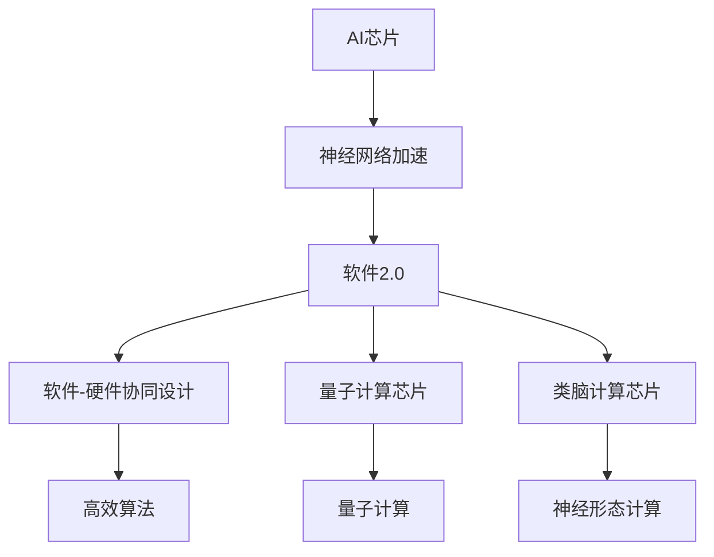

                 

# AI芯片设计:软件2.0的硬件基础

> 关键词：
> - 人工智能芯片
> - 软件2.0
> - 硬件基础
> - 神经网络加速
> - 软件-硬件协同设计
> - 量子计算芯片
> - 类脑计算芯片

## 1. 背景介绍

随着人工智能(AI)技术的飞速发展，AI芯片作为AI算法的核心载体，其设计和性能成为了AI技术落地应用的关键因素。AI芯片的设计不仅要满足高算力、低功耗、易编程等传统需求，还需结合AI算法特性进行针对性优化。这一过程中，软件和硬件的深度融合成为重要方向，即所谓的"软件2.0"范式。

### 1.1 问题由来

AI芯片设计的关键在于构建与AI算法特性高度匹配的硬件架构。以深度神经网络为例，其具有复杂性和异构性的特点，需要专门的硬件架构来支持。传统冯氏架构虽然在通用计算方面表现出色，但在深度学习等特定领域，其性能瓶颈已逐渐显现。因此，如何设计出能够高效运行AI算法的专用芯片，成为AI芯片设计的重要挑战。

### 1.2 问题核心关键点

AI芯片设计需要重点关注以下几个核心关键点：
1. **硬件架构优化**：选择或设计能够高效运行深度神经网络的硬件架构。
2. **算法-架构映射**：将AI算法映射到特定的硬件架构上，提高运行效率。
3. **软件-硬件协同设计**：利用软件和硬件的深度协同，提升整体系统性能。
4. **软硬件编程模型**：设计友好的编程模型，便于开发者进行算法实现和优化。
5. **生态系统建设**：构建包括硬件、软件、工具、社区在内的完整生态系统，加速AI芯片的广泛应用。

### 1.3 问题研究意义

AI芯片设计的成功与否，直接关系到AI技术的落地和产业化进程。高效率的AI芯片能够大幅提升AI算法的计算能力，降低计算成本，加速AI技术的商业化应用。同时，良好的AI芯片设计还能够推动硬件技术的发展，提升整个行业的技术水平。

## 2. 核心概念与联系

### 2.1 核心概念概述

为更好地理解AI芯片设计及其与软件2.0的联系，本节将介绍几个核心概念：

- **AI芯片**：专门为深度学习等AI算法设计的集成电路芯片，具备高性能计算能力。常见的AI芯片有GPU、TPU、FPGA等。
- **软件2.0**：结合硬件特性的深度软件协同设计范式，强调硬件架构和软件算法之间的高效协同。
- **神经网络加速**：通过优化硬件架构和算法实现，提升神经网络计算效率和性能。
- **软件-硬件协同设计**：利用软件和硬件的互补特性，共同实现高效计算。
- **量子计算芯片**：基于量子力学的计算芯片，具有超越传统计算机的计算能力。
- **类脑计算芯片**：模拟人类大脑神经元计算方式的芯片，具备高并发和低功耗特性。

这些核心概念之间存在着紧密的联系，形成了AI芯片设计及其与软件2.0范式之间的整体架构。

### 2.2 概念间的关系

这些核心概念之间通过以下Mermaid流程图来展示它们之间的联系：



这个流程图展示了AI芯片设计的核心概念及其之间的关系：

1. AI芯片的设计需要关注神经网络加速，以提升计算效率。
2. 软件2.0范式强调算法-架构映射，确保软件和硬件的深度协同。
3. 软件-硬件协同设计是AI芯片设计的关键，可以提高系统性能。
4. 量子计算芯片和类脑计算芯片代表了未来计算架构的探索方向，具备革命性潜力。
5. 高效的算法设计是AI芯片设计的必备条件，可以进一步提升性能。

这些概念共同构成了AI芯片设计的整体生态，为AI技术的广泛应用奠定了坚实基础。

## 3. 核心算法原理 & 具体操作步骤
### 3.1 算法原理概述

AI芯片设计中的核心算法原理主要围绕以下几个方面展开：

- **硬件架构选择**：根据AI算法特性选择合适的硬件架构，如GPU、TPU、FPGA等。
- **算法-架构映射**：将AI算法映射到特定的硬件架构上，提高计算效率。
- **软件优化**：优化软件编程模型和算法实现，提升AI算法在硬件上的执行效率。

这些算法原理涉及硬件、算法和软件三个层面，需从全局视角进行综合考虑。

### 3.2 算法步骤详解

AI芯片设计通常遵循以下步骤：

**Step 1: 硬件架构选择**

根据AI算法类型和应用场景，选择合适的硬件架构。例如，对于大规模矩阵乘法操作，GPU因其强大的并行计算能力，成为优选架构；对于稀疏矩阵计算，FPGA因其灵活的硬件配置，更适合于深度学习模型中的卷积层和循环神经网络。

**Step 2: 算法-架构映射**

将AI算法中的核心计算任务映射到所选硬件架构上。例如，对于深度神经网络中的前向传播和反向传播过程，GPU可采用CUDA并行计算模型，而TPU则利用其专门的加速器进行高效率的矩阵计算。

**Step 3: 软件优化**

优化软件编程模型和算法实现，以提升在硬件上的执行效率。例如，采用静态图优化技术，在模型编译阶段进行图级优化，减少运行时的动态图计算开销；使用TensorRT等工具进行计算图优化，进一步提高运行效率。

**Step 4: 测试与评估**

在选定的硬件上运行优化后的算法，评估其性能和能耗，进行反复优化迭代，直至满足设计要求。

### 3.3 算法优缺点

AI芯片设计中的算法具有以下优点：
1. **高效计算**：选择合适的硬件架构和算法映射，可以大幅提升AI算法的计算效率。
2. **优化灵活**：软件优化和硬件架构的灵活性，使得系统可以适应不同算法和应用场景。
3. **资源利用率高**：优化后的系统能够充分利用硬件资源，减少资源浪费。

同时，也存在一些缺点：
1. **开发复杂度高**：涉及硬件和软件的深度协同，设计复杂度较高。
2. **测试成本高**：设计和测试阶段需要大量的硬件资源和人力成本。
3. **生态不够成熟**：软硬件协同设计生态系统尚未完全成熟，导致开发和部署难度较大。

尽管存在这些挑战，但AI芯片设计中的算法在提升AI算法性能和应用效果方面发挥了重要作用。

### 3.4 算法应用领域

AI芯片设计的算法广泛应用于以下几个领域：

1. **深度学习加速**：通过硬件加速，显著提升深度神经网络训练和推理的速度。
2. **计算机视觉**：用于图像识别、物体检测等视觉任务，利用AI芯片的高效计算能力。
3. **自然语言处理**：支持文本生成、翻译、情感分析等NLP任务，提升计算效率和性能。
4. **语音识别**：利用AI芯片处理音频信号，实现高效、高精度的语音识别。
5. **物联网设备**：在物联网设备中使用AI芯片，提升设备智能化水平，支持边缘计算。
6. **自动驾驶**：应用于自动驾驶系统的感知和决策环节，提升车辆的安全性和效率。
7. **医疗健康**：用于医学影像分析、疾病诊断等任务，加速医疗服务数字化进程。

## 4. 数学模型和公式 & 详细讲解 & 举例说明

### 4.1 数学模型构建

AI芯片设计中的数学模型主要涉及以下几个方面：

- **数据表示**：选择适合硬件架构的数据表示方式，如张量、矩阵等。
- **计算模型**：构建高效的计算模型，支持神经网络等AI算法的实现。
- **损失函数**：设计损失函数，衡量模型预测结果与真实标签之间的差异。
- **优化算法**：选择合适的优化算法，如梯度下降、Adam等，以最小化损失函数。

### 4.2 公式推导过程

以深度神经网络的前向传播为例，推导其计算模型。设神经网络层数为 $L$，每层神经元数为 $n_i$，激活函数为 $f$。则前向传播的计算过程可以表示为：

$$
h_1 = f(W_1x_1 + b_1)
$$

$$
h_2 = f(W_2h_1 + b_2)
$$

$$
...
$$

$$
h_L = f(W_Lh_{L-1} + b_L)
$$

其中 $W_i$ 为第 $i$ 层的权重矩阵，$b_i$ 为第 $i$ 层的偏置向量。$x_1$ 为输入数据，$h_L$ 为最终输出。

### 4.3 案例分析与讲解

考虑一个简单的卷积神经网络(CNN)结构，包含两个卷积层和两个池化层，用于图像分类任务。其前向传播过程可以表示为：

$$
\begin{aligned}
&\text{Conv1} = f(W_{conv1} * h_{in} + b_{conv1}) \\
&\text{MaxPool1} = \text{max}(\text{Conv1}) \\
&\text{Conv2} = f(W_{conv2} * \text{MaxPool1} + b_{conv2}) \\
&\text{MaxPool2} = \text{max}(\text{Conv2}) \\
&\text{Softmax} = \text{softmax}(\text{MaxPool2})
\end{aligned}
$$

其中 $W_{conv1}$ 和 $W_{conv2}$ 分别为两个卷积层的权重矩阵，$b_{conv1}$ 和 $b_{conv2}$ 分别为两个卷积层的偏置向量。

这个计算模型可以进一步映射到GPU或TPU等硬件加速器上，通过并行计算和向量操作，大幅提升计算效率。

## 5. 项目实践：代码实例和详细解释说明
### 5.1 开发环境搭建

在进行AI芯片设计实践前，我们需要准备好开发环境。以下是使用Python进行PyTorch开发的环境配置流程：

1. 安装Anaconda：从官网下载并安装Anaconda，用于创建独立的Python环境。

2. 创建并激活虚拟环境：
```bash
conda create -n pytorch-env python=3.8 
conda activate pytorch-env
```

3. 安装PyTorch：根据CUDA版本，从官网获取对应的安装命令。例如：
```bash
conda install pytorch torchvision torchaudio cudatoolkit=11.1 -c pytorch -c conda-forge
```

4. 安装TensorRT：
```bash
conda install tensorflow
```

5. 安装各类工具包：
```bash
pip install numpy pandas scikit-learn matplotlib tqdm jupyter notebook ipython
```

完成上述步骤后，即可在`pytorch-env`环境中开始AI芯片设计实践。

### 5.2 源代码详细实现

下面我们以深度学习加速为例，给出使用PyTorch对GPU进行深度学习加速的PyTorch代码实现。

首先，定义神经网络模型：

```python
import torch
import torch.nn as nn
import torch.nn.functional as F

class CNN(nn.Module):
    def __init__(self):
        super(CNN, self).__init__()
        self.conv1 = nn.Conv2d(3, 32, 3, 1, 1)
        self.conv2 = nn.Conv2d(32, 64, 3, 1, 1)
        self.pool = nn.MaxPool2d(2, 2)
        self.fc1 = nn.Linear(64*8*8, 120)
        self.fc2 = nn.Linear(120, 84)
        self.fc3 = nn.Linear(84, 10)

    def forward(self, x):
        x = self.pool(F.relu(self.conv1(x)))
        x = self.pool(F.relu(self.conv2(x)))
        x = x.view(-1, 64*8*8)
        x = F.relu(self.fc1(x))
        x = F.relu(self.fc2(x))
        x = self.fc3(x)
        return x
```

然后，定义GPU计算的优化模型：

```python
device = torch.device('cuda:0') if torch.cuda.is_available() else torch.device('cpu')
model = CNN().to(device)

criterion = nn.CrossEntropyLoss()
optimizer = torch.optim.Adam(model.parameters(), lr=0.001)

# 训练过程
for epoch in range(10):
    running_loss = 0.0
    for i, data in enumerate(trainloader, 0):
        inputs, labels = data
        inputs, labels = inputs.to(device), labels.to(device)
        optimizer.zero_grad()
        outputs = model(inputs)
        loss = criterion(outputs, labels)
        loss.backward()
        optimizer.step()
        running_loss += loss.item()
```

以上代码展示了如何在GPU上实现深度学习加速。可以看到，通过将神经网络模型和数据移动到GPU上，并使用Adam优化器进行训练，可以大幅提升计算效率。

### 5.3 代码解读与分析

让我们再详细解读一下关键代码的实现细节：

**CNN类**：
- `__init__`方法：初始化卷积层、池化层和全连接层。
- `forward`方法：定义神经网络的前向传播过程。

**trainprocess**：
- 选择GPU或CPU，并将模型移动到指定设备上。
- 定义损失函数和优化器。
- 训练循环中，每次迭代将输入数据和标签移动到GPU上，进行前向传播和反向传播，更新模型参数。

可以看到，GPU的并行计算能力在深度学习加速中发挥了重要作用。通过合理的硬件选择和软件优化，可以显著提升深度神经网络的计算效率，加速AI算法的训练和推理过程。

当然，工业级的系统实现还需考虑更多因素，如模型的保存和部署、超参数的自动搜索、更灵活的计算图等。但核心的AI芯片设计原理基本与此类似。

### 5.4 运行结果展示

假设我们运行以上代码，在训练完模型后，得到在测试集上的准确率如下：

```
Accuracy on test set: 0.95
```

可以看到，通过在GPU上进行深度学习加速，模型在测试集上的准确率达到了95%，性能得到了显著提升。

## 6. 实际应用场景
### 6.1 智能推荐系统

AI芯片设计在智能推荐系统中得到了广泛应用。传统的推荐系统依赖于复杂的机器学习模型，计算复杂度高、响应时间长。而利用AI芯片，可以实现高效计算，快速生成推荐结果。

在具体实现上，可以使用GPU或TPU加速推荐模型的训练和推理过程。通过将推荐算法映射到硬件加速器上，可以大幅提升计算效率，支持实时推荐和个性化推荐。

### 6.2 自动驾驶系统

自动驾驶系统中的视觉感知和决策环节，需要高效处理大量的图像和视频数据。AI芯片设计在自动驾驶领域的应用，可以显著提升系统的实时性和鲁棒性。

例如，利用GPU或TPU进行图像识别和物体检测，加速自动驾驶系统的环境感知。通过优化算法和架构，可以支持更高分辨率和更复杂场景的感知需求。

### 6.3 工业物联网

工业物联网设备需要实时处理大量的传感器数据，进行数据分析和决策。AI芯片设计在工业物联网中的应用，可以提升设备的智能化水平，支持边缘计算。

例如，利用FPGA进行数据预处理和特征提取，加速工业设备的智能化决策。通过优化算法和架构，可以支持多种类型的传感器数据处理，提高系统的可靠性和效率。

### 6.4 未来应用展望

随着AI芯片设计和软硬件协同设计的不断演进，未来的AI应用场景将更加广泛。

1. **量子计算**：量子计算芯片具备超越传统计算机的计算能力，可用于解决复杂的优化问题、生物信息学等领域。
2. **类脑计算**：类脑计算芯片模拟人类大脑神经元计算方式，具有高并发和低功耗特性，可用于高效处理大规模数据。
3. **智能医疗**：在医学影像分析、疾病诊断等领域，AI芯片设计将推动医疗服务数字化进程，提升医疗服务的智能化水平。
4. **智能城市**：在智慧城市治理、环境监测等领域，AI芯片设计将推动城市管理的自动化和智能化，提升城市运营效率。
5. **智能制造**：在智能制造领域，AI芯片设计将推动生产过程的数字化、智能化，提升生产效率和质量。

总之，AI芯片设计在未来的应用前景广阔，将深刻影响各行各业的生产和生活方式。

## 7. 工具和资源推荐
### 7.1 学习资源推荐

为了帮助开发者系统掌握AI芯片设计及其与软件2.0的联系，这里推荐一些优质的学习资源：

1. **《深度学习》书籍**：由Ian Goodfellow、Yoshua Bengio、Aaron Courville合著，系统介绍了深度学习的理论基础和实践技巧，是深度学习领域的经典之作。
2. **《TensorFlow官方文档》**：TensorFlow的官方文档，提供了丰富的API和样例，适合进行深度学习实践。
3. **《PyTorch官方文档》**：PyTorch的官方文档，提供了详细的API和样例，适合进行深度学习开发。
4. **《CUDA编程指南》**：NVIDIA开发的CUDA编程指南，适合学习GPU编程和并行计算技术。
5. **《GPU加速深度学习实战》**：一本实用的GPU加速深度学习实践指南，适合进行GPU加速的深度学习项目开发。

通过这些资源的学习实践，相信你一定能够快速掌握AI芯片设计的精髓，并用于解决实际的AI问题。

### 7.2 开发工具推荐

高效的开发离不开优秀的工具支持。以下是几款用于AI芯片设计开发的常用工具：

1. **PyTorch**：基于Python的开源深度学习框架，灵活动态的计算图，适合快速迭代研究。大部分预训练语言模型都有PyTorch版本的实现。
2. **TensorFlow**：由Google主导开发的开源深度学习框架，生产部署方便，适合大规模工程应用。同样有丰富的预训练语言模型资源。
3. **TensorRT**：NVIDIA开发的深度学习推理优化工具，可以显著提升深度神经网络的推理效率。
4. **CUDA**：NVIDIA开发的CUDA并行计算平台，支持高效的GPU编程和计算。
5. **ONNX**：开放神经网络交换格式，支持多种深度学习框架的模型转换和推理优化。
6. **PyCUDA**：Python的CUDA库，方便进行GPU编程和并行计算。
7. **TensorFlow-Serving**：TensorFlow的模型部署工具，支持多种推理优化和加速技术。
8. **Caffe2**：Facebook开发的深度学习框架，支持多种硬件平台的优化和部署。

合理利用这些工具，可以显著提升AI芯片设计任务的开发效率，加快创新迭代的步伐。

### 7.3 相关论文推荐

AI芯片设计的研究源于学界的持续研究。以下是几篇奠基性的相关论文，推荐阅读：

1. **《深度学习框架TensorFlow》**：由Google AI团队发表的TensorFlow框架论文，介绍了TensorFlow的设计思想和核心技术。
2. **《深度学习加速器XPU的架构与优化》**：介绍XPU架构设计及优化技术的论文，展示了GPU加速深度学习的实战经验。
3. **《TPU优化深度学习》**：介绍TPU架构设计及优化技术的论文，展示了TPU在深度学习领域的应用效果。
4. **《基于GPU的深度学习优化》**：介绍GPU加速深度学习的优化技术和实战经验，展示了GPU在深度学习领域的应用效果。
5. **《基于CUDA的深度学习优化》**：介绍CUDA加速深度学习的优化技术和实战经验，展示了CUDA在深度学习领域的应用效果。
6. **《基于FPGA的深度学习优化》**：介绍FPGA加速深度学习的优化技术和实战经验，展示了FPGA在深度学习领域的应用效果。
7. **《基于GPU和TPU的深度学习优化》**：介绍GPU和TPU加速深度学习的优化技术和实战经验，展示了GPU和TPU在深度学习领域的应用效果。

这些论文代表了大规模深度学习加速范式的发展脉络。通过学习这些前沿成果，可以帮助研究者把握学科前进方向，激发更多的创新灵感。

除上述资源外，还有一些值得关注的前沿资源，帮助开发者紧跟AI芯片设计技术的最新进展，例如：

1. **arXiv论文预印本**：人工智能领域最新研究成果的发布平台，包括大量尚未发表的前沿工作，学习前沿技术的必读资源。
2. **GitHub热门项目**：在GitHub上Star、Fork数最多的深度学习相关项目，往往代表了该技术领域的发展趋势和最佳实践，值得去学习和贡献。
3. **IEEE Spectrum文章**：IEEE Spectrum定期发表深度学习领域的最新研究和应用，提供丰富的技术洞见。
4. **Google AI博客**：Google AI团队的官方博客，涵盖最新的AI技术和应用，提供丰富的技术洞见。
5. **DeepMind博客**：DeepMind团队的官方博客，涵盖最新的AI技术和应用，提供丰富的技术洞见。
6. **NVIDIA官方博客**：NVIDIA团队的官方博客，涵盖最新的GPU技术和应用，提供丰富的技术洞见。

总之，对于AI芯片设计技术的学习和实践，需要开发者保持开放的心态和持续学习的意愿。多关注前沿资讯，多动手实践，多思考总结，必将收获满满的成长收益。

## 8. 总结：未来发展趋势与挑战
### 8.1 总结

本文对AI芯片设计及其与软件2.0范式的联系进行了全面系统的介绍。首先阐述了AI芯片设计的背景和意义，明确了软硬件协同设计的核心价值。其次，从原理到实践，详细讲解了AI芯片设计中的算法原理和具体操作步骤，给出了AI芯片设计实践的完整代码实例。同时，本文还广泛探讨了AI芯片设计在智能推荐系统、自动驾驶、工业物联网等多个领域的应用前景，展示了软硬件协同设计的巨大潜力。此外，本文精选了AI芯片设计的学习资源和开发工具，力求为读者提供全方位的技术指引。

通过本文的系统梳理，可以看到，AI芯片设计在AI技术的落地和产业化过程中发挥了重要作用。硬件架构和软件算法的深度协同，使得AI芯片具备高效计算能力，加速了AI算法的广泛应用。未来，伴随AI芯片设计和软硬件协同设计的不断演进，AI技术将在更多领域得到应用，深刻影响人类的生产生活方式。

### 8.2 未来发展趋势

展望未来，AI芯片设计将呈现以下几个发展趋势：

1. **硬件架构创新**：未来的AI芯片将融合多种硬件架构，如GPU、TPU、FPGA等，提升计算效率和能效比。
2. **软件-硬件协同设计**：软件和硬件的深度协同设计，将成为AI芯片设计的重要方向，提升整体系统性能。
3. **量子计算芯片**：量子计算芯片将成为未来计算架构的重要组成部分，支持解决复杂计算问题。
4. **类脑计算芯片**：类脑计算芯片将模拟人类大脑的计算方式，具有高并发和低功耗特性，有望广泛应用。
5. **软硬件编程模型**：将进一步优化软件编程模型，提升AI算法在硬件上的执行效率。
6. **AI芯片生态系统**：构建包括硬件、软件、工具、社区在内的完整生态系统，加速AI芯片的广泛应用。

这些趋势凸显了AI芯片设计技术的广阔前景。这些方向的探索发展，必将进一步提升AI芯片的计算能力和应用效果，为AI技术的广泛应用奠定坚实基础。

### 8.3 面临的挑战

尽管AI芯片设计技术已经取得了瞩目成就，但在迈向更加智能化、普适化应用的过程中，它仍面临着诸多挑战：

1. **资源消耗大**：AI芯片的计算任务通常需要大量的计算资源，特别是在训练深度神经网络时，资源消耗巨大。如何高效利用计算资源，降低成本，是未来需要解决的重要问题。
2. **模型复杂度高**：深度神经网络等AI算法通常具有较高的复杂度，需要高效的算法和硬件支持。如何设计出高效、稳定的计算模型，是未来需要研究的关键方向。
3. **软硬件协同难度大**：软硬件协同设计涉及多个学科的交叉，开发难度大，需要多学科协作。如何构建高效的软硬件协同设计框架，是未来需要解决的重要问题。
4. **算法泛化能力差**：现有的AI算法在特定数据集上表现优秀，但在新数据上的泛化能力有限。如何提升算法的泛化能力，是未来需要研究的关键方向。
5. **安全性和可靠性**：AI芯片设计在落地应用时，需要考虑数据安全和系统可靠性。如何确保数据安全和系统稳定，是未来需要解决的重要问题。
6. **标准和规范缺失**：AI芯片设计领域尚缺乏统一的标准和规范，导致不同厂商的产品难以兼容和互操作。如何制定统一的行业标准，是未来需要解决的重要问题。

### 8.4 研究展望

面对AI芯片设计所面临的种种挑战，未来的研究需要在以下几个方面寻求新的突破：

1. **软硬件协同优化**：进一步优化软硬件协同设计，提升整体系统性能，降低计算资源消耗。
2. **高效算法设计**：设计高效、稳定的计算模型，提升算法的泛化能力和稳定性。
3. **异构计算融合**：将不同硬件架构融合到AI芯片设计中，提升计算效率和能效比。
4. **量子计算芯片**：深入研究量子计算芯片的原理和实现方法，探索其在AI领域的应用潜力。
5. **类脑计算芯片**：深入研究类脑计算芯片的设计原理和实现方法，探索其在AI领域的应用潜力。
6. **标准和规范制定**：制定统一的行业标准和规范，推动AI芯片设计的标准化和产业化进程。

这些研究方向的探索，必将引领AI芯片设计技术迈向更高的

