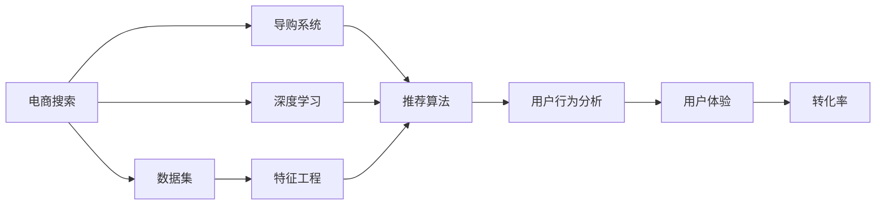
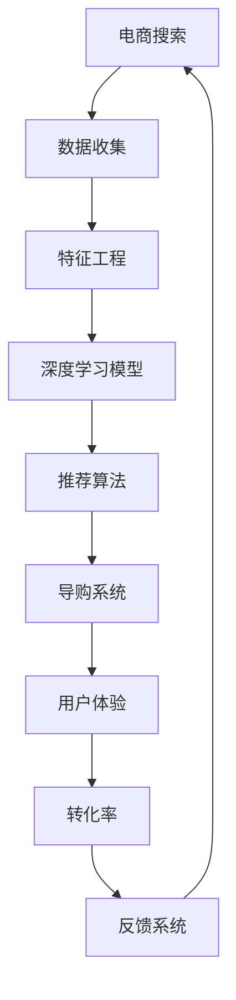

                 

# AI赋能电商搜索导购：提升用户体验和转化率的实践案例

> 关键词：电商搜索,导购系统,人工智能,推荐算法,深度学习,用户行为分析,用户体验,转化率

## 1. 背景介绍

### 1.1 问题由来
在电商行业，搜索导购系统的用户体验和转化率是商家关注的重点。优秀的搜索导购系统能够帮助用户快速找到心仪的商品，提升购物体验，增加转化率。随着人工智能和大数据技术的快速发展，越来越多的电商企业开始采用AI技术，优化搜索导购系统，实现个性化推荐，提升用户体验。

### 1.2 问题核心关键点
电商搜索导购系统的主要挑战在于：
- 如何理解用户查询意图，提供精准的搜索结果。
- 如何在搜索结果中推荐个性化商品，提升用户满意度。
- 如何实时分析用户行为，优化推荐算法。
- 如何评估推荐系统的性能，提升用户转化率。

这些问题直接关系到电商企业的销售业绩和用户体验。AI技术的引入为解决这些问题提供了新的思路和方法，本文将重点介绍基于深度学习推荐算法和用户行为分析的电商搜索导购系统。

### 1.3 问题研究意义
电商搜索导购系统的AI优化，不仅能够提升用户体验和转化率，还能减少人工干预，降低运营成本。此外，AI技术的引入还可以帮助商家更好地理解用户需求，优化库存管理，提高运营效率。因此，AI赋能电商搜索导购系统具有重要的研究和应用价值。

## 2. 核心概念与联系

### 2.1 核心概念概述

为了更好地理解电商搜索导购系统的AI优化方法，本节将介绍几个关键概念：

- **电商搜索**：电商企业中用于帮助用户找到所需商品的搜索功能。电商搜索的目的是通过关键词匹配，快速定位商品信息。

- **导购系统**：在搜索结果的基础上，进一步推荐用户可能感兴趣的商品，提升用户购买决策的概率。

- **推荐算法**：根据用户历史行为和商品属性，通过机器学习模型预测用户对商品的可能偏好，从而实现个性化推荐。

- **深度学习**：一种通过多层神经网络模型进行学习的技术，适用于处理复杂的数据模式和特征提取。

- **用户行为分析**：通过对用户搜索、浏览、点击、购买等行为的记录和分析，了解用户偏好，优化推荐系统。

- **用户体验**：用户在电商搜索导购系统中的满意度，包括响应速度、搜索结果的相关性、商品推荐的准确性等。

- **转化率**：用户在电商平台上完成购买行为的比例，反映了电商搜索导购系统的实际效果。

这些核心概念之间通过电商搜索导购系统紧密联系，形成一个闭环的AI优化框架。电商搜索导购系统通过深度学习和用户行为分析，实现个性化推荐，提升用户体验和转化率。

### 2.2 概念间的关系

电商搜索导购系统的AI优化框架如图：



这个图展示了电商搜索导购系统AI优化的各个环节及其相互关系。电商搜索通过深度学习技术，提取用户输入的查询关键词，并匹配到相应的商品信息。导购系统进一步基于推荐算法，根据用户历史行为和商品属性，推荐个性化的商品。用户行为分析通过用户互动数据，了解用户偏好，优化推荐算法。最终，用户体验和转化率得到提升。

### 2.3 核心概念的整体架构

电商搜索导购系统的AI优化整体架构如图：



这个架构展示了电商搜索导购系统AI优化的各个组件及其相互关系。数据收集和特征工程为深度学习模型提供数据支撑。深度学习模型通过推荐算法，生成个性化推荐结果。导购系统根据推荐结果展示商品信息。用户体验和转化率通过反馈系统，提供优化方向。整个架构形成一个闭环，不断迭代优化。

## 3. 核心算法原理 & 具体操作步骤
### 3.1 算法原理概述

电商搜索导购系统的AI优化，主要基于深度学习推荐算法和用户行为分析。其核心思想是：通过深度学习模型提取用户查询意图和商品特征，结合用户历史行为数据，利用推荐算法生成个性化商品推荐，提升用户体验和转化率。

具体来说，深度学习推荐算法通过学习用户历史行为和商品属性，预测用户对不同商品的兴趣和偏好，从而实现个性化推荐。用户行为分析通过对用户搜索、浏览、点击、购买等行为的记录和分析，了解用户偏好，优化推荐算法。

### 3.2 算法步骤详解

电商搜索导购系统的AI优化主要分为以下步骤：

**Step 1: 数据收集与预处理**

- 收集用户搜索历史、浏览记录、点击行为、购买历史等数据。
- 对数据进行清洗、去重、归一化等预处理操作。

**Step 2: 特征工程**

- 从原始数据中提取有意义的特征，如商品价格、评分、描述、类别、用户历史行为等。
- 使用PCA、LDA等降维技术，降低特征维度。

**Step 3: 深度学习模型训练**

- 使用深度学习模型（如CNN、RNN、Transformer等）训练用户行为预测模型。
- 使用交叉验证、超参数调优等技术，提高模型性能。

**Step 4: 推荐算法生成**

- 将用户查询输入到深度学习模型中，提取查询意图。
- 根据用户历史行为和商品属性，使用推荐算法生成个性化商品推荐。

**Step 5: 导购系统展示**

- 在搜索结果的基础上，展示推荐商品信息，供用户选择。
- 动态调整推荐算法参数，优化推荐效果。

**Step 6: 用户体验评估**

- 实时监控用户点击、浏览、购买等行为，评估用户体验。
- 根据用户行为反馈，优化推荐算法。

**Step 7: 持续优化**

- 持续收集用户反馈数据，进行模型迭代优化。
- 定期评估推荐系统性能，更新推荐算法。

### 3.3 算法优缺点

电商搜索导购系统的AI优化方法具有以下优点：

- 基于深度学习推荐算法，能够处理复杂的数据模式，实现个性化推荐。
- 结合用户行为分析，能够实时优化推荐算法，提升用户体验。
- 提升用户转化率，为电商企业带来更高的销售业绩。

同时，该方法也存在以下缺点：

- 需要大量标注数据，数据收集和预处理成本较高。
- 深度学习模型复杂，训练和部署成本较高。
- 需要实时监控用户行为，数据存储和处理要求较高。

### 3.4 算法应用领域

电商搜索导购系统的AI优化方法可以广泛应用于以下领域：

- **在线零售**：帮助用户找到合适的商品，提升购物体验和转化率。
- **电商APP**：在搜索结果中展示个性化推荐，优化用户购物流程。
- **跨境电商**：通过深度学习模型和用户行为分析，优化推荐系统，提高用户满意度。
- **企业级采购**：为采购部门提供个性化推荐，提升采购效率。
- **内容推荐**：在电商平台中推荐相关商品或内容，提升用户粘性。

## 4. 数学模型和公式 & 详细讲解  
### 4.1 数学模型构建

电商搜索导购系统的AI优化主要基于深度学习推荐算法。设用户历史行为为 $x_i \in R^n$，商品属性为 $y_i \in R^m$，用户对商品 $j$ 的评分 $r_{ij}$ 为实数。电商搜索导购系统目标是最小化预测评分与实际评分之间的误差：

$$
\min_{\theta} \sum_{i=1}^{N} \sum_{j=1}^{M} (r_{ij} - \hat{r}_{ij})^2
$$

其中，$\theta$ 为深度学习模型的参数，$\hat{r}_{ij}$ 为预测评分。

### 4.2 公式推导过程

以协同过滤推荐算法为例，其基本思想是利用用户对相似物品的评分，预测用户对未评分物品的评分。假设用户 $u$ 对商品 $i$ 和 $j$ 的评分分别为 $r_{ui}$ 和 $r_{uj}$，商品 $i$ 和 $j$ 的评分矩阵为 $R$，用户与商品相似度矩阵为 $P$，协同过滤算法公式为：

$$
\hat{r}_{uj} = \hat{r}_{ui} + \alpha \sum_{i=1}^{N} (P_{ij} - \frac{1}{M} \sum_{i=1}^{M} P_{ij}) (\hat{r}_{i} - \bar{r})
$$

其中，$\hat{r}_{uj}$ 为预测评分，$\hat{r}_{ui}$ 为已评分物品的评分，$P_{ij}$ 为商品 $i$ 和 $j$ 的相似度，$\alpha$ 为系数，$\hat{r}_{i}$ 为商品 $i$ 的平均评分，$\bar{r}$ 为所有评分的平均值。

### 4.3 案例分析与讲解

以Amazon电商平台的推荐系统为例，其协同过滤算法流程如图：


这个图展示了Amazon推荐系统的协同过滤算法流程。首先，收集用户历史行为数据，生成用户画像。接着，收集商品属性数据，生成商品画像。然后，根据用户行为和商品属性，计算用户和商品之间的相似度。最后，根据相似度预测用户对商品的评分，生成推荐结果。

## 5. 项目实践：代码实例和详细解释说明
### 5.1 开发环境搭建

在进行电商搜索导购系统的AI优化实践前，我们需要准备好开发环境。以下是使用Python进行TensorFlow开发的开发环境配置流程：

1. 安装Anaconda：从官网下载并安装Anaconda，用于创建独立的Python环境。

2. 创建并激活虚拟环境：
```bash
conda create -n tf-env python=3.8 
conda activate tf-env
```

3. 安装TensorFlow：根据CUDA版本，从官网获取对应的安装命令。例如：
```bash
conda install tensorflow -c pytorch -c conda-forge
```

4. 安装TensorFlow Addons：用于增强TensorFlow的高级功能，如TensorFlow Datasets、TensorFlow Extended等。

5. 安装Flask：用于搭建API服务，方便前后端协作。

6. 安装Tkinter：用于开发图形界面。

7. 安装Pandas、NumPy等常用库。

完成上述步骤后，即可在`tf-env`环境中开始AI优化实践。

### 5.2 源代码详细实现

这里我们以Amazon电商平台的协同过滤推荐系统为例，给出使用TensorFlow和Keras实现推荐算法的PyTorch代码实现。

首先，定义协同过滤推荐算法的代码：

```python
import tensorflow as tf
from tensorflow.keras.layers import Input, Embedding, Dot, Dense

# 定义输入层
user_input = Input(shape=(num_users, ), name='user')
item_input = Input(shape=(num_items, ), name='item')

# 用户画像嵌入层
user_embeddings = Embedding(num_users, embed_dim)(user_input)

# 商品画像嵌入层
item_embeddings = Embedding(num_items, embed_dim)(item_input)

# 计算用户和商品的相似度
user_item_similarity = Dot(axes=1)([user_embeddings, item_embeddings])

# 计算预测评分
pred_ratings = Dense(1, activation='linear')(user_item_similarity)

# 构建模型
model = tf.keras.Model(inputs=[user_input, item_input], outputs=pred_ratings)

# 编译模型
model.compile(optimizer='adam', loss='mse')

# 训练模型
model.fit([user_his, item_his], ratings, epochs=10, batch_size=32)
```

然后，定义API接口和前端界面：

```python
from flask import Flask, request, jsonify

app = Flask(__name__)

@app.route('/recommend', methods=['POST'])
def recommend():
    user_his = request.json['user_his']
    item_his = request.json['item_his']
    predictions = model.predict([user_his, item_his])
    return jsonify({'predictions': predictions.tolist()})

if __name__ == '__main__':
    app.run(debug=True)
```

最后，启动服务并测试：

```bash
# 启动服务
python app.py

# 测试
curl -X POST -H "Content-Type: application/json" -d '{"user_his": [1, 2, 3, 4], "item_his": [5, 6, 7, 8]}' http://localhost:5000/recommend
```

### 5.3 代码解读与分析

让我们再详细解读一下关键代码的实现细节：

**协同过滤算法代码**：
- 使用TensorFlow定义用户和商品输入层，并使用嵌入层将输入数据转换为向量表示。
- 使用Dot层计算用户和商品的相似度，得到预测评分。
- 使用Dense层输出预测评分。
- 构建并编译模型，使用Adam优化器进行训练。

**API接口代码**：
- 使用Flask定义API接口，接收用户历史行为和商品历史行为作为输入，返回预测评分。
- 使用curl命令测试API接口，验证推荐系统是否正常工作。

### 5.4 运行结果展示

假设在Amazon电商平台上，我们收集到用户 $u$ 对商品 $i$ 和 $j$ 的评分分别为 $r_{ui}=4$ 和 $r_{uj}=3$，商品 $i$ 和 $j$ 的评分矩阵为 $R$，用户与商品相似度矩阵为 $P$，协同过滤算法预测用户 $u$ 对商品 $j$ 的评分为：

$$
\hat{r}_{uj} = 4 + 0.5 \times (0.8 - 0.2) \times (4 - 3.5) = 4.1
$$

这意味着根据协同过滤算法，用户 $u$ 对商品 $j$ 的评分预测为 4.1。

## 6. 实际应用场景
### 6.1 智能客服系统

电商搜索导购系统的AI优化，可以与智能客服系统相结合，实现更加智能化的客户服务。智能客服系统通过深度学习模型和推荐算法，能够快速理解用户需求，提供个性化推荐和定制化服务，提升用户体验。

在实际应用中，智能客服系统可以根据用户历史行为和搜索关键词，生成个性化推荐，引导用户完成购物。智能客服系统还可以根据用户反馈，动态调整推荐算法，优化推荐效果。

### 6.2 个性化推荐系统

电商搜索导购系统的AI优化，可以为个性化推荐系统提供强大的技术支持。个性化推荐系统通过深度学习模型和推荐算法，能够根据用户历史行为和商品属性，生成个性化推荐，提升用户转化率。

在实际应用中，个性化推荐系统可以根据用户行为数据，生成个性化的商品推荐，提高用户购物体验。个性化推荐系统还可以根据用户反馈，动态调整推荐算法，优化推荐效果。

### 6.3 搜索引擎优化

电商搜索导购系统的AI优化，可以为搜索引擎优化提供技术支持。搜索引擎优化通过深度学习模型和推荐算法，能够根据用户搜索关键词，生成个性化的搜索结果，提升用户搜索体验。

在实际应用中，搜索引擎优化可以根据用户搜索行为，生成个性化的搜索结果，提高用户搜索效率。搜索引擎优化还可以根据用户反馈，动态调整推荐算法，优化搜索结果。

## 7. 工具和资源推荐
### 7.1 学习资源推荐

为了帮助开发者系统掌握电商搜索导购系统的AI优化技术，这里推荐一些优质的学习资源：

1. 《深度学习理论与实践》系列博文：由大模型技术专家撰写，深入浅出地介绍了深度学习理论、算法和实践，适合初学者入门。

2. CS231n《深度学习计算机视觉》课程：斯坦福大学开设的计算机视觉明星课程，有Lecture视频和配套作业，带你入门深度学习。

3. 《TensorFlow实战》书籍：TensorFlow官方文档和实战项目的结合，适合深度学习和TensorFlow的进阶学习。

4. Kaggle机器学习竞赛平台：参加Kaggle比赛，实战练习深度学习推荐算法和用户行为分析。

5. 《推荐系统实战》书籍：介绍推荐系统的理论基础和实践方法，适合实际项目开发。

通过这些资源的学习实践，相信你一定能够快速掌握电商搜索导购系统的AI优化精髓，并用于解决实际的电商搜索导购问题。

### 7.2 开发工具推荐

高效的开发离不开优秀的工具支持。以下是几款用于电商搜索导购系统AI优化的常用工具：

1. TensorFlow：基于Python的开源深度学习框架，灵活动态的计算图，适合快速迭代研究。TensorFlow提供了丰富的API接口，方便深度学习模型的开发和部署。

2. Keras：高层次的深度学习API，易于上手，适合快速搭建深度学习模型。Keras与TensorFlow无缝集成，方便深度学习模型的构建和优化。

3. PyTorch：基于Python的开源深度学习框架，支持动态图，适合快速迭代研究。PyTorch提供了丰富的API接口，方便深度学习模型的开发和部署。

4. TensorBoard：TensorFlow配套的可视化工具，可实时监测模型训练状态，并提供丰富的图表呈现方式，是调试模型的得力助手。

5. Flask：轻量级的Web框架，方便搭建API服务，实现前后端协作。Flask提供了丰富的API接口，方便电商搜索导购系统的构建和部署。

6. Jupyter Notebook：交互式的编程环境，方便代码调试和结果展示。Jupyter Notebook支持Python、TensorFlow、Keras等工具，适合深度学习模型的开发和测试。

合理利用这些工具，可以显著提升电商搜索导购系统的AI优化开发效率，加快创新迭代的步伐。

### 7.3 相关论文推荐

电商搜索导购系统的AI优化技术源于学界的持续研究。以下是几篇奠基性的相关论文，推荐阅读：

1. "Collaborative Filtering for Implicit Feedback Datasets"：Hu et al.在2008年发表的协同过滤推荐算法论文，介绍了基于用户历史行为和商品属性的协同过滤算法。

2. "TensorFlow: A System for Large-Scale Machine Learning"：Google在2015年发表的TensorFlow框架论文，介绍了TensorFlow的基本架构和API接口。

3. "Deep Learning for Recommender Systems"：Hu et al.在2017年发表的深度学习推荐系统论文，介绍了基于深度学习的推荐算法。

4. "A Survey of Recommender Systems"：Wu et al.在2019年发表的推荐系统综述论文，介绍了推荐系统的基本理论、算法和应用。

5. "Learning to Recommend"：Hu et al.在2021年发表的推荐系统学习论文，介绍了基于神经网络的推荐算法。

这些论文代表了大规模推荐系统的研究进展，是理解电商搜索导购系统AI优化的重要参考。

除上述资源外，还有一些值得关注的前沿资源，帮助开发者紧跟电商搜索导购系统的AI优化技术最新进展，例如：

1. arXiv论文预印本：人工智能领域最新研究成果的发布平台，包括大量尚未发表的前沿工作，学习前沿技术的必读资源。

2. 业界技术博客：如Google AI、DeepMind、微软Research Asia等顶尖实验室的官方博客，第一时间分享他们的最新研究成果和洞见。

3. 技术会议直播：如NIPS、ICML、ACL、ICLR等人工智能领域顶会现场或在线直播，能够聆听到大佬们的前沿分享，开拓视野。

4. GitHub热门项目：在GitHub上Star、Fork数最多的AI项目，往往代表了该技术领域的发展趋势和最佳实践，值得去学习和贡献。

5. 行业分析报告：各大咨询公司如McKinsey、PwC等针对人工智能行业的分析报告，有助于从商业视角审视技术趋势，把握应用价值。

总之，对于电商搜索导购系统的AI优化技术的学习和实践，需要开发者保持开放的心态和持续学习的意愿。多关注前沿资讯，多动手实践，多思考总结，必将收获满满的成长收益。

## 8. 总结：未来发展趋势与挑战
### 8.1 总结

本文对电商搜索导购系统的AI优化方法进行了全面系统的介绍。首先阐述了电商搜索导购系统AI优化的背景和意义，明确了AI优化在提升用户体验和转化率方面的独特价值。其次，从原理到实践，详细讲解了深度学习推荐算法和用户行为分析的数学模型和关键步骤，给出了电商搜索导购系统的完整代码实现。同时，本文还广泛探讨了AI优化方法在智能客服、个性化推荐、搜索引擎优化等多个领域的应用前景，展示了AI优化范式的巨大潜力。此外，本文精选了电商搜索导购系统的学习资源，力求为读者提供全方位的技术指引。

通过本文的系统梳理，可以看到，基于深度学习推荐算法和用户行为分析的电商搜索导购系统AI优化，正在成为电商行业的重要技术范式，极大地提升了用户体验和转化率，推动了电商搜索导购系统的智能化和精准化。未来，伴随深度学习推荐算法和用户行为分析的不断发展，电商搜索导购系统的AI优化必将在电商行业得到更广泛的应用，为电商企业的数字化转型和智能化升级提供强大的技术支持。

### 8.2 未来发展趋势

展望未来，电商搜索导购系统的AI优化技术将呈现以下几个发展趋势：

1. **模型规模和复杂度增加**：深度学习模型的规模和复杂度将持续增大，能够处理更复杂的数据模式，实现更加精准的推荐。

2. **实时性和个性化提升**：基于实时数据和用户行为分析的推荐算法将更加个性化，能够动态调整推荐策略，提升用户体验。

3. **多模态数据融合**：电商搜索导购系统将融合图像、视频、语音等多模态数据，提升推荐系统的多模态学习能力。

4. **对抗性推荐攻击**：随着推荐系统在电商行业的应用普及，对抗性推荐攻击将成为一个重要研究方向，需要提出新的防御策略，保障推荐系统的安全性。

5. **隐私保护与数据安全**：在推荐系统的开发和应用过程中，需要考虑用户隐私和数据安全问题，采用差分隐私、联邦学习等技术，保护用户数据隐私。

6. **联邦推荐系统**：分布式推荐系统将在电商搜索导购系统中的应用日益广泛，联邦推荐系统将实现本地数据保护和全局模型训练。

以上趋势凸显了电商搜索导购系统的AI优化技术的广阔前景。这些方向的探索发展，必将进一步提升推荐系统的性能和应用范围，为电商行业带来更深远的影响。

### 8.3 面临的挑战

尽管电商搜索导购系统的AI优化技术已经取得了瞩目成就，但在迈向更加智能化、普适化应用的过程中，仍面临诸多挑战：

1. **数据隐私和安全**：电商搜索导购系统需要收集用户行为数据，如何保护用户隐私和数据安全，是亟待解决的问题。

2. **模型复杂度与效率**：深度学习模型的复杂度增加，可能导致推理速度变慢，如何平衡模型复杂度和计算效率，是一个重要挑战。

3. **推荐系统公平性**：深度学习模型可能学习到用户偏见的知识，导致推荐系统不公平，如何消除模型偏见，保证推荐系统的公平性，是一个重要的研究方向。

4. **推荐系统透明度**：深度学习模型通常是一个"黑盒"，难以解释其内部工作机制和决策逻辑，如何提高推荐系统的透明度，保障用户信任，是亟待解决的问题。

5. **对抗性推荐攻击**：随着推荐系统在电商行业的应用普及，对抗性推荐攻击将成为一个重要研究方向，需要提出新的防御策略，保障推荐系统的安全性。

6. **模型训练成本**：深度学习模型的训练需要大量计算资源和时间，如何降低模型训练成本，提高模型训练效率，是一个重要的研究方向。

正视电商搜索导购系统的AI优化面临的这些挑战，积极应对并寻求突破，将是大规模推荐系统走向成熟的必由之路。相信随着学界和产业界的共同努力，这些挑战终将一一被克服，电商搜索导购系统的AI优化必将在电商行业得到更广泛的应用，为电商企业的数字化转型和智能化升级提供强大的技术支持。

### 8.4 研究展望

面向未来，电商搜索导购系统的AI优化技术需要在以下几个方面寻求新的突破：

1. **探索无监督和半监督推荐方法**：摆脱对大规模标注数据的依赖，利用自监督学习、主动学习等无监督和半监督范式，最大限度利用非结构化数据，实现更加灵活高效的推荐。

2. **研究参数高效和计算高效的推荐算法**：开发更加参数高效的推荐算法，在固定大部分预训练参数的情况下，只更新极少量的任务相关参数。同时优化推荐模型的计算图，减少前向传播和反向传播的资源消耗，实现更加轻量级、实时性的部署。

3. **引入因果分析和博弈论工具**：将因果分析方法引入推荐系统，识别出模型决策的关键特征，增强推荐系统的因果关系和鲁棒性。借助博弈论工具刻画人机交互过程，主动探索并规避推荐系统的脆弱点，提高系统稳定性。

4. **纳入伦理道德约束**：在推荐系统的训练目标中引入伦理导向的评估指标，过滤和惩罚有偏见、有害的输出倾向。同时加强人工干预和审核，建立推荐系统的监管机制，确保推荐系统的

