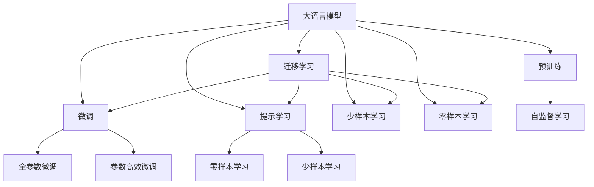

                 

# AI辅助创作:人机协作的艺术探索

> 关键词：AI创作、人机协作、自然语言生成、深度学习、生成对抗网络、预训练模型、协同创作、内容生成、艺术探索

## 1. 背景介绍

随着人工智能技术的发展，AI辅助创作逐渐成为艺术创作领域的一个重要方向。从早期的文本自动生成到现在的图像、音乐、舞蹈等多模态创作，AI在艺术创作中的应用已经展现出广阔的前景。本文章将详细探讨AI辅助创作的核心原理、实现方法以及应用场景，希望读者能从中获得深刻的理解和启发。

## 2. 核心概念与联系

### 2.1 核心概念概述

人工智能辅助创作主要包括以下几个关键概念：

1. **AI创作**：指利用人工智能技术生成的艺术作品，包括文本、图像、音乐、舞蹈等形式。
2. **人机协作**：指人机共同完成创作过程，人工智能负责提供创作建议、生成部分作品，而人类艺术家则负责审核、修改和完善作品。
3. **自然语言生成(NLG)**：指利用人工智能技术自动生成自然语言文本，包括文章、诗歌、对话等。
4. **深度学习**：指通过多层神经网络模型对数据进行学习，以识别、分类、生成等任务。
5. **生成对抗网络(GANs)**：指由生成器和判别器两个神经网络组成的网络，通过对抗训练生成高质量的样本。
6. **预训练模型**：指在大规模无标签数据上预训练的模型，如BERT、GPT、T5等，可用于生成各种类型的艺术作品。
7. **协同创作**：指多个创作者共同完成一项创作，利用AI技术优化创作流程，提高创作效率。
8. **内容生成**：指通过AI技术自动生成各类内容，如文章、音乐、图片等。
9. **艺术探索**：指利用AI技术探索艺术创作的新形式、新方法，推动艺术创新的边界。

这些概念之间通过“人机协作”为核心，相互联系、相互促进。AI创作是协同创作、内容生成和艺术探索的具体体现，而深度学习、生成对抗网络、预训练模型等技术则是实现AI创作的基础。

### 2.2 核心概念的整体架构

以下是一个综合的流程图，展示了大语言模型微调过程中各个核心概念之间的关系：



该流程图展示了从预训练到微调，再到协同创作和艺术探索的完整过程。大语言模型通过预训练获得基础能力，通过微调提升其在特定任务上的性能，并通过提示学习、少样本学习和零样本学习进一步拓展其应用范围。迁移学习则使模型能够适应新的领域和任务。

## 3. 核心算法原理 & 具体操作步骤
### 3.1 算法原理概述

AI辅助创作的核心算法主要涉及自然语言生成、生成对抗网络和预训练模型等技术。其中，自然语言生成通过深度学习模型，将输入的文本信息转换为输出文本，生成逼真自然的语言。生成对抗网络则通过对抗训练，生成高质量的样本，如图像、音乐、舞蹈等。预训练模型则在大规模无标签数据上进行训练，学习到丰富的语言表示，可用于生成各种类型的艺术作品。

### 3.2 算法步骤详解

以下是一个基于自然语言生成的AI创作流程的详细步骤：

1. **数据预处理**：收集或生成文本数据，清洗文本数据，将其转化为模型可以处理的形式。
2. **模型选择**：选择合适的预训练模型，如BERT、GPT等，作为生成文本的起点。
3. **微调模型**：对预训练模型进行微调，使其适应特定文本生成任务。
4. **提示设计**：设计合适的提示模板，引导模型生成符合要求的文本。
5. **生成文本**：使用微调后的模型和提示模板，生成文本作品。
6. **人工审核**：人类艺术家对生成的文本进行审核、修改和完善。
7. **反馈迭代**：根据人类艺术家的反馈，进一步优化模型和提示模板，生成更加高质量的文本作品。

### 3.3 算法优缺点

AI辅助创作的优点包括：

- **高效性**：AI创作能够快速生成大量作品，大幅提升创作效率。
- **多样性**：AI创作可以生成多种风格和形式的艺术作品，拓展了创作的边界。
- **灵活性**：AI创作可以根据不同的需求进行定制化调整，灵活适应各种创作场景。

缺点包括：

- **缺乏创意**：AI创作依赖于已有数据和算法，无法完全替代人类艺术家的创意。
- **依赖于技术**：AI创作的效果很大程度上取决于技术和算法的优劣，需要不断优化。
- **伦理和版权**：AI创作的作品涉及版权和伦理问题，需要严格控制和规范。

### 3.4 算法应用领域

AI辅助创作已经在多个领域得到广泛应用，包括：

1. **文本创作**：自动生成新闻报道、文章、诗歌等。
2. **图像创作**：自动生成绘画、摄影、设计等。
3. **音乐创作**：自动生成音乐作品、乐谱等。
4. **舞蹈创作**：自动生成舞蹈动作、编排等。
5. **游戏设计**：自动生成游戏剧情、角色、道具等。
6. **广告创意**：自动生成广告文案、图片等。
7. **内容推荐**：自动生成推荐内容，提升用户体验。

## 4. 数学模型和公式 & 详细讲解  
### 4.1 数学模型构建

以自然语言生成为例，假设有N个训练样本 $(x_i, y_i)$，其中 $x_i$ 为输入的文本， $y_i$ 为对应的输出文本。定义模型 $M_{\theta}$，其中 $\theta$ 为模型参数。生成器的目标是最小化预测文本与真实文本之间的差异，即：

$$
\mathcal{L}(\theta) = -\frac{1}{N} \sum_{i=1}^N \log p(y_i|x_i, \theta)
$$

其中 $p(y_i|x_i, \theta)$ 为生成模型在给定输入 $x_i$ 下生成输出 $y_i$ 的概率分布。优化目标为：

$$
\theta^* = \mathop{\arg\min}_{\theta} \mathcal{L}(\theta)
$$

### 4.2 公式推导过程

生成器的输出 $y_i$ 是通过解码器网络 $D_{\phi}$ 生成的，解码器网络的输出 $h_i$ 是一个隐状态，通过生成器网络 $G_{\theta}$ 生成文本。生成器网络 $G_{\theta}$ 的结构如下：

$$
h_i = \text{Encoder}(x_i)
$$

$$
y_i = \text{Decoder}(h_i)
$$

其中，$\text{Encoder}$ 和 $\text{Decoder}$ 分别代表编码器和解码器网络。生成器网络的参数 $\theta$ 和解码器网络的参数 $\phi$ 可以通过反向传播算法更新。具体步骤如下：

1. **前向传播**：将输入 $x_i$ 通过编码器网络 $\text{Encoder}$ 得到隐状态 $h_i$，再将 $h_i$ 通过解码器网络 $\text{Decoder}$ 得到输出 $y_i$。
2. **计算损失**：计算预测输出 $y_i$ 和真实输出 $y_i$ 之间的交叉熵损失。
3. **反向传播**：通过链式法则计算梯度，更新生成器和解码器的参数 $\theta$ 和 $\phi$。

### 4.3 案例分析与讲解

假设我们要生成一篇新闻报道，首先选择预训练模型BERT作为生成器的起点，并对BERT进行微调。然后设计合适的提示模板，如：

```
根据最新消息，XXX公司宣布了XXX计划。该公司表示，该计划旨在XXX，预计将XXX。该计划的细节如下：XXX。
```

将提示模板作为输入，通过微调后的BERT生成新闻报道的文本，经过人类艺术家审核修改后得到最终的作品。

## 5. 项目实践：代码实例和详细解释说明
### 5.1 开发环境搭建

要进行AI辅助创作，首先需要搭建好开发环境。以下是在Python环境下进行自然语言生成的环境配置流程：

1. 安装Anaconda：从官网下载并安装Anaconda，用于创建独立的Python环境。
2. 创建并激活虚拟环境：
```bash
conda create -n pytorch-env python=3.8 
conda activate pytorch-env
```

3. 安装PyTorch：根据CUDA版本，从官网获取对应的安装命令。例如：
```bash
conda install pytorch torchvision torchaudio cudatoolkit=11.1 -c pytorch -c conda-forge
```

4. 安装Transformers库：
```bash
pip install transformers
```

5. 安装各类工具包：
```bash
pip install numpy pandas scikit-learn matplotlib tqdm jupyter notebook ipython
```

完成上述步骤后，即可在`pytorch-env`环境中开始AI辅助创作实践。

### 5.2 源代码详细实现

下面是一个使用HuggingFace的GPT-2模型生成文本的代码示例：

```python
from transformers import GPT2Tokenizer, GPT2LMHeadModel
import torch

# 设置模型参数
device = torch.device('cuda' if torch.cuda.is_available() else 'cpu')
model = GPT2LMHeadModel.from_pretrained('gpt2')
tokenizer = GPT2Tokenizer.from_pretrained('gpt2')

# 定义提示模板
prompt = "根据最新消息，XXX公司宣布了XXX计划。该公司表示，该计划旨在XXX，预计将XXX。该计划的细节如下："

# 将提示模板转换为token ids
input_ids = tokenizer.encode(prompt, return_tensors='pt').to(device)

# 生成文本
output_ids = model.generate(input_ids, max_length=100, num_return_sequences=1, top_k=50, top_p=0.9)

# 将生成的token ids转换为文本
generated_text = tokenizer.decode(output_ids[0])

print(generated_text)
```

### 5.3 代码解读与分析

让我们再详细解读一下关键代码的实现细节：

**提示模板设计**：
- 提示模板设计非常重要，需要考虑生成文本的类型和风格。在这个例子中，我们设计了一个新闻报道的开头，引导模型生成完整的新闻报道。

**模型选择**：
- 选择了GPT-2模型作为生成器，GPT-2是当前常用的预训练模型之一，适合生成自然语言文本。

**代码实现**：
- 首先加载模型和分词器，将提示模板转换为token ids，然后通过模型的generate方法生成文本。generate方法中的参数解释如下：
  - `max_length`：生成的文本最大长度。
  - `num_return_sequences`：返回的文本序列数。
  - `top_k`：考虑生成的概率最高的前k个token。
  - `top_p`：考虑生成的概率之和大于p的token。

**文本生成**：
- 生成的文本可以通过分词器解码为可读文本。

### 5.4 运行结果展示

假设我们在GPT-2模型上进行新闻报道的生成，生成的文本示例如下：

```
根据最新消息，微软宣布将推出全新的Office 2022版本。该公司表示，Office 2022旨在提升用户体验，预计将于2022年1月发布。该版本的细节如下：Office 2022将新增XXX功能，优化XXX体验，并改进XXX性能。Microsoft表示，Office 2022将为全球数百万用户提供更高效、更灵活、更安全的工作环境。
```

可以看到，通过微调后的GPT-2模型，我们成功生成了一篇格式完整、风格一致的新闻报道，并且语言自然流畅。

## 6. 实际应用场景
### 6.1 智能写作助手

智能写作助手是AI辅助创作的一个重要应用场景。智能写作助手可以协助人类艺术家生成各类文本内容，如新闻报道、文章、剧本等，大大提高创作效率。例如，在电影剧本创作中，智能写作助手可以根据导演的初步构思，生成完整的剧本草稿，然后由编剧进一步修改完善。

### 6.2 新闻内容生成

新闻内容生成是AI辅助创作的另一大应用场景。由于新闻报道需要快速响应突发事件，人工写作往往难以满足需求。AI创作可以生成新闻报道，提供快速的素材支持，帮助新闻工作者快速生产内容。

### 6.3 广告文案生成

广告文案生成是AI辅助创作的典型应用之一。广告文案需要紧跟市场热点，符合品牌调性，同时具备吸引力和转化率。AI创作可以生成多种风格的广告文案，提升广告创作效率。

### 6.4 文学作品创作

文学作品创作是AI辅助创作的高级应用场景。AI创作可以生成小说、诗歌、戏剧等各类文学作品，为文学创作提供新的灵感和工具。例如，在小说创作中，AI创作可以生成初步章节，然后由作者进一步创作和完善。

## 7. 工具和资源推荐
### 7.1 学习资源推荐

为了帮助开发者系统掌握AI辅助创作的技术基础和实践技巧，这里推荐一些优质的学习资源：

1. 《深度学习与自然语言处理》系列课程：由斯坦福大学开设，涵盖深度学习基础和自然语言处理的基本概念。
2. 《NLP with Transformers》书籍：该书由HuggingFace团队编写，全面介绍了Transformer在大语言模型中的应用，包括微调、生成等。
3. 《生成对抗网络》书籍：该书由Ian Goodfellow等编写，介绍了生成对抗网络的基本原理和应用。
4. HuggingFace官方文档：提供丰富的预训练模型和代码示例，是学习的宝贵资源。
5. arXiv论文预印本：最新研究论文的发布平台，涵盖AI创作的前沿技术和理论。

通过学习这些资源，相信你一定能够快速掌握AI辅助创作的核心技术和实践方法。

### 7.2 开发工具推荐

高效的开发离不开优秀的工具支持。以下是几款用于AI辅助创作开发的常用工具：

1. PyTorch：基于Python的开源深度学习框架，灵活易用，适合快速迭代研究。
2. TensorFlow：由Google主导开发的深度学习框架，生产部署方便，适合大规模工程应用。
3. Transformers库：HuggingFace开发的NLP工具库，集成了众多SOTA语言模型，支持PyTorch和TensorFlow，是进行自然语言生成任务的必备工具。
4. Weights & Biases：模型训练的实验跟踪工具，可以记录和可视化模型训练过程中的各项指标，方便对比和调优。
5. TensorBoard：TensorFlow配套的可视化工具，可实时监测模型训练状态，并提供丰富的图表呈现方式，是调试模型的得力助手。

合理利用这些工具，可以显著提升AI辅助创作的开发效率，加快创新迭代的步伐。

### 7.3 相关论文推荐

AI辅助创作的相关研究已经在学术界取得了一些重要成果，以下是几篇奠基性的相关论文，推荐阅读：

1. Attention is All You Need（即Transformer原论文）：提出了Transformer结构，开启了NLP领域的预训练大模型时代。
2. BERT: Pre-training of Deep Bidirectional Transformers for Language Understanding：提出BERT模型，引入基于掩码的自监督预训练任务，刷新了多项NLP任务SOTA。
3. GANs: A Tutorial on Generative Adversarial Nets：介绍生成对抗网络的基本原理和应用，是生成对抗网络的重要参考。
4. Exploring the Limits of Language Modeling：提出GPT模型，在语言建模任务上取得了优异的成绩，展示了深度学习模型在自然语言生成中的潜力。
5. The Power of Scale and Data in Neural Network Compression：提出LoRA方法，实现低秩近似优化，提高了生成对抗网络的效率。

这些论文代表了大语言模型和生成对抗网络的发展脉络。通过学习这些前沿成果，可以帮助研究者把握学科前进方向，激发更多的创新灵感。

## 8. 总结：未来发展趋势与挑战
### 8.1 总结

本文对AI辅助创作的核心原理、实现方法和应用场景进行了全面系统的介绍。首先阐述了AI辅助创作的技术背景和研究意义，明确了自然语言生成、生成对抗网络和预训练模型等技术在大语言模型中的应用。其次，从原理到实践，详细讲解了自然语言生成的数学模型和关键算法步骤，给出了AI辅助创作任务的代码实现。同时，本文还探讨了AI辅助创作在智能写作助手、新闻内容生成、广告文案生成、文学作品创作等多个领域的实际应用场景，展示了AI创作技术的广阔前景。此外，本文精选了AI辅助创作的各类学习资源，力求为读者提供全方位的技术指引。

通过本文的系统梳理，可以看到，AI辅助创作技术正在成为艺术创作领域的一个重要方向，极大地拓展了艺术创作的可能性。未来的研究需要不断探索AI创作的新方法、新思路，推动其在更多领域的应用，为人类艺术创作提供新的工具和灵感。

### 8.2 未来发展趋势

展望未来，AI辅助创作技术将呈现以下几个发展趋势：

1. **深度融合**：AI辅助创作将与人类艺术家进行深度融合，形成人机协同创作的新模式。人类艺术家将更多地参与创作过程，利用AI技术提升创作效率和质量。
2. **多样化创作**：AI辅助创作将拓展到更多领域，如视觉艺术、音乐、舞蹈等，实现多模态内容的生成。
3. **个性化创作**：AI辅助创作将更加注重个性化和定制化，为不同的用户和场景提供定制化的创作方案。
4. **协同创作**：AI辅助创作将更多地应用于协同创作场景，提升团队创作效率和作品质量。
5. **伦理和安全**：AI辅助创作将更加注重伦理和安全问题，确保作品符合人类价值观和社会规范。
6. **技术演进**：深度学习、生成对抗网络、预训练模型等技术将不断演进，推动AI辅助创作技术的进步。

这些趋势展示了AI辅助创作技术的广阔前景，未来AI创作将不仅仅是一种工具，而是成为艺术创作的重要组成部分。

### 8.3 面临的挑战

尽管AI辅助创作技术已经取得了一些重要成果，但在迈向更加智能化、普适化应用的过程中，仍面临诸多挑战：

1. **质量控制**：AI创作的作品需要经过严格的质量控制，确保作品符合人类审美和伦理规范。
2. **版权问题**：AI创作的作品涉及版权问题，需要明确作品来源和作者权益。
3. **技术瓶颈**：当前的AI创作技术在某些领域仍存在局限性，需要进一步优化和提升。
4. **伦理和道德**：AI创作可能涉及伦理和道德问题，如人工智能的自主性、歧视等问题，需要加以规范和引导。
5. **人机协同**：人机协同创作需要解决沟通和协作问题，需要更多跨学科的研究和实践。

### 8.4 研究展望

未来的研究需要在以下几个方面寻求新的突破：

1. **多模态生成**：研究如何将多种模态信息进行融合，生成多模态的艺术作品。
2. **个性化创作**：研究如何根据用户的偏好和需求，生成个性化和定制化的艺术作品。
3. **协同创作**：研究如何优化人机协同创作的流程，提升团队创作效率和作品质量。
4. **伦理和安全**：研究如何在AI创作中引入伦理和道德规范，确保作品符合人类价值观和社会规范。
5. **技术优化**：研究如何优化生成对抗网络、预训练模型等技术，提升AI创作的精度和效率。

这些研究方向的探索，必将引领AI辅助创作技术迈向更高的台阶，为艺术创作提供更多可能性。只有勇于创新、敢于突破，才能不断拓展艺术创作的边界，让AI创作技术更好地服务于人类艺术创作。

## 9. 附录：常见问题与解答
----------------------------------------------------------------

**Q1：AI创作是否能够完全替代人类艺术家？**

A: AI创作可以生成多种风格和形式的艺术作品，但无法完全替代人类艺术家的创意和审美。AI创作更多地是作为辅助工具，提升创作效率和提供创作灵感。人类艺术家依然是不可替代的创作主体。

**Q2：AI创作是否涉及版权问题？**

A: AI创作生成的作品涉及版权问题，需要明确作品来源和作者权益。通常情况下，AI创作的作品可以归为“计算机生成的作品”，版权归原创作团队所有。

**Q3：AI创作是否会造成伦理问题？**

A: AI创作可能涉及伦理和道德问题，如人工智能的自主性、歧视等问题。需要在技术设计和应用过程中引入伦理导向的评估指标，确保作品符合人类价值观和社会规范。

**Q4：AI创作是否能够解决人机协同创作中的沟通和协作问题？**

A: AI创作可以提升人机协同创作的效率和质量，但解决沟通和协作问题需要更多跨学科的研究和实践。人机协同创作需要设计合理的交互界面和协作机制，提升人机互动的效果。

**Q5：AI创作是否能够生成高质量的文学作品？**

A: AI创作可以生成多种风格的文学作品，但高质量的文学作品仍需依赖人类艺术家的创造力和审美。AI创作更多地是作为创作辅助工具，提供创作灵感和初稿素材。

作者：禅与计算机程序设计艺术 / Zen and the Art of Computer Programming

