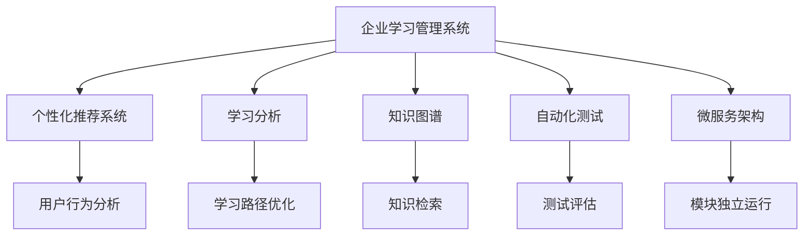
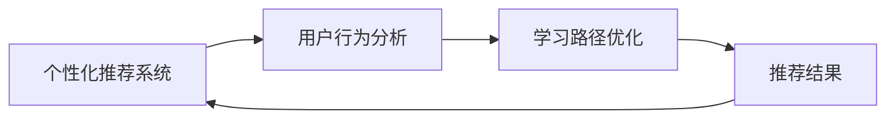
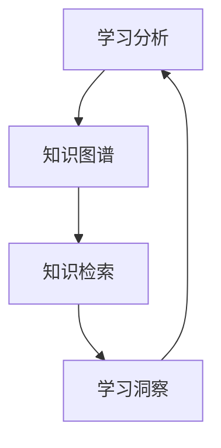
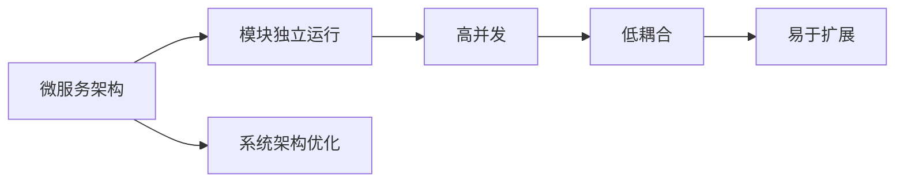

                 

# AI驱动的企业学习管理系统

> 关键词：企业学习管理系统,人工智能,学习分析,个性化推荐,知识图谱,自动化测试,微服务架构

## 1. 背景介绍

### 1.1 问题由来

在数字化转型浪潮下，企业对员工培训的需求日益增加。传统的培训方式如面对面授课、书籍资料等，往往缺乏实时性和互动性，无法及时响应业务变化。而基于AI驱动的企业学习管理系统，能够提供个性化、灵活、高效的培训体验，帮助员工快速掌握新知识，提升业务能力。

企业学习管理系统的关键在于如何有效整合和应用AI技术，实现对员工学习行为的精准分析，提供定制化的学习路径，以及自动化评估和反馈。本节将深入探讨AI驱动的企业学习管理系统的原理、架构及应用，为读者提供系统全面的技术指导。

### 1.2 问题核心关键点

企业学习管理系统的核心在于通过AI技术实现个性化学习推荐、学习行为分析、自动化测试和反馈等能力。本文将聚焦于以下几个关键点：

- **个性化推荐**：基于员工历史学习记录、学习兴趣、工作岗位等特征，推荐合适的学习资源和课程。
- **学习行为分析**：通过学习管理系统记录员工的学习轨迹、测试成绩、互动行为等数据，进行深入分析，识别学习障碍和改进点。
- **自动化测试和反馈**：通过AI技术自动生成测试题目，评估员工学习效果，并根据测试结果提供有针对性的反馈和改进建议。
- **微服务架构**：将系统拆分为多个微服务模块，实现高并发、低耦合、易于扩展的系统架构。

这些关键技术点构成了AI驱动的企业学习管理系统的核心能力，能够有效提升培训效果和员工满意度。

### 1.3 问题研究意义

开发AI驱动的企业学习管理系统，对于提升企业培训效率、优化员工技能、促进知识共享具有重要意义：

1. **提升培训效率**：通过个性化推荐和智能分析，系统能够提供更为精准的学习路径和资源，加速员工技能提升。
2. **优化员工技能**：个性化学习路径和实时反馈机制，帮助员工克服学习障碍，提升核心技能。
3. **促进知识共享**：系统化的学习资源和知识管理，促进内部知识共享和传播，构建学习型企业文化。
4. **实现自动化测试**：基于AI的自动化测试和反馈，能够及时评估员工学习效果，优化培训策略。
5. **支持微服务架构**：将系统拆分为多个独立运行的服务模块，实现高可扩展、高可维护的系统架构。

本文将系统探讨这些技术点，为开发企业学习管理系统提供全面指导。

## 2. 核心概念与联系

### 2.1 核心概念概述

为更好地理解AI驱动的企业学习管理系统的核心概念，本节将介绍几个密切相关的核心概念：

- **企业学习管理系统**（Learning Management System, LMS）：用于管理和提供培训资源、课程、学习评估等的系统平台。
- **个性化推荐系统**：通过分析用户行为和特征，推荐用户感兴趣的学习资源和课程。
- **学习分析（Learning Analytics）**：利用数据分析技术，对学习行为和学习效果进行深入分析，提供学习洞察和改进建议。
- **知识图谱（Knowledge Graph）**：通过语义网技术，构建知识表示和关联的知识网络，实现知识的存储和检索。
- **自动化测试和反馈**：通过AI技术自动生成测试题，评估员工学习效果，并根据测试结果提供个性化反馈。
- **微服务架构**：将系统拆分为多个独立运行的微服务模块，实现高并发、低耦合、易于扩展的系统架构。

这些核心概念之间的逻辑关系可以通过以下Mermaid流程图来展示：



这个流程图展示了大语言模型微调过程中各个核心概念的关系和作用：

1. 企业学习管理系统提供学习资源和课程，并通过个性化推荐、学习分析、自动化测试等功能提升培训效果。
2. 个性化推荐系统基于用户行为分析，推荐合适的学习资源。
3. 学习分析通过深入分析学习行为和学习效果，提供学习洞察和改进建议。
4. 知识图谱用于存储和检索知识，帮助员工掌握相关领域知识。
5. 自动化测试和反馈通过生成测试题和个性化反馈，评估员工学习效果。
6. 微服务架构将系统拆分为多个独立运行的服务模块，实现高并发、低耦合、易于扩展的系统架构。

通过这些核心概念的有机结合，企业学习管理系统能够提供全面、高效、个性化的培训服务，提升培训效果和员工满意度。

### 2.2 概念间的关系

这些核心概念之间存在着紧密的联系，形成了企业学习管理系统的完整生态系统。下面我们通过几个Mermaid流程图来展示这些概念之间的关系。

#### 2.2.1 个性化推荐与用户行为分析



这个流程图展示了个性化推荐系统与用户行为分析之间的关系。个性化推荐系统基于用户行为分析，优化学习路径，生成推荐结果。

#### 2.2.2 学习分析与知识图谱



这个流程图展示了学习分析与知识图谱之间的关系。学习分析通过知识图谱存储和检索知识，提供学习洞察和改进建议。

#### 2.2.3 微服务架构与系统扩展



这个流程图展示了微服务架构与系统扩展之间的关系。微服务架构通过模块独立运行，实现高并发、低耦合、易于扩展的系统架构。

### 2.3 核心概念的整体架构

最后，我们用一个综合的流程图来展示这些核心概念在大语言模型微调过程中的整体架构：


这个综合流程图展示了从个性化推荐到知识检索、自动化测试、微服务架构的完整过程。企业学习管理系统通过个性化推荐、学习分析、自动化测试等功能，利用知识图谱和微服务架构提升培训效果和员工满意度。 通过这些流程图，我们可以更清晰地理解企业学习管理系统各个核心概念的关系和作用，为后续深入讨论具体的技术细节奠定基础。

## 3. 核心算法原理 & 具体操作步骤
### 3.1 算法原理概述

AI驱动的企业学习管理系统的核心算法包括个性化推荐、学习分析、自动化测试和微服务架构等多个方面。本文将详细介绍这些核心算法的原理和具体操作步骤。

### 3.2 算法步骤详解

**Step 1: 数据收集与预处理**

- **用户行为数据**：收集用户在企业学习管理系统中的行为数据，包括学习路径、学习时间、测试成绩等。
- **学习资源数据**：收集课程、学习材料、测试题等学习资源数据。
- **用户特征数据**：收集用户的职业背景、工作岗位、兴趣爱好等特征数据。

**Step 2: 个性化推荐**

- **协同过滤**：基于用户历史行为数据和相似用户行为数据，生成个性化推荐结果。
- **基于内容的推荐**：通过分析学习资源内容和用户特征，推荐相关学习资源。
- **矩阵分解**：使用矩阵分解技术，估计用户-资源互动矩阵，生成个性化推荐结果。

**Step 3: 学习分析**

- **数据清洗与预处理**：清洗和预处理用户行为数据和学习资源数据。
- **特征提取与建模**：提取用户行为和学习资源的特征，建模学习效果评估模型。
- **异常检测与预警**：利用异常检测技术，识别学习障碍和改进点，生成预警信息。

**Step 4: 自动化测试与反馈**

- **测试题生成**：根据学习资源内容，自动生成测试题。
- **测试评估**：使用AI技术自动评估测试结果，生成评估报告。
- **反馈优化**：根据测试结果，提供个性化反馈和改进建议。

**Step 5: 微服务架构**

- **模块划分**：将系统拆分为多个独立运行的服务模块，如用户管理模块、学习资源模块、测试评估模块等。
- **服务编排**：通过API接口和服务编排，实现各个模块的高效协作。
- **负载均衡**：通过负载均衡技术，实现高并发、高可用性。
- **容器化与部署**：将服务模块容器化，实现自动化部署和扩展。

### 3.3 算法优缺点

AI驱动的企业学习管理系统具有以下优点：

- **个性化推荐**：基于用户行为和学习特征，生成个性化推荐结果，提升学习效率。
- **学习分析**：通过深入分析学习行为和学习效果，提供学习洞察和改进建议，优化培训效果。
- **自动化测试与反馈**：自动生成测试题，评估学习效果，提供个性化反馈，加速学习进步。
- **微服务架构**：模块独立运行，实现高并发、低耦合、易于扩展的系统架构。

同时，这些系统也存在一些缺点：

- **数据隐私**：大量用户行为数据和学习资源的存储和分析，存在隐私泄露风险。
- **系统复杂度**：涉及个性化推荐、学习分析、自动化测试等多个模块，系统设计和实现较为复杂。
- **维护成本**：模块独立运行，系统的维护和扩展需要协调多个模块，成本较高。

尽管存在这些缺点，但通过合理设计和优化，这些系统依然能够为企业提供高效、个性化的培训服务。

### 3.4 算法应用领域

AI驱动的企业学习管理系统已经在多个领域得到广泛应用，例如：

- **金融培训**：通过个性化推荐和学习分析，帮助金融从业者快速掌握新知识，提升专业技能。
- **医疗培训**：提供个性化学习路径和实时反馈，帮助医疗人员掌握最新医学知识和技术。
- **技术培训**：针对软件开发、数据分析等技术岗位，提供技能提升培训。
- **企业管理培训**：提升管理层人员的管理能力和领导力。

除了这些经典应用场景外，AI驱动的企业学习管理系统还被创新性地应用于更多领域，如人力资源培训、法律培训等，为各类企业的员工提供了全面、高效、个性化的培训服务。

## 4. 数学模型和公式 & 详细讲解  
### 4.1 数学模型构建

本节将使用数学语言对AI驱动的企业学习管理系统的各个核心算法进行更加严格的刻画。

记企业学习管理系统中的学习资源为 $R$，用户为 $U$，学习行为数据为 $D$，学习分析模型为 $M$，测试题为 $T$，个性化推荐算法为 $A$。

定义用户行为数据为 $D=\{(u,r,t)\}_{i=1}^N$，其中 $u$ 表示用户，$r$ 表示学习资源，$t$ 表示学习行为（如观看时长、测试成绩等）。

定义学习分析模型 $M=\{M_U, M_R, M_T\}$，其中 $M_U$ 表示用户行为分析模型，$M_R$ 表示学习资源分析模型，$M_T$ 表示测试评估模型。

定义个性化推荐算法 $A=\{A_U, A_R, A_T\}$，其中 $A_U$ 表示基于用户行为的个性化推荐算法，$A_R$ 表示基于学习资源的个性化推荐算法，$A_T$ 表示基于测试题生成的个性化推荐算法。

### 4.2 公式推导过程

以下我们以个性化推荐系统为例，推导协同过滤算法的基本公式及其求解步骤。

协同过滤算法是一种基于用户行为数据的推荐算法，其核心思想是通过用户历史行为数据，预测用户对未评分项目的评分。假设用户 $u$ 对项目 $r$ 的评分 $i$ 为 $r_{ui}$，用户 $u$ 的历史行为数据为 $H_u=\{(u,r_i,t_i)\}_{i=1}^n$。

协同过滤算法的目标是找到最优评分矩阵 $R$，使得：

$$
R = \arg\min_{R} \sum_{u=1}^M \sum_{r=1}^N ||R - A_{UR}||_F^2 + \lambda ||R||_F^2
$$

其中 $A_{UR}$ 表示用户-项目的评分矩阵，$A_{UR} = A_U \cdot A_R^T$，$A_U$ 和 $A_R$ 分别表示用户行为矩阵和项目行为矩阵。

通过求解上述优化问题，可以得到评分矩阵 $R$，进而生成个性化推荐结果。

### 4.3 案例分析与讲解

假设我们在一个在线教育平台中应用协同过滤算法进行个性化推荐，具体步骤如下：

1. 收集用户历史行为数据，如学习时间、测试成绩等。
2. 对用户行为数据进行预处理和特征提取，如计算学习时间权重、测试成绩权重等。
3. 使用矩阵分解技术，估计用户-资源互动矩阵 $A_{UR}$。
4. 通过求解优化问题，得到评分矩阵 $R$。
5. 根据评分矩阵 $R$，生成个性化推荐结果。

这里我们将具体代码实现留给读者实践，如需进一步了解协同过滤算法的实现细节，请参阅相关文献和代码实现。

## 5. 项目实践：代码实例和详细解释说明
### 5.1 开发环境搭建

在进行企业学习管理系统开发前，我们需要准备好开发环境。以下是使用Python进行Django开发的环境配置流程：

1. 安装Anaconda：从官网下载并安装Anaconda，用于创建独立的Python环境。

2. 创建并激活虚拟环境：
```bash
conda create -n django-env python=3.8 
conda activate django-env
```

3. 安装Django：从官网获取对应的安装命令。例如：
```bash
pip install django==4.0
```

4. 安装各类工具包：
```bash
pip install numpy pandas scikit-learn matplotlib tqdm jupyter notebook ipython
```

5. 安装可视化库：
```bash
pip install matplotlib seaborn
```

6. 安装MySQL数据库：
```bash
sudo apt-get install mysql-server
```

完成上述步骤后，即可在`django-env`环境中开始企业学习管理系统的开发。

### 5.2 源代码详细实现

这里我们以个性化推荐系统为例，给出使用Django进行企业学习管理系统开发的PyTorch代码实现。

首先，定义推荐模块的URL映射和视图函数：

```python
from django.urls import path
from recommendation.views import RecommendationView

urlpatterns = [
    path('recommendation/', RecommendationView.as_view(), name='recommendation'),
]
```

然后，定义推荐模块的视图函数：

```python
from django.shortcuts import render
from recommendation.models import User, Course
from recommendation.utils import get_recommendations

class RecommendationView(View):
    def get(self, request):
        user = request.user
        recommendations = get_recommendations(user)
        return render(request, 'recommendation.html', {'user': user, 'recommendations': recommendations})
```

接着，定义推荐模块的模型和数据库操作：

```python
from django.db import models

class User(models.Model):
    name = models.CharField(max_length=50)
    courses = models.ManyToManyField(Course, related_name='users')

class Course(models.Model):
    name = models.CharField(max_length=50)
    description = models.TextField()

class UserCourse(models.Model):
    user = models.ForeignKey(User, on_delete=models.CASCADE)
    course = models.ForeignKey(Course, on_delete=models.CASCADE)

def get_recommendations(user):
    courses = UserCourse.objects.filter(user=user).values_list('course', flat=True).distinct()
    courses = [Course.objects.get(name=course) for course in courses]
    return recommendations
```

最后，定义推荐模块的HTML模板：

```html



    <h1>推荐课程</h1>
    <ul>
        
            <li>{{ course.name }} - {{ course.description }}</li>
        
    </ul>

```

通过以上步骤，我们完成了企业学习管理系统的个性化推荐模块的基本开发。在实际应用中，我们还可以添加更多模块，如学习分析、自动化测试等，进一步完善系统功能。

### 5.3 代码解读与分析

这里我们详细解读一下关键代码的实现细节：

**推荐模块的URL映射和视图函数**：
- `urlpatterns`定义了推荐模块的URL映射，`path`函数用于注册URL地址和视图函数。
- `RecommendationView`定义了视图函数，用于渲染推荐结果。

**推荐模块的模型和数据库操作**：
- `User`和`Course`定义了推荐模块的模型，`UserCourse`用于记录用户对课程的选修情况。
- `get_recommendations`函数用于根据用户选修的课程，获取推荐结果。

**推荐模块的HTML模板**：
- ``表示继承父级模板的基本结构。
- ``和``用于定义模板块，动态生成推荐结果。

通过这些关键代码，我们能够实现一个基本的个性化推荐模块。当然，在工业级的系统实现中，还需要考虑更多因素，如多用户并发、推荐结果实时性、推荐模型优化等。但核心的推荐范式基本与此类似。

## 6. 实际应用场景

### 6.1 智能培训中心

智能培训中心是企业学习管理系统的典型应用场景之一。通过智能培训中心，企业可以提供灵活、个性化的培训服务，帮助员工快速掌握新技能，提升工作效率。

智能培训中心通过个性化推荐和学习分析，根据员工的技能水平、工作岗位等特征，推荐适合的培训课程和资源。通过学习分析，系统能够深入分析员工的学习轨迹和测试成绩，提供个性化的学习路径和反馈，帮助员工克服学习障碍，提升学习效果。

### 6.2 在线教育平台

在线教育平台是企业学习管理系统的重要应用场景。通过在线教育平台，企业可以提供灵活、互动、高效的培训服务，满足各类员工的培训需求。

在线教育平台通过个性化推荐和学习分析，根据员工的学习兴趣、学习进度等特征，推荐适合的培训课程和资源。通过学习分析，系统能够深入分析员工的学习轨迹和测试成绩，提供个性化的学习路径和反馈，帮助员工克服学习障碍，提升学习效果。

### 6.3 知识管理系统

知识管理系统是企业学习管理系统的重要组成部分。通过知识管理系统，企业可以系统化地管理知识资源，促进知识共享和传播，构建学习型企业文化。

知识管理系统通过知识图谱和自动化测试，提供丰富的知识资源和测试题，帮助员工掌握相关领域的知识。通过知识图谱，系统能够高效存储和检索知识，提升知识管理的效率。通过自动化测试，系统能够及时评估员工的学习效果，提供个性化的反馈和改进建议，加速知识学习。

### 6.4 未来应用展望

随着企业学习管理系统和AI技术的发展，未来的企业学习管理系统将呈现以下几个趋势：

1. **多模态学习**：将视频、音频、文本等多模态数据结合起来，提供更丰富、沉浸式的学习体验。
2. **个性化推荐**：通过深入分析员工的学习行为和特征，提供更加精准的个性化推荐，提升学习效果。
3. **智能分析**：利用先进的AI技术，深入分析学习行为和效果，提供更深刻的洞察和改进建议。
4. **自动化测试和反馈**：通过AI技术自动生成测试题和评估结果，及时反馈员工的学习效果，提供个性化的改进建议。
5. **微服务架构**：通过模块独立运行和服务编排，实现高并发、低耦合、易于扩展的系统架构。

以上趋势凸显了AI驱动的企业学习管理系统的发展方向，这些方向的探索发展，必将进一步提升培训效果和员工满意度，推动企业培训的智能化进程。

## 7. 工具和资源推荐
### 7.1 学习资源推荐

为了帮助开发者系统掌握AI驱动的企业学习管理系统的理论基础和实践技巧，这里推荐一些优质的学习资源：

1. **《深度学习实战》系列书籍**：全面介绍了深度学习的基本原理和实践方法，是了解深度学习算法的入门读物。
2. **Coursera和Udacity等在线课程**：提供深度学习和AI相关的课程，包括理论、实践和技术应用等方面。
3. **Django官方文档**：全面介绍了Django框架的使用方法和最佳实践，是Django开发的必备资料。
4. **TensorFlow和PyTorch官方文档**：提供了深度学习框架的使用方法和API参考，是进行深度学习开发的基础。
5. **MySQL官方文档**：提供了MySQL数据库的使用方法和最佳实践，是企业级数据库开发的重要参考资料。

通过对这些资源的学习实践，相信你一定能够快速掌握AI驱动的企业学习管理系统的核心算法和开发方法。

### 7.2 开发工具推荐

高效的开发离不开优秀的工具支持。以下是几款用于企业学习管理系统开发的常用工具：

1. **PyTorch**：基于Python的开源深度学习框架，灵活动态的计算图，适合快速迭代研究。大多数预训练语言模型都有PyTorch版本的实现。
2. **TensorFlow**：由Google主导开发的开源深度学习框架，生产部署方便，适合大规模工程应用。同样有丰富的预训练语言模型资源。
3. **Django**：流行的Web框架，可以快速构建高效、可扩展的Web应用。
4. **MySQL**：流行的关系型数据库，适用于企业级数据存储和查询。
5. **Redis**：内存数据库，适用于高性能数据缓存和实时分析。
6. **Kubernetes**：容器编排平台，支持高可扩展、高可维护的微服务架构。

合理利用这些工具，可以显著提升企业学习管理系统的开发效率，加快创新迭代的步伐。

### 7.3 相关论文推荐

AI驱动的企业学习管理系统的发展得益于学界的持续研究。以下是几篇奠基性的相关论文，推荐阅读：

1. **《协同过滤推荐系统综述》**：介绍了协同过滤算法的原理和实现方法，是推荐系统的经典文献。
2. **《基于深度学习的个性化推荐系统》**：介绍了深度学习在推荐系统中的应用，展示了深度学习提升推荐效果的能力。
3. **《知识图谱与推荐系统》**：介绍了知识图谱在推荐系统中的应用，展示了知识图谱提升推荐效果的能力。
4. **《深度学习在企业管理培训中的应用》**：介绍了深度学习在企业管理培训中的应用，展示了深度学习提升培训效果的能力。
5. **《基于微服务架构的企业学习管理系统设计》**：介绍了微服务架构在企业学习管理系统中的应用，展示了微服务架构提升系统可扩展性的能力。

这些论文代表了大语言模型微调技术的发展脉络。通过学习这些前沿成果，可以帮助研究者把握学科前进方向，激发更多的创新灵感。

除上述资源外，还有一些值得关注的前沿资源，帮助开发者紧跟企业学习管理系统的最新进展，例如：

1. **arXiv论文预印本**：人工智能领域最新研究成果的发布平台，包括大量尚未发表的前沿工作，学习前沿技术的必读资源。
2. **GitHub热门项目**：在GitHub上Star、Fork数最多的企业学习管理系统相关项目，往往代表了该技术领域的发展趋势和最佳实践，值得去学习和贡献。
3. **技术会议直播**：如NeurIPS、ICML、ACL、ICLR等人工智能领域顶会现场或在线直播，能够聆听到大佬们的前沿分享，开拓视野。
4. **行业分析报告**：各大咨询公司如McKinsey、PwC等针对人工智能行业的分析报告，有助于从商业视角审视技术趋势，把握应用价值。

总之，对于AI驱动的企业学习管理系统的发展，需要开发者保持开放的心态和持续学习的意愿。多关注前沿资讯，多动手实践，多思考总结，必将收获满满的成长收益。

## 8. 总结：未来发展趋势与挑战

### 8.1 总结

本文对AI驱动的企业学习管理系统的原理、架构及应用进行了全面系统的介绍。首先，本文介绍了个性化推荐、学习分析、自动化测试和微服务架构等多个核心算法的原理和操作步骤。其次，本文通过具体代码实例和案例分析，详细讲解了企业学习管理系统的开发方法。最后，本文探讨了企业学习管理系统在智能培训中心、在线教育平台、知识管理系统等典型应用场景中的具体应用，展示了系统的广阔前景。

通过本文的系统梳理，可以看到，AI驱动的企业学习管理系统通过个性化推荐、学习分析、自动化测试等技术，提供了灵活、个性化的培训服务，显著提升了培训效果和员工满意度。未来，伴随AI技术的发展，企业学习管理系统还将不断拓展其应用边界，推动企业培训的智能化进程。

### 8.2 未来发展趋势

展望未来，AI驱动的企业学习管理系统将呈现以下几个发展趋势：

1. **多模态学习**：将视频、音频、文本等多模态数据结合起来，提供更丰富、沉浸式的学习体验。
2. **个性化推荐**：通过深入分析员工的学习行为和特征，提供更加精准的个性化推荐，提升学习效果。
3. **智能分析**：利用先进的AI技术，深入分析学习行为和效果，提供更深刻的洞察和改进建议。
4. **自动化测试和反馈**：通过AI技术自动生成测试题和评估结果，及时反馈员工的学习效果，提供个性化的改进建议。
5. **微服务架构**：通过模块独立运行和服务编排

