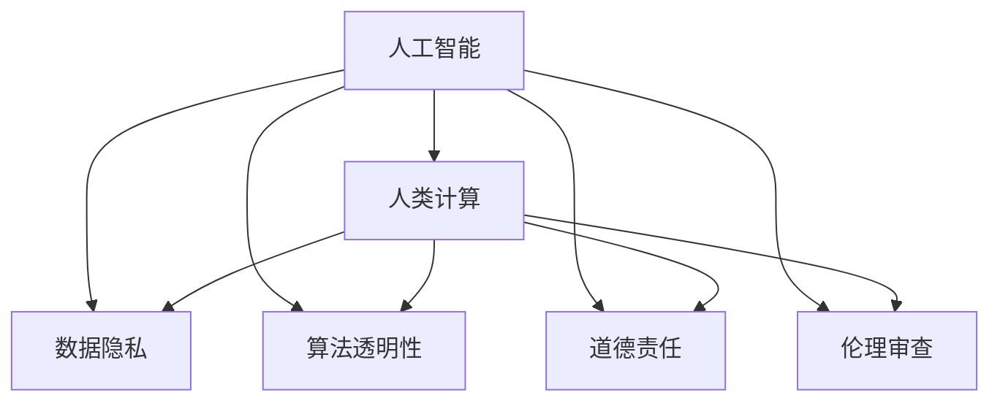
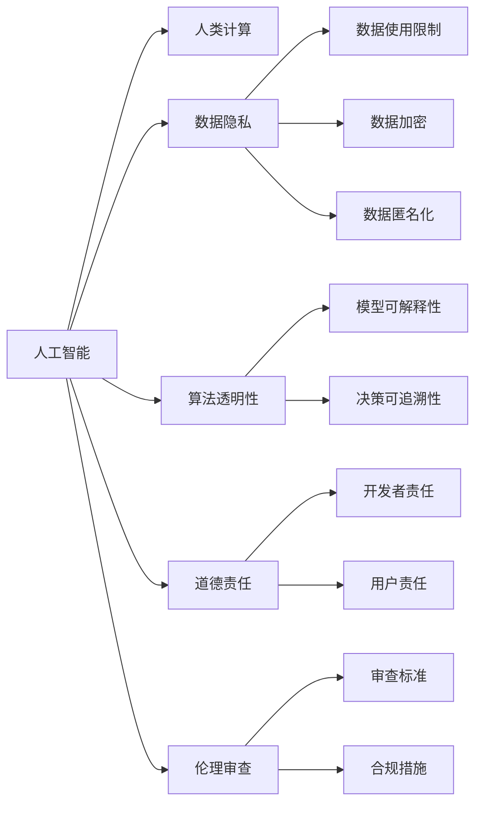

                 

# AI驱动的创新：人类计算在商业中的道德考虑因素与应用趋势

## 1. 背景介绍

随着人工智能技术的飞速发展，人类计算在商业中的应用已经变得越来越广泛。从数据分析到自动驾驶，从智能客服到个性化推荐，人工智能在各个领域都发挥着重要的作用。然而，在带来效率和创新能力提升的同时，人工智能也引发了一系列道德和伦理问题，尤其是当涉及到人类计算（Human-Computer Interaction）时。因此，本文将探讨人工智能在商业中的应用，特别是人类计算的道德考虑因素以及未来的发展趋势。

## 2. 核心概念与联系

### 2.1 核心概念概述

人工智能在商业中的应用，特别是人类计算，涉及多个核心概念。这些概念之间相互关联，共同构成了人工智能在商业中应用的基础框架。

- **人工智能（AI）**：一种模拟人类智能过程的技术，包括机器学习、深度学习、自然语言处理等。
- **人类计算（Human-Computer Interaction）**：指人类与计算机之间的交互方式，包括语音识别、自然语言理解、图像识别等。
- **数据隐私**：在处理个人数据时，保护个人隐私不泄露给第三方。
- **算法透明性**：确保人工智能算法的决策过程可以被解释，从而增强算法的可信任度。
- **道德责任**：在开发和使用人工智能技术时，明确开发者和用户的道德责任。
- **伦理审查**：在人工智能技术开发和应用中，进行伦理审查以确保其符合社会价值观和法律法规。

### 2.2 核心概念的关系

这些核心概念之间的关系可以通过以下Mermaid流程图来展示：



这个流程图展示了人工智能和人类计算在商业中应用时的关键道德考虑因素，包括数据隐私、算法透明性、道德责任和伦理审查等。

### 2.3 核心概念的整体架构

大图展示如下：



这个架构图展示了从人工智能到人类计算过程中的各项道德考虑因素，以及它们之间的相互关系。数据隐私、算法透明性、道德责任和伦理审查等都是人工智能在商业中应用时必须考虑的关键因素。

## 3. 核心算法原理 & 具体操作步骤

### 3.1 算法原理概述

人工智能在商业中的应用，尤其是人类计算，通常涉及以下算法原理：

- **机器学习**：一种基于数据的算法，通过学习数据中的模式来做出预测或决策。
- **深度学习**：一种特殊的机器学习算法，通过构建多层神经网络来处理复杂的数据。
- **自然语言处理（NLP）**：一种处理和理解人类语言的技术，包括语音识别、文本分析和自然语言生成等。

### 3.2 算法步骤详解

以自然语言处理为例，以下是自然语言处理在商业中应用的详细步骤：

1. **数据收集**：收集与商业相关的文本数据，如客户评论、社交媒体帖子等。
2. **数据预处理**：清洗数据，去除噪声，进行分词、词性标注等预处理。
3. **模型训练**：使用机器学习或深度学习算法，训练一个自然语言处理模型。
4. **模型评估**：在测试集上评估模型的性能，如准确率、召回率等。
5. **模型部署**：将模型部署到生产环境，供商业应用使用。
6. **模型监控和维护**：监控模型性能，及时更新模型以应对数据变化。

### 3.3 算法优缺点

人工智能在商业中应用的优势包括：

- **效率提升**：自动化处理大量数据，提高工作效率。
- **决策支持**：提供数据驱动的决策支持，帮助企业做出更准确的商业决策。
- **个性化服务**：基于用户数据，提供个性化的服务和推荐。

然而，人工智能也存在一些缺点：

- **隐私风险**：在数据处理过程中，可能泄露用户的隐私信息。
- **算法偏见**：人工智能模型可能存在偏见，导致不公正的决策。
- **技术复杂性**：人工智能技术开发和应用的技术门槛较高，需要专业知识。

### 3.4 算法应用领域

人工智能在商业中的应用领域广泛，包括但不限于以下几个方面：

- **客户服务**：通过智能客服机器人，提供24/7的客户服务。
- **销售和营销**：利用机器学习算法，分析客户行为，提供个性化的销售和营销策略。
- **供应链管理**：使用人工智能算法优化供应链的各个环节，提高效率和减少成本。
- **金融服务**：利用人工智能进行风险评估、欺诈检测和金融分析。
- **医疗健康**：使用自然语言处理技术，分析医疗记录，提供诊断支持和治疗建议。

## 4. 数学模型和公式 & 详细讲解 & 举例说明

### 4.1 数学模型构建

在商业中应用人工智能，通常需要构建以下数学模型：

- **回归模型**：用于预测连续变量的值，如销售预测。
- **分类模型**：用于分类任务，如客户分类。
- **聚类模型**：用于将数据分组，如市场细分。

### 4.2 公式推导过程

以回归模型为例，以下是线性回归的公式推导过程：

设 $y$ 表示预测值，$x$ 表示输入变量，$w$ 表示模型参数，$b$ 表示截距。线性回归模型可以表示为：

$$
y = wx + b
$$

在线性回归中，我们需要最小化预测值与实际值之间的误差，通常使用均方误差（MSE）作为损失函数：

$$
MSE = \frac{1}{n} \sum_{i=1}^{n} (y_i - wx_i - b)^2
$$

其中 $n$ 表示样本数量。为了求解模型参数 $w$ 和 $b$，我们使用梯度下降算法，更新参数的公式为：

$$
w \leftarrow w - \eta \frac{\partial MSE}{\partial w}
$$

$$
b \leftarrow b - \eta \frac{\partial MSE}{\partial b}
$$

其中 $\eta$ 表示学习率。

### 4.3 案例分析与讲解

假设我们有一个电商平台的销售预测任务，使用线性回归模型进行预测。我们收集了过去一年的销售数据，将其分为训练集和测试集。使用训练集数据，我们训练线性回归模型，并在测试集上评估模型的性能。

通过不断调整模型参数，我们可以找到一个最优的 $w$ 和 $b$，使得模型在测试集上的预测误差最小化。一旦模型训练完成，我们可以将其部署到生产环境中，用于实时预测销售数据。

## 5. 项目实践：代码实例和详细解释说明

### 5.1 开发环境搭建

在开始编写代码之前，我们需要搭建好开发环境。以下是Python开发环境的搭建步骤：

1. 安装Python：在Linux或Windows系统中，通过官网下载并安装Python。
2. 安装Python库：安装常用的Python库，如NumPy、Pandas、Scikit-learn等。
3. 安装Jupyter Notebook：安装Jupyter Notebook，用于编写和运行Python代码。

### 5.2 源代码详细实现

以线性回归模型为例，以下是Python代码的实现：

```python
import numpy as np
import pandas as pd
from sklearn.linear_model import LinearRegression
from sklearn.metrics import mean_squared_error

# 准备数据
data = pd.read_csv('sales_data.csv')
X = data[['temperature', 'humidity']]
y = data['sales']

# 训练模型
model = LinearRegression()
model.fit(X, y)

# 预测
X_test = pd.read_csv('test_data.csv')
y_pred = model.predict(X_test)

# 评估模型
mse = mean_squared_error(y_test, y_pred)
print(f'Mean Squared Error: {mse}')
```

### 5.3 代码解读与分析

上述代码中，我们首先使用Pandas库读取销售数据，然后使用Scikit-learn库中的LinearRegression模型训练线性回归模型。最后，我们使用测试数据进行预测，并使用均方误差评估模型性能。

### 5.4 运行结果展示

假设我们训练得到的线性回归模型在测试集上的均方误差为0.05，这意味着我们的模型在预测销售数据时，预测值与实际值之间的平均误差为5%。

## 6. 实际应用场景

### 6.1 客户服务

在客户服务领域，人工智能可以提供24/7的自动化服务，提高客户满意度。例如，使用自然语言处理技术，开发智能客服机器人，可以回答客户问题，解决常见问题，甚至进行复杂问题解答。

### 6.2 销售和营销

在销售和营销领域，人工智能可以分析客户数据，提供个性化的销售和营销策略。例如，利用机器学习算法，分析客户购买行为，预测客户未来购买意向，进行精准营销。

### 6.3 供应链管理

在供应链管理领域，人工智能可以优化供应链的各个环节，提高效率和减少成本。例如，使用预测算法，预测需求变化，优化库存管理。

### 6.4 金融服务

在金融服务领域，人工智能可以用于风险评估、欺诈检测和金融分析。例如，利用机器学习算法，分析交易数据，识别异常交易行为，防止欺诈。

### 6.5 医疗健康

在医疗健康领域，人工智能可以分析医疗记录，提供诊断支持和治疗建议。例如，使用自然语言处理技术，分析病历数据，提取关键信息，辅助医生进行诊断。

## 7. 工具和资源推荐

### 7.1 学习资源推荐

为了帮助开发者系统掌握人工智能在商业中的应用，以下是一些优质的学习资源：

1. 《机器学习实战》：介绍机器学习基础知识，包括数据预处理、模型训练和评估等。
2. 《深度学习》：介绍深度学习基础知识，包括神经网络、卷积神经网络、循环神经网络等。
3. 《Python数据分析》：介绍使用Python进行数据分析和处理的基本方法。
4. 《TensorFlow官方文档》：介绍TensorFlow的使用方法和实践技巧。
5. 《Keras官方文档》：介绍Keras的使用方法和实践技巧。

### 7.2 开发工具推荐

以下是几款用于人工智能在商业中应用开发的常用工具：

1. Jupyter Notebook：用于编写和运行Python代码，支持数据可视化、图形绘制等功能。
2. TensorFlow：由Google主导开发的深度学习框架，支持分布式训练、模型部署等功能。
3. Keras：基于TensorFlow的高级API，支持快速搭建深度学习模型。
4. PyTorch：由Facebook开发的深度学习框架，支持动态计算图、GPU加速等功能。
5. Scikit-learn：用于机器学习模型的搭建和评估，支持多种常用算法。

### 7.3 相关论文推荐

以下是几篇奠基性的相关论文，推荐阅读：

1. **《机器学习实战》**：介绍机器学习基础知识，包括数据预处理、模型训练和评估等。
2. **《深度学习》**：介绍深度学习基础知识，包括神经网络、卷积神经网络、循环神经网络等。
3. **《Python数据分析》**：介绍使用Python进行数据分析和处理的基本方法。
4. **《TensorFlow官方文档》**：介绍TensorFlow的使用方法和实践技巧。
5. **《Keras官方文档》**：介绍Keras的使用方法和实践技巧。

这些论文代表了大语言模型微调技术的发展脉络。通过学习这些前沿成果，可以帮助研究者把握学科前进方向，激发更多的创新灵感。

## 8. 总结：未来发展趋势与挑战

### 8.1 总结

本文对人工智能在商业中的应用，特别是人类计算的道德考虑因素以及未来的发展趋势进行了全面系统的介绍。首先阐述了人工智能在商业中的应用，尤其是人类计算的道德考虑因素，明确了在应用人工智能技术时必须考虑的关键道德问题。其次，从原理到实践，详细讲解了人工智能在商业中应用的数学模型和关键步骤，给出了项目实践的完整代码实例。同时，本文还广泛探讨了人工智能在商业中的应用场景，展示了人工智能技术在不同领域的广泛应用。

通过本文的系统梳理，可以看到，人工智能在商业中应用已经广泛，并在多个领域取得了显著的效果。然而，在人工智能技术广泛应用的同时，必须考虑到其带来的道德和伦理问题，确保技术的可持续发展和应用的公正性。

### 8.2 未来发展趋势

展望未来，人工智能在商业中的发展趋势如下：

1. **技术进步**：随着算力和数据量的不断提升，人工智能技术将不断进步，模型的性能和准确度将不断提高。
2. **行业应用**：人工智能将在更多的行业中得到应用，如医疗、教育、金融等，带来新的变革。
3. **跨领域融合**：人工智能将与其他技术如物联网、大数据等进行跨领域融合，带来更丰富的应用场景。
4. **伦理重视**：随着人工智能技术的广泛应用，其带来的道德和伦理问题将得到越来越多的重视。
5. **全球合作**：全球各国将加强合作，共同推动人工智能技术的发展，解决全球性问题。

### 8.3 面临的挑战

尽管人工智能在商业中应用取得了显著的成果，但在迈向更加智能化、普适化应用的过程中，仍面临诸多挑战：

1. **数据隐私**：在处理个人数据时，保护数据隐私是一个关键问题，需要制定严格的数据隐私保护措施。
2. **算法透明性**：确保人工智能算法的决策过程可以被解释，从而增强算法的可信任度。
3. **道德责任**：在开发和使用人工智能技术时，明确开发者和用户的道德责任，确保技术的可持续发展和应用的公正性。
4. **伦理审查**：在人工智能技术开发和应用中，进行伦理审查以确保其符合社会价值观和法律法规。
5. **技术复杂性**：人工智能技术开发和应用的技术门槛较高，需要专业知识。

### 8.4 研究展望

面对人工智能在商业中应用所面临的挑战，未来的研究需要在以下几个方面寻求新的突破：

1. **数据隐私保护**：开发更加安全、可靠的数据隐私保护技术，确保数据使用的安全性和隐私性。
2. **算法透明性**：研究更加可解释的算法模型，提高算法的可信任度。
3. **道德责任明确**：在开发和使用人工智能技术时，明确开发者和用户的道德责任，确保技术的可持续发展和应用的公正性。
4. **伦理审查机制**：建立健全的伦理审查机制，确保人工智能技术的应用符合社会价值观和法律法规。
5. **跨领域融合**：推动人工智能与其他技术的跨领域融合，拓展人工智能技术的应用场景和效果。

这些研究方向的探索，必将引领人工智能技术在商业中应用迈向更高的台阶，为构建安全、可靠、可解释、可控的智能系统铺平道路。面向未来，人工智能技术还需要与其他人工智能技术进行更深入的融合，如知识表示、因果推理、强化学习等，多路径协同发力，共同推动人工智能技术的发展和应用。

## 9. 附录：常见问题与解答

**Q1：什么是人工智能在商业中的应用？**

A: 人工智能在商业中的应用包括但不限于以下几个方面：客户服务、销售和营销、供应链管理、金融服务、医疗健康等。

**Q2：人工智能在商业中应用的优势和劣势是什么？**

A: 人工智能在商业中应用的优势包括：提高工作效率、提供数据驱动的决策支持、提供个性化的服务和推荐等。然而，人工智能也存在一些劣势，如隐私风险、算法偏见、技术复杂性等。

**Q3：在人工智能在商业中应用时，如何保护数据隐私？**

A: 在处理个人数据时，可以采取以下措施保护数据隐私：
1. 数据加密：对数据进行加密处理，防止数据泄露。
2. 数据匿名化：对数据进行匿名化处理，保护个人隐私。
3. 数据访问控制：限制对数据的访问权限，防止未经授权的访问。

**Q4：如何确保人工智能算法的透明性？**

A: 确保人工智能算法的透明性，可以采取以下措施：
1. 算法可解释性：使用可解释性较强的算法模型，如决策树、线性回归等。
2. 模型可视化：使用可视化工具，展示算法的决策过程和结果。
3. 算法开放：公开算法源代码和模型参数，接受公众监督和审查。

**Q5：在开发和使用人工智能技术时，如何明确道德责任？**

A: 在开发和使用人工智能技术时，可以采取以下措施明确道德责任：
1. 开发者责任：开发者应确保技术的可持续发展和应用的公正性，避免造成不良影响。
2. 用户责任：用户应正确使用技术，遵守法律法规和道德规范，避免滥用技术。
3. 伦理审查：建立健全的伦理审查机制，确保技术应用符合社会价值观和法律法规。

这些问题的解答，可以帮助开发者更好地理解和应用人工智能技术，确保技术的可持续发展和应用的公正性。

---

作者：禅与计算机程序设计艺术 / Zen and the Art of Computer Programming

