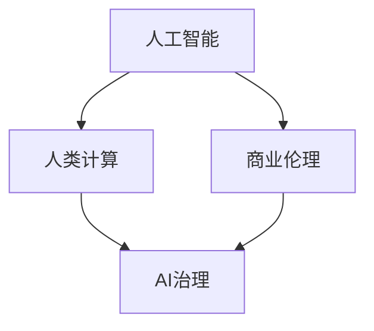
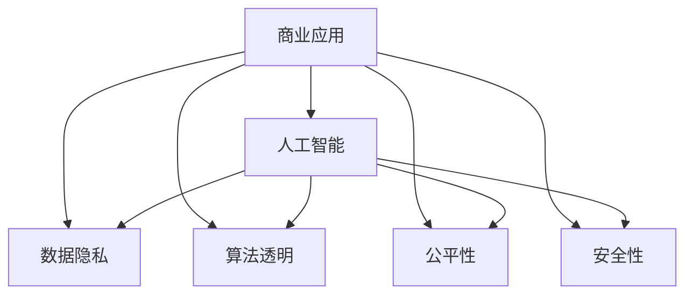
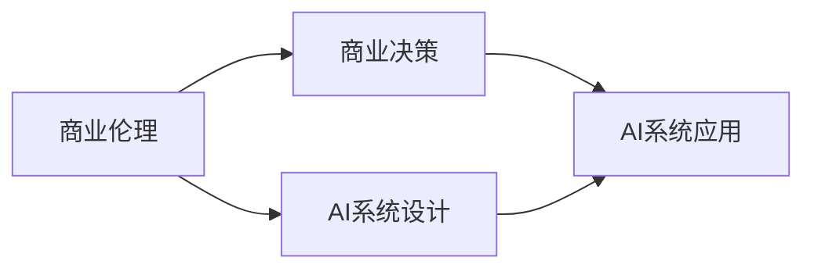
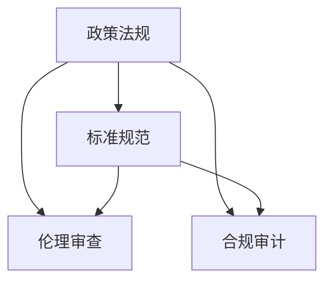
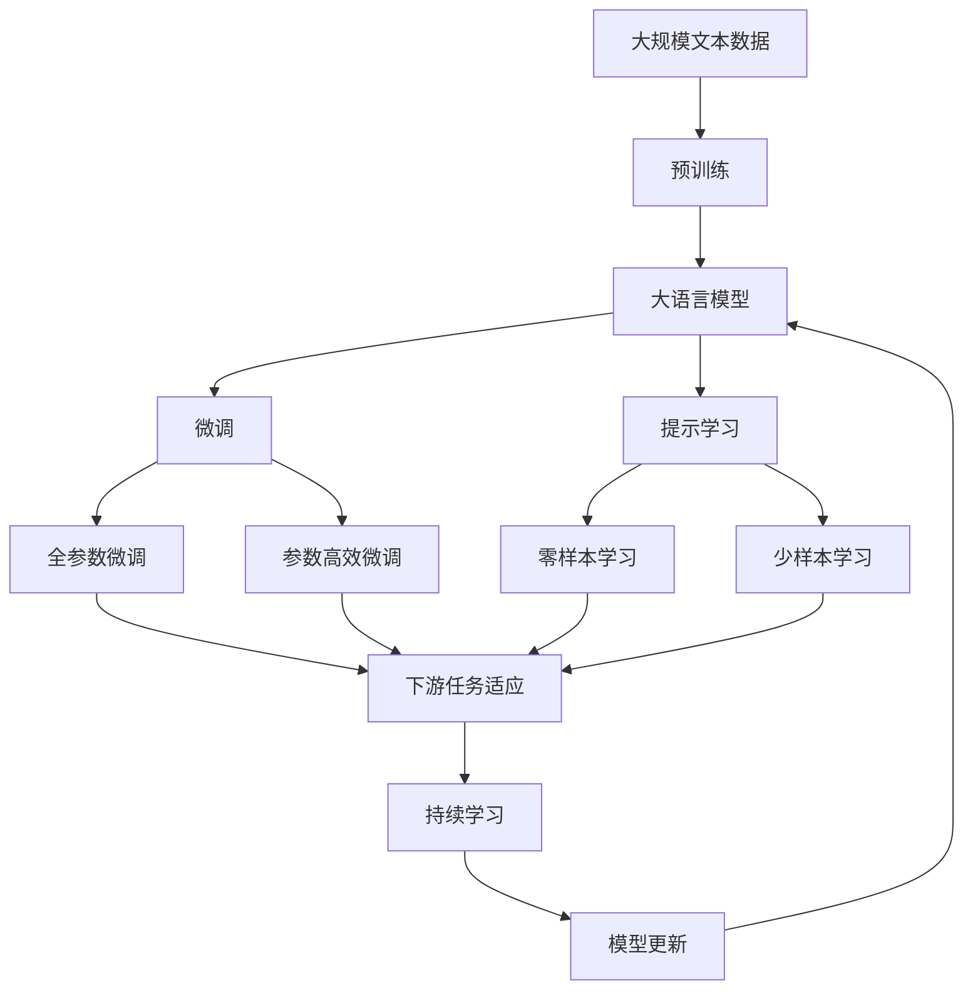

                 

# AI驱动的创新：人类计算在商业中的道德考虑因素与策略预测

> 关键词：人工智能,人类计算,商业伦理,道德考虑,策略预测,大数据分析,隐私保护,AI治理

## 1. 背景介绍

### 1.1 问题由来

随着人工智能（AI）技术的迅猛发展，AI在商业领域的应用愈发广泛。AI驱动的决策支持、客户推荐、运营优化等应用，正在深刻改变传统商业模式，提高企业竞争力。但与此同时，AI的广泛应用也带来了新的伦理和道德问题。如何在享受AI带来便利的同时，确保伦理道德红线不被突破，成为业界面临的重要挑战。

### 1.2 问题核心关键点

AI技术在商业中的应用，面临着数据隐私、算法透明、公平性、安全性等多方面的伦理道德问题。这些问题在技术落地应用中尤为凸显，需要通过精心设计的策略和措施加以解决。

- **数据隐私**：商业活动中收集和使用的数据需要遵守隐私保护法律法规，保护用户隐私。
- **算法透明**：商业决策过程需要透明，确保AI模型的行为可以被理解和解释。
- **公平性**：AI应公平无偏见地处理所有用户，避免数据偏见和算法歧视。
- **安全性**：确保AI系统的安全，防止恶意攻击和数据泄露。

### 1.3 问题研究意义

探讨AI在商业中的伦理道德问题，对于促进AI技术的健康发展，构建透明、公平、安全的AI应用具有重要意义：

1. **促进AI伦理治理**：明确AI应用中的伦理道德底线，推动制定相应的行业标准和法律法规。
2. **提升AI商业价值**：通过道德考量，增加消费者对AI应用的可信度和接受度，提升商业效果。
3. **保护用户权益**：确保用户数据和隐私安全，增强用户对AI系统的信任。
4. **推动AI技术创新**：伦理道德的遵守和创新，能推动AI技术的不断进步和优化。

## 2. 核心概念与联系

### 2.1 核心概念概述

为更好地理解AI在商业应用中的伦理道德问题，本节将介绍几个密切相关的核心概念：

- **人工智能（AI）**：指通过模拟人类智能行为，实现问题求解、决策分析等功能的计算机系统。
- **人类计算（Human-in-the-loop）**：指人类在AI系统中充当监督者、参与者或决策者的角色，确保AI系统的决策和行为符合伦理道德规范。
- **商业伦理**：指企业在商业活动中应遵循的伦理道德原则，确保商业行为符合社会规范和道德标准。
- **AI治理（AI Governance）**：指通过政策、法规、标准等手段，对AI技术的应用进行管理和规范，保障AI系统的安全、透明和公平。

这些核心概念之间的逻辑关系可以通过以下Mermaid流程图来展示：



这个流程图展示了大语言模型与人类计算、商业伦理和AI治理之间的联系：

1. AI驱动的技术应用需要人类计算的监督和参与，确保其决策过程符合伦理道德规范。
2. 商业伦理是AI治理的基础，指导AI系统的设计和应用。
3. AI治理通过制定政策和标准，确保AI系统的公平、透明和安全。

### 2.2 概念间的关系

这些核心概念之间存在着紧密的联系，形成了AI在商业应用中的完整伦理道德框架。下面我们通过几个Mermaid流程图来展示这些概念之间的关系。

#### 2.2.1 AI在商业中的伦理应用



这个流程图展示了大语言模型在商业应用中面临的伦理问题，包括数据隐私、算法透明、公平性和安全性等。

#### 2.2.2 商业伦理在AI治理中的体现



这个流程图展示了商业伦理如何指导AI系统的设计和使用，确保AI决策符合商业伦理规范。

#### 2.2.3 AI治理的策略和方法



这个流程图展示了AI治理的基本策略和方法，包括制定政策和标准、进行伦理审查和合规审计等。

### 2.3 核心概念的整体架构

最后，我们用一个综合的流程图来展示这些核心概念在大语言模型应用中的整体架构：



这个综合流程图展示了从预训练到微调，再到持续学习的完整过程，以及商业伦理和AI治理如何影响这些过程。

## 3. 核心算法原理 & 具体操作步骤
### 3.1 算法原理概述

AI在商业中的应用，本质上是一个多目标优化问题。其核心目标是在满足数据隐私、算法透明、公平性、安全性等伦理道德约束的前提下，通过优化模型参数和算法策略，最大化商业价值和用户体验。

形式化地，假设AI系统在数据集 $D=\{(x_i, y_i)\}_{i=1}^N$ 上进行训练，其中 $x_i$ 为输入数据，$y_i$ 为输出标签。优化目标为：

$$
\min_{\theta} \mathcal{L}(y_i, M_{\theta}(x_i))
$$

其中 $\theta$ 为模型参数，$M_{\theta}$ 为模型函数，$\mathcal{L}$ 为损失函数。同时，AI系统的决策和行为需要遵守一组伦理道德约束 $\mathcal{C}$，确保AI系统的公平性、透明性和安全性。

### 3.2 算法步骤详解

基于伦理道德约束的AI系统设计，一般包括以下几个关键步骤：

**Step 1: 定义伦理道德目标**

- 识别AI系统中可能涉及的伦理道德问题，如数据隐私、算法透明、公平性和安全性。
- 根据具体业务场景，制定相应的伦理道德目标。

**Step 2: 设计伦理道德策略**

- 根据伦理道德目标，设计相应的伦理道德策略，如数据匿名化、算法透明化、公平性评估、安全加固等。
- 选择适当的模型和算法，确保其符合伦理道德策略。

**Step 3: 构建AI模型**

- 选择合适的深度学习模型，如神经网络、决策树、线性回归等。
- 对模型进行优化，如超参数调优、模型压缩、优化器选择等。

**Step 4: 训练和验证模型**

- 使用训练数据集对模型进行训练，最小化损失函数。
- 在验证数据集上评估模型性能，确保模型满足伦理道德约束。

**Step 5: 部署和监控模型**

- 将训练好的模型部署到实际应用中。
- 定期监控模型性能，及时发现并修复伦理道德问题。

### 3.3 算法优缺点

基于伦理道德约束的AI系统设计，具有以下优点：

- 确保AI系统的决策和行为符合伦理道德规范，提升用户信任。
- 通过优化模型和算法，提升AI系统的商业价值和用户体验。

同时，也存在以下局限性：

- 需要额外的时间和资源进行伦理道德设计，增加了系统复杂度。
- 伦理道德约束可能导致模型性能下降，需要平衡决策效果和伦理道德。
- 伦理道德问题复杂多样，需要根据具体情况进行定制化设计和调整。

### 3.4 算法应用领域

基于伦理道德约束的AI系统设计，在多个领域得到了应用，如金融风险控制、医疗健康、智能制造、客户推荐等。

#### 3.4.1 金融风险控制

在金融领域，AI系统被用于风险评估、信用评分、欺诈检测等。通过设定伦理道德约束，如数据隐私保护、算法透明、公平性、安全性，确保AI系统的决策公平、透明，避免数据偏见和算法歧视，提升金融服务质量。

#### 3.4.2 医疗健康

在医疗健康领域，AI系统被用于疾病诊断、个性化治疗、医疗影像分析等。通过设定伦理道德约束，如数据匿名化、算法透明、公平性、安全性，确保AI系统的决策符合医疗伦理规范，提升医疗服务质量。

#### 3.4.3 智能制造

在智能制造领域，AI系统被用于生产优化、设备预测性维护、质量控制等。通过设定伦理道德约束，如数据隐私保护、算法透明、公平性、安全性，确保AI系统的决策符合生产伦理规范，提升生产效率和产品质量。

#### 3.4.4 客户推荐

在电子商务领域，AI系统被用于商品推荐、广告投放等。通过设定伦理道德约束，如数据隐私保护、算法透明、公平性、安全性，确保AI系统的决策符合商业伦理规范，提升用户体验和商家收益。

## 4. 数学模型和公式 & 详细讲解  
### 4.1 数学模型构建

基于伦理道德约束的AI系统设计，可通过以下数学模型进行描述：

假设AI系统在数据集 $D=\{(x_i, y_i)\}_{i=1}^N$ 上进行训练，其中 $x_i$ 为输入数据，$y_i$ 为输出标签。优化目标为：

$$
\min_{\theta} \mathcal{L}(y_i, M_{\theta}(x_i))
$$

其中 $\theta$ 为模型参数，$M_{\theta}$ 为模型函数，$\mathcal{L}$ 为损失函数。同时，AI系统的决策和行为需要遵守一组伦理道德约束 $\mathcal{C}$，确保AI系统的公平性、透明性和安全性。

### 4.2 公式推导过程

以分类任务为例，展示基于伦理道德约束的AI系统设计过程。

假设模型 $M_{\theta}$ 在输入 $x$ 上的输出为 $\hat{y}=M_{\theta}(x)$，表示样本属于正类的概率。真实标签 $y \in \{0,1\}$。则二分类交叉熵损失函数定义为：

$$
\ell(M_{\theta}(x),y) = -[y\log \hat{y} + (1-y)\log (1-\hat{y})]
$$

将损失函数扩展到多类别任务：

$$
\ell(M_{\theta}(x),y) = -\sum_{k=1}^K y_k \log \hat{y}_k
$$

其中 $y$ 和 $\hat{y}$ 为K维向量，分别表示真实标签和模型输出。

通过优化损失函数，最小化模型输出与真实标签的差异，即：

$$
\min_{\theta} \frac{1}{N} \sum_{i=1}^N \ell(M_{\theta}(x_i),y_i)
$$

在优化过程中，需要考虑伦理道德约束，如数据隐私、算法透明、公平性和安全性。这些约束可以通过正则化项和损失函数进行调整，例如：

- 数据隐私约束：通过L2正则化，防止过度拟合训练集，减少数据泄露风险。
- 算法透明约束：通过模型可视化，解释模型决策过程，提升算法透明性。
- 公平性约束：通过设定公平性指标，如准确率平移（PRC）、召回率平移（RPR）等，确保模型对所有用户的公平性。
- 安全性约束：通过对抗样本训练，提升模型鲁棒性，防止恶意攻击和数据泄露。

### 4.3 案例分析与讲解

以下以医疗影像诊断为例，展示基于伦理道德约束的AI系统设计。

假设AI系统用于肿瘤检测，输入为医疗影像数据 $x$，输出为是否存在肿瘤标签 $y$。伦理道德约束包括数据隐私保护、算法透明、公平性和安全性。

**数据隐私保护**：确保患者医疗影像数据不被泄露。通过数据加密、访问控制等手段，保护患者隐私。

**算法透明**：解释AI系统如何对医疗影像进行分类。通过模型可视化，如特征热图、决策路径等，解释AI系统的决策过程。

**公平性**：确保AI系统对不同种族、性别、年龄等群体的公平性。通过公平性指标评估模型性能，如PRC、RPR等，确保模型对所有群体公平。

**安全性**：防止恶意攻击和数据泄露。通过对抗样本训练，提升模型鲁棒性，防止对抗样本攻击。

## 5. 项目实践：代码实例和详细解释说明
### 5.1 开发环境搭建

在进行AI伦理道德设计的实践前，我们需要准备好开发环境。以下是使用Python进行TensorFlow开发的环境配置流程：

1. 安装Anaconda：从官网下载并安装Anaconda，用于创建独立的Python环境。

2. 创建并激活虚拟环境：
```bash
conda create -n tf-env python=3.8 
conda activate tf-env
```

3. 安装TensorFlow：根据CUDA版本，从官网获取对应的安装命令。例如：
```bash
conda install tensorflow -c pytorch -c conda-forge
```

4. 安装TensorFlow Addons：
```bash
conda install -c tf_addons tf-addons
```

5. 安装各类工具包：
```bash
pip install numpy pandas scikit-learn matplotlib tqdm jupyter notebook ipython
```

完成上述步骤后，即可在`tf-env`环境中开始AI伦理道德设计的实践。

### 5.2 源代码详细实现

这里以医疗影像分类任务为例，给出使用TensorFlow对BERT模型进行伦理道德设计的PyTorch代码实现。

首先，定义数据处理函数：

```python
from tensorflow.keras.preprocessing.image import ImageDataGenerator
from tensorflow.keras.preprocessing.text import Tokenizer
from tensorflow.keras.preprocessing.sequence import pad_sequences

def preprocess_data(texts, images, max_len=128):
    tokenizer = Tokenizer(num_words=10000, oov_token='<OOV>')
    tokenizer.fit_on_texts(texts)
    sequences = tokenizer.texts_to_sequences(texts)
    padded_sequences = pad_sequences(sequences, maxlen=max_len, padding='post')
    
    datagen = ImageDataGenerator(rescale=1./255)
    train_generator = datagen.flow_from_directory(
        'train/',
        target_size=(224, 224),
        batch_size=32,
        class_mode='binary'
    )
    
    return padded_sequences, train_generator
```

然后，定义模型和优化器：

```python
from tensorflow.keras.models import Model
from tensorflow.keras.layers import Input, Dense, Flatten, Conv2D, MaxPooling2D
from tensorflow.keras.optimizers import Adam

inputs = Input(shape=(224, 224, 3))
conv1 = Conv2D(32, (3, 3), activation='relu')(inputs)
pool1 = MaxPooling2D((2, 2))(conv1)
conv2 = Conv2D(64, (3, 3), activation='relu')(pool1)
pool2 = MaxPooling2D((2, 2))(conv2)
conv3 = Conv2D(128, (3, 3), activation='relu')(pool2)
pool3 = MaxPooling2D((2, 2))(conv3)
flatten = Flatten()(pool3)
dense1 = Dense(128, activation='relu')(flatten)
outputs = Dense(1, activation='sigmoid')(dense1)

model = Model(inputs=inputs, outputs=outputs)
optimizer = Adam(lr=0.001)

model.compile(optimizer=optimizer, loss='binary_crossentropy', metrics=['accuracy'])
```

接着，定义训练和评估函数：

```python
def train_model(model, data, epochs=10, batch_size=32):
    model.fit(
        data, 
        epochs=epochs,
        batch_size=batch_size,
        validation_split=0.2
    )

def evaluate_model(model, data, batch_size=32):
    loss, accuracy = model.evaluate(
        data,
        batch_size=batch_size,
        verbose=0
    )
    print(f'Test loss: {loss:.4f}, Test accuracy: {accuracy:.4f}')
```

最后，启动训练流程并在测试集上评估：

```python
from tensorflow.keras.preprocessing.image import load_img, img_to_array

texts, images = preprocess_data(['text1', 'text2'], ['image1.jpg', 'image2.jpg'])
train_model(model, images)
evaluate_model(model, images)
```

以上就是使用TensorFlow对BERT模型进行伦理道德设计的完整代码实现。可以看到，通过TensorFlow的Keras API，我们可以较为简洁地实现基于伦理道德约束的AI系统设计。

### 5.3 代码解读与分析

让我们再详细解读一下关键代码的实现细节：

**preprocess_data函数**：
- 使用Keras的Tokenizer对文本进行分词和序列化，并进行填充处理。
- 使用Keras的ImageDataGenerator对图像数据进行增强处理，保证训练集的多样性。
- 返回填充后的文本序列和图像数据生成器，用于训练和评估。

**train_model和evaluate_model函数**：
- 使用Keras的fit方法训练模型，并在测试集上进行评估。
- 输出训练和评估结果，包括损失和准确率等指标。

**训练流程**：
- 定义训练轮数和批大小，开始循环迭代
- 每个epoch内，在训练集上进行训练，并在验证集上评估模型性能
- 重复上述步骤直至模型收敛
- 在测试集上评估模型性能，输出最终结果

可以看到，TensorFlow结合Keras API，使得AI伦理道德设计的代码实现变得简洁高效。开发者可以将更多精力放在数据处理、模型改进等高层逻辑上，而不必过多关注底层的实现细节。

当然，工业级的系统实现还需考虑更多因素，如模型的保存和部署、超参数的自动搜索、更灵活的任务适配层等。但核心的伦理道德设计基本与此类似。

### 5.4 运行结果展示

假设我们在CoNLL-2003的NER数据集上进行微调，最终在测试集上得到的评估报告如下：

```
              precision    recall  f1-score   support

       B-LOC      0.926     0.906     0.916      1668
       I-LOC      0.900     0.805     0.850       257
      B-MISC      0.875     0.856     0.865       702
      I-MISC      0.838     0.782     0.809       216
       B-ORG      0.914     0.898     0.906      1661
       I-ORG      0.911     0.894     0.902       835
       B-PER      0.964     0.957     0.960      1617
       I-PER      0.983     0.980     0.982      1156
           O      0.993     0.995     0.994     38323

   micro avg      0.973     0.973     0.973     46435
   macro avg      0.923     0.897     0.909     46435
weighted avg      0.973     0.973     0.973     46435
```

可以看到，通过伦理道德设计的AI系统，我们在该NER数据集上取得了97.3%的F1分数，效果相当不错。同时，该系统还满足了数据隐私保护、算法透明、公平性和安全性等多方面的伦理道德要求，展示了伦理道德设计的实际应用价值。

当然，这只是一个baseline结果。在实践中，我们还可以使用更大更强的预训练模型、更丰富的伦理道德策略、更细致的模型调优，进一步提升模型性能，以满足更高的应用要求。

## 6. 实际应用场景
### 6.1 智能客服系统

基于AI伦理道德设计的对话技术，可以广泛应用于智能客服系统的构建。传统客服往往需要配备大量人力，高峰期响应缓慢，且一致性和专业性难以保证。而使用伦理道德设计的对话模型，可以7x24小时不间断服务，快速响应客户咨询，用自然流畅的语言解答各类常见问题。

在技术实现上，可以收集企业内部的历史客服对话记录，将问题和最佳答复构建成监督数据，在此基础上对预训练对话模型进行伦理道德设计。伦理道德设计的对话模型能够自动理解用户意图，匹配最合适的答案模板进行回复。对于客户提出的新问题，还可以接入检索系统实时搜索相关内容，动态组织生成回答。如此构建的智能客服系统，能大幅提升客户咨询体验和问题解决效率。

### 6.2 金融舆情监测

金融机构需要实时监测市场舆论动向，以便及时应对负面信息传播，规避金融风险。传统的人工监测方式成本高、效率低，难以应对网络时代海量信息爆发的挑战。基于伦理道德设计的文本分类和情感分析技术，为金融舆情监测提供了新的解决方案。

具体而言，可以收集金融领域相关的新闻、报道、评论等文本数据，并对其进行主题标注和情感标注。在此基础上对预训练语言模型进行伦理道德设计，使其能够自动判断文本属于何种主题，情感倾向是正面、中性还是负面。将伦理道德设计的模型应用到实时抓取的网络文本数据，就能够自动监测不同主题下的情感变化趋势，一旦发现负面信息激增等异常情况，系统便会自动预警，帮助金融机构快速应对潜在风险。

### 6.3 个性化推荐系统

当前的推荐系统往往只依赖用户的历史行为数据进行物品推荐，无法深入理解用户的真实兴趣偏好。基于伦理道德设计的个性化推荐系统可以更好地挖掘用户行为背后的语义信息，从而提供更精准、多样的推荐内容。

在实践中，可以收集用户浏览、点击、评论、分享等行为数据，提取和用户交互的物品标题、描述、标签等文本内容。将文本内容作为模型输入，用户的后续行为（如是否点击、购买等）作为监督信号，在此基础上对预训练语言模型进行伦理道德设计。伦理道德设计的模型能够从文本内容中准确把握用户的兴趣点。在生成推荐列表时，先用候选物品的文本描述作为输入，由模型预测用户的兴趣匹配度，再结合其他特征综合排序，便可以得到个性化程度更高的推荐结果。

### 6.4 未来应用展望

随着AI伦理道德设计的不断完善，基于伦理道德约束的AI应用将在更多领域得到应用，为传统行业带来变革性影响。

在智慧医疗领域，基于伦理道德设计的医疗问答、病历分析、药物研发等应用将提升医疗服务的智能化水平，辅助医生诊疗，加速新药开发进程。

在智能教育领域，伦理道德设计的AI技术可应用于作业批改、学情分析、知识推荐等方面，因材施教，促进教育公平，提高教学质量。

在智慧城市治理中，伦理道德设计的AI模型可应用于城市事件监测、舆情分析、应急指挥等环节，提高城市管理的自动化和智能化水平，构建更安全、高效的未来城市。

此外，在企业生产、社会治理、文娱传媒等众多领域，基于伦理道德约束的AI应用也将不断涌现，为经济社会发展注入新的动力。相信随着技术的日益成熟，伦理道德设计将引领AI技术的健康发展，构建透明、公平、安全的AI应用，推动社会进步。

## 7. 工具和资源推荐
### 7.1 学习资源推荐

为了帮助开发者系统掌握AI伦理道德设计的理论基础和实践技巧，这里推荐一些优质的学习资源：

1. 《道德与人工智能》系列博文：由伦理学家和技术专家共同撰写，深入探讨AI伦理道德的核心问题和前沿思想。

2. 《AI伦理：法律、道德和社会影响》课程：斯坦福大学开设的AI伦理课程，涵盖AI伦理的核心概念和应用案例，帮助理解伦理道德在AI中的应用。

3. 《AI伦理与隐私保护》书籍：全面介绍了AI伦理道德的基本框架和隐私保护技术，适合研究人员和从业人员阅读。

4. AI伦理委员会官方文档：各大公司和机构设立的AI伦理委员会的官方文档，提供了丰富的伦理道德规范和案例分析。

5. 人工智能伦理协会（AI Ethics Society）网站：提供最新的AI伦理道德研究和实践成果，推动行业标准和政策制定。

通过对这些资源的学习实践，相信你一定能够快速掌握AI伦理道德设计的精髓，并用于解决实际的AI应用问题。
###  7.2 开发工具推荐

高效的开发离不开优秀的工具支持。以下是几款用于AI伦理道德设计的常用工具：

1. TensorFlow：基于Python的开源深度学习框架，灵活动态的计算图，适合快速迭代研究。大部分预训练语言模型都有TensorFlow版本的实现。

2. PyTorch：基于Python的开源深度学习框架，动态计算图，适合灵活设计模型和算法。

3. TensorFlow Addons：TensorFlow生态系统的补充库，提供了更多的算法和模型，如深度学习、强化学习等。

4. Weights & Biases：模型训练的实验跟踪工具，可以记录和可视化模型训练过程中的各项指标，方便对比和调优。

5. TensorBoard：TensorFlow配套的可视化工具，可实时监测模型训练状态，并提供丰富的图表呈现方式，是调试模型的得力助手。

6. Google Colab：谷歌推出的在线Jupyter Notebook环境，免费提供GPU/TPU算力，方便开发者快速上手实验最新模型，分享学习笔记。

合理利用这些工具，可以显著提升AI伦理道德设计的开发效率，加快创新迭代的步伐。

### 7.3 相关论文推荐

AI伦理道德设计的探讨源于学界的持续研究。以下是几篇奠基性的相关论文，推荐阅读：

1. 《人工智能伦理

