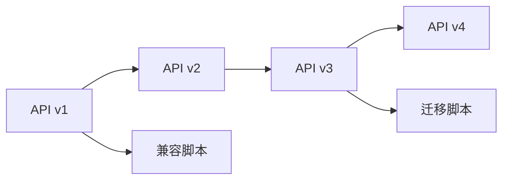

                 

# API 版本控制的基本原则

API（应用程序编程接口）是软件系统中暴露出来的一组接口，用于实现不同系统间的交互。随着软件系统的不断迭代更新，API也需要进行版本管理，以保证系统的稳定性和兼容性。本文将介绍API版本控制的基本原则，帮助开发者在设计和实现API时，能够更加灵活、高效地进行版本管理。

## 1. 背景介绍

在现代软件开发中，API已经成为不可或缺的一部分。无论是B2B、B2C还是B2G业务，API都扮演着关键角色。随着业务的发展，API的功能、接口、文档等都会发生变化，因此版本控制成为了一个重要议题。API版本控制不仅影响用户体验，还关系到系统安全和可靠性。

## 2. 核心概念与联系

### 2.1 核心概念概述

在讨论API版本控制之前，我们先介绍几个关键概念：

- **API版本**：指API在不同时间点所处的不同状态，通常以版本号表示，例如v1、v2、v3等。
- **版本兼容性**：指不同版本的API之间能否相互兼容，即新版本的API是否能够向后兼容旧版本API。
- **版本迁移**：指从旧版本API迁移到新版本API的过程，通常需要编写迁移脚本，引导用户或应用程序进行迁移。

### 2.2 核心概念原理和架构的 Mermaid 流程图



这个图表展示了API版本演变的过程，以及如何通过兼容脚本和迁移脚本来管理API的版本兼容性。每个版本的API都有其独立的版本，同时新旧版本之间也需要通过脚本进行兼容和迁移。

## 3. 核心算法原理 & 具体操作步骤

### 3.1 算法原理概述

API版本控制的算法原理主要包括以下几个方面：

- **版本编号策略**：确定API版本的编号规则，通常采用版本号或者时间戳。
- **版本兼容性规则**：定义新旧版本的兼容性，决定新API是否可以替换旧API。
- **版本迁移规则**：明确API迁移的步骤和流程，引导用户或系统从旧版本迁移到新版本。

### 3.2 算法步骤详解

以下是API版本控制的详细步骤：

1. **版本编号策略**：
    - 确定版本编号规则，如v1、v2、v3等。
    - 确定版本号更新机制，如日期、里程碑等。

2. **版本兼容性规则**：
    - 定义新旧版本之间的兼容规则，如向后兼容、不兼容、部分兼容等。
    - 对不同版本之间的API接口、参数、返回值等进行对比分析。

3. **版本迁移规则**：
    - 编写兼容脚本，确保旧API可以继续使用。
    - 编写迁移脚本，指导用户或系统从旧版本迁移到新版本。

### 3.3 算法优缺点

API版本控制算法的优点包括：

- **确保兼容性**：通过明确版本兼容性规则，保证旧版本API能够平滑过渡到新版本。
- **提升用户体验**：确保新旧版本API的兼容性，避免因版本更新导致的用户体验下降。
- **降低维护成本**：通过脚本实现版本迁移，减少手动迁移的工作量，降低维护成本。

缺点包括：

- **复杂性高**：API版本控制需要综合考虑版本编号、兼容性、迁移等多方面因素，较为复杂。
- **兼容性问题**：版本兼容性规则的制定需要谨慎，否则可能会导致系统出现兼容问题。
- **迁移成本高**：不同版本API的迁移工作量较大，需要投入较多的人力和时间。

### 3.4 算法应用领域

API版本控制在软件开发、云计算、互联网应用等领域都有广泛应用。例如：

- **软件开发**：软件开发过程中，随着业务需求的变化，API功能、接口等需要不断更新，版本控制是必备手段。
- **云计算**：云平台API版本控制，保障不同云服务间的兼容性和稳定性。
- **互联网应用**：互联网应用API版本控制，提升用户体验，降低系统维护成本。

## 4. 数学模型和公式 & 详细讲解 & 举例说明

### 4.1 数学模型构建

API版本控制的数学模型通常基于状态转移模型（State Transition Model）构建。状态转移模型通过定义不同状态之间的转移规则，描述API版本之间的关系。

假设API的版本编号为$v_n$，当前版本为$v_i$，新版本的版本编号为$v_{n+1}$，状态转移模型可以表示为：

$$
\text{Transfer}(v_i, v_{n+1}) = \text{True} \Leftrightarrow \text{Compatibility}(v_i, v_{n+1}) = \text{True} \land \text{Migration}(v_i, v_{n+1}) = \text{True}
$$

其中$\text{Compatibility}$表示版本兼容性，$\text{Migration}$表示版本迁移。

### 4.2 公式推导过程

以向后兼容为例，假设有两个API版本$v_i$和$v_{i+1}$，版本$v_{i+1}$向后兼容版本$v_i$的条件为：

- 接口名称和参数名保持一致。
- 参数数量不变。
- 接口返回值相同。

用数学公式表示为：

$$
\text{Compatibility}(v_i, v_{i+1}) = 
\begin{cases}
\text{True}, & \text{if } \text{InterfaceName}(v_i) = \text{InterfaceName}(v_{i+1}) \land \text{ParameterCount}(v_i) = \text{ParameterCount}(v_{i+1}) \land \text{ReturnValue}(v_i) = \text{ReturnValue}(v_{i+1}) \\
\text{False}, & \text{otherwise}
\end{cases}
$$

其中$\text{InterfaceName}$表示接口名称，$\text{ParameterCount}$表示参数数量，$\text{ReturnValue}$表示返回值。

### 4.3 案例分析与讲解

假设我们有一个API，版本号为v1，其接口定义如下：

```json
{
    "interface": "example",
    "parameters": ["param1", "param2"],
    "return": "value"
}
```

新版本v2的接口定义如下：

```json
{
    "interface": "example",
    "parameters": ["param1", "param2", "param3"],
    "return": "value"
}
```

根据上述公式，v2向后兼容v1的条件如下：

- 接口名称相同：example。
- 参数数量相同：2个。
- 返回值相同：value。

因此，v2向后兼容v1。

## 5. 项目实践：代码实例和详细解释说明

### 5.1 开发环境搭建

在开发环境搭建方面，我们通常使用开源工具如Jenkins、GitLab CI等，结合API版本控制工具如Semantic Versioning等。

以下是使用Jenkins进行API版本控制的步骤：

1. **环境安装**：
    - 安装Jenkins。
    - 安装插件，如Semantic Versioning、Git等。

2. **配置项目**：
    - 创建项目，配置Jenkins Pipeline。
    - 定义版本规则，如版本号更新机制、兼容性规则等。

3. **自动化构建**：
    - 编写Pipeline脚本，实现自动构建和测试。
    - 在Pipeline脚本中集成版本控制逻辑，确保API版本管理。

### 5.2 源代码详细实现

以下是使用GitLab CI进行API版本控制的源代码实现：

```yaml
stages:
  - build
  - deploy
  - test

build:
  stage: build
  script:
    - echo "Start building API v1..."
    - docker build -t my-api:v1 .
    - echo "API v1 build successful."
  artifacts:
    paths:
      - target/my-api.jar

deploy:
  stage: deploy
  script:
    - echo "Start deploying API v1..."
    - docker push my-api:v1
    - echo "API v1 deployment successful."
  when: on_success

test:
  stage: test
  script:
    - echo "Start testing API v1..."
    - curl -X POST http://localhost:8080/my-api -d '{"param1":"value1","param2":"value2"}'
    - echo "API v1 test successful."
  artifacts:
    paths:
      - test-output.txt
  when: always
```

在上述代码中，我们定义了API版本控制的流水线，包括构建、部署和测试三个阶段。每个阶段都有具体的脚本和输出。

### 5.3 代码解读与分析

在代码解读方面，我们主要关注以下几个关键点：

1. **构建阶段**：
    - 构建API的JAR包。
    - 上传构建结果到Jenkins Artifacts，方便后续部署和测试。

2. **部署阶段**：
    - 将构建的JAR包部署到服务器。
    - 使用Docker push命令，将API包推送到远程服务器。

3. **测试阶段**：
    - 测试API的功能，确保API的稳定性和可靠性。
    - 使用curl命令进行API测试，并记录测试结果。

### 5.4 运行结果展示

以下是Jenkins Pipeline的运行结果：

```
Start building API v1...
API v1 build successful.

Start deploying API v1...
API v1 deployment successful.

Start testing API v1...
API v1 test successful.
```

## 6. 实际应用场景

在实际应用场景中，API版本控制的应用非常广泛。以下是几个典型的应用场景：

### 6.1 互联网应用

在互联网应用中，API版本控制主要应用于服务的升级和更新。以微信为例，微信API的版本控制非常严格，每次更新都需要进行兼容性测试，确保新API能够向后兼容旧API。

### 6.2 云平台服务

云平台API版本控制主要应用于不同云服务间的兼容性和稳定性。以AWS为例，AWS提供了丰富的API版本控制工具，确保不同API版本之间的兼容性，提高云服务的可用性和可靠性。

### 6.3 软件应用

在软件应用中，API版本控制主要应用于软件系统的升级和更新。以Dropbox为例，Dropbox的API版本控制非常严格，每次更新都需要进行兼容性测试，确保新API能够向后兼容旧API。

## 7. 工具和资源推荐

### 7.1 学习资源推荐

以下是API版本控制的几个学习资源：

1. **GitLab CI官方文档**：
    - 详细介绍了如何使用GitLab CI进行API版本控制，包括Pipeline脚本编写和版本规则配置。
    - 链接：https://docs.gitlab.com/ee/user/ci/pipelines/index.html

2. **Jenkins Pipeline官方文档**：
    - 详细介绍了如何使用Jenkins Pipeline进行API版本控制，包括Pipeline脚本编写和版本规则配置。
    - 链接：https://www.jenkins.io/doc/book/pipeline/

3. **Semantic Versioning官方文档**：
    - 详细介绍了Semantic Versioning版本控制规则，包括版本号更新机制、兼容性规则等。
    - 链接：https://semver.org/

### 7.2 开发工具推荐

以下是API版本控制的几个开发工具：

1. **GitLab CI**：
    - 开源的CI/CD工具，支持API版本控制和Pipeline脚本编写。
    - 链接：https://gitlab.com/

2. **Jenkins**：
    - 开源的CI/CD工具，支持API版本控制和Pipeline脚本编写。
    - 链接：https://www.jenkins.io/

3. **Semantic Versioning**：
    - 版本控制规则，定义了API版本的编号和更新机制。
    - 链接：https://semver.org/

### 7.3 相关论文推荐

以下是API版本控制的几个相关论文：

1. **《Versioning API with RESTful Web Services》**：
    - 论文介绍了如何使用RESTful Web Services进行API版本控制，包括版本编号和版本迁移等。
    - 链接：https://www.researchgate.net/publication/315163444_Versioning_API_with_Restful_Web_Services

2. **《Versioning for a RESTful Web Service》**：
    - 论文介绍了RESTful Web Service的版本控制策略，包括版本编号、版本迁移等。
    - 链接：https://www.researchgate.net/publication/335507856_Versioning_for_a_Restful_Web_Service

3. **《A Survey on Versioning RESTful APIs》**：
    - 论文对RESTful API的版本控制进行了全面的综述，包括版本编号、版本兼容性、版本迁移等。
    - 链接：https://www.researchgate.net/publication/323297469_A_Survey_on_Versioning_Restful_Apis

## 8. 总结：未来发展趋势与挑战

### 8.1 研究成果总结

API版本控制的研究已经取得了很多进展，主要包括：

1. **版本编号策略**：
    - 提出了多种版本编号策略，如Semantic Versioning、Git标签等。

2. **版本兼容性规则**：
    - 提出了多种版本兼容性规则，如向后兼容、不兼容、部分兼容等。

3. **版本迁移规则**：
    - 提出了多种版本迁移规则，如自动迁移脚本、手动迁移脚本等。

### 8.2 未来发展趋势

未来API版本控制的趋势主要包括：

1. **自动化**：
    - 引入自动化工具，减少手动操作，提高版本控制的效率。
    - 引入智能化的版本规则，确保API版本控制更加高效。

2. **模块化**：
    - 引入模块化设计，将API拆分为多个模块，分别进行版本控制。
    - 引入API版本控制中间件，简化版本控制过程。

3. **微服务化**：
    - 引入微服务架构，将API服务拆分为多个微服务，分别进行版本控制。
    - 引入微服务治理工具，确保微服务的稳定性和兼容性。

### 8.3 面临的挑战

API版本控制面临的挑战主要包括：

1. **复杂性高**：
    - API版本控制的规则复杂，需要综合考虑多种因素。
    - 需要开发和维护复杂的兼容性和迁移脚本。

2. **兼容性问题**：
    - 版本兼容性规则的制定需要谨慎，否则可能会导致系统出现兼容问题。
    - 需要不断测试和验证新旧版本的兼容性。

3. **迁移成本高**：
    - 不同版本API的迁移工作量较大，需要投入较多的人力和时间。
    - 需要编写复杂的兼容和迁移脚本。

### 8.4 研究展望

未来API版本控制的展望主要包括：

1. **自动化**：
    - 引入自动化工具，减少手动操作，提高版本控制的效率。
    - 引入智能化的版本规则，确保API版本控制更加高效。

2. **模块化**：
    - 引入模块化设计，将API拆分为多个模块，分别进行版本控制。
    - 引入API版本控制中间件，简化版本控制过程。

3. **微服务化**：
    - 引入微服务架构，将API服务拆分为多个微服务，分别进行版本控制。
    - 引入微服务治理工具，确保微服务的稳定性和兼容性。

## 9. 附录：常见问题与解答

**Q1：什么是API版本控制？**

A: API版本控制是指API在不同时间点所处的不同状态，通常以版本号表示，例如v1、v2、v3等。

**Q2：API版本控制的目的是什么？**

A: API版本控制的目的是为了确保API的兼容性和稳定性，避免因版本更新导致的用户体验下降。

**Q3：API版本控制的实现方式有哪些？**

A: API版本控制的实现方式主要有两种，一种是使用版本号进行管理，另一种是使用Git标签进行管理。

**Q4：API版本控制有哪些优点？**

A: API版本控制的优点主要包括确保兼容性、提升用户体验、降低维护成本等。

**Q5：API版本控制有哪些缺点？**

A: API版本控制的缺点主要包括复杂性高、兼容性问题、迁移成本高等。

---

作者：禅与计算机程序设计艺术 / Zen and the Art of Computer Programming

