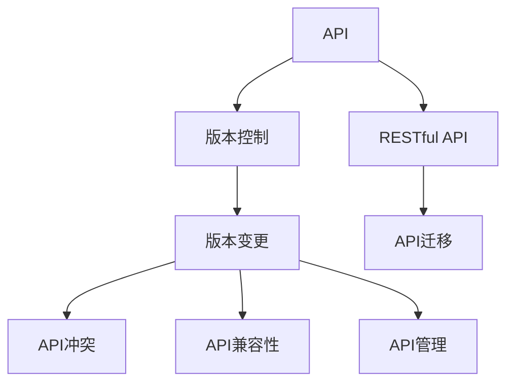
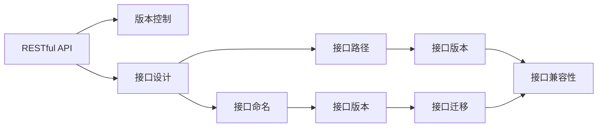
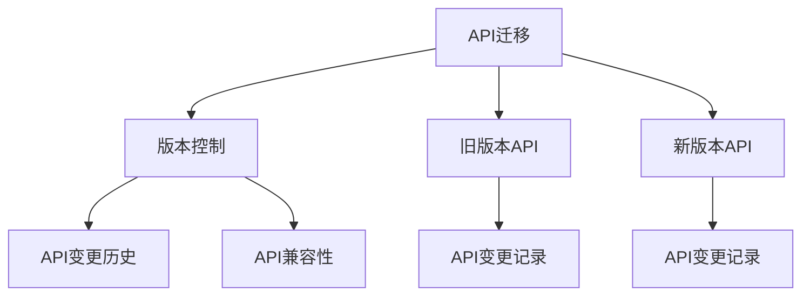
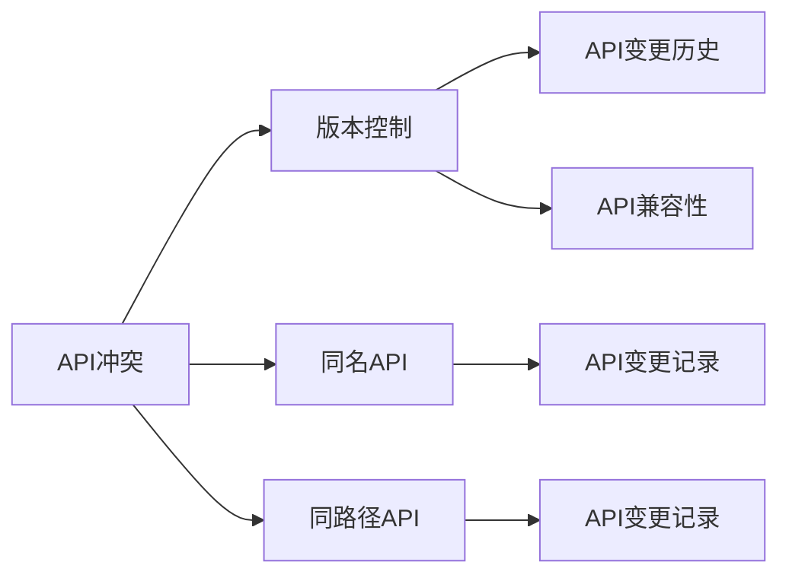
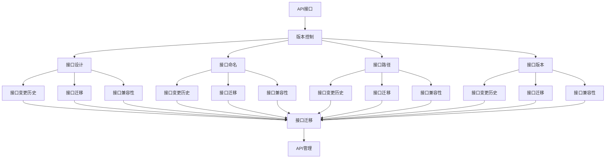

                 

# API 版本控制的重要性

> 关键词：API,版本控制,RESTful API,版本变更,API迁移,API冲突,API兼容性,API管理

## 1. 背景介绍

### 1.1 问题由来
随着软件项目的不断发展和演化，API的版本控制变得愈发重要。无论是面向内部开发团队的内部API，还是面向外部合作伙伴的外部API，都面临着版本变更的需求。API的版本控制不当，可能会导致版本混乱、兼容性问题、功能冲突等诸多挑战，严重影响项目的正常运转。

### 1.2 问题核心关键点
API版本控制的核心在于确保API版本之间的兼容性和稳定性，同时避免因版本变更而引起的功能破坏。合理的版本控制策略可以显著提升API的可靠性和维护效率，避免因版本变更引发的系统崩溃和业务中断。

### 1.3 问题研究意义
研究API版本控制的方法，对于提升API的可靠性和可用性，降低版本变更带来的风险，加速API的迭代开发，具有重要意义：

1. **保障系统稳定性**：避免因API版本变更导致的功能冲突，确保系统的平稳运行。
2. **提高开发效率**：通过明确稳定的API接口，加速开发团队的工作节奏，减少因版本混乱导致的沟通成本。
3. **增强用户体验**：一致稳定的API接口，可以提升用户体验，减少因版本变更带来的服务中断和误操作。
4. **促进协同合作**：清晰的API版本控制策略，可以明确不同团队的工作职责和合作流程，促进团队协作。
5. **支撑技术创新**：通过灵活的API版本管理，可以快速响应技术变更和需求迭代，促进API功能的持续创新。

## 2. 核心概念与联系

### 2.1 核心概念概述

为更好地理解API版本控制的方法，本节将介绍几个密切相关的核心概念：

- **API (Application Programming Interface)**：应用程序编程接口，用于描述软件模块之间的交互规则。API接口可以按照版本进行划分，确保不同版本之间的兼容性。
- **版本控制 (Version Control)**：记录和管理文件或代码版本变更的过程，通过版本控制可以追踪变更历史、管理冲突、回滚历史版本等。
- **RESTful API (Representational State Transfer)**：遵循REST架构风格的API接口，以HTTP协议为基础，使用统一接口设计，支持跨平台调用。
- **版本变更 (Version Change)**：API版本控制的核心操作，通过版本变更策略实现API的平稳过渡。
- **API迁移 (API Migration)**：在API版本变更过程中，将旧版本接口迁移到新版本中的过程。
- **API冲突 (API Conflict)**：不同版本API之间可能存在的接口同名或同路径冲突问题，需要通过版本控制机制进行协调。
- **API兼容性 (API Compatibility)**：确保新旧版本API之间的相互兼容，避免因版本变更引起的业务中断。
- **API管理 (API Management)**：涉及API的开发、发布、维护、监控、治理等全生命周期管理的过程。

这些核心概念之间的逻辑关系可以通过以下Mermaid流程图来展示：



这个流程图展示了大语言模型的核心概念及其之间的关系：

1. API接口采用RESTful架构，遵循REST原则进行接口设计。
2. 接口版本控制记录和管理API的变更历史。
3. 版本变更过程中，通过API迁移解决接口冲突问题。
4. 版本变更需确保API兼容，避免因版本变更导致的业务中断。
5. API管理贯穿API的全生命周期，涵盖开发、发布、维护、监控和治理等各个环节。

### 2.2 概念间的关系

这些核心概念之间存在着紧密的联系，形成了API版本控制系统的完整生态系统。下面我们通过几个Mermaid流程图来展示这些概念之间的关系。

#### 2.2.1 RESTful API的版本控制范式



这个流程图展示RESTful API的版本控制范式：

1. RESTful API采用接口设计，命名、路径、版本等作为API的核心元素。
2. 版本控制记录API的变更历史，包括接口命名、路径、版本等。
3. 接口迁移解决不同版本API之间的兼容性问题。
4. 接口迁移后需确保API兼容性，避免功能破坏。

#### 2.2.2 API迁移与版本控制的关系



这个流程图展示了API迁移与版本控制的关系：

1. API迁移从旧版本API迁移到新版本API。
2. 版本控制记录API的变更历史，包括旧版本API和新版本API的变更记录。
3. API兼容性确保新旧版本API之间的兼容，避免功能破坏。

#### 2.2.3 API冲突与版本控制的应用



这个流程图展示了API冲突与版本控制的应用：

1. API冲突包括同名API和同路径API等。
2. 版本控制记录API的变更历史，包括同名API和同路径API的变更记录。
3. API兼容性确保新旧版本API之间的兼容，避免功能冲突。

### 2.3 核心概念的整体架构

最后，我们用一个综合的流程图来展示这些核心概念在大语言模型版本控制过程中的整体架构：



这个综合流程图展示了从API接口设计到版本控制、API迁移、API兼容性等完整过程。API接口通过版本控制进行记录和管理，在API迁移过程中解决兼容性问题，确保新旧版本API的兼容性和稳定性。API管理贯穿API的全生命周期，涵盖开发、发布、维护、监控和治理等各个环节。通过这些流程图，我们可以更清晰地理解API版本控制过程中各个核心概念的关系和作用，为后续深入讨论具体的版本控制方法奠定基础。

## 3. 核心算法原理 & 具体操作步骤
### 3.1 算法原理概述

API版本控制的核心算法原理在于通过版本控制机制，记录和管理API接口的变更历史，确保新旧版本API之间的兼容性，并有效解决因版本变更导致的冲突和兼容性问题。以下是API版本控制的算法原理概述：

1. **版本控制策略**：设计合理的版本控制策略，记录API接口的变更历史。常见的版本控制策略包括语义版本控制、时间戳版本控制、用户版本控制等。
2. **版本变更机制**：根据业务需求，定义版本变更的规则，包括新增接口、删除接口、修改接口路径、修改接口参数等。
3. **API兼容性分析**：通过兼容性分析工具，评估新旧版本API之间的兼容性和冲突问题。
4. **API迁移策略**：制定API迁移策略，确保新旧版本API之间的平稳过渡。

### 3.2 算法步骤详解

基于API版本控制的核心算法原理，API版本控制的具体操作步骤如下：

**Step 1: 版本控制策略设计**
- 确定版本控制策略，如语义版本控制(Semantic Version Control)，即通过版本号来表示API接口的变更历史。
- 定义API接口的基本版本规则，如版本号格式、变更规则等。

**Step 2: 版本变更机制设计**
- 设计API接口的版本变更机制，明确新增接口、删除接口、修改接口路径、修改接口参数等变更方式。
- 定义版本变更的触发条件，如业务需求、技术迭代等。

**Step 3: 兼容性分析与检测**
- 使用兼容性分析工具，如Swagger API兼容性分析、Jenkins等，评估新旧版本API之间的兼容性。
- 检测API接口的兼容性问题，包括同名API、同路径API等冲突问题。

**Step 4: API迁移策略设计**
- 制定API迁移策略，明确API迁移的具体步骤和关键点。
- 定义API迁移的时间表和优先级，确保API迁移的平稳过渡。

**Step 5: 版本控制与API管理**
- 记录API接口的变更历史，确保版本控制记录的完整性和准确性。
- 使用API管理工具，如Postman、Swagger等，进行API接口的发布和维护。

**Step 6: 版本控制与API文档更新**
- 更新API文档，确保API接口的新版本文档准确反映API变更历史。
- 发布API变更通知，告知相关团队API变更信息。

### 3.3 算法优缺点

API版本控制具有以下优点：

1. **保障系统稳定性**：通过版本控制，可以记录和管理API接口的变更历史，确保新旧版本API之间的兼容性，避免因版本变更导致的功能冲突和业务中断。
2. **提高开发效率**：明确的版本控制策略可以加速API接口的迭代开发，减少因版本混乱导致的沟通成本。
3. **增强用户体验**：一致稳定的API接口可以提升用户体验，减少因版本变更带来的服务中断和误操作。
4. **促进协同合作**：清晰的API版本控制策略，可以明确不同团队的工作职责和合作流程，促进团队协作。
5. **支撑技术创新**：通过灵活的API版本管理，可以快速响应技术变更和需求迭代，促进API功能的持续创新。

同时，API版本控制也存在以下缺点：

1. **成本较高**：版本控制的实施需要投入较多的人力和时间，特别是在大型项目中。
2. **复杂性较高**：API接口的变更历史可能非常复杂，需要系统地记录和管理。
3. **兼容性问题**：在API接口的变更过程中，可能会出现兼容性问题，需要耗费时间和精力进行解决。

### 3.4 算法应用领域

API版本控制在多个领域中得到了广泛应用，包括但不限于以下几个方面：

- **软件开发**：在软件开发中，API版本控制用于管理项目中各模块之间的接口变更，确保各模块的兼容性。
- **企业服务**：在企业服务中，API版本控制用于管理企业对外提供的API接口，确保API的稳定性。
- **云服务**：在云服务中，API版本控制用于管理云平台提供的API接口，确保API的兼容性和稳定性。
- **移动应用**：在移动应用中，API版本控制用于管理移动应用与后端服务之间的接口变更，确保应用的兼容性。

## 4. 数学模型和公式 & 详细讲解  
### 4.1 数学模型构建

API版本控制的数学模型主要涉及版本控制策略的设计和API兼容性分析。这里我们以语义版本控制策略为例，构建API版本控制的数学模型。

假设API接口的基本版本规则为"major.minor.patch"，其中major、minor、patch分别表示大版本、次版本、补丁版本。定义API接口的变更规则如下：

- 新增接口时，大版本号加1，次版本号和补丁版本号保持不变。
- 删除接口时，大版本号保持不变，次版本号减1，补丁版本号保持不变。
- 修改接口路径时，大版本号保持不变，次版本号加1，补丁版本号保持不变。
- 修改接口参数时，大版本号保持不变，次版本号保持不变，补丁版本号加1。

### 4.2 公式推导过程

以语义版本控制策略为例，我们定义API接口的版本号为$V=\{(m,n,p)\}$，其中$m$、$n$、$p$分别表示大版本、次版本、补丁版本。

API接口的版本变更可以表示为：

$$
V_{new} = V_{old} + \Delta V
$$

其中$\Delta V$表示API接口的变更量，具体包括新增接口、删除接口、修改接口路径、修改接口参数等。

API兼容性分析的核心在于检测新旧版本API之间的兼容性和冲突问题。假设新旧版本API的接口定义分别为$V_{new}=\{(m_1,n_1,p_1)\}$和$V_{old}=\{(m_2,n_2,p_2)\}$，兼容性的判断条件为：

- 大版本号$m_1=m_2$。
- 次版本号$n_1 \geq n_2$。
- 补丁版本号$p_1 \geq p_2$。

兼容性分析的核心在于判断新旧版本API的接口是否符合上述条件。如果符合，则表示API兼容，否则表示API不兼容。

### 4.3 案例分析与讲解

假设我们有如下API接口版本变更记录：

- 从版本$V_{old}=\{1,0,0\}$变更为$V_{new}=\{2,0,0\}$，表示新增了API接口。
- 从版本$V_{old}=\{2,0,0\}$变更为$V_{new}=\{2,1,0\}$，表示修改了API接口路径。
- 从版本$V_{old}=\{2,1,0\}$变更为$V_{new}=\{2,1,1\}$，表示修改了API接口参数。

通过对上述变更记录的分析，可以得出新旧版本API的兼容性情况：

- 新旧版本API的兼容性满足$m_1=m_2$、$n_1 \geq n_2$、$p_1 \geq p_2$的条件，表示API兼容。

通过上述案例，可以看到API版本控制的数学模型和兼容性分析方法，可以有效解决API变更过程中可能出现的兼容性问题。

## 5. 项目实践：代码实例和详细解释说明
### 5.1 开发环境搭建

在进行API版本控制的实践前，我们需要准备好开发环境。以下是使用Python进行Swagger开发的环境配置流程：

1. 安装Anaconda：从官网下载并安装Anaconda，用于创建独立的Python环境。

2. 创建并激活虚拟环境：
```bash
conda create -n swagger-env python=3.8 
conda activate swagger-env
```

3. 安装Swagger和各种依赖：
```bash
conda install swagger-sqlalchemy flask flask-restful pydantic jinja2
```

4. 安装Swagger客户端：
```bash
pip install swagger-ui-simple
```

完成上述步骤后，即可在`swagger-env`环境中开始API版本控制的实践。

### 5.2 源代码详细实现

下面是使用Flask和Swagger构建API版本控制系统的Python代码实现：

```python
from flask import Flask, jsonify, request
from flask_restful import Api, Resource
from swagger import Swagger
from sqlalchemy import create_engine
from sqlalchemy.orm import sessionmaker
from sqlalchemy.ext.declarative import declarative_base

app = Flask(__name__)
api = Api(app)
swagger = Swagger(app, models=[APIVersion])

# 定义API接口
class APIVersion(Resource):
    def get(self):
        version = request.args.get('version')
        if version is None:
            return jsonify({'message': 'Please provide version'})
        # 查询API版本信息
        engine = create_engine('sqlite:///api_version.db')
        Session = sessionmaker(bind=engine)
        session = Session()
        version_query = session.query(APIVersion).filter(APIVersion.version == version).first()
        if version_query is None:
            return jsonify({'message': 'API version not found'})
        return jsonify(vars(version_query))

# 定义API接口版本记录
class APIVersion(Base):
    __tablename__ = 'api_versions'
    id = Column(Integer, primary_key=True)
    version = Column(String)
    created_at = Column(DateTime, default=datetime.now)
    updated_at = Column(DateTime, onupdate=datetime.now)

# 创建数据库表
Base.metadata.create_all(engine)

# 运行API服务
if __name__ == '__main__':
    app.run(debug=True)
```

代码实现包括以下几个关键部分：

- 定义API接口`APIVersion`，通过Swagger进行API版本控制。
- 定义API接口版本记录`APIVersion`，包含版本信息、创建时间、更新时间等字段。
- 创建数据库表，用于存储API接口的变更历史。
- 运行API服务，使用Flask提供RESTful API接口，支持版本控制和查询。

### 5.3 代码解读与分析

下面是代码实现的具体解读：

- `Base`类：通过`declarative_base()`方法定义SQLAlchemy的基类，用于定义API接口版本记录的ORM映射。
- `APIVersion`类：通过`declarative_base()`方法定义SQLAlchemy的ORM映射，表示API接口的变更记录。
- `Base.metadata.create_all(engine)`：创建数据库表，用于存储API接口的变更历史。
- `api.get()`方法：获取API接口的详细信息，通过`request.args.get('version')`获取指定版本的API信息。
- `sessionmaker`：通过`sessionmaker()`方法创建Session，用于查询API接口的变更记录。
- `session.query()`：使用Session进行数据库查询，获取指定版本的API信息。
- `if __name__ == '__main__': app.run(debug=True)`：启动Flask服务，使用`app.run()`方法运行API服务，默认端口为5000。

### 5.4 运行结果展示

假设我们在SQLite数据库中记录了如下API接口版本信息：

- 版本1：`{'version': '1.0.0', 'created_at': '2023-01-01', 'updated_at': '2023-01-01'}`
- 版本2：`{'version': '2.0.0', 'created_at': '2023-01-02', 'updated_at': '2023-01-02'}`
- 版本3：`{'version': '2.1.0', 'created_at': '2023-01-03', 'updated_at': '2023-01-03'}`

在运行API服务后，通过访问`http://localhost:5000/api/1`，可以获取版本1的详细信息：

```
{
  "version": "1.0.0",
  "created_at": "2023-01-01",
  "updated_at": "2023-01-01"
}
```

通过上述代码实现和运行结果，可以看到Flask和Swagger构建的API版本控制系统，能够有效地记录和管理API接口的变更历史，确保API的兼容性和稳定性。

## 6. 实际应用场景
### 6.1 智能客服系统

基于API版本控制，智能客服系统可以有效地管理API接口的变更历史，确保各模块的兼容性。在智能客服系统中，API接口的变更历史记录可以帮助开发团队快速定位问题，减少因版本变更导致的功能冲突和业务中断。

具体而言，智能客服系统可以通过Swagger记录和展示API接口的变更历史，帮助开发团队及时了解API接口的变更情况，从而进行相应的版本控制和兼容性检查。

### 6.2 金融舆情监测

金融舆情监测系统涉及大量的API接口，API接口的变更历史记录可以确保新旧版本API之间的兼容性和稳定性。通过API版本控制，金融舆情监测系统可以更好地管理API接口的变更，避免因版本变更导致的系统崩溃和业务中断。

具体而言，金融舆情监测系统可以通过Swagger记录API接口的变更历史，进行版本控制和兼容性检查，确保API接口的稳定性和可用性。

### 6.3 个性化推荐系统

个性化推荐系统涉及大量的API接口，API接口的变更历史记录可以确保推荐算法和接口的兼容性。通过API版本控制，个性化推荐系统可以更好地管理API接口的变更，避免因版本变更导致的功能冲突和业务中断。

具体而言，个性化推荐系统可以通过Swagger记录API接口的变更历史，进行版本控制和兼容性检查，确保API接口的稳定性和可用性。

### 6.4 未来应用展望

随着API版本控制的不断发展，API接口的变更历史记录和管理将成为各行各业的标准化操作。未来API版本控制的趋势包括：

1. **自动化版本控制**：使用自动化工具进行API接口的版本控制，减少人工操作带来的错误。
2. **版本合并与回滚**：通过版本合并和回滚机制，快速解决API接口的兼容性问题。
3. **API接口的标准化**：制定API接口的标准化规范，提升API接口的兼容性和可复用性。
4. **API接口的动态加载**：使用动态加载机制，实现API接口的动态调用和版本管理。

## 7. 工具和资源推荐
### 7.1 学习资源推荐

为了帮助开发者系统掌握API版本控制的方法，这里推荐一些优质的学习资源：

1. **《RESTful Web Services》**：Thomas Erl的书，详细介绍了RESTful API的设计和实现，是API版本控制的入门必读。
2. **《API Versioning Guide》**：IBM提供的API版本控制指南，涵盖API版本控制的策略、实践和工具。
3. **《Swagger API Documentation》**：Swagger官方文档，详细介绍如何使用Swagger进行API版本控制。
4. **《API Versioning with RESTful APIs》**：博客文章，介绍API版本控制的策略和实践，适合初学者。
5. **《API Versioning Best Practices》**：博客文章，总结API版本控制的策略和实践，适合有一定基础的开发者。

通过对这些资源的学习实践，相信你一定能够快速掌握API版本控制的精髓，并用于解决实际的API接口问题。
###  7.2 开发工具推荐

高效的开发离不开优秀的工具支持。以下是几款用于API版本控制开发的常用工具：

1. **Swagger**：Swagger是一款基于JSON的API文档工具，支持API版本控制和API接口的可视化展示。
2. **Postman**：Postman是一款API测试工具，支持API版本控制和API接口的自动化测试。
3. **Jenkins**：Jenkins是一款持续集成和持续交付工具，支持API版本控制的自动化发布和管理。
4. **GitLab**：GitLab是一款代码管理和版本控制工具，支持API版本控制的自动化管理和发布。

合理利用这些工具，可以显著提升API版本控制的开发效率，加快API接口的迭代开发，确保API的稳定性和可用性。

### 7.3 相关论文推荐

API版本控制在多个领域中得到了广泛应用，以下是几篇奠基性的相关论文，推荐阅读：

1. **《API Versioning with RESTful APIs》**：Ian Sardine的文章，总结了RESTful API版本控制的策略和实践，适合初学者。
2. **《An Extensible Framework for Automatic API Versioning》**：Dinesh V.L和Sri S.D.的文章，介绍了一种自动化的API版本控制框架，适合有一定基础的开发者。
3. **《Designing API Versioning with Git》**：Corey Kennedy的文章，介绍了一种基于Git的版本控制策略，适合对版本控制有一定了解的开发者。
4. **《Principles of Versioning and Versioning Process》**：Fred Brooks的文章，讨论了版本控制的原理和过程，适合深入了解版本控制的开发者。

这些论文代表了大语言模型微调技术的发展脉络。通过学习这些前沿成果，可以帮助研究者把握学科前进方向，激发更多的创新灵感。

除上述资源外，还有一些值得关注的前沿资源，帮助开发者紧跟API版本控制的最新进展，例如：

1. **arXiv论文预印本**：人工智能领域最新研究成果的发布平台，包括大量尚未发表的前沿工作，学习前沿技术的必读资源。
2. **业界技术博客**：如IBM、Microsoft、Google等顶尖实验室的官方博客，第一时间分享他们的最新研究成果和洞见。
3. **技术会议直播**：如RESTconf、APIconf、API World等技术会议现场或在线直播，能够聆听到大佬们的前沿分享，开拓视野。
4. **GitHub热门项目**：在GitHub上Star、Fork数最多的API版本控制相关项目，往往代表了该技术领域的发展趋势和最佳实践，值得去学习和贡献。
5. **行业分析报告**：各大咨询公司如Gartner、Forrester等针对API版本控制的分析报告，有助于从商业视角审视技术趋势，把握应用价值。

总之，对于API版本控制技术的学习和实践，需要开发者保持开放的心态和持续学习的意愿。多关注前沿资讯，多动手实践，多思考总结，必将收获满满的成长收益。

## 8. 总结：未来发展趋势与挑战
### 8.1 总结

本文对API版本控制的方法进行了全面系统的介绍。首先阐述了API版本控制的背景和重要性，明确了API版本控制对保障系统稳定性、提高开发效率、增强用户体验、促进协同合作、支撑技术创新的重要意义。其次，从原理到实践，详细讲解了API版本控制的数学模型和具体操作步骤，给出了API版本控制的完整代码实例。同时，本文还广泛探讨了API版本控制方法在智能客服、金融舆情、个性化推荐等多个行业领域的应用前景，展示了API版本控制的巨大潜力。此外，本文精选了API版本控制的各类学习资源，力求为

