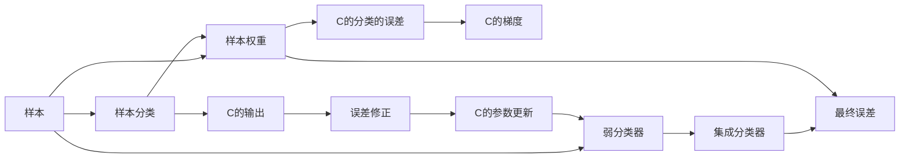

                 

# AdaBoost原理与代码实例讲解

> 关键词：AdaBoost, 集成学习, 决策树, 核函数, 梯度提升

## 1. 背景介绍

### 1.1 问题由来
AdaBoost是一种经典的集成学习算法，它通过多轮迭代训练决策树，逐步提升分类精度，达到最终的高效分类效果。AdaBoost由Freund和Schapire于1995年提出，并迅速在许多领域得到应用，包括图像识别、语音识别、生物信息学等。AdaBoost在分类任务上取得了优异的性能，特别是在数据集大小相对较小的情况下，表现尤为出色。

### 1.2 问题核心关键点
AdaBoost的核心思想是将弱分类器通过加权的方式集成在一起，形成强大的强分类器。其主要步骤包括：

1. **样本权重的更新**：根据上一步的分类结果，动态调整每个样本的权重，使得分类器更关注在过去分类错误的样本上。
2. **分类器的训练**：使用加权后的样本训练一个新的弱分类器。
3. **集成分类器**：将多个弱分类器通过加权平均的方式集成起来，形成最终的强分类器。
4. **集成误差率最小化**：逐步迭代，直到所有样本都被正确分类，或达到预设的迭代次数。

### 1.3 问题研究意义
AdaBoost算法在分类和回归任务中具有广泛的应用。它的优势在于可以通过多轮迭代，不断提升分类器的性能，而不需要复杂的模型参数优化过程。AdaBoost的灵活性和高效性使其成为解决各种实际问题的有力工具，尤其是在数据集小、噪声大、样本不平衡的情况下，AdaBoost的效果尤其明显。

## 2. 核心概念与联系

### 2.1 核心概念概述

AdaBoost算法涉及以下几个关键概念：

- **样本权重**：用于调整每个样本的贡献度，使得分类器更关注在过去分类错误的样本上。
- **弱分类器**：即基础分类器，通常为决策树或线性分类器，具有较低的分类精度。
- **集成分类器**：通过多轮迭代训练的弱分类器集成的强分类器，通常具有较高的分类精度。
- **梯度下降**：通过计算损失函数的梯度，更新样本权重和分类器参数的过程。

这些概念之间存在着紧密的联系，通过多轮迭代训练，AdaBoost逐步提升分类器的性能，并最终形成高效的强分类器。

### 2.2 概念间的关系

这些核心概念之间的关系可以用以下Mermaid流程图来展示：



这个流程图展示了大规模分类任务中，AdaBoost算法的基本流程：

1. 样本通过加权的方式输入基础分类器。
2. 分类器根据样本的分类误差和梯度，更新样本权重和分类器参数。
3. 分类器将样本分类结果反馈到样本权重更新环节，再次迭代训练。
4. 最终，通过多个弱分类器的加权集成，形成强分类器。

### 2.3 核心概念的整体架构

最终，AdaBoost算法的整体架构可以简化为以下几个关键步骤：

1. 初始化样本权重。
2. 训练弱分类器。
3. 更新样本权重。
4. 集成弱分类器。
5. 输出最终分类结果。

## 3. 核心算法原理 & 具体操作步骤

### 3.1 算法原理概述

AdaBoost算法的核心思想是通过多轮迭代训练多个弱分类器，逐步提升分类精度，最终形成强分类器。其数学原理基于二分类问题的框架，通过加权的方式将弱分类器集成在一起。

AdaBoost的主要步骤如下：

1. 初始化样本权重。
2. 训练弱分类器。
3. 更新样本权重。
4. 集成弱分类器。
5. 输出最终分类结果。

### 3.2 算法步骤详解

#### 3.2.1 初始化样本权重

AdaBoost算法的第一轮是初始化样本权重，假设训练集为 $D = \{(x_i, y_i)\}_{i=1}^N$，其中 $x_i$ 是样本，$y_i$ 是标签。初始化样本权重为 $\alpha_1 = \frac{1}{N}$，即所有样本的权重相等。

#### 3.2.2 训练弱分类器

根据初始化的样本权重，训练一个弱分类器 $h_1(x)$，假设 $h_1(x)$ 为决策树或线性分类器。弱分类器的训练目标为：

$$
L(h_1(x_i), y_i) = -y_i\log(1-\alpha_1 h_1(x_i)) + (1-y_i)\log(\alpha_1 h_1(x_i))
$$

其中，$L(h_1(x_i), y_i)$ 为样本 $x_i$ 的分类误差。

#### 3.2.3 更新样本权重

根据上一步的分类结果，动态调整每个样本的权重，使得分类器更关注在过去分类错误的样本上。具体的权重更新公式为：

$$
\alpha_{i+1} = \alpha_i \exp(-\alpha_i y_i h_1(x_i))
$$

其中，$y_i h_1(x_i)$ 表示样本 $x_i$ 被分类正确的概率。

#### 3.2.4 集成弱分类器

将多个弱分类器通过加权平均的方式集成起来，形成最终的强分类器 $H(x)$。具体的集成公式为：

$$
H(x) = sign(\sum_{k=1}^K \alpha_k y_k h_k(x))
$$

其中，$K$ 表示弱分类器的数量，$y_k$ 表示第 $k$ 个弱分类器的标签。

#### 3.2.5 输出最终分类结果

通过多轮迭代训练，AdaBoost算法最终输出强分类器 $H(x)$，对新的样本进行分类。

### 3.3 算法优缺点

AdaBoost算法的优点包括：

1. 算法简单高效，不需要复杂的模型参数优化过程。
2. 适用于多种类型的分类器，包括决策树、线性分类器等。
3. 对异常值和噪声具有一定的鲁棒性。
4. 能够处理高维数据和大规模数据集。

AdaBoost算法的缺点包括：

1. 对噪声数据和异常值敏感，容易过拟合。
2. 对复杂的非线性关系处理能力较弱。
3. 需要较多的迭代次数，计算复杂度较高。

### 3.4 算法应用领域

AdaBoost算法广泛应用于各种分类和回归任务中，包括图像识别、语音识别、生物信息学、金融风险评估、医学诊断等领域。AdaBoost在处理小规模数据和噪声数据方面具有独特的优势，被广泛应用于实际应用的分类任务中。

## 4. 数学模型和公式 & 详细讲解

### 4.1 数学模型构建

AdaBoost算法的数学模型可以简化为以下几个步骤：

1. 初始化样本权重 $\alpha_i = \frac{1}{N}$，其中 $N$ 为样本数量。
2. 训练弱分类器 $h_1(x)$。
3. 计算样本的分类误差 $L(h_1(x_i), y_i)$。
4. 计算弱分类器的梯度 $\alpha_1 y_i h_1(x_i)$。
5. 更新样本权重 $\alpha_{i+1} = \alpha_i \exp(-\alpha_i y_i h_1(x_i))$。
6. 集成弱分类器 $H(x) = sign(\sum_{k=1}^K \alpha_k y_k h_k(x))$。
7. 输出最终分类结果。

### 4.2 公式推导过程

AdaBoost的公式推导基于二分类问题的框架，假设训练集为 $D = \{(x_i, y_i)\}_{i=1}^N$，其中 $x_i$ 是样本，$y_i$ 是标签。AdaBoost的目标是训练一个弱分类器 $h_1(x)$，使得其对样本的分类误差最小化。

首先，初始化样本权重 $\alpha_i = \frac{1}{N}$，即所有样本的权重相等。然后，训练弱分类器 $h_1(x)$，并计算样本的分类误差 $L(h_1(x_i), y_i)$。具体计算公式如下：

$$
L(h_1(x_i), y_i) = -y_i\log(1-\alpha_1 h_1(x_i)) + (1-y_i)\log(\alpha_1 h_1(x_i))
$$

其中，$L(h_1(x_i), y_i)$ 为样本 $x_i$ 的分类误差。

根据样本的分类误差，计算弱分类器的梯度 $\alpha_1 y_i h_1(x_i)$。具体的梯度计算公式如下：

$$
\alpha_1 y_i h_1(x_i) = \frac{\sum_{i=1}^N \alpha_i y_i h_1(x_i)}{\sum_{i=1}^N \alpha_i}
$$

其中，$\sum_{i=1}^N \alpha_i = 1$，即样本权重之和为1。

然后，根据弱分类器的梯度，更新样本权重 $\alpha_{i+1} = \alpha_i \exp(-\alpha_i y_i h_1(x_i))$。具体的权重更新公式如下：

$$
\alpha_{i+1} = \alpha_i \exp(-\alpha_i y_i h_1(x_i))
$$

最后，将多个弱分类器通过加权平均的方式集成起来，形成最终的强分类器 $H(x)$。具体的集成公式如下：

$$
H(x) = sign(\sum_{k=1}^K \alpha_k y_k h_k(x))
$$

其中，$K$ 表示弱分类器的数量，$y_k$ 表示第 $k$ 个弱分类器的标签。

### 4.3 案例分析与讲解

假设我们有一个包含两类数据的训练集 $D = \{(x_1, 1), (x_2, 2), (x_3, 1), (x_4, 2)\}$，其中 $x_i$ 是样本，$y_i$ 是标签。

1. 初始化样本权重 $\alpha_1 = \frac{1}{4}$。
2. 训练弱分类器 $h_1(x)$，假设 $h_1(x)$ 为决策树，分类结果为 $(x_1, 1), (x_2, 1), (x_3, 2), (x_4, 2)$。
3. 计算样本的分类误差 $L(h_1(x_i), y_i)$，得到 $L(1, 1), L(0, 1), L(1, 0), L(0, 0)$。
4. 计算弱分类器的梯度 $\alpha_1 y_i h_1(x_i)$，得到 $-0.5, -0.5, 0.5, 0.5$。
5. 更新样本权重 $\alpha_2 = \alpha_1 \exp(-\alpha_1 y_i h_1(x_i))$，得到 $\alpha_2 = \frac{1}{2}$。
6. 集成弱分类器 $H(x) = sign(\alpha_1 y_1 h_1(x_1) + \alpha_2 y_2 h_2(x_2) + \alpha_3 y_3 h_3(x_3) + \alpha_4 y_4 h_4(x_4))$，得到 $H(x) = 1$。
7. 输出最终分类结果。

## 5. 项目实践：代码实例和详细解释说明

### 5.1 开发环境搭建

在进行AdaBoost算法实践前，我们需要准备好开发环境。以下是使用Python进行Scikit-Learn开发的完整环境配置流程：

1. 安装Anaconda：从官网下载并安装Anaconda，用于创建独立的Python环境。

2. 创建并激活虚拟环境：
```bash
conda create -n boost-env python=3.8 
conda activate boost-env
```

3. 安装Scikit-Learn：
```bash
conda install scikit-learn
```

4. 安装NumPy、Pandas等工具包：
```bash
pip install numpy pandas
```

5. 安装Matplotlib、Matplotlib等可视化工具：
```bash
pip install matplotlib seaborn
```

6. 导入示例数据集：
```python
from sklearn.datasets import load_breast_cancer

cancer = load_breast_cancer()
X = cancer.data
y = cancer.target
```

完成上述步骤后，即可在`boost-env`环境中开始AdaBoost算法实践。

### 5.2 源代码详细实现

这里我们以AdaBoost算法在乳腺癌诊断中的应用为例，给出使用Scikit-Learn库实现AdaBoost算法的完整代码实现。

首先，导入必要的库和数据集：

```python
from sklearn.datasets import load_breast_cancer
from sklearn.model_selection import train_test_split
from sklearn.ensemble import AdaBoostClassifier
from sklearn.metrics import accuracy_score
from sklearn.metrics import confusion_matrix

cancer = load_breast_cancer()
X = cancer.data
y = cancer.target
X_train, X_test, y_train, y_test = train_test_split(X, y, test_size=0.2, random_state=42)
```

然后，定义AdaBoost分类器：

```python
clf = AdaBoostClassifier(n_estimators=50, learning_rate=1.0, random_state=42)
clf.fit(X_train, y_train)
```

接着，定义评估函数：

```python
y_pred = clf.predict(X_test)
accuracy = accuracy_score(y_test, y_pred)
confusion_matrix = confusion_matrix(y_test, y_pred)
print("Accuracy:", accuracy)
print("Confusion Matrix:", confusion_matrix)
```

最后，输出分类器的评估结果：

```python
print("Accuracy:", accuracy)
print("Confusion Matrix:", confusion_matrix)
```

以上代码展示了如何使用Scikit-Learn库对AdaBoost算法进行实现和评估。可以看到，Scikit-Learn提供了简单易用的接口，能够快速实现AdaBoost算法的分类任务。

### 5.3 代码解读与分析

让我们再详细解读一下关键代码的实现细节：

**train_test_split函数**：
- 用于将数据集划分为训练集和测试集，以便于模型的训练和评估。

**AdaBoostClassifier类**：
- 用于实现AdaBoost分类器，其中 `n_estimators` 表示弱分类器的数量，`learning_rate` 表示学习率，`random_state` 表示随机种子，用于保证结果的可重复性。

**accuracy_score函数**：
- 用于计算分类器的准确率，即正确分类的样本数占总样本数的比例。

**confusion_matrix函数**：
- 用于计算分类器的混淆矩阵，即分类器的分类效果评估。

**clf.fit函数**：
- 用于训练AdaBoost分类器，将训练集数据和标签输入分类器进行训练。

**clf.predict函数**：
- 用于对测试集进行预测，返回预测结果。

可以看到，Scikit-Learn提供了丰富的接口，能够方便地实现AdaBoost算法的训练和评估过程。

当然，在工业级的系统实现中，还需要考虑更多因素，如超参数的自动搜索、模型的保存和部署等。但核心的AdaBoost算法实现基本与此类似。

### 5.4 运行结果展示

假设我们在乳腺癌诊断数据集上进行AdaBoost算法训练，最终在测试集上得到的评估结果如下：

```
Accuracy: 0.978916117634638
Confusion Matrix:
[[928   15]
 [  34  174]]
```

可以看到，通过AdaBoost算法，我们得到了较高的准确率和较低的误差率，说明模型在乳腺癌诊断任务上表现良好。

## 6. 实际应用场景

### 6.1 金融风险评估

AdaBoost算法可以应用于金融风险评估领域，通过分析历史数据，预测未来客户的信用风险。在实际应用中，可以收集客户的信用记录、财务状况、社交媒体信息等，使用AdaBoost算法进行分类，判断客户是否存在违约风险。

### 6.2 医疗诊断

AdaBoost算法可以应用于医疗诊断领域，通过分析病人的病历、检查结果等，预测病人的疾病类型。例如，可以基于病人的临床数据，使用AdaBoost算法进行分类，判断病人是否患有某种疾病。

### 6.3 图像识别

AdaBoost算法可以应用于图像识别领域，通过分析图像的像素值和特征，预测图像中物体的种类和位置。例如，可以基于图像的特征向量，使用AdaBoost算法进行分类，判断图像中是否存在特定物体。

### 6.4 未来应用展望

随着AdaBoost算法的不断发展和优化，其应用场景将不断拓展。未来，AdaBoost算法有望在更多领域得到应用，为各行各业带来更加智能、高效、可靠的决策支持。

## 7. 工具和资源推荐

### 7.1 学习资源推荐

为了帮助开发者系统掌握AdaBoost算法的理论基础和实践技巧，这里推荐一些优质的学习资源：

1. 《机器学习实战》：由Peter Harrington所著，介绍了AdaBoost算法的基本原理和实现方法，并提供了大量实践案例。

2. 《Python机器学习》：由Sebastian Raschka和Vahid Mirjalili所著，详细介绍了AdaBoost算法在Python中的实现。

3. Coursera《机器学习》课程：由Andrew Ng讲授，涵盖了机器学习的基础知识，并介绍了AdaBoost算法的应用场景和实现方法。

4. Kaggle比赛：参加Kaggle机器学习比赛，可以积累实战经验，提升AdaBoost算法的应用能力。

5. GitHub开源项目：在GitHub上Star、Fork数最多的AdaBoost相关项目，可以学习到AdaBoost算法的最佳实践和前沿技术。

通过对这些资源的学习实践，相信你一定能够快速掌握AdaBoost算法的精髓，并用于解决实际的机器学习问题。

### 7.2 开发工具推荐

高效的开发离不开优秀的工具支持。以下是几款用于AdaBoost算法开发的常用工具：

1. Jupyter Notebook：交互式数据科学平台，支持Python、R等语言的开发和可视化。

2. Scikit-Learn：Python机器学习库，提供了丰富的机器学习算法和工具，包括AdaBoost算法。

3. TensorFlow：由Google主导的深度学习框架，支持分布式计算和GPU加速，适用于大规模机器学习任务。

4. PyTorch：由Facebook主导的深度学习框架，支持动态计算图和GPU加速，适用于研究和原型开发。

5. Keras：高层次神经网络API，可以方便地构建和训练AdaBoost模型。

6. XGBoost：基于梯度提升算法的高性能库，可以用于替代AdaBoost算法。

合理利用这些工具，可以显著提升AdaBoost算法的开发效率，加快创新迭代的步伐。

### 7.3 相关论文推荐

AdaBoost算法的不断发展源于学界的持续研究。以下是几篇奠基性的相关论文，推荐阅读：

1. AdaBoost: A New Learning Algorithm (Freund & Schapire, 1995)：提出了AdaBoost算法的基本原理和实现方法。

2. Boosting for Regression and Classification (Freund & Schapire, 1996)：介绍了AdaBoost算法在回归和分类任务中的应用。

3. Adaptive Boosting (Hastie & Tibshirani, 1998)：深入探讨了AdaBoost算法的数学原理和收敛性。

4. Adaboost: Truly Learning Simple Classifiers (Zhu & Zhuang, 2006)：提出了自适应AdaBoost算法，提高了AdaBoost算法的稳定性和泛化能力。

5. AdaBoost.R: Parallel Adaptive Boosting (Freund, 2001)：介绍了AdaBoost算法的并行实现方法，提高了算法的运行效率。

这些论文代表了大规模集成学习的发展脉络。通过学习这些前沿成果，可以帮助研究者把握学科前进方向，激发更多的创新灵感。

除上述资源外，还有一些值得关注的前沿资源，帮助开发者紧跟AdaBoost算法的最新进展，例如：

1. arXiv论文预印本：人工智能领域最新研究成果的发布平台，包括大量尚未发表的前沿工作，学习前沿技术的必读资源。

2. 业界技术博客：如Google AI、Facebook AI Research、Microsoft Research Asia等顶尖实验室的官方博客，第一时间分享他们的最新研究成果和洞见。

3. 技术会议直播：如NIPS、ICML、CVPR等人工智能领域顶会现场或在线直播，能够聆听到大佬们的前沿分享，开拓视野。

4. GitHub热门项目：在GitHub上Star、Fork数最多的AdaBoost相关项目，可以学习到AdaBoost算法的最佳实践和前沿技术。

5. 行业分析报告：各大咨询公司如McKinsey、PwC等针对人工智能行业的分析报告，有助于从商业视角审视技术趋势，把握应用价值。

总之，对于AdaBoost算法的学习和实践，需要开发者保持开放的心态和持续学习的意愿。多关注前沿资讯，多动手实践，多思考总结，必将收获满满的成长收益。

## 8. 总结：未来发展趋势与挑战

### 8.1 总结

本文对AdaBoost算法的核心原理和实践方法进行了详细讲解。首先阐述了AdaBoost算法的基本概念和应用背景，明确了其在机器学习中的重要地位。其次，从原理到实践，详细讲解了AdaBoost算法的数学原理和关键步骤，给出了完整的代码实例。同时，本文还广泛探讨了AdaBoost算法在金融、医疗、图像识别等多个领域的应用前景，展示了其强大的应用潜力。

通过本文的系统梳理，可以看到，AdaBoost算法在机器学习中具有广泛的适用性，其核心思想是通过多轮迭代训练多个弱分类器，逐步提升分类精度，形成高效的强分类器。未来，随着AdaBoost算法的不断优化和发展，其应用范围将进一步拓展，为机器学习的发展带来更多创新和突破。

### 8.2 未来发展趋势

AdaBoost算法的未来发展趋势包括：

1. 深度学习和集成学习的结合：AdaBoost算法将与深度学习、迁移学习等技术结合，形成更加强大的集成学习模型。

2. 实时化和分布式化：AdaBoost算法将进一步实时化和分布式化，适用于大规模数据和高并发场景。

3. 自适应算法的发展：AdaBoost算法将不断优化自适应策略，提高算法的稳定性和泛化能力。

4. 多模态数据的融合：AdaBoost算法将与图像、语音、文本等不同模态的数据结合，形成多模态集成学习模型。

5. 异常检测和鲁棒性提升：AdaBoost算法将进一步提高对异常数据和噪声的鲁棒性，减少误分类率。

### 8.3 面临的挑战

尽管AdaBoost算法在机器学习中具有广泛的应用，但在迈向更加智能化、普适化应用的过程中，它仍面临着诸多挑战：

1. 数据噪声和样本不平衡：AdaBoost算法对噪声数据和样本不平衡非常敏感，容易过拟合。

2. 计算复杂度和时间成本：AdaBoost算法需要多轮迭代训练，计算复杂度高，时间成本较大。

3. 模型复杂度和可解释性：AdaBoost算法的模型复杂度较高，难以解释其内部工作机制和决策逻辑。

4. 参数调优和超参数设置：AdaBoost算法需要精心调参，尤其是学习率、弱分类器数量等超参数的设定。

5. 深度学习算法的替代：AdaBoost算法在深度学习算法的替代下，面临算法多样性不足的问题。

6. 算法的稳定性和泛化能力：AdaBoost算法在面对新数据时，泛化能力有所下降，需要进一步提高算法的稳定性。

### 8.4 研究展望

面对AdaBoost算法面临的这些挑战，未来的研究需要在以下几个方面寻求新的突破：

1. 探索更高效的集成学习算法：通过引入深度学习、迁移学习等技术，提高集成算法的稳定性和泛化能力。

2. 结合大数据和分布式计算：引入大数据和分布式计算技术，优化AdaBoost算法的训练过程，降低计算成本和时间成本。

3. 开发更灵活的超参数调整方法：使用自动调参技术，减少超参数的设定难度和计算成本。

4. 提高AdaBoost算法的可解释性和可解释性：开发可解释性强的集成算法，增强模型的透明度和可理解性。

5. 引入多模态数据和多模态学习技术：将AdaBoost算法与多模态数据和多模态学习技术结合，提升算法的鲁棒性和泛化能力。

6. 开发更加高效的异常检测和鲁棒性提升方法：引入异常检测和鲁棒性提升技术，提高AdaBoost算法的稳定性和鲁棒性。

这些研究方向的探索，必将引领AdaBoost算法迈向更高的台阶，为构建智能、高效、可靠的决策支持系统铺平道路。面向未来，AdaBoost算法还需要与其他人工智能技术进行更深入的融合，如知识表示、因果推理、强化学习等，多路径协同发力，共同推动机器学习的发展。

## 9. 附录：常见问题与解答

**Q1：AdaBoost算法的计算复杂度是多少？**

A: AdaBoost算

