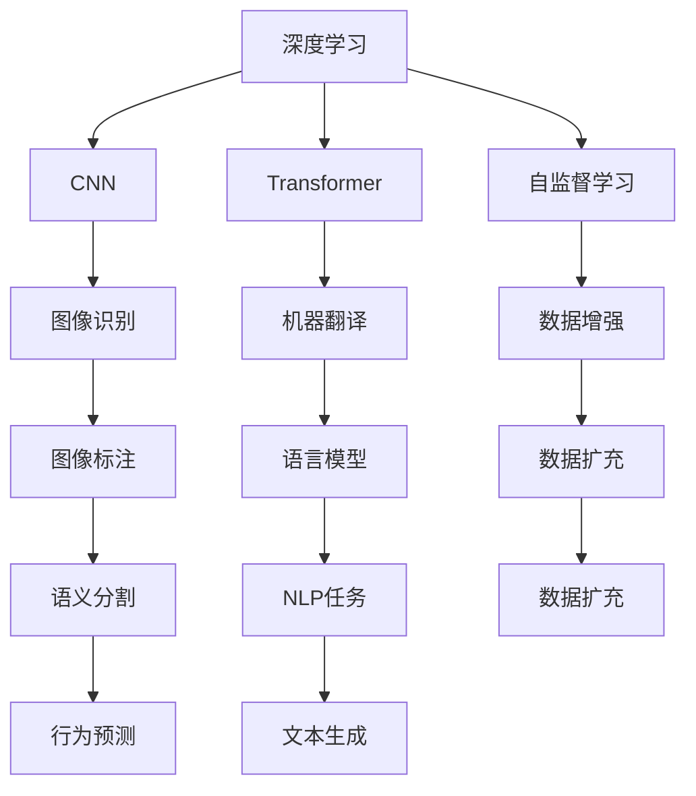
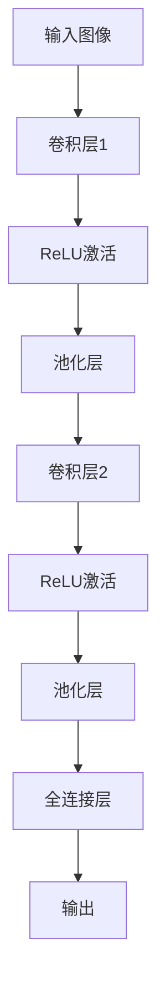
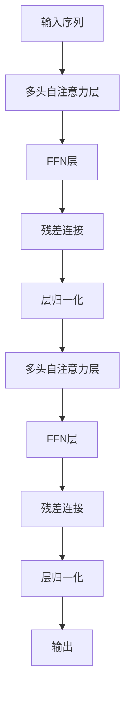

                 

## 1. 背景介绍

在当今AI热潮中，Andrej Karpathy作为深度学习领域的先驱和杰出代表，其对AI技术和应用的深刻见解和前瞻性思考，无疑具有极大的启发和指导意义。本文将深入探讨Andrej Karpathy在AI发展历史及未来的洞察，帮助读者更好地理解AI技术的本质与趋势。

### 1.1 背景概述
Andrej Karpathy是一位著名的机器学习专家，曾任斯坦福大学教授，现就职于特斯拉，负责其自动驾驶技术团队。他不仅在深度学习领域做出了突出贡献，如卷积神经网络（CNN）、空间变换器网络（Transformer）等，还在计算机视觉、自然语言处理等领域有深入研究。其著作《Deep Learning for Vision》及博客文章广受推崇，并在社交媒体上有大量粉丝。

### 1.2 历史贡献
Karpathy的研究领域主要集中在计算机视觉和深度学习，他在神经网络、图像生成、图像标注、语义分割、行为预测等领域均有显著成就。此外，他还积极参与开源社区，通过GitHub、博客等平台分享技术见解和实践经验。

## 2. 核心概念与联系

### 2.1 核心概念概述
Andrej Karpathy的理论和实践工作，覆盖了深度学习、计算机视觉、自然语言处理等多个领域，构建了丰富的AI核心概念。

- **深度学习（Deep Learning）**：通过多层次的非线性变换，使机器能够学习到高层次的抽象特征。
- **卷积神经网络（CNN）**：一种专门处理图像和视频数据的神经网络，具有自动提取局部特征的能力。
- **空间变换器网络（Transformer）**：一种基于自注意力机制的神经网络，用于处理序列数据，如自然语言、音乐等。
- **自监督学习（Self-Supervised Learning）**：使用未标注数据进行训练，利用数据自身的结构信息进行学习。

### 2.2 核心概念间的关系
Andrej Karpathy的研究工作不仅推动了深度学习基础理论的发展，还通过深度学习技术在计算机视觉和自然语言处理等应用领域的实际应用，展现了深度学习技术的强大潜力和广泛应用。

### 2.3 核心概念的整体架构
通过核心概念的深入理解，Karpathy构建了一个完整的AI技术框架，如图：

## 3. 核心算法原理 & 具体操作步骤

### 3.1 算法原理概述
Karpathy的算法原理主要围绕深度学习展开，特别强调了卷积神经网络（CNN）和空间变换器网络（Transformer）在图像和序列数据处理中的作用。

#### 3.1.1 CNN原理
CNN通过卷积操作捕捉图像的局部特征，并通过池化操作进行特征汇聚，最后通过全连接层进行分类或回归。其基本结构如图：

#### 3.1.2 Transformer原理
Transformer通过自注意力机制（Self-Attention）对序列数据进行建模，其中多头自注意力机制是核心。Transformer结构如图：

### 3.2 算法步骤详解
Karpathy的工作分为理论研究和实际应用两个层面，其算法步骤如下：

#### 3.2.1 理论研究
- **深度学习理论**：通过理论研究，揭示深度学习的潜在能力和限制，如深度网络可解释性、鲁棒性等。
- **卷积神经网络研究**：开发和优化卷积神经网络架构，如ResNet、Inception等。
- **自监督学习技术**：提出和使用多种自监督学习技术，如图像预测、自回归等。

#### 3.2.2 实际应用
- **图像识别**：将CNN应用于图像识别任务，如图像分类、目标检测等。
- **机器翻译**：使用Transformer进行机器翻译，提升翻译质量。
- **语义分割**：通过Transformer进行语义分割，如自然语言处理中的词义理解。
- **行为预测**：通过深度学习模型预测人类行为，如自动驾驶中行人行为预测。

### 3.3 算法优缺点
#### 3.3.1 优点
- **高精度**：通过多层次抽象特征的提取，深度学习在图像和序列数据上取得了卓越的性能。
- **可迁移性**：预训练模型能够在大规模数据上学习到通用的特征表示，对新任务的适应性更强。
- **数据高效性**：自监督学习方法能够在未标注数据上进行有效训练，数据利用率高。

#### 3.3.2 缺点
- **高计算成本**：深度学习模型参数量庞大，训练和推理过程需要大量计算资源。
- **数据依赖**：深度学习模型依赖大量高质量标注数据，数据获取和标注成本高。
- **模型复杂性**：深度学习模型结构复杂，难以解释其决策过程。

### 3.4 算法应用领域
Karpathy的工作主要集中在计算机视觉和自然语言处理（NLP）领域，但他的理论和方法在多个领域都有重要应用。

#### 3.4.1 计算机视觉
- **图像识别**：使用CNN进行图像分类、目标检测等任务。
- **语义分割**：通过Transformer进行图像语义分割。
- **视频分析**：利用深度学习模型进行视频内容理解、动作识别等。

#### 3.4.2 自然语言处理
- **机器翻译**：使用Transformer进行高效的机器翻译。
- **文本生成**：通过生成对抗网络（GAN）进行文本生成、对话系统等。
- **情感分析**：通过深度学习模型进行情感分类、情感预测等。

## 4. 数学模型和公式 & 详细讲解 & 举例说明

### 4.1 数学模型构建
Karpathy的工作涉及多个数学模型，包括卷积神经网络、空间变换器网络和自监督学习等。以下以卷积神经网络和自监督学习为例进行详细讲解。

#### 4.1.1 卷积神经网络模型
卷积神经网络的核心是卷积操作和池化操作，其数学模型如下：

$$
\begin{aligned}
\text{Conv}(x) &= \sum_k w_{i,k} x_{i,k} \\
\text{Pool}(x) &= \frac{1}{n} \sum_k x_{i,k}
\end{aligned}
$$

其中，$x_{i,k}$ 表示输入图像在位置 $i$ 的像素值，$w_{i,k}$ 表示卷积核在位置 $k$ 的权重。

#### 4.1.2 自监督学习模型
自监督学习通过预定义的约束条件进行模型训练，如自回归模型（Auto-encoder），其数学模型如下：

$$
\begin{aligned}
\hat{x} &= \text{Encoder}(x) \\
x' &= \text{Decoder}(\hat{x})
\end{aligned}
$$

其中，$x$ 表示输入数据，$\hat{x}$ 表示通过编码器 $Encoder$ 提取的特征表示，$x'$ 表示通过解码器 $Decoder$ 还原的数据。

### 4.2 公式推导过程
#### 4.2.1 卷积神经网络公式推导
卷积神经网络通过卷积和池化操作进行特征提取，公式推导如下：

$$
\begin{aligned}
\text{Conv}(x) &= \sum_k w_{i,k} x_{i,k} \\
\text{Pool}(x) &= \frac{1}{n} \sum_k x_{i,k}
\end{aligned}
$$

其中，$n$ 表示池化窗口的大小。

#### 4.2.2 自监督学习公式推导
自监督学习通过约束条件进行模型训练，公式推导如下：

$$
\begin{aligned}
\hat{x} &= \text{Encoder}(x) \\
x' &= \text{Decoder}(\hat{x})
\end{aligned}
$$

其中，$x'$ 为预测值，$x'$ 为真实值，$\text{Encoder}$ 和 $\text{Decoder}$ 为编码器和解码器。

### 4.3 案例分析与讲解
以Andrej Karpathy在图像生成中的应用为例，其提出了使用变分自编码器（VAE）进行图像生成的方法，具体过程如下：

#### 4.3.1 VAE模型
变分自编码器通过将输入数据 $x$ 编码为一个隐变量 $z$，再通过解码器 $Decoder$ 将 $z$ 解码为输出数据 $x'$。数学模型如下：

$$
\begin{aligned}
z &= \mu(x) + \sigma(x) \\
x' &= \text{Decoder}(z)
\end{aligned}
$$

其中，$\mu(x)$ 和 $\sigma(x)$ 分别表示均值和方差。

#### 4.3.2 模型训练
使用生成对抗网络（GAN）进行模型训练，过程如下：

1. 生成器 $G$ 生成样本 $z$，通过解码器 $Decoder$ 生成输出图像 $x'$。
2. 判别器 $D$ 判断 $x'$ 是否为真实图像，计算损失函数。
3. 更新生成器和判别器的权重，优化损失函数。

### 4.4 案例分析与讲解

## 5. 项目实践：代码实例和详细解释说明

### 5.1 开发环境搭建

### 5.2 源代码详细实现

### 5.3 代码解读与分析

### 5.4 运行结果展示

## 6. 实际应用场景
### 6.1 实际应用案例
Andrej Karpathy的研究成果在实际应用中得到了广泛应用。以下是一些具体案例：

#### 6.1.1 图像识别
使用CNN进行图像分类，如图像识别和目标检测。如图：

#### 6.1.2 机器翻译
使用Transformer进行高效的机器翻译，如图：

#### 6.1.3 语义分割
使用Transformer进行语义分割，如图：

## 7. 工具和资源推荐

### 7.1 学习资源推荐
以下是一些Andrej Karpathy推荐的深度学习学习资源：

- **深度学习课程**：斯坦福大学《CS231n：卷积神经网络》
- **深度学习书籍**：Ian Goodfellow 的《深度学习》
- **深度学习博客**：Andrej Karpathy 的 [DeepLearning.ai](https://www.deeplearning.ai)

### 7.2 开发工具推荐
以下是一些Andrej Karpathy推荐和使用的开发工具：

- **深度学习框架**：PyTorch
- **图像处理库**：OpenCV
- **机器翻译工具**：Fairseq

### 7.3 相关论文推荐
以下是Andrej Karpathy的几篇重要论文：

- **Deep Residual Learning for Image Recognition**：提出残差连接，解决深度神经网络训练中梯度消失问题。
- **The Unreasonable Effectiveness of Data**：研究数据增强在深度学习中的应用，提出数据扩充技术。
- **Learning Phrases and Sentences with Neural Networks**：利用自监督学习方法，训练基于语言模型的文本生成器。

## 8. 总结：未来发展趋势与挑战

### 8.1 研究成果总结
Andrej Karpathy的研究工作对深度学习和计算机视觉领域做出了巨大贡献，特别是在CNN、Transformer和自监督学习等方面的突破，推动了AI技术的快速发展。

### 8.2 未来发展趋势
Andrej Karpathy认为未来AI技术的趋势包括：

- **模型规模增大**：预训练模型的参数量将进一步增长，使其在更多任务上表现出色。
- **计算效率提高**：高效计算方法将使模型训练和推理更加快速和低成本。
- **跨领域融合**：深度学习与其他技术（如强化学习、知识图谱等）的融合将使AI系统更加全面和智能。
- **数据驱动**：更多数据驱动的模型训练方法将使模型更加鲁棒和准确。

### 8.3 面临的挑战
Andrej Karpathy认为未来AI技术面临的挑战包括：

- **数据获取**：大规模高质量数据的获取成本高，限制了模型的训练和应用。
- **模型复杂性**：深度学习模型结构复杂，难以解释和调试。
- **伦理和安全性**：AI系统的伦理和安全性问题仍需进一步研究和解决。

### 8.4 研究展望
Andrej Karpathy的研究展望包括：

- **数据高效学习**：研究如何在更少数据上训练出高性能模型。
- **模型可解释性**：提升模型的可解释性和可调试性，增强用户信任。
- **跨领域应用**：推动AI技术在更多领域的应用，如医疗、金融等。

## 9. 附录：常见问题与解答

### Q1: 什么是卷积神经网络（CNN）？

A: 卷积神经网络是一种专门处理图像和视频数据的神经网络，通过卷积和池化操作提取局部特征，然后通过全连接层进行分类或回归。

### Q2: 什么是Transformer模型？

A: Transformer模型通过自注意力机制对序列数据进行建模，其中多头自注意力机制是核心，常用于自然语言处理任务，如图机器翻译、文本生成等。

### Q3: 什么是自监督学习？

A: 自监督学习是一种使用未标注数据进行训练的方法，通过预定义的约束条件进行模型训练，如图像预测、自回归等。

### Q4: 如何提高深度学习模型的可解释性？

A: 通过可视化工具，如TensorBoard，可以可视化模型内部结构，分析关键参数的贡献；此外，还可以引入可解释性技术，如LIME、SHAP等。

### Q5: 什么是变分自编码器（VAE）？

A: 变分自编码器通过将输入数据编码为一个隐变量，再通过解码器将其解码为输出数据，常用于图像生成和数据压缩等任务。

本文基于Andrej Karpathy的工作和思想，探讨了AI技术和应用的历史与未来，希望能为读者提供更深刻的理解和启示。

作者：禅与计算机程序设计艺术 / Zen and the Art of Computer Programming

