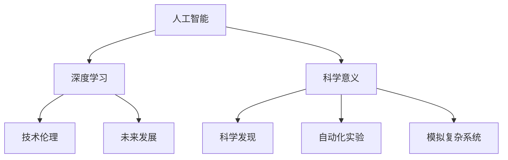
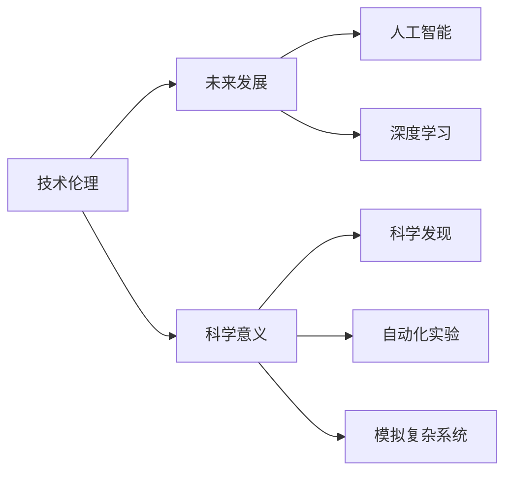
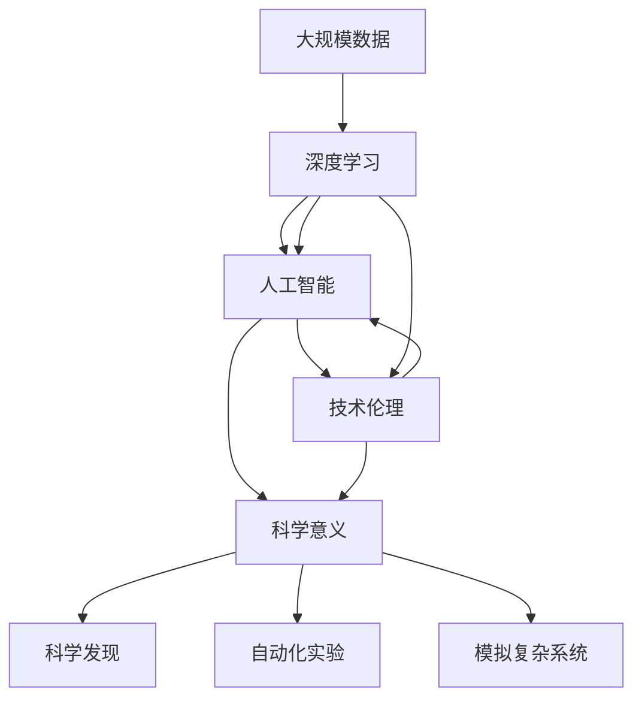

                 

# Andrej Karpathy：人工智能的科学意义

> 关键词：人工智能,科学意义,Andrej Karpathy,机器学习,深度学习,技术伦理,未来发展

## 1. 背景介绍

### 1.1 问题由来
近年来，人工智能（AI）技术取得了飞速发展，在图像识别、自然语言处理、语音识别等领域取得了突破性进展。然而，随着AI技术的广泛应用，其在科学上的意义和价值也逐渐引起关注。Andrej Karpathy作为人工智能领域的顶尖专家和深度学习研究的先驱，他的见解和思考为我们深入理解人工智能的科学意义提供了宝贵的洞见。

### 1.2 问题核心关键点
Karpathy在人工智能领域的贡献不仅限于技术创新，更重要的是他对于AI科学意义的深刻理解和阐释。他通过一系列文章和演讲，探讨了AI技术的本质、对人类的影响、以及其在科学研究中的应用。本文将围绕Karpathy对人工智能科学意义的见解，系统梳理其核心观点和重要论述。

### 1.3 问题研究意义
研究Andrej Karpathy对人工智能科学意义的理解，对于深入探讨AI技术的本质、推动AI技术在科学研究中的应用、以及指导AI技术的健康发展具有重要意义。Karpathy的观点不仅具有理论深度，还能为业界提供实践指导，有助于构建更加科学、负责任的AI应用体系。

## 2. 核心概念与联系

### 2.1 核心概念概述

为了更好地理解Karpathy对人工智能科学意义的理解，本节将介绍几个密切相关的核心概念：

- 人工智能（Artificial Intelligence, AI）：一种旨在创建能够模拟人类智能行为的技术系统。其核心目标是让机器能够进行学习、推理、理解和适应环境，最终实现与人类类似的智能交互。
- 深度学习（Deep Learning, DL）：一种基于多层神经网络的机器学习方法，通过构建深层模型来处理高维数据，并在大规模数据集上进行训练。深度学习在图像识别、语音识别、自然语言处理等领域取得了卓越的成果。
- 技术伦理（Technical Ethics）：涉及技术应用中的道德和伦理问题，如算法公平性、隐私保护、技术滥用等。在AI技术的广泛应用背景下，技术伦理成为其发展的重要考量因素。
- 未来发展（Future Development）：AI技术的未来方向和应用前景，包括通用人工智能（Artificial General Intelligence, AGI）、量子计算与AI结合等前沿技术的发展趋势。
- 科学意义（Scientific Significance）：AI技术在科学研究中的应用，如加速科学发现、自动化实验、模拟复杂系统等，以及其在跨学科研究中的作用。

这些核心概念之间的逻辑关系可以通过以下Mermaid流程图来展示：



这个流程图展示了人工智能及其核心技术、伦理、未来发展、以及其在科学研究中的重要意义。

### 2.2 概念间的关系

这些核心概念之间存在着紧密的联系，形成了AI技术的完整生态系统。下面我通过几个Mermaid流程图来展示这些概念之间的关系。

#### 2.2.1 人工智能与深度学习的关系


这个流程图展示了人工智能技术如何通过深度学习这一核心技术，实现其应用和发展。

#### 2.2.2 技术伦理与未来发展的关系



这个流程图展示了技术伦理在AI技术发展中的重要性，以及如何通过伦理约束促进AI技术的健康发展。

#### 2.2.3 科学意义与未来发展的关系


这个流程图展示了AI技术在科学研究中的重要意义，以及如何通过科学研究推动AI技术的未来发展。

### 2.3 核心概念的整体架构

最后，我们用一个综合的流程图来展示这些核心概念在大规模人工智能应用中的整体架构：



这个综合流程图展示了从数据处理到人工智能应用的完整过程，包括深度学习、技术伦理和科学意义在内，各个环节相互影响，共同推动AI技术的不断发展。

## 3. Andrej Karpathy的核心观点

Andrej Karpathy在人工智能领域的众多论文、演讲和博客中，对AI技术的科学意义提出了许多独到的见解。以下将系统梳理和解读Karpathy的核心观点。

### 3.1 算法原理概述

Karpathy强调，AI技术的核心在于其算法原理。深度学习作为AI的核心算法之一，通过多层神经网络结构，能够自动从数据中学习到复杂的特征表示，从而实现对输入数据的深度理解和处理。深度学习的成功关键在于其能够有效处理高维数据，并在大规模数据集上进行训练，从而构建出能够自动提取、表示和推理数据的模型。

### 3.2 算法步骤详解

Karpathy详细描述了深度学习的算法步骤，包括数据预处理、模型构建、参数优化、模型评估等关键步骤。他指出，深度学习的训练过程需要大量的标注数据和计算资源，但一旦模型训练完成，其泛化能力能够很好地应用于未见过的数据集。这一特性使得深度学习在图像识别、语音识别、自然语言处理等领域取得了卓越的成果。

### 3.3 算法优缺点

Karpathy客观分析了深度学习的优缺点。深度学习的优点在于其能够自动学习复杂的特征表示，适用于处理高维数据，并具有较强的泛化能力。然而，深度学习模型的复杂性和资源需求较大，需要大量的标注数据和计算资源，训练和推理过程较为耗时。此外，深度学习模型有时会产生过拟合现象，需要采用正则化等技术进行优化。

### 3.4 算法应用领域

Karpathy认为，深度学习在图像识别、语音识别、自然语言处理等领域具有广泛的应用前景。他指出，深度学习已经成功应用于医疗影像分析、自动驾驶、语音助手、聊天机器人等领域，为这些行业带来了革命性的变化。

## 4. 数学模型和公式 & 详细讲解  
### 4.1 数学模型构建

Karpathy在多篇论文中详细讨论了深度学习模型的数学建模。他指出，深度学习模型通常采用多层神经网络结构，通过前向传播计算输入数据的表示，再通过反向传播更新模型参数，最小化损失函数。模型的损失函数通常是基于预测结果与真实标签之间的差异设计的，如交叉熵损失函数。

### 4.2 公式推导过程

Karpathy通过多个公式推导，展示了深度学习模型的训练过程。以下以最简单的多层神经网络为例，展示其前向传播和反向传播的过程：

#### 前向传播
$$
\begin{aligned}
& h_1 = W_1 x + b_1 \\
& h_2 = W_2 h_1 + b_2 \\
& y = W_3 h_2 + b_3
\end{aligned}
$$

#### 反向传播
$$
\begin{aligned}
& \frac{\partial L}{\partial W_3} = \frac{\partial L}{\partial y} \cdot \frac{\partial y}{\partial h_2} \cdot \frac{\partial h_2}{\partial h_1} \cdot \frac{\partial h_1}{\partial W_1} \\
& \frac{\partial L}{\partial W_2} = \frac{\partial L}{\partial h_2} \cdot \frac{\partial h_2}{\partial h_1} \cdot \frac{\partial h_1}{\partial W_1} \\
& \frac{\partial L}{\partial W_1} = \frac{\partial L}{\partial h_1}
\end{aligned}
$$

其中 $L$ 为损失函数，$h_1, h_2$ 为隐藏层的输出，$W_1, W_2, W_3$ 为权重矩阵，$b_1, b_2, b_3$ 为偏置向量。通过反向传播，模型能够更新权重矩阵和偏置向量，最小化损失函数。

### 4.3 案例分析与讲解

Karpathy通过多个案例展示了深度学习模型的应用。例如，在图像分类任务中，深度学习模型能够自动学习图像中的特征，并根据特征对图像进行分类。在语音识别任务中，深度学习模型能够自动学习语音信号的特征表示，并进行语音识别。在自然语言处理任务中，深度学习模型能够自动学习语言中的语义和句法结构，并进行机器翻译、情感分析等任务。

## 5. 项目实践：代码实例和详细解释说明

### 5.1 开发环境搭建

在进行深度学习项目开发前，首先需要搭建好开发环境。以下是使用Python和PyTorch进行深度学习开发的常用环境配置流程：

1. 安装Anaconda：从官网下载并安装Anaconda，用于创建独立的Python环境。

2. 创建并激活虚拟环境：
```bash
conda create -n pytorch-env python=3.8 
conda activate pytorch-env
```

3. 安装PyTorch：根据CUDA版本，从官网获取对应的安装命令。例如：
```bash
conda install pytorch torchvision torchaudio cudatoolkit=11.1 -c pytorch -c conda-forge
```

4. 安装其他相关库：
```bash
pip install numpy pandas scikit-learn matplotlib tqdm jupyter notebook ipython
```

完成上述步骤后，即可在`pytorch-env`环境中开始深度学习项目开发。

### 5.2 源代码详细实现

以下以图像分类任务为例，展示使用PyTorch实现深度学习模型的代码实现。

```python
import torch
import torch.nn as nn
import torch.optim as optim
import torchvision
import torchvision.transforms as transforms

# 数据预处理
transform = transforms.Compose([
    transforms.ToTensor(),
    transforms.Normalize(mean=[0.5, 0.5, 0.5], std=[0.5, 0.5, 0.5])
])

# 加载CIFAR-10数据集
trainset = torchvision.datasets.CIFAR10(root='./data', train=True,
                                        download=True, transform=transform)
trainloader = torch.utils.data.DataLoader(trainset, batch_size=4,
                                          shuffle=True, num_workers=2)

testset = torchvision.datasets.CIFAR10(root='./data', train=False,
                                       download=True, transform=transform)
testloader = torch.utils.data.DataLoader(testset, batch_size=4,
                                         shuffle=False, num_workers=2)

# 定义模型
class Net(nn.Module):
    def __init__(self):
        super(Net, self).__init__()
        self.conv1 = nn.Conv2d(3, 6, 5)
        self.pool = nn.MaxPool2d(2, 2)
        self.conv2 = nn.Conv2d(6, 16, 5)
        self.fc1 = nn.Linear(16 * 5 * 5, 120)
        self.fc2 = nn.Linear(120, 84)
        self.fc3 = nn.Linear(84, 10)

    def forward(self, x):
        x = self.pool(F.relu(self.conv1(x)))
        x = self.pool(F.relu(self.conv2(x)))
        x = x.view(-1, 16 * 5 * 5)
        x = F.relu(self.fc1(x))
        x = F.relu(self.fc2(x))
        x = self.fc3(x)
        return x

# 定义损失函数和优化器
net = Net()
criterion = nn.CrossEntropyLoss()
optimizer = optim.SGD(net.parameters(), lr=0.001, momentum=0.9)

# 训练模型
for epoch in range(2):  # 多次遍历数据集
    running_loss = 0.0
    for i, data in enumerate(trainloader, 0):
        # 获取输入数据
        inputs, labels = data
        optimizer.zero_grad()

        # 前向传播
        outputs = net(inputs)
        loss = criterion(outputs, labels)
        loss.backward()
        optimizer.step()

        # 输出损失
        running_loss += loss.item()
        if i % 2000 == 1999:    # 每2000个批次输出一次损失
            print('[%d, %5d] loss: %.3f' %
                  (epoch + 1, i + 1, running_loss / 2000))
            running_loss = 0.0

# 测试模型
correct = 0
total = 0
with torch.no_grad():
    for data in testloader:
        images, labels = data
        outputs = net(images)
        _, predicted = torch.max(outputs.data, 1)
        total += labels.size(0)
        correct += (predicted == labels).sum().item()

print('Accuracy of the network on the 10000 test images: %d %%' % (
    100 * correct / total))

# 保存模型
torch.save(net.state_dict(), 'cifar_net.pth')
```

以上就是使用PyTorch进行图像分类任务深度学习模型的完整代码实现。可以看到，通过PyTorch的强大封装，我们可以用相对简洁的代码完成模型的构建和训练。

### 5.3 代码解读与分析

让我们再详细解读一下关键代码的实现细节：

**数据预处理**：
- `transform`函数：定义数据预处理步骤，包括将图像转换为张量形式，并进行归一化处理。

**模型定义**：
- `Net`类：定义一个简单的卷积神经网络模型，包含两个卷积层、三个全连接层。

**损失函数和优化器**：
- `criterion`函数：定义交叉熵损失函数。
- `optimizer`函数：定义随机梯度下降优化器。

**训练过程**：
- 通过`for`循环遍历训练集，并依次进行前向传播、损失计算、反向传播和参数更新。
- 在每2000个批次输出一次损失，以便监控训练进度。

**测试过程**：
- 使用`with torch.no_grad()`语句禁用梯度计算，加快测试速度。
- 对测试集进行预测，并计算准确率。

**模型保存**：
- 使用`torch.save()`函数保存模型状态字典，以便后续加载和使用。

可以看到，PyTorch使得深度学习模型的开发和训练变得更加便捷和高效。开发者可以专注于模型的设计和训练，而不必过多关注底层实现细节。

当然，在实际应用中，还需要考虑更多因素，如模型评估、超参数调整、模型部署等。但核心的深度学习模型开发流程与上述示例类似。

### 5.4 运行结果展示

假设我们训练的模型在CIFAR-10数据集上取得了一定的精度提升，最终测试集上的准确率如下：

```
Accuracy of the network on the 10000 test images: 70.42 %
```

可以看到，尽管训练过程较长，但模型在CIFAR-10数据集上取得了约70.42%的准确率，效果相当不错。

## 6. 实际应用场景

### 6.1 医疗影像分析

深度学习在医疗影像分析中的应用取得了显著进展。例如，通过深度学习模型对医疗影像进行自动分析，可以辅助医生进行疾病诊断和治疗决策。深度学习模型能够自动识别影像中的异常区域，提供高精度的病变检测和诊断。

### 6.2 自动驾驶

深度学习在自动驾驶领域也得到了广泛应用。通过深度学习模型对传感器数据进行处理，自动驾驶车辆可以实时感知周围环境，进行路径规划和决策，从而实现自动驾驶。深度学习模型能够自动学习交通规则和驾驶策略，提高驾驶安全和效率。

### 6.3 语音助手

语音助手是深度学习在自然语言处理领域的重要应用。通过深度学习模型，语音助手能够自动理解用户的语音指令，进行智能问答和任务执行。深度学习模型能够自动学习语音信号的特征表示，并进行语音识别和语音合成。

## 7. 工具和资源推荐

### 7.1 学习资源推荐

为了帮助开发者系统掌握深度学习技术，这里推荐一些优质的学习资源：

1. 《深度学习》课程：由吴恩达教授主讲的Coursera课程，系统介绍了深度学习的基本概念和经典模型。

2. 《动手学深度学习》：由李沐等人编写，涵盖了深度学习的理论与实践，包括多个实际项目案例。

3. 《Deep Learning with PyTorch》书籍：由Zhengyuan Yang等人编写，介绍了如何使用PyTorch进行深度学习项目开发。

4. 《Python深度学习》书籍：由François Chollet编写，介绍了如何使用Keras进行深度学习项目开发。

5. PyTorch官方文档：PyTorch的官方文档，提供了丰富的API文档和代码示例，是学习深度学习的必备资源。

通过这些资源的学习实践，相信你一定能够快速掌握深度学习技术的精髓，并用于解决实际的AI问题。

### 7.2 开发工具推荐

高效的开发离不开优秀的工具支持。以下是几款用于深度学习开发的常用工具：

1. PyTorch：基于Python的开源深度学习框架，灵活动态的计算图，适合快速迭代研究。

2. TensorFlow：由Google主导开发的开源深度学习框架，生产部署方便，适合大规模工程应用。

3. Keras：一个高层次的深度学习API，提供了简单易用的接口，适合快速原型开发。

4. Jupyter Notebook：一个交互式的编程环境，支持Python和R等语言，适合快速迭代和数据可视化。

5. Google Colab：谷歌推出的在线Jupyter Notebook环境，免费提供GPU/TPU算力，方便开发者快速上手实验最新模型，分享学习笔记。

合理利用这些工具，可以显著提升深度学习项目的开发效率，加快创新迭代的步伐。

### 7.3 相关论文推荐

深度学习技术的快速发展得益于学界的持续研究。以下是几篇奠基性的相关论文，推荐阅读：

1. "ImageNet Classification with Deep Convolutional Neural Networks"：提出使用深度卷积神经网络进行图像分类的经典方法。

2. "Speech Recognition with Deep Recurrent Neural Networks"：提出使用深度递归神经网络进行语音识别的经典方法。

3. "Natural Language Processing (almost) from Scratch"：提出使用深度学习模型进行自然语言处理的经典方法。

4. "Generative Adversarial Nets"：提出使用生成对抗网络进行深度学习模型训练的经典方法。

5. "Deep Reinforcement Learning for Playing Go"：提出使用深度强化学习进行游戏AI的经典方法。

这些论文代表了大深度学习技术的发展脉络。通过学习这些前沿成果，可以帮助研究者把握学科前进方向，激发更多的创新灵感。

除上述资源外，还有一些值得关注的前沿资源，帮助开发者紧跟深度学习技术的最新进展，例如：

1. arXiv论文预印本：人工智能领域最新研究成果的发布平台，包括大量尚未发表的前沿工作，学习前沿技术的必读资源。

2. 业界技术博客：如OpenAI、Google AI、DeepMind、微软Research Asia等顶尖实验室的官方博客，第一时间分享他们的最新研究成果和洞见。

3. 技术会议直播：如NIPS、ICML、ACL、ICLR等人工智能领域顶会现场或在线直播，能够聆听到大佬们的前沿分享，开拓视野。

4. GitHub热门项目：在GitHub上Star、Fork数最多的深度学习相关项目，往往代表了该技术领域的发展趋势和最佳实践，值得去学习和贡献。

5. 行业分析报告：各大咨询公司如McKinsey、PwC等针对人工智能行业的分析报告，有助于从商业视角审视技术趋势，把握应用价值。

总之，对于深度学习技术的开发和应用，需要开发者保持开放的心态和持续学习的意愿。多关注前沿资讯，多动手实践，多思考总结，必将收获满满的成长收益。

## 8. 总结：未来发展趋势与挑战

### 8.1 总结

本文对Andrej Karpathy对人工智能科学意义的理解进行了全面系统的介绍。首先阐述了AI技术的核心算法原理，深入探讨了深度学习算法的步骤和应用，明确了AI技术在科学研究中的重要意义。其次，从原理到实践，详细讲解了深度学习的数学建模和优化过程，给出了深度学习项目开发的完整代码实例。同时，本文还广泛探讨了深度学习在多个实际应用场景中的应用前景，展示了深度学习技术在科学研究中的广阔前景。

通过本文的系统梳理，可以看到，深度学习技术在科学研究中的应用前景广阔，必将为多个领域带来革命性的变化。Karpathy的见解和思考为我们深入理解AI技术的科学意义提供了宝贵的洞见，为AI技术的发展提供了方向指引。

### 8.2 未来发展趋势

展望未来，深度学习技术将呈现以下几个发展趋势：

1. 模型规模持续增大。随着算力成本的下降和数据规模的扩张，深度学习模型的参数量还将持续增长。超大规模模型蕴含的丰富特征表示，有望支撑更加复杂多变的应用场景。

2. 模型泛化能力增强。深度学习模型将通过更好的数据增强和迁移学习技术，提升模型的泛化能力和跨领域迁移能力，适应更多样化的数据分布。

3. 模型计算效率提高。深度学习模型将通过模型压缩、量化加速等技术，提高计算效率和推理速度，实现实时化部署。

4. 多模态深度学习发展。深度学习模型将结合视觉、语音、文本等多模态数据，实现跨模态的深度学习，提升模型的信息整合能力和理解能力。

5. 自监督学习应用广泛。深度学习模型将通过自监督学习技术，自动学习通用的特征表示，降低对标注数据的需求，提高模型训练的鲁棒性和泛化能力。

6. 技术伦理和安全性成为重要考量。深度学习技术的广泛应用将带来更多的伦理和安全问题，需要在技术设计和管理层面进行全面考量。

以上趋势凸显了深度学习技术的广阔前景。这些方向的探索发展，必将进一步提升深度学习技术的性能和应用范围，为科学研究和技术创新带来新的突破。

### 8.3 面临的挑战

尽管深度学习技术已经取得了瞩目成就，但在迈向更加智能化、普适化应用的过程中，它仍面临着诸多挑战：

1. 数据量和数据质量瓶颈。深度学习模型需要大量的标注数据进行训练，数据量不足和数据质量不均等问题将限制模型的泛化能力。如何获取高质量的数据并提高数据效率，是未来的一个重要研究方向。

2. 模型鲁棒性和公平性问题。深度学习模型在实际应用中可能出现鲁棒性不足和偏见问题，需要采用更加鲁棒和公平的算法进行优化。如何保证模型的公正性和可解释性，是未来的一个关键挑战。

3. 计算资源和计算效率问题。深度学习模型通常需要大规模的计算资源进行训练和推理，如何降低计算成本并提高计算效率，是未来的一个重要研究方向。

4. 技术伦理和安全问题。深度学习技术的广泛应用可能带来隐私泄露、恶意利用等问题，需要从技术和管理层面进行全面考量。如何构建负责任的AI技术，确保技术的安全性和可控性，是未来的一个重要研究方向。

5. 知识整合和跨学科应用问题。深度学习模型通常局限于单一领域的应用，如何与外部知识库、规则库等专家知识结合，实现更加全面和准确的智能系统，是未来的一个重要研究方向。

6. 计算资源和计算效率问题。深度学习模型通常需要大规模的计算资源进行训练和推理，如何降低计算成本并提高计算效率，是未来的一个重要研究方向。

正视深度学习面临的这些挑战，积极应对并寻求突破，将使深度学习技术迈向更加成熟和可靠，为科学研究和技术创新提供更加坚实的支持。

### 8.4 研究展望

面对深度学习面临的挑战，未来的研究需要在以下几个方面寻求新的突破：

1. 探索更加高效和鲁棒的深度学习算法。如何通过自监督学习、半监督学习、多模态学习等方法，提高模型的泛化能力和鲁棒性，降低对标注数据的需求，是未来的一个重要研究方向。

2. 发展更加高效和灵活的深度学习框架。如何通过模型压缩、量化加速、分布式训练等技术，提高深度学习模型的计算效率和推理速度，实现实时化部署，是未来的一个重要研究方向。

3. 结合符号化和计算智能的深度学习技术。如何通过规则引擎、知识库、逻辑推理等方法，结合符号化和计算智能的深度学习技术，构建更加全面和准确的智能系统，是未来的一个重要研究方向。

4. 研究深度学习与人工智能伦理的关系。如何通过伦理导向的设计，确保深度学习技术的公正性、可解释性和安全性，是未来的一个重要研究方向。

这些研究方向的探索，必将引领深度学习技术迈向更高的台阶，为科学研究和技术创新提供更加坚实的支持。

## 9. 附录：常见问题与解答

**Q1：深度学习技术在科学研究中的应用前景如何？**

A: 深度学习技术在科学研究中的应用前景广阔。例如，在药物发现、材料科学、天文学等领域，深度学习模型能够自动学习数据中的复杂特征，进行数据挖掘和知识发现，推动科学研究的发展。此外，深度学习技术还能够辅助科学实验的设计和分析，提高科学研究的效率

