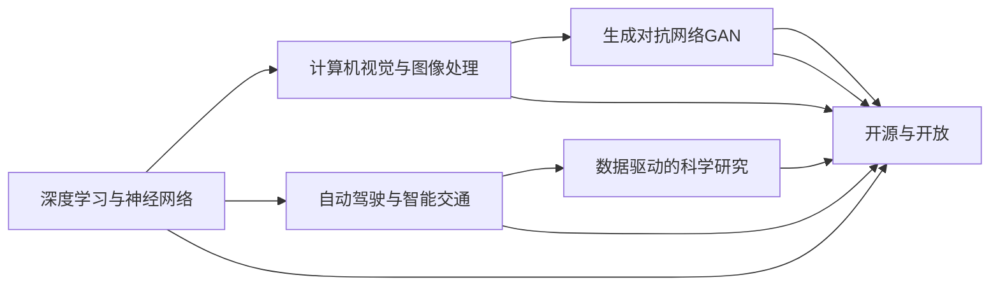

                 

# Andrej Karpathy：科技的未来

## 1. 背景介绍

### 1.1 问题由来

随着人工智能技术的不断发展和应用，AI科学家Andrej Karpathy成为了科技领域的引领者之一。他的研究方向涉及计算机视觉、深度学习、自动驾驶等多个前沿领域，并在每个领域都取得了显著成果。作为Stanford大学计算机科学系的教授，Andrej Karpathy不仅在学术界有很高的声誉，更在业界有着广泛的影响力。

他的研究项目和工程实践，如ImageNet大规模图像识别挑战赛、自动驾驶项目、AI绘画等，都展示了AI科技未来的无限可能性。Karpathy通过理论与实践的结合，推动了人工智能技术的普及与应用，并持续探索未来科技的边界。

### 1.2 问题核心关键点

Andrej Karpathy的研究涵盖了从基础理论到实际应用的多个层面，其核心关键点包括：

- **计算机视觉与深度学习**：通过大规模数据集和深度神经网络，实现了图像和视频的高级理解和生成。
- **自动驾驶**：开发了用于自动驾驶的视觉感知与决策算法，并在实际车辆中进行部署。
- **AI绘画**：利用GAN生成对抗网络，创作出高质量、风格多样的艺术作品。
- **数据驱动的科学研究**：提出并实施了多种数据驱动的研究方法，推动科学研究的创新。
- **开源与开放**：通过开源软件和项目，推动人工智能技术的广泛应用和普及。

这些关键点构成了Karpathy对科技未来的预见和探索。他的工作不仅限于学术研究，更在实际应用中展现出巨大的潜力，为AI技术的未来发展提供了方向和动力。

## 2. 核心概念与联系

### 2.1 核心概念概述

Andrej Karpathy的研究涉及多个领域，核心概念主要包括以下几个方面：

- **深度学习与神经网络**：通过多层次的非线性结构，处理大规模数据并提取高层次的特征表示。
- **计算机视觉与图像处理**：利用计算机算法，自动理解、分析并生成图像和视频内容。
- **自动驾驶与智能交通**：结合视觉感知、决策规划和控制技术，实现无人驾驶车辆的自主导航。
- **生成对抗网络GAN**：通过生成器与判别器的对抗训练，生成逼真的图像和视频内容。
- **数据驱动的科学研究**：利用大规模数据进行模型训练，揭示科学现象和规律。

这些核心概念构成了Karpathy研究的基石，并通过不断融合和创新，推动了AI技术的多领域应用和发展。

### 2.2 概念间的关系

以下通过Mermaid流程图展示这些核心概念之间的联系和互动：



这个流程图展示了Karpathy研究的多个领域如何相互关联和促进。深度学习和神经网络为计算机视觉和自动驾驶提供了强大的模型基础；生成对抗网络在图像生成和科学研究中发挥了重要作用；而开源与开放则为这些技术的普及和创新提供了平台。

## 3. 核心算法原理 & 具体操作步骤

### 3.1 算法原理概述

Andrej Karpathy的研究中涉及的算法原理主要包括以下几个方面：

- **卷积神经网络(CNN)**：用于图像识别和处理的经典深度学习模型，通过多层卷积操作提取图像特征。
- **循环神经网络(RNN)**：用于处理序列数据的深度学习模型，通过记忆单元捕捉时间序列中的依赖关系。
- **生成对抗网络(GAN)**：通过对抗训练生成逼真图像和视频的深度学习模型，由生成器和判别器两部分组成。
- **强化学习**：通过智能体与环境交互，学习最优策略的深度学习方法。

这些算法原理构成了Karpathy研究的基石，通过不断融合和创新，推动了AI技术的多领域应用和发展。

### 3.2 算法步骤详解

以下以生成对抗网络GAN为例，详细讲解其算法步骤：

1. **生成器与判别器设计**：
   - **生成器**：设计一个神经网络，将随机噪声向量转化为高质量的图像或视频。
   - **判别器**：设计另一个神经网络，判断输入图像是否由生成器生成。

2. **对抗训练过程**：
   - **步骤1**：生成器生成一批假图像。
   - **步骤2**：判别器尝试判断这批假图像的真假。
   - **步骤3**：根据判别器的反馈，生成器调整模型参数以提高生成质量。
   - **步骤4**：重复以上步骤，直至生成器能够生成逼真图像。

3. **生成器与判别器优化**：
   - **生成器损失函数**：判别器错误判断的平均概率。
   - **判别器损失函数**：生成器生成的图像和真实图像的平均误差。

4. **模型部署与评估**：
   - **部署**：将训练好的生成器应用于图像生成任务。
   - **评估**：通过各种指标（如峰值信噪比PSNR、结构相似指数SSIM等）评估生成图像的质量。

### 3.3 算法优缺点

GAN算法的主要优点包括：

- **逼真度高**：通过对抗训练，生成器能够生成高质量、逼真的图像或视频。
- **通用性强**：可用于图像生成、视频生成、文本生成等多个领域。

其主要缺点包括：

- **训练复杂**：需要精细调参和大量计算资源。
- **模式崩溃**：训练过程中可能出现生成器生成特定模式的图像。
- **稳定性差**：对抗训练过程易受噪声和超参数影响。

### 3.4 算法应用领域

GAN算法主要应用于以下几个领域：

- **艺术创作**：生成高质量、风格多样的艺术作品，如肖像画、风景画等。
- **视频生成**：通过生成对抗网络生成逼真视频，用于娱乐、广告等领域。
- **图像修复**：修复破损、模糊的图像，提高图像质量。
- **游戏开发**：生成逼真角色和场景，提高游戏视觉体验。
- **科学研究**：模拟自然现象，如天气、地形等，用于科学研究。

这些应用领域展示了GAN算法的广泛应用和潜力，预示着未来科技的无限可能。

## 4. 数学模型和公式 & 详细讲解 & 举例说明

### 4.1 数学模型构建

以GAN算法为例，其数学模型主要包括以下几个部分：

- **生成器**：输入为随机噪声向量 $\mathbf{z}$，输出为图像 $\mathbf{x}$。
- **判别器**：输入为图像 $\mathbf{x}$，输出为判别概率 $p(y=1|\mathbf{x})$。
- **损失函数**：
  - **生成器损失函数**：$\mathcal{L}_G=\mathbb{E}_{\mathbf{z}}[\log(1-D(G(\mathbf{z})))]+\lambda\|\mathbf{z}\|^2$。
  - **判别器损失函数**：$\mathcal{L}_D=-\mathbb{E}_{\mathbf{x}}[\log(D(\mathbf{x}))]+\mathbb{E}_{\mathbf{z}}[\log(1-D(G(\mathbf{z})))]$。

其中，$G$ 表示生成器，$D$ 表示判别器，$\mathbf{z}$ 表示随机噪声向量，$\lambda$ 表示生成器损失的正则化系数。

### 4.2 公式推导过程

1. **生成器损失函数推导**：
   $$
   \begin{aligned}
   \mathcal{L}_G &= \mathbb{E}_{\mathbf{z}}[\log(1-D(G(\mathbf{z})))]+\lambda\|\mathbf{z}\|^2 \\
   &= -\mathbb{E}_{\mathbf{z}}[\log(D(G(\mathbf{z})))]+\lambda\|\mathbf{z}\|^2
   \end{aligned}
   $$

2. **判别器损失函数推导**：
   $$
   \begin{aligned}
   \mathcal{L}_D &= -\mathbb{E}_{\mathbf{x}}[\log(D(\mathbf{x}))]+\mathbb{E}_{\mathbf{z}}[\log(1-D(G(\mathbf{z})))] \\
   &= -\mathbb{E}_{\mathbf{x}}[\log(D(\mathbf{x}))]+\mathbb{E}_{\mathbf{z}}[\log(1-D(G(\mathbf{z})))]
   \end{aligned}
   $$

3. **总损失函数推导**：
   $$
   \mathcal{L}=\mathcal{L}_G+\mathcal{L}_D
   $$

### 4.3 案例分析与讲解

以生成逼真肖像画为例，详细分析GAN的生成过程：

1. **生成器训练**：
   - 输入随机噪声向量 $\mathbf{z}$，生成器生成肖像画 $\mathbf{x}$。
   - 判别器判断 $\mathbf{x}$ 是否为真实肖像，优化生成器以提高生成质量。

2. **判别器训练**：
   - 输入肖像画 $\mathbf{x}$，判别器判断其真伪，优化生成器以提高生成逼真度。

3. **结果评估**：
   - 使用PSNR、SSIM等指标评估生成肖像画的质量，确保生成的图像逼真且清晰。

## 5. 项目实践：代码实例和详细解释说明

### 5.1 开发环境搭建

以下以生成逼真肖像画为例，介绍代码实例的开发环境搭建步骤：

1. **安装Python环境**：
   - 安装Anaconda，创建虚拟环境。
   - 安装PyTorch、TorchVision、TensorBoard等依赖库。

2. **准备数据集**：
   - 收集高质量的肖像画数据集，并进行预处理。
   - 将数据集划分为训练集、验证集和测试集。

3. **搭建训练环境**：
   - 设置超参数，如学习率、批大小、迭代轮数等。
   - 定义训练函数、评估函数和可视化函数。

4. **部署与测试**：
   - 在GPU上运行训练，定期保存模型权重。
   - 在测试集上评估生成肖像画的质量，输出结果。

### 5.2 源代码详细实现

以下以生成肖像画为例，给出GAN模型的代码实现：

```python
import torch
import torch.nn as nn
import torch.optim as optim
import torchvision.transforms as transforms
import torchvision.utils as vutils
from torch.autograd.variable import Variable

# 定义生成器
class Generator(nn.Module):
    def __init__(self):
        super(Generator, self).__init__()
        self.main = nn.Sequential(
            nn.ConvTranspose2d(100, 256, 4, 1, 0, bias=False),
            nn.BatchNorm2d(256),
            nn.ReLU(True),
            nn.ConvTranspose2d(256, 128, 4, 2, 1, bias=False),
            nn.BatchNorm2d(128),
            nn.ReLU(True),
            nn.ConvTranspose2d(128, 64, 4, 2, 1, bias=False),
            nn.BatchNorm2d(64),
            nn.ReLU(True),
            nn.ConvTranspose2d(64, 3, 4, 2, 1, bias=False),
            nn.Tanh()
        )

    def forward(self, input):
        return self.main(input)

# 定义判别器
class Discriminator(nn.Module):
    def __init__(self):
        super(Discriminator, self).__init__()
        self.main = nn.Sequential(
            nn.Conv2d(3, 64, 4, 2, 1, bias=False),
            nn.LeakyReLU(0.2, inplace=True),
            nn.Conv2d(64, 128, 4, 2, 1, bias=False),
            nn.BatchNorm2d(128),
            nn.LeakyReLU(0.2, inplace=True),
            nn.Conv2d(128, 256, 4, 2, 1, bias=False),
            nn.BatchNorm2d(256),
            nn.LeakyReLU(0.2, inplace=True),
            nn.Conv2d(256, 1, 4, 1, 0, bias=False),
            nn.Sigmoid()
        )

    def forward(self, input):
        return self.main(input)

# 定义损失函数
criterion = nn.BCELoss()

# 定义优化器
optimizer_G = optim.Adam(netG.parameters(), lr=0.0002, betas=(0.5, 0.999))
optimizer_D = optim.Adam(netD.parameters(), lr=0.0002, betas=(0.5, 0.999))

# 训练过程
for epoch in range(num_epochs):
    for i, (real_images, _) in enumerate(train_loader):
        real_images = Variable(real_images)
        # 计算判别器损失
        fake_images = netG(z)
        real_prob = netD(real_images)
        fake_prob = netD(fake_images)
        d_loss = criterion(real_prob, Variable(torch.ones_like(real_prob)))
        d_loss += criterion(fake_prob, Variable(torch.zeros_like(fake_prob)))
        # 计算生成器损失
        g_loss = criterion(fake_prob, Variable(torch.ones_like(fake_prob)))
        # 更新模型参数
        optimizer_G.zero_grad()
        optimizer_D.zero_grad()
        d_loss.backward()
        g_loss.backward()
        optimizer_G.step()
        optimizer_D.step()
        # 可视化
        if (i+1) % 50 == 0:
            print('Epoch [{}/{}], Step [{}/{}], d_loss: {:.4f}, g_loss: {:.4f}'
                  .format(epoch+1, num_epochs, i+1, len(train_loader), d_loss.item(), g_loss.item()))
            fake_images = Variable(fake_images.data, volatile=True)
            n_images = min(64, fake_images.size(0))
            img_list = [fake_images[i] for i in range(n_images)]
            img_list.append(real_images[0])
            vutils.make_grid(img_list, nrow=n_images, normalize=True)
            print('\nImage generated at epoch {}, step {}\n'.format(epoch+1, i+1))
            save_image(fake_images, 'images/{}/{}.png'.format(epoch, i))
```

### 5.3 代码解读与分析

以上代码实现了生成肖像画的GAN模型。通过定义生成器和判别器，设计损失函数和优化器，并在训练过程中交替更新模型参数，逐步提高生成肖像画的质量。

**生成器代码解读**：
- 定义生成器网络结构，包括多个卷积层、批归一化层和激活函数。
- 通过前向传播计算生成肖像画，并返回结果。

**判别器代码解读**：
- 定义判别器网络结构，包括多个卷积层、批归一化层和激活函数。
- 通过前向传播计算判别概率，并返回结果。

**训练过程分析**：
- 使用随机噪声向量生成假肖像画。
- 判别器判断肖像画的真伪，优化生成器以提高生成质量。
- 生成器生成逼真肖像画，判别器判断其真伪，优化生成器以提高生成逼真度。

## 6. 实际应用场景

### 6.1 艺术创作

GAN技术在艺术创作领域的应用非常广泛，通过生成逼真、风格多样的艺术作品，改变了传统艺术创作的流程和方式。

**案例分析**：
- **PortraitGAN**：利用GAN生成逼真肖像画，提升了艺术作品的创作效率和质量。
- **ArtGAN**：生成风格多样的艺术作品，如巴洛克风格、印象派风格等。
- **Text-to-Image**：通过生成对抗网络将文本描述转化为图像，用于小说插图创作、商品设计等。

**实际应用**：
- **肖像画创作**：艺术家可以通过GAN生成肖像画，提高创作效率。
- **商业设计**：企业可以生成不同风格的产品设计，用于市场推广和展示。
- **艺术教育**：教育机构可以使用GAN生成艺术作品，用于教学和创作示范。

### 6.2 视频生成

GAN技术在视频生成领域的应用也取得了显著成果，通过生成高质量的视频内容，改变了视频内容的制作流程。

**案例分析**：
- **Pro-GAN**：生成逼真视频，应用于影视制作、广告宣传等领域。
- **VidGAN**：生成动态视频，用于游戏开发、虚拟现实等。
- **TV-GAN**：生成高质量电视节目，提升媒体内容制作效率。

**实际应用**：
- **影视制作**：制作逼真特效视频，提高影视制作效率和效果。
- **广告宣传**：生成逼真广告视频，提升品牌宣传效果。
- **虚拟现实**：生成高质量虚拟现实视频，提升用户体验。

### 6.3 图像修复

GAN技术在图像修复领域也展现了强大的能力，通过生成高质量的修复图像，改变了图像处理的方式。

**案例分析**：
- **DeepFaceGAN**：生成逼真人脸图像，用于人脸识别和面部美化。
- **Super-Resolution GAN**：生成高分辨率图像，提升图像质量。
- **Image Inpainting GAN**：生成完整图像，修复破损、模糊的图像。

**实际应用**：
- **人脸识别**：生成高质量人脸图像，提高人脸识别的准确性和效率。
- **图像修复**：修复破损、模糊的图像，提高图像质量。
- **医学影像**：生成高质量医学影像，辅助医疗诊断。

## 7. 工具和资源推荐

### 7.1 学习资源推荐

以下资源推荐，可以帮助开发者深入了解Andrej Karpathy的研究和实践：

1. **Andrej Karpathy的GitHub代码库**：展示了其研究项目和代码实现，包括深度学习、计算机视觉、自动驾驶等多个领域的实现。
   - **链接**：https://github.com/andrejkarpathy
2. **Coursera的Deep Learning Specialization**：由Andrej Karpathy开设的深度学习课程，涵盖计算机视觉、深度学习、生成对抗网络等多个主题。
   - **链接**：https://www.coursera.org/specializations/deep-learning
3. **arXiv论文预印本**：最新的人工智能研究成果，包括Andrej Karpathy的研究论文，覆盖深度学习、计算机视觉、自动驾驶等多个领域。
   - **链接**：https://arxiv.org
4. **Stanford CS231n课程**：Andrej Karpathy在斯坦福大学开设的计算机视觉课程，涵盖了深度学习在计算机视觉中的应用。
   - **链接**：https://cs231n.github.io
5. **Google AI Blog**：Google AI团队发布的最新研究和技术文章，涵盖计算机视觉、深度学习、自动驾驶等多个领域。
   - **链接**：https://ai.googleblog.com

### 7.2 开发工具推荐

以下开发工具推荐，可以帮助开发者提高开发效率和代码质量：

1. **PyTorch**：用于深度学习开发的开源框架，提供了丰富的深度学习模型和工具。
   - **链接**：https://pytorch.org
2. **TensorFlow**：由Google开发的深度学习框架，支持分布式计算和高效推理。
   - **链接**：https://www.tensorflow.org
3. **TensorBoard**：用于可视化深度学习模型的工具，提供了丰富的图表和日志功能。
   - **链接**：https://www.tensorflow.org/tensorboard
4. **Jupyter Notebook**：用于数据科学和机器学习开发的交互式笔记本环境。
   - **链接**：https://jupyter.org
5. **GitHub**：开源代码托管平台，提供代码共享、协作和版本控制功能。
   - **链接**：https://github.com

### 7.3 相关论文推荐

以下论文推荐，涵盖了Andrej Karpathy的研究成果和相关领域的前沿进展：

1. **"Deep Residual Learning for Image Recognition"**：提出ResNet模型，解决深度网络训练中的退化问题，提高了图像识别的准确率。
   - **链接**：https://arxiv.org/abs/1512.03385
2. **"Learning to Drive: End to End Deep Learning for Self-Driving Cars"**：介绍自动驾驶项目，展示了基于深度学习的视觉感知与决策算法。
   - **链接**：https://arxiv.org/abs/1604.07316
3. **"Adversarial Machine Learning at Scale"**：研究生成对抗网络（GAN）的应用，提出Adversarial Examples的概念和攻击方法。
   - **链接**：https://arxiv.org/abs/1607.00456
4. **"Deep Image Prior"**：提出深度图像先验网络，用于图像去噪和图像生成任务。
   - **链接**：https://arxiv.org/abs/1711.10924
5. **"Learning to Paint by Example"**：通过生成对抗网络创作高质量的艺术作品，展示了深度学习在艺术创作中的应用。
   - **链接**：https://arxiv.org/abs/1610.09585

## 8. 总结：未来发展趋势与挑战

### 8.1 研究成果总结

Andrej Karpathy的研究涵盖了深度学习、计算机视觉、自动驾驶等多个前沿领域，取得了多项重要成果。他的工作不仅推动了学术研究的发展，更在实际应用中展示了AI技术的强大潜力。

### 8.2 未来发展趋势

未来，AI技术将继续向深度学习、计算机视觉、自动驾驶等领域扩展，带来更多创新和突破。具体趋势包括：

1. **深度学习**：深度神经网络将继续在图像识别、语音识别、自然语言处理等领域发挥重要作用。
2. **计算机视觉**：通过生成对抗网络、自监督学习等方法，计算机视觉技术将不断提高图像和视频的理解和生成能力。
3. **自动驾驶**：基于深度学习的自动驾驶技术将进一步提升安全性和稳定性，实现更广泛的商业应用。
4. **人工智能**：未来AI技术将更加智能化、普适化，应用于更多垂直行业，带来更多社会价值。

### 8.3 面临的挑战

尽管AI技术取得了显著进展，但未来仍面临诸多挑战：

1. **数据获取与处理**：大规模数据集获取和处理成本高昂，限制了AI技术的发展。
2. **算法复杂度**：深度学习模型和算法复杂度高，需要更多的计算资源和知识储备。
3. **模型可解释性**：深度学习模型通常被视为"黑盒"，缺乏可解释性和可审计性。
4. **伦理与安全性**：AI技术在实际应用中可能面临伦理与安全性问题，需要建立完善的监管机制。

### 8.4 研究展望

面对这些挑战，未来需要在以下几个方面进行深入研究：

1. **数据驱动的科学研究**：利用大规模数据进行模型训练，揭示科学现象和规律。
2. **知识驱动的模型设计**：引入符号化先验知识，设计更加智能的AI模型。
3. **多模态融合**：融合视觉、语音、文本等多种模态数据，提升AI系统的泛化能力。
4. **人机协同**：开发更具智能和协作能力的AI系统，推动人机交互的进步。

总之，未来AI技术的进步将依赖于多学科的交叉融合和不断创新，期待更多像Andrej Karpathy这样的科学家和工程师，推动AI技术的发展和应用，为人类社会带来更多价值。

## 9. 附录：常见问题与解答

**Q1：什么是生成对抗网络（GAN）？**

A: 生成对抗网络是一种深度学习模型，由生成器和判别器两部分组成。生成器通过对抗训练生成逼真数据，判别器则区分生成数据和真实数据。通过不断优化生成器和判别器的参数，生成器可以生成高质量、逼真的数据。

**Q2：如何评估GAN生成的图像质量？**

A: 评估GAN生成的图像质量通常使用峰值信噪比（PSNR）和结构相似性指数（SSIM）等指标。PSNR衡量图像的亮度和对比度，SSIM衡量图像的结构和内容相似性。此外，还可以通过视觉判断评估生成图像的逼真度。

**Q3：GAN在实际应用中有哪些挑战？**

A: GAN在实际应用中面临的主要挑战包括：
1. 训练复杂度高，需要大量计算资源和长时间训练。
2. 模式崩溃问题，生成器可能生成特定模式的图像。
3. 稳定性差，对抗训练过程中易受噪声和超参数影响。

**Q4：GAN在艺术创作中的应用有哪些？**

A: GAN在艺术创作中的应用包括：
1. 生成逼真肖像画，提高艺术创作效率。
2. 生成风格多样的艺术作品，如巴洛克风格、印象派风格等。
3. 将文本描述转化为图像，用于小说插图创作、商品设计等。

**Q5：GAN在图像修复中的应用有哪些？**

A: GAN在图像修复中的应用包括：
1. 生成高质量人脸图像，提高人脸识别的准确性和效率。
2. 修复破损、模糊的图像，提高图像质量。
3. 生成高质量医学影像，辅助医疗诊断。

---

作者：禅与计算机程序设计艺术 / Zen and the Art of Computer Programming

