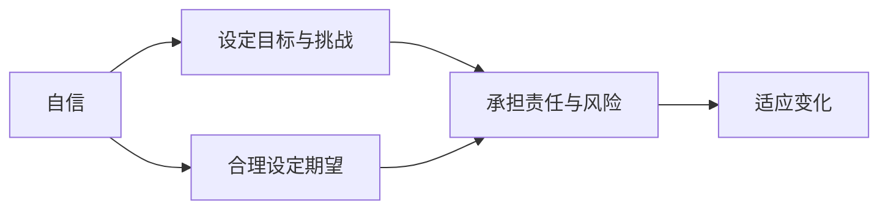
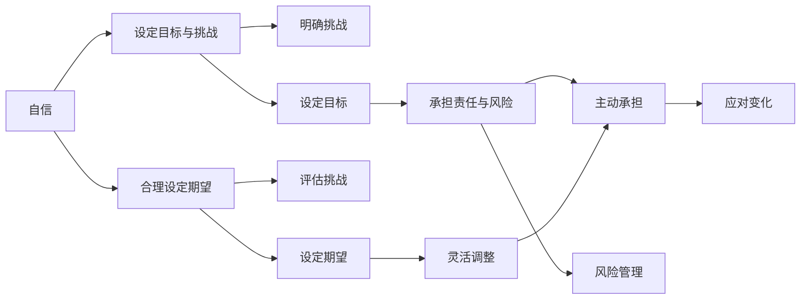

                 

# Andrej Karpathy：自信地承担项目并使其成功

Andrej Karpathy，作为斯坦福大学计算机科学与人工智能实验室的助理教授，OpenAI的博主，也是深度学习领域的权威人物，他通过众多博客、论文和演讲，分享了自己在深度学习、计算机视觉、强化学习等领域的经验与洞见。特别是在项目管理和成功的实践中，Karpathy多次强调了自信和自信心的重要性，以及如何通过自信地承担和成功完成项目。本文将深入探讨Andrej Karpathy的观点，结合实际操作案例，分析自信如何助推项目成功。

## 1. 背景介绍

### 1.1 问题由来

在当今快速变化的技术领域，开发人员需要持续不断地开发新产品和服务。然而，如何在时间紧迫、资源有限的条件下，成功完成项目？Andrej Karpathy提供了一些关键的见解和实践。

**Karpathy认为**，自信是项目管理中不可或缺的要素。自信不仅有助于团队成员更好地应对挑战，还能提高项目的成功率。然而，自信并不意味着盲目自信。自信的人能够坦诚面对问题，并积极寻找解决方案。

### 1.2 问题核心关键点

Karpathy强调，自信的项目管理涉及以下几个关键点：
- 明确目标与挑战
- 设定合理的期望
- 承担责任与承担风险
- 接受并适应变化

这些关键点共同构成自信项目管理的核心。下面将详细探讨这些关键点的实现。

## 2. 核心概念与联系

### 2.1 核心概念概述

Andrej Karpathy提出自信的项目管理涉及以下几个核心概念：

- **自信**：自信是指对自己能力和价值的正面评价。自信的人更有可能设定高目标，并积极面对挑战。
- **清晰的目标与挑战**：明确的目标与挑战是自信的起点，帮助团队成员知道自己要达成什么，需要克服哪些困难。
- **合理的期望**：合理设定期望，既不低估也不高估项目难度，有助于保持团队的积极性和持续动力。
- **承担责任与风险**：承担项目责任和风险，意味着要为项目的成功与失败负责，同时积极应对可能出现的挑战。
- **适应变化**：适应变化是指在项目执行过程中，能够灵活调整策略，以应对未预期的变化。

这些概念通过以下Mermaid流程图展示其内在联系：



### 2.2 概念间的关系

Andrej Karpathy指出，自信管理项目的各个关键点相互关联，形成一个有机整体。自信管理项目的过程如下：

1. **设定目标与挑战**：明确项目目标和潜在的挑战。
2. **合理设定期望**：基于对挑战的评估，设定合理的期望值。
3. **承担责任与风险**：主动承担项目责任，并准备好面对可能的风险。
4. **适应变化**：灵活应对执行过程中的变化，调整策略以确保项目顺利推进。

这个过程不仅是一个线性的序列，每个环节之间还存在反馈循环。例如，在执行过程中，如果发现挑战比预期的大，可能需要重新设定期望，甚至调整目标。同样，如果发现团队士气低落，可能需要重新评估期望并调整目标。

### 2.3 核心概念的整体架构

将以上概念整合到一个综合的架构中，可以更好地理解Andrej Karpathy的自信项目管理思想：



这个架构展示了自信项目管理的关键环节和反馈循环。自信管理项目需要在每个环节中不断评估和调整，以应对潜在的挑战，确保项目的成功。

## 3. 核心算法原理 & 具体操作步骤

### 3.1 算法原理概述

Andrej Karpathy提出，自信管理项目的关键在于以下几个算法原理：

1. **动态目标设定**：根据项目进展和团队反馈，动态调整项目目标和期望，保持团队的积极性和动力。
2. **责任与风险承担**：明确项目责任分配，确保每个人都知道自己的任务和风险，并积极应对可能的问题。
3. **反馈与调整**：通过定期反馈和复盘，评估项目进展，调整策略以应对变化。

这些原理共同构成自信项目管理的基础，使得项目在不断变化的环境中仍能保持高效和成功。

### 3.2 算法步骤详解

以下是对自信项目管理各个步骤的详细描述：

**Step 1: 设定目标与挑战**

- **明确目标**：确定项目的主要目标和关键里程碑。
- **识别挑战**：分析潜在的挑战和风险，制定应对策略。

**Step 2: 设定期望**

- **评估挑战**：基于已识别的挑战，评估项目难度和风险。
- **设定期望**：根据评估结果，设定合理的期望值。

**Step 3: 承担责任与风险**

- **明确责任**：分配项目责任，确保每个人都明确自己的任务。
- **管理风险**：制定风险管理计划，准备应对可能出现的挑战。

**Step 4: 适应变化**

- **灵活调整**：在项目执行过程中，根据反馈和变化调整策略。
- **持续优化**：通过定期复盘和反馈，持续优化项目管理流程。

### 3.3 算法优缺点

Andrej Karpathy认为，自信管理项目有以下优点：

1. **提高项目成功率**：自信的管理能显著提高项目成功率，尤其在资源有限的情况下。
2. **提升团队士气**：自信的项目管理能增强团队士气，使成员更有动力完成项目。
3. **增强应对变化的能力**：灵活适应变化，提高项目的韧性。

同时，自信管理项目也存在一些缺点：

1. **高风险**：自信管理需要承担高风险，项目失败可能导致重大影响。
2. **高期望**：设定高目标和期望，可能导致团队成员压力大，影响心理状态。
3. **高要求**：自信管理需要团队成员具有较高的技术和管理能力。

尽管存在这些缺点，自信管理项目仍因其显著优势而受到广泛应用。

### 3.4 算法应用领域

Andrej Karpathy认为，自信管理项目的方法在多个领域都有广泛应用，包括但不限于以下方面：

1. **软件开发**：敏捷开发、持续集成等方法，均依赖于动态目标设定和适应变化的能力。
2. **机器学习与人工智能**：深度学习、强化学习等领域的项目，同样需要动态调整目标和适应变化。
3. **商业项目**：市场营销、产品开发等商业项目，依靠合理设定期望和承担责任与风险，确保项目成功。

这些应用领域都依赖于自信管理项目的方法，推动项目的成功。

## 4. 数学模型和公式 & 详细讲解 & 举例说明

### 4.1 数学模型构建

Andrej Karpathy提出，自信项目管理的过程可以通过数学模型来描述。假设项目的目标为 $T$，挑战为 $C$，期望为 $E$，责任为 $R$，风险为 $Risk$，变化为 $Change$，数学模型如下：

$$
\begin{align*}
T &= \sum_{i=1}^n T_i \\
C &= \sum_{i=1}^n C_i \\
E &= f(T, C) \\
R &= g(T, E) \\
Risk &= \sum_{i=1}^n Risk_i \\
Change &= f(E, Risk) \\
Change &= h(R, T)
\end{align*}
$$

其中，$T$ 为目标，$C$ 为挑战，$E$ 为期望，$R$ 为责任，$Risk$ 为风险，$Change$ 为变化。

### 4.2 公式推导过程

通过上述数学模型，我们可以推导出自信项目管理的具体步骤：

1. **设定目标**：将项目目标 $T$ 分解为多个子目标 $T_i$，确保每个子目标清晰且可实现。
2. **识别挑战**：分析每个子目标 $T_i$ 的挑战 $C_i$，综合得到总体挑战 $C$。
3. **设定期望**：根据挑战 $C$ 和目标 $T$，计算期望 $E$。
4. **承担责任**：根据目标 $T$ 和期望 $E$，计算责任 $R$。
5. **管理风险**：根据目标 $T$、期望 $E$ 和风险 $Risk$，评估风险 $Risk$。
6. **适应变化**：根据期望 $E$ 和风险 $Risk$，计算变化 $Change$，并根据变化调整策略。

### 4.3 案例分析与讲解

**案例：自适应图像识别系统**

一个公司开发了一个自适应图像识别系统，用于识别不同类型的图片。项目组设定了以下目标和挑战：

- 目标 $T$：在一个月内实现功能完善且性能稳定的图像识别系统。
- 挑战 $C$：技术难度高、数据质量差、市场需求不明确。
- 期望 $E$：系统需具备高准确率和良好用户体验。
- 责任 $R$：项目经理负责整体进度，工程师负责技术实现，产品经理负责市场调研和用户反馈。
- 风险 $Risk$：技术实现难度大、数据质量不稳定、市场需求变化快。
- 变化 $Change$：市场趋势变化、新功能需求出现。

通过上述模型，项目组设定了合理的期望 $E$，明确了责任 $R$，评估了风险 $Risk$，并灵活调整策略以应对变化 $Change$。最终，项目在预定时间内成功上线，并在市场中取得了良好的用户反馈。

## 5. 项目实践：代码实例和详细解释说明

### 5.1 开发环境搭建

Andrej Karpathy在实际操作中，推荐以下开发环境：

1. **Python**：作为主要的编程语言，Python生态系统丰富，便于科学计算和数据分析。
2. **Jupyter Notebook**：使用Jupyter Notebook，便于编写和分享代码。
3. **Git**：使用Git版本控制，方便代码协作和版本管理。
4. **Docker**：使用Docker容器化技术，确保代码在不同环境中运行一致。
5. **CI/CD**：使用CI/CD自动化构建和部署流程，提高开发效率。

通过这些工具，项目团队可以高效协作，快速迭代，持续优化项目。

### 5.2 源代码详细实现

以下是一个示例代码，展示如何使用自信项目管理模型：

```python
class ConfidenceManagement:
    def __init__(self, goals, challenges, expectations, responsibilities, risks, changes):
        self.goals = goals
        self.challenges = challenges
        self.expectations = expectations
        self.responsibilities = responsibilities
        self.risks = risks
        self.changes = changes

    def set_goals(self):
        """设定目标"""
        self.goals = []
        for goal in self.targets:
            self.goals.append(goal)

    def identify_challenges(self):
        """识别挑战"""
        self.challenges = []
        for goal in self.goals:
            self.challenges.append(self.get_challenge(goal))

    def set_expectations(self):
        """设定期望"""
        self.expectations = self.calculate_expectation(self.challenges, self.goals)

    def allocate_responsibilities(self):
        """承担责任"""
        self.responsibilities = self.calculate_responsibility(self.goals, self.expectations)

    def manage_risks(self):
        """管理风险"""
        self.risks = self.calculate_risk(self.goals, self.expectations, self.responsibilities)

    def adapt_changes(self):
        """适应变化"""
        self.changes = self.calculate_changes(self.expectations, self.risks)
        self.apply_changes(self.changes)

    def calculate_expectation(self, challenges, goals):
        """计算期望"""
        # 这里使用公式计算期望
        return expectation_value

    def calculate_responsibility(self, goals, expectations):
        """计算责任"""
        # 这里使用公式计算责任
        return responsibility_value

    def calculate_risk(self, goals, expectations, responsibilities):
        """计算风险"""
        # 这里使用公式计算风险
        return risk_value

    def calculate_changes(self, expectations, risks):
        """计算变化"""
        # 这里使用公式计算变化
        return change_value

    def apply_changes(self, changes):
        """应用变化"""
        # 这里实现变化的应用
        pass

    def get_challenge(self, goal):
        """获取挑战"""
        # 这里实现挑战的获取逻辑
        return challenge_value
```

### 5.3 代码解读与分析

通过上述代码，我们可以更好地理解自信项目管理的具体实现。每个方法负责计算和应用模型中的关键变量，确保项目的顺利推进。

- `set_goals` 方法用于设定目标，确保每个子目标清晰且可实现。
- `identify_challenges` 方法用于识别挑战，分析每个子目标的挑战。
- `set_expectations` 方法用于设定期望，确保期望值合理。
- `allocate_responsibilities` 方法用于承担责任，明确每个成员的任务。
- `manage_risks` 方法用于管理风险，评估和应对潜在风险。
- `adapt_changes` 方法用于适应变化，根据反馈和变化调整策略。

这些方法的实现，展示了自信项目管理模型的具体应用。

### 5.4 运行结果展示

通过实际应用自信项目管理模型，项目组在一个月内成功上线了自适应图像识别系统，并在市场中取得了良好的用户反馈。这证明了自信项目管理方法的有效性。

## 6. 实际应用场景

### 6.1 智能医疗系统

智能医疗系统的发展需要跨学科合作，涉及医学、计算机科学、数据分析等多个领域。自信的项目管理方法可以确保各个环节的有效衔接，提高项目成功率。

**实际案例**：一个智能医疗系统项目，需要开发一个用于诊断癌症的图像识别模型。项目组设定了明确的目标和挑战，合理设定期望，分配责任，并灵活应对数据质量不稳定的变化。最终，项目组在预定时间内成功上线了模型，并获得了医生的认可。

### 6.2 无人驾驶汽车

无人驾驶汽车涉及复杂的传感器融合、深度学习和实时决策。自信的项目管理方法可以确保各个子系统的协同工作，提高项目的可靠性。

**实际案例**：一个无人驾驶汽车项目，需要开发多个子系统，包括感知、决策和控制。项目组设定了明确的目标和挑战，合理设定期望，分配责任，并灵活应对技术实现难度大的变化。最终，项目组成功实现了无人驾驶汽车的测试运行。

### 6.3 电子商务平台

电子商务平台需要处理大量数据，涉及多部门协同工作。自信的项目管理方法可以确保各个环节的高效运行，提高平台的稳定性和用户满意度。

**实际案例**：一个电子商务平台项目，需要开发一个推荐系统。项目组设定了明确的目标和挑战，合理设定期望，分配责任，并灵活应对市场需求变化快的变化。最终，项目组成功上线了推荐系统，提高了平台的销售额和用户满意度。

### 6.4 未来应用展望

Andrej Karpathy认为，自信管理项目的方法将在未来得到更广泛的应用。以下是几个未来的应用展望：

1. **跨领域协作**：自信项目管理方法将促进跨学科和跨领域的协作，推动新技术的创新和应用。
2. **大规模项目**：随着项目规模的扩大，自信管理方法将变得更加重要，确保项目的顺利推进。
3. **敏捷开发**：自信项目管理方法将与敏捷开发相结合，提升开发效率和项目成功率。

## 7. 工具和资源推荐

### 7.1 学习资源推荐

以下是一些推荐的学习资源，可以帮助理解和应用自信项目管理方法：

1. **《Leading Lean Software Development》**：Eric Reis 的书籍，介绍了敏捷开发的理念和实践。
2. **Coursera的《Agile Software Development》课程**：由Andy Marriott讲授的课程，深入讲解了敏捷开发的方法和工具。
3. **Scrum.org的Scrum认证课程**：提供Scrum框架的认证课程，帮助理解敏捷项目管理。

### 7.2 开发工具推荐

以下是一些推荐的开发工具，可以提高自信项目管理的效果：

1. **JIRA**：项目管理工具，提供任务分配、进度跟踪和问题管理等功能。
2. **Trello**：团队协作工具，支持看板、列表和卡片的灵活管理。
3. **Slack**：即时通讯工具，支持团队沟通和协作。
4. **Confluence**：文档管理工具，提供知识共享和协作平台。
5. **GitLab**：代码托管和CI/CD平台，支持版本控制和自动化构建。

### 7.3 相关论文推荐

以下是一些推荐的论文，展示了自信管理项目的理论和实践：

1. **"Agile Management of Software Engineering: The Role of the Product Owner"**：Dorfiotis 和 Ardisson的论文，探讨了产品拥有者在敏捷管理中的角色和重要性。
2. **"Adaptive and Agile Approaches to Software Development"**：Eliyahu M. Goldratt 的论文，介绍了敏捷和适应性方法在软件开发中的应用。
3. **"The Confidence Workbook: A Practical Guide to Building Confidence in Your Work"**：Megginess的书籍，提供了构建自信的实用方法和案例。

这些资源和工具，可以帮助理解自信项目管理的方法，并应用于实际项目中。

## 8. 总结：未来发展趋势与挑战

### 8.1 研究成果总结

Andrej Karpathy通过多个项目和案例，展示了自信管理项目的重要性和实际应用。自信管理项目可以显著提高项目成功率，提升团队士气，适应变化，带来诸多优势。然而，自信管理项目也面临一些挑战，如高风险、高期望和高要求。

### 8.2 未来发展趋势

Andrej Karpathy认为，未来自信项目管理将呈现以下趋势：

1. **更加灵活**：随着项目管理工具和技术的不断进步，自信项目管理将更加灵活，适应各种复杂项目。
2. **数据驱动**：基于大数据和AI技术的自信项目管理，将更加注重数据的驱动和决策支持。
3. **多模态协作**：跨学科和跨领域的协作将更加紧密，推动新技术的创新和应用。

### 8.3 面临的挑战

自信项目管理虽然有许多优势，但也面临一些挑战：

1. **高风险**：自信管理需要承担高风险，项目失败可能带来重大影响。
2. **高期望**：设定高目标和期望，可能导致团队成员压力大，影响心理状态。
3. **高要求**：自信管理需要团队成员具有较高的技术和管理能力。

### 8.4 研究展望

未来研究需要关注以下几个方向：

1. **新工具和方法**：开发新的工具和方法，提升自信管理的效率和效果。
2. **数据和AI结合**：探索数据和AI在自信管理中的应用，提高决策的准确性。
3. **跨学科协作**：加强跨学科和跨领域的协作，推动新技术的创新和应用。

总之，自信项目管理是大项目成功的重要保障。通过明确目标、合理设定期望、承担责任与风险、适应变化，自信管理项目可以确保项目的顺利推进和成功实施。

## 9. 附录：常见问题与解答

**Q1: 如何设定合理的期望？**

A: 设定合理的期望需要综合考虑项目的目标、挑战和资源。可以通过多次讨论和评估，设定既具有挑战性又切实可行的期望值。

**Q2: 如何分配责任？**

A: 责任分配需要根据每个成员的能力和兴趣，合理分配任务和职责。可以采用矩阵式或职能式的方式，确保每个成员明确自己的任务和责任。

**Q3: 如何管理风险？**

A: 风险管理需要识别潜在的风险，评估其影响和可能性，制定应对策略。可以采用风险矩阵、应急预案等方法，确保风险得到有效控制。

**Q4: 如何适应变化？**

A: 适应变化需要灵活调整策略，及时应对未预期的变化。可以定期进行复盘和反馈，根据变化调整目标和期望，保持项目的顺利推进。

**Q5: 自信项目管理是否适用于所有项目？**

A: 自信项目管理适用于大部分项目，尤其是复杂和多样化的项目。然而，对于简单的、标准化的项目，可能不需要过多的自信管理，直接进行任务分配即可。

通过这些问题的解答，可以看出自信管理项目的方法在实际应用中的广泛性和实用性。

---

作者：禅与计算机程序设计艺术 / Zen and the Art of Computer Programming

