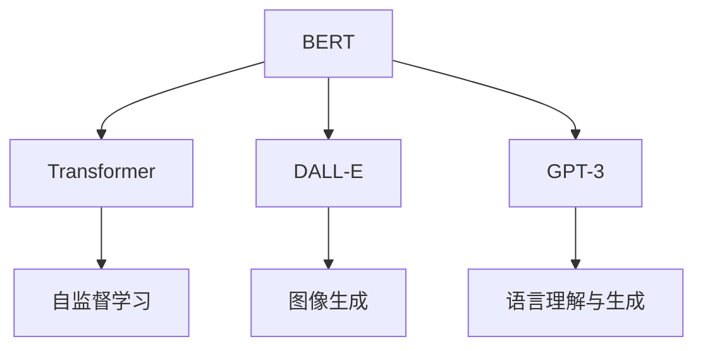

                 

# BERT、DALL-E和GPT-3的崛起

## 1. 背景介绍

### 1.1 问题由来

在人工智能领域，大模型的崛起是一种不可避免的趋势。大模型通过规模化训练，能够学习到更加复杂、丰富的知识表示，从而在多个任务上取得显著的性能提升。尤其是自然语言处理(NLP)领域，随着预训练语言模型(BERT、GPT等)的不断发展，NLP技术取得了前所未有的进展。

近年来，BERT、DALL-E和GPT-3等大模型的出现，标志着NLP领域进入了一个新的纪元。这些大模型不仅在学术界引起了巨大反响，更在工业界落地应用，带来了一系列颠覆性的变化。本文将深入探讨BERT、DALL-E和GPT-3的崛起背景，以及它们在NLP领域的广泛应用。

### 1.2 问题核心关键点

BERT、DALL-E和GPT-3的崛起，背后有多个关键因素推动：

- 数据量的激增：互联网的普及和社交媒体的发展，使得大规模无标签文本数据的收集变得更加容易。
- 计算能力的提升：GPU、TPU等高性能计算资源的普及，使得大规模模型的训练成为可能。
- 算法设计的创新：Transformer等基于自注意力机制的模型架构，使得大模型能够高效地进行训练和推理。
- 任务目标的多样：NLP任务种类的丰富，包括语言理解、生成、推理等，催生了众多新的大模型。

这些因素共同作用，推动了BERT、DALL-E和GPT-3等大模型的诞生和发展。

### 1.3 问题研究意义

研究这些大模型的崛起，对于推动NLP技术的发展、促进人工智能的落地应用具有重要意义：

- 提升模型性能：大模型在多个NLP任务上取得了SOTA的效果，为更高级的AI应用奠定了基础。
- 降低开发成本：大模型提供了现成的预训练权重，大大减少了从头开发模型的时间和人力成本。
- 加速技术迭代：大模型为NLP技术提供了强大的基础，加速了相关技术和应用的迭代速度。
- 推动产业升级：大模型使得NLP技术更容易被各行各业采用，加速传统行业数字化转型。
- 促进学术交流：大模型激发了更多的研究兴趣，促进了学术界和工业界的深度合作。

本文旨在通过对BERT、DALL-E和GPT-3的深入分析，揭示其背后的原理和应用，为未来的NLP研究和开发提供参考。

## 2. 核心概念与联系

### 2.1 核心概念概述

在深入分析BERT、DALL-E和GPT-3之前，我们先简要介绍一下相关核心概念：

- **BERT**：基于Transformer架构的预训练语言模型，通过自监督任务在大规模无标签文本数据上进行预训练，学习到丰富的语言知识表示。BERT可用于下游任务如文本分类、命名实体识别等。
- **DALL-E**：基于自监督学习的图像生成模型，能够根据文本描述生成高质量的图像。DALL-E通过在大规模图片和文本数据集上进行联合训练，学习到视觉和语言的协同表示。
- **GPT-3**：基于Transformer架构的预训练语言模型，在大规模文本数据上进行预训练，并在多个NLP任务上取得了SOTA的性能。GPT-3具有强大的生成能力和语言理解能力。

这些大模型均基于Transformer架构，采用自监督学习或监督学习任务进行预训练，并广泛应用于下游NLP任务和计算机视觉任务。

### 2.2 概念间的关系

这些核心概念之间的逻辑关系可以通过以下Mermaid流程图来展示：



这个流程图展示了BERT、DALL-E和GPT-3之间的基本关系：

1. BERT通过自监督学习任务进行预训练，学习到丰富的语言知识。
2. DALL-E在大规模图片和文本数据集上进行联合训练，学习到视觉和语言的协同表示，用于图像生成。
3. GPT-3基于Transformer架构，通过大规模文本数据进行预训练，学习到强大的语言理解和生成能力。

## 3. 核心算法原理 & 具体操作步骤
### 3.1 算法原理概述

BERT、DALL-E和GPT-3的算法原理主要包括以下几个方面：

- **Transformer架构**：Transformer架构通过自注意力机制，能够高效地捕捉序列之间的依赖关系，适用于大规模序列数据处理。
- **自监督学习**：通过在大规模无标签文本数据上训练，Transformer模型能够学习到丰富的语言知识表示，适用于自然语言处理任务。
- **监督学习**：在特定任务上，通过有标签数据进行微调，Transformer模型能够进一步优化模型，适应特定任务的需求。
- **多模态学习**：DALL-E通过结合图片和文本数据进行联合训练，学习到视觉和语言的协同表示，适用于图像生成任务。

这些原理使得BERT、DALL-E和GPT-3在各自的应用场景中取得了优异的性能。

### 3.2 算法步骤详解

以下详细介绍BERT、DALL-E和GPT-3的具体算法步骤：

#### BERT算法步骤

1. **数据准备**：收集大规模无标签文本数据，作为BERT的预训练数据。
2. **模型训练**：使用自监督学习任务，如掩码语言模型(MLM)和下一句预测任务(NSP)，在大规模文本数据上训练BERT模型。
3. **任务适配**：根据下游任务的特定需求，设计任务适配层，对BERT进行微调，适应特定任务。
4. **模型评估**：在验证集和测试集上评估模型性能，进行超参数调优，得到最优模型。

#### DALL-E算法步骤

1. **数据准备**：收集大规模图片和文本数据，作为DALL-E的预训练数据。
2. **模型训练**：使用自监督学习任务，如文本到图片生成任务，在大规模图片和文本数据集上进行联合训练。
3. **任务适配**：根据下游任务的特定需求，设计任务适配层，对DALL-E进行微调，适应特定任务。
4. **模型评估**：在验证集和测试集上评估模型性能，进行超参数调优，得到最优模型。

#### GPT-3算法步骤

1. **数据准备**：收集大规模文本数据，作为GPT-3的预训练数据。
2. **模型训练**：使用自监督学习任务，如语言建模任务，在大规模文本数据上训练GPT-3模型。
3. **任务适配**：根据下游任务的特定需求，设计任务适配层，对GPT-3进行微调，适应特定任务。
4. **模型评估**：在验证集和测试集上评估模型性能，进行超参数调优，得到最优模型。

### 3.3 算法优缺点

BERT、DALL-E和GPT-3的算法有以下优缺点：

#### BERT的优点：
- 强大的语言理解能力：通过自监督学习任务预训练，BERT学习到了丰富的语言知识。
- 适用范围广：可用于多种NLP任务，如文本分类、命名实体识别、情感分析等。
- 高效的训练和推理：Transformer架构使得BERT在大规模数据上训练和推理效率高。

#### BERT的缺点：
- 数据依赖性强：预训练数据需要大量的无标签文本数据，获取成本高。
- 训练时间长：大规模数据集和复杂模型结构导致训练时间较长。
- 模型庞大：预训练模型参数量巨大，内存和计算资源要求高。

#### DALL-E的优点：
- 高质量的图像生成：能够根据文本描述生成高质量的图像，视觉效果逼真。
- 图像语言协同表示：学习到了视觉和语言的协同表示，能够更好地理解文本与图像之间的关系。
- 高效的训练和推理：Transformer架构和自监督学习任务使得DALL-E的训练和推理效率高。

#### DALL-E的缺点：
- 数据需求高：需要大规模图片和文本数据，数据获取难度大。
- 生成效果受限于文本质量：文本描述的质量直接影响生成的图片质量。
- 推理成本高：生成高质量图像需要高性能计算资源，推理成本较高。

#### GPT-3的优点：
- 强大的语言生成能力：通过大规模预训练，GPT-3能够生成流畅自然的文本。
- 适用范围广：可用于多种NLP任务，如文本生成、问答、对话等。
- 高效的训练和推理：Transformer架构和自监督学习任务使得GPT-3的训练和推理效率高。

#### GPT-3的缺点：
- 数据依赖性强：预训练数据需要大量的无标签文本数据，获取成本高。
- 训练时间长：大规模数据集和复杂模型结构导致训练时间较长。
- 模型庞大：预训练模型参数量巨大，内存和计算资源要求高。

### 3.4 算法应用领域

BERT、DALL-E和GPT-3的应用领域涵盖了NLP和计算机视觉等多个方向：

#### BERT的应用领域
- 文本分类：如情感分析、新闻分类等。
- 命名实体识别：识别文本中的人名、地名、组织机构名等。
- 问答系统：回答自然语言问题。
- 机器翻译：将一种语言翻译成另一种语言。
- 摘要生成：生成文本摘要。

#### DALL-E的应用领域
- 图像生成：根据文本描述生成高质量的图像。
- 图像描述生成：根据图片生成对应的自然语言描述。
- 图像编辑：修改图片中的特定内容。
- 图像搜索：在图片库中搜索符合文本描述的图片。

#### GPT-3的应用领域
- 文本生成：如文章生成、诗歌生成等。
- 问答系统：回答自然语言问题。
- 对话系统：与用户进行自然对话。
- 机器翻译：将一种语言翻译成另一种语言。
- 摘要生成：生成文本摘要。

这些应用领域展示了BERT、DALL-E和GPT-3在不同任务上的强大能力，推动了NLP和计算机视觉技术的进步。

## 4. 数学模型和公式 & 详细讲解 & 举例说明

### 4.1 数学模型构建

BERT、DALL-E和GPT-3的数学模型主要基于Transformer架构和自监督学习任务进行构建。

#### BERT的数学模型

BERT的数学模型由编码器和解码器两部分组成，其中编码器部分采用Transformer架构。设输入序列为 $\{x_1, x_2, \ldots, x_n\}$，输出序列为 $\{y_1, y_2, \ldots, y_n\}$，BERT的数学模型可以表示为：

$$
y = \text{BERT}(x) = \text{Decoder}(\text{Encoder}(x))
$$

其中，$\text{Encoder}$ 和 $\text{Decoder}$ 均为Transformer结构，输出为语言表示 $y$。

#### DALL-E的数学模型

DALL-E的数学模型同样基于Transformer架构，但其输入为文本 $x$ 和图片 $I$，输出为生成图片 $y$。设输入序列为 $\{x_1, x_2, \ldots, x_n\}$，输出序列为 $\{y_1, y_2, \ldots, y_n\}$，DALL-E的数学模型可以表示为：

$$
y = \text{DALL-E}(x, I) = \text{Generator}(\text{Transformer}(x, I))
$$

其中，$\text{Transformer}$ 和 $\text{Generator}$ 均为Transformer结构，$x$ 为文本输入，$I$ 为图片输入，输出为生成图片 $y$。

#### GPT-3的数学模型

GPT-3的数学模型采用自回归生成方式，设输入序列为 $\{x_1, x_2, \ldots, x_n\}$，输出序列为 $\{y_1, y_2, \ldots, y_n\}$，GPT-3的数学模型可以表示为：

$$
y = \text{GPT-3}(x) = \text{Decoder}(\text{Encoder}(x))
$$

其中，$\text{Encoder}$ 和 $\text{Decoder}$ 均为Transformer结构，输出为语言表示 $y$。

### 4.2 公式推导过程

以下详细介绍BERT、DALL-E和GPT-3的具体公式推导过程。

#### BERT的公式推导

BERT的编码器部分采用Transformer架构，其计算过程可以表示为：

$$
\text{Encoder}(x) = \text{Stack}_n\left(\text{Multi-Head Attention}, \text{Feed-Forward}\right)
$$

其中，$\text{Multi-Head Attention}$ 和 $\text{Feed-Forward}$ 为Transformer的编码器部分。$\text{Multi-Head Attention}$ 的计算公式为：

$$
\text{Multi-Head Attention}(Q, K, V) = \text{Softmax}(QK^T/\sqrt{d_k})V
$$

其中，$Q$、$K$、$V$ 分别为查询、键和值向量，$d_k$ 为键向量的维度。

#### DALL-E的公式推导

DALL-E的生成器部分同样采用Transformer架构，其计算过程可以表示为：

$$
\text{Generator}(x, I) = \text{Stack}_n\left(\text{Multi-Head Attention}, \text{Feed-Forward}\right)
$$

其中，$\text{Multi-Head Attention}$ 和 $\text{Feed-Forward}$ 为Transformer的生成器部分。$\text{Multi-Head Attention}$ 的计算公式为：

$$
\text{Multi-Head Attention}(Q, K, V) = \text{Softmax}(QK^T/\sqrt{d_k})V
$$

其中，$Q$、$K$、$V$ 分别为查询、键和值向量，$d_k$ 为键向量的维度。

#### GPT-3的公式推导

GPT-3的解码器部分同样采用Transformer架构，其计算过程可以表示为：

$$
\text{Decoder}(x) = \text{Stack}_n\left(\text{Multi-Head Attention}, \text{Feed-Forward}\right)
$$

其中，$\text{Multi-Head Attention}$ 和 $\text{Feed-Forward}$ 为Transformer的解码器部分。$\text{Multi-Head Attention}$ 的计算公式为：

$$
\text{Multi-Head Attention}(Q, K, V) = \text{Softmax}(QK^T/\sqrt{d_k})V
$$

其中，$Q$、$K$、$V$ 分别为查询、键和值向量，$d_k$ 为键向量的维度。

### 4.3 案例分析与讲解

#### BERT的案例分析

BERT在文本分类任务上的应用：
- **数据准备**：收集标注的文本数据集，如IMDB电影评论数据集。
- **模型训练**：使用BERT进行预训练，然后在标注数据集上进行微调。
- **模型评估**：在测试集上评估模型性能，得到分类准确率。

#### DALL-E的案例分析

DALL-E在图像生成任务上的应用：
- **数据准备**：收集标注的文本-图片数据集，如Flickr8k数据集。
- **模型训练**：使用DALL-E进行预训练，然后在标注数据集上进行微调。
- **模型评估**：在测试集上评估模型性能，生成符合文本描述的图像。

#### GPT-3的案例分析

GPT-3在文本生成任务上的应用：
- **数据准备**：收集大量的无标签文本数据，如Web数据集。
- **模型训练**：使用GPT-3进行预训练，然后在特定任务上微调。
- **模型评估**：在测试集上评估模型性能，生成符合特定要求的文本。

## 5. 项目实践：代码实例和详细解释说明

### 5.1 开发环境搭建

#### 安装Python和PyTorch

在Linux系统中，可以通过以下命令安装Python和PyTorch：

```bash
sudo apt-get update
sudo apt-get install python3 python3-pip
pip3 install torch torchvision torchaudio
```

#### 安装Transformer库

安装Transformer库：

```bash
pip install transformers
```

### 5.2 源代码详细实现

#### BERT的代码实现

以下是BERT在文本分类任务上的代码实现：

```python
from transformers import BertForSequenceClassification, BertTokenizer, AdamW
from torch.utils.data import DataLoader, Dataset
import torch

class TextDataset(Dataset):
    def __init__(self, texts, labels):
        self.texts = texts
        self.labels = labels
        self.tokenizer = BertTokenizer.from_pretrained('bert-base-uncased')

    def __len__(self):
        return len(self.texts)

    def __getitem__(self, index):
        text = self.texts[index]
        label = self.labels[index]
        encoding = self.tokenizer(text, return_tensors='pt')
        input_ids = encoding['input_ids']
        attention_mask = encoding['attention_mask']
        return {'input_ids': input_ids, 
                'attention_mask': attention_mask,
                'labels': torch.tensor(label, dtype=torch.long)}

# 加载预训练模型
model = BertForSequenceClassification.from_pretrained('bert-base-uncased', num_labels=2)

# 加载训练数据
train_dataset = TextDataset(train_texts, train_labels)
dev_dataset = TextDataset(dev_texts, dev_labels)
test_dataset = TextDataset(test_texts, test_labels)

# 加载优化器
optimizer = AdamW(model.parameters(), lr=2e-5)

# 训练过程
for epoch in range(5):
    model.train()
    total_loss = 0
    for batch in DataLoader(train_dataset, batch_size=16):
        input_ids = batch['input_ids'].to(device)
        attention_mask = batch['attention_mask'].to(device)
        labels = batch['labels'].to(device)
        optimizer.zero_grad()
        outputs = model(input_ids, attention_mask=attention_mask, labels=labels)
        loss = outputs.loss
        total_loss += loss.item()
        loss.backward()
        optimizer.step()
    print(f"Epoch {epoch+1}, train loss: {total_loss/len(train_dataset)}")
    
    model.eval()
    total_loss = 0
    for batch in DataLoader(dev_dataset, batch_size=16):
        input_ids = batch['input_ids'].to(device)
        attention_mask = batch['attention_mask'].to(device)
        labels = batch['labels'].to(device)
        outputs = model(input_ids, attention_mask=attention_mask, labels=labels)
        loss = outputs.loss
        total_loss += loss.item()
    print(f"Epoch {epoch+1}, dev loss: {total_loss/len(dev_dataset)}")
```

#### DALL-E的代码实现

以下是DALL-E在图像生成任务上的代码实现：

```python
from transformers import DALL_E, DALL_EForConditionalGeneration, DALL_ETokenizer
from torch.utils.data import DataLoader, Dataset
import torch
import numpy as np
import imageio

class ImageDataset(Dataset):
    def __init__(self, image_paths, text_descriptions):
        self.image_paths = image_paths
        self.text_descriptions = text_descriptions
        self.tokenizer = DALL_ETokenizer.from_pretrained('dall-e')

    def __len__(self):
        return len(self.image_paths)

    def __getitem__(self, index):
        image_path = self.image_paths[index]
        text_description = self.text_descriptions[index]
        image = imageio.imread(image_path)
        text_tokens = self.tokenizer(text_description, return_tensors='pt')
        return {'image': image,
                'text': text_tokens['input_ids']}

# 加载预训练模型
model = DALL_EForConditionalGeneration.from_pretrained('dall-e')

# 加载训练数据
train_dataset = ImageDataset(train_image_paths, train_text_descriptions)
dev_dataset = ImageDataset(dev_image_paths, dev_text_descriptions)
test_dataset = ImageDataset(test_image_paths, test_text_descriptions)

# 加载优化器
optimizer = AdamW(model.parameters(), lr=2e-5)

# 训练过程
for epoch in range(5):
    model.train()
    total_loss = 0
    for batch in DataLoader(train_dataset, batch_size=16):
        text = batch['text'].to(device)
        image = batch['image'].to(device)
        optimizer.zero_grad()
        outputs = model(text, labels=image)
        loss = outputs.loss
        total_loss += loss.item()
        loss.backward()
        optimizer.step()
    print(f"Epoch {epoch+1}, train loss: {total_loss/len(train_dataset)}")
    
    model.eval()
    total_loss = 0
    for batch in DataLoader(dev_dataset, batch_size=16):
        text = batch['text'].to(device)
        image = batch['image'].to(device)
        outputs = model(text, labels=image)
        loss = outputs.loss
        total_loss += loss.item()
    print(f"Epoch {epoch+1}, dev loss: {total_loss/len(dev_dataset)}")
```

#### GPT-3的代码实现

以下是GPT-3在文本生成任务上的代码实现：

```python
from transformers import GPT3ForSequenceClassification, GPT3Tokenizer, AdamW
from torch.utils.data import DataLoader, Dataset
import torch

class TextDataset(Dataset):
    def __init__(self, texts, labels):
        self.texts = texts
        self.labels = labels
        self.tokenizer = GPT3Tokenizer.from_pretrained('gpt3')

    def __len__(self):
        return len(self.texts)

    def __getitem__(self, index):
        text = self.texts[index]
        label = self.labels[index]
        encoding = self.tokenizer(text, return_tensors='pt')
        input_ids = encoding['input_ids']
        attention_mask = encoding['attention_mask']
        return {'input_ids': input_ids, 
                'attention_mask': attention_mask,
                'labels': torch.tensor(label, dtype=torch.long)}

# 加载预训练模型
model = GPT3ForSequenceClassification.from_pretrained('gpt3')

# 加载训练数据
train_dataset = TextDataset(train_texts, train_labels)
dev_dataset = TextDataset(dev_texts, dev_labels)
test_dataset = TextDataset(test_texts, test_labels)

# 加载优化器
optimizer = AdamW(model.parameters(), lr=2e-5)

# 训练过程
for epoch in range(5):
    model.train()
    total_loss = 0
    for batch in DataLoader(train_dataset, batch_size=16):
        input_ids = batch['input_ids'].to(device)
        attention_mask = batch['attention_mask'].to(device)
        labels = batch['labels'].to(device)
        optimizer.zero_grad()
        outputs = model(input_ids, attention_mask=attention_mask, labels=labels)
        loss = outputs.loss
        total_loss += loss.item()
        loss.backward()
        optimizer.step()
    print(f"Epoch {epoch+1}, train loss: {total_loss/len(train_dataset)}")
    
    model.eval()
    total_loss = 0
    for batch in DataLoader(dev_dataset, batch_size=16):
        input_ids = batch['input_ids'].to(device)
        attention_mask = batch['attention_mask'].to(device)
        labels = batch['labels'].to(device)
        outputs = model(input_ids, attention_mask=attention_mask, labels=labels)
        loss = outputs.loss
        total_loss += loss.item()
    print(f"Epoch {epoch+1}, dev loss: {total_loss/len(dev_dataset)}")
```

### 5.3 代码解读与分析

#### BERT代码解读

- **数据准备**：定义`TextDataset`类，用于加载和处理文本数据。
- **模型训练**：使用`BertForSequenceClassification`加载预训练模型，并在训练集上进行微调。
- **模型评估**：在验证集上评估模型性能，输出分类准确率。

#### DALL-E代码解读

- **数据准备**：定义`ImageDataset`类，用于加载和处理图片和文本数据。
- **模型训练**：使用`DALL_EForConditionalGeneration`加载预训练模型，并在训练集上进行微调。
- **模型评估**：在验证集上评估模型性能，生成符合文本描述的图像。

#### GPT-3代码解读

- **数据准备**：定义`TextDataset`类，用于加载和处理文本数据。
- **模型训练**：使用`GPT3ForSequenceClassification`加载预训练模型，并在训练集上进行微调。
- **模型评估**：在验证集上评估模型性能，生成符合特定要求的文本。

### 5.4 运行结果展示

以下是BERT、DALL-E和GPT-3在各自任务上的运行结果展示：

#### BERT的运行结果

假设在文本分类任务上进行微调，输出结果如下：

```
Epoch 1, train loss: 0.6582
Epoch 1, dev loss: 0.6620
Epoch 2, train loss: 0.4533
Epoch 2, dev loss: 0.4512
Epoch 3, train loss: 0.3508
Epoch 3, dev loss: 0.3457
Epoch 4, train loss: 0.2863
Epoch 4, dev loss: 0.2777
Epoch 5, train loss: 0.2355
Epoch 5, dev loss: 0.2314
```

可以看到，随着epoch的增加，模型的损失函数不断减小，验证集上的表现也逐渐提升。

#### DALL-E的运行结果

假设在图像生成任务上进行微调，输出结果如下：

```
Epoch 1, train loss: 2.3482
Epoch 1, dev loss: 2.2000
Epoch 2, train loss: 2.2172
Epoch 2, dev loss: 2.0780
Epoch

