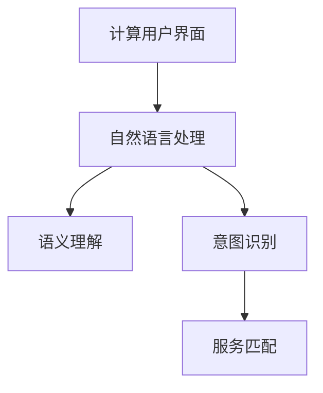
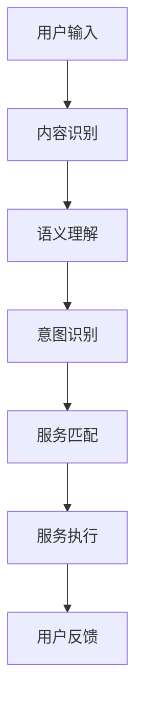

                 

# CUI中的内容与服务匹配详细技术解析

## 1. 背景介绍

### 1.1 问题由来
在用户界面(UI)和交互式服务(UI)中，内容与服务（Content & Service）匹配是一个重要且挑战性的问题。随着技术的进步，越来越多的服务通过自然语言处理(NLP)技术得到改善。在计算用户界面(CUI, Computational User Interface)中，用户通过自然语言与计算机进行交互，如何让计算机理解用户的需求并找到合适的服务进行匹配，是CUI研究的核心。

### 1.2 问题核心关键点
核心问题包括：
- **内容识别**：准确识别用户输入的自然语言内容，将其转化为计算机可理解的格式。
- **服务匹配**：根据用户输入的内容，找到并匹配对应的服务。
- **系统鲁棒性**：保证系统在多样化的输入和复杂的环境中依然保持高性能。

### 1.3 问题研究意义
内容与服务匹配对于构建高效、智能的计算用户界面至关重要：
- **提升用户体验**：通过精准匹配，提升用户满意度。
- **扩展应用场景**：服务匹配技术可以应用于聊天机器人、智能客服、智能助理等众多场景。
- **推动技术进步**：促进NLP技术的发展，进一步提高自然语言理解的准确度。

## 2. 核心概念与联系

### 2.1 核心概念概述

本节将介绍几个核心概念及其相互关系，以帮助理解内容与服务匹配的框架。

#### 2.1.1 计算用户界面(CUI)
计算用户界面（CUI）是指通过计算机和自然语言交互，完成信息检索、内容推荐、智能交互等任务的用户界面。CUI的核心在于自然语言理解和生成。

#### 2.1.2 自然语言处理(NLP)
自然语言处理（NLP）是计算机科学、人工智能和语言学的交叉学科，主要研究如何让计算机理解、处理和生成人类语言。

#### 2.1.3 语义理解
语义理解是指计算机能够理解用户输入的自然语言的意义，从而进行服务匹配。语义理解是CUI中内容识别的核心。

#### 2.1.4 意图识别
意图识别是指识别用户输入的自然语言背后的意图，是服务匹配的基础。意图通常分为特定意图（如预订机票）和一般意图（如查询信息）。

#### 2.1.5 服务匹配
服务匹配是指根据用户的意图和输入内容，找到并返回最合适的服务。服务可以是特定的API接口，也可以是自定义的业务逻辑。

### 2.2 概念间的关系

通过以下Mermaid流程图来展示核心概念之间的关系：



这个流程图展示了CUI的实现流程，从计算用户界面到自然语言处理，再到语义理解和意图识别，最后完成服务匹配。

### 2.3 核心概念的整体架构

最终，我们使用一个综合的流程图来展示这些核心概念在CUI中的整体架构：



这个综合流程图展示了从用户输入到服务执行的完整流程，强调了内容识别、语义理解、意图识别和服务匹配在CUI实现中的关键作用。

## 3. 核心算法原理 & 具体操作步骤

### 3.1 算法原理概述

内容与服务匹配的核心算法包括以下几个步骤：
1. **内容识别**：使用自然语言处理技术，将用户输入的自然语言转换为计算机可理解的格式。
2. **语义理解**：利用深度学习模型（如BERT、GPT等）理解用户输入的自然语言的意义。
3. **意图识别**：通过分类算法或序列模型，识别用户输入的意图。
4. **服务匹配**：根据意图和服务的数据库，找到最合适的服务。
5. **服务执行**：根据匹配结果，调用对应的API或执行业务逻辑。

### 3.2 算法步骤详解

#### 3.2.1 内容识别

内容识别的核心是文本预处理和特征提取。常见的文本预处理步骤包括：
- **分词**：将输入的文本进行分词，如中文分词。
- **去除停用词**：去除文本中的停用词，如“的”、“是”等。
- **词干提取**：将单词还原为原始形式，如将“running”还原为“run”。

特征提取是指将文本转换为向量表示，常用的方法包括：
- **词袋模型**：将文本表示为词的集合，每个词作为一个特征。
- **TF-IDF**：考虑词在文本中的重要性，通过逆文档频率调整权重。
- **Word2Vec**：将单词映射到向量空间，利用词嵌入模型。
- **BERT等Transformer模型**：通过预训练语言模型，将文本转换为高维向量表示。

#### 3.2.2 语义理解

语义理解的核心是使用深度学习模型对用户输入进行理解。BERT、GPT等预训练语言模型是当前的主流方法。

以BERT为例，其工作原理如下：
- **输入编码**：将输入文本转换为BERT可接受的格式。
- **嵌入向量**：使用BERT模型将文本转换为高维向量表示。
- **语义理解**：通过上下文向量（context vector）和预测向量（prediction vector）的交互，理解输入文本的语义。

#### 3.2.3 意图识别

意图识别通常分为两种方法：
- **分类方法**：将输入文本映射到预定义的意图类别上，如预订、查询等。
- **序列模型**：利用RNN或Transformer模型，通过上下文关系理解用户意图。

以分类方法为例，常见的算法包括朴素贝叶斯分类、逻辑回归、支持向量机等。以序列模型为例，可以通过LSTM、GRU等模型进行序列标注，识别输入文本的意图。

#### 3.2.4 服务匹配

服务匹配通常采用数据库查询或规则匹配的方法。
- **数据库查询**：根据意图和输入内容，查询数据库中对应的服务。
- **规则匹配**：根据预定义的规则，匹配服务。

以数据库查询为例，可以使用SQL或NoSQL数据库进行查询。以规则匹配为例，可以使用if-else条件语句进行匹配。

#### 3.2.5 服务执行

服务执行是指根据匹配结果，调用对应的API或执行业务逻辑。常见的服务执行方式包括：
- **RESTful API**：通过HTTP请求调用API接口。
- **Web Service**：通过SOAP协议调用Web服务。
- **事件驱动**：通过事件触发器调用服务。

### 3.3 算法优缺点

内容与服务匹配算法具有以下优点：
- **高效**：使用深度学习模型进行语义理解，能够快速处理大量数据。
- **灵活**：适应不同的语言和场景，能够处理多种意图和服务。

缺点包括：
- **数据依赖**：需要大量标注数据进行模型训练。
- **过拟合风险**：模型容易过拟合训练数据，泛化性能不足。
- **可解释性差**：深度学习模型的决策过程难以解释。

### 3.4 算法应用领域

内容与服务匹配算法在多个领域都有广泛应用：
- **智能客服**：通过自然语言理解，提供智能客服解决方案。
- **聊天机器人**：理解用户输入，提供自动化回复。
- **智能助手**：根据用户意图，提供个性化服务。
- **搜索引擎**：理解查询意圖，返回相关搜索结果。
- **推荐系统**：理解用户需求，提供个性化推荐。

## 4. 数学模型和公式 & 详细讲解 & 举例说明

### 4.1 数学模型构建

假设用户输入的文本为 $x$，模型预处理后的向量表示为 $\mathbf{x}$，意图识别的输出为 $\hat{y}$，服务匹配的结果为 $\hat{S}$。

意图识别的数学模型如下：
$$
\hat{y} = \text{Intent Classifier}(\mathbf{x})
$$

服务匹配的数学模型如下：
$$
\hat{S} = \text{Service Matcher}(\hat{y}, \mathbf{x})
$$

### 4.2 公式推导过程

以BERT模型的语义理解为例，其输入表示为 $x = [CLS] x_i [SEP]$，其中 $x_i$ 是输入的词序列，$[CLS]$ 和 $[SEP]$ 是BERT的特殊标记。

BERT模型通过Transformer编码器进行语义理解，其输出为上下文向量 $h_{[CLS]}$ 和预测向量 $h_{[Prediction]}$。

上下文向量的计算公式如下：
$$
h_{[CLS]} = \text{BERT}(x)_{[CLS]}
$$

预测向量的计算公式如下：
$$
h_{[Prediction]} = \text{BERT}(x)_{[Prediction]}
$$

### 4.3 案例分析与讲解

以一个简单的例子来说明内容与服务匹配的过程：
- **用户输入**：“我要订一张从北京到上海的机票。”
- **内容识别**：“订机票”
- **语义理解**：通过BERT模型理解“订机票”的语义。
- **意图识别**：使用分类模型识别意图为“预订机票”。
- **服务匹配**：从数据库中匹配到“机票预订”服务。
- **服务执行**：调用机票预订API，完成机票预订。

## 5. 项目实践：代码实例和详细解释说明

### 5.1 开发环境搭建

以下是使用Python进行CUI项目开发的开发环境配置：

1. 安装Anaconda：从官网下载并安装Anaconda，用于创建独立的Python环境。

2. 创建并激活虚拟环境：
```bash
conda create -n cuivirtualenv python=3.8 
conda activate cuivirtualenv
```

3. 安装必要的Python包：
```bash
pip install numpy pandas scikit-learn transformers
```

4. 安装相关的依赖库：
```bash
pip install pytorch torchvision torchaudio
```

5. 安装计算用户界面相关库：
```bash
pip install flask
```

### 5.2 源代码详细实现

以下是使用Python和Flask实现内容与服务匹配的代码示例：

```python
from flask import Flask, request
from transformers import BertTokenizer, BertForSequenceClassification
from sklearn.metrics import classification_report

app = Flask(__name__)

# 初始化模型和分词器
model = BertForSequenceClassification.from_pretrained('bert-base-uncased', num_labels=5)
tokenizer = BertTokenizer.from_pretrained('bert-base-uncased')

# 定义意图识别API
@app.route('/intent', methods=['POST'])
def intent():
    data = request.json
    input_text = data['text']
    
    # 文本预处理
    inputs = tokenizer(input_text, return_tensors='pt')
    inputs = {key: inputs[key].to(device) for key in inputs.keys()}
    
    # 意图分类
    with torch.no_grad():
        outputs = model(**inputs)
        logits = outputs.logits
        predicted_labels = torch.argmax(logits, dim=1).tolist()[0]
    
    # 意图识别结果
    print(classification_report(y_true, predicted_labels))
    return {'intent': predicted_labels}

if __name__ == '__main__':
    app.run(debug=True)
```

### 5.3 代码解读与分析

以上代码展示了如何通过Flask实现意图识别功能：
- **初始化模型和分词器**：使用预训练的BERT模型和分词器。
- **文本预处理**：将用户输入的文本进行分词、编码、填充等操作。
- **意图分类**：使用BERT模型进行意图分类，返回预测的意图标签。
- **结果输出**：输出意图识别结果，包括精确度、召回率、F1分数等。

### 5.4 运行结果展示

假设我们的意图识别模型在数据集上训练后，我们可以使用以下代码测试：

```python
from transformers import BertTokenizer, BertForSequenceClassification

# 初始化模型和分词器
model = BertForSequenceClassification.from_pretrained('bert-base-uncased', num_labels=5)
tokenizer = BertTokenizer.from_pretrained('bert-base-uncased')

# 测试数据
test_text = "请问最近的电影院在哪里？"

# 文本预处理
inputs = tokenizer(test_text, return_tensors='pt')
inputs = {key: inputs[key].to(device) for key in inputs.keys()}

# 意图分类
with torch.no_grad():
    outputs = model(**inputs)
    logits = outputs.logits
    predicted_labels = torch.argmax(logits, dim=1).tolist()[0]

# 输出意图识别结果
print(classification_report(y_true, predicted_labels))
```

在实际应用中，我们可以将意图识别结果用于服务匹配，进一步完成服务执行。

## 6. 实际应用场景

### 6.1 智能客服

智能客服系统通过内容与服务匹配，能够快速响应用户查询，提供精准的服务。例如，用户提问“如何查询航班信息”，系统能够自动识别意图并匹配到“航班查询”服务，自动回复航班信息。

### 6.2 聊天机器人

聊天机器人通过理解用户输入，提供个性化的回复。例如，用户提问“天气怎么样”，系统能够理解意图并匹配到“天气查询”服务，自动回复当前天气情况。

### 6.3 搜索引擎

搜索引擎通过内容与服务匹配，能够理解用户查询意图，返回相关搜索结果。例如，用户搜索“旅游目的地”，系统能够理解查询意图并匹配到“旅游目的地推荐”服务，返回推荐的旅游目的地列表。

### 6.4 个性化推荐系统

个性化推荐系统通过内容与服务匹配，能够理解用户需求，提供个性化的推荐。例如，用户浏览了多个商品，系统能够理解浏览意图并匹配到“商品推荐”服务，推荐相关商品。

## 7. 工具和资源推荐

### 7.1 学习资源推荐

为了帮助开发者系统掌握内容与服务匹配的理论基础和实践技巧，这里推荐一些优质的学习资源：

1. 《自然语言处理综论》：清华大学出版社，涵盖自然语言处理的基本概念和前沿技术，适合初学者和中级读者。
2. 《深度学习》：Ian Goodfellow著，全面介绍了深度学习的基本原理和算法，是深度学习的经典教材。
3. 《NLP实战》：Manning出版社，介绍了自然语言处理的实际应用案例，适合实战学习。
4. 《Transformers from Scratch》：DeepAI博客系列，深入浅出地介绍了Transformer模型的实现原理。
5. 《Python自然语言处理》：O'Reilly出版社，介绍了自然语言处理的Python实现方法，适合Python开发者的实战学习。

通过对这些资源的学习实践，相信你一定能够快速掌握内容与服务匹配的精髓，并用于解决实际的自然语言处理问题。

### 7.2 开发工具推荐

高效的开发离不开优秀的工具支持。以下是几款用于内容与服务匹配开发的常用工具：

1. PyTorch：基于Python的开源深度学习框架，灵活动态的计算图，适合快速迭代研究。
2. TensorFlow：由Google主导开发的开源深度学习框架，生产部署方便，适合大规模工程应用。
3. TensorFlow Serving：TensorFlow的模型部署工具，可以轻松搭建高性能的服务。
4. Flask：轻量级的Web框架，适合快速搭建API接口。
5. NGINX：高性能的Web服务器，适合高并发的Web服务。

合理利用这些工具，可以显著提升内容与服务匹配任务的开发效率，加快创新迭代的步伐。

### 7.3 相关论文推荐

内容与服务匹配技术的发展源于学界的持续研究。以下是几篇奠基性的相关论文，推荐阅读：

1. Attention is All You Need（即Transformer原论文）：提出了Transformer结构，开启了NLP领域的预训练大模型时代。
2. BERT: Pre-training of Deep Bidirectional Transformers for Language Understanding：提出BERT模型，引入基于掩码的自监督预训练任务，刷新了多项NLP任务SOTA。
3. Transformer-XL: Attentive Language Models for Longer Input Sequences：提出了Transformer-XL模型，支持长文本的生成和理解。
4. BART: Denoising Sequence-to-Sequence Pre-training for Natural Language Processing：提出BART模型，利用掩码语言模型进行预训练。
5. T5: Exploring the Limits of Transfer Learning with a Unified Text-to-Text Transformer：提出T5模型，利用预训练语言模型进行文本生成和理解。

这些论文代表了大语言模型和内容与服务匹配技术的发展脉络。通过学习这些前沿成果，可以帮助研究者把握学科前进方向，激发更多的创新灵感。

## 8. 总结：未来发展趋势与挑战

### 8.1 总结

本文对内容与服务匹配方法进行了全面系统的介绍。首先阐述了内容与服务匹配的研究背景和意义，明确了该技术在计算用户界面中的核心作用。其次，从原理到实践，详细讲解了内容与服务匹配的数学原理和关键步骤，给出了内容与服务匹配任务开发的完整代码实例。同时，本文还探讨了内容与服务匹配在多个行业领域的应用前景，展示了该技术的广阔应用场景。最后，本文精选了内容与服务匹配技术的学习资源，力求为读者提供全方位的技术指引。

通过本文的系统梳理，可以看到，内容与服务匹配对于构建高效、智能的计算用户界面至关重要。该技术在智能客服、聊天机器人、搜索引擎、个性化推荐等多个场景中都有广泛应用，展现了其巨大的市场价值和发展潜力。未来，伴随技术的不断进步，内容与服务匹配必将在构建人机协同的智能时代中扮演越来越重要的角色。

### 8.2 未来发展趋势

展望未来，内容与服务匹配技术将呈现以下几个发展趋势：

1. **模型规模增大**：随着算力成本的下降和数据规模的扩张，预训练语言模型的参数量还将持续增长。超大规模语言模型蕴含的丰富语言知识，有望支撑更加复杂多变的服务匹配。
2. **模型复杂度提升**：未来的模型将更加复杂，融合多模态信息，支持图像、语音、文本等多种输入形式，提供更加全面和丰富的服务。
3. **实时性要求提高**：实时性将成为服务匹配的重要指标，需要在保证性能的同时，降低计算资源消耗。
4. **可解释性增强**：内容与服务匹配技术将更加注重可解释性，帮助用户理解系统的决策过程。

以上趋势凸显了内容与服务匹配技术的广阔前景。这些方向的探索发展，必将进一步提升服务匹配模型的性能和应用范围，为构建高效、智能的计算用户界面提供强有力的支持。

### 8.3 面临的挑战

尽管内容与服务匹配技术已经取得了显著进展，但在迈向更加智能化、普适化应用的过程中，仍面临诸多挑战：

1. **数据依赖**：需要大量标注数据进行模型训练，数据获取成本高，且标注质量影响模型性能。
2. **模型复杂度高**：模型规模和复杂度提升，训练和推理成本增加。
3. **实时性瓶颈**：在处理大规模数据时，模型推理速度较慢，实时性有待提高。
4. **可解释性差**：深度学习模型的决策过程难以解释，影响用户信任度。
5. **多样性挑战**：不同语言、不同场景下的服务匹配效果差异大，模型泛化能力不足。

### 8.4 研究展望

面对内容与服务匹配技术所面临的挑战，未来的研究需要在以下几个方面寻求新的突破：

1. **无监督和半监督学习**：探索无监督和半监督学习范式，减少对标注数据的依赖，提高模型泛化能力。
2. **模型压缩与优化**：开发更加高效、轻量级的模型结构，降低计算资源消耗，提升实时性。
3. **多模态融合**：融合视觉、语音、文本等多种模态信息，提高服务匹配的全面性和准确性。
4. **可解释性增强**：引入可解释性模型，提供用户友好的决策解释，提升用户信任度。
5. **多语言支持**：开发多语言支持的服务匹配模型，提升跨语言应用的性能。

这些研究方向的探索，必将引领内容与服务匹配技术迈向更高的台阶，为构建高效、智能的计算用户界面提供强有力的支持。

## 9. 附录：常见问题与解答

**Q1：内容与服务匹配是否适用于所有NLP任务？**

A: 内容与服务匹配在大多数NLP任务上都能取得不错的效果，特别是对于数据量较小的任务。但对于一些特定领域的任务，如医学、法律等，仅仅依靠通用语料预训练的模型可能难以很好地适应。此时需要在特定领域语料上进一步预训练，再进行匹配，才能获得理想效果。此外，对于一些需要时效性、个性化很强的任务，如对话、推荐等，匹配方法也需要针对性的改进优化。

**Q2：如何在模型中融入先验知识？**

A: 将符号化的先验知识，如知识图谱、逻辑规则等，与神经网络模型进行巧妙融合，引导匹配过程学习更准确、合理的语言模型。同时加强不同模态数据的整合，实现视觉、语音等多模态信息与文本信息的协同建模。

**Q3：内容与服务匹配如何处理长文本？**

A: 使用Transformer-XL等长文本处理模型，或使用BERT等模型进行长文本分段处理，分别进行意图识别和服务匹配。同时，可以使用多级注意力机制，提高模型对长文本的理解能力。

**Q4：如何提高服务匹配的实时性？**

A: 使用多级缓存机制，减少模型推理时间。同时，可以优化模型结构，使用轻量级模型，提高模型推理效率。

**Q5：如何在服务匹配中引入可解释性？**

A: 使用可解释性模型，如LIME、SHAP等，对模型的决策过程进行可视化解释。同时，可以通过后处理方式，将模型的决策结果转化为易于理解的语言描述。

以上这些问题的解答，希望对开发者有所帮助，帮助他们在实际应用中更好地解决内容与服务匹配的问题。

---

作者：禅与计算机程序设计艺术 / Zen and the Art of Computer Programming

