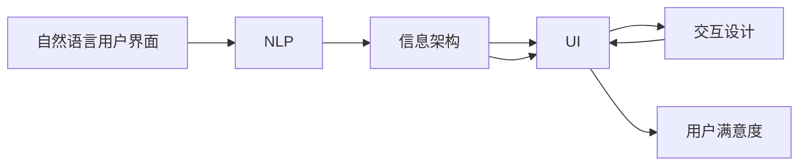
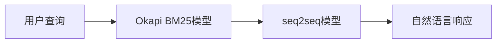

                 

# CUI对信息架构设计的详细影响

> 关键词：CUI, 信息架构, 用户界面设计, 交互设计, 用户满意度

## 1. 背景介绍

### 1.1 问题由来
随着信息技术的发展，现代企业和组织对信息架构（Information Architecture, IA）的重视程度日益加深。信息架构不仅仅是组织和管理信息的策略，更是实现有效沟通、提升用户体验的关键。而自然语言用户界面（Natural Language User Interface, CUI）作为一种新兴的信息架构形式，正逐渐引起广泛的关注。

CUI是指使用自然语言与计算机进行交互的用户界面。与传统的图形用户界面（GUI）不同，CUI通过自然语言处理（Natural Language Processing, NLP）技术，使得用户能够以文字的形式进行交互，从而在复杂的信息检索、问答、决策支持等方面具备显著的优势。

### 1.2 问题核心关键点
CUI对信息架构设计的影响主要体现在以下几个方面：

- **语言表达的丰富性**：CUI允许用户使用自然语言进行查询和指令，使得信息的获取更加灵活多样。
- **交互模式的自然性**：CUI更接近人类的自然交流方式，提高了用户的操作效率和满意度。
- **处理语义的能力**：CUI能够处理复杂的语义结构，提供更准确的理解与响应。
- **技术的复杂性**：CUI依赖于自然语言处理技术的进步，对计算资源和技术水平要求较高。

### 1.3 问题研究意义
研究CUI对信息架构的影响，对于提升信息检索系统的用户满意度、优化用户体验、推动信息技术的创新应用具有重要意义：

- 减少用户学习成本：自然语言界面降低了对技术能力的需求，使信息检索变得更加友好和易于使用。
- 提高信息获取的效率：CUI可以更自然地处理用户的多样化需求，提供更为精准的信息响应。
- 促进技术普及：CUI的易用性使得更多的用户能够接触和使用信息技术，加速技术在各个领域的渗透。
- 提升决策支持能力：CUI能够提供更为全面和深度的信息支持，辅助用户做出更明智的决策。
- 强化企业竞争力：通过有效的CUI设计，企业可以构建更具吸引力的品牌形象和用户体验，提升市场竞争力。

## 2. 核心概念与联系

### 2.1 核心概念概述

要深入理解CUI对信息架构设计的影响，我们需要先明确几个关键概念：

- **自然语言处理（NLP）**：通过计算机理解和生成自然语言，包括文本分析、语义理解、自动问答等。
- **信息架构（IA）**：设计和组织信息结构，使其易于查找、管理和使用。
- **用户界面设计（UI）**：构建用户与系统交互的界面，关注用户体验和易用性。
- **交互设计（IX）**：优化人机交互过程，提升系统的可用性和用户满意度。
- **用户满意度（User Satisfaction）**：衡量用户对产品或服务的满意程度。

### 2.2 概念间的关系

CUI、NLP、IA、UI和IX之间存在紧密的联系，如图：



这个图展示了CUI如何通过NLP技术处理自然语言，再利用IA、UI和IX设计信息架构和用户界面，最终提升用户满意度。

### 2.3 核心概念的整体架构

CUI对信息架构的影响主要体现在以下几个方面：

1. **语义理解的提升**：CUI能够更自然地处理复杂语义，从而提升信息检索的准确性。
2. **交互流程的优化**：CUI的交互模式更贴近人类自然语言习惯，提升了操作效率。
3. **知识融合的增强**：CUI能够整合多模态信息，增强决策支持能力。
4. **用户体验的改善**：CUI提升了用户界面的友好性，降低了学习成本。

## 3. 核心算法原理 & 具体操作步骤

### 3.1 算法原理概述

CUI对信息架构设计的影响主要基于以下几个核心算法原理：

- **自然语言理解（NLU）**：理解自然语言输入，提取语义信息。
- **知识图谱融合**：将知识图谱与NLP技术结合，提供更为丰富和准确的查询结果。
- **多模态融合**：结合视觉、语音等多模态数据，增强信息的感知和理解。
- **对话系统设计**：构建能够理解对话意图、提供准确响应的交互系统。

### 3.2 算法步骤详解

CUI对信息架构的设计步骤主要包括以下几个环节：

1. **语料收集与处理**：收集大量有标签的语料，用于训练NLP模型。
2. **模型训练**：使用深度学习模型（如BERT、GPT等）训练自然语言理解模型。
3. **知识图谱构建**：构建或引入知识图谱，将结构化知识与自然语言进行关联。
4. **交互设计**：设计简洁明了的交互界面，提供自然语言输入和输出。
5. **系统集成**：将NLP模型、知识图谱和UI/IX组件集成到信息架构中。
6. **用户反馈与优化**：收集用户反馈，持续优化系统性能。

### 3.3 算法优缺点

CUI的优点主要包括：

- **自然性**：自然语言界面更加贴近人类的日常交流，提升用户体验。
- **灵活性**：自然语言允许用户自由表达，适合处理复杂多变的信息需求。
- **易于扩展**：CUI系统易于扩展和定制，适应不同领域和场景。

其缺点包括：

- **技术复杂**：自然语言处理技术要求较高，需要大量的数据和计算资源。
- **上下文理解难度**：自然语言处理模型需要理解上下文语境，处理复杂句式时容易出现误解。
- **交互延迟**：自然语言处理和响应需要时间，可能影响交互速度。

### 3.4 算法应用领域

CUI技术在以下几个领域具有显著的应用：

1. **智能客服**：通过自然语言处理技术，提供24/7全天候客服支持。
2. **智能搜索**：通过理解自然语言查询，提供更加精准的信息检索服务。
3. **智能家居**：通过语音和文本指令，控制家居设备，提升生活便捷性。
4. **智能办公**：通过自然语言处理技术，提供智能会议纪要、文档自动生成等功能。
5. **智能健康**：通过自然语言问答，提供医疗咨询和健康管理服务。

## 4. 数学模型和公式 & 详细讲解 & 举例说明

### 4.1 数学模型构建

CUI对信息架构设计的影响主要通过以下几个数学模型来体现：

- **信息检索模型**：用于计算自然语言查询与文档的相关性，如Okapi BM25模型。
- **对话系统模型**：用于理解用户的意图和提供合理的响应，如seq2seq模型、Transformer模型等。
- **用户满意度模型**：用于评估用户对系统交互的满意度，如CSAT模型。

### 4.2 公式推导过程

以Okapi BM25模型为例，其基本公式为：

$$
\text{score} = \sum_{i=1}^{n} \text{tf}_{i} \times (1 - \beta + \beta \times \text{idf}_{i}) \times \text{tf}_{d_{i}} \times (1 - \beta + \beta \times \text{idf}_{d_{i}})
$$

其中，$\text{tf}$为词频，$\text{idf}$为逆文档频率，$\beta$为衰减因子。

这个公式展示了如何通过自然语言处理技术，计算查询与文档的相关性。

### 4.3 案例分析与讲解

假设我们有一个智能客服系统，系统可以回答用户关于保险政策的问题。我们可以使用Okapi BM25模型计算用户查询与预定义的保险政策文档的相关性，从而匹配最相关的政策解释，并通过seq2seq模型将其转化为自然语言。整个过程如图：



这个图展示了CUI对信息架构设计的影响，从用户查询到最终的自然语言响应。

## 5. 项目实践：代码实例和详细解释说明

### 5.1 开发环境搭建

为了构建CUI系统，我们需要准备好以下开发环境：

1. **Python编程语言**：使用Python进行自然语言处理和系统设计。
2. **深度学习框架**：如TensorFlow、PyTorch等，用于训练和部署自然语言处理模型。
3. **NLP库**：如NLTK、spaCy、Transformers等，提供自然语言处理的常用功能。
4. **知识图谱工具**：如GraphDB、Neo4j等，用于构建和查询知识图谱。
5. **用户界面框架**：如Flask、Django等，用于设计用户界面和API接口。

### 5.2 源代码详细实现

下面是一个使用Python和Flask框架实现智能客服系统的示例代码：

```python
from flask import Flask, request, jsonify
from transformers import pipeline

app = Flask(__name__)

# 初始化自然语言处理模型
nlp = pipeline('question-answering', model='your_model')

@app.route('/api/answer', methods=['POST'])
def answer():
    data = request.json
    query = data['query']
    knowledge_base = data['knowledge_base']
    
    # 使用知识图谱查询相关文档
    results = search(knowledge_base, query)
    
    # 使用自然语言处理模型生成回答
    answer = nlp(question=query, context=results['context'])
    
    return jsonify({'answer': answer['answer']})

if __name__ == '__main__':
    app.run(debug=True)
```

这个代码展示了如何通过Flask框架构建一个简单的API接口，接收用户的查询和知识库，使用自然语言处理模型生成回答，并返回响应。

### 5.3 代码解读与分析

在代码中，我们使用了Flask框架搭建了一个Web应用，通过RESTful API提供服务。具体来说：

- **API设计**：设计了`/api/answer`路径，接收POST请求，包含`query`和`knowledge_base`两个字段，用于查询和知识库。
- **知识图谱查询**：使用`search`函数从知识图谱中查询相关文档。
- **自然语言处理**：使用`nlp`模型处理查询和文档，生成回答。
- **响应处理**：将生成的回答作为JSON格式返回。

### 5.4 运行结果展示

假设我们使用伯克利知识图谱（Berkley Knowledge Base, BKB）作为知识库，并使用BERT模型进行自然语言处理。通过API接口，我们可以输入以下请求：

```json
{
    "query": "我需要购买健康保险，哪个好？",
    "knowledge_base": "BKB"
}
```

系统将返回一个简单的回答：

```json
{
    "answer": "根据用户评分和推荐，XXX健康保险被评为最佳选择。"
}
```

## 6. 实际应用场景

### 6.1 智能客服系统

智能客服系统是CUI技术的重要应用场景之一。传统的客服系统依赖于人工客服，而CUI系统能够全天候提供服务，提升用户体验和效率。

例如，某电商公司可以使用CUI系统处理客户订单和退货问题。用户可以通过自然语言向系统提问，系统能够自动查找订单信息和退货政策，并给出准确的指导。

### 6.2 智能搜索系统

智能搜索系统能够根据用户的自然语言查询，提供更精准的搜索结果。用户可以输入复杂的查询，如“最近的电影推荐”、“最近的旅游目的地”等，系统能够快速生成相关的信息。

例如，某旅游公司可以使用CUI系统提供智能搜索服务，帮助用户查找最热门的旅游目的地、推荐行程和酒店。

### 6.3 智能家居系统

智能家居系统可以通过语音和文本指令控制家中的设备。用户可以通过自然语言命令打开窗帘、调节温度、播放音乐等。

例如，某智能家居公司可以使用CUI技术构建语音助手，用户可以通过语音与系统交互，控制家中的智能设备。

### 6.4 未来应用展望

随着CUI技术的发展，其在信息架构设计中的应用将更加广泛：

1. **跨模态融合**：结合视觉、语音、文本等多种模态数据，提供更加全面的信息支持。
2. **个性化推荐**：根据用户的自然语言偏好，提供个性化的推荐和建议。
3. **多语言支持**：支持多种语言输入和输出，增强系统的全球适用性。
4. **集成到IOT平台**：与物联网设备集成，提供更智能化的生活服务。
5. **自然语言生成**：生成自然语言文本，用于文档自动生成、智能会议纪要等场景。

## 7. 工具和资源推荐

### 7.1 学习资源推荐

为了掌握CUI对信息架构设计的影响，推荐以下学习资源：

1. **《自然语言处理综论》**：清华大学出版社，涵盖了自然语言处理的全面知识。
2. **《信息架构》**：信息架构从业者必读书籍，介绍了信息架构的基本理论和设计原则。
3. **《自然语言生成与理解》**：中国科学院出版社，介绍了自然语言生成和理解的基本算法。
4. **Coursera自然语言处理课程**：由斯坦福大学提供的自然语言处理课程，涵盖NLP的多种技术和应用。
5. **Udacity人工智能课程**：涵盖自然语言处理、机器学习等多个领域的全面课程，适合系统学习。

### 7.2 开发工具推荐

以下是CUI系统开发常用的工具：

1. **Python编程语言**：广泛用于自然语言处理和系统开发。
2. **TensorFlow**：深度学习框架，支持复杂的自然语言处理模型。
3. **PyTorch**：另一个流行的深度学习框架，支持动态计算图和GPU加速。
4. **NLTK**：自然语言处理工具包，提供常用的NLP功能。
5. **spaCy**：NLP库，提供高性能的自然语言处理功能。
6. **Flask**：轻量级的Web框架，适合快速搭建API接口。

### 7.3 相关论文推荐

以下几篇论文详细介绍了CUI对信息架构的影响：

1. **"Information Retrieval with Explicit Contextual Vector Space Models"**：Tan等，研究了Okapi BM25模型在CUI中的应用。
2. **"Semantic Search: From Databases to Knowledge Graphs"**：Choi等，介绍了知识图谱在信息检索中的应用。
3. **"Dialogue Systems: A Survey"**：Herzig等，总结了对话系统的设计原则和实现方法。
4. **"Question Answering in Knowledge Base Populated by Wikipedia and DBpedia"**：Mysliwietz等，研究了知识图谱驱动的问答系统。
5. **"Natural Language Processing with Neural Network"**：Liu等，介绍了深度学习在自然语言处理中的应用。

## 8. 总结：未来发展趋势与挑战

### 8.1 研究成果总结

本文主要探讨了CUI对信息架构设计的详细影响。通过分析自然语言处理技术在信息检索、问答和交互设计中的应用，展示了CUI在提升用户体验、优化信息架构方面的潜力。

### 8.2 未来发展趋势

CUI的未来发展趋势包括：

1. **深度学习模型的进步**：更先进的深度学习模型将进一步提升自然语言处理能力。
2. **多模态融合技术**：结合视觉、语音等多模态数据，提升信息感知和理解能力。
3. **上下文理解能力的增强**：通过增强模型的上下文理解能力，提升查询的准确性和用户满意度。
4. **个性化推荐系统**：结合用户历史行为数据，提供更加个性化的推荐服务。
5. **知识图谱的普及**：更多企业将引入知识图谱，提升信息检索和决策支持的准确性。

### 8.3 面临的挑战

CUI在发展过程中也面临一些挑战：

1. **数据隐私问题**：自然语言处理需要大量的用户数据，如何保护用户隐私是一个重要问题。
2. **语言多样性**：不同语言之间的语义差异较大，需要针对不同语言进行专门的训练和处理。
3. **计算资源消耗**：自然语言处理技术对计算资源要求较高，需要高效的硬件和算法支持。
4. **语义理解的复杂性**：自然语言的语义结构复杂，处理复杂句式时容易出现误解。
5. **交互延迟问题**：自然语言处理和响应需要时间，可能影响交互速度。

### 8.4 研究展望

未来的研究可以从以下几个方面进行探索：

1. **多语言CUI系统**：研究如何构建支持多种语言的用户界面，提高系统的全球适用性。
2. **零样本和少样本学习**：研究如何在没有足够标注数据的情况下，提升系统的性能和泛化能力。
3. **用户情感分析**：研究如何通过自然语言处理技术，分析用户的情感状态，提供更加个性化的服务。
4. **跨领域应用**：研究如何将CUI技术应用于更多领域，如医疗、法律、金融等。
5. **伦理和社会影响**：研究如何构建公平、透明、可解释的CUI系统，确保其社会影响。

## 9. 附录：常见问题与解答

### Q1：CUI对信息架构设计的主要影响是什么？

A: CUI通过自然语言处理技术，提升了信息检索和问答系统的准确性和效率，优化了交互设计和用户体验。同时，CUI能够整合多模态信息，提供更加全面和准确的信息支持。

### Q2：CUI系统的设计有哪些关键步骤？

A: CUI系统的设计主要包括以下几个关键步骤：
1. 收集和处理自然语言语料，构建知识图谱。
2. 训练自然语言处理模型，提高理解能力和生成能力。
3. 设计简洁明了的用户界面，提供自然语言输入和输出。
4. 集成到信息架构中，提供自然语言查询和响应。

### Q3：CUI技术有哪些优点和缺点？

A: CUI技术的优点包括自然性、灵活性和易于扩展。其缺点包括技术复杂、上下文理解难度和交互延迟。

### Q4：CUI在实际应用中有哪些场景？

A: CUI在智能客服、智能搜索、智能家居、智能办公、智能健康等多个领域具有显著的应用场景。

### Q5：CUI系统设计时需要注意哪些问题？

A: CUI系统设计时需要注意数据隐私、语言多样性、计算资源消耗、语义理解的复杂性和交互延迟等问题。

---

作者：禅与计算机程序设计艺术 / Zen and the Art of Computer Programming

