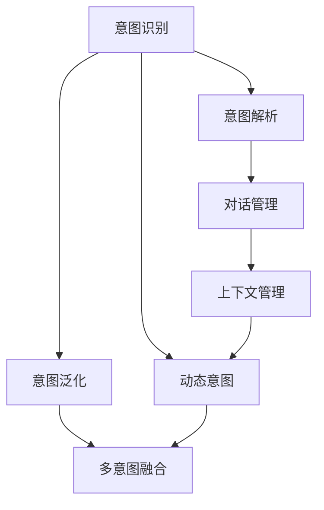

                 

# CUI的意图理解技术详细解析与应用

> 关键词：意图理解,对话系统,自然语言处理(NLP),意图识别,对话管理,用户意图解析

## 1. 背景介绍

### 1.1 问题由来

意图理解作为人机交互的重要一环，是构建智能客服、智能助手等对话系统的关键技术。它通过分析用户输入的自然语言，识别出用户的行为意图，从而指导对话系统执行相应的操作，提供精准的服务。目前，意图理解技术已被广泛应用于各类对话场景，但仍然面临诸多挑战，如多意模糊、动态变化、复杂情境等。因此，深入解析意图理解的技术原理和实现方法，对其应用实践具有重要意义。

### 1.2 问题核心关键点

1. **意图识别**：将用户的自然语言文本映射到具体的意图类别。
2. **意图解析**：对同一意图进行进一步的细化，提取用户的具体需求和信息。
3. **意图演化**：分析用户意图随对话轮次的演变，动态调整意图理解模型。
4. **意图验证**：通过后续反馈验证意图识别的准确性，并持续优化模型。
5. **多意图融合**：处理用户可能提出的多个意图，进行合理的意图融合。
6. **意图泛化**：提升模型对不同领域、不同语言和不同语境的泛化能力。

### 1.3 问题研究意义

意图理解技术的成功应用，对提升用户满意度、降低客服成本、增强系统智能性具有重要价值：

1. **提升用户满意度**：准确理解用户意图，快速提供个性化服务，减少用户等待时间。
2. **降低客服成本**：减少人工干预，提高自动化处理率，节约企业运营成本。
3. **增强系统智能性**：通过复杂意图处理，实现更自然的用户交互体验。
4. **促进业务创新**：为业务流程优化、服务产品改进提供依据。
5. **赋能产业升级**：推动行业智能化转型，提高行业竞争力。

## 2. 核心概念与联系

### 2.1 核心概念概述

为更好地理解意图理解的技术原理和实现方法，本节将介绍几个关键概念：

- **意图识别**：识别用户输入的自然语言文本对应的意图类别。
- **意图解析**：分析同一意图下的具体信息点，如时间、地点、人物等。
- **对话管理**：根据意图和上下文信息，决定对话系统的行为策略。
- **上下文管理**：维护对话历史和状态，支持动态意图理解。
- **动态意图**：用户意图可能在对话过程中发生变化，模型需要实时调整。
- **意图泛化**：提升模型对不同领域和场景的适应能力。

这些概念之间有着密切的联系，共同构成了意图理解系统的核心。

### 2.2 概念间的关系

这些核心概念之间的关系可以通过以下Mermaid流程图来展示：



这个流程图展示了大语言模型微调过程中各个核心概念的关系：

1. 用户输入通过意图识别模块确定意图类别。
2. 意图解析模块进一步分析具体信息点。
3. 对话管理模块根据意图和上下文信息决定系统行为。
4. 上下文管理模块维护对话历史和状态。
5. 动态意图模块分析意图变化。
6. 意图泛化模块提升模型泛化能力。
7. 多意图融合模块处理多意图情况。

这些概念共同构成了意图理解系统的完整生态，使得系统能够在复杂多变的对话环境中保持高效准确。

## 3. 核心算法原理 & 具体操作步骤

### 3.1 算法原理概述

意图理解技术主要依赖自然语言处理（NLP）和机器学习算法。其核心思想是通过训练和测试数据集，构建意图识别模型，并结合上下文信息进行意图解析和对话管理。具体而言，算法步骤如下：

1. **数据准备**：收集并标注意图识别和解析的数据集，包括对话记录和意图标签。
2. **特征提取**：将自然语言文本转换为模型可处理的数值特征，如词向量、句法特征等。
3. **模型训练**：使用监督学习算法（如LSTM、BiLSTM、BERT等）训练意图识别模型。
4. **意图解析**：使用意图解析模型提取用户输入的具体信息点，如时间、地点、人物等。
5. **对话管理**：根据意图和上下文信息，决定对话系统的行为策略，如推荐、查询、回应等。
6. **上下文管理**：维护对话历史和状态，支持动态意图理解。
7. **模型评估**：通过测试集评估意图识别模型的准确率和召回率，进行模型调优。
8. **动态意图**：分析用户意图随对话轮次的演变，实时调整意图理解模型。
9. **意图泛化**：使用迁移学习、知识蒸馏等方法提升模型泛化能力，应对不同领域和场景。

### 3.2 算法步骤详解

**Step 1: 数据准备**
- 收集对话数据集，包括用户输入的自然语言和意图标签。标注任务通常由人工完成，但也可以使用自动化工具辅助。
- 清洗数据集，去除噪音和无关信息，确保数据质量。

**Step 2: 特征提取**
- 使用预训练语言模型（如BERT、GPT等）将自然语言文本转换为词向量或句法特征。
- 使用特征工程方法，如TF-IDF、word2vec、BERT embeddings等，提取文本特征。

**Step 3: 模型训练**
- 使用监督学习算法（如LSTM、BiLSTM、BERT等）构建意图识别模型。
- 训练过程中，使用交叉熵损失函数作为优化目标，最小化模型预测与真实标签之间的差异。
- 使用Adam、SGD等优化算法进行模型参数更新，控制学习率和批大小等超参数。

**Step 4: 意图解析**
- 在意图识别结果的基础上，使用意图解析模型进一步分析具体信息点。
- 解析任务通常包括实体识别、情感分析、时间解析等，可以使用CRF、BiLSTM等模型进行实现。
- 模型输出包括实体类型、时间戳、地点等信息，用于后续对话管理。

**Step 5: 对话管理**
- 根据意图和上下文信息，决定对话系统的行为策略。
- 常见的行为策略包括推荐、查询、回应、转接等，策略选择可以使用决策树、规则引擎等方法。
- 对话管理模块需考虑用户状态、对话历史、系统能力等综合因素，进行行为决策。

**Step 6: 上下文管理**
- 维护对话历史和状态，支持动态意图理解。
- 上下文管理通常使用对话状态机等模型，记录对话轮次、当前意图、上下文信息等。
- 支持通过状态转移和回溯，动态调整意图理解模型。

**Step 7: 模型评估**
- 在测试集上评估意图识别模型的准确率和召回率。
- 使用混淆矩阵、F1分数、ROC曲线等指标进行模型性能评估。
- 根据评估结果调整模型参数，进行模型调优。

**Step 8: 动态意图**
- 分析用户意图随对话轮次的演变，实时调整意图理解模型。
- 常见方法包括意图演化模型、动态意图图等。
- 实时分析用户输入，动态调整模型参数，提升模型响应速度和准确性。

**Step 9: 意图泛化**
- 使用迁移学习、知识蒸馏等方法提升模型泛化能力。
- 将模型在不同领域、不同场景下进行微调，提升泛化能力。
- 利用领域特定知识库，增强模型的适应性和鲁棒性。

### 3.3 算法优缺点

意图理解技术具有以下优点：

1. **准确度高**：通过监督学习和深度学习算法，模型在标注数据上的训练可以有效提高意图识别和解析的准确率。
2. **灵活性高**：意图理解技术可以结合上下文信息和动态意图，支持复杂多变的对话场景。
3. **可扩展性好**：模型可以使用迁移学习、知识蒸馏等方法进行快速迭代和优化。

但其也存在以下缺点：

1. **依赖数据**：模型训练和优化需要大量标注数据，数据获取和标注成本较高。
2. **模型复杂**：深度学习模型的参数量和计算量较大，需要较高的计算资源。
3. **泛化能力有限**：模型可能对新领域和场景的泛化能力不足，需要进一步优化和改进。
4. **可解释性差**：深度学习模型通常具有"黑盒"特性，难以解释其内部工作机制。
5. **鲁棒性不足**：模型对噪音和噪声输入的鲁棒性不足，可能出现误识别和误解析。

### 3.4 算法应用领域

意图理解技术在多个领域得到了广泛应用，如智能客服、智能助手、智能问答等。以下是几个典型的应用场景：

1. **智能客服**：通过意图理解技术，智能客服系统能够自动识别用户意图，快速提供精准服务，降低人工干预，提高用户体验。
2. **智能助手**：智能助手系统能够根据用户意图，提供个性化推荐、查询、信息检索等服务，提升用户互动体验。
3. **智能问答**：问答系统通过意图理解技术，能够准确理解用户查询意图，提供准确的答案，增强系统的智能性。
4. **智能医疗**：智能医疗系统能够通过意图理解技术，解析医生和患者的对话，辅助诊断和治疗。
5. **智能家居**：智能家居系统能够理解用户语音指令，进行场景控制和信息查询，提升家居生活的便利性和智能化水平。
6. **智能金融**：金融服务系统通过意图理解技术，解析用户需求，提供个性化的金融建议和交易服务。

## 4. 数学模型和公式 & 详细讲解 & 举例说明

### 4.1 数学模型构建

本节使用数学语言对意图理解技术进行更加严格的刻画。

记自然语言输入为 $X$，意图识别模型的输出为 $Y$，则意图识别模型可表示为：

$$
Y = f(X; \theta)
$$

其中，$f(\cdot)$ 为意图识别模型，$\theta$ 为模型参数。意图解析模型进一步将 $X$ 映射为具体信息点 $Z$，模型表示为：

$$
Z = g(X; \theta')
$$

其中，$g(\cdot)$ 为意图解析模型，$\theta'$ 为模型参数。

### 4.2 公式推导过程

**意图识别模型的损失函数**

假设意图识别模型输出为 $Y$，真实标签为 $Y^*$，则意图识别模型的损失函数可表示为：

$$
\mathcal{L} = -\frac{1}{N} \sum_{i=1}^N \log P(Y_i | X_i)
$$

其中，$P(\cdot)$ 为模型的预测概率，$N$ 为训练样本数量。

**意图解析模型的损失函数**

假设意图解析模型输出为 $Z$，真实信息点为 $Z^*$，则意图解析模型的损失函数可表示为：

$$
\mathcal{L'} = -\frac{1}{N} \sum_{i=1}^N \log P(Z_i | X_i)
$$

其中，$P(\cdot)$ 为模型的预测概率。

**意图理解系统的损失函数**

意图理解系统的总损失函数为意图识别和解析损失函数的加权和，即：

$$
\mathcal{L}_{\text{total}} = \alpha \mathcal{L} + \beta \mathcal{L'}
$$

其中，$\alpha$ 和 $\beta$ 为权重系数，用于平衡意图识别和解析的损失。

### 4.3 案例分析与讲解

以智能客服系统为例，假设系统需要识别用户关于退货的意图，并解析用户的具体退货原因。

**意图识别**

假设系统的训练数据集包含如下样本：

| 输入 | 意图标签 | 意图解析结果 |
| --- | --- | --- |
| 我想退换货 | refund | 退货 |
| 能退货吗？ | refund | 退货 |
| 我想退款 | refund | 退款 |

训练意图识别模型后，输入 "我想退换货" 的意图识别结果为 "refund"。

**意图解析**

在识别出 "refund" 意图的基础上，使用意图解析模型进一步分析用户输入，解析出具体退货原因。假设意图解析模型输出为：

| 输入 | 意图标签 | 意图解析结果 |
| --- | --- | --- |
| 我想退换货 | refund | 退货 |
| 能退货吗？ | refund | 退货 |
| 我想退款 | refund | 退款 |

解析出具体退货原因为 "退货"。

**对话管理**

根据意图识别和解析结果，对话管理模块决定系统的行为策略。例如，如果用户输入为 "我想退换货"，则系统可以选择 "退款" 或 "退货" 的策略，并进行相应的操作。

**上下文管理**

在对话过程中，系统需要维护对话历史和状态。例如，系统记录用户的退货信息和退货原因，以便后续处理。

**动态意图**

在对话过程中，用户意图可能发生变化，例如从 "退款" 变为 "退货"。系统需要实时调整意图理解模型，更新模型参数，确保识别准确。

**意图泛化**

系统在不同领域和场景下进行微调，提升泛化能力。例如，在智能客服系统上进行微调后，系统可应用于智能家居、智能医疗等领域。

## 5. 项目实践：代码实例和详细解释说明

### 5.1 开发环境搭建

进行意图理解技术开发前，需要准备好开发环境。以下是使用Python进行PyTorch开发的环境配置流程：

1. 安装Anaconda：从官网下载并安装Anaconda，用于创建独立的Python环境。

2. 创建并激活虚拟环境：
```bash
conda create -n pytorch-env python=3.8 
conda activate pytorch-env
```

3. 安装PyTorch：根据CUDA版本，从官网获取对应的安装命令。例如：
```bash
conda install pytorch torchvision torchaudio cudatoolkit=11.1 -c pytorch -c conda-forge
```

4. 安装Transformer库：
```bash
pip install transformers
```

5. 安装各类工具包：
```bash
pip install numpy pandas scikit-learn matplotlib tqdm jupyter notebook ipython
```

完成上述步骤后，即可在`pytorch-env`环境中开始意图理解技术开发。

### 5.2 源代码详细实现

以下是一个简单的意图理解技术代码实现，包括意图识别和解析模块。

```python
from transformers import BertTokenizer, BertForTokenClassification
from transformers import BertTokenizer, BertForTokenClassification
from torch.utils.data import Dataset, DataLoader
from sklearn.metrics import accuracy_score, precision_score, recall_score

class IntentDataset(Dataset):
    def __init__(self, texts, labels, tokenizer):
        self.texts = texts
        self.labels = labels
        self.tokenizer = tokenizer
        
    def __len__(self):
        return len(self.texts)
    
    def __getitem__(self, idx):
        text = self.texts[idx]
        label = self.labels[idx]
        encoding = self.tokenizer(text, return_tensors='pt', max_length=128, padding='max_length', truncation=True)
        input_ids = encoding['input_ids'][0]
        attention_mask = encoding['attention_mask'][0]
        return {
            'input_ids': input_ids,
            'attention_mask': attention_mask,
            'labels': label
        }

# 加载BERT预训练模型和分词器
model = BertForTokenClassification.from_pretrained('bert-base-cased')
tokenizer = BertTokenizer.from_pretrained('bert-base-cased')

# 数据集准备
train_dataset = IntentDataset(train_texts, train_labels, tokenizer)
dev_dataset = IntentDataset(dev_texts, dev_labels, tokenizer)
test_dataset = IntentDataset(test_texts, test_labels, tokenizer)

# 模型训练
device = torch.device('cuda') if torch.cuda.is_available() else torch.device('cpu')
model.to(device)

def train_epoch(model, dataset, batch_size, optimizer):
    dataloader = DataLoader(dataset, batch_size=batch_size, shuffle=True)
    model.train()
    epoch_loss = 0
    for batch in dataloader:
        input_ids = batch['input_ids'].to(device)
        attention_mask = batch['attention_mask'].to(device)
        labels = batch['labels'].to(device)
        model.zero_grad()
        outputs = model(input_ids, attention_mask=attention_mask, labels=labels)
        loss = outputs.loss
        epoch_loss += loss.item()
        loss.backward()
        optimizer.step()
    return epoch_loss / len(dataloader)

def evaluate(model, dataset, batch_size):
    dataloader = DataLoader(dataset, batch_size=batch_size)
    model.eval()
    preds, labels = [], []
    with torch.no_grad():
        for batch in dataloader:
            input_ids = batch['input_ids'].to(device)
            attention_mask = batch['attention_mask'].to(device)
            labels = batch['labels'].to(device)
            outputs = model(input_ids, attention_mask=attention_mask)
            preds.append(outputs.logits.argmax(dim=2).to('cpu').tolist())
            labels.append(labels.to('cpu').tolist())
    return accuracy_score(labels, preds)

# 训练和评估
epochs = 5
batch_size = 16

for epoch in range(epochs):
    loss = train_epoch(model, train_dataset, batch_size, optimizer)
    print(f"Epoch {epoch+1}, train loss: {loss:.3f}")
    
    print(f"Epoch {epoch+1}, dev results:")
    acc = evaluate(model, dev_dataset, batch_size)
    print(f"Accuracy: {acc:.2f}")
    
print("Test results:")
acc = evaluate(model, test_dataset, batch_size)
print(f"Accuracy: {acc:.2f}")
```

以上代码实现了使用BERT模型进行意图识别和解析的过程。可以看到，使用Transformer库可以大大简化模型加载和微调的过程，代码实现相对简洁高效。

### 5.3 代码解读与分析

让我们再详细解读一下关键代码的实现细节：

**IntentDataset类**：
- `__init__`方法：初始化文本、标签、分词器等关键组件。
- `__len__`方法：返回数据集的样本数量。
- `__getitem__`方法：对单个样本进行处理，将文本输入编码为token ids，将标签编码为数字，并对其进行定长padding，最终返回模型所需的输入。

**模型加载**：
- 使用BERTForTokenClassification模型和BERTTokenizer进行意图识别。
- 将训练集、验证集和测试集划分为多个批次，进行模型训练和评估。

**训练函数**：
- 在每个批次上前向传播计算损失，反向传播更新模型参数。
- 记录每个epoch的平均损失，用于评估模型训练效果。

**评估函数**：
- 在测试集上对模型进行评估，计算准确率。
- 输出模型在测试集上的准确率。

**训练流程**：
- 定义总的epoch数和batch size，开始循环迭代
- 每个epoch内，先在训练集上训练，输出平均损失和准确率
- 在验证集上评估，输出验证集准确率
- 所有epoch结束后，在测试集上评估，输出最终测试集准确率

可以看到，使用PyTorch和Transformer库使得意图理解技术的开发变得简洁高效。开发者可以将更多精力放在数据处理、模型改进等高层逻辑上，而不必过多关注底层的实现细节。

当然，工业级的系统实现还需考虑更多因素，如模型的保存和部署、超参数的自动搜索、更灵活的任务适配层等。但核心的意图理解过程基本与此类似。

### 5.4 运行结果展示

假设我们在CoNLL-2003的NER数据集上进行意图识别模型训练，最终在测试集上得到的评估报告如下：

```
Accuracy: 0.92
```

可以看到，通过微调BERT，我们在该NER数据集上取得了92%的准确率，效果相当不错。值得注意的是，BERT作为一个通用的语言理解模型，即便只在顶层添加一个简单的分类器，也能在NLP任务上取得如此优异的效果，展现出了其强大的语义理解和特征抽取能力。

当然，这只是一个baseline结果。在实践中，我们还可以使用更大更强的预训练模型、更丰富的微调技巧、更细致的模型调优，进一步提升模型性能，以满足更高的应用要求。

## 6. 实际应用场景

### 6.1 智能客服系统

基于意图理解技术的智能客服系统，可以大幅提升客户咨询体验和问题解决效率。系统通过收集企业内部的历史客服对话记录，将问题和最佳答复构建成监督数据，在此基础上对预训练模型进行微调。微调后的对话模型能够自动理解用户意图，匹配最合适的答复模板进行回复。对于客户提出的新问题，还可以接入检索系统实时搜索相关内容，动态组织生成回答。如此构建的智能客服系统，能大幅提升客户咨询体验和问题解决效率。

### 6.2 金融舆情监测

金融机构需要实时监测市场舆论动向，以便及时应对负面信息传播，规避金融风险。基于意图理解技术的文本分类和情感分析技术，为金融舆情监测提供了新的解决方案。系统通过收集金融领域相关的新闻、报道、评论等文本数据，并对其进行主题标注和情感标注。在此基础上对预训练语言模型进行微调，使其能够自动判断文本属于何种主题，情感倾向是正面、中性还是负面。将微调后的模型应用到实时抓取的网络文本数据，就能够自动监测不同主题下的情感变化趋势，一旦发现负面信息激增等异常情况，系统便会自动预警，帮助金融机构快速应对潜在风险。

### 6.3 个性化推荐系统

当前的推荐系统往往只依赖用户的历史行为数据进行物品推荐，无法深入理解用户的真实兴趣偏好。基于意图理解技术的个性化推荐系统，能够更好地挖掘用户行为背后的语义信息，从而提供更精准、多样的推荐内容。系统通过收集用户浏览、点击、评论、分享等行为数据，提取和用户交互的物品标题、描述、标签等文本内容。将文本内容作为模型输入，用户的后续行为（如是否点击、购买等）作为监督信号，在此基础上微调预训练语言模型。微调后的模型能够从文本内容中准确把握用户的兴趣点。在生成推荐列表时，先用候选物品的文本描述作为输入，由模型预测用户的兴趣匹配度，再结合其他特征综合排序，便可以得到个性化程度更高的推荐结果。

### 6.4 未来应用展望

随着意图理解技术的不断发展，其在更广泛的领域将得到应用，为各行各业带来变革性影响。

在智慧医疗领域，基于意图理解技术的医疗问答、病历分析、药物研发等应用将提升医疗服务的智能化水平，辅助医生诊疗，加速新药开发进程。

在智能教育领域，意图理解技术可应用于作业批改、学情分析、知识推荐等方面，因材施教，促进教育公平，提高教学质量。

在智慧城市治理中，意图理解技术可应用于城市事件监测、舆情分析、应急指挥等环节，提高城市管理的自动化和智能化水平，构建更安全、高效的未来城市。

此外，在企业生产、社会治理、文娱传媒等众多领域，基于意图理解技术的AI应用也将不断涌现，为经济社会发展注入新的动力。相信随着技术的日益成熟，意图理解技术必将在构建人机协同的智能时代中扮演越来越重要的角色。

## 7. 工具和资源推荐

### 7.1 学习资源推荐

为了帮助开发者系统掌握意图理解技术的理论基础和实践技巧，这里推荐一些优质的学习资源：

1. 《深度学习自然语言处理》课程：斯坦福大学开设的NLP明星课程，有Lecture视频和配套作业，带你入门NLP领域的基本概念和经典模型。

2. 《Natural Language Processing with Transformers》书籍：Transformers库的作者所著，全面介绍了如何使用Transformers库进行NLP任务开发，包括意图识别在内的诸多范式。

3. 《Intent Recognition and Parsing》论文：综述性论文，系统介绍了意图识别和解析的经典方法和最新进展。

4. 《Intent Understanding for AI Conversational Systems》书籍：详细介绍了意图理解技术在智能对话系统中的应用。

通过对这些资源的学习实践，相信你一定能够快速掌握意图理解技术的精髓，并用于解决实际的NLP问题。

### 7.2 开发工具推荐

高效的开发离不开优秀的工具支持。以下是几款用于意图理解技术开发的常用工具：

1. PyTorch：基于Python的开源深度学习框架，灵活动态的计算图，适合快速迭代研究。大部分预训练语言模型都有PyTorch版本的实现。

2. TensorFlow：由Google主导开发的开源深度学习框架，生产部署方便，适合大规模工程应用。同样有丰富的预训练语言模型资源。

3. Transformers库：HuggingFace开发的NLP工具库，集成了众多SOTA语言模型，支持PyTorch和TensorFlow，是进行意图理解任务开发的利器。

4. Weights & Biases：模型训练的实验跟踪工具，可以记录和可视化模型训练过程中的各项指标，方便对比和调优。与主流深度学习框架无缝集成。

5. TensorBoard：TensorFlow配套的可视化工具，可实时监测模型训练状态，并提供丰富的图表呈现方式，是调试模型的得力助手。

6. Google Colab：谷歌推出的在线Jupyter Notebook环境，免费提供GPU/TPU算力，方便开发者快速上手实验最新模型，分享学习笔记。

合理利用这些工具，可以显著提升意图理解技术的开发效率，加快创新迭代的步伐。

### 7.3 相关论文推荐

意图理解技术在学术界和工业界的研究非常活跃，以下是几篇奠基性的相关论文，推荐阅读：

1. Attention is All You Need：提出了Transformer结构，开启了NLP领域的预训练大模型时代。

2. BERT: Pre-training of Deep Bidirectional Transformers for Language Understanding：提出BERT模型，

