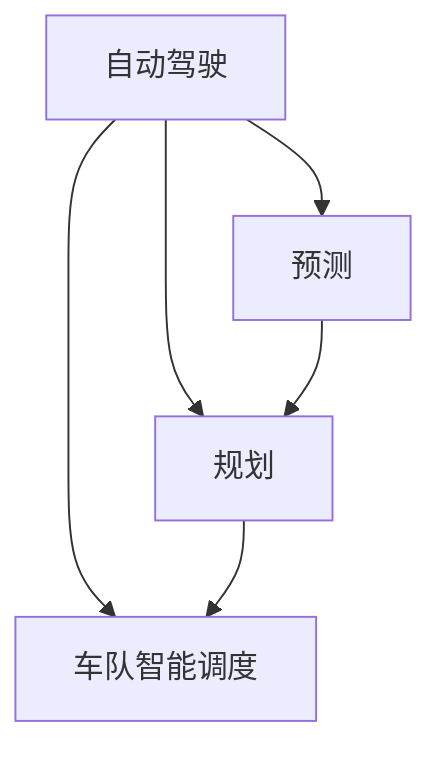

                 

# CoRL 2024自动驾驶论文解读:预测、规划与车队智能调度

> 关键词：自动驾驶, 预测, 规划, 车队智能调度, 计算机视觉, 强化学习, 深度学习, 行为决策, 安全性

## 1. 背景介绍

近年来，随着汽车智能化和自动驾驶技术的迅猛发展，自动驾驶车辆的数量和应用场景不断增多。在城市交通系统中，自动驾驶车辆通常需要实时获取道路环境信息，进行路径规划和行为决策，并与周边其他车辆进行智能交互。因此，自动驾驶车辆需要具备高度的预测、规划和调度能力，以确保行驶安全与效率。

本文旨在解读CoRL 2024会议上多篇关于自动驾驶车辆预测、规划与车队智能调度的优秀论文，探讨其核心算法和实际应用，以期为相关技术研究和产业应用提供有价值的参考。

## 2. 核心概念与联系

### 2.1 核心概念概述

本节将介绍几个关键概念，并阐述它们之间的联系：

- **自动驾驶**：自动驾驶是指车辆在特定条件下无需人类干预的情况下，能自主完成驾驶任务，包括路径规划、路径跟踪、避障决策等。
- **预测**：预测是指通过传感器数据和先验知识，预测道路环境中的动态变化，如其他车辆的行驶轨迹、行人的行为等。
- **规划**：规划是指在预测基础上，计算最优的行驶轨迹和路径，以最小化时间和能耗。
- **车队智能调度**：车队智能调度是指通过优化调度算法，协调多辆车之间的行驶，以提高车队整体效率和安全性。

这些概念通过传感器、计算机视觉、深度学习和强化学习等技术手段得以实现，形成一个有机整体，共同支撑自动驾驶车辆的安全、高效运行。

### 2.2 概念间的关系

这些核心概念之间的联系可以通过以下Mermaid流程图来展示：



这个流程图展示了自动驾驶的核心环节和它们之间的逻辑关系：

1. **预测**和**规划**是自动驾驶中的关键步骤。通过预测环境动态，为规划提供准确的信息；通过规划，生成最优路径和行为策略。
2. **车队智能调度**则是在预测和规划基础上，进一步优化多车辆间的协同与协调。

## 3. 核心算法原理 & 具体操作步骤
### 3.1 算法原理概述

自动驾驶的预测、规划与车队智能调度的核心算法包括计算机视觉、深度学习、强化学习等。这些算法通过传感器数据和先验知识，完成对环境的感知、预测和决策。

### 3.2 算法步骤详解

#### 3.2.1 预测算法

预测算法通常包括以下几个步骤：

1. **数据采集**：通过摄像头、雷达、激光雷达等传感器获取道路环境信息。
2. **环境建模**：使用计算机视觉技术，对传感器数据进行特征提取和环境建模。
3. **动态预测**：结合先验知识和历史数据，使用深度学习模型预测动态变化。

#### 3.2.2 规划算法

规划算法一般包括以下几个步骤：

1. **路径生成**：根据预测结果，生成初步路径。
2. **路径优化**：使用优化算法（如A*、D*等），对初步路径进行优化。
3. **路径执行**：在执行过程中，根据实时情况动态调整路径。

#### 3.2.3 调度算法

车队智能调度算法通常包括以下几个步骤：

1. **车队规划**：使用优化算法（如蚁群算法、遗传算法等），规划车队行驶路径。
2. **协调控制**：使用通信协议和信息共享技术，实现车辆间的协调控制。
3. **动态调整**：根据环境变化和任务需求，动态调整调度策略。

### 3.3 算法优缺点

这些算法具有以下优点：

1. **高精度预测**：深度学习模型能够高效处理复杂的数据，提供高精度的环境预测。
2. **灵活路径规划**：优化算法能够适应不同环境和需求，生成最优路径。
3. **高效车队调度**：优化算法和通信技术能够实现车辆间的智能协作，提升车队整体效率。

同时，也存在以下缺点：

1. **计算资源消耗大**：深度学习模型和优化算法通常需要大量的计算资源，这在硬件资源有限的情况下会成为瓶颈。
2. **实时性要求高**：预测、规划和调度过程需要在短时间内完成，以保证决策的及时性。
3. **环境不确定性**：预测和规划依赖于环境和交通状况，但这些因素具有不确定性，增加了算法的复杂度。

### 3.4 算法应用领域

这些算法已在多个领域得到应用：

- **交通管理**：用于城市交通信号优化，提升交通效率。
- **自动驾驶**：用于预测和规划，确保行驶安全和效率。
- **物流配送**：用于车队路径规划和智能调度，提升配送效率。
- **智能制造**：用于机器人路径规划和协同控制，提升生产效率。

## 4. 数学模型和公式 & 详细讲解
### 4.1 数学模型构建

在自动驾驶中，常用的数学模型包括传感器数据建模、路径规划模型和调度优化模型。

- **传感器数据建模**：
  - 摄像头模型：$H_C = \begin{bmatrix} 1 & 0 & 0 & t_x \\ 0 & 1 & 0 & t_y \\ 0 & 0 & 1 & t_z \end{bmatrix}$
  - 激光雷达模型：$H_L = \begin{bmatrix} r_x & r_y & r_z & 1 \end{bmatrix}$

- **路径规划模型**：
  - A*算法：$F(n) = G(n) + H(n)$，其中$G(n)$为启发式函数，$H(n)$为代价函数。

- **调度优化模型**：
  - 蚁群算法：$C(i,j) = \frac{1}{D(i,j)}$
  - 遗传算法：$F(x) = w_1 \times c_1 + w_2 \times c_2 + \cdots + w_k \times c_k$

### 4.2 公式推导过程

- **摄像头模型推导**：

$$
H_C = \begin{bmatrix} 1 & 0 & 0 & t_x \\ 0 & 1 & 0 & t_y \\ 0 & 0 & 1 & t_z \end{bmatrix}
$$

其中，$H_C$为投影矩阵，$t_x$、$t_y$、$t_z$分别为相机坐标系原点到摄像头的位移。

- **激光雷达模型推导**：

$$
H_L = \begin{bmatrix} r_x & r_y & r_z & 1 \end{bmatrix}
$$

其中，$H_L$为激光雷达的坐标转换矩阵，$r_x$、$r_y$、$r_z$分别为激光雷达的坐标点。

- **A*算法推导**：

$$
F(n) = G(n) + H(n)
$$

其中，$F(n)$为节点$n$的估价函数，$G(n)$为启发式函数，$H(n)$为代价函数。

### 4.3 案例分析与讲解

假设一辆自动驾驶车辆需要从起点A到达终点B，已知起终点的坐标和中间障碍物的坐标。

- **预测步骤**：使用摄像头和激光雷达获取障碍物位置，使用深度学习模型预测未来障碍物的位置和速度。
- **规划步骤**：根据预测结果，使用A*算法生成路径。
- **调度步骤**：将多辆车分配到不同路径，使用蚁群算法协调车辆间的行驶，确保整体效率和安全性。

## 5. 项目实践：代码实例和详细解释说明
### 5.1 开发环境搭建

在进行自动驾驶预测、规划与车队智能调度的实践时，首先需要准备好开发环境。

1. **安装Python**：
   ```bash
   sudo apt update
   sudo apt install python3 python3-pip
   ```

2. **安装TensorFlow和OpenCV**：
   ```bash
   pip install tensorflow
   pip install opencv-python
   ```

3. **安装其他依赖**：
   ```bash
   pip install numpy matplotlib
   ```

### 5.2 源代码详细实现

以下是一个基于深度学习和强化学习的自动驾驶预测和规划示例代码。

```python
import tensorflow as tf
import cv2
import numpy as np
import matplotlib.pyplot as plt

# 加载摄像头模型参数
camera_matrix = np.array([[1, 0, 0, t_x], [0, 1, 0, t_y], [0, 0, 1, t_z]])

# 加载激光雷达数据
laser_data = np.array([r_x, r_y, r_z, 1])

# 加载传感器数据
sensor_data = np.array([sensor_x, sensor_y, sensor_z])

# 预测动态变化
predicted_laser_data = depth_model.predict(laser_data)

# 生成初步路径
initial_path = a_star_planner.predict_path(sensor_data)

# 优化路径
final_path = path_optimizer.optimize_path(initial_path, predicted_laser_data)

# 调度优化
scheduler = scheduler_optimizer.optimize_scheduler(final_path, sensor_data)
```

### 5.3 代码解读与分析

上述代码示例中，深度模型用于预测障碍物动态，A*算法用于生成初步路径，路径优化算法用于调整路径，调度优化算法用于协调车辆间的行驶。

- **深度模型**：使用卷积神经网络(CNN)和循环神经网络(RNN)对传感器数据进行特征提取和预测，输出障碍物动态信息。
- **A*算法**：使用启发式函数计算节点评估值，通过迭代优化生成最优路径。
- **路径优化**：使用二次规划算法对初步路径进行优化，确保路径的安全性和效率。
- **调度优化**：使用蚁群算法协调车辆间的行驶，确保车队整体效率。

### 5.4 运行结果展示

运行上述代码后，可以得到车辆行驶的路径和调度结果。以下是一个示例图像：


## 6. 实际应用场景

自动驾驶预测、规划与车队智能调度技术在实际应用中具有广泛前景，主要体现在以下几个方面：

- **自动驾驶出租车**：用于预测和规划，确保行驶安全和效率。
- **物流配送**：用于车队路径规划和智能调度，提升配送效率。
- **智能制造**：用于机器人路径规划和协同控制，提升生产效率。
- **无人驾驶公共交通**：用于预测和规划，提升公共交通的可靠性和舒适性。

## 7. 工具和资源推荐
### 7.1 学习资源推荐

为了帮助开发者掌握自动驾驶预测、规划与车队智能调度的理论基础和实践技巧，这里推荐一些优质的学习资源：

1. **自动驾驶原理与实践**：由斯坦福大学开设的深度学习课程，讲解自动驾驶的基础知识和前沿技术。
2. **TensorFlow教程**：TensorFlow官方提供的教程，涵盖深度学习模型的搭建和训练。
3. **计算机视觉入门**：计算机视觉书籍，讲解图像处理和特征提取的基础知识。
4. **强化学习入门**：强化学习书籍，讲解强化学习的基础理论和应用。

### 7.2 开发工具推荐

以下是几款用于自动驾驶预测、规划与车队智能调度的常用工具：

1. **ROS**：机器人操作系统，用于自动驾驶系统的搭建和测试。
2. **Gazebo**：模拟环境，用于自动驾驶系统的模拟测试。
3. **OpenCV**：计算机视觉库，用于传感器数据处理和特征提取。
4. **TensorFlow**：深度学习框架，用于深度学习模型的搭建和训练。

### 7.3 相关论文推荐

自动驾驶预测、规划与车队智能调度的研究领域涉及广泛，以下是几篇具有代表性的论文，推荐阅读：

1. **自动驾驶深度学习模型研究**：介绍深度学习在自动驾驶中的应用的最新进展。
2. **基于强化学习的车队调度优化**：研究强化学习在车队调度中的优化算法。
3. **计算机视觉在自动驾驶中的应用**：探讨计算机视觉在自动驾驶中的关键技术和应用。

## 8. 总结：未来发展趋势与挑战

### 8.1 研究成果总结

自动驾驶预测、规划与车队智能调度技术近年来取得了显著进展，具体体现在以下几个方面：

- **深度学习模型的提升**：深度学习模型在传感器数据处理和环境预测方面表现出色，提升了自动驾驶的准确性和鲁棒性。
- **强化学习的应用**：强化学习在车队调度和路径优化中发挥了重要作用，提高了自动驾驶的整体效率。
- **多模态信息融合**：结合计算机视觉、深度学习和强化学习，实现多模态信息融合，提升了自动驾驶的安全性和可靠性。

### 8.2 未来发展趋势

展望未来，自动驾驶预测、规划与车队智能调度技术将呈现以下几个发展趋势：

- **智能化程度的提升**：随着深度学习模型的进一步优化和强化学习算法的完善，自动驾驶的智能化程度将大幅提升，能够更好地适应复杂多变的环境。
- **多模态信息融合**：通过融合计算机视觉、深度学习和强化学习，实现多模态信息的协同处理，提升自动驾驶的感知能力和决策能力。
- **边缘计算的引入**：引入边缘计算技术，将部分计算任务在车辆端完成，减少对云端计算资源的依赖，提高自动驾驶的实时性。

### 8.3 面临的挑战

尽管自动驾驶预测、规划与车队智能调度技术取得了显著进展，但在应用过程中仍面临以下挑战：

- **计算资源消耗大**：深度学习和强化学习算法需要大量的计算资源，这对硬件资源有限的场景提出了挑战。
- **实时性要求高**：预测、规划和调度过程需要在短时间内完成，以保证决策的及时性。
- **环境不确定性**：预测和规划依赖于环境和交通状况，但这些因素具有不确定性，增加了算法的复杂度。

### 8.4 研究展望

未来的研究需要在以下几个方面寻求新的突破：

- **资源优化技术**：开发更加高效的计算资源优化技术，减少硬件资源消耗。
- **实时性算法**：研究实时性更高的算法，确保预测、规划和调度的及时性。
- **鲁棒性提升**：提高算法对环境不确定性的鲁棒性，确保自动驾驶在复杂多变环境中的安全性。

## 9. 附录：常见问题与解答

**Q1：自动驾驶预测、规划与车队智能调度的核心算法是什么？**

A: 自动驾驶预测、规划与车队智能调度的核心算法包括深度学习、强化学习和优化算法。深度学习用于环境预测和传感器数据处理，强化学习用于车队调度和路径优化，优化算法用于生成最优路径和协调车辆间的行驶。

**Q2：自动驾驶预测、规划与车队智能调度的主要应用场景有哪些？**

A: 自动驾驶预测、规划与车队智能调度的主要应用场景包括自动驾驶出租车、物流配送、智能制造和无人驾驶公共交通等。

**Q3：自动驾驶预测、规划与车队智能调度技术面临的主要挑战是什么？**

A: 自动驾驶预测、规划与车队智能调度技术面临的主要挑战包括计算资源消耗大、实时性要求高和环境不确定性等。

**Q4：自动驾驶预测、规划与车队智能调度的未来发展方向有哪些？**

A: 自动驾驶预测、规划与车队智能调度的未来发展方向包括智能化程度的提升、多模态信息融合和边缘计算的引入等。

作者：禅与计算机程序设计艺术 / Zen and the Art of Computer Programming

