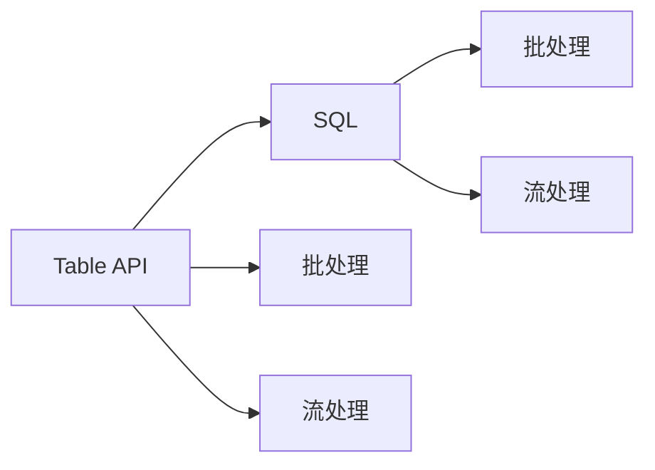

                 

# Flink Table API和SQL原理与代码实例讲解

## 1. 背景介绍

在分布式计算和数据处理领域，Apache Flink 已经成为了一个非常流行的开源流处理框架，其支持基于内存的计算模型，提供了高性能、低延迟的数据处理能力。Flink Table API 和 SQL 是 Flink 在数据处理领域的两个重要扩展，它们使得使用 Flink 进行数据处理变得更加简便、直观，尤其适合于那些有 SQL 经验的用户。本文章将详细讲解 Flink Table API 和 SQL 的原理、使用方法和具体示例，帮助读者深入理解和使用这两个强大的工具。

## 2. 核心概念与联系

### 2.1 核心概念概述

为了更好地理解 Flink Table API 和 SQL，首先需要明确几个关键的概念：

- **Flink**：一个开源的流处理框架，支持实时数据处理、批处理和分布式计算。
- **Table API**：Flink 提供的一个用于处理结构化数据的操作接口，类似于 Hive、Spark SQL。
- **SQL**：一种用于处理关系数据库的标准查询语言，支持复杂的数据查询和统计。
- **批处理**：对数据进行一次性全量处理的方式。
- **流处理**：对数据进行连续处理的方式，可以实时地处理数据流。

### 2.2 核心概念之间的关系

Flink Table API 和 SQL 作为 Flink 的两个重要扩展，在数据处理领域中扮演了不同的角色。Table API 主要用于批处理和流处理中的结构化数据操作，支持使用类 SQL 的语法进行操作，而 SQL 则主要用于查询和分析结构化数据。两者之间的联系在于它们都是基于内存计算的，都支持分布式处理，都能够在不同的分布式环境下运行。

以下是 Flink Table API 和 SQL 之间的关系图：



这个关系图展示了 Table API 和 SQL 分别在批处理和流处理中的作用，以及它们之间的互相支持和应用场景。

## 3. 核心算法原理 & 具体操作步骤

### 3.1 算法原理概述

Flink Table API 和 SQL 的算法原理主要基于内存计算和分布式计算。它们都是基于内存的计算模型，能够利用内存中的数据进行快速的处理和计算，同时支持分布式处理，能够在多台计算机上进行并行计算，以提高处理效率。

### 3.2 算法步骤详解

使用 Flink Table API 和 SQL 进行数据处理的基本步骤如下：

1. **数据源**：将数据源连接到 Flink 中，可以是各种类型的数据源，如文件、数据库、Kafka、WebSocket 等。

2. **数据转换**：对数据进行处理和转换，可以使用 Table API 中的操作或者 SQL 语句。

3. **数据存储**：将处理后的数据进行存储，可以使用 Table API 中的操作或者 SQL 语句。

4. **数据汇总**：对数据进行汇总、聚合等操作，可以使用 Table API 中的操作或者 SQL 语句。

5. **数据输出**：将处理后的数据输出到不同的目的地，如文件、数据库、Kafka 等。

### 3.3 算法优缺点

Flink Table API 和 SQL 的优点在于其简单易用、支持 SQL 语法、分布式处理能力强、内存计算效率高。它们的缺点在于对于大规模数据处理，内存占用较高，对于复杂的计算任务，可能需要对算法进行优化。

### 3.4 算法应用领域

Flink Table API 和 SQL 广泛应用于各种数据处理场景，如数据清洗、数据转换、数据分析、数据挖掘等。它们可以在大数据平台、流数据处理、实时计算、离线批处理等领域进行使用。

## 4. 数学模型和公式 & 详细讲解 & 举例说明

### 4.1 数学模型构建

在 Flink Table API 和 SQL 中，数学模型主要用于数据聚合、统计等操作。以下是一些常见的数学模型：

- 均值（Mean）：$\mu = \frac{\sum_{i=1}^n x_i}{n}$
- 方差（Variance）：$\sigma^2 = \frac{\sum_{i=1}^n (x_i - \mu)^2}{n}$
- 标准差（Standard Deviation）：$\sigma = \sqrt{\sigma^2}$
- 最大值（Max）：$\max(x_i) = x_{i_{max}}$
- 最小值（Min）：$\min(x_i) = x_{i_{min}}$

### 4.2 公式推导过程

以均值计算为例，其推导过程如下：

$$
\mu = \frac{\sum_{i=1}^n x_i}{n} = \frac{\sum_{i=1}^n \sum_{j=1}^n x_{i,j}}{n \times N}
$$

其中，$x_{i,j}$ 表示第 $i$ 行第 $j$ 列的值。

### 4.3 案例分析与讲解

以一个简单的例子来说明如何利用 Flink Table API 和 SQL 进行数据处理：

假设有一个表 `orders`，包含订单信息，每个订单包含订单号 `order_id`、客户名 `customer`、订单金额 `amount` 等字段。现在需要计算每个客户的订单总额。

使用 Table API 的伪代码如下：

```python
orders = StreamTableEnvironment().from_path("orders")
customer_orders = orders.group_by("customer").select("customer", "amount").sum()
```

使用 SQL 的伪代码如下：

```sql
SELECT customer, SUM(amount) AS total_amount
FROM orders
GROUP BY customer
```

最终，Table API 和 SQL 都可以得到每个客户的订单总额。

## 5. 项目实践：代码实例和详细解释说明

### 5.1 开发环境搭建

使用 Flink Table API 和 SQL 进行数据处理，需要先搭建一个 Flink 环境。这里给出一种简单的搭建方法：

1. 安装 Java 8 或更高版本。
2. 下载并安装 Flink 的发行版。
3. 配置环境变量，将 Flink 的 bin 目录添加到系统的 PATH 变量中。
4. 在本地运行 Flink 的 Web UI，验证环境配置是否正确。

### 5.2 源代码详细实现

以下是使用 Flink Table API 进行数据处理的示例代码：

```python
from pyflink.table import StreamTableEnvironment, DataTypes
from pyflink.table.descriptors import Schema, CSV, FlinkKafkaConsumer, FlinkKafkaProducer

# 创建 Flink 环境
env = StreamTableEnvironment.create(environment)

# 定义表 schema
schema = Schema() \
    .field("order_id", DataTypes.BIGINT()) \
    .field("customer", DataTypes.STRING()) \
    .field("amount", DataTypes.DOUBLE())

# 连接数据源
orders = env.connect(FlinkKafkaConsumer('orders', schema)) \
    .with_format(CSV().separator(',')) \
    .with('order_id', 'amount')

# 计算每个客户的订单总额
customer_orders = orders \
    .group_by("customer") \
    .select("customer", "SUM(amount) AS total_amount")

# 将结果输出到 Kafka
producer = FlinkKafkaProducer('orders-output', schema, 'orders')
customer_orders.execute_sql("INSERT INTO orders-output (customer, total_amount) VALUES (?, ?)")

# 关闭环境
env.close()
```

以下是使用 SQL 进行数据处理的示例代码：

```sql
-- 创建 Flink 环境
CREATE TABLE orders (
    order_id BIGINT,
    customer STRING,
    amount DOUBLE
)

-- 连接数据源
FROM FlinkKafkaConsumer('orders', 'order_id', 'amount', ',')

-- 计算每个客户的订单总额
SELECT customer, SUM(amount) AS total_amount
GROUP BY customer

-- 将结果输出到 Kafka
INSERT INTO orders-output
SELECT customer, total_amount
```

### 5.3 代码解读与分析

使用 Flink Table API 和 SQL 进行数据处理的基本思路是：连接数据源 -> 数据转换 -> 数据汇总 -> 数据输出。在数据转换和汇总阶段，可以使用 Table API 中的操作或 SQL 语句进行。在数据输出阶段，可以将结果输出到各种目的地，如文件、数据库、Kafka 等。

### 5.4 运行结果展示

在实际运行中，可以使用 Flink 提供的 Web UI 来查看数据处理的结果。在 Web UI 中，可以查看每个订单的详细信息，以及每个客户的订单总额。

## 6. 实际应用场景

### 6.1 金融数据分析

在金融领域，Flink Table API 和 SQL 可以用于实时计算和分析金融数据，如股票交易、交易记录、风险管理等。

### 6.2 互联网数据处理

在互联网领域，Flink Table API 和 SQL 可以用于实时处理和分析用户行为数据，如网站流量、用户行为、广告点击等。

### 6.3 智能交通系统

在智能交通领域，Flink Table API 和 SQL 可以用于实时处理和分析交通数据，如车辆位置、路况、交通流量等。

### 6.4 未来应用展望

随着大数据和流处理技术的不断发展，Flink Table API 和 SQL 将会在更多领域得到应用，如物联网、智能制造、智能家居等。未来，Flink Table API 和 SQL 将会与更多的技术结合，提供更加智能、高效、安全的数据处理解决方案。

## 7. 工具和资源推荐

### 7.1 学习资源推荐

1. Flink 官方文档：Flink 提供了详细的官方文档，包括 Table API 和 SQL 的用法和示例。
2. Flink 入门教程：在 Flink 的官网上，有很多入门教程和案例，可以帮助初学者快速上手。
3. Hadoop 和 Spark 入门教程：Flink Table API 和 SQL 与 Hadoop、Spark 有很多相似之处，学习这些技术的入门教程，有助于快速掌握 Flink Table API 和 SQL。

### 7.2 开发工具推荐

1. PyFlink：PyFlink 是 Flink 的 Python API，可以用于开发和测试 Flink 应用。
2. Apache Beam：Apache Beam 是 Flink 的 Java 和 Python 实现，支持更广泛的编程语言和数据源。
3. Apache Kafka：Kafka 是一个分布式消息系统，支持 Flink 数据源和数据输出。

### 7.3 相关论文推荐

1. "Apache Flink: Cost-Effective Stream and Batch Processing"（Flink 的原理和设计）
2. "Flink SQL: A Powerful, Easy-to-Use SQL API for Flink"（Flink SQL 的原理和应用）
3. "Table API for Flink: Lightweight, Distributed, and Programming Language-Agnostic Table Processing"（Flink Table API 的原理和应用）

## 8. 总结：未来发展趋势与挑战

### 8.1 研究成果总结

Flink Table API 和 SQL 自推出以来，在数据处理领域得到了广泛的应用，帮助用户更高效地处理和分析数据。未来，Flink Table API 和 SQL 将会与更多的技术结合，提供更加智能、高效、安全的数据处理解决方案。

### 8.2 未来发展趋势

1. 支持更多数据源和数据格式：Flink Table API 和 SQL 将会支持更多数据源和数据格式，如 JSON、CSV、Parquet 等。
2. 支持更多编程语言：Flink Table API 和 SQL 将会支持更多的编程语言，如 Python、Java、Scala 等。
3. 支持更多流处理操作：Flink Table API 和 SQL 将会支持更多的流处理操作，如窗口操作、时间窗口、水平方向操作等。

### 8.3 面临的挑战

1. 性能优化：对于大规模数据处理，内存占用较高，需要优化算法和内存使用。
2. 数据一致性：在大规模数据处理中，需要保证数据的一致性和正确性，避免数据丢失和错误。
3. 系统可靠性：在大规模数据处理中，需要保证系统的可靠性和稳定性，避免单点故障和数据丢失。

### 8.4 研究展望

未来，Flink Table API 和 SQL 将会进一步发展，支持更多功能和技术，如机器学习、图处理、时序数据等。同时，Flink 社区和用户将会不断探索和改进，使得 Flink Table API 和 SQL 在更多的应用场景中发挥作用，帮助用户更高效地处理和分析数据。

## 9. 附录：常见问题与解答

**Q1: Flink Table API 和 SQL 的区别是什么？**

A: Flink Table API 和 SQL 都是用于处理结构化数据的操作接口，但 Table API 更偏向于程序化和编程语言，SQL 更偏向于查询语言和数据分析。Table API 支持更多的编程语言和编程方式，而 SQL 更适合处理数据查询和统计。

**Q2: Flink Table API 和 SQL 在数据处理中的优势是什么？**

A: Flink Table API 和 SQL 在数据处理中的优势在于其简单易用、支持 SQL 语法、分布式处理能力强、内存计算效率高。它们能够处理大规模数据，支持实时计算和批处理，能够提高数据处理效率和准确性。

**Q3: 如何使用 Flink Table API 和 SQL 进行数据聚合？**

A: 使用 Flink Table API 和 SQL 进行数据聚合，可以使用 aggregate 函数或 group by 语句。例如，可以使用以下 SQL 语句进行数据聚合：

```sql
SELECT customer, SUM(amount) AS total_amount
FROM orders
GROUP BY customer
```

使用 Table API 的伪代码如下：

```python
orders = StreamTableEnvironment().from_path("orders")
customer_orders = orders.group_by("customer").select("customer", "amount").sum()
```

**Q4: 如何使用 Flink Table API 和 SQL 进行数据过滤？**

A: 使用 Flink Table API 和 SQL 进行数据过滤，可以使用 filter 函数或 where 语句。例如，可以使用以下 SQL 语句进行数据过滤：

```sql
SELECT customer, amount
FROM orders
WHERE amount > 1000
```

使用 Table API 的伪代码如下：

```python
orders = StreamTableEnvironment().from_path("orders")
filtered_orders = orders.filter("amount > 1000")
```

**Q5: 如何使用 Flink Table API 和 SQL 进行数据聚合和过滤的组合操作？**

A: 使用 Flink Table API 和 SQL 进行数据聚合和过滤的组合操作，可以使用组合语句或组合函数。例如，可以使用以下 SQL 语句进行数据聚合和过滤的组合操作：

```sql
SELECT customer, SUM(amount) AS total_amount
FROM orders
WHERE amount > 1000
GROUP BY customer
```

使用 Table API 的伪代码如下：

```python
orders = StreamTableEnvironment().from_path("orders")
filtered_orders = orders.filter("amount > 1000")
customer_orders = filtered_orders.group_by("customer").select("customer", "amount").sum()
```

**Q6: 如何在 Flink Table API 和 SQL 中进行多表连接操作？**

A: 在 Flink Table API 和 SQL 中进行多表连接操作，可以使用 join 函数或 INNER JOIN 语句。例如，可以使用以下 SQL 语句进行多表连接操作：

```sql
SELECT o.customer, o.amount, u.name
FROM orders o
INNER JOIN users u ON o.customer = u.customer_id
```

使用 Table API 的伪代码如下：

```python
orders = StreamTableEnvironment().from_path("orders")
users = StreamTableEnvironment().from_path("users")
joined_orders = orders.join(users, "customer")
result = joined_orders.select("customer", "amount", "name")
```

以上是 Flink Table API 和 SQL 的详细介绍和代码示例，希望能够帮助读者深入理解和掌握这两个强大的工具。在使用 Flink Table API 和 SQL 进行数据处理时，可以充分利用其简单易用、分布式处理能力强、内存计算效率高的优势，提高数据处理效率和准确性。

