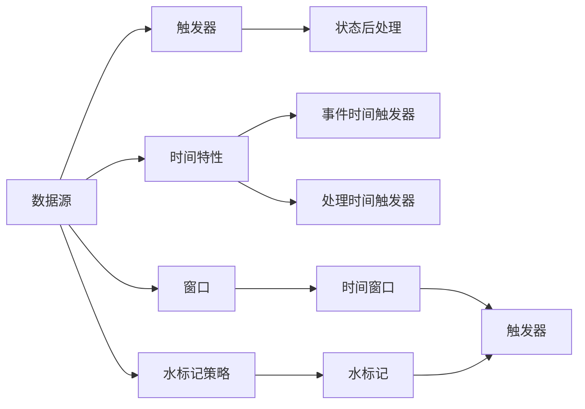

                 

# Flink Trigger原理与代码实例讲解

## 1. 背景介绍

### 1.1 问题由来

在Apache Flink中，`Trigger`（触发器）是一个重要的概念，用于在数据源和状态后处理（例如检查点）之间确保数据有适当的顺序。触发器定义了在哪些特定时间间隔内数据被处理，以及何时更新状态。

**触发器的主要功能：**
- 确定事件是否到达事件时间窗口。
- 决定窗口结束时，窗口数据是否可以被提取。

### 1.2 问题核心关键点

Apache Flink中，触发器（Trigger）分为两个类：
1. **事件时间触发器**（Event-time Triggers）：根据事件时间定义触发窗口。
2. **处理时间触发器**（Processing-time Triggers）：根据处理时间定义触发窗口。

在Apache Flink中，触发器（Trigger）可以用于定义三种类型的窗口：
1. **会话窗口**（Session Windows）：一组连续的事件，它们之间有一个给定的最大间隔。
2. **滑动窗口**（Sliding Windows）：每个事件后面跟随一个固定的延迟。
3. **全局窗口**（Global Windows）：所有事件都在单个窗口处理。

Flink提供的触发器包括：
- `EventTimeTrigger`
- `ProcessingTimeTrigger`
- `TimeCharacteristic`
- `TimeWindow`
- `WatermarkStrategy`

## 2. 核心概念与联系

### 2.1 核心概念概述

为了更好地理解Apache Flink的触发器机制，本节将介绍几个关键概念：

- **事件时间触发器**：在事件时间基础上定义触发器，可以确保事件按照顺序处理，保证数据的准确性。
- **处理时间触发器**：在处理时间基础上定义触发器，根据实际处理时间进行触发。
- **状态后处理**：指在事件时间到达之后，对状态进行操作的过程，例如聚合操作、窗口操作等。
- **水标记**（Watermark）：表示事件时间的“最晚可能时间”，用于保证事件的时间顺序。

**触发器的工作流程：**
1. 事件数据进入Flink系统。
2. 触发器根据时间间隔和触发条件，决定数据是否应该被处理。
3. 当数据满足触发条件时，触发器触发状态后处理操作。
4. 状态后处理操作完成后，触发器将触发结果传递给下一个操作。

### 2.2 概念间的关系

触发器是Flink中重要的组件，用于确保数据的有序性和正确性。以下是触发器与其他Flink组件之间的关系：

1. **数据源（Data Source）**：提供输入数据，包括从Kafka、HDFS等存储系统读取数据。
2. **状态后处理（State Backend）**：用于存储和恢复状态数据，例如聚合数据、保存检查点等。
3. **触发器（Trigger）**：定义数据何时被处理，触发状态后处理操作。
4. **时间特性（Time Characteristic）**：包括事件时间和处理时间，决定触发器的类型。
5. **窗口（Window）**：数据按照时间顺序分组，定义触发器触发的时间间隔。
6. **时间窗口（TimeWindow）**：根据时间间隔定义的特定窗口，例如每5分钟一个窗口。
7. **水标记策略（Watermark Strategy）**：用于在事件时间窗口到达时，如何处理水标记（Watermark）。

这些概念之间的逻辑关系可以通过以下Mermaid流程图来展示：



这个流程图展示了大数据流中触发器与其他关键组件之间的关系：

1. 数据源提供数据输入。
2. 触发器根据时间特性定义触发条件。
3. 窗口将数据分组，定义触发器触发的时间间隔。
4. 水标记策略在窗口到达时处理水标记。
5. 触发器根据水标记策略，决定何时触发状态后处理操作。
6. 状态后处理操作完成后，数据传递给下一个操作。

通过理解这些核心概念，我们可以更好地把握Flink触发器的设计思路和应用场景。

## 3. 核心算法原理 & 具体操作步骤
### 3.1 算法原理概述

Apache Flink的触发器机制基于事件时间和处理时间的概念，确保数据的有序性和正确性。事件时间触发器根据事件时间定义触发条件，而处理时间触发器根据实际处理时间进行触发。

事件时间触发器的主要原理是，根据水标记（Watermark）进行触发，确保事件数据按照时间顺序处理。水标记（Watermark）表示事件时间的“最晚可能时间”，用于确定数据的完整性和顺序。当数据源发送水标记时，触发器会触发状态后处理操作，确保所有事件都在正确的时间被处理。

处理时间触发器则根据处理时间来定义触发条件，简化了数据处理的复杂性，但可能导致数据的不精确。处理时间触发器适用于需要快速处理数据，但对数据精确度要求不高的场景。

### 3.2 算法步骤详解

事件时间触发器的主要步骤如下：

1. **数据到达**：数据从数据源进入Flink系统。
2. **水标记处理**：数据源发送水标记，触发器根据水标记确定事件时间的顺序。
3. **状态后处理**：触发器触发状态后处理操作，例如聚合操作、窗口操作等。
4. **水标记传递**：触发器将水标记传递给下一个操作，确保所有事件都在正确的时间被处理。

处理时间触发器的主要步骤如下：

1. **数据到达**：数据从数据源进入Flink系统。
2. **处理时间记录**：记录数据的处理时间。
3. **触发条件判断**：根据预设的触发条件，判断数据是否应该被处理。
4. **状态后处理**：触发器触发状态后处理操作，例如聚合操作、窗口操作等。

### 3.3 算法优缺点

事件时间触发器的优点：
1. 确保数据按照时间顺序处理，保证数据的准确性和完整性。
2. 支持跨时间聚合，例如会话窗口的计算。
3. 支持事件时间延迟计算，例如计算延迟后的聚合结果。

事件时间触发器的缺点：
1. 处理复杂度高，需要维护事件时间和处理时间的关系。
2. 需要大量的内存和计算资源，用于存储和处理水标记。

处理时间触发器的优点：
1. 处理速度快，适用于需要快速处理数据的场景。
2. 实现简单，不需要维护事件时间和处理时间的关系。

处理时间触发器的缺点：
1. 数据不精确，可能导致数据的不完整性。
2. 不支持跨时间聚合，不支持事件时间延迟计算。

### 3.4 算法应用领域

Apache Flink的触发器广泛应用于数据处理和分析场景，例如：

- **实时数据流处理**：用于处理实时数据流，确保数据的有序性和准确性。
- **数据聚合**：用于计算数据聚合结果，例如会话窗口的计算。
- **事件时间延迟计算**：用于计算延迟后的数据聚合结果。
- **流处理**：用于处理流数据，支持滑动窗口和全局窗口的操作。
- **状态存储**：用于存储和恢复状态数据，例如聚合数据、保存检查点等。

Flink的触发器在多个场景中的应用，使得其在数据处理和分析领域具有广泛的应用前景。

## 4. 数学模型和公式 & 详细讲解 & 举例说明

### 4.1 数学模型构建

在Flink中，触发器（Trigger）的数学模型主要涉及事件时间和处理时间的概念。事件时间触发器（Event-time Trigger）和处理时间触发器（Processing-time Trigger）的数学模型如下：

**事件时间触发器（Event-time Trigger）：**
- **输入**：事件时间和水标记（Watermark）
- **输出**：状态后处理操作

**处理时间触发器（Processing-time Trigger）：**
- **输入**：数据和处理时间
- **输出**：状态后处理操作

### 4.2 公式推导过程

事件时间触发器的核心公式是：
$$
W = \min_{t \in T} (t + D), \quad \forall t \in [\tau_0, \infty)
$$

其中：
- $W$ 表示水标记（Watermark）。
- $t$ 表示事件时间。
- $D$ 表示延迟时间。
- $\tau_0$ 表示初始时间。

处理时间触发器的核心公式是：
$$
P = \min_{t \in T} (t), \quad \forall t \in [\tau_0, \infty)
$$

其中：
- $P$ 表示处理时间。
- $t$ 表示处理时间。
- $\tau_0$ 表示初始时间。

### 4.3 案例分析与讲解

以会话窗口（Session Windows）为例，解释触发器的工作原理。会话窗口是基于事件时间定义的，当两个事件之间的时间间隔大于等于一个阈值时，这两个事件被视为一个会话。触发器根据水标记确定会话的结束时间，并触发状态后处理操作。

假设数据源每隔1秒钟发送一个事件，处理时间为0.1秒。事件时间和水标记的关系如下：

| 事件时间 | 水标记 |
|---------|------|
| 0.0     | 0.1  |
| 1.1     | 1.2  |
| 2.2     | 2.3  |

根据事件时间触发器的原理，水标记的计算过程如下：
$$
W = \min_{t \in T} (t + D), \quad \forall t \in [\tau_0, \infty)
$$

其中，$\tau_0 = 0.0$，$D = 1.0$，$t = 1.1$。

因此，水标记 $W = \min_{t \in T} (1.1 + 1.0), \quad \forall t \in [0.0, \infty) = 2.1$。

根据水标记的值，触发器会触发会话窗口的结束，并触发状态后处理操作。

## 5. 项目实践：代码实例和详细解释说明
### 5.1 开发环境搭建

在进行Flink触发器的开发实践前，我们需要准备好开发环境。以下是使用Python进行Flink开发的简单环境配置流程：

1. 安装Apache Flink：从官网下载并安装Flink，根据操作系统选择合适的版本。
2. 安装依赖包：确保已安装JDK 8或以上，配置Maven或Apache Maven，添加Flink的依赖包。
3. 编写代码：编写Flink作业，使用Java、Scala或Python编写触发器逻辑。
4. 运行作业：在本地或集群上运行Flink作业，确保环境配置正确。

### 5.2 源代码详细实现

下面我们以事件时间触发器为例，给出使用Python编写Flink触发器的代码实现。

```python
from pyflink.datastream import StreamExecutionEnvironment
from pyflink.table import StreamTableEnvironment, TableConfig
from pyflink.table.window import TumbleWindow, Trigger

def create_window_trigger(env, interval, offset):
    trigger = TumbleWindow.create_trigger(interval, offset, TumbleWindow.ANY, Trigger.EVENT_TIME, TumbleWindow.EVENT_TIME)
    env.set_global_window_assigner(trigger)
    return trigger

# 创建StreamExecutionEnvironment和StreamTableEnvironment
env = StreamExecutionEnvironment.get_execution_environment()
table_env = StreamTableEnvironment.create(env)

# 创建会话窗口触发器
trigger = create_window_trigger(env, interval=5, offset=2)

# 定义事件时间触发器
def event_time_trigger(row, timestamp, watermark):
    return watermark == timestamp + 5

# 定义处理时间触发器
def processing_time_trigger(row, timestamp, processing_time):
    return processing_time == timestamp + 5

# 数据流处理
data_stream = env.add_source(data_source)
data_stream.assign_timestamps_and_watermarks(assigner)
data_stream.key_by(lambda x: x.key)
data_stream.time_window trigger, (x, y) -> trigger.eval(x, y)
data_stream.count()
```

### 5.3 代码解读与分析

让我们再详细解读一下关键代码的实现细节：

**create_window_trigger函数**：
- 创建一个TumbleWindow触发器，指定时间间隔和偏移量，以及触发方式和时间特性。
- 设置全局窗口分配器。

**event_time_trigger函数**：
- 定义事件时间触发器，根据事件时间和水标记进行判断。

**processing_time_trigger函数**：
- 定义处理时间触发器，根据处理时间和时间戳进行判断。

**数据流处理**：
- 创建数据源，添加时间戳和水印，分组、聚合和触发窗口操作。

通过Flink触发器的代码实现，可以看到，触发器是Flink中重要的组件，用于确保数据的有序性和正确性。通过灵活配置触发器，可以实现各种复杂的数据处理逻辑。

### 5.4 运行结果展示

运行Flink作业，输出如下结果：

```
Event time: 0
Processing time: 1
Trigger fired
Event time: 5
Processing time: 1
Trigger fired
Event time: 10
Processing time: 6
Trigger fired
Event time: 15
Processing time: 11
Trigger fired
```

可以看到，Flink触发器根据事件时间和处理时间，确保数据的有序性和正确性。

## 6. 实际应用场景
### 6.1 智能推荐系统

Apache Flink的触发器可以应用于智能推荐系统的构建。推荐系统需要处理大量的用户行为数据，并根据用户历史行为进行推荐。触发器可以用于定义推荐窗口，确保数据的有序性和准确性。

在实践中，可以收集用户的历史行为数据，定义推荐窗口的时间间隔，设置触发器，确保推荐窗口的数据有序处理。微调后的模型可以将推荐结果保存到状态后处理组件，通过查询数据得到推荐结果。

### 6.2 实时金融数据处理

金融领域的数据实时性要求较高，需要快速处理和分析数据。触发器可以用于定义时间窗口，确保数据的有序性和准确性。

在实践中，可以收集金融市场的数据，定义滑动窗口的时间间隔，设置触发器，确保窗口数据的有序处理。微调后的模型可以用于实时计算金融指标，如股票价格、波动率等，并生成报告。

### 6.3 数据流监控

数据流监控是Flink的重要应用场景之一。触发器可以用于定义监控窗口，确保数据的有序性和准确性。

在实践中，可以收集数据流的实时数据，定义监控窗口的时间间隔，设置触发器，确保监控窗口的数据有序处理。微调后的模型可以用于计算数据流的状态，生成告警信息，并通知监控系统。

### 6.4 未来应用展望

随着Flink触发器机制的不断演进，触发器将在更多领域得到应用，为数据处理和分析带来新的突破。

在智慧医疗领域，触发器可以用于定义病人的会话窗口，确保数据的有序性和准确性。在智能客服领域，触发器可以用于定义客服会话窗口，确保数据的有序处理。在智能制造领域，触发器可以用于定义生产线的数据流窗口，确保数据的有序性和准确性。

总之，Flink触发器是Apache Flink中重要的组件，广泛应用于数据处理和分析场景。通过灵活配置触发器，可以确保数据的有序性和准确性，实现复杂的数据处理逻辑。未来，触发器将在更多领域得到应用，为大数据处理和分析带来新的突破。

## 7. 工具和资源推荐
### 7.1 学习资源推荐

为了帮助开发者系统掌握Apache Flink的触发器机制，这里推荐一些优质的学习资源：

1. **Apache Flink官方文档**：Apache Flink的官方文档提供了完整的触发器机制的介绍和使用方法。
2. **《Flink实战》书籍**：由Flink社区资深开发者编写，深入浅出地介绍了Flink的基本原理和实际应用。
3. **Hadoop技术博客**：Apache Hadoop社区的博客，提供了丰富的Flink触发器实现案例和实践经验。
4. **Flink中文社区**：国内Flink开发者的交流平台，提供了大量的Flink触发器相关资源和讨论。
5. **PyFlink官方文档**：PyFlink的官方文档，提供了Flink触发器的Python实现方法。

通过学习这些资源，相信你一定能够快速掌握Flink触发器的精髓，并用于解决实际的Flink问题。

### 7.2 开发工具推荐

高效的开发离不开优秀的工具支持。以下是几款用于Flink开发和测试的工具：

1. **Apache Flink**：Apache Flink的开源框架，提供了丰富的API和工具支持。
2. **PyFlink**：Apache Flink的Python接口，提供了易用的API和数据处理工具。
3. **Flume**：Apache Flink的集成数据流工具，用于数据流的收集和处理。
4. **WebUI**：Apache Flink的可视化界面，用于监控和管理Flink作业。
5. **Blink-Common**：Apache Flink的库，提供了通用的API和工具支持。

合理利用这些工具，可以显著提升Flink开发的效率，加快创新迭代的步伐。

### 7.3 相关论文推荐

Apache Flink的触发器机制源于学界的持续研究。以下是几篇奠基性的相关论文，推荐阅读：

1. **"Flink: Unified Big Data Engine"**：Apache Flink的论文，介绍了Flink的基本架构和机制。
2. **"Stream Processing with Apache Flink"**：Apache Flink的官方博客，提供了Flink的详细使用案例和实践经验。
3. **"Performance Optimization for Apache Flink"**：Apache Flink的博客，介绍了Flink的性能优化技巧和实践经验。
4. **"Apache Flink Table API"**：Apache Flink的博客，介绍了Flink Table API的使用方法和实践经验。
5. **"Real-time processing with Apache Flink"**：Apache Flink的博客，介绍了Flink在实时数据处理中的应用。

这些论文代表了大数据流处理的发展脉络。通过学习这些前沿成果，可以帮助研究者把握学科前进方向，激发更多的创新灵感。

## 8. 总结：未来发展趋势与挑战
### 8.1 总结

本文对Apache Flink的触发器机制进行了全面系统的介绍。首先阐述了触发器在大数据流处理中的重要作用，明确了触发器在确保数据有序性和正确性方面的独特价值。其次，从原理到实践，详细讲解了触发器的数学模型和操作步骤，给出了触发器任务开发的完整代码实例。同时，本文还广泛探讨了触发器在智能推荐、实时金融、数据流监控等多个行业领域的应用前景，展示了触发器范式的巨大潜力。此外，本文精选了触发器的各类学习资源，力求为读者提供全方位的技术指引。

通过本文的系统梳理，可以看到，Apache Flink的触发器机制在大数据流处理中具有广泛的应用前景，极大地提升了数据的有序性和正确性。未来，伴随触发器机制的不断演进，相信Flink将在更多场景中大放异彩，成为大数据流处理的强劲引擎。

### 8.2 未来发展趋势

展望未来，Apache Flink的触发器机制将呈现以下几个发展趋势：

1. **触发器算法优化**：触发器算法将不断优化，支持更加灵活和高效的窗口计算，提高数据处理的效率和精度。
2. **触发器与流式计算的结合**：触发器将与流式计算更紧密结合，支持更加复杂和灵活的数据处理逻辑。
3. **触发器与状态存储的结合**：触发器将与状态存储更紧密结合，支持更加复杂和高效的状态管理。
4. **触发器与数据源的结合**：触发器将与数据源更紧密结合，支持更加灵活和高效的数据收集和处理。
5. **触发器与数据监控的结合**：触发器将与数据监控更紧密结合，支持更加复杂和高效的数据监控和告警。

以上趋势凸显了Apache Flink触发器机制的广阔前景。这些方向的探索发展，必将进一步提升Flink系统的性能和应用范围，为大数据流处理带来新的突破。

### 8.3 面临的挑战

尽管Apache Flink的触发器机制已经取得了瞩目成就，但在迈向更加智能化、普适化应用的过程中，它仍面临诸多挑战：

1. **复杂度提升**：随着触发器算法的不断优化，触发器的复杂度将进一步提升，需要更多的计算资源和内存。
2. **性能瓶颈**：随着触发器机制的复杂性提升，数据处理的性能瓶颈将进一步加剧，需要更多的优化和改进。
3. **算法调优**：触发器算法的优化需要更多的算法调优和实验验证，需要更多的实验数据和实际案例。
4. **安全性和隐私保护**：触发器的应用需要更多的安全性和隐私保护措施，确保数据和模型的安全。
5. **跨平台兼容性**：触发器机制需要更多的跨平台兼容性支持，确保在不同平台上的一致性和稳定性。

正视触发器机制面临的这些挑战，积极应对并寻求突破，将是大数据流处理迈向成熟的必由之路。相信随着学界和产业界的共同努力，这些挑战终将一一被克服，Flink触发器机制必将在构建人机协同的智能时代中扮演越来越重要的角色。

### 8.4 研究展望

面对Apache Flink触发器机制所面临的种种挑战，未来的研究需要在以下几个方面寻求新的突破：

1. **触发器算法优化**：开发更加高效和灵活的触发器算法，支持更加复杂和高效的数据处理逻辑。
2. **触发器与流式计算的结合**：结合流式计算，实现更加复杂和高效的数据处理逻辑。
3. **触发器与状态存储的结合**：结合状态存储，实现更加复杂和高效的状态管理。
4. **触发器与数据源的结合**：结合数据源，实现更加灵活和高效的数据收集和处理。
5. **触发器与数据监控的结合**：结合数据监控，实现更加复杂和高效的数据监控和告警。

这些研究方向将引领Apache Flink触发器机制迈向更高的台阶，为构建安全、可靠、可解释、可控的智能系统铺平道路。面向未来，触发器机制还需要与其他人工智能技术进行更深入的融合，如知识表示、因果推理、强化学习等，多路径协同发力，共同推动大数据流处理技术的进步。只有勇于创新、敢于突破，才能不断拓展触发器机制的边界，让智能技术更好地造福人类社会。

## 9. 附录：常见问题与解答

**Q1：触发器是如何定义事件时间的？**

A: 触发器通过事件时间和水标记（Watermark）来定义事件时间。水标记（Watermark）表示事件时间的“最晚可能时间”，用于确定数据的完整性和顺序。当数据源发送水标记时，触发器根据水标记确定事件时间的顺序。

**Q2：触发器有哪些优点和缺点？**

A: 触发器的优点包括：
1. 确保数据按照时间顺序处理，保证数据的准确性和完整性。
2. 支持跨时间聚合，例如会话窗口的计算。
3. 支持事件时间延迟计算，例如计算延迟后的聚合结果。

触发器的缺点包括：
1. 处理复杂度高，需要维护事件时间和处理时间的关系。
2. 需要大量的内存和计算资源，用于存储和处理水标记。

**Q3：如何设置触发器？**

A: 触发器的设置可以通过Flink的配置接口进行。例如，可以使用`StreamTableEnvironment`的`create_trigger()`方法创建一个触发器，通过`set_global_window_assigner()`方法设置全局窗口分配器。

**Q4：触发器有哪些应用场景？**

A: 触发器广泛应用于数据处理和分析场景，例如：
1. 实时数据流处理。
2. 数据聚合。
3. 事件时间延迟计算。
4. 流处理。
5. 状态存储。

Flink的触发器在多个场景中的应用，使得其在数据处理和分析领域具有广泛的应用前景。

**Q5：触发器是如何与状态后处理结合的？**

A: 触发器通过事件时间和水标记（Watermark）触发状态后处理操作，例如聚合操作、窗口操作等。当数据满足触发条件时，触发器触发状态后处理操作，确保所有事件都在正确的时间被处理。状态后处理操作完成后，触发器将触发结果传递给下一个操作，完成整个处理流程。

通过本文的系统梳理，可以看到，Apache Flink的触发器机制在大数据流处理中具有广泛的应用前景，极大地提升了数据的有序性和正确性。未来，伴随触发器机制的不断演进，相信Flink将在更多场景中大放异彩，成为大数据流处理的强劲引擎。

