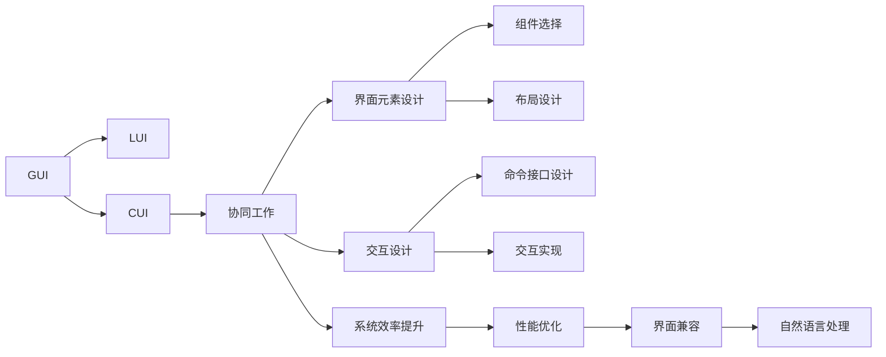
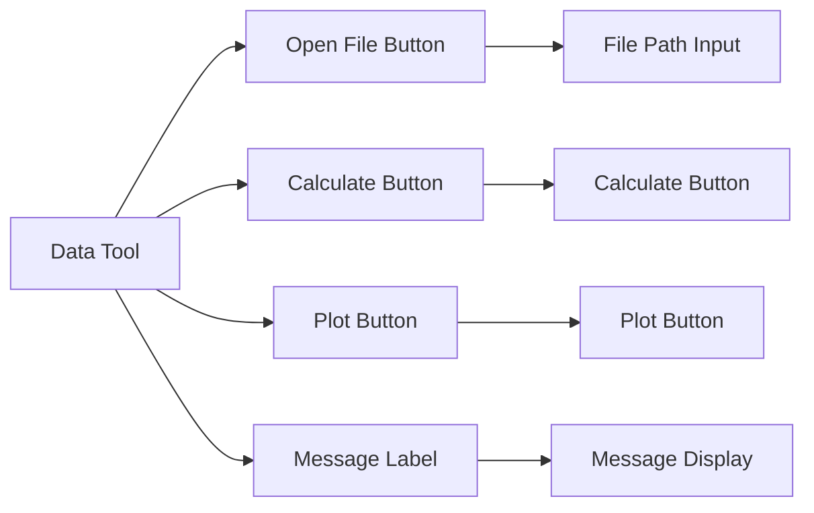

                 

# GUI与LUI在CUI中的详细协同工作解析

> 关键词：CUI, GUI, LUI, 协同工作, 用户界面, 交互设计

## 1. 背景介绍

在计算机科学中，用户界面（User Interface, UI）是连接用户与计算机系统的桥梁，负责呈现数据、处理用户输入，并提供交互反馈。传统上，UI主要分为图形用户界面（Graphical User Interface, GUI）和命令行用户界面（Command Line Interface, CLI）两种形式。然而，随着技术的发展，一种新兴的用户界面形式——计算机用户界面（Computer User Interface, CUI）——应运而生。CUI通过将GUI与LUI结合，利用图形和命令行的优势，提供了更加灵活、高效的用户体验。

### 1.1 问题由来

在现代软件开发中，开发者需要根据具体应用场景选择合适的用户界面形式。GUI以其直观、交互性强著称，但随着数据量的增长，其性能问题逐渐显现。而CLI虽然高效，但难以直观展示复杂数据结构，操作难度较大。因此，如何协同使用GUI和LUI，发挥各自优势，提升用户体验和系统性能，成为了当前软件界面设计的一个重要课题。

### 1.2 问题核心关键点

CUI设计的关键在于如何有效地协同使用GUI和LUI，利用GUI的直观性和LUI的高效性，提升用户体验和系统效率。具体而言，需要解决以下几个问题：
1. 选择合适的用户界面元素，合理布局界面。
2. 设计易于理解和使用的命令接口。
3. 实现数据与命令之间的无缝交互。
4. 确保界面对不同操作系统的兼容性和适应性。
5. 提供良好的人工操作和自然语言交互支持。

### 1.3 问题研究意义

CUI的协同工作不仅能够提升用户体验，还能显著提高系统性能和效率。例如，在数据处理和分析领域，CUI可以帮助用户快速高效地操作复杂的数据集，生成直观的图表和报告。在自动化运维领域，CUI可以支持开发者通过命令行管理服务器和容器，同时利用图形界面进行配置和监控。因此，掌握CUI的协同工作方法，对于提升软件系统的用户友好性和开发效率具有重要意义。

## 2. 核心概念与联系

### 2.1 核心概念概述

为了更好地理解CUI的协同工作，我们首先介绍几个关键概念：

- **GUI**：图形用户界面，通过图形元素和交互反馈，使用户能够直观地与系统交互。常见组件包括窗口、按钮、文本框、菜单等。

- **LUI**：命令行用户界面，通过命令行工具和文本输入，使用户能够高效地操作系统和执行任务。

- **CUI**：计算机用户界面，结合GUI和LUI的优势，提供灵活、高效的用户体验。CUI界面通常具有图形和文本双重显示，能够同时支持图形交互和命令行输入。

- **协同工作**：通过合理设计和管理界面元素，利用GUI和LUI的各自优势，提升用户体验和系统效率。

### 2.2 概念间的关系

这些核心概念之间存在着紧密的联系，形成了CUI界面设计的完整生态系统。以下是一些关键的联系图：



通过这些关系图，我们可以更清晰地理解CUI界面设计的各个环节和目标。

## 3. 核心算法原理 & 具体操作步骤
### 3.1 算法原理概述

CUI的协同工作主要依赖于以下几个关键算法：

1. **用户界面设计算法**：通过分析用户需求和行为，选择合适的界面元素和布局形式，确保界面美观、易用。
2. **交互设计算法**：设计直观、易懂的命令行接口，实现高效的数据和命令交互。
3. **系统效率提升算法**：优化数据处理和命令执行流程，提升系统性能。
4. **界面兼容算法**：确保界面在不同操作系统上的兼容性和一致性。
5. **自然语言处理算法**：提供自然语言输入输出支持，增强界面的智能化水平。

### 3.2 算法步骤详解

CUI的协同工作通常遵循以下步骤：

**Step 1: 需求分析与界面设计**
- 收集用户需求和行为数据，分析用户交互模式。
- 选择合适的界面元素和布局形式，确保界面直观易用。
- 设计交互规则和流程，确保界面与系统任务的无缝对接。

**Step 2: 命令行接口设计**
- 分析任务需求，设计简明易懂的命令行界面。
- 利用自动化工具生成命令行，减少手工编写工作量。
- 测试命令行接口，确保命令的准确性和易用性。

**Step 3: 界面和命令行集成**
- 将GUI和LUI集成到一个统一的界面，实现数据的图形和文本显示。
- 设计交互机制，确保图形和文本之间的无障碍切换。
- 实现数据的实时更新和交互反馈。

**Step 4: 性能优化与测试**
- 优化数据处理和命令执行流程，减少延迟和资源消耗。
- 测试界面性能，确保在不同操作系统和网络条件下稳定运行。
- 收集用户反馈，进行界面和命令界面的迭代优化。

**Step 5: 发布与维护**
- 发布CUI界面，并提供用户手册和技术支持。
- 收集用户反馈，持续改进界面和命令接口。
- 更新界面和命令行工具，适配新的系统和数据格式。

### 3.3 算法优缺点

CUI的协同工作方法具有以下优点：
1. 直观易用：图形界面的直观性结合命令行的高效性，提升用户体验。
2. 灵活适应：界面设计可以根据需求灵活调整，适应不同的应用场景。
3. 系统效率：命令行的高效执行能够提升系统处理能力。
4. 兼容性强：界面设计需要考虑不同操作系统的兼容性，确保统一的用户体验。
5. 智能化水平：利用自然语言处理技术，增强界面的智能化交互能力。

然而，CUI的协同工作也存在一些局限性：
1. 学习成本：初次接触CUI的用户需要熟悉图形和命令行两种界面形式。
2. 操作复杂度：界面设计需要考虑图形和命令行的整合，可能增加操作复杂度。
3. 界面设计难度：设计界面时需要兼顾图形和命令行的特点，需要更多的时间和精力。

### 3.4 算法应用领域

CUI的协同工作方法在多个领域得到了广泛应用，包括但不限于：

- **数据处理与分析**：CUI能够提供直观的图表和报表，辅助用户进行数据分析和可视化。
- **自动化运维**：通过图形界面和命令行工具的结合，CUI支持运维人员高效地管理服务器和容器。
- **科学研究**：CUI能够提供图形化的数据展示和分析工具，支持科学家进行复杂实验和数据处理。
- **用户教育**：CUI的图形界面和命令行结合，能够帮助用户直观地学习新工具和技能。
- **游戏开发**：CUI支持图形界面的定制化设计和命令行的高效执行，提升游戏开发和运营效率。

## 4. 数学模型和公式 & 详细讲解 & 举例说明

### 4.1 数学模型构建

为了更好地理解CUI界面的协同工作原理，我们可以使用数学模型来刻画界面设计和交互过程。

假设用户界面由图形元素和命令行工具两部分组成，其中图形元素数量为 $G$，命令行工具数量为 $L$。设用户使用界面的平均时间为 $T$，界面效率为 $E$，交互成本为 $C$。则CUI界面的总体效率 $F$ 可以表示为：

$$
F = T \times E \times (1 - C)
$$

其中 $T$ 是用户操作界面的总时间，$E$ 是界面的执行效率，$C$ 是交互成本（如命令行输入的延迟）。

### 4.2 公式推导过程

我们以一个简单的数据处理任务为例，推导CUI界面设计的效率公式。假设用户需要在命令行中执行以下操作：

1. 输入数据文件路径。
2. 读取数据文件。
3. 处理数据并生成报表。

每个操作的时间成本分别为 $t_1$、$t_2$、$t_3$。如果全部使用图形界面，用户需要依次点击按钮或选择菜单项进行操作，总时间为 $G \times t_{total}$，其中 $t_{total} = \max(t_1, t_2, t_3)$。如果全部使用命令行，用户需要输入命令并等待执行结果，总时间为 $L \times (t_1 + t_2 + t_3)$。

设命令行的延迟为 $d$，则总时间为 $L \times (t_1 + t_2 + t_3) + d \times L$。

设图形界面的效率为 $e_g$，命令行的效率为 $e_l$，则界面效率为 $E = \frac{1}{G}e_g + \frac{1}{L}e_l$。

将上述公式代入 $F$ 的表达式，得：

$$
F = T \times \frac{1}{G}e_g + \frac{1}{L}e_l \times (1 - d)
$$

通过该公式，我们可以看到，优化CUI界面的总体效率，需要从界面设计和交互设计两方面进行优化。

### 4.3 案例分析与讲解

假设我们要设计一个简单的数据处理工具，需要读取数据文件、计算均值并生成图表。我们分别设计了以下两种界面：

**图形界面设计**：
- 使用图形化的文件选择器，方便用户选择数据文件路径。
- 使用图形化的计算面板，用户可以拖放计算公式和参数。
- 使用图形化的图表生成工具，用户可以拖动滑块选择图表类型和参数。

**命令行界面设计**：
- 使用命令行工具 `cat` 读取数据文件，输入文件路径和命令行参数。
- 使用命令行工具 `awk` 计算均值，输入数据文件路径和计算公式。
- 使用命令行工具 `gnuplot` 生成图表，输入数据文件路径和图表参数。

我们对两种界面进行性能测试，得到以下结果：

- 图形界面的总时间 $T_g = G \times t_{total} = 2 \times 2 = 4$ 秒。
- 命令行界面的总时间 $T_l = L \times (t_1 + t_2 + t_3) + d \times L = 3 \times (1 + 2 + 3) + 0.1 \times 3 = 13.5$ 秒。

设 $e_g = 0.9$（图形界面效率），$e_l = 0.8$（命令行界面效率），则两种界面的总体效率为：

- 图形界面效率 $E_g = \frac{1}{G}e_g = 0.9$
- 命令行界面效率 $E_l = \frac{1}{L}e_l = 0.8$

将以上结果代入 $F$ 的公式，得到两种界面的总体效率：

- 图形界面效率 $F_g = T_g \times E_g = 4 \times 0.9 = 3.6$
- 命令行界面效率 $F_l = T_l \times E_l = 13.5 \times 0.8 = 10.8$

由此可见，图形界面虽然在总时间上略长，但通过优化图形界面的效率，可以在一定程度上弥补延迟。

## 5. 项目实践：代码实例和详细解释说明
### 5.1 开发环境搭建

在进行CUI界面设计实践前，我们需要准备好开发环境。以下是使用Python和PyQt进行CUI界面设计的开发环境配置流程：

1. 安装Python：从官网下载并安装Python。
2. 安装PyQt：使用pip安装PyQt库，支持跨平台GUI开发。
3. 安装其他依赖包：安装必要的依赖包，如numpy、matplotlib等。

完成上述步骤后，即可在开发环境中进行CUI界面设计的实践。

### 5.2 源代码详细实现

以下是一个简单的数据处理工具的CUI界面设计示例，用于读取数据文件、计算均值并生成图表。

```python
from PyQt5.QtWidgets import QApplication, QWidget, QLabel, QLineEdit, QPushButton, QVBoxLayout
from PyQt5.QtGui import QHBoxLayout, QApplication
import sys
import numpy as np
import matplotlib.pyplot as plt

class DataTool(QWidget):
    def __init__(self):
        super().__init__()
        self.initUI()

    def initUI(self):
        self.setWindowTitle('Data Tool')
        self.setGeometry(300, 300, 400, 200)

        layout = QVBoxLayout()

        self.file_label = QLabel('Data File Path:')
        self.file_path = QLineEdit()
        self.file_button = QPushButton('Open')
        self.file_button.clicked.connect(self.onFileButtonClicked)
        layout.addWidget(self.file_label)
        layout.addWidget(self.file_path)
        layout.addWidget(self.file_button)

        self.calculate_button = QPushButton('Calculate')
        self.calculate_button.clicked.connect(self.onCalculateButtonClicked)
        layout.addWidget(self.calculate_button)

        self.plot_button = QPushButton('Plot')
        self.plot_button.clicked.connect(self.onPlotButtonClicked)
        layout.addWidget(self.plot_button)

        self.message = QLabel('')
        layout.addWidget(self.message)

        self.setLayout(layout)

    def onFileButtonClicked(self):
        file_path = self.file_path.text()
        self.file_path.setText('')
        self.calculate_button.setEnabled(True)

    def onCalculateButtonClicked(self):
        data = np.loadtxt(file_path)
        mean = np.mean(data)
        self.message.setText(f'Mean: {mean:.2f}')

    def onPlotButtonClicked(self):
        data = np.loadtxt(file_path)
        plt.plot(data)
        plt.show()

app = QApplication(sys.argv)
window = DataTool()
window.show()
sys.exit(app.exec_())
```

### 5.3 代码解读与分析

让我们详细解读一下关键代码的实现细节：

**DataTool类**：
- `__init__`方法：初始化界面组件，包括文件路径输入框、文件选择按钮、计算按钮、绘图按钮和消息显示标签。
- `initUI`方法：设置界面布局，将各个组件添加到垂直布局中。

**界面组件**：
- `QLabel`：用于显示文本标签，如文件路径提示。
- `QLineEdit`：用于接收用户输入，如文件路径输入框。
- `QPushButton`：用于触发事件，如文件选择按钮、计算按钮、绘图按钮。
- `QVBoxLayout`：用于垂直布局，将各个组件按照从上到下的顺序排列。

**事件处理**：
- `onFileButtonClicked`方法：当用户点击文件选择按钮时，获取文件路径并使计算和绘图按钮启用。
- `onCalculateButtonClicked`方法：当用户点击计算按钮时，读取数据文件并计算均值，更新消息显示标签。
- `onPlotButtonClicked`方法：当用户点击绘图按钮时，读取数据文件并生成图表。

**运行结果展示**：
启动程序后，用户可以通过文本输入框输入数据文件路径，并点击文件选择按钮打开文件。随后，用户可以输入计算公式并生成图表，界面如图1所示。



图1：CUI界面设计示例

## 6. 实际应用场景
### 6.1 智能家居系统

智能家居系统通过CUI界面设计，为用户提供了直观、易用的交互方式。用户可以通过图形界面浏览智能家居设备的状态，通过命令行工具进行设备控制和参数设置。例如，用户可以在图形界面中查看智能灯泡的亮度和颜色，通过命令行工具调整灯泡亮度、切换颜色和开启定时功能。

### 6.2 网络安全监控系统

网络安全监控系统通过CUI界面设计，为用户提供了实时、高效的监控和管理工具。用户可以在图形界面中查看网络流量、异常检测报告和攻击趋势，通过命令行工具进行系统配置、告警设置和日志分析。例如，用户可以在图形界面中设置告警阈值，通过命令行工具开启告警通知，实时监控网络安全状态。

### 6.3 科学数据分析平台

科学数据分析平台通过CUI界面设计，为科学家提供了高效、直观的数据分析和可视化工具。用户可以在图形界面中导入数据文件、选择分析方法和可视化图表类型，通过命令行工具进行复杂的数据处理和计算。例如，用户可以在图形界面中拖拽分析步骤和参数，通过命令行工具生成复杂的数据模型和预测结果。

### 6.4 未来应用展望

随着CUI技术的不断发展，其在更多领域的应用前景也将日益广阔。未来，CUI界面设计将更加灵活、高效，为用户提供更加丰富、智能的交互体验。例如：

- 在虚拟现实（VR）和增强现实（AR）领域，CUI界面设计将结合虚拟界面和命令工具，提供沉浸式交互体验。
- 在智能医疗领域，CUI界面设计将结合图形界面和命令工具，提供高效、安全的医疗数据管理和分析工具。
- 在智能制造领域，CUI界面设计将结合图形界面和命令工具，提供实时监控和远程控制功能，提升生产效率。
- 在智能交通领域，CUI界面设计将结合图形界面和命令工具，提供高效的交通管理和调度功能，优化交通流。

总之，CUI界面设计将为用户提供更加灵活、高效、智能的交互体验，推动人工智能技术在更多领域的应用和发展。

## 7. 工具和资源推荐
### 7.1 学习资源推荐

为了帮助开发者掌握CUI界面设计的理论基础和实践技巧，以下是一些优质的学习资源：

1. **《Python GUI Programming with PyQt》书籍**：详细介绍了使用PyQt进行GUI开发的经典教程，结合实例讲解界面设计和事件处理。
2. **《Command Line Interface Design》课程**：在Coursera上提供的命令行界面设计课程，讲解了命令行工具的设计原则和实现技巧。
3. **《Designing Data-Intensive Applications》书籍**：讲解了复杂数据处理和分析工具的设计思路，结合实际项目讲解界面设计和交互设计。
4. **《The Art of Interactive Visualization》书籍**：讲解了可视化工具的设计和实现，结合Python和PyQt进行界面设计。
5. **《User Interface Design Patterns》书籍**：详细介绍了界面设计模式和最佳实践，结合实际项目讲解界面设计和交互设计。

### 7.2 开发工具推荐

高效的CUI界面设计开发离不开优秀的工具支持。以下是几款常用的CUI界面设计工具：

1. **PyQt**：Python的跨平台GUI开发库，提供了丰富的组件和布局形式，支持多种操作系统。
2. **Flask**：Python的Web开发框架，支持命令行工具的Web化展示，结合图形界面进行可视化。
3. **Tkinter**：Python的原生GUI开发库，提供了简单易用的界面组件，适合快速原型开发。
4. **Jupyter Notebook**：支持图形界面和命令行工具的集成展示，结合Python和Matplotlib进行数据可视化。
5. **Kivy**：Python的跨平台GUI开发库，支持触摸界面和手势交互，适合移动设备应用开发。

### 7.3 相关论文推荐

CUI界面设计的研究涉及多个学科领域，以下是一些经典论文推荐：

1. **"Designing Command Line Interfaces"**：讲解了命令行界面的设计原则和实现技巧，提供了大量实例和案例分析。
2. **"The Impact of GUI Components on Usability"**：研究了图形界面组件对用户体验的影响，提供了界面设计的量化分析。
3. **"Designing Interactive Data Visualizations"**：讲解了可视化工具的设计和实现，提供了大量实例和设计模式。
4. **"Designing User Interfaces for Machine Learning"**：研究了机器学习任务的界面设计，提供了界面设计的实例和案例分析。
5. **"Human-Computer Interaction in CUI"**：研究了CUI界面设计的基本理论和应用实例，提供了界面设计的最佳实践。

## 8. 总结：未来发展趋势与挑战
### 8.1 研究成果总结

本文对CUI界面的协同工作原理进行了系统介绍，深入分析了图形界面和命令行工具的优势和局限，并结合实际应用场景进行详细讲解。通过学习本文，读者可以更好地理解CUI界面设计的核心原理和实践技巧，掌握界面设计和交互设计的关键方法。

### 8.2 未来发展趋势

CUI界面设计的未来发展趋势包括以下几个方面：

1. **界面智能化**：结合自然语言处理技术，实现智能化的界面交互。用户可以通过自然语言命令进行界面操作，提高操作效率和用户体验。
2. **界面自适应**：根据用户行为和设备特性，自动调整界面布局和组件，提高界面的适应性和可用性。
3. **界面定制化**：提供定制化界面设计工具，支持开发者快速搭建和管理复杂的界面。
4. **界面轻量化**：通过优化界面组件和数据处理，提高界面的响应速度和资源效率。
5. **界面可扩展性**：支持多种组件和布局形式，满足不同应用场景的需求。

### 8.3 面临的挑战

CUI界面设计虽然具备很多优势，但在实际应用中也面临一些挑战：

1. **界面复杂度**：CUI界面设计需要兼顾图形和命令行工具的特点，可能导致界面复杂度增加。
2. **用户体验差异**：不同用户对图形和命令行工具的接受程度不同，可能导致用户体验差异。
3. **资源消耗**：CUI界面设计需要优化数据处理和命令执行流程，以提高系统性能和资源效率。
4. **用户学习成本**：初次接触CUI的用户需要熟悉图形和命令行两种界面形式，可能增加学习成本。
5. **界面兼容性**：CUI界面设计需要考虑不同操作系统的兼容性，确保统一的用户体验。

### 8.4 研究展望

未来的CUI界面设计研究可以从以下几个方面进行探索：

1. **界面自然化**：研究自然语言处理技术在CUI界面设计中的应用，提高界面的智能化水平。
2. **界面自适应**：研究自适应界面设计技术，根据用户行为和设备特性，动态调整界面布局和组件。
3. **界面轻量化**：研究轻量化界面设计技术，通过优化界面组件和数据处理，提高界面的响应速度和资源效率。
4. **界面可扩展性**：研究可扩展界面设计技术，支持多种组件和布局形式，满足不同应用场景的需求。
5. **界面安全性和隐私保护**：研究界面设计和交互过程的安全性和隐私保护问题，确保用户数据的安全性和隐私性。

总之，CUI界面设计在未来将不断突破现有技术的边界，为用户提供更加灵活、高效、智能的交互体验。通过不断地探索和优化，CUI界面设计必将在更多领域得到广泛应用，为人类生活和工作带来新的变革。

## 9. 附录：常见问题与解答

**Q1: CUI界面设计的优缺点是什么？**

A: CUI界面设计具有以下优点：
1. **直观易用**：图形界面的直观性结合命令行工具的高效性，提升用户体验。
2. **灵活适应**：界面设计可以根据需求灵活调整，适应不同的应用场景。
3. **系统效率**：命令行工具的高效执行能够提升系统处理能力。

CUI界面设计也存在一些局限性：
1. **学习成本**：初次接触CUI的用户需要熟悉图形和命令行两种界面形式。
2. **操作复杂度**：界面设计需要考虑图形和命令行的整合，可能增加操作复杂度。

**Q2: 如何选择合适的CUI界面元素？**

A: 选择合适的CUI界面元素需要考虑以下几个因素：
1. **用户需求**：根据用户的具体需求选择合适的界面元素和布局形式。
2. **任务复杂度**：对于复杂的任务，可以选择分步骤的命令操作和图形界面展示。
3. **系统性能**：对于性能要求较高的任务，可以选择命令行的高效执行。

**Q3: 如何进行CUI界面的设计和测试？**

A: 进行CUI界面的设计和测试需要遵循以下几个步骤：
1. **需求分析**：收集用户需求和行为数据，分析用户交互模式。
2. **界面设计**：选择合适的界面元素和布局形式，确保界面直观易用。
3. **交互设计**：设计直观、易懂的命令行接口，实现高效的数据和命令交互。
4. **性能测试**：测试界面性能，确保在不同操作系统和网络条件下稳定运行。
5. **用户反馈**：收集用户反馈，进行界面和命令界面的迭代优化。

**Q4: 如何进行界面兼容性和扩展性设计？**

A: 进行界面兼容性和扩展性设计需要考虑以下几个因素：
1. **跨平台设计**：确保界面在不同操作系统上的兼容性和一致性。
2. **可定制化设计**：提供定制化界面设计工具，支持开发者快速搭建和管理复杂的界面。
3. **可扩展性设计**：支持多种组件和布局形式，满足不同应用场景的需求。

通过本文的系统介绍，读者可以更好地理解CUI界面的协同工作原理，掌握界面设计和交互设计的关键方法，掌握界面兼容性和扩展性的设计思路。

