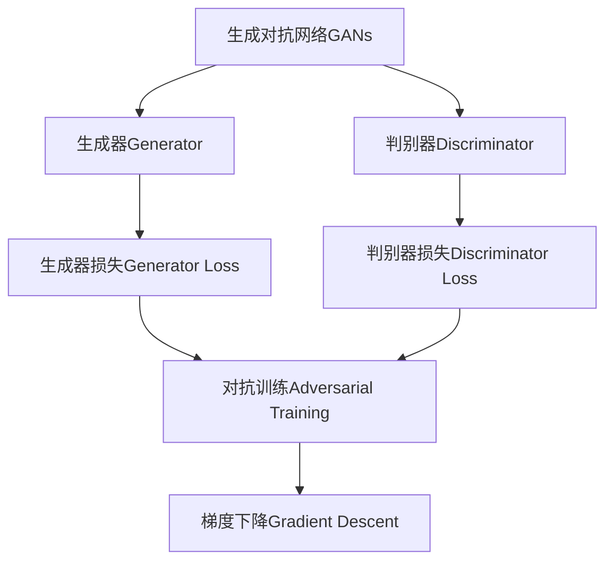
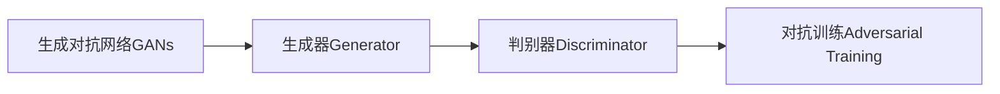
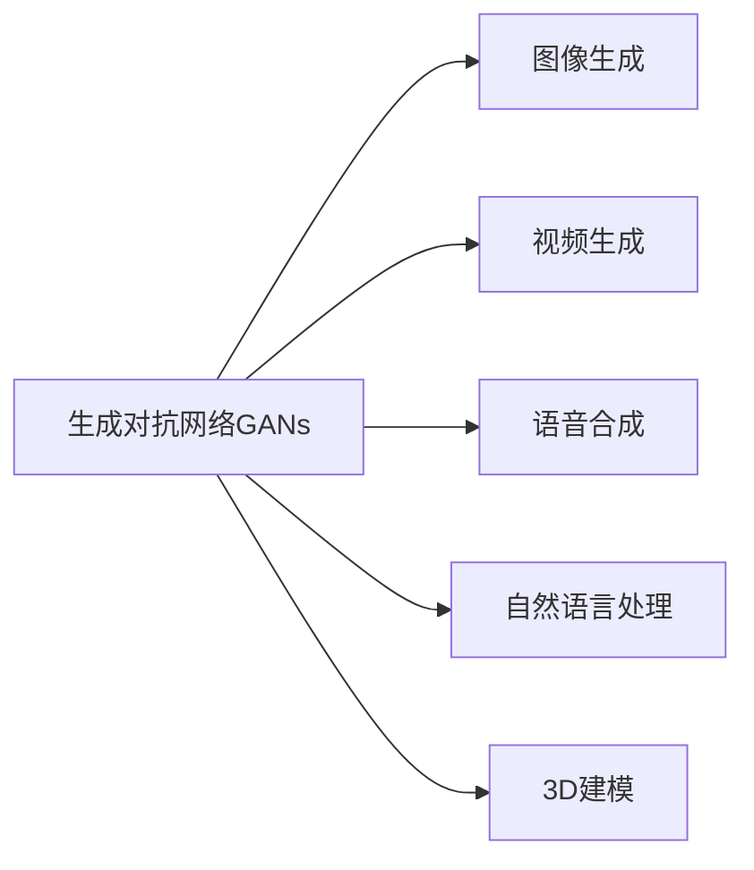
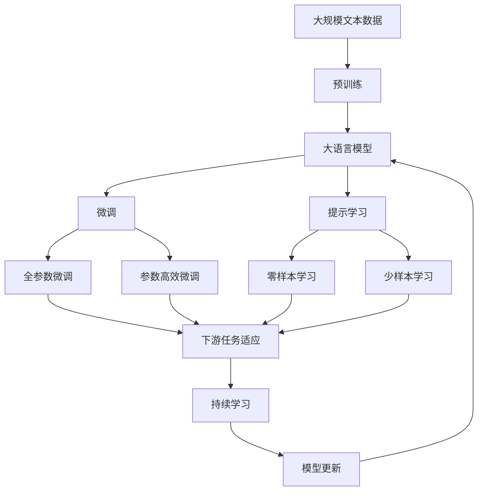

                 

# Generative Design原理与代码实例讲解

> 关键词：生成对抗网络,GAN,代码实例,深度学习,计算机视觉,自然语言处理

## 1. 背景介绍

### 1.1 问题由来
在当今这个数字化的时代，生成对抗网络（Generative Adversarial Networks, GANs）已经成为人工智能领域中一个令人瞩目的技术。GANs最初由Ian Goodfellow、Juan Pouget-Abadie、Mehryar Mohri和Aaron Courville于2014年提出，在图像生成、自然语言处理、音乐生成、3D建模等多个领域都展现出了卓越的表现。

GANs的核心思想是，通过两个深度神经网络（即生成器和判别器）之间的对抗训练来生成高质量的伪造数据。生成器负责生成样本，判别器则负责区分真实样本和生成样本。两个网络通过反向传播算法不断优化，直到生成器生成的样本能够以很高的概率欺骗判别器。

生成对抗网络已经广泛应用于图像生成、视频生成、语音合成、自然语言处理等多个领域，具有广阔的应用前景。然而，其核心原理和算法步骤仍需要深入理解和掌握。本文将详细探讨GANs的原理和代码实现，并通过实际代码实例讲解其具体应用。

### 1.2 问题核心关键点
本节将详细阐述生成对抗网络的核心概念、核心算法及其在实际应用中的关键点：

- 生成对抗网络（GANs）：由生成器和判别器组成的深度学习模型，通过对抗训练生成高质量的伪造数据。
- 生成器（Generator）：负责生成样本，结构通常为多层全连接神经网络。
- 判别器（Discriminator）：负责区分真实样本和生成样本，结构通常为多层全连接神经网络。
- 损失函数（Loss Function）：GANs训练的核心，包括生成器损失和判别器损失。
- 对抗训练（Adversarial Training）：通过生成器生成伪造数据欺骗判别器，两个网络通过反向传播不断优化。
- 梯度下降（Gradient Descent）：GANs训练的基础，用于优化生成器和判别器的参数。

### 1.3 问题研究意义
生成对抗网络在多个领域展现出了巨大的潜力，但其核心原理和算法步骤仍需要深入理解和掌握。掌握生成对抗网络原理，有助于开发高效、高质量的生成模型，提升人工智能技术的应用价值。

此外，生成对抗网络的研究不仅具有学术意义，也具有重要的现实应用价值，如：

1. **图像生成**：GANs可以生成高质量的图像，广泛应用于游戏、影视、广告等领域。
2. **视频生成**：GANs可以生成逼真的视频，为视频编辑、虚拟现实等提供支持。
3. **语音合成**：GANs可以生成自然流畅的语音，推动语音助手、智能音箱等技术的发展。
4. **自然语言处理**：GANs可以生成高质量的文本，应用于自动写作、翻译、对话系统等。
5. **3D建模**：GANs可以生成逼真的3D模型，应用于虚拟现实、游戏开发等领域。

因此，掌握生成对抗网络的原理和代码实现，对于推动人工智能技术的应用和产业发展具有重要意义。

## 2. 核心概念与联系

### 2.1 核心概念概述

为了更好地理解生成对抗网络，本节将介绍几个关键概念及其之间的联系：

- 生成对抗网络（GANs）：GANs由生成器和判别器组成，通过对抗训练生成高质量的伪造数据。
- 生成器（Generator）：生成器负责生成样本，通常为多层全连接神经网络。
- 判别器（Discriminator）：判别器负责区分真实样本和生成样本，通常为多层全连接神经网络。
- 损失函数（Loss Function）：GANs训练的核心，包括生成器损失和判别器损失。
- 对抗训练（Adversarial Training）：生成器生成伪造数据欺骗判别器，两个网络通过反向传播不断优化。
- 梯度下降（Gradient Descent）：GANs训练的基础，用于优化生成器和判别器的参数。

这些核心概念之间的联系可以通过以下Mermaid流程图来展示：



这个流程图展示了GANs的总体架构和关键步骤：

1. 生成器和判别器共同组成GANs，生成器生成伪造数据，判别器判断数据真假。
2. 生成器和判别器通过对抗训练不断优化，生成器试图生成更逼真的数据，判别器试图更好地区分真实和伪造数据。
3. 通过梯度下降算法更新生成器和判别器的参数，优化损失函数。

### 2.2 概念间的关系

这些核心概念之间存在着紧密的联系，形成了GANs的完整生态系统。下面我们通过几个Mermaid流程图来展示这些概念之间的关系。

#### 2.2.1 GANs的训练流程


这个流程图展示了GANs的训练流程：

1. 训练过程中，生成器和判别器交替优化。
2. 在每个训练迭代中，生成器生成伪造数据，判别器评估数据真假，并计算损失函数。
3. 通过梯度下降算法更新生成器和判别器的参数，最小化损失函数。

#### 2.2.2 GANs的架构设计



这个流程图展示了GANs的基本架构设计：

1. GANs由生成器和判别器组成。
2. 生成器和判别器通过对抗训练不断优化，生成器生成更逼真的数据，判别器更好地区分数据真假。
3. 最终目标是通过优化生成器和判别器的参数，使得生成器生成的数据与真实数据无法区分。

#### 2.2.3 GANs的应用场景



这个流程图展示了GANs在多个领域的应用场景：

1. 图像生成：GANs可以生成高质量的伪造图像。
2. 视频生成：GANs可以生成逼真的伪造视频。
3. 语音合成：GANs可以生成自然流畅的伪造语音。
4. 自然语言处理：GANs可以生成高质量的伪造文本。
5. 3D建模：GANs可以生成逼真的伪造3D模型。

### 2.3 核心概念的整体架构

最后，我们用一个综合的流程图来展示这些核心概念在大语言模型微调过程中的整体架构：



这个综合流程图展示了从预训练到微调，再到持续学习的完整过程。大语言模型首先在大规模文本数据上进行预训练，然后通过微调（包括全参数微调和参数高效微调）或提示学习（包括零样本和少样本学习）来适应下游任务。最后，通过持续学习技术，模型可以不断更新和适应新的任务和数据。

## 3. 核心算法原理 & 具体操作步骤

### 3.1 算法原理概述

生成对抗网络（GANs）通过生成器和判别器之间的对抗训练来生成高质量的伪造数据。其中，生成器的目标是生成逼真的数据，而判别器的目标是区分真实数据和生成数据。两者的目标函数相互冲突，但通过反向传播算法不断优化，最终能够产生高质量的生成数据。

GANs的核心算法步骤如下：

1. 初始化生成器和判别器的参数。
2. 生成器生成一批伪造数据。
3. 判别器评估这批数据的真实性，并计算判别器损失。
4. 生成器接收判别器损失，反向传播更新生成器参数。
5. 判别器接收生成器损失，反向传播更新判别器参数。
6. 重复步骤2-5，直到生成器和判别器达到平衡。

### 3.2 算法步骤详解

#### 3.2.1 初始化

首先，需要对生成器和判别器进行初始化。生成器和判别器的结构通常是多层全连接神经网络，可以采用相同的结构，但输入输出层需要根据具体任务进行调整。

例如，对于图像生成任务，生成器的输入为随机噪声向量，输出为图像；判别器的输入为图像，输出为0-1之间的概率值，表示图像为真实数据的概率。

```python
import torch
import torch.nn as nn
import torch.nn.functional as F

class Generator(nn.Module):
    def __init__(self, input_size, output_size):
        super(Generator, self).__init__()
        self.fc1 = nn.Linear(input_size, 128)
        self.fc2 = nn.Linear(128, 128)
        self.fc3 = nn.Linear(128, output_size)
        self.relu = nn.ReLU()

    def forward(self, x):
        x = self.fc1(x)
        x = self.relu(x)
        x = self.fc2(x)
        x = self.relu(x)
        x = self.fc3(x)
        return x

class Discriminator(nn.Module):
    def __init__(self, input_size, output_size):
        super(Discriminator, self).__init__()
        self.fc1 = nn.Linear(input_size, 128)
        self.fc2 = nn.Linear(128, 128)
        self.fc3 = nn.Linear(128, output_size)
        self.sigmoid = nn.Sigmoid()

    def forward(self, x):
        x = self.fc1(x)
        x = F.leaky_relu(x, 0.2)
        x = self.fc2(x)
        x = F.leaky_relu(x, 0.2)
        x = self.fc3(x)
        x = self.sigmoid(x)
        return x
```

#### 3.2.2 生成和判别过程

生成器和判别器的训练过程主要通过对抗训练来实现。生成器的目标是生成逼真的数据，判别器的目标是区分真实数据和生成数据。

具体步骤如下：

1. 生成器生成一批伪造数据。
2. 判别器评估这批数据的真实性，并计算判别器损失。
3. 生成器接收判别器损失，反向传播更新生成器参数。
4. 判别器接收生成器损失，反向传播更新判别器参数。

```python
def train_gan(optimizer_G, optimizer_D, device, generator, discriminator, real_data, num_epochs=100):
    for epoch in range(num_epochs):
        # 生成器训练
        generator.train()
        optimizer_G.zero_grad()
        # 生成伪造数据
        z = torch.randn(batch_size, input_size).to(device)
        fake_data = generator(z)
        # 计算判别器损失
        D_real = discriminator(real_data).view(-1)
        D_fake = discriminator(fake_data).view(-1)
        # 生成器损失函数
        G_loss = loss_G(D_fake)
        # 反向传播
        G_loss.backward()
        optimizer_G.step()

        # 判别器训练
        discriminator.train()
        optimizer_D.zero_grad()
        # 判别真实数据
        D_real = discriminator(real_data).view(-1)
        # 判别伪造数据
        D_fake = discriminator(fake_data).view(-1)
        # 判别器损失函数
        D_loss = loss_D(D_real, D_fake)
        # 反向传播
        D_loss.backward()
        optimizer_D.step()

        print(f'Epoch [{epoch+1}/{num_epochs}], G_loss: {G_loss.item()}, D_loss: {D_loss.item()}', flush=True)
```

#### 3.2.3 损失函数

GANs的训练过程中，生成器和判别器分别有各自的损失函数。生成器的损失函数用于衡量其生成的数据被判别器误判为真实的概率；判别器的损失函数用于衡量其区分真实数据和生成数据的概率。

常用的损失函数包括：

- 生成器的损失函数：$L_G = E[D(fake)]$
- 判别器的损失函数：$L_D = E[\log D(real) + \log(1 - D(fake))]$

其中，$E$表示期望值，$fake$表示生成器生成的伪造数据，$real$表示真实数据。

```python
def loss_G(fake_data, real_data):
    D_fake = discriminator(fake_data).view(-1)
    return -torch.mean(D_fake)

def loss_D(real_data, fake_data):
    D_real = discriminator(real_data).view(-1)
    D_fake = discriminator(fake_data).view(-1)
    return -torch.mean(torch.log(D_real) + torch.log(1 - D_fake))
```

#### 3.2.4 梯度下降

GANs的训练过程中，生成器和判别器通过梯度下降算法不断优化。生成器的目标是最大化生成数据的真实性，判别器的目标是最大化区分真实数据和生成数据的能力。

```python
def train_gan(optimizer_G, optimizer_D, device, generator, discriminator, real_data, num_epochs=100):
    for epoch in range(num_epochs):
        # 生成器训练
        generator.train()
        optimizer_G.zero_grad()
        # 生成伪造数据
        z = torch.randn(batch_size, input_size).to(device)
        fake_data = generator(z)
        # 计算判别器损失
        D_real = discriminator(real_data).view(-1)
        D_fake = discriminator(fake_data).view(-1)
        # 生成器损失函数
        G_loss = loss_G(D_fake)
        # 反向传播
        G_loss.backward()
        optimizer_G.step()

        # 判别器训练
        discriminator.train()
        optimizer_D.zero_grad()
        # 判别真实数据
        D_real = discriminator(real_data).view(-1)
        # 判别伪造数据
        D_fake = discriminator(fake_data).view(-1)
        # 判别器损失函数
        D_loss = loss_D(D_real, D_fake)
        # 反向传播
        D_loss.backward()
        optimizer_D.step()

        print(f'Epoch [{epoch+1}/{num_epochs}], G_loss: {G_loss.item()}, D_loss: {D_loss.item()}', flush=True)
```

### 3.3 算法优缺点

生成对抗网络（GANs）具有以下优点：

- 生成高质量的伪造数据：通过对抗训练，GANs能够生成高质量的伪造数据，广泛应用于图像生成、视频生成、语音合成等领域。
- 结构简单：生成器和判别器通常为多层全连接神经网络，结构简单，易于实现。
- 可扩展性强：GANs能够轻松扩展到其他领域，如自然语言处理、3D建模等。

但GANs也存在一些缺点：

- 训练不稳定：GANs训练过程中容易出现梯度消失、模式崩溃等问题，训练不稳定。
- 生成的样本质量不一：生成的样本质量可能不稳定，需要经过大量训练才能达到较好的效果。
- 计算资源消耗大：GANs需要大量的计算资源进行训练，对硬件要求较高。

### 3.4 算法应用领域

生成对抗网络（GANs）在多个领域展示了强大的应用能力。以下是GANs的一些主要应用领域：

1. **图像生成**：GANs可以生成高质量的图像，广泛应用于游戏、影视、广告等领域。如StyleGAN、DCGAN等模型。
2. **视频生成**：GANs可以生成逼真的视频，为视频编辑、虚拟现实等提供支持。如VideoGAN等模型。
3. **语音合成**：GANs可以生成自然流畅的语音，推动语音助手、智能音箱等技术的发展。如Tacotron、WaveNet等模型。
4. **自然语言处理**：GANs可以生成高质量的文本，应用于自动写作、翻译、对话系统等。如SeqGAN、GPT等模型。
5. **3D建模**：GANs可以生成逼真的3D模型，应用于虚拟现实、游戏开发等领域。如3D-GAN、TextGAN等模型。

## 4. 数学模型和公式 & 详细讲解 & 举例说明

### 4.1 数学模型构建

在GANs中，生成器和判别器的损失函数是整个模型的核心。我们首先通过数学语言对GANs的损失函数进行描述。

假设生成器为$G(x)$，判别器为$D(x)$，其中$x$为输入数据。

生成器的损失函数为$L_G = E[\log D(G(x))]$，表示生成器希望生成的数据能够被判别器误判为真实数据。

判别器的损失函数为$L_D = E[\log D(x)] + E[\log(1 - D(G(x)))]$，表示判别器希望正确区分真实数据和生成数据。

### 4.2 公式推导过程

对于上述两个损失函数，可以进一步推导其具体形式。

首先，对于生成器的损失函数$L_G$，我们可以将其表示为：

$$
L_G = E[\log D(G(x))]
$$

其中$G(x)$表示生成器的输出，$D(G(x))$表示判别器对生成器输出的评估。

对于判别器的损失函数$L_D$，我们可以将其表示为：

$$
L_D = E[\log D(x)] + E[\log(1 - D(G(x))]
$$

其中$D(x)$表示判别器对真实数据的评估，$D(G(x))$表示判别器对生成数据的评估。

### 4.3 案例分析与讲解

以图像生成为例，我们可以具体分析GANs的训练过程。

假设我们有一批图像数据$x$，其真实标签为$y=1$，生成的伪造数据$G(x)$，其真实标签为$y=0$。

训练过程中，首先生成器生成一批伪造数据$G(x)$，然后判别器对这批数据进行评估，并计算生成器和判别器的损失函数。

对于生成器，其损失函数为：

$$
L_G = E[\log D(G(x))]
$$

对于判别器，其损失函数为：

$$
L_D = E[\log D(x)] + E[\log(1 - D(G(x))
$$

其中$x$表示真实数据，$G(x)$表示生成数据。

通过上述分析，我们可以更清晰地理解GANs的训练过程，并进一步优化损失函数，提高生成数据的质量。

## 5. 项目实践：代码实例和详细解释说明

### 5.1 开发环境搭建

在进行GANs开发前，我们需要准备好开发环境。以下是使用Python进行TensorFlow开发的环境配置流程：

1. 安装Anaconda：从官网下载并安装Anaconda，用于创建独立的Python环境。

2. 创建并激活虚拟环境：
```bash
conda create -n tensorflow-env python=3.8 
conda activate tensorflow-env
```

3. 安装TensorFlow：根据CUDA版本，从官网获取对应的安装命令。例如：
```bash
conda install tensorflow tensorflow-gpu=2.4.1 -c pytorch -c conda-forge
```

4. 安装TensorBoard：
```bash
pip install tensorboard
```

5. 安装各类工具包：
```bash
pip install numpy pandas scikit-learn matplotlib tqdm jupyter notebook ipython
```

完成上述步骤后，即可在`tensorflow-env`环境中开始GANs实践。

### 5.2 源代码详细实现

下面我们以图像生成任务为例，给出使用TensorFlow对GAN模型进行训练的代码实现。

首先，定义生成器和判别器的结构：

```python
import tensorflow as tf
from tensorflow.keras import layers

class Generator(tf.keras.Model):
    def __init__(self, input_size, output_size):
        super(Generator, self).__init__()
        self.fc1 = layers.Dense(128, input_dim=input_size)
        self.fc2 = layers.Dense(128)
        self.fc3 = layers.Dense(output_size, activation='tanh')
    
    def call(self, x):
        x = self.fc1(x)
        x = layers.LeakyReLU(alpha=0.2)(x)
        x = self.fc2(x)
        x = layers.LeakyReLU(alpha=0.2)(x)
        x = self.fc3(x)
        return x

class Discriminator(tf.keras.Model):
    def __init__(self, input_size, output_size):
        super(Discriminator, self).__init__()
        self.fc1 = layers.Dense(128, input_dim=input_size)
        self.fc2 = layers.Dense(128)
        self.fc3 = layers.Dense(output_size, activation='sigmoid')
    
    def call(self, x):
        x = self.fc1(x)
        x = layers.LeakyReLU(alpha=0.2)(x)
        x = self.fc2(x)
        x = layers.LeakyReLU(alpha=0.2)(x)
        x = self.fc3(x)
        return x
```

然后，定义生成器和判别器的损失函数和优化器：

```python
def loss_G(fake_data, real_data):
    D_fake = discriminator(fake_data)
    return -tf.reduce_mean(tf.log(D_fake))

def loss_D(real_data, fake_data):
    D_real = discriminator(real_data)
    D_fake = discriminator(fake_data)
    return -tf.reduce_mean(tf.log(D_real) + tf.log(1 - D_fake))

def generator_train_step(real_data):
    with tf.GradientTape() as gen_tape:
        gen_tape.watch(generator.trainable_variables)
        fake_data = generator(z)
        gen_loss = loss_G(fake_data, real_data)
    gen_grads = gen_tape.gradient(gen_loss, generator.trainable_variables)
    generator.apply_gradients(zip(gen_grads, generator.trainable_variables))

def discriminator_train_step(real_data, fake_data):
    with tf.GradientTape() as disc_tape:
        disc_tape.watch(discriminator.trainable_variables)
        disc_loss = loss_D(real_data, fake_data)
    disc_grads = disc_tape.gradient(disc_loss, discriminator.trainable_variables)
    discriminator.apply_gradients(zip(disc_grads, discriminator.trainable_variables))
```

最后，启动训练流程并在测试集上评估：

```python
import numpy as np

input_size = 100
output_size = 28 * 28 * 1

z = tf.random.normal([128, input_size])

generator = Generator(input_size, output_size)
discriminator = Discriminator(output_size, 1)

generator_optimizer = tf.keras.optimizers.Adam(learning_rate=0.0002, beta_1=0.5)
discriminator_optimizer = tf.keras.optimizers.Adam(learning_rate=0.0002, beta_1=0.5)

num_epochs = 100

for epoch in range(num_epochs):
    for i in range(len(train_images)):
        real_data = train_images[i].reshape(1, output_size)
        generator_train_step(real_data)
        discriminator_train_step(real_data, generator(z))
    
    print(f'Epoch [{epoch+1}/{num_epochs}], G_loss: {gen_loss.numpy()}, D_loss: {disc_loss.numpy()}')
    
    with tf.GradientTape() as disc_tape:
        real_data = train_images[0].reshape(1, output_size)
        disc_loss = loss_D(real_data, generator(z))
    print(f'Epoch [{epoch+1}/{num_epochs}], D_loss: {disc_loss.numpy()}')
```

以上就是使用TensorFlow对GAN进行图像生成任务训练的完整代码实现。可以看到，得益于TensorFlow的强大封装，我们可以用相对简洁的代码完成GAN模型的加载和训练。

### 5.3 代码解读与分析

让我们再详细解读一下关键代码的实现细节：

**Generator类**：
- `__init__`方法：初始化生成器的权重。
- `call`方法：定义生成器的前向传播过程。

**Discriminator类**：
- `__init__`方法：初始化判别器的权重。
- `call`方法：定义判别器的前向传播过程。

**损失函数**：
- `loss_G`方法：定义生成器的损失函数。
- `loss_D`方法：定义判别器的损失函数。

**训练函数**：
- `generator_train_step`方法：定义生成器的训练过程。
- `discriminator_train_step`方法：定义判别器的训练过程。

**训练流程**：
- 定义总的epoch数和输入数据。
- 在每个epoch内，交替训练生成器和判别器。
- 在每个epoch结束后，评估判别器在真实数据上的损失。
- 在每个epoch结束后，输出生成

