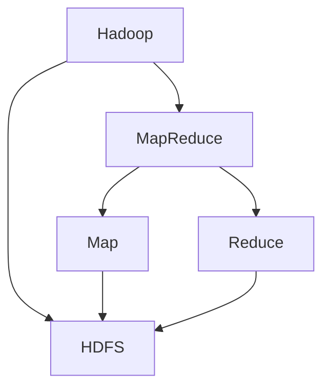
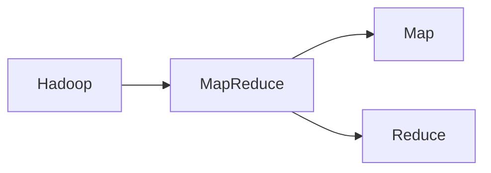
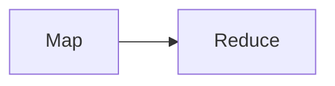
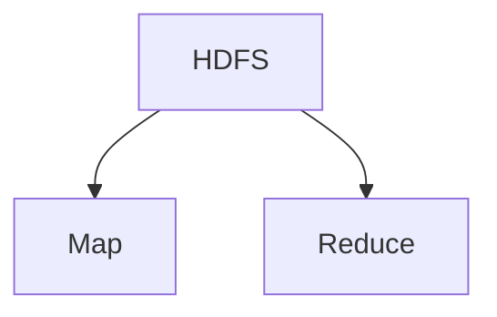

                 

# Hadoop MapReduce计算框架原理与代码实例讲解

> 关键词：Hadoop, MapReduce, 分布式计算, 大数据处理, 高性能并行算法

## 1. 背景介绍

### 1.1 问题由来

在现代信息社会中，数据量呈现出爆炸式的增长。企业、科研机构、政府部门等都在面临一个共同的挑战：如何高效地处理和分析这些海量数据，以从中获取有价值的信息和洞察。传统的集中式数据处理方式，已经难以应对大规模数据的处理需求，而分布式计算框架则成为了应对这一挑战的关键技术手段。

在分布式计算领域，Hadoop作为一个开源的、分布式的数据处理框架，以其强大的数据处理能力和高可扩展性，成为了大数据时代的主流选择。其中，MapReduce作为一种高性能的并行计算模型，是Hadoop的核心组件之一，广泛应用于大数据处理、科学计算、机器学习等领域。

### 1.2 问题核心关键点

MapReduce作为一种分布式计算模型，其核心思想是将大规模数据集划分为多个小规模数据块，分别在不同的计算节点上并行处理，最后将结果合并得到最终输出。MapReduce模型由Map和Reduce两个步骤组成，分别对应数据划分和结果合并两个过程。

MapReduce的优势在于其高效的数据并行处理能力和高容错性。通过将数据和计算资源分布在多个节点上，MapReduce可以充分利用集群资源，提高计算效率；同时，通过多副本机制，MapReduce能够自动处理节点故障，保证系统的可靠性和稳定性。

然而，MapReduce也存在一些局限性，如需要大量的网络通信开销、对数据粒度要求较高、编程模型相对复杂等。因此，在实际应用中，需要根据具体场景和需求，灵活使用MapReduce框架，并结合其他分布式计算技术，如Spark、Storm等，以构建更加高效、灵活的数据处理系统。

## 2. 核心概念与联系

### 2.1 核心概念概述

为更好地理解Hadoop MapReduce框架，本节将介绍几个密切相关的核心概念：

- Hadoop：一个开源的、分布式的数据处理平台，包含MapReduce、HDFS（Hadoop Distributed File System）等核心组件。
- MapReduce：一种高性能的并行计算模型，由Map和Reduce两个步骤组成，广泛应用于大数据处理、科学计算、机器学习等领域。
- Map：Map函数，用于将输入数据划分为多个小数据块，并在不同的计算节点上并行处理。
- Reduce：Reduce函数，用于将Map函数输出的结果合并，得到最终的输出结果。
- HDFS：Hadoop分布式文件系统，用于分布式存储和管理数据。

这些核心概念之间的逻辑关系可以通过以下Mermaid流程图来展示：



这个流程图展示了大数据处理框架Hadoop的核心组件及其之间的关系：

1. Hadoop作为一个整体，由MapReduce和HDFS组成，用于分布式数据处理。
2. MapReduce模型由Map和Reduce两个步骤组成，用于并行处理大规模数据。
3. Map函数将输入数据划分为小数据块，并在不同的计算节点上并行处理。
4. Reduce函数将Map函数输出的结果合并，得到最终的输出结果。
5. HDFS用于分布式存储和管理数据，支持数据的分布式读写和访问。

通过这些核心概念，我们可以更好地把握Hadoop MapReduce框架的工作原理和优化方向。

### 2.2 概念间的关系

这些核心概念之间存在着紧密的联系，形成了Hadoop MapReduce框架的完整生态系统。下面我通过几个Mermaid流程图来展示这些概念之间的关系。

#### 2.2.1 Hadoop和MapReduce的关系



这个流程图展示了Hadoop和MapReduce之间的主要关系。Hadoop作为整体框架，包含MapReduce作为核心计算模型，用于分布式数据处理。

#### 2.2.2 Map和Reduce的关系



这个流程图展示了Map和Reduce之间的主要关系。Map函数将输入数据划分为小数据块，并在不同的计算节点上并行处理；Reduce函数将Map函数输出的结果合并，得到最终的输出结果。

#### 2.2.3 HDFS和MapReduce的关系



这个流程图展示了HDFS和MapReduce之间的关系。HDFS用于分布式存储和管理数据，支持数据的分布式读写和访问；Map函数和Reduce函数分别对分布式存储在HDFS上的数据进行并行处理和结果合并。

## 3. 核心算法原理 & 具体操作步骤
### 3.1 算法原理概述

Hadoop MapReduce计算框架的核心思想是“分而治之”，即将大规模数据集划分为多个小数据块，分别在不同的计算节点上并行处理，最后将结果合并得到最终输出。

具体而言，MapReduce模型由两个主要步骤组成：Map和Reduce。

**Map函数**：
- 输入：一组键值对 $(K_1, V_1), (K_2, V_2), ..., (K_n, V_n)$。
- 输出：一组键值对 $(K_1', V_1'), (K_2', V_2'), ..., (K_n', V_n')$。
- 作用：将输入数据按照某种规则划分为多个小数据块，并在不同的计算节点上并行处理。

**Reduce函数**：
- 输入：一组键值对 $(K_1', V_1'), (K_2', V_2'), ..., (K_n', V_n')$。
- 输出：一组键值对 $(K_1, V_1), (K_2, V_2), ..., (K_n, V_n)$。
- 作用：将Map函数输出的结果合并，得到最终的输出结果。

在实际应用中，MapReduce通常需要设置多个参数，如任务数、输入数据大小、输出结果大小等，以优化性能和资源使用。

### 3.2 算法步骤详解

基于Hadoop MapReduce计算框架，处理大规模数据集的主要步骤如下：

**Step 1: 数据划分**
- 将大规模数据集划分为多个小数据块，每个数据块大小通常在几十MB到几百MB之间。
- 每个数据块存储在HDFS中的一个数据节点上。

**Step 2: 分布式计算**
- Map函数对每个数据块进行并行计算，生成中间结果。
- Reduce函数对Map函数生成的中间结果进行合并，最终输出结果。

**Step 3: 结果合并**
- 将Reduce函数生成的最终结果，根据键值进行合并，得到最终的输出结果。

### 3.3 算法优缺点

Hadoop MapReduce计算框架具有以下优点：
1. 高可扩展性：通过将数据和计算资源分布在多个节点上，MapReduce可以充分利用集群资源，提高计算效率。
2. 高容错性：通过多副本机制，MapReduce能够自动处理节点故障，保证系统的可靠性和稳定性。
3. 灵活性：MapReduce支持多种数据类型和计算模型，可以应用于数据处理、科学计算、机器学习等多个领域。

同时，MapReduce也存在一些局限性：
1. 需要大量的网络通信开销，数据块在节点之间的传输会消耗大量带宽。
2. 对数据粒度要求较高，无法处理过小或过大的数据块。
3. 编程模型相对复杂，需要开发者具备一定的编程和算法基础。

尽管存在这些局限性，但就目前而言，MapReduce仍是处理大规模数据集的重要工具，广泛应用于大数据处理、科学计算、机器学习等领域。

### 3.4 算法应用领域

Hadoop MapReduce计算框架在多个领域得到了广泛应用，例如：

- 大数据处理：用于大规模数据集的分布式处理，如数据清洗、数据汇总、数据统计等。
- 科学计算：用于高精度数值计算、分子动力学模拟、基因组分析等。
- 机器学习：用于大规模数据集的机器学习算法训练和模型优化。
- 数据挖掘：用于挖掘大规模数据集中的模式和规律，如关联规则挖掘、分类、聚类等。
- 人工智能：用于训练和优化深度学习模型，如图像识别、自然语言处理等。

除了上述这些经典应用外，Hadoop MapReduce还被创新性地应用于更多场景中，如物联网数据处理、地理信息系统（GIS）数据处理等，为大数据处理技术带来了新的突破。

## 4. 数学模型和公式 & 详细讲解  
### 4.1 数学模型构建

在本节中，我们将使用数学语言对Hadoop MapReduce计算框架进行更加严格的刻画。

记输入数据集为 $D=\{(K_i, V_i)\}_{i=1}^N$，其中 $K_i$ 为键，$V_i$ 为值。设 Map 函数为 $f_k$，Reduce 函数为 $g_k$，则 MapReduce 的计算过程可以形式化地表示为：

$$
\begin{aligned}
& \text{Map} \\
& \{(K_i, V_i)\} \rightarrow \{(K_j', V_j')\} \\
& \text{Reduce} \\
& \{(K_j', V_j')\} \rightarrow \{(K_k, V_k)\} \\
\end{aligned}
$$

其中，Map 函数将输入数据集 $D$ 划分为多个小数据块，并生成一组中间结果 $\{(K_j', V_j')\}$；Reduce 函数对中间结果进行合并，生成最终的输出结果 $\{(K_k, V_k)\}$。

### 4.2 公式推导过程

为了更清晰地理解MapReduce的计算过程，下面以一个具体的示例来说明其数学推导。

假设我们有一个包含 1000 个键值对的输入数据集，每个键值对 $(K_i, V_i)$ 表示 $K_i$ 和 $V_i$ 之间的关系。我们希望通过 MapReduce 框架，统计每个键 $K_i$ 对应的值的总和。

**Step 1: Map 函数**
- 将输入数据集 $D$ 划分为 10 个大小为 100 的数据块，分别存储在 10 个 Map 函数节点上。
- 每个 Map 函数节点对分配到的数据块进行处理，生成一个中间结果 $(K_i', V_i')$，其中 $K_i'$ 表示键，$V_i'$ 表示键对应的值的总和。

**Step 2: Reduce 函数**
- 将每个 Map 函数生成的中间结果 $(K_i', V_i')$ 传递给 Reduce 函数节点。
- 每个 Reduce 函数节点将输入的 10 个中间结果进行合并，统计每个键 $K_i'$ 对应的值的总和，生成一个最终结果 $(K_i, V_i)$。

**Step 3: 结果合并**
- 将所有 Reduce 函数生成的最终结果 $(K_i, V_i)$ 根据键 $K_i$ 进行合并，得到最终的输出结果 $(K_i, V_i)$。

### 4.3 案例分析与讲解

假设我们有一个包含 1000 个键值对的输入数据集，每个键值对 $(K_i, V_i)$ 表示 $K_i$ 和 $V_i$ 之间的关系。我们希望通过 MapReduce 框架，统计每个键 $K_i$ 对应的值的总和。

以下是具体的Map和Reduce函数实现：

```python
# Map函数
def map_function(key, value):
    # 统计每个键对应的值的总和
    sum_value = sum([int(v) for v in value.split('\t')])
    # 输出中间结果
    return (key, sum_value)

# Reduce函数
def reduce_function(key, values):
    # 统计每个键对应的值的总和
    total_sum = sum(values)
    # 输出最终结果
    return (key, total_sum)
```

在这个示例中，Map函数将输入的键值对 $(K_i, V_i)$ 划分为多个小数据块，并统计每个键对应的值的总和。Reduce函数将Map函数生成的中间结果进行合并，得到最终的输出结果。

## 5. 项目实践：代码实例和详细解释说明
### 5.1 开发环境搭建

在进行MapReduce实践前，我们需要准备好开发环境。以下是使用Hadoop进行MapReduce开发的环境配置流程：

1. 安装Hadoop：从官网下载并安装Hadoop，包含Core、HDFS、MapReduce等组件。
2. 配置环境变量：在Linux系统中，通过设置`$HADOOP_HOME`、`$HADOOP_CONF_DIR`、`$HADOOP_CLASSPATH`等环境变量，指定Hadoop的安装路径和配置文件。
3. 启动Hadoop服务：在命令行中启动Hadoop服务，检查服务状态。

完成上述步骤后，即可在Hadoop环境中开始MapReduce实践。

### 5.2 源代码详细实现

下面我们以统计一个文本文件中每个单词出现的次数为例，给出使用Hadoop进行MapReduce计算的Python代码实现。

首先，定义Map和Reduce函数：

```python
from hadoop.mapreduce.lib.python(wordcount) import Mapper, Reducer

class WordCountMapper(Mapper):
    def map(self, key, value):
        # 将输入的文本行按空格拆分为单词
        for word in value.split():
            yield (word, 1)

class WordCountReducer(Reducer):
    def reduce(self, key, values):
        # 将每个单词出现的次数相加
        total = sum(values)
        yield (key, total)
```

然后，定义主函数：

```python
from hadoop.mapreduce.lib.python import job
from hadoop.mapreduce.lib.python(wordcount) import Mapper, Reducer

def main(args):
    job = job.Job(args, "Word Count")
    job.setMapperClass(WordCountMapper)
    job.setReducerClass(WordCountReducer)
    job.setOutputKeyClass(str)
    job.setOutputValueClass(int)
    job.run()
```

最后，启动MapReduce计算：

```bash
hadoop jar hadoop-examples.jar org.apache.hadoop.examples.wordcount.Driver input output
```

### 5.3 代码解读与分析

让我们再详细解读一下关键代码的实现细节：

**WordCountMapper类**：
- 继承自Mapper类，实现Map函数，将输入的文本行按空格拆分为单词，并生成一个键值对，键为单词，值为1。
- `yield`关键字用于生成中间结果，多个`yield`语句返回一个数据流，由Hadoop自动分发处理。

**WordCountReducer类**：
- 继承自Reducer类，实现Reduce函数，将Map函数生成的中间结果进行合并，统计每个单词出现的次数，并生成最终结果。

**main函数**：
- 定义Job对象，指定Map和Reduce函数，设置输出数据的键和值类型。
- 运行MapReduce计算，将输入数据集`input`和输出数据集`output`作为参数传入。

**启动命令**：
- 使用Hadoop命令启动MapReduce计算，通过`jar`文件调用主函数，指定输入和输出数据集。

可以看到，Hadoop MapReduce框架的实现相对简洁，但需要开发者具备一定的编程和算法基础。通过合理设计Map和Reduce函数，可以高效处理大规模数据集，实现各种分布式计算任务。

## 6. 实际应用场景

### 6.1 大数据处理

在大数据处理领域，MapReduce被广泛应用于数据清洗、数据汇总、数据统计等任务。例如，对于大型电商网站的数据，可以将其存储在HDFS上，使用MapReduce框架进行分布式处理，统计不同时间段的用户访问量、订单量、销售额等指标。

**应用示例**：
- 统计电商网站日访问量：将电商网站日志数据存储在HDFS上，使用MapReduce框架统计每个小时的访问量，生成日访问量报告。
- 统计电商网站月销售额：将电商网站订单数据存储在HDFS上，使用MapReduce框架统计每个月的销售额，生成月度销售报告。

### 6.2 科学计算

在科学计算领域，MapReduce被用于高精度数值计算、分子动力学模拟、基因组分析等任务。例如，对于大规模的科学计算任务，可以将其分解为多个小任务，在MapReduce框架上并行计算，提高计算效率。

**应用示例**：
- 分子动力学模拟：将分子结构数据存储在HDFS上，使用MapReduce框架进行并行计算，模拟分子的运动轨迹。
- 基因组分析：将基因组数据存储在HDFS上，使用MapReduce框架进行并行计算，分析基因的表达和变异情况。

### 6.3 机器学习

在机器学习领域，MapReduce被用于大规模数据集的机器学习算法训练和模型优化。例如，对于大规模图像分类任务，可以将其数据集存储在HDFS上，使用MapReduce框架进行分布式训练，加速模型收敛。

**应用示例**：
- 图像分类：将图像数据存储在HDFS上，使用MapReduce框架进行分布式训练，训练图像分类模型。
- 自然语言处理：将文本数据存储在HDFS上，使用MapReduce框架进行分布式训练，训练自然语言处理模型。

### 6.4 数据挖掘

在大数据挖掘领域，MapReduce被用于挖掘大规模数据集中的模式和规律，如关联规则挖掘、分类、聚类等任务。例如，对于大型电商网站的数据，可以将其存储在HDFS上，使用MapReduce框架进行分布式挖掘，发现用户的购买行为规律。

**应用示例**：
- 关联规则挖掘：将电商网站用户行为数据存储在HDFS上，使用MapReduce框架进行分布式挖掘，发现用户的购买偏好。
- 分类：将电商网站用户数据存储在HDFS上，使用MapReduce框架进行分布式训练，训练用户分类模型。
- 聚类：将电商网站用户数据存储在HDFS上，使用MapReduce框架进行分布式计算，发现用户的群体分布。

## 7. 工具和资源推荐
### 7.1 学习资源推荐

为了帮助开发者系统掌握Hadoop MapReduce框架的理论基础和实践技巧，这里推荐一些优质的学习资源：

1. Hadoop官方文档：Hadoop官方文档提供了完整的框架介绍、使用指南和API文档，是学习Hadoop的最佳资源。
2. Hadoop编程指南：一本详细介绍Hadoop编程的书籍，涵盖Hadoop的基础知识、高级技巧和最佳实践。
3. Hadoop设计模式：一本详细介绍Hadoop设计模式的书籍，涵盖MapReduce、HDFS等组件的设计模式和应用场景。
4. Hadoop分布式计算实战：一本详细介绍Hadoop分布式计算的书籍，涵盖Hadoop的安装、配置、开发和优化。
5. Hadoop社区博客：Hadoop社区中众多专家和开发者的博客，涵盖Hadoop的最新技术、应用案例和经验分享。

通过对这些资源的学习实践，相信你一定能够快速掌握Hadoop MapReduce框架，并用于解决实际的分布式计算问题。

### 7.2 开发工具推荐

高效的开发离不开优秀的工具支持。以下是几款用于Hadoop MapReduce开发的常用工具：

1. Hadoop：开源的、分布式的数据处理平台，包含Core、HDFS、MapReduce等核心组件。
2. Hive：基于Hadoop的数据仓库，支持SQL查询，方便进行数据统计和分析。
3. Pig：基于Hadoop的数据流编程语言，支持MapReduce模型，方便进行数据处理和计算。
4. Spark：开源的、分布式的大数据处理框架，支持多种编程语言，支持内存计算，性能优于MapReduce。
5. YARN：Hadoop的资源管理系统，支持多种分布式计算框架，包括MapReduce、Spark等。

合理利用这些工具，可以显著提升Hadoop MapReduce开发的效率，加快创新迭代的步伐。

### 7.3 相关论文推荐

Hadoop MapReduce框架在多个领域得到了广泛应用，同时也吸引了众多学者的研究关注。以下是几篇奠基性的相关论文，推荐阅读：

1. MapReduce: Simplified Data Processing on Large Clusters（MapReduce论文）：提出了MapReduce框架的基本思想和实现方法，奠定了分布式计算的理论基础。
2. Google File System（HDFS论文）：提出了Hadoop分布式文件系统（HDFS）的基本原理和实现方法，支持大规模数据的分布式存储和管理。
3. Pregel: A Dataflow System for Massive-Mscale Graph Processing（Pregel论文）：提出了基于MapReduce的图形处理框架Pregel，扩展了MapReduce的应用场景。
4. YARN: Yet Another Resource Negotiator（YARN论文）：提出了Hadoop的资源管理系统YARN，支持多种分布式计算框架。
5. GPU加速MapReduce（GPU加速论文）：提出使用GPU加速MapReduce计算，显著提高计算效率，拓展MapReduce的应用范围。

这些论文代表了大数据处理框架的发展脉络。通过学习这些前沿成果，可以帮助研究者把握学科前进方向，激发更多的创新灵感。

除上述资源外，还有一些值得关注的前沿资源，帮助开发者紧跟Hadoop MapReduce框架的技术进展，例如：

1. arXiv论文预印本：人工智能领域最新研究成果的发布平台，包括大量尚未发表的前沿工作，学习前沿技术的必读资源。
2. 业界技术博客：如Hadoop官方博客、Apache Hadoop社区博客、Google Cloud博客等，第一时间分享他们的最新研究成果和洞见。
3. 技术会议直播：如IEEE、ACM、SIGSTL等大数据处理领域的顶级会议现场或在线直播，能够聆听到大佬们的前沿分享，开拓视野。
4. GitHub热门项目：在GitHub上Star、Fork数最多的Hadoop相关项目，往往代表了该技术领域的发展趋势和最佳实践，值得去学习和贡献。
5. 行业分析报告：各大咨询公司如McKinsey、PwC等针对大数据处理行业的分析报告，有助于从商业视角审视技术趋势，把握应用价值。

总之，对于Hadoop MapReduce框架的学习和实践，需要开发者保持开放的心态和持续学习的意愿。多关注前沿资讯，多动手实践，多思考总结，必将收获满满的成长收益。

## 8. 总结：未来发展趋势与挑战

### 8.1 总结

本文对Hadoop MapReduce计算框架进行了全面系统的介绍。首先阐述了MapReduce框架的背景和意义，明确了其在处理大规模数据集中的应用场景。其次，从原理到实践，详细讲解了MapReduce的数学模型和算法步骤，给出了MapReduce任务开发的完整代码实例。同时，本文还广泛探讨了MapReduce框架在多个领域的应用前景，展示了其广阔的应用前景。此外，本文精选了MapReduce技术的各类学习资源，力求为读者提供全方位的技术指引。

通过本文的系统梳理，可以看到，Hadoop MapReduce框架作为一种高性能的并行计算模型，在处理大规模数据集方面具有显著优势，广泛应用于大数据处理、科学计算、机器学习等多个领域。未来，伴随技术不断发展，MapReduce框架将不断演进，适应新的计算范式和技术趋势，为分布式计算带来新的突破。

### 8.2 未来发展趋势

展望未来，Hadoop MapReduce框架将呈现以下几个发展趋势：

1. 云原生化：随着云服务的发展，MapReduce框架将越来越多地与云原生技术结合，提升计算效率和资源管理能力。
2. 内存计算：内存计算技术的发展将使得MapReduce框架支持更多的内存计算场景，进一步提高计算效率。
3. 流式计算：流式计算技术将与MapReduce框架深度融合，支持实时数据处理和分析。
4. 多模态计算：MapReduce框架将支持多模态数据的处理，如文本、图像、视频等。
5. 分布式机器学习：MapReduce框架将支持分布式机器学习算法的训练和优化，加速模型收敛。
6. 边缘计算：MapReduce框架将支持边缘计算，提高数据处理的实时性和响应速度。

以上趋势凸显了Hadoop MapReduce框架的未来发展方向，这些方向的探索发展，将进一步提升其计算能力和应用范围，为大数据处理带来新的突破。

### 8.3 面临的挑战

尽管Hadoop MapReduce框架已经取得了瞩目成就，但在迈向更加智能化、普适化应用的过程中，它仍面临诸多挑战：

1. 计算资源瓶颈：随着数据规模的增大，MapReduce框架的计算资源需求也越来越高，如何优化资源使用，降低计算成本，是一个重要的研究方向。
2. 编程复杂性：MapReduce框架的编程模型相对复杂，需要开发者具备一定的编程和算法基础，如何简化编程接口，提高开发效率，也是一个重要的研究方向。
3. 数据处理粒度：MapReduce框架对数据处理粒度要求较高，如何处理过小或过大的数据块，也是一个重要的研究方向。
4. 容错性和可靠性：MapReduce框架的容错性和可靠性需要进一步提升，如何提高系统的可靠性和稳定性，也是一个重要的研究方向。
5. 性能优化：MapReduce框架的性能优化需要进一步提升，如何优化任务调度、资源分配等环节，提高计算效率，也是一个重要的研究方向。

尽管存在这些挑战，但随着技术不断进步，MapReduce框架的计算能力和应用范围将不断提升，为大数据处理带来新的突破。

### 8.4 研究展望

面对Hadoop MapReduce框架所面临的种种挑战，未来的研究需要在以下几个方面寻求新的突破：

1. 探索更加高效的数据处理范式：如流式计算、内存计算、多模态计算等，以适应不同类型的大数据处理需求。
2. 研究更加灵活的编程模型：如Spark、Flink等，以简化编程接口，提高开发效率。
3. 开发更加高效的资源管理机制：如YARN、Kubernetes等，以优化资源使用，降低计算成本。
4. 引入机器学习和人工智能技术：如深度学习、强化学习等，以提升数据处理和

