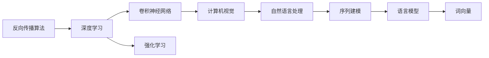

                 

# 《Hinton、LeCun、Bengio对AI算法的贡献》

> 关键词：Yann LeCun, Yoshua Bengio, George Hinton, 深度学习, 反向传播算法, 卷积神经网络, 自然语言处理, 计算机视觉, 强化学习

## 1. 背景介绍

随着人工智能（AI）技术的快速发展，深度学习（Deep Learning）成为推动AI突破的关键技术之一。深度学习通过模拟人类大脑的结构和功能，学习从大量数据中提取高层次的抽象特征，从而实现复杂模式识别和预测任务。而在深度学习的奠基过程中，三位关键人物——Yann LeCun、Yoshua Bengio和George Hinton（简称"YBB"），以其在算法理论、架构设计和应用实践上的杰出贡献，引领了这一领域的发展方向。

### 1.1 深度学习的兴起

20世纪80年代，深度学习技术开始萌芽，但早期由于计算资源的限制和算法的不成熟，并未引起广泛关注。直到2000年前后，随着GPU等硬件设备的普及，以及深度神经网络（DNN）算法的逐步完善，深度学习技术得以在图像识别、语音处理、自然语言处理等诸多领域取得突破，成为AI研究的核心方向。

### 1.2 YBB对深度学习发展的贡献

YBB的贡献不仅限于算法和技术，还包括对AI教育、应用推广和学术研究等多方面的推动，奠定了深度学习在AI领域的核心地位。他们对深度学习的理解和推动，为未来的AI研究和应用奠定了坚实的基础。

## 2. 核心概念与联系

### 2.1 核心概念概述

- **反向传播算法**：用于训练神经网络的核心算法，通过链式法则计算梯度，使模型参数最小化损失函数，从而实现学习。
- **卷积神经网络（CNN）**：针对图像识别等视觉任务设计的神经网络结构，通过卷积操作提取局部特征，显著提升模型性能。
- **自然语言处理（NLP）**：使计算机能够理解、处理和生成人类语言的技术，涉及词向量、语言模型、序列建模等关键问题。
- **计算机视觉**：使计算机能够从图像和视频中提取和理解视觉信息的技术，包括图像分类、目标检测、图像生成等任务。
- **强化学习**：通过与环境交互，使智能体学习最优策略以实现目标，广泛应用于游戏、机器人控制等任务。

### 2.2 核心概念之间的关系

这些核心概念之间存在着密切的联系，共同构成了深度学习的基础框架。以下是通过Mermaid流程图展示的核心概念之间的联系：



这个流程图展示了深度学习中不同概念之间的关系：

1. **反向传播算法**是深度学习训练模型的基础。
2. **卷积神经网络**在计算机视觉领域得到广泛应用。
3. **自然语言处理**通过序列建模、语言模型和词向量等技术，使计算机能够处理和理解自然语言。
4. **强化学习**通过与环境的交互学习最优策略，实现智能体的自动控制。

### 2.3 核心概念的整体架构

在深度学习领域，YBB对核心概念的架构设计也做出了重要贡献。以Yann LeCun在计算机视觉领域的贡献为例，通过反向传播算法优化CNN架构，实现了图像识别领域的重大突破。Yoshua Bengio通过引入深度学习技术，推动了NLP领域的进步。George Hinton在神经网络模型和优化算法方面的创新，为深度学习的基础研究打下了坚实的基础。

## 3. 核心算法原理 & 具体操作步骤

### 3.1 算法原理概述

深度学习的核心在于通过反向传播算法训练神经网络，使模型学习到数据的表示。这一过程涉及到以下几个关键步骤：

1. **前向传播**：将输入数据传递给网络，通过各层神经元的计算，生成输出结果。
2. **损失计算**：计算输出结果与真实标签之间的差异，通常使用交叉熵、均方误差等损失函数。
3. **反向传播**：通过链式法则计算梯度，更新模型参数。
4. **迭代优化**：重复以上步骤，直至模型收敛。

### 3.2 算法步骤详解

以Yann LeCun在计算机视觉领域的工作为例，详细说明CNN的训练过程：

**Step 1: 数据准备**
- 收集标注的图像数据集。
- 将图像数据按比例分为训练集、验证集和测试集。

**Step 2: 模型构建**
- 设计CNN架构，包括卷积层、池化层、全连接层等。
- 定义损失函数，如交叉熵损失。
- 设置优化器，如Adam、SGD等。

**Step 3: 模型训练**
- 使用训练集数据进行前向传播和损失计算。
- 反向传播计算梯度。
- 更新模型参数。
- 在验证集上评估模型性能，根据性能调整学习率、批次大小等参数。
- 重复以上步骤直至模型收敛。

**Step 4: 模型测试**
- 在测试集上评估模型性能，对比训练前后的精度提升。
- 使用微调技术，优化模型在新数据上的表现。

### 3.3 算法优缺点

深度学习算法具有以下优点：
1. 高精度：通过多层网络结构，可以学习到复杂的数据表示。
2. 自适应：能够自动调整网络结构，适应不同任务的需求。
3. 通用性：在多个领域（如图像、语音、自然语言）都有广泛应用。
4. 可扩展性：能够通过增加网络层数和节点数，提升模型性能。

同时，深度学习算法也存在一些缺点：
1. 计算资源需求高：需要大量的计算资源进行模型训练。
2. 模型复杂度高：难以理解和调试，存在“黑盒”问题。
3. 过拟合风险大：在训练数据不足的情况下，容易发生过拟合。
4. 数据依赖性强：依赖高质量的数据进行训练，数据获取成本高。

### 3.4 算法应用领域

深度学习算法已经在计算机视觉、自然语言处理、语音识别、游戏AI等多个领域得到了广泛应用：

- **计算机视觉**：通过卷积神经网络实现图像分类、目标检测、人脸识别等任务。
- **自然语言处理**：通过循环神经网络（RNN）、长短时记忆网络（LSTM）等模型处理文本数据，实现机器翻译、情感分析、文本生成等任务。
- **语音识别**：通过深度神经网络实现语音识别、语音合成等任务。
- **游戏AI**：通过强化学习技术，使计算机能够在复杂游戏中自主决策。

## 4. 数学模型和公式 & 详细讲解 & 举例说明

### 4.1 数学模型构建

深度学习的数学模型可以简化为以下形式：

$$
\min_{\theta} L(\theta) = \frac{1}{N}\sum_{i=1}^{N} \ell(M_{\theta}(x_i), y_i)
$$

其中 $M_{\theta}$ 表示神经网络模型，$x_i$ 和 $y_i$ 分别表示输入和标签，$\ell$ 表示损失函数。

### 4.2 公式推导过程

以Yann LeCun在卷积神经网络（CNN）中的工作为例，详细推导CNN的前向传播和反向传播过程：

**前向传播**
$$
\mathbf{z}^{[1]} = \mathbf{W}^{[1]}\mathbf{x} + \mathbf{b}^{[1]}
$$
$$
\mathbf{a}^{[1]} = \sigma(\mathbf{z}^{[1]})
$$
$$
\mathbf{z}^{[2]} = \mathbf{W}^{[2]}\mathbf{a}^{[1]} + \mathbf{b}^{[2]}
$$
$$
\mathbf{a}^{[2]} = \sigma(\mathbf{z}^{[2]})
$$
$$
\cdots
$$
$$
\mathbf{z}^{[L]} = \mathbf{W}^{[L]}\mathbf{a}^{[L-1]} + \mathbf{b}^{[L]}
$$
$$
\mathbf{a}^{[L]} = \sigma(\mathbf{z}^{[L]})
$$

**反向传播**
$$
\frac{\partial L}{\partial \mathbf{W}^{[L]}} = \frac{\partial L}{\partial \mathbf{z}^{[L]}} \cdot \frac{\partial \mathbf{z}^{[L]}}{\partial \mathbf{a}^{[L]}} \cdot \frac{\partial \mathbf{a}^{[L]}}{\partial \mathbf{z}^{[L]}}
$$
$$
\frac{\partial L}{\partial \mathbf{b}^{[L]}} = \frac{\partial L}{\partial \mathbf{z}^{[L]}}
$$
$$
\frac{\partial L}{\partial \mathbf{a}^{[L-1]}} = \frac{\partial L}{\partial \mathbf{z}^{[L]}} \cdot \frac{\partial \mathbf{z}^{[L]}}{\partial \mathbf{a}^{[L]}} \cdot \frac{\partial \mathbf{a}^{[L]}}{\partial \mathbf{a}^{[L-1]}}
$$
$$
\cdots
$$
$$
\frac{\partial L}{\partial \mathbf{a}^{[1]}} = \frac{\partial L}{\partial \mathbf{z}^{[2]}} \cdot \frac{\partial \mathbf{z}^{[2]}}{\partial \mathbf{a}^{[1]}}
$$
$$
\frac{\partial L}{\partial \mathbf{x}} = \frac{\partial L}{\partial \mathbf{z}^{[1]}} \cdot \frac{\partial \mathbf{z}^{[1]}}{\partial \mathbf{a}^{[1]}}
$$

### 4.3 案例分析与讲解

以Yoshua Bengio在自然语言处理（NLP）中的工作为例，分析其对深度学习模型的贡献：

- **词向量**：通过Word2Vec、GloVe等模型，将文本转换为向量表示，使得计算机能够处理自然语言数据。
- **语言模型**：通过RNN、LSTM、GRU等模型，学习文本中的序列关系，实现机器翻译、文本生成等任务。
- **序列建模**：通过注意力机制、Transformer等技术，提升模型对序列数据的处理能力，实现更高效的翻译和生成。

## 5. 项目实践：代码实例和详细解释说明

### 5.1 开发环境搭建

要进行深度学习项目的开发，需要安装并配置以下开发环境：

1. **Python**：安装3.x版本，建议使用Anaconda进行环境管理。
2. **深度学习框架**：选择TensorFlow或PyTorch，使用pip进行安装。
3. **GPU支持**：安装CUDA和cuDNN，确保能够使用GPU进行加速计算。
4. **开发工具**：安装Jupyter Notebook、Git、GitHub Desktop等工具。

### 5.2 源代码详细实现

以下是一个简单的CNN模型在TensorFlow中的实现代码：

```python
import tensorflow as tf

# 定义模型参数
learning_rate = 0.001
num_epochs = 10
batch_size = 64
input_size = 784
output_size = 10
hidden_size = 128
num_classes = 10

# 定义模型结构
model = tf.keras.models.Sequential([
    tf.keras.layers.Flatten(input_shape=(28, 28)),
    tf.keras.layers.Dense(hidden_size, activation='relu'),
    tf.keras.layers.Dense(num_classes, activation='softmax')
])

# 定义优化器和损失函数
optimizer = tf.keras.optimizers.Adam(learning_rate)
loss = tf.keras.losses.SparseCategoricalCrossentropy()

# 编译模型
model.compile(optimizer=optimizer, loss=loss, metrics=['accuracy'])

# 训练模型
model.fit(x_train, y_train, epochs=num_epochs, batch_size=batch_size, validation_data=(x_val, y_val))

# 测试模型
test_loss, test_acc = model.evaluate(x_test, y_test)
print('Test Accuracy:', test_acc)
```

### 5.3 代码解读与分析

在上述代码中，我们使用了TensorFlow框架构建了一个简单的CNN模型，用于手写数字分类。具体步骤如下：

1. **定义模型参数**：包括学习率、训练轮数、批次大小、输入尺寸、输出尺寸、隐藏层尺寸和类别数。
2. **定义模型结构**：使用Sequential模型，包含Flatten层（将输入转换为向量）、Dense层（全连接层）和Softmax激活函数。
3. **定义优化器和损失函数**：使用Adam优化器和SparseCategoricalCrossentropy损失函数。
4. **编译模型**：将优化器、损失函数和评估指标传递给模型。
5. **训练模型**：使用训练集进行前向传播和反向传播，优化模型参数，并在验证集上评估模型性能。
6. **测试模型**：在测试集上评估模型性能，输出准确率。

## 6. 实际应用场景

深度学习算法已经在多个实际应用场景中得到广泛应用，以下是几个典型案例：

### 6.1 自动驾驶

自动驾驶技术依赖于计算机视觉和深度学习，通过摄像头、雷达等传感器获取实时数据，进行目标检测、路径规划和行为决策，实现自动驾驶。

### 6.2 医疗诊断

深度学习在医学影像分析、疾病诊断等领域具有重要应用价值，通过卷积神经网络进行图像识别，辅助医生进行诊断。

### 6.3 金融预测

深度学习在金融领域可以用于股票预测、信用评估等任务，通过学习历史数据和市场动态，预测未来趋势。

### 6.4 游戏AI

深度学习在电子游戏AI中广泛应用，通过强化学习技术，使计算机能够在复杂游戏中自主决策，提升游戏体验。

## 7. 工具和资源推荐

### 7.1 学习资源推荐

1. **深度学习课程**：如斯坦福大学的CS231n、MIT的Deep Learning with Python等课程，深入学习深度学习理论和实践。
2. **在线资源**：如Coursera、Udacity、edX等平台上的深度学习相关课程，提供丰富的学习资源和实践机会。
3. **开源项目**：如TensorFlow、PyTorch等深度学习框架的官方文档和示例代码，帮助快速上手实践。
4. **书籍**：如《深度学习》（Ian Goodfellow著）、《Python深度学习》（Francois Chollet著）等书籍，提供系统深入的深度学习知识体系。

### 7.2 开发工具推荐

1. **Python**：作为深度学习开发的主流语言，Python提供了丰富的库和工具，支持快速原型开发。
2. **深度学习框架**：TensorFlow和PyTorch是目前最流行的深度学习框架，提供强大的计算图和自动微分功能。
3. **Jupyter Notebook**：提供了交互式开发环境，便于编写和测试代码。
4. **Git和GitHub**：版本控制工具和代码托管平台，帮助开发者协作和共享代码。
5. **GPU支持**：如NVIDIA的CUDA和cuDNN，提供GPU加速计算能力，提升模型训练效率。

### 7.3 相关论文推荐

深度学习领域的经典论文如下：

1. Yann LeCun的《Backpropagation Applied to Handwritten Zip Code Recognition》
2. Yoshua Bengio的《Learning Deep Architectures for AI》
3. George Hinton的《A Neural Probabilistic Language Model》
4. Yann LeCun的《Convolutional Networks for Images, Speech and Time Series》
5. Yoshua Bengio的《The Computation of Language》

## 8. 总结：未来发展趋势与挑战

### 8.1 研究成果总结

深度学习算法在计算机视觉、自然语言处理、语音识别、游戏AI等多个领域取得重大突破，成为AI技术发展的核心驱动力。YBB在算法理论、架构设计和应用实践上的杰出贡献，奠定了深度学习在AI领域的核心地位。

### 8.2 未来发展趋势

未来深度学习的发展趋势包括：

1. **自动化**：通过自动化机器学习（AutoML）技术，加速模型选择和超参数优化。
2. **可解释性**：提升模型决策的可解释性，便于理解和调试。
3. **多模态学习**：将视觉、语音、文本等多种数据融合，提升模型的泛化能力。
4. **小样本学习**：在数据量较少的情况下，通过迁移学习和少样本学习，实现高效建模。
5. **边缘计算**：将深度学习模型部署到边缘设备，提升实时性和效率。

### 8.3 面临的挑战

深度学习算法仍面临以下挑战：

1. **计算资源**：模型训练和推理需要大量计算资源，制约模型的规模和速度。
2. **数据依赖**：依赖高质量的数据进行训练，数据获取和标注成本高。
3. **模型复杂性**：模型过于复杂，难以解释和调试，存在“黑盒”问题。
4. **泛化能力**：模型在新数据上的泛化能力有限，容易发生过拟合。

### 8.4 研究展望

未来深度学习的研究方向包括：

1. **理论突破**：进一步研究深度学习算法的基础理论和优化算法，提升模型性能和稳定性。
2. **应用创新**：探索深度学习在医疗、金融、制造等领域的创新应用，推动产业升级。
3. **技术融合**：将深度学习与其他技术（如强化学习、符号推理）进行融合，提升模型的综合能力。
4. **社会影响**：研究深度学习在伦理、安全、隐私等方面的影响，确保技术的负责任应用。

## 9. 附录：常见问题与解答

**Q1: 深度学习算法的计算资源需求高，如何提升模型的训练和推理效率？**

A: 采用GPU、TPU等高性能硬件设备，提高计算能力。同时，使用模型压缩、剪枝、量化等技术，优化模型结构和参数，减小计算量。

**Q2: 深度学习算法的模型复杂度高，如何提升模型的可解释性？**

A: 使用可视化工具（如TensorBoard）查看模型内部状态，理解模型的决策过程。引入注意力机制、可解释性模型（如LIME、SHAP）等技术，提高模型的可解释性。

**Q3: 深度学习算法的泛化能力有限，如何提高模型的泛化能力？**

A: 增加数据集的多样性，丰富数据分布。使用正则化、dropout、early stopping等技术，防止过拟合。引入迁移学习、多模态学习等技术，提升模型泛化能力。

**Q4: 深度学习算法的数据依赖性强，如何降低数据依赖性？**

A: 使用无监督学习、半监督学习等方法，降低对标注数据的需求。引入生成对抗网络（GAN）等技术，生成模拟数据进行训练。

**Q5: 深度学习算法在实际应用中面临哪些伦理和法律问题？**

A: 深度学习算法在医疗、金融等领域的应用，涉及隐私保护、公平性、安全性等问题。需制定相应的法律法规，确保技术的负责任应用。

本文通过系统梳理深度学习算法的核心概念、算法原理、应用实践，展示了Yann LeCun、Yoshua Bengio和George Hinton在深度学习领域的杰出贡献，并探讨了未来发展的方向和面临的挑战，希望对深度学习的学习和研究提供有益参考。

---

作者：禅与计算机程序设计艺术 / Zen and the Art of Computer Programming

