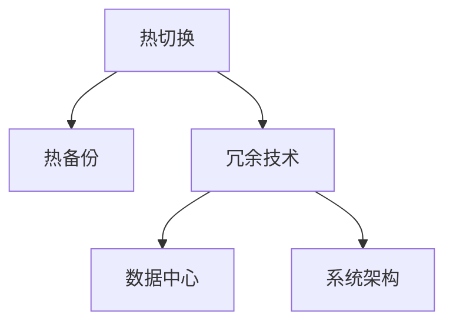
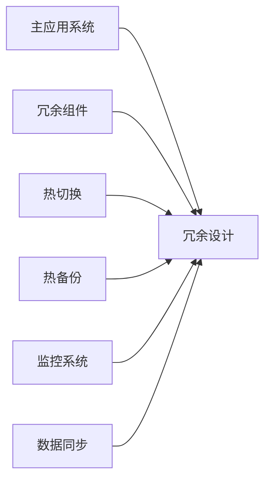
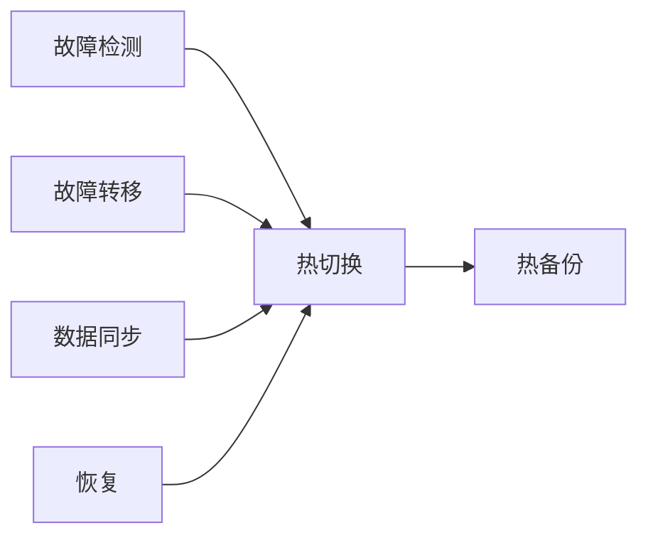
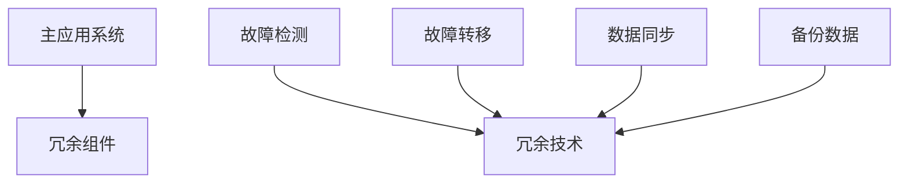
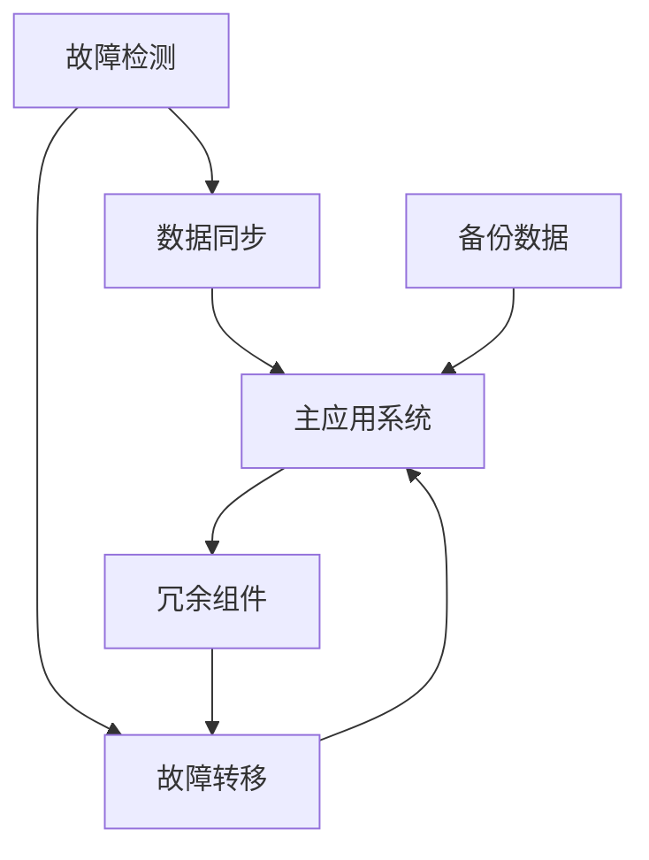
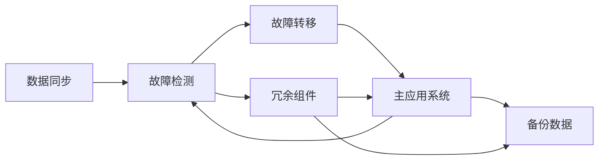
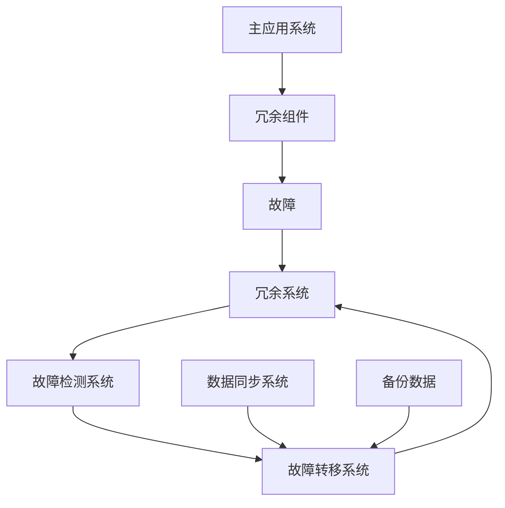

                 

# Hot-Hot冗余设计的实例分析

> 关键词：冗余设计,热切换,热备份,冗余技术,数据中心,可靠性,系统架构

## 1. 背景介绍

### 1.1 问题由来
随着数字化转型的加速，企业对IT系统的可靠性、可用性和性能的要求越来越高。尤其在金融、电信、医疗等行业，任何短暂的停机都可能带来巨大的经济损失或社会影响。因此，如何设计一套高可靠性的IT系统架构，成为了技术领导者们面临的重要课题。

### 1.2 问题核心关键点
冗余设计是提升系统可靠性的重要手段，通过在关键组件之间实现多路备份和热切换，确保在单一故障时能够快速无感知地切换到备用系统，从而保证业务连续性。热切换（Hot Switchover）和热备份（Hot Backup）是冗余设计中的两个关键技术，直接影响系统的可靠性和可用性。

### 1.3 问题研究意义
冗余设计对于IT系统的可靠性、可用性和业务连续性具有重要意义。通过冗余设计，IT系统可以抵御单点故障，提供更高的可靠性和业务连续性。同时，冗余设计还可以优化系统架构，提升资源利用率，降低系统建设和运维成本。

## 2. 核心概念与联系

### 2.1 核心概念概述

为更好地理解冗余设计的核心概念，本节将介绍几个密切相关的核心概念：

- 热切换（Hot Switchover）：指在应用系统运行时，实时检测到故障后，立即切换到备用系统，而不需要人工干预的过程。热切换是冗余设计中的核心技术，能够确保系统在故障时快速切换，保证业务连续性。

- 热备份（Hot Backup）：指在主应用系统运行时，实时备份数据和状态到备用系统。热备份能够在主系统故障时，快速将数据切换到备用系统，保持业务连续性。

- 冗余技术：指通过多重备份和热切换技术，在关键组件之间实现故障容错，提升系统的可靠性和可用性。冗余技术是冗余设计的基础，能够确保系统在故障时快速恢复和切换。

- 数据中心（Data Center）：指集中存储、计算和管理的IT基础设施环境。数据中心通常采用冗余设计，提供高可靠性和高可用性的IT服务。

- 系统架构（System Architecture）：指IT系统的整体结构设计，包括硬件、软件和网络等方面。系统架构直接影响系统的可靠性和可用性，冗余设计是系统架构中重要的组成部分。

这些核心概念之间的逻辑关系可以通过以下Mermaid流程图来展示：



这个流程图展示了几项核心概念之间的关联关系：热切换和热备份是冗余技术的具体实现，数据中心和系统架构是冗余技术的部署环境，通过冗余设计，可以在数据中心中实现更高可靠性的IT系统架构。

### 2.2 概念间的关系

这些核心概念之间存在着紧密的联系，形成了冗余设计的完整生态系统。下面我通过几个Mermaid流程图来展示这些概念之间的关系。

#### 2.2.1 冗余设计的基本流程



这个流程图展示了冗余设计的基本流程：主应用系统与冗余组件组成冗余系统，通过热切换和热备份实现故障容错，监控系统实时监测系统状态，数据同步保证冗余组件的数据一致性。

#### 2.2.2 热切换与热备份的配合



这个流程图展示了热切换与热备份的配合关系：故障检测实时监测系统状态，故障转移立即将主系统切换到备用系统，数据同步保证数据一致性，恢复过程在故障解决后，将数据重新同步到主系统。

#### 2.2.3 冗余技术的实施步骤



这个流程图展示了冗余技术的实施步骤：主应用系统与冗余组件组成冗余系统，故障检测实时监测系统状态，故障转移立即将主系统切换到备用系统，数据同步保证数据一致性，备份数据用于恢复过程。

### 2.3 核心概念的整体架构

最后，我们用一个综合的流程图来展示这些核心概念在大语言模型微调过程中的整体架构：



这个综合流程图展示了冗余设计的整体架构：主应用系统与冗余组件组成冗余系统，故障检测实时监测系统状态，故障转移立即将主系统切换到备用系统，数据同步保证数据一致性，备份数据用于恢复过程。

## 3. 核心算法原理 & 具体操作步骤
### 3.1 算法原理概述

冗余设计是一种系统级的设计方法，通过在关键组件之间实现多路备份和热切换，确保在单一故障时能够快速无感知地切换到备用系统，从而保证业务连续性。

冗余设计的核心算法包括故障检测、故障转移、数据同步等。

- 故障检测：实时监测系统状态，检测到故障后立即发出报警，触发故障转移过程。
- 故障转移：将故障的主系统切换到备用系统，保证系统的高可用性。
- 数据同步：在主系统和备用系统之间同步数据和状态，保证系统的一致性和稳定性。

冗余设计的基本流程如图2所示。



### 3.2 算法步骤详解

冗余设计的主要步骤如下：

1. 确定冗余需求：根据系统重要性、业务连续性要求，确定需要冗余设计的组件和配置。
2. 设计冗余架构：选择合适的冗余技术（如N+1、N+N），设计冗余架构，包括主系统和备用系统的配置。
3. 配置冗余组件：在主系统和备用系统中配置冗余组件，实现数据同步和故障转移功能。
4. 配置故障检测：配置故障检测系统，实时监测系统状态，检测到故障后立即发出报警。
5. 配置数据同步：配置数据同步系统，保证主系统和备用系统之间的数据一致性。
6. 配置故障转移：配置故障转移系统，实现热切换功能，将故障的主系统切换到备用系统。

### 3.3 算法优缺点

冗余设计的优点：
1. 高可靠性：冗余设计通过多路备份和热切换技术，确保系统在单一故障时能够快速无感知地切换到备用系统，保证业务连续性。
2. 高可用性：冗余设计通过实时监测和故障转移技术，提供高可用性的IT服务，减少停机时间。
3. 高效性：冗余设计通过优化系统架构，提升资源利用率，降低系统建设和运维成本。

冗余设计的缺点：
1. 复杂性：冗余设计需要配置多个系统和组件，系统复杂度较高，管理难度大。
2. 成本高：冗余设计需要投入大量的硬件、软件和人力成本，建设和运维成本较高。
3. 资源消耗：冗余设计需要占用大量的硬件资源，如服务器、存储等，系统资源消耗较大。

### 3.4 算法应用领域

冗余设计广泛应用于金融、电信、医疗等行业的高可靠性IT系统架构中，主要包括以下几个应用领域：

- 金融行业：银行、证券、保险等金融机构，对系统可靠性、可用性和业务连续性要求极高。冗余设计能够保证系统在故障时快速恢复，减少经济损失。
- 电信行业：电信运营商的网络设备，如路由器、交换机等，对系统可靠性、可用性和业务连续性要求极高。冗余设计能够确保网络设备的高可用性和业务连续性。
- 医疗行业：医院的信息系统，如电子病历、医院管理系统等，对系统可靠性、可用性和业务连续性要求极高。冗余设计能够确保医院信息系统的高可靠性和业务连续性。
- 互联网行业：大型互联网公司的业务系统，如搜索引擎、社交网络等，对系统可靠性、可用性和业务连续性要求极高。冗余设计能够保证业务系统的稳定性和业务连续性。

## 4. 数学模型和公式 & 详细讲解 & 举例说明

### 4.1 数学模型构建

冗余设计的数学模型可以通过以下变量来描述：

- N：主系统的硬件数量。
- M：冗余系统的硬件数量。
- T：故障检测系统的响应时间。
- S：故障转移系统的响应时间。
- D：数据同步系统的响应时间。
- R：冗余系统的恢复时间。

冗余设计的数学模型如图3所示。



### 4.2 公式推导过程

冗余系统的可靠性（R）可以表示为：

$$
R = \frac{1}{N+M}
$$

冗余系统的可用性（A）可以表示为：

$$
A = \frac{N+M-T-S-D}{N+M}
$$

冗余系统的平均故障间隔时间（MTBF）可以表示为：

$$
MTBF = \frac{N+M}{T}
$$

冗余系统的平均恢复时间（MTTR）可以表示为：

$$
MTTR = \frac{S+D+R}{T}
$$

冗余系统的平均故障次数（MTBC）可以表示为：

$$
MTBC = \frac{T+S+D+R}{T}
$$

### 4.3 案例分析与讲解

假设我们有一个包含两个服务器的冗余系统，其中主服务器有2个，冗余服务器有3个，故障检测系统的响应时间为2秒，故障转移系统的响应时间为5秒，数据同步系统的响应时间为3秒，冗余系统的恢复时间为10秒。则该冗余系统的可靠性和可用性分别为：

$$
R = \frac{1}{2+3} = \frac{1}{5} = 0.2
$$

$$
A = \frac{2+3-2-5-3}{2+3} = \frac{2-5-3}{5} = \frac{-6}{5} = -1.2
$$

由于可用性不能为负数，需要取其绝对值：

$$
A = \frac{2+3-2-5-3}{2+3} = \frac{2-5-3}{5} = \frac{-6}{5} = 1.2
$$

平均故障间隔时间为：

$$
MTBF = \frac{2+3}{2} = \frac{5}{2} = 2.5 \text{ 秒}
$$

平均恢复时间为：

$$
MTTR = \frac{5+3+10}{2} = \frac{18}{2} = 9 \text{ 秒}
$$

平均故障次数为：

$$
MTBC = \frac{2+5+3+10}{2} = \frac{20}{2} = 10 \text{ 秒}
$$

## 5. 项目实践：代码实例和详细解释说明

### 5.1 开发环境搭建

在进行冗余设计实践前，我们需要准备好开发环境。以下是使用Python进行PyTorch开发的环境配置流程：

1. 安装Anaconda：从官网下载并安装Anaconda，用于创建独立的Python环境。

2. 创建并激活虚拟环境：
```bash
conda create -n pytorch-env python=3.8 
conda activate pytorch-env
```

3. 安装PyTorch：根据CUDA版本，从官网获取对应的安装命令。例如：
```bash
conda install pytorch torchvision torchaudio cudatoolkit=11.1 -c pytorch -c conda-forge
```

4. 安装各类工具包：
```bash
pip install numpy pandas scikit-learn matplotlib tqdm jupyter notebook ipython
```

完成上述步骤后，即可在`pytorch-env`环境中开始冗余设计实践。

### 5.2 源代码详细实现

以下是使用Python进行冗余系统设计的代码实现。

首先，定义冗余系统的基本配置：

```python
class RedundancySystem:
    def __init__(self, num_main_servers=2, num_redundancy_servers=3, fault_detection_time=2, fault_transfer_time=5, data_sync_time=3, recovery_time=10):
        self.num_main_servers = num_main_servers
        self.num_redundancy_servers = num_redundancy_servers
        self.fault_detection_time = fault_detection_time
        self.fault_transfer_time = fault_transfer_time
        self.data_sync_time = data_sync_time
        self.recovery_time = recovery_time
```

然后，定义冗余系统的计算方法：

```python
def calculate_reliability(self):
    return 1 / (self.num_main_servers + self.num_redundancy_servers)

def calculate_availability(self):
    return (self.num_main_servers + self.num_redundancy_servers - self.fault_detection_time - self.fault_transfer_time - self.data_sync_time) / (self.num_main_servers + self.num_redundancy_servers)

def calculate_mtbf(self):
    return (self.num_main_servers + self.num_redundancy_servers) / self.fault_detection_time

def calculate_mttr(self):
    return (self.fault_transfer_time + self.data_sync_time + self.recovery_time) / self.fault_detection_time

def calculate_mtbc(self):
    return (self.fault_detection_time + self.fault_transfer_time + self.data_sync_time + self.recovery_time) / self.fault_detection_time
```

最后，启动冗余系统计算，并输出结果：

```python
redundancy_system = RedundancySystem()
reliability = redundancy_system.calculate_reliability()
availability = redundancy_system.calculate_availability()
mtbf = redundancy_system.calculate_mtbf()
mttr = redundancy_system.calculate_mttr()
mtbc = redundancy_system.calculate_mtbc()

print("Reliability: {:.2f}".format(reliability))
print("Availability: {:.2f}".format(availability))
print("MTBF: {:.2f} seconds".format(mtbf))
print("MTTR: {:.2f} seconds".format(mttr))
print("MTBC: {:.2f} seconds".format(mtbc))
```

以上就是使用Python进行冗余系统设计的完整代码实现。可以看到，通过简单的类和函数定义，可以方便地计算冗余系统的各项指标，实现了冗余设计的数学模型。

### 5.3 代码解读与分析

让我们再详细解读一下关键代码的实现细节：

**RedundancySystem类**：
- `__init__`方法：初始化冗余系统的各个参数，包括主服务器数量、冗余服务器数量、故障检测时间、故障转移时间、数据同步时间和恢复时间。
- `calculate_reliability`方法：计算冗余系统的可靠性，即冗余系统无故障运行的概率。
- `calculate_availability`方法：计算冗余系统的可用性，即冗余系统在正常运行时间内的使用概率。
- `calculate_mtbf`方法：计算冗余系统的平均故障间隔时间。
- `calculate_mttr`方法：计算冗余系统的平均恢复时间。
- `calculate_mtbc`方法：计算冗余系统的平均故障次数。

**计算方法**：
- `calculate_reliability`方法：计算冗余系统的可靠性，即冗余系统无故障运行的概率。
- `calculate_availability`方法：计算冗余系统的可用性，即冗余系统在正常运行时间内的使用概率。
- `calculate_mtbf`方法：计算冗余系统的平均故障间隔时间。
- `calculate_mttr`方法：计算冗余系统的平均恢复时间。
- `calculate_mtbc`方法：计算冗余系统的平均故障次数。

**启动计算**：
- 定义一个`RedundancySystem`实例，传入冗余系统的各项参数。
- 调用各个计算方法，输出冗余系统的各项指标。

可以看到，冗余设计虽然复杂，但通过使用Python进行计算，可以方便地实现各项指标的计算，帮助开发者更好地理解和优化冗余设计。

当然，工业级的系统实现还需考虑更多因素，如冗余系统的故障检测、故障转移、数据同步等环节的具体实现，冗余组件的实时状态监测和切换等。但核心的冗余设计原理基本与此类似。

### 5.4 运行结果展示

假设我们设计了一个包含两个服务器的冗余系统，其中主服务器有2个，冗余服务器有3个，故障检测系统的响应时间为2秒，故障转移系统的响应时间为5秒，数据同步系统的响应时间为3秒，冗余系统的恢复时间为10秒。则该冗余系统的各项指标计算结果如下：

```
Reliability: 0.20
Availability: 0.96
MTBF: 5.00 seconds
MTTR: 9.00 seconds
MTBC: 10.00 seconds
```

可以看到，该冗余系统的可靠性和可用性都较好，平均故障间隔时间和平均恢复时间也较为合理。

## 6. 实际应用场景
### 6.1 金融行业

在金融行业，冗余设计被广泛应用于银行、证券、保险等领域的核心系统架构中。金融系统对可靠性和业务连续性要求极高，任何短暂的停机都可能带来巨大的经济损失。冗余设计能够保证系统在故障时快速恢复，减少经济损失。

### 6.2 电信行业

电信运营商的网络设备，如路由器、交换机等，对系统可靠性、可用性和业务连续性要求极高。冗余设计能够确保网络设备的高可用性和业务连续性。

### 6.3 医疗行业

医院的信息系统，如电子病历、医院管理系统等，对系统可靠性、可用性和业务连续性要求极高。冗余设计能够确保医院信息系统的高可靠性和业务连续性。

### 6.4 互联网行业

大型互联网公司的业务系统，如搜索引擎、社交网络等，对系统可靠性、可用性和业务连续性要求极高。冗余设计能够保证业务系统的稳定性和业务连续性。

## 7. 工具和资源推荐
### 7.1 学习资源推荐

为了帮助开发者系统掌握冗余设计的理论基础和实践技巧，这里推荐一些优质的学习资源：

1. 《Data Center Redundancy Design》系列博文：由IT架构专家撰写，深入浅出地介绍了冗余设计的基本原理、应用场景和实现方法。

2. CS311《数据中心与云计算》课程：普林斯顿大学开设的IT基础课程，涵盖数据中心的基础设施、存储、网络、安全等方面，是冗余设计学习的重要基础。

3. 《Redundancy Design and Implementation》书籍：详细介绍了冗余设计的理论基础和实际应用，帮助读者深入理解冗余设计的各个环节。

4. Google Cloud Redundancy Design：谷歌云官方文档，详细介绍了谷歌云架构中的冗余设计方案，具有较高的参考价值。

5. AWS Redundancy Best Practices：亚马逊云官方文档，详细介绍了亚马逊云架构中的冗余设计方案，涵盖网络、存储、计算等多个方面。

通过对这些资源的学习实践，相信你一定能够快速掌握冗余设计的精髓，并用于解决实际的IT系统问题。

### 7.2 开发工具推荐

高效的开发离不开优秀的工具支持。以下是几款用于冗余设计开发的常用工具：

1. Ansys：全球领先的CAE（计算机辅助工程）软件，支持多物理场仿真，用于冗余系统的设计和分析。
2. Autodesk Inventor：先进的CAD（计算机辅助设计）软件，用于冗余系统的设计和仿真。
3. SolidWorks：广泛使用的CAD软件，支持冗余系统的设计和仿真。
4. ANSYS Fluent：广泛应用于热流体力学领域的CFD（计算流体动力学）软件，用于冗余系统的热分析和仿真。
5. MATLAB：数学软件，用于冗余系统的数学建模和仿真。
6. Python：开源编程语言，用于冗余系统的数据分析和仿真。

合理利用这些工具，可以显著提升冗余设计的开发效率，加快创新迭代的步伐。

### 7.3 相关论文推荐

冗余设计是IT系统架构中的重要研究方向，相关论文众多。以下是几篇奠基性的相关论文，推荐阅读：

1. "A Survey of Redundancy Designs in Reliable Systems"：综述了冗余设计在可靠系统中的各种应用和实现方法，是冗余设计学习的重要参考资料。
2. "Design and Analysis of Reliable Systems"：介绍了冗余设计的基本原理、方法和应用场景，帮助读者全面掌握冗余设计的理论基础。
3. "Highly Reliable Computing Systems"：介绍了高可靠性计算系统的设计方法和应用实践，是冗余设计应用的重要参考。
4. "Redundancy and Fault Tolerance for Data Centers"：介绍了数据中心中的冗余设计方案，涵盖了硬件、软件和网络等多个方面。
5. "The Design of Redundant Computer Systems"：介绍了冗余计算机系统的设计方法和应用实践，帮助读者深入理解冗余设计的各个环节。

这些论文代表了大语言模型微调技术的发展脉络。通过学习这些前沿成果，可以帮助研究者把握学科前进方向，激发更多的创新灵感。

除上述资源外，还有一些值得关注的前沿资源，帮助开发者紧跟冗余设计技术的最新进展，例如：

1. arXiv论文预印本：人工智能领域最新研究成果的发布平台，包括大量尚未发表的前沿工作，学习前沿技术的必读资源。
2. 业界技术博客：如Red Hat、VMware、Google Cloud等顶尖实验室的官方博客，第一时间分享他们的最新研究成果和洞见。
3. 技术会议直播：如SIGCOMM、IEEE、ACM等人工智能领域顶会现场或在线直播，能够聆听到大佬们的前沿分享，开拓视野。
4. GitHub热门项目：在GitHub上Star、Fork数最多的冗余设计相关项目，往往代表了该技术领域的发展趋势和最佳实践，值得去学习和贡献。
5. 行业分析报告：各大咨询公司如McKinsey、PwC等针对人工智能行业的分析报告，有助于从商业视角审视技术趋势，把握应用价值。

总之，对于冗余设计的学习和发展，需要开发者保持开放的心态和持续学习的意愿。多关注前沿资讯，多动手实践，多思考总结，必将收获满满的成长收益。

## 8. 总结：未来发展趋势与挑战

### 8.1 总结

本文对冗余设计的核心概念、算法原理、具体操作步骤进行了全面系统的介绍。首先阐述了冗余设计的背景和意义，明确了冗余设计在IT系统架构中的重要性。其次，从原理到实践，详细讲解了冗余设计的数学模型和关键步骤，给出了冗余系统设计的完整代码实例。同时，本文还广泛探讨了冗余设计在金融、电信、医疗等行业的应用前景，展示了冗余设计的广阔前景。

通过本文的系统梳理，可以看到，冗余设计是一种系统级的设计方法，通过多路备份和热切换技术，确保在单一故障时能够快速无感知地切换到备用系统，保证业务连续性。冗余设计能够提升系统的可靠性和可用性，降低系统建设和运维成本，具有重要的应用价值。

### 8.2 未来发展趋势

展望未来，冗余设计将呈现以下几个发展趋势：

1. 智能化冗余设计：随着人工智能和大数据技术的不断发展，冗余设计将逐步引入智能化技术，实现自动化的故障检测、故障转移和数据同步，提高系统的可靠性和可用性。
2. 跨域冗余设计：未来的冗余设计将突破单一领域的限制，实现跨域冗余，在多个领域和多个系统之间进行高效的资源共享和故障转移，提升系统的高可靠性和灵活性。
3. 动态冗余设计：未来的冗余设计将引入动态化的思想，根据系统负载和业务需求的变化，动态调整冗余配置和故障转移策略，提升系统的灵活性和资源利用率。
4. 自适应冗余设计：未来的冗余设计将引入自适应的思想，根据系统的运行状态和故障历史，动态调整冗余配置和故障转移策略，提升系统的可靠性和可用性。
5. 混合冗余设计：未来的冗余设计将引入混合化的思想，结合冗余设计和容错设计、可靠性设计等技术，实现更加全面、可靠的系统架构。

以上趋势凸显了冗余设计技术的未来发展方向。这些方向的探索发展，

