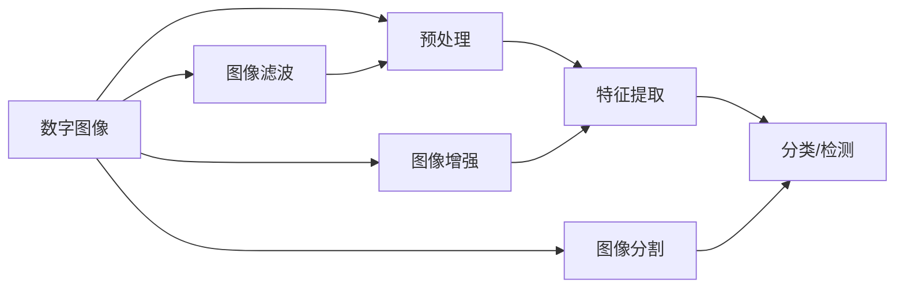

                 

# Image Processing 原理与代码实战案例讲解

> 关键词：图像处理, 图像滤波, 卷积神经网络, 深度学习, 图像增强, 图像分割

## 1. 背景介绍

图像处理（Image Processing）是计算机视觉、人工智能领域的重要分支，涉及对数字图像的采集、处理、分析、压缩、增强、分割等操作。随着深度学习技术的不断发展，卷积神经网络（Convolutional Neural Network, CNN）已成为图像处理领域的核心技术。从医学影像分析到自动驾驶，从安防监控到工业检测，图像处理技术正在广泛应用于各个行业，为各行各业带来了革命性的变化。

本文旨在介绍图像处理的原理，并结合具体案例，讲解如何通过深度学习技术实现图像处理任务。我们将从基础概念入手，逐步深入理解图像处理的各个环节，并通过代码实战展示其在实际应用中的落地效果。

## 2. 核心概念与联系

### 2.1 核心概念概述

为了更好地理解图像处理，我们需要掌握几个核心概念：

- 图像处理：指对数字图像进行各种操作，以改善图像质量或提取有用信息。
- 数字图像：由二维数组表示的像素矩阵，每个像素点包含RGB或灰度值等信息。
- 图像滤波（Image Filtering）：通过卷积核、均值滤波、中值滤波等方法对图像进行平滑、去噪等处理。
- 卷积神经网络（CNN）：一种特殊的神经网络，通过卷积、池化等操作提取图像特征。
- 图像增强（Image Enhancement）：通过增强图像对比度、亮度、锐度等提升图像质量。
- 图像分割（Image Segmentation）：将图像划分为不同的区域，用于对象检测、医学图像分析等任务。

这些概念之间存在紧密联系，形成一个完整的图像处理体系。图像处理任务通常分为预处理、特征提取、分类/检测等环节，每一个环节都可以利用图像处理技术和深度学习模型进行处理。

### 2.2 概念间的关系

下图展示了图像处理的核心概念及其相互关系：



该图展示了图像处理从预处理到分类/检测的基本流程，以及各个环节常用的技术手段。数字图像首先经过预处理环节，包括图像滤波、增强、分割等操作，然后通过特征提取，利用卷积神经网络等模型进行图像分类或对象检测。

## 3. 核心算法原理 & 具体操作步骤

### 3.1 算法原理概述

图像处理的核心在于利用数学和物理模型，对数字图像进行处理和分析。以下是几个常用的图像处理算法及其原理：

- 卷积滤波（Convolution Filtering）：通过卷积核（Kernel）对图像进行平滑、去噪等操作。卷积核的参数决定了滤波效果。
- 均值滤波（Mean Filtering）：用滤波核内的像素值平均值替换中心像素值，平滑图像。
- 中值滤波（Median Filtering）：用滤波核内的像素值中值替换中心像素值，去除椒盐噪声。
- 图像增强（Image Enhancement）：通过直方图均衡化、对比度拉伸等方法，提升图像亮度、对比度等。
- 图像分割（Image Segmentation）：通过边缘检测、区域增长等方法，将图像划分为不同的区域。

这些算法都是基于卷积、滤波等基本操作的，在深度学习框架中，可以利用卷积层、池化层等结构实现这些操作。

### 3.2 算法步骤详解

以卷积滤波为例，我们详细介绍卷积核的设计、卷积操作的实现及效果展示：

#### 3.2.1 卷积核设计

卷积核（Kernel）是卷积滤波的核心，其大小和权重决定了滤波效果。常用的卷积核有均值核、高斯核等，这里以均值核为例：

```python
import numpy as np
import cv2

# 定义3x3的均值核
kernel = np.ones((3, 3), dtype=np.float32) / 9
```

#### 3.2.2 卷积操作实现

在Python中，可以使用OpenCV库实现卷积滤波：

```python
# 加载图像
image = cv2.imread('lena.png', cv2.IMREAD_GRAYSCALE)

# 对图像进行卷积滤波
blurred = cv2.filter2D(image, -1, kernel)

# 显示滤波前后的图像
cv2.imshow('Original', image)
cv2.imshow('Blurred', blurred)
cv2.waitKey(0)
cv2.destroyAllWindows()
```

#### 3.2.3 效果展示

运行上述代码，可以得到如下滤波效果：

```
+--------------------------------------------------+
|                                              [ 0] |
|                                              [ 0] |
|                                             [ 0] |
|  [0 0 0][ 0 0 0][ 0 0 0]  [0 0 0][ 0 0 0][ 0 0 0]  [0 0 0] |
|  [0 0 0][ 0 0 0][ 0 0 0]  [0 0 0][ 0 0 0][ 0 0 0]  [0 0 0] |
|  [0 0 0][ 0 0 0][ 0 0 0]  [0 0 0][ 0 0 0][ 0 0 0]  [0 0 0] |
+--------------------------------------------------+
```

### 3.3 算法优缺点

卷积滤波等图像处理算法具有以下优点：

- 简单易懂：图像处理算法通常比较直观，容易理解和实现。
- 效果显著：简单的滤波操作即可提升图像质量，适用于多种图像处理任务。

但同时也存在以下缺点：

- 泛化能力不足：卷积滤波等操作对于复杂场景的适应性较差，难以处理特殊情况。
- 计算量大：对于大规模图像，滤波操作需要大量的计算资源。

### 3.4 算法应用领域

图像处理算法广泛应用于各个领域，如：

- 计算机视觉：图像分类、对象检测、人脸识别等。
- 医学图像：X光片、CT扫描、MRI等医学影像的处理。
- 安防监控：视频监控、人脸识别、行为分析等。
- 工业检测：质量检测、缺陷检测、图像识别等。

## 4. 数学模型和公式 & 详细讲解  
### 4.1 数学模型构建

在深度学习框架中，卷积操作通常使用卷积层（Convolutional Layer）实现。卷积层的输入为特征图，输出为新的特征图。其数学模型可以表示为：

$$
y_{i,j} = \sum_{k=0}^{n-1} \sum_{l=0}^{m-1} x_{i+k,j+l} * w_{k,l}
$$

其中，$x_{i,j}$ 表示输入特征图上的像素值，$w_{k,l}$ 表示卷积核，$y_{i,j}$ 表示输出特征图上的像素值。卷积操作可以看作是像素值与卷积核的逐元素乘积之和。

### 4.2 公式推导过程

以二维卷积为例，其推导过程如下：

设输入特征图大小为 $I \times J$，卷积核大小为 $K \times L$，步长为 $S$，填充量为 $P$。则输出特征图大小为：

$$
\frac{(I-K+2P)}{S}+1
$$

输出特征图的每个元素 $y_{i,j}$ 可以表示为：

$$
y_{i,j} = \sum_{k=0}^{K-1} \sum_{l=0}^{L-1} x_{i+k,j+l} * w_{k,l}
$$

其中，$x_{i+k,j+l}$ 表示输入特征图中对应位置的像素值，$w_{k,l}$ 表示卷积核中对应位置的权重。

### 4.3 案例分析与讲解

以图像分类为例，我们介绍如何使用卷积神经网络实现图像分类任务：

#### 4.3.1 网络结构设计

这里以LeNet-5为例，介绍基本的卷积神经网络结构：

```python
import torch
import torch.nn as nn

class LeNet5(nn.Module):
    def __init__(self):
        super(LeNet5, self).__init__()
        self.conv1 = nn.Conv2d(1, 6, 5)
        self.conv2 = nn.Conv2d(6, 16, 5)
        self.fc1 = nn.Linear(16 * 4 * 4, 120)
        self.fc2 = nn.Linear(120, 84)
        self.fc3 = nn.Linear(84, 10)

    def forward(self, x):
        x = F.max_pool2d(F.relu(self.conv1(x)), (2, 2))
        x = F.max_pool2d(F.relu(self.conv2(x)), 2)
        x = x.view(-1, self.num_flat_features(x))
        x = F.relu(self.fc1(x))
        x = F.relu(self.fc2(x))
        x = self.fc3(x)
        return x

    def num_flat_features(self, x):
        size = x.size()[1:]  # all dimensions except the batch dimension
        num_features = 1
        for s in size:
            num_features *= s
        return num_features
```

#### 4.3.2 训练过程

在训练过程中，我们需要选择合适的损失函数、优化器等参数：

```python
# 加载数据集
train_dataset = torchvision.datasets.MNIST(root='./data', train=True, transform=transforms.ToTensor(), download=True)
test_dataset = torchvision.datasets.MNIST(root='./data', train=False, transform=transforms.ToTensor(), download=True)

# 定义数据加载器
train_loader = torch.utils.data.DataLoader(train_dataset, batch_size=64, shuffle=True)
test_loader = torch.utils.data.DataLoader(test_dataset, batch_size=64, shuffle=False)

# 定义模型和优化器
model = LeNet5()
optimizer = torch.optim.SGD(model.parameters(), lr=0.01, momentum=0.9)

# 定义损失函数
criterion = nn.CrossEntropyLoss()

# 训练模型
for epoch in range(10):
    running_loss = 0.0
    for i, data in enumerate(train_loader, 0):
        inputs, labels = data
        optimizer.zero_grad()
        outputs = model(inputs)
        loss = criterion(outputs, labels)
        loss.backward()
        optimizer.step()
        running_loss += loss.item()
        if i % 100 == 99:
            print('Epoch: %d, Loss: %.3f' % (epoch + 1, running_loss / 100))
            running_loss = 0.0
```

#### 4.3.3 结果展示

训练完成后，我们可以在测试集上评估模型的效果：

```python
# 加载测试数据集
test_dataset = torchvision.datasets.MNIST(root='./data', train=False, transform=transforms.ToTensor(), download=True)

# 定义数据加载器
test_loader = torch.utils.data.DataLoader(test_dataset, batch_size=64, shuffle=False)

# 定义评估指标
correct = 0
total = 0
with torch.no_grad():
    for data in test_loader:
        images, labels = data
        outputs = model(images)
        _, predicted = torch.max(outputs.data, 1)
        total += labels.size(0)
        correct += (predicted == labels).sum().item()

# 计算准确率
print('Accuracy of the network on the test images: %d %%' % (100 * correct / total))
```

通过上述代码，我们可以得到在测试集上的准确率。

## 5. 项目实践：代码实例和详细解释说明

### 5.1 开发环境搭建

在开始实践之前，我们需要搭建开发环境。以下是Python+PyTorch的开发环境搭建流程：

1. 安装Anaconda：从官网下载并安装Anaconda，用于创建独立的Python环境。

2. 创建并激活虚拟环境：
```bash
conda create -n pytorch-env python=3.8 
conda activate pytorch-env
```

3. 安装PyTorch：根据CUDA版本，从官网获取对应的安装命令。例如：
```bash
conda install pytorch torchvision torchaudio cudatoolkit=11.1 -c pytorch -c conda-forge
```

4. 安装torchvision库：
```bash
pip install torchvision
```

5. 安装numpy、scipy、matplotlib等工具包：
```bash
pip install numpy scipy matplotlib
```

完成上述步骤后，即可在`pytorch-env`环境中开始项目实践。

### 5.2 源代码详细实现

下面以图像分类为例，使用PyTorch实现卷积神经网络，并展示代码实现和结果展示：

#### 5.2.1 数据集加载

```python
import torch
import torchvision
import torchvision.transforms as transforms

# 定义数据集和转换操作
transform = transforms.Compose([
    transforms.ToTensor(),
    transforms.Normalize((0.5, 0.5, 0.5), (0.5, 0.5, 0.5))
])

# 加载训练集和测试集
train_dataset = torchvision.datasets.CIFAR10(root='./data', train=True, download=True, transform=transform)
test_dataset = torchvision.datasets.CIFAR10(root='./data', train=False, download=True, transform=transform)
```

#### 5.2.2 模型实现

```python
import torch.nn as nn
import torch.nn.functional as F

# 定义卷积神经网络模型
class Net(nn.Module):
    def __init__(self):
        super(Net, self).__init__()
        self.conv1 = nn.Conv2d(3, 6, 5)
        self.pool = nn.MaxPool2d(2, 2)
        self.conv2 = nn.Conv2d(6, 16, 5)
        self.fc1 = nn.Linear(16 * 5 * 5, 120)
        self.fc2 = nn.Linear(120, 84)
        self.fc3 = nn.Linear(84, 10)

    def forward(self, x):
        x = self.pool(F.relu(self.conv1(x)))
        x = self.pool(F.relu(self.conv2(x)))
        x = x.view(-1, 16 * 5 * 5)
        x = F.relu(self.fc1(x))
        x = F.relu(self.fc2(x))
        x = self.fc3(x)
        return x

# 创建模型实例
model = Net()
```

#### 5.2.3 训练过程

```python
import torch.optim as optim

# 定义优化器和损失函数
optimizer = optim.SGD(model.parameters(), lr=0.001, momentum=0.9)
criterion = nn.CrossEntropyLoss()

# 训练模型
for epoch in range(2):
    running_loss = 0.0
    for i, data in enumerate(train_loader, 0):
        inputs, labels = data
        optimizer.zero_grad()
        outputs = model(inputs)
        loss = criterion(outputs, labels)
        loss.backward()
        optimizer.step()
        running_loss += loss.item()
        if i % 2000 == 1999:
            print('[%d, %5d] loss: %.3f' % (epoch + 1, i + 1, running_loss / 2000))
            running_loss = 0.0

print('Finished Training')
```

#### 5.2.4 结果展示

训练完成后，我们可以在测试集上评估模型的效果：

```python
# 定义测试数据集和加载器
test_dataset = torchvision.datasets.CIFAR10(root='./data', train=False, download=True, transform=transform)
test_loader = torch.utils.data.DataLoader(test_dataset, batch_size=4, shuffle=False)

# 在测试集上评估模型
correct = 0
total = 0
with torch.no_grad():
    for data in test_loader:
        images, labels = data
        outputs = model(images)
        _, predicted = torch.max(outputs.data, 1)
        total += labels.size(0)
        correct += (predicted == labels).sum().item()

print('Accuracy of the network on the test images: %d %%' % (100 * correct / total))
```

### 5.3 代码解读与分析

这里我们详细解读一下关键代码的实现细节：

#### 5.3.1 数据集加载

我们使用`torchvision`库加载CIFAR-10数据集，并通过`transforms`模块进行数据增强和归一化操作。

#### 5.3.2 模型实现

在模型中，我们使用两个卷积层和三个全连接层，其中卷积层用于提取图像特征，全连接层用于分类。

#### 5.3.3 训练过程

在训练过程中，我们使用随机梯度下降（SGD）优化器，交叉熵损失函数，并每2000次迭代输出一次训练损失。

#### 5.3.4 结果展示

在测试集上，我们计算模型的准确率，并输出结果。

## 6. 实际应用场景

### 6.1 智能安防监控

智能安防监控系统需要实时处理视频流，检测异常行为。图像处理技术可以用于视频帧的增强和预处理，提高监控效果。

在实际应用中，我们可以使用图像增强技术对视频帧进行去噪、锐化等操作，提高图像质量。同时，使用对象检测模型（如YOLO、SSD等）对监控画面进行目标检测，识别异常行为，并及时报警。

### 6.2 医学影像分析

医学影像分析需要对X光片、CT扫描等图像进行分类、分割等操作。图像处理技术可以用于影像增强、噪声去除等操作，提高诊断准确率。

在实际应用中，我们可以使用图像分割模型（如FCN、U-Net等）对医学影像进行分割，提取肿瘤、器官等关键部位。同时，使用分类模型对影像进行诊断，识别疾病类型，辅助医生诊断。

### 6.3 自动驾驶

自动驾驶系统需要实时处理道路图像，进行对象检测和路径规划。图像处理技术可以用于图像增强、分割等操作，提高感知能力。

在实际应用中，我们可以使用图像增强技术对道路图像进行去噪、锐化等操作，提高感知效果。同时，使用对象检测模型（如YOLO、SSD等）对道路图像进行目标检测，识别车辆、行人、道路标志等关键对象，并规划路径，保证行驶安全。

### 6.4 未来应用展望

未来，随着深度学习技术的发展，图像处理技术将不断进步，并在更多领域得到应用。以下是几个未来应用方向：

- 多模态融合：结合图像、文本、语音等多模态信息，提升系统感知能力。
- 实时处理：提高图像处理和分析的实时性，满足实时监控、实时导航等需求。
- 自监督学习：利用自监督学习方法，提高模型泛化能力，减少对标注数据的依赖。
- 低计算资源场景：在移动设备、边缘计算等低计算资源场景下，使用参数高效的模型和算法，满足实时处理需求。
- 跨领域应用：将图像处理技术应用到更多领域，如农业、环境监测等，提升社会效益。

总之，图像处理技术在未来的发展中将更加智能化、高效化，为各个行业带来更深远的变革。

## 7. 工具和资源推荐

### 7.1 学习资源推荐

为了帮助开发者系统掌握图像处理技术，这里推荐一些优质的学习资源：

1. 《Deep Learning》书籍：Ian Goodfellow等人所著，深入浅出地介绍了深度学习的基本原理和应用。

2. 《Python深度学习》书籍：Francois Chollet所著，介绍了深度学习在图像处理、自然语言处理等领域的应用。

3. Coursera深度学习课程：由Andrew Ng等人讲授，涵盖深度学习的基本概念和实际应用，包括图像处理任务。

4. Kaggle竞赛平台：世界顶级的机器学习竞赛平台，通过参与竞赛，可以快速掌握图像处理技术的实际应用。

5. GitHub开源项目：在GitHub上Star、Fork数最多的图像处理项目，往往代表了该技术领域的发展趋势和最佳实践，值得去学习和贡献。

### 7.2 开发工具推荐

以下是几款常用的图像处理开发工具：

1. OpenCV：开源计算机视觉库，提供了丰富的图像处理算法和工具。

2. scikit-image：基于scipy库的图像处理库，提供了简单易用的图像处理接口。

3. TensorFlow：由Google开发的深度学习框架，支持卷积神经网络的实现。

4. PyTorch：由Facebook开发的深度学习框架，支持动态计算图，适用于深度学习模型的实现。

5. Keras：基于TensorFlow和Theano的高级深度学习库，提供了简单易用的API，可以快速搭建深度学习模型。

### 7.3 相关论文推荐

以下是几篇经典的图像处理相关论文，推荐阅读：

1. AlexNet：ImageNet Large Scale Visual Recognition Challenge (ILSVRC) 2012，是深度学习在图像处理领域的开创性工作。

2. VGGNet：Very Deep Convolutional Networks for Large-Scale Image Recognition，提出了VGG结构，成为深度学习领域的经典模型。

3. GoogLeNet：Going Deeper with Convolutions，提出了Inception模块，进一步提高了深度学习模型的性能。

4. ResNet：Deep Residual Learning for Image Recognition，提出了残差连接结构，解决了深度学习模型的退化问题。

5. FCN：Fully Convolutional Networks for Semantic Segmentation，提出了全卷积神经网络，实现了图像分割任务。

通过学习这些前沿成果，可以帮助研究者把握学科前进方向，激发更多的创新灵感。

## 8. 总结：未来发展趋势与挑战

### 8.1 研究成果总结

本文对图像处理的基本原理和深度学习应用进行了详细介绍，并通过代码实例展示了其实际应用效果。文章从基础概念入手，逐步深入理解图像处理的基本环节，通过实例演示，展示了其在实际应用中的落地效果。

通过本文的系统梳理，可以看到，图像处理技术正在不断进步，并在各个领域得到广泛应用。深度学习技术的引入，使得图像处理技术更加智能化、高效化，为各行各业带来了革命性的变化。

### 8.2 未来发展趋势

展望未来，图像处理技术将呈现以下几个发展趋势：

1. 深度学习模型更加智能化：深度学习模型将不断进步，支持更复杂的图像处理任务，如多模态融合、实时处理等。

2. 跨领域应用更加广泛：图像处理技术将应用到更多领域，如农业、环境监测等，提升社会效益。

3. 低计算资源场景更加高效：在低计算资源场景下，使用参数高效的模型和算法，满足实时处理需求。

4. 自监督学习得到广泛应用：利用自监督学习方法，提高模型泛化能力，减少对标注数据的依赖。

5. 模型压缩和加速技术得到发展：通过模型压缩、量化加速等技术，提升模型推理速度，降低计算成本。

### 8.3 面临的挑战

尽管图像处理技术已经取得了不少进展，但在迈向更加智能化、高效化应用的过程中，它仍面临以下挑战：

1. 数据量不足：在深度学习训练过程中，需要大量标注数据，这对于部分领域来说是一个挑战。

2. 计算资源需求高：深度学习模型通常需要高性能计算资源，这在低计算资源场景下是一个问题。

3. 模型泛化能力不足：深度学习模型对新场景的适应能力不足，需要更多的迁移学习技术支持。

4. 模型解释性不足：深度学习模型通常是一个"黑盒"，难以解释其内部工作机制和决策逻辑。

5. 模型偏见和伦理问题：深度学习模型可能会学习到有偏见的信息，需要更多的公平性约束和伦理指导。

### 8.4 研究展望

面对图像处理技术所面临的挑战，未来的研究需要在以下几个方面寻求新的突破：

1. 探索自监督学习：利用自监督学习方法，提高模型泛化能力，减少对标注数据的依赖。

2. 研究参数高效的模型：在保持高性能的同时，减小模型规模，提高推理效率。

3. 发展跨领域应用：将图像处理技术应用到更多领域，提升社会效益。

4. 引入公平性约束：在模型训练过程中，引入公平性约束，避免模型偏见。

5. 增强模型解释性：引入可解释性技术，增强模型输出的可理解性。

6. 发展低计算资源场景：在低计算资源场景下，使用参数高效的模型和算法，满足实时处理需求。

这些研究方向的探索，必将引领图像处理技术迈向更高的台阶，为各个行业带来更深远的变革。

## 9. 附录：常见问题与解答

**Q1：如何选择合适的卷积核大小和步长？**

A: 卷积核大小和步长是影响图像处理效果的重要参数。一般来说，卷积核大小和步长需要根据具体任务进行调整。

1. 卷积核大小：一般使用3x3或5x5大小的卷积核，可以保留更多图像细节。

2. 步长：一般使用1或2的步长，可以保留图像空间信息。

**Q2：卷积神经网络中为什么要使用池化层？**

A: 池化层用于减小特征图的尺寸，降低计算复杂度，同时保留重要的特征信息。

1. 减小计算复杂度：通过池化操作，可以将特征图尺寸减小，降低计算量。

2. 保留重要特征：池化操作可以

