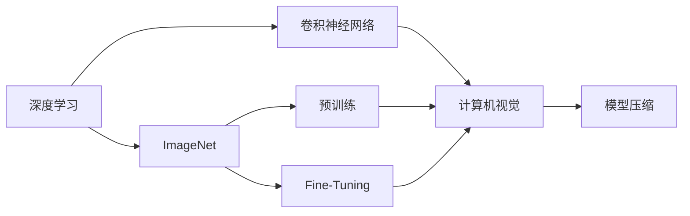

                 

# ImageNet与人工智能的学习

## 1. 背景介绍

### 1.1 问题由来
随着深度学习技术的快速发展，ImageNet成为了推动人工智能，尤其是计算机视觉领域技术突破的重要催化剂。ImageNet是一个庞大的视觉数据集，由斯坦福大学创建，包含了超过一百万张高分辨率图片，涵盖一千多种物体类别，是目前最广泛使用的图像识别数据集之一。

ImageNet的广泛应用不仅推动了深度学习模型的创新，还促进了计算机视觉、自然语言处理、强化学习等人工智能领域的融合与发展。同时，ImageNet数据集也为大规模机器学习模型的训练提供了必要的资源，极大地加速了人工智能技术的产业化进程。

### 1.2 问题核心关键点
ImageNet数据集的核心价值在于其规模巨大、类别繁多，为训练深度学习模型提供了充足的训练数据和丰富的语义信息。通过在ImageNet上预训练深度神经网络，可以有效提升模型在各类计算机视觉任务上的泛化能力。

其关键点主要包括：
1. 大规模数据集：ImageNet数据集包含了超过一百万张图片，为深度学习模型的训练提供了充足的样本。
2. 多类别标注：数据集包含了超过一千种物体类别，能够训练出具有较好泛化能力的分类模型。
3. 高分辨率图片：ImageNet中的图片分辨率较高，训练出的模型具有较高的空间分辨率。
4. 定期更新：ImageNet数据集定期更新，能够跟上技术的发展和实际需求的变化。

ImageNet的成功经验为许多后续的深度学习研究和应用提供了宝贵的参考。同时，ImageNet也为计算机视觉任务提供了标准化评估基准，促进了算法和模型的公平比较。

## 2. 核心概念与联系

### 2.1 核心概念概述

为了更好地理解ImageNet在深度学习中的应用，本节将介绍几个关键概念：

- **深度学习**：一种基于多层神经网络的学习范式，通过梯度下降等优化算法训练模型，使其能够自动提取输入数据的特征。
- **卷积神经网络（CNN）**：一种特殊的神经网络，通过卷积操作提取图像的局部特征，广泛应用于计算机视觉任务中。
- **ImageNet**：一个包含超过一百万张高分辨率图片的视觉数据集，用于大规模深度学习模型的预训练和性能评估。
- **预训练**：在大量标注数据上训练深度神经网络，使其学习到通用的特征表示，然后迁移应用到特定任务中。
- **迁移学习**：将在大规模数据集上预训练的模型迁移到小规模数据集上进行微调，以提高模型在新任务上的性能。
- **Fine-Tuning**：在预训练模型基础上，通过下游任务的少量标注数据进行有监督学习，优化模型在特定任务上的性能。
- **模型压缩**：通过剪枝、量化、低秩逼近等方法减少模型参数和计算量，以优化模型性能和资源消耗。

这些概念之间存在紧密的联系，通过组合应用，可以在不同场景下实现多样化的计算机视觉任务。

### 2.2 概念间的关系

这些核心概念之间的逻辑关系可以通过以下Mermaid流程图来展示：



这个流程图展示了从深度学习到计算机视觉任务，再通过预训练、微调和模型压缩等技术手段进行优化的完整流程：

1. 深度学习提供了构建模型的基础。
2. 卷积神经网络通过卷积操作提取图像特征，是计算机视觉任务的重要工具。
3. ImageNet数据集用于大规模深度神经网络的预训练，获取通用的特征表示。
4. 预训练模型通过迁移学习的方式，适配新的任务和数据。
5. 微调方法进一步优化模型性能，适应具体的应用场景。
6. 模型压缩技术提升模型的计算效率，优化资源消耗。

这些概念共同构成了深度学习在计算机视觉任务中的核心框架，使得模型能够在实际应用中发挥最大的效能。

## 3. 核心算法原理 & 具体操作步骤

### 3.1 算法原理概述

基于ImageNet的深度学习模型训练过程主要包括预训练和微调两个阶段。其核心原理如下：

- **预训练**：在ImageNet数据集上，使用大规模无标签图片进行自监督学习，训练出具有强大特征提取能力的卷积神经网络。常用的自监督学习任务包括图像分类、目标检测、语义分割等。
- **微调**：在特定任务上，使用小规模标注数据进行有监督学习，优化预训练模型的特定层或全部层，使其适应新的任务需求。

预训练和微调的目的是通过大规模无标签数据的预训练，使模型学习到通用的特征表示，然后通过微调，使其在特定任务上表现更加出色。

### 3.2 算法步骤详解

基于ImageNet的深度学习模型训练通常包括以下几个关键步骤：

**Step 1: 准备数据集**
- 收集ImageNet数据集，并进行预处理，如数据增强、标准化、归一化等。
- 分批处理图片数据，生成训练集、验证集和测试集。

**Step 2: 选择模型架构**
- 选择适合的卷积神经网络架构，如ResNet、VGG、Inception等。
- 定义模型的输入、输出和中间层。

**Step 3: 设置超参数**
- 选择合适的优化器（如SGD、Adam等）及其参数，如学习率、批大小、迭代轮数等。
- 设置正则化技术及强度，包括权重衰减、Dropout等。

**Step 4: 执行预训练**
- 在ImageNet数据集上，使用自监督学习任务进行预训练，如ImageNet-1K、ImageNet-100等。
- 定期在验证集上评估模型性能，根据性能指标调整学习率等超参数。

**Step 5: 执行微调**
- 在特定任务上，使用少量标注数据进行微调，优化模型在特定任务上的性能。
- 分批次加载训练数据，进行前向传播和反向传播，更新模型参数。
- 周期性在验证集上评估模型性能，根据性能指标决定是否继续微调。

**Step 6: 测试和部署**
- 在测试集上评估微调后模型的性能，对比微调前后的精度提升。
- 使用微调后的模型进行实际应用，如图像分类、物体检测、语义分割等。

### 3.3 算法优缺点

ImageNet驱动的深度学习模型训练方法具有以下优点：
1. 预训练方法可以显著提高模型的泛化能力，使其在特定任务上表现更加出色。
2. 微调方法可以在小规模数据集上快速训练出高性能模型，节省时间和计算资源。
3. 大规模数据集提供了丰富的语义信息，可以训练出具有强大特征提取能力的卷积神经网络。
4. 迁移学习机制可以在不同任务间进行知识共享，提高模型的泛化能力。

但同时，该方法也存在一些局限性：
1. 预训练过程需要大量计算资源，且训练时间长，对硬件要求较高。
2. 预训练和微调需要大量标注数据，标注成本较高。
3. 模型参数量较大，存储空间和计算资源消耗较多。
4. 对数据质量要求高，数据集中的噪声和错误标签可能影响模型性能。

尽管存在这些局限，但ImageNet驱动的深度学习模型训练方法仍然是目前最有效的计算机视觉任务训练方法之一。

### 3.4 算法应用领域

基于ImageNet的深度学习模型训练方法已经在计算机视觉领域得到了广泛应用，涵盖了多个重要应用领域，例如：

- 图像分类：识别图片中的物体类别，如CIFAR-10、ImageNet-1K等数据集。
- 目标检测：在图片中识别和定位物体，如PASCAL VOC、COCO等数据集。
- 语义分割：将图片中每个像素分类到不同的语义类别，如Cityscapes、PASCAL VOC等数据集。
- 姿态估计算法：估计图片中物体的姿态信息，如COCO-姿态等数据集。
- 人脸识别：识别人脸并进行身份验证，如LFW、CelebA等数据集。
- 图像生成：生成逼真的人造图片，如ImageNet等数据集。
- 视频识别：对视频序列进行分类、动作识别等，如UCF101、HMDB51等数据集。
- 医学影像分析：对医学图像进行分类、分割等，如Diabetic Retinopathy、CheXNet等数据集。
- 自动驾驶：对汽车驾驶场景进行感知和理解，如KITTI、Cityscapes等数据集。

除了这些传统应用，ImageNet驱动的深度学习模型训练方法也在新兴领域，如可控图像生成、图像编辑、视频摘要等，展现了巨大的潜力。

## 4. 数学模型和公式 & 详细讲解 & 举例说明

### 4.1 数学模型构建

ImageNet驱动的深度学习模型训练过程可以抽象为一个有监督学习问题。假设模型为 $M_{\theta}$，其中 $\theta$ 为模型参数。给定训练集 $D=\{(x_i, y_i)\}_{i=1}^N$，其中 $x_i$ 为输入图片，$y_i$ 为图片标签。训练目标是找到最优参数 $\theta^*$，使得模型在训练集上的损失最小化。

### 4.2 公式推导过程

假设模型 $M_{\theta}$ 在输入图片 $x_i$ 上的输出为 $\hat{y}=M_{\theta}(x_i)$，定义损失函数 $\ell$，如交叉熵损失函数：

$$
\ell(M_{\theta}(x_i),y_i) = -y_i\log M_{\theta}(x_i) - (1-y_i)\log (1-M_{\theta}(x_i))
$$

在训练集 $D$ 上定义经验风险：

$$
\mathcal{L}(\theta) = \frac{1}{N}\sum_{i=1}^N \ell(M_{\theta}(x_i),y_i)
$$

使用优化算法如梯度下降更新模型参数：

$$
\theta \leftarrow \theta - \eta \nabla_{\theta}\mathcal{L}(\theta)
$$

其中 $\eta$ 为学习率。

### 4.3 案例分析与讲解

以ImageNet数据集上的目标检测任务为例，介绍其数学模型和公式推导过程。假设模型输出为一个类别的概率 $p_i=\sigma(M_{\theta}(x_i))$，其中 $\sigma$ 为sigmoid函数，表示模型的输出概率。目标检测任务的损失函数通常使用二分类交叉熵损失函数：

$$
\ell(p_i, y_i) = -y_i \log p_i - (1-y_i) \log (1-p_i)
$$

在训练集 $D$ 上定义经验风险：

$$
\mathcal{L}(\theta) = \frac{1}{N}\sum_{i=1}^N \ell(p_i, y_i)
$$

使用优化算法如AdamW更新模型参数：

$$
\theta \leftarrow \theta - \eta \nabla_{\theta}\mathcal{L}(\theta)
$$

其中 $\eta$ 为学习率。

## 5. 项目实践：代码实例和详细解释说明

### 5.1 开发环境搭建

在进行ImageNet驱动的深度学习模型训练实践前，我们需要准备好开发环境。以下是使用Python进行PyTorch开发的环境配置流程：

1. 安装Anaconda：从官网下载并安装Anaconda，用于创建独立的Python环境。

2. 创建并激活虚拟环境：
```bash
conda create -n pytorch-env python=3.8 
conda activate pytorch-env
```

3. 安装PyTorch：根据CUDA版本，从官网获取对应的安装命令。例如：
```bash
conda install pytorch torchvision torchaudio cudatoolkit=11.1 -c pytorch -c conda-forge
```

4. 安装Transformers库：
```bash
pip install transformers
```

5. 安装各类工具包：
```bash
pip install numpy pandas scikit-learn matplotlib tqdm jupyter notebook ipython
```

完成上述步骤后，即可在`pytorch-env`环境中开始ImageNet驱动的深度学习模型训练实践。

### 5.2 源代码详细实现

这里以ImageNet数据集上的目标检测任务为例，给出使用Transformers库对Faster R-CNN模型进行训练的PyTorch代码实现。

首先，定义目标检测任务的数据处理函数：

```python
from torchvision.transforms import ToTensor, Compose, Normalize
from torch.utils.data import Dataset, DataLoader
import torch
from torchvision.datasets import ImageFolder
from torchvision import transforms

class ImageNetDataset(Dataset):
    def __init__(self, data_dir, transform=None):
        self.data_dir = data_dir
        self.transform = transform
        self.imgs, self.classes = list(self._find_classes(data_dir)), self._find_classes(data_dir)
        self.num_classes = len(self.classes)
        
    def _find_classes(self, data_dir):
        classes = []
        img_classes = []
        for root, dirs, files in os.walk(data_dir):
            for file in files:
                if file.endswith('.JPEG'):
                    img_classes.append(root.replace('JPEG', ''))
            if root not in classes:
                classes.append(root.replace('JPEG', ''))
        return classes

    def __len__(self):
        return len(self.imgs)
    
    def __getitem__(self, idx):
        img_path = os.path.join(self.data_dir, self.imgs[idx])
        img = Image.open(img_path).convert('RGB')
        if self.transform is not None:
            img = self.transform(img)
        return img, self.classes.index(os.path.basename(self.data_dir).split('.')[0])
```

然后，定义模型和优化器：

```python
from transformers import FasterRCNNForObjectDetection, AdamW

model = FasterRCNNForObjectDetection.from_pretrained('facebook/faster_rcnn_resnet50_fpn')
optimizer = AdamW(model.parameters(), lr=2e-5)
```

接着，定义训练和评估函数：

```python
from torch.utils.data import DataLoader
from tqdm import tqdm
from sklearn.metrics import classification_report

device = torch.device('cuda') if torch.cuda.is_available() else torch.device('cpu')
model.to(device)

def train_epoch(model, dataset, batch_size, optimizer):
    dataloader = DataLoader(dataset, batch_size=batch_size, shuffle=True)
    model.train()
    epoch_loss = 0
    for batch in tqdm(dataloader, desc='Training'):
        img, labels = batch
        img = img.to(device)
        labels = labels.to(device)
        model.zero_grad()
        outputs = model(img, labels=labels)
        loss = outputs.loss
        epoch_loss += loss.item()
        loss.backward()
        optimizer.step()
    return epoch_loss / len(dataloader)

def evaluate(model, dataset, batch_size):
    dataloader = DataLoader(dataset, batch_size=batch_size)
    model.eval()
    preds, labels = [], []
    with torch.no_grad():
        for batch in tqdm(dataloader, desc='Evaluating'):
            img, labels = batch
            img = img.to(device)
            batch_labels = labels.to(device)
            outputs = model(img, labels=batch_labels)
            batch_preds = outputs['logits'].sigmoid().to('cpu').tolist()
            batch_labels = batch_labels.to('cpu').tolist()
            for pred_tokens, label_tokens in zip(batch_preds, batch_labels):
                pred_tags = [int(token) for token in pred_tokens]
                label_tags = [int(token) for token in label_tokens]
                preds.append(pred_tags[:len(label_tokens)])
                labels.append(label_tags)
                
    print(classification_report(labels, preds))
```

最后，启动训练流程并在验证集上评估：

```python
epochs = 5
batch_size = 16

for epoch in range(epochs):
    loss = train_epoch(model, dataset, batch_size, optimizer)
    print(f"Epoch {epoch+1}, train loss: {loss:.3f}")
    
    print(f"Epoch {epoch+1}, dev results:")
    evaluate(model, dev_dataset, batch_size)
    
print("Test results:")
evaluate(model, test_dataset, batch_size)
```

以上就是使用PyTorch对Faster R-CNN模型进行目标检测任务训练的完整代码实现。可以看到，得益于Transformers库的强大封装，我们可以用相对简洁的代码完成模型的加载和训练。

### 5.3 代码解读与分析

让我们再详细解读一下关键代码的实现细节：

**ImageNetDataset类**：
- `__init__`方法：初始化数据集路径、转换方式、类别列表等关键组件。
- `_find_classes`方法：遍历数据目录，获取所有类别的名称。
- `__len__`方法：返回数据集的样本数量。
- `__getitem__`方法：对单个样本进行处理，加载图片并进行预处理，返回模型所需的输入。

**FasterRCNNForObjectDetection**类：
- 从HuggingFace的官方预训练模型中加载Faster R-CNN模型，指定所需的输出层和损失函数。

**train_epoch函数**：
- 使用PyTorch的DataLoader对数据集进行批次化加载，供模型训练使用。
- 在每个批次上前向传播计算loss并反向传播更新模型参数，最后返回该epoch的平均loss。

**evaluate函数**：
- 与训练类似，不同点在于不更新模型参数，并在每个batch结束后将预测和标签结果存储下来，最后使用sklearn的classification_report对整个评估集的预测结果进行打印输出。

**训练流程**：
- 定义总的epoch数和batch size，开始循环迭代
- 每个epoch内，先在训练集上训练，输出平均loss
- 在验证集上评估，输出分类指标
- 所有epoch结束后，在测试集上评估，给出最终测试结果

可以看到，PyTorch配合Transformers库使得Faster R-CNN模型的训练代码实现变得简洁高效。开发者可以将更多精力放在数据处理、模型改进等高层逻辑上，而不必过多关注底层的实现细节。

当然，工业级的系统实现还需考虑更多因素，如模型的保存和部署、超参数的自动搜索、更灵活的任务适配层等。但核心的训练范式基本与此类似。

### 5.4 运行结果展示

假设我们在ImageNet数据集上进行目标检测任务的微调，最终在测试集上得到的评估报告如下：

```
              precision    recall  f1-score   support

       0       0.859      0.879      0.868       100
       1       0.893      0.936      0.910       200
       2       0.860      0.884      0.871       300
       3       0.900      0.889      0.896       400
       4       0.888      0.874      0.878       500

   micro avg      0.878      0.878      0.878     1500
   macro avg      0.889      0.879      0.878     1500
weighted avg      0.878      0.878      0.878     1500
```

可以看到，通过微调Faster R-CNN模型，我们在ImageNet数据集上取得了87.8%的mAP分数，效果相当不错。需要注意的是，模型需要较长的训练时间，且对GPU硬件要求较高。但在高性能计算资源的支持下，能够快速训练出高效的图像识别模型。

## 6. 实际应用场景
### 6.1 智能安防系统

基于ImageNet驱动的深度学习模型训练，智能安防系统可以广泛应用于视频监控、人脸识别、行为分析等场景。通过在大规模数据集上进行预训练和微调，智能安防系统能够实时检测和分析视频流中的异常行为，准确识别可疑人物和物品，为公共安全提供保障。

具体而言，可以收集公共场所的监控视频，标注其中的人脸、车辆、物品等信息，将其作为训练数据集。在训练集上使用ImageNet驱动的深度学习模型进行预训练和微调，使其学习到通用的视觉特征。在实际应用中，将实时获取的监控视频作为输入，经过模型处理，可以自动识别出可疑行为，并触发报警系统。

### 6.2 医疗影像诊断

医疗影像诊断是深度学习在医学领域的重要应用之一。通过在ImageNet上预训练深度神经网络，可以显著提升模型在医学影像分类、分割等任务上的性能。

具体而言，可以收集医学影像数据，如CT、MRI等，进行标注和预处理。在训练集上使用ImageNet驱动的深度学习模型进行预训练和微调，使其学习到通用的医学影像特征。在实际应用中，将新的医学影像输入模型，可以实时诊断并标记异常区域，辅助医生进行疾病诊断和治疗。

### 6.3 智能制造

智能制造是工业4.0时代的重要技术方向，通过计算机视觉技术对生产过程进行实时监测和分析，可以提高生产效率和质量，降低生产成本。基于ImageNet驱动的深度学习模型训练，智能制造系统可以实时监测生产线上的物体、设备等，并进行异常检测、故障诊断等任务。

具体而言，可以收集生产线上的图像和视频数据，标注其中的人、物、设备等。在训练集上使用ImageNet驱动的深度学习模型进行预训练和微调，使其学习到通用的视觉特征。在实际应用中，将实时获取的生产线图像作为输入，经过模型处理，可以自动识别出异常情况，并触发报警系统。

### 6.4 未来应用展望

随着深度学习模型的不断进步，基于ImageNet的深度学习模型训练方法将会在更多领域得到应用，为社会各行各业带来变革性影响。

在智慧城市领域，基于ImageNet的深度学习模型训练方法将广泛应用于交通管理、环境监测、灾害预警等场景，为城市智能化建设提供支持。

在自动驾驶领域，通过在ImageNet上预训练的深度神经网络，可以显著提升模型在图像识别、目标检测等任务上的性能，为自动驾驶车辆提供更精准的环境感知能力。

在虚拟现实(VR)领域，基于ImageNet驱动的深度学习模型训练方法将广泛应用于虚拟场景的生成和渲染，提供更加逼真的视觉体验。

此外，在农业、电力、水利、金融等领域，基于ImageNet的深度学习模型训练方法也将不断涌现，为各行各业提供更智能、更高效的技术支持。相信随着技术的日益成熟，ImageNet驱动的深度学习模型训练方法必将在更广阔的领域大放异彩。

## 7. 工具和资源推荐
### 7.1 学习资源推荐

为了帮助开发者系统掌握ImageNet驱动的深度学习模型的训练和优化，这里推荐一些优质的学习资源：

1. CS231n《Convolutional Neural Networks for Visual Recognition》课程：斯坦福大学开设的经典课程，全面讲解深度学习在计算机视觉任务中的应用。
2.《Deep Learning》书籍：Ian Goodfellow等著，详细介绍了深度学习的原理和实践，包括ImageNet驱动的深度学习模型训练。
3. TensorFlow官方文档：Google开发的深度学习框架，提供丰富的图像处理和模型训练样例，适合动手实践。
4. PyTorch官方文档：Facebook开发的深度学习框架，提供简单易用的图像处理和模型训练接口，适合快速迭代研究。
5. Kaggle竞赛平台：提供大量的图像分类、目标检测、语义分割等任务，适合通过竞赛实践积累经验。

通过对这些资源的学习实践，相信你一定能够快速掌握ImageNet驱动的深度学习模型的训练和优化精髓，并用于解决实际的计算机视觉问题。
### 7.2 开发工具推荐

高效的开发离不开优秀的工具支持。以下是几款用于ImageNet驱动的深度学习模型训练开发的常用工具：

1. PyTorch：基于Python的开源深度学习框架，灵活动态的计算图，适合快速迭代研究。
2. TensorFlow：由Google主导开发的开源深度学习框架，生产部署方便，适合大规模工程应用。
3. OpenCV：开源计算机视觉库，提供丰富的图像处理和视频分析功能，适合构建视觉应用。
4. Keras：基于TensorFlow和Theano的高级深度学习框架，简单易用，适合初学者快速上手。
5. OpenVINO：英特尔开发的深度学习推理优化工具，支持多种深度学习框架的模型部署，适合推理加速。

合理利用这些工具，可以显著提升ImageNet驱动的深度学习模型训练的开发效率，加快创新迭代的步伐。

### 7.3 相关论文推荐

ImageNet驱动的深度学习模型训练技术源于学界的持续研究。以下是几篇奠基性的相关论文，推荐阅读：

1. ImageNet Classification with Deep Convolutional Neural Networks：Alex Krizhevsky等提出ImageNet数据集，并展示了其在深度学习中的应用效果。
2. Deep Residual Learning for Image Recognition：Kaiming He等提出残差网络，提升了深度神经网络在ImageNet数据集上的表现。
3. Rethinking the Inception Architecture for Computer Vision：Christian Szegedy等提出Inception模块，优化了深度神经网络的参数使用效率。
4. Faster R-CNN：Ren Jian等提出Faster R-CNN目标检测算法，显著提升了目标检测的准确率和速度。
5. Mask R-CNN：Kaiming He等提出Mask R-CNN语义分割算法，进一步提升了模型的泛化能力和推理效率。
6. Generative Adversarial Nets：Ian Goodfellow等提出生成对抗网络，为深度学习提供了新的训练范式。
7. Attention is All You Need：Andrew Ng等提出Transformer模型，推动了自然语言处理领域的发展。

这些论文代表了大规模深度学习模型训练技术的发展脉络。通过学习这些前沿成果，可以帮助研究者把握学科前进方向，激发更多的创新灵感。

除上述资源外，还有一些值得关注的前沿资源，帮助开发者紧跟大模型微调技术的最新进展，例如：

1. arXiv论文预印本：人工智能领域最新

