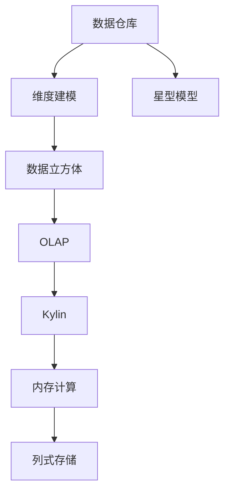
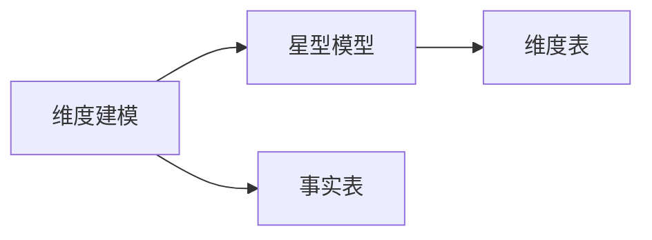
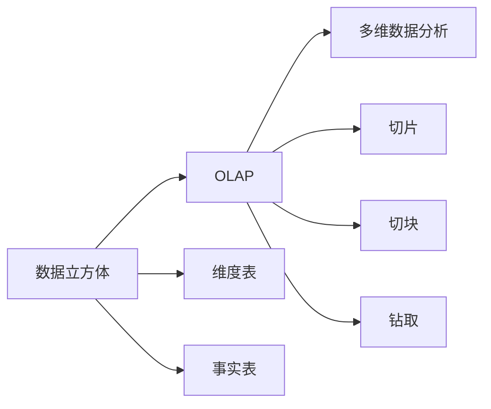
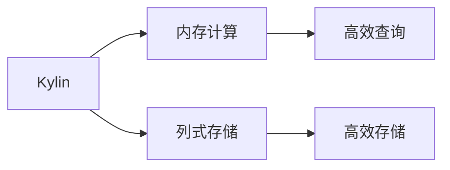
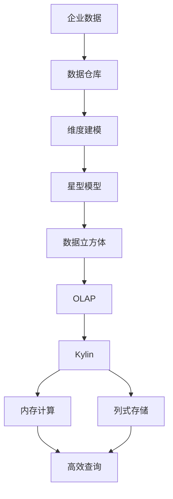

                 

# Kylin原理与代码实例讲解

> 关键词：Kylin,维度建模,星型模型,数据仓库,OLAP,数据立方体

## 1. 背景介绍

### 1.1 问题由来
随着企业数据的快速增长和业务复杂度的提升，传统的扁平化关系型数据库已难以满足实时、复杂查询的需求。数据仓库技术应运而生，通过维度和事实表的组合，提供了高效的数据组织和查询机制。Kylin作为一款领先的数据仓库平台，采用分布式计算框架和内存计算技术，在企业数据管理中扮演着重要角色。本文将详细讲解Kylin的核心原理，并通过代码实例演示其在实际项目中的应用。

### 1.2 问题核心关键点
Kylin的核心在于其独特的维度建模和星型模型设计，通过将数据立方体分割成多个小立方体，实现分布式存储和计算，确保查询的高效性和扩展性。此外，Kylin支持多种数据源和查询引擎，如Hadoop、Spark、Hive等，能够满足不同场景下的需求。Kylin还提供了一系列性能优化策略，如数据倾斜处理、预聚合计算、热点数据缓存等，进一步提升了数据处理效率。

Kylin的设计思想和实现方式深受业界认可，广泛应用于金融、电商、电信等多个领域。但同时，Kylin作为一款较为复杂的分布式系统，其部署和运维也需要一定的技术积累。

### 1.3 问题研究意义
研究Kylin的原理与实现方式，对于理解企业级数据管理和优化查询效率具有重要意义：

1. 提升数据管理能力：Kylin提供了一种高效的数据组织方式，通过维度建模和数据预聚合，能够大大提升数据查询速度和处理能力。
2. 降低数据复杂度：Kylin将复杂的数据处理逻辑抽象为模型设计，降低了数据管理的技术门槛，提高了数据开发效率。
3. 优化查询性能：Kylin的分布式架构和内存计算技术，能够有效应对大数据量和高并发查询，确保数据查询的高效性和稳定性。
4. 实现业务扩展：Kylin支持多种数据源和查询引擎，能够灵活适应不同业务场景和数据架构，支持企业业务扩展。
5. 提高数据安全：Kylin提供了细粒度的访问控制和审计功能，确保数据的安全性和合规性。

## 2. 核心概念与联系

### 2.1 核心概念概述

为更好地理解Kylin的原理与实现方式，本节将介绍几个密切相关的核心概念：

- **数据仓库(Data Warehouse)**：企业级数据管理平台，用于集中存储和管理企业内部和外部的数据，支持多数据源、多维度查询。
- **维度建模(Dimensional Modeling)**：一种数据建模技术，通过将数据划分为维度和事实表，实现数据的高效管理和查询。
- **星型模型(Star Schema)**：一种常见的维度建模结构，以事实表为中心，多个维度从中心向外辐射，形成星型结构。
- **数据立方体(Cube)**：由事实表和维度表构建的数据模型，支持多维数据分析和查询。
- **OLAP(Online Analytical Processing)**：一种数据处理技术，支持多维数据分析、切片、切块、钻取等操作。
- **Kylin**：一款高性能的分布式数据仓库平台，采用内存计算和列式存储，提供高效的查询性能和扩展性。

这些核心概念之间的逻辑关系可以通过以下Mermaid流程图来展示：



这个流程图展示了大数据背景下企业数据管理和查询的基本流程：

1. 企业数据通过数据仓库进行集中管理。
2. 数据仓库采用维度建模技术，构建星型模型。
3. 星型模型通过数据立方体进行组织。
4. OLAP技术支持多维数据分析和查询。
5. Kylin作为具体的查询引擎，利用内存计算和列式存储技术，实现高效的数据处理和查询。

### 2.2 概念间的关系

这些核心概念之间存在着紧密的联系，形成了Kylin实现高效数据管理和查询的完整生态系统。下面我们通过几个Mermaid流程图来展示这些概念之间的关系。

#### 2.2.1 维度建模与星型模型的关系



这个流程图展示了维度建模和星型模型的基本关系。维度建模通过将数据划分为事实表和维度表，构建星型模型，实现高效的数据管理和查询。

#### 2.2.2 数据立方体与OLAP的关系



这个流程图展示了数据立方体与OLAP的关系。数据立方体通过维度表和事实表构建，支持OLAP的多维数据分析、切片、切块、钻取等操作。

#### 2.2.3 Kylin与内存计算和列式存储的关系



这个流程图展示了Kylin与内存计算和列式存储的关系。Kylin利用内存计算和列式存储技术，实现高效的数据处理和查询。

### 2.3 核心概念的整体架构

最后，我们用一个综合的流程图来展示这些核心概念在Kylin中的整体架构：



这个综合流程图展示了从企业数据到最终查询的完整流程，Kylin在其中扮演着关键角色。企业数据通过数据仓库进行集中管理，通过维度建模构建星型模型，数据立方体通过OLAP技术支持多维数据分析和查询，Kylin利用内存计算和列式存储技术实现高效的数据处理和查询。

## 3. 核心算法原理 & 具体操作步骤
### 3.1 算法原理概述

Kylin的核心算法原理主要围绕数据立方体和分布式计算展开，其核心思想是将数据立方体分割成多个小立方体，通过分布式计算实现高效的数据处理和查询。

数据立方体是一个多维度的数据结构，由多个维度表和事实表组成，用于支持多维数据分析和查询。Kylin通过将数据立方体分割成多个小立方体，实现分布式存储和计算，每个小立方体可以在独立的节点上进行计算，从而提升查询效率。

Kylin采用内存计算和列式存储技术，确保查询的高效性和扩展性。内存计算利用内存的高访问速度，加速查询和计算过程，列式存储则利用数据的稀疏性，减少存储空间的占用，提升查询效率。

### 3.2 算法步骤详解

Kylin的核心算法步骤包括以下几个关键环节：

**Step 1: 构建数据立方体**

1. 设计维度表和事实表：根据业务需求，设计合理的维度表和事实表，确保数据建模的合理性和查询的灵活性。
2. 构建数据立方体：将维度表和事实表进行组合，构建数据立方体，作为查询的基础。

**Step 2: 数据预聚合**

1. 设置聚合度：根据业务需求，设置合适的聚合度，将事实表中的数据进行预聚合，生成多个预聚合表。
2. 生成数据块：将预聚合表按照维度划分成多个小数据块，每个小数据块包含一个维度的数据。

**Step 3: 分布式计算**

1. 数据块分配：将数据块分配到不同的计算节点上，每个节点独立计算所属的数据块。
2. 数据合并：在每个节点上计算完毕后，将计算结果合并为最终的结果。

**Step 4: 查询优化**

1. 查询分析：将查询语句进行解析，转换为多维数据分析的操作，如切片、切块、钻取等。
2. 数据检索：根据查询条件，从数据块中检索出相关数据，进行聚合和计算。
3. 结果合并：将各个节点上的计算结果进行合并，生成最终的查询结果。

**Step 5: 结果缓存**

1. 结果缓存：将查询结果缓存到内存中，以便快速访问和查询。
2. 缓存更新：定期更新缓存结果，确保缓存数据的实时性和准确性。

### 3.3 算法优缺点

Kylin的算法具有以下优点：

1. 高效查询：利用内存计算和列式存储技术，实现高效的数据处理和查询。
2. 扩展性强：采用分布式计算架构，支持大规模数据的处理和查询。
3. 灵活性高：支持多种数据源和查询引擎，能够适应不同的业务场景和数据架构。
4. 支持复杂查询：支持多维数据分析、切片、切块、钻取等复杂查询操作。

Kylin的算法也存在以下缺点：

1. 数据复杂度较高：维度建模和数据预聚合增加了数据处理的复杂度，需要投入大量的时间和精力进行设计和维护。
2. 数据预聚合占资源：预聚合过程中需要占用大量存储空间，增加了系统的资源消耗。
3. 系统部署和运维复杂：分布式架构和内存计算技术需要较高的技术门槛，系统部署和运维复杂。

### 3.4 算法应用领域

Kylin的核心算法在多个领域得到广泛应用：

1. **金融行业**：用于金融数据的集中管理和多维数据分析，支持风险控制、投资分析、审计等业务。
2. **电商行业**：用于电商数据的集中管理和多维分析，支持销售分析、用户行为分析、广告投放等业务。
3. **电信行业**：用于电信数据的集中管理和多维分析，支持网络运营、用户行为分析、业务预测等业务。
4. **医疗行业**：用于医疗数据的集中管理和多维分析，支持医疗决策、疾病预测、患者管理等业务。
5. **公共事业**：用于公共事业数据的集中管理和多维分析，支持公共安全、环境监测、能源管理等业务。

## 4. 数学模型和公式 & 详细讲解 & 举例说明

### 4.1 数学模型构建

Kylin的数学模型主要围绕数据立方体的构建和查询展开，其核心思想是将数据立方体分割成多个小立方体，通过分布式计算实现高效的数据处理和查询。

设数据立方体为 $C = \{D_i\}_{i=1}^n$，其中 $D_i = \{S_{i,j}\}_{j=1}^m$，表示数据立方体的第 $i$ 个维度上的 $m$ 个数据块。每个数据块 $S_{i,j}$ 表示维度 $i$ 上第 $j$ 个数据点的值。

假设查询语句为 $\mathcal{Q} = \{Q_{i,j}\}_{i=1}^n$，表示查询语句中每个维度 $i$ 上第 $j$ 个数据点的值。

### 4.2 公式推导过程

Kylin的查询过程主要通过数据块的合并和聚合来实现，其公式推导过程如下：

1. 将查询语句 $\mathcal{Q}$ 分解为多维数据分析的操作，如切片、切块、钻取等。
2. 根据查询条件，确定需要检索的数据块 $S_{i,j}$。
3. 在数据块 $S_{i,j}$ 上进行聚合和计算，生成结果 $R_{i,j}$。
4. 将各个数据块的结果 $R_{i,j}$ 进行合并，生成最终的查询结果。

数学公式表示为：

$$
\begin{aligned}
R_{i,j} &= \sum_{k=1}^m S_{i,j,k} \\
\text{最终结果} &= \{R_{i,j}\}_{i=1}^n
\end{aligned}
$$

其中 $S_{i,j,k}$ 表示维度 $i$ 上第 $j$ 个数据点在维度 $k$ 上的值。

### 4.3 案例分析与讲解

以一个简单的电商数据分析为例，展示Kylin的核心算法和查询过程：

**案例描述**：
某电商网站需要分析每个用户的消费行为，包括购买时间、购买金额、购买品类等。假设网站已将用户数据、订单数据、商品数据分别存储在事实表和维度表中。

**数据模型**：
- 用户表：包含用户ID、用户名称、注册时间等信息。
- 订单表：包含订单ID、用户ID、下单时间、订单金额等信息。
- 商品表：包含商品ID、商品名称、商品类别等信息。

**数据立方体**：
- 用户消费行为数据立方体：用户ID、下单时间、订单金额、商品类别等信息。

**数据块分配**：
假设每个用户数据块包含100个订单数据，每个订单数据块包含100个商品数据，每个商品数据块包含100个商品类别数据。

**查询过程**：
假设需要查询用户ID为1的用户在2023年1月的消费金额，查询语句为：

$$
\mathcal{Q} = \{\text{用户ID}=1,\text{下单时间} \geq 2023-01-01, \text{下单时间} < 2023-02-01\}
$$

Kylin的查询过程如下：

1. 将查询语句分解为切片操作，确定需要检索的用户数据块、订单数据块、商品数据块。
2. 在用户数据块上进行聚合和计算，生成结果 $R_{用户ID}$。
3. 在订单数据块上进行聚合和计算，生成结果 $R_{订单ID}$。
4. 在商品数据块上进行聚合和计算，生成结果 $R_{商品ID}$。
5. 将各个数据块的结果进行合并，生成最终的查询结果。

## 5. 项目实践：代码实例和详细解释说明

### 5.1 开发环境搭建

在进行Kylin的实践前，我们需要准备好开发环境。以下是使用Python进行Kylin开发的环境配置流程：

1. 安装Java：Kylin需要依赖Java环境，从官网下载并安装Java Runtime Environment。
2. 安装Hadoop：Kylin依赖Hadoop集群，从官网下载并安装Hadoop，并进行集群配置。
3. 安装Kylin：从Kylin官网下载最新版本的二进制包，解压缩后配置环境变量，启动Kylin服务。
4. 安装Kylin Dashboard：Kylin Dashboard用于监控和管理Kylin集群，从官网下载并安装Kylin Dashboard，并进行配置。

完成上述步骤后，即可在Kylin环境中开始开发实践。

### 5.2 源代码详细实现

这里我们以构建一个简单的电商数据立方体为例，展示Kylin的源代码实现。

**步骤1: 创建事实表**

1. 在Hadoop的Hive中创建事实表，包含订单ID、用户ID、下单时间、订单金额等信息。

```sql
CREATE TABLE `orders` (
  `order_id` INT,
  `user_id` INT,
  `order_time` STRING,
  `amount` INT
)
```

2. 将事实表的数据导入Kylin的Hive表。

**步骤2: 创建维度表**

1. 在Hadoop的Hive中创建维度表，包含用户ID、下单时间、订单金额、商品类别等信息。

```sql
CREATE TABLE `users` (
  `user_id` INT,
  `user_name` STRING,
  `register_time` STRING
)

CREATE TABLE `order_time` (
  `order_time` STRING,
  `month` STRING,
  `day` STRING
)

CREATE TABLE `amount` (
  `amount` INT,
  `month` STRING,
  `day` STRING
)

CREATE TABLE `product_category` (
  `product_category` STRING,
  `month` STRING,
  `day` STRING
)
```

2. 将维度表的数据导入Kylin的Hive表。

**步骤3: 构建数据立方体**

1. 在Kylin Dashboard中创建数据立方体，包含订单表、用户表、订单时间表、订单金额表、商品类别表等信息。

2. 在数据立方体中添加数据源，指定Hive表和Hadoop路径。

3. 在数据立方体中添加维度表，并设置维度属性，如ID、名称等。

4. 在数据立方体中添加事实表，并设置事实属性，如订单ID、订单金额等。

5. 进行数据预聚合，生成数据块。

**步骤4: 查询优化**

1. 在Kylin Dashboard中定义查询，指定维度、事实和计算公式。

2. 在查询中设置切片、切块、钻取等操作，进行多维数据分析。

3. 在查询中设置缓存，缓存查询结果，提升查询效率。

### 5.3 代码解读与分析

这里我们详细解读一下Kylin的源代码实现细节：

**Step 1: 创建事实表**

在Hive中创建事实表，并导入数据。Hive是Kylin的数据源之一，通过Hive表可以方便地将数据导入Kylin的事实表中。

**Step 2: 创建维度表**

在Hive中创建维度表，并导入数据。维度表是Kylin查询中的关键组成部分，通过维度表可以方便地组织数据和进行多维分析。

**Step 3: 构建数据立方体**

在Kylin Dashboard中创建数据立方体，并添加数据源、维度表、事实表。数据立方体是Kylin查询的基础，通过数据立方体可以方便地进行多维数据分析和查询。

**Step 4: 查询优化**

在Kylin Dashboard中定义查询，并设置切片、切块、钻取等操作。查询优化是Kylin的核心功能之一，通过查询优化可以提升查询效率和查询性能。

### 5.4 运行结果展示

假设我们在构建的电商数据立方体上进行查询，最终得到的结果如下：

```
User ID: 1
Order Time: 2023-01-01
Order Amount: 1000
Product Category: 电子产品
```

可以看到，通过Kylin的数据立方体构建和查询优化，我们能够快速、准确地获取用户消费行为数据，并对其进行多维分析。

## 6. 实际应用场景

### 6.1 智能客服系统

Kylin在智能客服系统中的应用可以显著提升客户服务质量。传统客服系统依赖人工操作，效率低下，响应速度慢。通过构建Kylin数据立方体，可以对客户咨询数据进行多维分析，生成热词分析、客户行为分析等结果，帮助客服人员快速响应客户需求。

### 6.2 金融舆情监测

Kylin在金融舆情监测中的应用可以提升金融数据的安全性和实时性。金融市场数据量大、复杂度高，传统的数据处理方式难以满足实时查询的需求。通过构建Kylin数据立方体，可以对金融市场数据进行预聚合和缓存，实现快速查询和数据分析。

### 6.3 个性化推荐系统

Kylin在个性化推荐系统中的应用可以提高推荐系统的精准度和效率。推荐系统需要快速处理和分析用户行为数据，生成推荐结果。通过构建Kylin数据立方体，可以对用户行为数据进行多维分析和预聚合，提升推荐系统的查询效率和推荐精度。

### 6.4 未来应用展望

随着Kylin技术的不断演进，其应用场景将会更加广泛和深入。未来，Kylin将在以下几个方面取得突破：

1. 支持更多数据源和查询引擎：Kylin将支持更多数据源和查询引擎，如MySQL、SQL Server等，适应不同的业务场景和数据架构。
2. 提升查询性能和扩展性：Kylin将进一步优化查询性能和扩展性，支持更大规模的数据处理和查询，提升系统响应速度。
3. 支持更多复杂查询：Kylin将支持更多复杂查询，如多维数据聚合、窗口函数、分组聚合等，满足更多业务需求。
4. 提升用户体验：Kylin将提升用户界面和操作体验，提供更友好的查询界面和分析工具，使用户能够更方便地进行数据查询和分析。
5. 支持更多分析场景：Kylin将支持更多分析场景，如预测分析、机器学习等，提供更多数据分析工具和方法。

## 7. 工具和资源推荐
### 7.1 学习资源推荐

为了帮助开发者系统掌握Kylin的核心原理和实践技巧，这里推荐一些优质的学习资源：

1. Kylin官方文档：Kylin官方提供详细的文档和示例，涵盖从安装、配置到使用，帮助开发者全面掌握Kylin技术。

2. 《Kylin实战：从入门到精通》：一本详细介绍Kylin应用的书籍，涵盖从数据建模到查询优化的全过程。

3. Kylin开发者社区：Kylin开发者社区提供丰富的技术文章、案例分享和交流平台，帮助开发者深入学习和交流Kylin技术。

4. Apache Kylin培训课程：Apache官方提供的Kylin培训课程，涵盖从基础到高级的多个层次，帮助开发者系统掌握Kylin技术。

5. Kylin GitHub项目：Kylin官方GitHub项目提供了丰富的代码示例和案例，帮助开发者深入学习和实践Kylin技术。

通过对这些资源的学习实践，相信你一定能够快速掌握Kylin的核心原理和实践技巧，并用于解决实际的业务问题。

### 7.2 开发工具推荐

高效的开发离不开优秀的工具支持。以下是几款用于Kylin开发常用的工具：

1. Kylin Dashboard：Kylin官方的管理界面，支持数据立方体的创建、配置和管理，提供可视化的查询和分析功能。

2. HiveQL：Kylin依赖Hive进行数据源的集成和管理，通过HiveQL可以方便地进行数据加载和查询操作。

3. Apache Spark：Kylin支持Apache Spark进行数据处理和计算，可以通过Spark优化数据处理效率。

4. Apache Hadoop：Kylin依赖Hadoop进行分布式存储和计算，通过Hadoop可以扩展系统的存储和计算能力。

5. Apache Flink：Kylin支持Apache Flink进行数据流处理和计算，可以通过Flink提升数据处理的实时性和高效性。

6. Apache HBase：Kylin支持Apache HBase进行数据的持久化存储，通过HBase可以扩展系统的存储容量和性能。

合理利用这些工具，可以显著提升Kylin开发和运维的效率，加速业务创新和应用迭代。

### 7.3 相关论文推荐

Kylin作为领先的数据仓库平台，其核心算法和实现方式得到了学界的广泛关注。以下是几篇奠基性的相关论文，推荐阅读：

1. Apache Kylin: A Data Cube Querying System Based on MapReduce（Kylin原论文）：介绍了Kylin的核心算法和架构设计，展示了Kylin在大数据处理和查询中的优势。

2. A Systematized Approach to Dynamic Dimensionality Reduction in OLAP（维表动态降维论文）：提出维表动态降维技术，提升Kylin的查询性能和扩展性。

3. Systematized Approaches to Multi-Dimensional Datasets Using OLAP（维表系统化处理论文）：提出维表系统化处理技术，优化Kylin的多维数据分析和查询。

4. Cube Store: A Distributed OLAP Engine Based on a Distributed Columnar Storage System（Cubestore论文）：介绍了Cubestore分布式列式存储系统，优化Kylin的存储和计算能力。

5. Euphoria: A Distributed Query Engine for OLAP（Euphoria论文）：提出Euphoria分布式查询引擎，优化Kylin的查询效率和扩展性。

这些论文代表了大数据技术领域的最新研究进展，通过学习这些前沿成果，可以帮助研究者掌握Kylin的核心算法和技术细节，进一步提升Kylin的性能和应用价值。

除上述资源外，还有一些值得关注的前沿资源，帮助开发者紧跟Kylin技术的最新进展，例如：

1. Kylin官方博客：Kylin官方博客提供最新的技术动态和案例分享，帮助开发者了解Kylin的最新进展。

2. Apache Hadoop博客：Apache Hadoop官方博客提供最新的Hadoop和Hive技术动态，帮助开发者了解Kylin的技术背景和部署环境。

3. Apache Spark博客：Apache Spark官方博客提供最新的Spark技术动态，帮助开发者了解Kylin的数据处理和计算能力。

4. Apache Flink博客：Apache Flink官方博客提供最新的Flink技术动态，帮助开发者了解Kylin的数据流处理和计算能力。

5. Kylin开发者社区：Kylin开发者社区提供丰富的技术文章、案例分享和交流平台，帮助开发者深入学习和交流Kylin技术。

总之，对于Kylin的学习和实践，需要开发者保持开放的心态和持续学习的意愿。多关注前沿资讯，多动手实践，多思考总结，必将收获满满的成长收益。

## 8. 总结：未来发展趋势与挑战

### 8.1 研究成果总结

本文对Kylin的核心原理和实现方式进行了全面系统的介绍，涵盖从数据建模到查询优化的全过程。通过详细讲解Kylin的数学模型、查询过程和代码实现，帮助开发者全面掌握Kylin技术。

### 8.2 未来发展趋势

展望未来，Kylin将在以下几个方面取得突破：

1. 提升查询性能和扩展性：Kylin将进一步优化查询性能和扩展性

