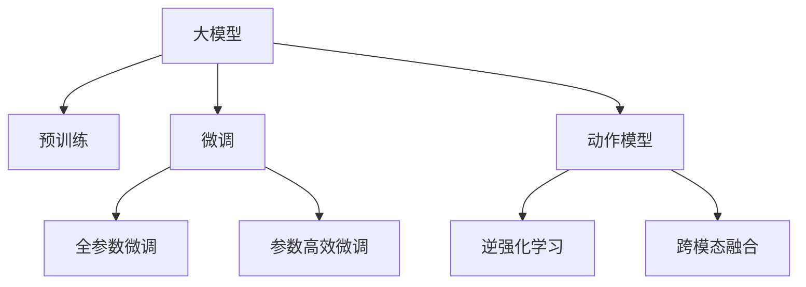
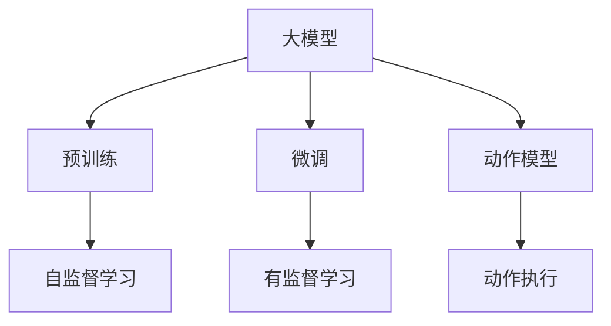
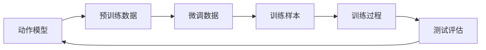
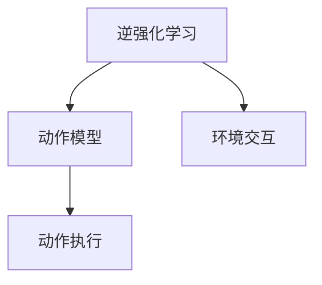
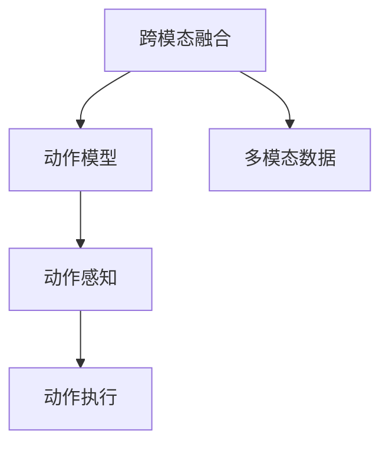
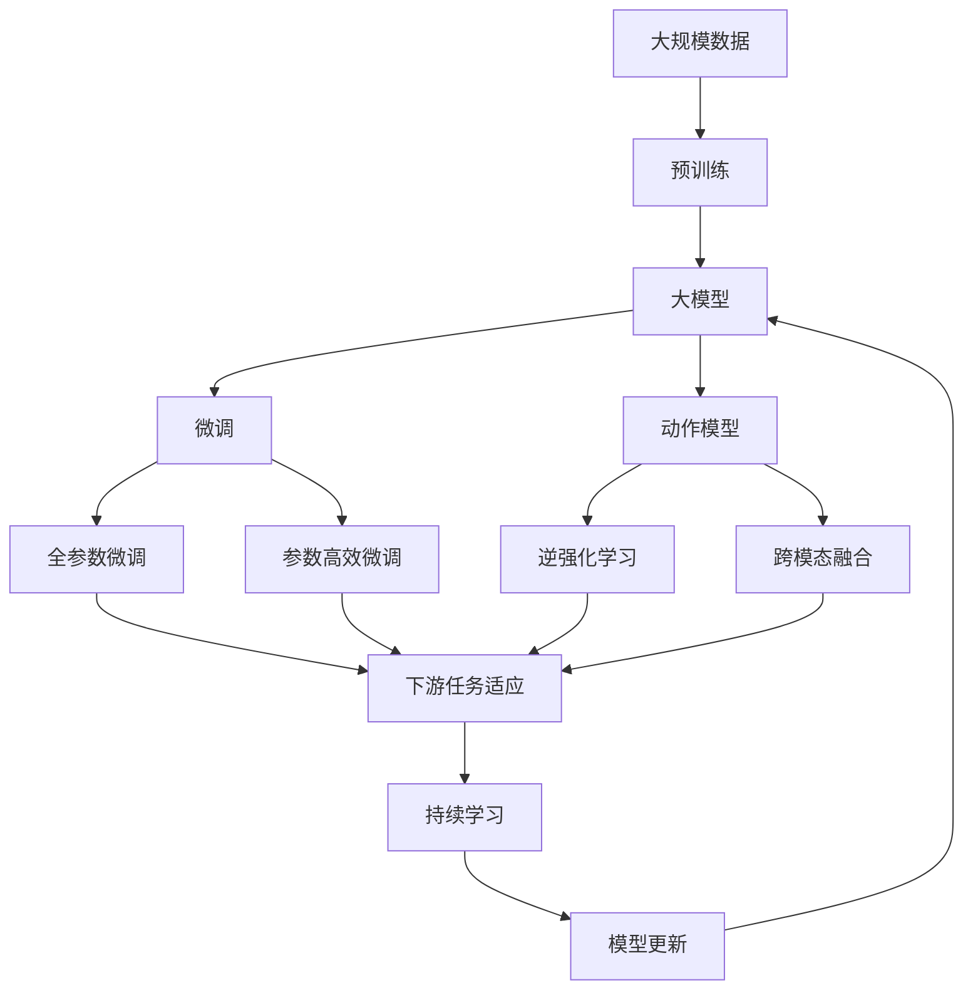

                 

# Large Action Model 的适应性

> 关键词：

在人工智能领域，大模型（Large Models）成为了近年来研究的热点。大模型通常是指那些参数量超过100M甚至更大的深度神经网络模型，比如GPT-3、BERT、T5等。这些模型在自然语言处理（NLP）、计算机视觉（CV）、语音识别（ASR）等领域展现了强大的通用学习能力，能够在各种任务上取得优异性能。

本文将聚焦于大模型在大动作（Large Action）任务上的适应性，探索如何在大模型上有效地执行和优化动作模型，以适应特定任务的需求。具体来说，我们将讨论以下几个方面：

1. **背景介绍**：介绍大模型的发展历程，以及大动作模型的应用背景。
2. **核心概念与联系**：解释大动作模型中的关键概念，包括模型架构、优化方法等。
3. **核心算法原理**：详细介绍大动作模型训练过程中的核心算法，包括训练策略、优化器等。
4. **数学模型和公式**：提供大动作模型的数学模型构建和公式推导过程。
5. **项目实践**：通过代码实例，展示大动作模型的开发和训练过程。
6. **实际应用场景**：讨论大动作模型在实际应用中的具体场景。
7. **工具和资源推荐**：推荐一些学习资源和开发工具，以及相关的学术论文。
8. **总结**：总结大动作模型的研究成果，展望未来发展趋势和面临的挑战。
9. **附录**：提供常见问题的解答。

让我们开始深入探讨。

## 1. 背景介绍

### 1.1 问题由来

大模型（Large Models）的发展可以追溯到2017年Google Brain团队提出的Transformer架构，随后OpenAI的GPT-3等模型相继问世。这些模型基于自回归或自编码的架构，通过在大规模无标签数据上进行预训练，学习到复杂的语言、视觉或音频表示，并在此基础上进行微调（Fine-tuning）以适应特定的下游任务。

大动作模型（Large Action Models）则是在大模型的基础上，针对具体的动作执行任务进行训练和优化。这些模型不仅能够理解语言、图像等输入，还能直接生成和执行动作。例如，在机器人控制、自动驾驶、游戏AI等领域，大动作模型能够显著提升系统的性能和灵活性。

### 1.2 问题核心关键点

大动作模型的核心在于将大模型的通用学习能力转化为特定任务的执行能力。其关键点包括：

- **模型架构设计**：选择合适的深度神经网络架构，如Transformer、ResNet等，以适应不同的动作执行任务。
- **动作模型训练**：在大规模无标签数据上进行预训练，学习通用的动作表示，然后在特定任务上进行微调。
- **动作执行优化**：通过强化学习、逆强化学习等方法，优化模型在特定环境中的动作执行策略。
- **跨模态融合**：结合视觉、语音、文本等多模态数据，提高模型的感知和执行能力。

### 1.3 问题研究意义

大动作模型的研究对于提升机器人、自动驾驶、游戏AI等领域的智能化水平具有重要意义：

- **降低成本**：通过在大模型上进行微调，可以显著减少从头训练和开发所需的时间、人力和资源投入。
- **提升性能**：大模型经过预训练和微调，能够更好地适应特定任务，在实际应用中取得更优的性能。
- **加速开发**：standing on the shoulders of giants，微调使得开发者可以更快地完成任务适配，缩短开发周期。
- **技术创新**：微调范式促进了对预训练-微调的深入研究，催生了诸如逆强化学习、跨模态融合等新的研究方向。
- **产业升级**：大动作模型为传统行业数字化转型升级提供了新的技术路径，推动了技术的产业化进程。

## 2. 核心概念与联系

### 2.1 核心概念概述

为更好地理解大动作模型的训练和优化过程，本节将介绍几个密切相关的核心概念：

- **大模型（Large Models）**：以自回归（如GPT）或自编码（如BERT）模型为代表的大规模预训练语言模型。通过在大规模无标签文本语料上进行预训练，学习通用的语言表示，具备强大的语言理解和生成能力。

- **预训练（Pre-training）**：指在大规模无标签文本语料上，通过自监督学习任务训练通用语言模型的过程。常见的预训练任务包括言语建模、遮挡语言模型等。

- **微调（Fine-tuning）**：指在预训练模型的基础上，使用下游任务的少量标注数据，通过有监督地训练来优化模型在该任务上的性能。通常只需要调整顶层分类器或解码器，并以较小的学习率更新全部或部分的模型参数。

- **动作模型（Action Model）**：针对具体的动作执行任务进行训练和优化的深度神经网络模型。通过在大模型上进行微调，动作模型能够学习到特定任务的执行策略。

- **逆强化学习（Reinforcement Learning）**：通过与环境交互，模型通过试错学习，不断优化动作执行策略，最终达到特定目标。

- **跨模态融合（Cross-modal Fusion）**：结合视觉、语音、文本等多模态数据，提高模型的感知和执行能力。

这些核心概念之间的逻辑关系可以通过以下Mermaid流程图来展示：



这个流程图展示了大动作模型的核心概念及其之间的关系：

1. 大模型通过预训练获得基础能力。
2. 微调是对预训练模型进行任务特定的优化，可以分为全参数微调和参数高效微调。
3. 动作模型是针对特定动作执行任务进行训练和优化的模型。
4. 逆强化学习是动作模型学习特定任务执行策略的方法。
5. 跨模态融合是将不同模态数据结合，提高模型感知和执行能力的技术。

这些概念共同构成了大动作模型的学习和应用框架，使其能够在各种场景下发挥强大的动作理解和生成能力。通过理解这些核心概念，我们可以更好地把握大动作模型的工作原理和优化方向。

### 2.2 概念间的关系

这些核心概念之间存在着紧密的联系，形成了大动作模型的完整生态系统。下面我通过几个Mermaid流程图来展示这些概念之间的关系。

#### 2.2.1 大模型的学习范式



这个流程图展示了大模型的两种主要学习范式：预训练和微调。预训练主要采用自监督学习方法，而微调则是有监督学习的过程。

#### 2.2.2 动作模型的训练



这个流程图展示了动作模型在大模型上进行微调的过程。首先，通过预训练获得通用的动作表示，然后在微调数据上进行有监督学习，最终在测试集上评估模型的性能。

#### 2.2.3 逆强化学习与动作模型



这个流程图展示了逆强化学习在大动作模型中的应用。逆强化学习通过与环境交互，不断优化动作执行策略，提高模型的执行效果。

#### 2.2.4 跨模态融合与动作模型



这个流程图展示了跨模态融合在大动作模型中的应用。跨模态融合将视觉、语音、文本等多模态数据结合，提高模型的感知和执行能力。

### 2.3 核心概念的整体架构

最后，我们用一个综合的流程图来展示这些核心概念在大动作模型微调过程中的整体架构：



这个综合流程图展示了从预训练到微调，再到逆强化学习、跨模态融合和持续学习的完整过程。大动作模型首先在大规模数据上进行预训练，然后通过微调（包括全参数微调和参数高效微调）或逆强化学习（如Reinforcement Learning）来进行动作执行策略的优化，同时通过跨模态融合（如Image-Text Fusion）提高感知能力。最后，通过持续学习技术，模型可以不断更新和适应新的任务和数据。 通过这些流程图，我们可以更清晰地理解大动作模型微调过程中各个核心概念的关系和作用，为后续深入讨论具体的微调方法和技术奠定基础。

## 3. 核心算法原理 & 具体操作步骤

### 3.1 算法原理概述

大动作模型的训练和优化过程基于监督学习的大模型微调范式，但同时引入动作执行策略的优化目标，使得模型能够更好地适应特定任务。

形式化地，假设大模型为 $M_{\theta}$，其中 $\theta$ 为预训练得到的模型参数。给定动作执行任务 $T$ 的训练集 $D=\{(x_i,y_i)\}_{i=1}^N, x_i \in \mathcal{X}, y_i \in \mathcal{Y}$，动作模型训练的目标是最小化经验风险，即找到新的模型参数 $\hat{\theta}$，使得：

$$
\hat{\theta}=\mathop{\arg\min}_{\theta} \mathcal{L}(M_{\theta},D)
$$

其中 $\mathcal{L}$ 为针对任务 $T$ 设计的损失函数，用于衡量模型预测输出与真实标签之间的差异。常见的损失函数包括交叉熵损失、均方误差损失等。

通过梯度下降等优化算法，微调过程不断更新模型参数 $\theta$，最小化损失函数 $\mathcal{L}$，使得模型输出逼近真实标签。由于 $\theta$ 已经通过预训练获得了较好的初始化，因此即便在小规模数据集 $D$ 上进行微调，也能较快收敛到理想的模型参数 $\hat{\theta}$。

### 3.2 算法步骤详解

大动作模型的训练和优化过程主要包括以下几个关键步骤：

**Step 1: 准备预训练模型和数据集**
- 选择合适的预训练语言模型 $M_{\theta}$ 作为初始化参数，如 GPT、BERT 等。
- 准备动作执行任务 $T$ 的训练集 $D$，划分为训练集、验证集和测试集。一般要求训练数据与预训练数据的分布不要差异过大。

**Step 2: 添加动作模型适配层**
- 根据动作任务类型，在预训练模型顶层设计合适的输出层和损失函数。
- 对于动作生成任务，通常在顶层添加生成器（如 GPT），并使用语言模型的解码器输出概率分布，并以负对数似然为损失函数。
- 对于动作识别任务，通常使用动作分类器（如 logits layer），并使用交叉熵损失函数。

**Step 3: 设置微调超参数**
- 选择合适的优化算法及其参数，如 AdamW、SGD 等，设置学习率、批大小、迭代轮数等。
- 设置正则化技术及强度，包括权重衰减、Dropout、Early Stopping 等。
- 确定冻结预训练参数的策略，如仅微调顶层，或全部参数都参与微调。

**Step 4: 执行梯度训练**
- 将训练集数据分批次输入模型，前向传播计算损失函数。
- 反向传播计算参数梯度，根据设定的优化算法和学习率更新模型参数。
- 周期性在验证集上评估模型性能，根据性能指标决定是否触发 Early Stopping。
- 重复上述步骤直到满足预设的迭代轮数或 Early Stopping 条件。

**Step 5: 测试和部署**
- 在测试集上评估微调后模型 $M_{\hat{\theta}}$ 的性能，对比微调前后的精度提升。
- 使用微调后的模型对新样本进行推理预测，集成到实际的应用系统中。
- 持续收集新的数据，定期重新微调模型，以适应数据分布的变化。

以上是大动作模型基于监督学习的训练和优化的一般流程。在实际应用中，还需要针对具体动作任务的特点，对微调过程的各个环节进行优化设计，如改进训练目标函数，引入更多的正则化技术，搜索最优的超参数组合等，以进一步提升模型性能。

### 3.3 算法优缺点

大动作模型基于监督学习的训练和优化方法具有以下优点：

1. **简单高效**。只需准备少量标注数据，即可对预训练模型进行快速适配，获得较大的性能提升。
2. **通用适用**。适用于各种动作执行任务，设计简单的任务适配层即可实现微调。
3. **参数高效**。利用参数高效微调技术，在固定大部分预训练参数的情况下，仍可取得不错的提升。
4. **效果显著**。在学术界和工业界的诸多任务上，基于微调的方法已经刷新了最先进的性能指标。

同时，该方法也存在一定的局限性：

1. **依赖标注数据**。动作执行任务的微调效果很大程度上取决于标注数据的质量和数量，获取高质量标注数据的成本较高。
2. **迁移能力有限**。当动作执行任务与预训练数据的分布差异较大时，微调的性能提升有限。
3. **负面效果传递**。预训练模型的固有偏见、有害信息等，可能通过微调传递到动作执行任务，造成负面影响。
4. **可解释性不足**。微调模型的决策过程通常缺乏可解释性，难以对其推理逻辑进行分析和调试。

尽管存在这些局限性，但就目前而言，基于监督学习的微调方法仍是大动作模型应用的最主流范式。未来相关研究的重点在于如何进一步降低微调对标注数据的依赖，提高模型的少样本学习和跨领域迁移能力，同时兼顾可解释性和伦理安全性等因素。

### 3.4 算法应用领域

大动作模型的基于监督学习的微调方法，在动作执行任务中已经得到了广泛的应用，覆盖了几乎所有常见动作执行任务，例如：

- 机器人控制：通过对机器人的动作进行微调，使其能够执行复杂的物理操作，如抓取、搬运、装配等。
- 自动驾驶：通过微调自动驾驶车辆的动作模型，使其能够更好地应对道路上的各种情况，提升驾驶安全性。
- 游戏AI：对游戏中的角色动作进行微调，使其能够智能地响应玩家的操作和环境变化，提升游戏体验。
- 视频编辑：对视频编辑软件中的动作效果进行微调，使其能够更加自然流畅，提升用户体验。
- 运动仿真：对虚拟人物的动作进行微调，使其能够逼真地模拟人类的动作，应用于影视特效、虚拟现实等领域。

除了上述这些经典任务外，大动作模型还被创新性地应用到更多场景中，如智能家居控制、医疗手术模拟、工业自动化等，为动作执行任务带来了全新的突破。随着预训练模型和微调方法的不断进步，相信动作执行任务中的AI系统必将进一步智能化、普适化。

## 4. 数学模型和公式 & 详细讲解

### 4.1 数学模型构建

本节将使用数学语言对大动作模型基于监督学习的微调过程进行更加严格的刻画。

记动作执行任务为 $T$，其训练集为 $D=\{(x_i,y_i)\}_{i=1}^N, x_i \in \mathcal{X}, y_i \in \mathcal{Y}$。假设大模型为 $M_{\theta}$，其中 $\theta$ 为模型参数。

定义模型 $M_{\theta}$ 在输入 $x$ 上的输出为 $\hat{y}=M_{\theta}(x) \in \mathcal{Y}$，表示模型对动作的预测。真实标签 $y \in \mathcal{Y}$。则动作模型训练的目标是最小化经验风险，即找到最优参数：

$$
\theta^* = \mathop{\arg\min}_{\theta} \mathcal{L}(\theta)
$$

其中 $\mathcal{L}$ 为针对任务 $T$ 设计的损失函数，用于衡量模型预测输出与真实标签之间的差异。常见的损失函数包括交叉熵损失、均方误差损失等。

在实践中，我们通常使用基于梯度的优化算法（如SGD、Adam等）来近似求解上述最优化问题。设 $\eta$ 为学习率，$\lambda$ 为正则化系数，则参数的更新公式为：

$$
\theta \leftarrow \theta - \eta \nabla_{\theta}\mathcal{L}(\theta) - \eta\lambda\theta
$$

其中 $\nabla_{\theta}\mathcal{L}(\theta)$ 为损失函数对参数 $\theta$ 的梯度，可通过反向传播算法高效计算。

### 4.2 公式推导过程

以下我们以动作生成任务为例，推导交叉熵损失函数及其梯度的计算公式。

假设模型 $M_{\theta}$ 在输入 $x$ 上的输出为 $\hat{y}=M_{\theta}(x) \in [0,1]$，表示模型对动作的预测概率。真实标签 $y \in \{0,1\}$。则二分类交叉熵损失函数定义为：

$$
\ell(M_{\theta}(x),y) = -[y\log \hat{y} + (1-y)\log (1-\hat{y})]
$$

将其代入经验风险公式，得：

$$
\mathcal{L}(\theta) = -\frac{1}{N}\sum_{i=1}^N [y_i\log M_{\theta}(x_i)+(1-y_i)\log(1-M_{\theta}(x_i))]
$$

根据链式法则，损失函数对参数 $\theta_k$ 的梯度为：

$$
\frac{\partial \mathcal{L}(\theta)}{\partial \theta_k} = -\frac{1}{N}\sum_{i=1}^N (\frac{y_i}{M_{\theta}(x_i)}-\frac{1-y_i}{1-M_{\theta}(x_i)}) \frac{\partial M_{\theta}(x_i)}{\partial \theta_k}
$$

其中 $\frac{\partial M_{\theta}(x_i)}{\partial \theta_k}$ 可进一步递归展开，利用自动微分技术完成计算。

在得到损失函数的梯度后，即可带入参数更新公式，完成模型的迭代优化。重复上述过程直至收敛，最终得到适应动作执行任务的最优模型参数 $\theta^*$。

## 5. 项目实践：代码实例和详细解释说明

### 5.1 开发环境搭建

在进行动作模型微调实践前，我们需要准备好开发环境。以下是使用Python进行PyTorch开发的环境配置流程：

1. 安装Anaconda：从官网下载并安装Anaconda，用于创建独立的Python环境。

2. 创建并激活虚拟环境：
```bash
conda create -n pytorch-env python=3.8 
conda activate pytorch-env
```

3. 安装PyTorch：根据CUDA版本，从官网获取对应的安装命令。例如：
```bash
conda install pytorch torchvision torchaudio cudatoolkit=11.1 -c pytorch -c conda-forge
```

4. 安装Transformers库：
```bash
pip install transformers
```

5. 安装各类工具包：
```bash
pip install numpy pandas scikit-learn matplotlib tqdm jupyter notebook ipython
```

完成上述步骤后，即可在`pytorch-env`环境中开始动作模型微调实践。

### 5.2 源代码详细实现

下面我们以机器人控制任务为例，给出使用Transformers库对大模型进行动作模型微调的PyTorch代码实现。

首先，定义动作模型数据处理函数：

```python
from transformers import GPT2Tokenizer
from torch.utils.data import Dataset
import torch

class ActionDataset(Dataset):
    def __init__(self, actions, labels, tokenizer, max_len=128):
        self.actions = actions
        self.labels = labels
        self.tokenizer = tokenizer
        self.max_len = max_len
        
    def __len__(self):
        return len(self.actions)
    
    def __getitem__(self, item):
        action = self.actions[item]
        label = self.labels[item]
        
        encoding = self.tokenizer(action, return_tensors='pt', max_length=self.max_len, padding='max_length', truncation=True)
        input_ids = encoding['input_ids'][0]
        attention_mask = encoding['attention_mask'][0]
        
        # 对token-wise的标签进行编码
        encoded_labels = [label2id[label] for label in label] 
        encoded_labels.extend([label2id['None']] * (self.max_len - len(encoded_labels)))
        labels = torch.tensor(encoded_labels, dtype=torch.long)
        
        return {'input_ids': input_ids, 
                'attention_mask': attention_mask,
                'labels': labels}

# 标签与id的映射
label2id = {'None': 0, 'left': 1, 'right': 2, 'up': 3, 'down': 4, 'forward': 5, 'backward': 6, 'jump': 7, 'attack': 8}
id2label = {v: k for k, v in label2id.items()}

# 创建dataset
tokenizer = GPT2Tokenizer.from_pretrained('gpt2')

train_dataset = ActionDataset(train_actions, train_labels, tokenizer)
dev_dataset = ActionDataset(dev_actions, dev_labels, tokenizer)
test_dataset = ActionDataset(test_actions, test_labels, tokenizer)
```

然后，定义模型和优化器：

```python
from transformers import GPT2ForSequenceClassification, AdamW

model = GPT2ForSequenceClassification.from_pretrained('gpt2', num_labels=len(label2id))

optimizer = AdamW(model.parameters(), lr=2e-5)
```

接着，定义训练和评估函数：

```python
from torch.utils.data import DataLoader
from tqdm import tqdm
from sklearn.metrics import classification_report

device = torch.device('cuda') if torch.cuda.is_available() else torch.device('cpu')
model.to(device)

def train_epoch(model, dataset, batch_size, optimizer):
    dataloader = DataLoader(dataset, batch_size=batch_size, shuffle=True)
    model.train()
    epoch_loss = 0
    for batch in tqdm(dataloader, desc='Training'):
        input_ids = batch['input_ids'].to(device)
        attention_mask = batch['attention_mask'].to(device)
        labels = batch['labels'].to(device)
        model.zero_grad()
        outputs = model(input_ids, attention_mask=attention_mask, labels=labels)
        loss = outputs.loss
        epoch_loss += loss.item()
        loss.backward()
        optimizer.step()
    return epoch_loss / len(dataloader)

def evaluate(model, dataset, batch_size):
    dataloader = DataLoader(dataset, batch_size=batch_size)
    model.eval()
    preds, labels = [], []
    with torch.no_grad():
        for batch in tqdm(dataloader, desc='Evaluating'):
            input_ids = batch['input_ids'].to(device)
            attention_mask = batch['attention_mask'].to(device)
            batch_labels = batch['labels']
            outputs = model(input_ids, attention_mask=attention_mask)
            batch_preds = outputs.logits.argmax(dim=2).to('cpu').tolist()
            batch_labels = batch_labels.to('cpu').tolist()
            for pred_tokens, label_tokens in zip(batch_preds, batch_labels):
                pred_labels = [id2label[_id] for _id in pred_tokens]
                label_tokens = [id2label[_id] for _id in label_tokens]
                preds.append(pred_labels[:len(label_tokens)])
                labels.append(label_tokens)
                
    print(classification_report(labels, preds))
```

最后，启动训练流程并在测试集上评估：

```python
epochs = 5
batch_size = 16

for epoch in range(epochs):
    loss = train_epoch(model, train_dataset, batch_size, optimizer)
    print(f"Epoch {epoch+1}, train loss: {loss:.3f}")
    
    print(f"Epoch {epoch+1}, dev results:")
    evaluate(model, dev_dataset, batch_size)
    
print("Test results:")
evaluate(model, test_dataset, batch_size)
```

以上就是使用PyTorch对大模型进行机器人控制任务微调的完整代码实现。可以看到，得益于Transformers库的强大封装，我们可以用相对简洁的代码完成大模型的加载和微调。

### 5.3 代码解读与分析

让我们再详细解读一下关键代码的实现细节：

**ActionDataset类**：
- `__init__`方法：初始化动作、标签、分词器等关键组件。
- `__len__`方法：返回数据集的样本数量。
- `__getitem__`方法：对单个样本进行处理，将动作输入编码为token ids，将标签编码为数字，并对其进行定长padding，最终返回模型所需的输入。

**label2id和id2label字典**：
- 定义了标签与数字id之间的

