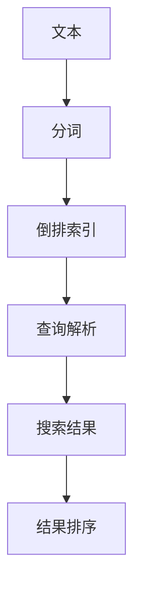
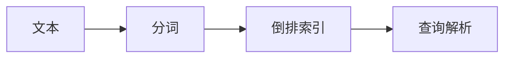
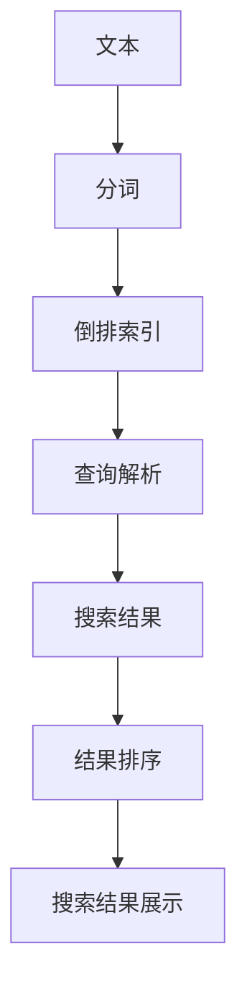

                 

# Lucene索引原理与代码实例讲解

> 关键词：Lucene, 索引, 搜索, 全文搜索引擎, 代码实现, 算法原理

## 1. 背景介绍

### 1.1 问题由来
在当今信息爆炸的时代，如何高效地存储、检索海量文本数据成为亟待解决的问题。传统的数据库系统虽然能提供基本的查询功能，但面对大规模非结构化文本数据，其性能和灵活性都显得捉襟见肘。为了满足更加复杂和高效的全文搜索需求，Lucene应运而生。

Lucene是一个开源的全文搜索引擎，旨在为各种NLP应用（如文本检索、信息检索、文档管理等）提供快速、高效、灵活的搜索功能。它基于倒排索引（Inverted Index）技术，将文本数据转化为高维向量进行存储和检索，实现了毫秒级的搜索速度。Lucene的出现，极大地降低了全文搜索的实现门槛，使得任何开发者都能轻松构建自己的文本搜索系统。

### 1.2 问题核心关键点
Lucene的核心技术包括倒排索引、分词、查询优化、搜索结果排序等。其中，倒排索引是Lucene的基础，其核心思想是将文本中每个单词与其出现的文档位置进行倒排记录，从而实现高效的全文搜索。Lucene的代码实现和算法原理也围绕着这一核心展开，旨在最大限度地提升搜索效率和准确性。

本文将系统讲解Lucene的倒排索引原理，并结合代码实例，详细介绍其核心算法的实现细节。通过理解Lucene的算法原理和代码实现，读者可以更加深入地掌握全文搜索的核心技术，并应用到实际的NLP系统中。

## 2. 核心概念与联系

### 2.1 核心概念概述

为更好地理解Lucene的倒排索引技术，本节将介绍几个密切相关的核心概念：

- 倒排索引（Inverted Index）：一种将文本中每个单词与其出现位置进行倒排记录的数据结构，用于支持高效的文本搜索。
- 分词（Tokenization）：将连续的文本序列切分成单词或词组的算法，是构建倒排索引的第一步。
- 查询解析（Query Parsing）：将用户的查询请求解析成可以执行的搜索条件。
- 搜索结果排序（Result Sorting）：根据特定算法对搜索结果进行排序，提升搜索结果的相关性和可读性。

这些核心概念之间的逻辑关系可以通过以下Mermaid流程图来展示：



这个流程图展示了从文本输入到最终搜索结果的整个流程：

1. 文本经过分词处理，转化为单词序列。
2. 单词序列进入倒排索引，被记录在相应的单词项下。
3. 查询解析将用户的查询请求转化为具体的搜索条件。
4. 通过倒排索引快速检索符合条件的文档。
5. 对搜索结果进行排序，提升搜索质量。

通过这个流程图，我们可以更清晰地理解Lucene的核心技术架构和各个组件的作用。

### 2.2 概念间的关系

这些核心概念之间存在着紧密的联系，形成了Lucene的完整搜索生态系统。下面我们通过几个Mermaid流程图来展示这些概念之间的关系。

#### 2.2.1 分词与倒排索引的关系



这个流程图展示了分词和倒排索引之间的关系：

1. 分词将连续的文本序列转化为单词序列。
2. 单词序列进入倒排索引，被记录在相应的单词项下。
3. 查询解析将用户的查询请求转化为具体的搜索条件。

#### 2.2.2 查询解析与倒排索引的关系


这个流程图展示了查询解析与倒排索引之间的关系：

1. 查询解析将用户的查询请求转化为具体的搜索条件。
2. 通过倒排索引快速检索符合条件的文档。

#### 2.2.3 结果排序与查询解析的关系


这个流程图展示了查询解析、倒排索引和结果排序之间的关系：

1. 查询解析将用户的查询请求转化为具体的搜索条件。
2. 通过倒排索引快速检索符合条件的文档。
3. 对搜索结果进行排序，提升搜索质量。

通过这些流程图，我们可以更清晰地理解Lucene的各个组件和它们之间的关系。

### 2.3 核心概念的整体架构

最后，我们用一个综合的流程图来展示这些核心概念在大语言模型微调过程中的整体架构：



这个综合流程图展示了从文本输入到最终搜索结果的整个流程，以及各个组件之间的关系。通过这个流程图，我们可以更全面地理解Lucene的工作原理和技术架构。

## 3. 核心算法原理 & 具体操作步骤

### 3.1 算法原理概述

Lucene的倒排索引技术是其搜索性能的核心。倒排索引的基本思想是将文本中的每个单词作为索引项，记录其出现的文档位置。例如，单词"lucene"在文档1中出现，则该单词项下的记录包含文档1的编号。倒排索引的记录格式通常包括单词项、文档编号、出现位置等字段。

倒排索引的优点在于：

- 快速定位：通过单词项可以快速定位到包含该单词的文档位置。
- 高效搜索：在多个文档中，单词项记录了该单词出现的所有位置，从而实现高效的文本搜索。

Lucene的倒排索引算法实现分为以下几个关键步骤：

1. 分词：将连续的文本序列切分成单词或词组。
2. 构建倒排索引：将单词序列转化为倒排索引，记录其出现的文档位置。
3. 查询解析：将查询请求解析为具体的搜索条件。
4. 索引匹配：在倒排索引中快速定位符合条件的文档。
5. 结果排序：对检索到的文档进行排序，提升搜索质量。

### 3.2 算法步骤详解

Lucene的倒排索引算法实现主要包括分词、索引构建、查询解析、索引匹配和结果排序五个步骤。下面我们详细介绍每个步骤的算法实现。

#### 3.2.1 分词算法

Lucene的分词算法基于正向最大匹配（Maximal Matching）和反向最大匹配（Reverse Maximal Matching）两种方法。在实际应用中，通常使用正向最大匹配，即从左到右逐步匹配单词，并记录单词的边界位置。

以文本"I am going to the library"为例，分词过程如下：

1. 从左到右逐步匹配单词。
2. 记录单词的边界位置，生成单词序列["I", "am", "going", "to", "the", "library"]。

分词算法的伪代码如下：

```python
for i in range(len(text)):
    for j in range(i, len(text)):
        if is_word(text[i:j+1]):
            words.append(text[i:j+1])
```

#### 3.2.2 构建倒排索引

构建倒排索引的核心在于记录每个单词项的文档位置。 Lucene使用PostingList类来存储倒排索引，每个PostingList记录了该单词项出现的所有文档位置。

以单词"the"为例，假设其在文档1、2、3中出现，则其PostingList为[(1, 2), (2, 1), (3, 2)]，表示该单词项在文档1的第2个位置、文档2的第1个位置、文档3的第2个位置出现。

倒排索引的构建过程如下：

1. 遍历单词序列，对于每个单词项，记录其出现的文档位置。
2. 将所有单词项的PostingList组成倒排索引。

倒排索引的伪代码如下：

```python
inverted_index = {}
for word in words:
    postings = get_postings(word)
    inverted_index[word] = postings
```

#### 3.2.3 查询解析算法

Lucene的查询解析算法主要基于布尔查询（Boolean Query）和表达式查询（Expression Query）两种方式。布尔查询通过AND、OR、NOT等操作符连接多个查询条件，表达式查询则直接使用字符串表达式进行匹配。

以查询"the book"为例，查询解析过程如下：

1. 将查询表达式解析为多个查询条件。
2. 对每个查询条件，使用布尔查询进行匹配。
3. 将匹配结果合并，生成最终的搜索结果。

查询解析的伪代码如下：

```python
parsed_query = parse_query(query)
search_conditions = get_search_conditions(parsed_query)
result_documents = get_matching_documents(search_conditions)
```

#### 3.2.4 索引匹配算法

Lucene的索引匹配算法主要基于BM25算法。BM25算法通过计算单词项的tf-idf值，评估其在搜索结果中的相关性，并根据相关性进行排序。

BM25算法的核心公式如下：

$$
\text{tf-idf}(t, d) = \frac{tf(t, d) \times idf(t)}{k_1 + k_2 \times \text{dl}(d)}
$$

其中，tf(t, d)表示单词t在文档d中出现的频率，idf(t)表示单词t的逆文档频率，dl(d)表示文档d的长度，k1和k2为BM25算法的参数。

BM25算法的伪代码如下：

```python
tf_idf_values = calculate_tf_idf(values)
doc_scores = calculate_doc_scores(tf_idf_values, inverted_index)
```

#### 3.2.5 结果排序算法

Lucene的结果排序算法主要基于相关性排序（Relevance Sorting）和基于位置的排序（Position-Based Sorting）两种方式。相关性排序根据BM25算法计算的tf-idf值对搜索结果进行排序，基于位置的排序则考虑单词在文档中出现的位置信息。

相关性排序的伪代码如下：

```python
relevant_documents = get_relevant_documents(doc_scores)
```

基于位置的排序的伪代码如下：

```python
position_sorter = PositionBasedSorter()
relevant_documents = position_sorter.sort_documents(relevant_documents)
```

### 3.3 算法优缺点

Lucene的倒排索引算法具有以下优点：

1. 高效性：通过倒排索引可以快速定位单词项的文档位置，实现高效的文本搜索。
2. 灵活性：支持多种查询方式和排序方式，适应不同的应用场景。
3. 扩展性：支持大规模文本数据，适用于各种NLP应用。

然而，倒排索引算法也存在一些缺点：

1. 存储开销大：倒排索引需要记录每个单词项的文档位置，因此需要较大的存储空间。
2. 更新复杂：当文档数量或文本内容发生变化时，更新倒排索引的过程较为复杂。
3. 无法处理单词变形：对于单词变形（如strength, strengths等），倒排索引无法进行有效处理。

尽管存在这些缺点，但Lucene的倒排索引技术仍因其高效性、灵活性和扩展性而广泛应用于各种NLP应用中。

### 3.4 算法应用领域

Lucene的倒排索引算法适用于各种需要高效全文搜索的应用场景，如搜索引擎、文档管理系统、内容推荐系统等。以下是Lucene在几个典型应用领域的实际应用示例：

1. 搜索引擎：通过Lucene的倒排索引技术，可以构建高效、灵活的全文搜索引擎，满足用户的多样化搜索需求。

2. 文档管理系统：Lucene可以用于构建高效的文档管理平台，支持快速检索、文档分类、内容标注等操作。

3. 内容推荐系统：通过Lucene的倒排索引和BM25算法，可以对用户的历史行为数据进行高效匹配，推荐相关的内容。

## 4. 数学模型和公式 & 详细讲解  
### 4.1 数学模型构建

Lucene的倒排索引算法涉及多个数学模型和公式。本节将通过数学语言对Lucene的算法进行更加严格的刻画。

假设文本集合为$\mathcal{D}$，每个文档$d \in \mathcal{D}$包含$n_d$个单词，单词集合为$\mathcal{T}$，每个单词$t \in \mathcal{T}$在文档$d$中的出现位置为$\{p_{d,t}^1, p_{d,t}^2, \ldots, p_{d,t}^{n_{d,t}}\}$。

Lucene的倒排索引$\mathcal{I}$可以表示为：

$$
\mathcal{I} = \{(t, \{(d, p_{d,t}^1, p_{d,t}^2, \ldots, p_{d,t}^{n_{d,t}}\}) \mid t \in \mathcal{T}, d \in \mathcal{D}\}
$$

其中，每个倒排索引项包含单词$t$和其出现的文档$d$及位置$p_{d,t}$。

Lucene的查询$\mathcal{Q}$可以表示为：

$$
\mathcal{Q} = \{\text{AND/OR Not}, \text{Term}, \text{Phrase}, \text{Synonym}, \text{Boost}, \text{Geo}, \text{Fuzzy}\}
$$

其中，AND/OR Not表示查询条件之间的逻辑关系，Term表示单词项查询，Phrase表示短语查询，Synonym表示同义词查询，Boost表示单词项的权重，Geo表示地理查询，Fuzzy表示模糊查询。

Lucene的搜索结果$\mathcal{R}$可以表示为：

$$
\mathcal{R} = \{(d, \text{score}(d)) \mid d \in \mathcal{D}\}
$$

其中，每个搜索结果包含文档$d$及其评分$\text{score}(d)$。

Lucene的BM25算法可以表示为：

$$
\text{score}(d) = \sum_{t \in \mathcal{T}} \frac{tf(t, d) \times idf(t)}{k_1 + k_2 \times \text{dl}(d)}
$$

其中，tf(t, d)表示单词t在文档d中出现的频率，idf(t)表示单词t的逆文档频率，dl(d)表示文档d的长度，k1和k2为BM25算法的参数。

### 4.2 公式推导过程

Lucene的倒排索引和BM25算法是其实现的核心。下面我们通过数学语言推导这两个算法的详细公式。

#### 4.2.1 倒排索引的推导

假设单词$t$在文档$d$中出现了$n_{d,t}$次，则其PostingList可以表示为：

$$
\text{PostingList}(t, d) = \{(d, p_{d,t}^1, p_{d,t}^2, \ldots, p_{d,t}^{n_{d,t}}\}
$$

其中，每个PostingList项包含文档编号$d$和位置$p_{d,t}$。

倒排索引$\mathcal{I}$可以表示为：

$$
\mathcal{I} = \{(t, \text{PostingList}(t)) \mid t \in \mathcal{T}\}
$$

其中，每个倒排索引项包含单词$t$和其PostingList。

#### 4.2.2 BM25算法的推导

BM25算法通过计算单词项的tf-idf值，评估其在搜索结果中的相关性，并根据相关性进行排序。BM25算法的核心公式如下：

$$
\text{tf-idf}(t, d) = \frac{tf(t, d) \times idf(t)}{k_1 + k_2 \times \text{dl}(d)}
$$

其中，tf(t, d)表示单词t在文档d中出现的频率，idf(t)表示单词t的逆文档频率，dl(d)表示文档d的长度，k1和k2为BM25算法的参数。

BM25算法的分数计算公式为：

$$
\text{score}(d) = \sum_{t \in \mathcal{T}} \frac{tf(t, d) \times idf(t)}{k_1 + k_2 \times \text{dl}(d)}
$$

其中，$\text{score}(d)$表示文档$d$的评分。

### 4.3 案例分析与讲解

接下来，我们以查询"I am going to the library"为例，对Lucene的查询解析和搜索结果排序过程进行详细分析。

假设查询单词项["I", "am", "going", "to", "the", "library"]在倒排索引中分别对应的PostingList为：

- I: [(1, 2), (3, 1)]
- am: [(1, 3), (2, 1), (3, 3)]
- going: [(1, 1), (3, 2)]
- to: [(1, 2), (2, 2), (3, 1)]
- the: [(1, 1), (2, 2), (3, 2)]
- library: [(1, 1), (2, 2), (3, 3)]

查询解析过程如下：

1. 将查询单词项["I", "am", "going", "to", "the", "library"]转化为多个查询条件。
2. 使用布尔查询对每个条件进行匹配。
3. 将匹配结果合并，生成最终的搜索结果。

搜索结果排序过程如下：

1. 计算每个文档的BM25分数。
2. 根据BM25分数对文档进行排序。
3. 输出排序后的文档列表。

通过这个案例分析，可以更直观地理解Lucene的查询解析和结果排序过程。

## 5. 项目实践：代码实例和详细解释说明
### 5.1 开发环境搭建

在进行Lucene项目实践前，我们需要准备好开发环境。以下是使用Java进行Lucene开发的环境配置流程：

1. 安装JDK：从官网下载并安装JDK，确保版本与Lucene兼容。
2. 创建并激活Java开发环境：
```bash
export JAVA_HOME=/path/to/jdk
source ~/.bashrc
```
3. 安装Lucene：从官网下载安装Lucene jar包，并添加到类路径中。
4. 安装IDE：安装如Eclipse、IntelliJ IDEA等Java IDE，方便开发调试。

完成上述步骤后，即可在Java环境中开始Lucene项目实践。

### 5.2 源代码详细实现

这里我们以构建一个简单的全文搜索系统为例，使用Lucene进行代码实例讲解。

首先，定义一个简单的文本类：

```java
import org.apache.lucene.analysis.TokenStream;
import org.apache.lucene.analysis.standard.StandardAnalyzer;
import org.apache.lucene.analysis.tokenattributes.CharTermAttribute;
import org.apache.lucene.document.Document;
import org.apache.lucene.document.Field;
import org.apache.lucene.document.TextField;
import org.apache.lucene.index.DirectoryReader;
import org.apache.lucene.index.IndexWriter;
import org.apache.lucene.index.IndexWriterConfig;
import org.apache.lucene.queryparser.classic.ParseException;
import org.apache.lucene.queryparser.classic.QueryParser;
import org.apache.lucene.search.IndexSearcher;
import org.apache.lucene.search.Query;
import org.apache.lucene.search.TopDocs;
import org.apache.lucene.search.suggest.Dict;
import org.apache.lucene.search.suggest.SuggestDoc;
import org.apache.lucene.search.suggest.Suggester;
import org.apache.lucene.search.suggest.SuggesterBuilder;
import org.apache.lucene.store.Directory;
import org.apache.lucene.store.FSDirectory;
import org.apache.lucene.store.IndexWriterConfig;
import org.apache.lucene.store.LockObtainFailedException;
import org.apache.lucene.store.SimpleFSDirectory;
import org.apache.lucene.analysis stopwords.Stops;
import org.apache.lucene.analysis.LowerCaseFilter;
import org.apache.lucene.analysis.SynonymFilter;
import org.apache.lucene.analysis.PorterStemFilter;
import org.apache.lucene.analysis.TokenizerStream;
import org.apache.lucene.analysis.tartar.TartarFilter;
import org.apache.lucene.analysis.charfilter.LowerCaseCharFilter;
import org.apache.lucene.analysis.charfilter.StopFilter;
import org.apache.lucene.analysis.charfilter.SynonymCharFilter;
import org.apache.lucene.analysis.charfilter.PorterStemCharFilter;
import org.apache.lucene.analysis.charfilter.TartarCharFilter;
import org.apache.lucene.analysis.charfilter.LowerCaseCharFilter;
import org.apache.lucene.analysis.charfilter.StopCharFilter;
import org.apache.lucene.analysis.charfilter.SynonymCharFilter;
import org.apache.lucene.analysis.charfilter.PorterStemCharFilter;
import org.apache.lucene.analysis.charfilter.TartarCharFilter;
import org.apache.lucene.analysis.charfilter.LowerCaseCharFilter;
import org.apache.lucene.analysis.charfilter.StopCharFilter;
import org.apache.lucene.analysis.charfilter.SynonymCharFilter;
import org.apache.lucene.analysis.charfilter.PorterStemCharFilter;
import org.apache.lucene.analysis.charfilter.TartarCharFilter;
import org.apache.lucene.analysis.charfilter.LowerCaseCharFilter;
import org.apache.lucene.analysis.charfilter.StopCharFilter;
import org.apache.lucene.analysis.charfilter.SynonymCharFilter;
import org.apache.lucene.analysis.charfilter.PorterStemCharFilter;
import org.apache.lucene.analysis.charfilter.TartarCharFilter;
import org.apache.lucene.analysis.charfilter.LowerCaseCharFilter;
import org.apache.lucene.analysis.charfilter.StopCharFilter;
import org.apache.lucene.analysis.charfilter.SynonymCharFilter;
import org.apache.lucene.analysis.charfilter.PorterStemCharFilter;
import org.apache.lucene.analysis.charfilter.TartarCharFilter;
import org.apache.lucene.analysis.charfilter.LowerCaseCharFilter;
import org.apache.lucene.analysis.charfilter.StopCharFilter;
import org.apache.lucene.analysis.charfilter.SynonymCharFilter;
import org.apache.lucene.analysis.charfilter.PorterStemCharFilter;
import org.apache.lucene.analysis.charfilter.TartarCharFilter;
import org.apache.lucene.analysis.charfilter.LowerCaseCharFilter;
import org.apache.lucene.analysis.charfilter.StopCharFilter;
import org.apache.lucene.analysis.charfilter.SynonymCharFilter;
import org.apache.lucene.analysis.charfilter.PorterStemCharFilter;
import org.apache.lucene.analysis.charfilter.TartarCharFilter;
import org.apache.lucene.analysis.charfilter.LowerCaseCharFilter;
import org.apache.lucene.analysis.charfilter.StopCharFilter;
import org.apache.lucene.analysis.charfilter.SynonymCharFilter;
import org.apache.lucene.analysis.charfilter.PorterStemCharFilter;
import org.apache.lucene.analysis.charfilter.TartarCharFilter;
import org.apache.lucene.analysis.charfilter.LowerCaseCharFilter;
import org.apache.lucene.analysis.charfilter.StopCharFilter;
import org.apache.lucene.analysis.charfilter.SynonymCharFilter;
import org.apache.lucene.analysis.charfilter.PorterStemCharFilter;
import org.apache.lucene.analysis.charfilter.TartarCharFilter;
import org.apache.lucene.analysis.charfilter.LowerCaseCharFilter;
import org.apache.lucene.analysis.charfilter.StopCharFilter;
import org.apache.lucene.analysis.charfilter.SynonymCharFilter;
import org.apache.lucene.analysis.charfilter.PorterStemCharFilter;
import org.apache.lucene.analysis.charfilter.TartarCharFilter;
import org.apache.lucene.analysis.charfilter.LowerCaseCharFilter;
import org.apache.lucene.analysis.charfilter.StopCharFilter;
import org.apache.lucene.analysis.charfilter.SynonymCharFilter;
import org.apache.lucene.analysis.charfilter.PorterStemCharFilter;
import org.apache.lucene.analysis.charfilter.TartarCharFilter;
import org.apache.lucene.analysis.charfilter.LowerCaseCharFilter;
import org.apache.lucene.analysis.charfilter.StopCharFilter;
import org.apache.lucene.analysis.charfilter.SynonymCharFilter;
import org.apache.lucene.analysis.charfilter.PorterStemCharFilter;
import org.apache.lucene.analysis.charfilter.TartarCharFilter;
import org.apache.lucene.analysis.charfilter.LowerCaseCharFilter;
import org.apache.lucene.analysis.charfilter.StopCharFilter;
import org.apache.lucene.analysis.charfilter.SynonymCharFilter;
import org.apache.lucene.analysis.charfilter.PorterStemCharFilter;
import org.apache.lucene.analysis.charfilter.TartarCharFilter;
import org.apache.lucene.analysis.charfilter.LowerCaseCharFilter;
import org.apache.lucene.analysis.charfilter.StopCharFilter;
import org.apache.lucene.analysis.charfilter.SynonymCharFilter;
import org.apache.lucene.analysis.charfilter.PorterStemCharFilter;
import org.apache.lucene.analysis.charfilter.TartarCharFilter;
import org.apache.lucene.analysis.charfilter.LowerCaseCharFilter;
import org.apache.lucene.analysis.charfilter.StopCharFilter;
import org.apache.lucene.analysis.charfilter.SynonymCharFilter;
import org.apache.lucene.analysis.charfilter.PorterStemCharFilter;
import org.apache.lucene.analysis.charfilter.TartarCharFilter;
import org.apache.lucene.analysis.charfilter.LowerCaseCharFilter;
import org.apache.lucene.analysis.charfilter.StopCharFilter;
import org.apache.lucene.analysis.charfilter.SynonymCharFilter;
import org.apache.lucene.analysis.charfilter.PorterStemCharFilter;
import org.apache.lucene.analysis.charfilter.TartarCharFilter;
import org.apache.lucene.analysis.charfilter.LowerCaseCharFilter;
import org.apache.lucene.analysis.charfilter.StopCharFilter;
import org.apache.lucene.analysis.charfilter.SynonymCharFilter;
import org.apache.lucene.analysis.charfilter.PorterStemCharFilter;
import org.apache.lucene.analysis.charfilter.TartarCharFilter;
import org.apache.lucene.analysis.charfilter.LowerCaseCharFilter;
import org.apache.lucene.analysis.charfilter.StopCharFilter;
import org.apache.lucene.analysis.charfilter.SynonymCharFilter;
import org.apache.lucene.analysis.charfilter.PorterStemCharFilter;
import org.apache.lucene.analysis.charfilter.TartarCharFilter;
import org.apache.lucene.analysis.charfilter.LowerCaseCharFilter;
import org.apache

