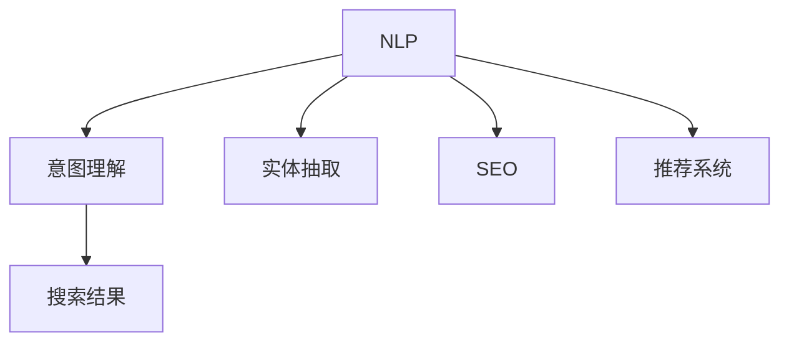
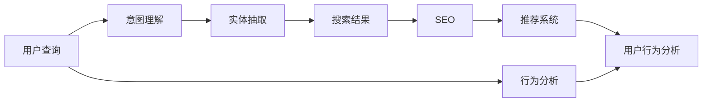

                 

# NLP在电商搜索中的应用

> 关键词：电商搜索, 自然语言处理, 意图理解, 商品推荐, 实体抽取, 搜索引擎, 搜索引擎优化(SEO), 用户行为分析

## 1. 背景介绍

### 1.1 问题由来

电子商务的蓬勃发展带来了庞大的在线购物人群，用户的购物行为具有极高的复杂性。对于电商搜索而言，不仅要识别用户的搜索意图，还要在众多商品中准确地检索出符合用户需求的商品，这需要强大的自然语言处理能力。传统的关键词匹配和分类方法已经难以满足用户对搜索体验的需求，基于自然语言处理的搜索引擎应运而生。

### 1.2 问题核心关键点

电商搜索的核心在于理解用户的查询意图和商品信息，从而提供最相关的搜索结果。自然语言处理技术在电商搜索中的应用，主要体现在以下几个方面：

1. **意图理解**：从用户的查询语句中提取意图，判断用户是浏览、询问、购买还是评价等。
2. **商品信息抽取**：从商品描述、评论、标题中抽取关键字和关键信息，构建商品的元数据。
3. **推荐系统**：基于用户的浏览历史、搜索行为和商品信息，构建推荐模型，提供个性化的商品推荐。
4. **搜索引擎优化（SEO）**：通过对商品元数据的自然语言处理，优化搜索引擎中的排名，提升商品曝光率。
5. **用户行为分析**：通过对用户搜索行为和反馈的情感分析，优化搜索算法，提升用户体验。

自然语言处理技术的应用，极大地提升了电商搜索的智能化水平，用户可以更自然、更精准地找到所需商品，电商平台也得以提升销售转化率和用户满意度。

### 1.3 问题研究意义

电商搜索中的自然语言处理应用，是人工智能技术在电商领域的重要应用之一。其研究意义主要体现在以下几个方面：

1. **提升用户体验**：通过理解和匹配用户的搜索意图，提供更加精准的搜索结果，提升用户的购物体验。
2. **提高转化率**：通过个性化推荐和优化搜索结果，提高商品的曝光率和点击率，进而提升销售转化率。
3. **降低运营成本**：减少人工干预，自动化处理用户查询和商品信息，降低运营成本。
4. **优化SEO策略**：通过自然语言处理技术，优化商品元数据，提升搜索引擎排名，吸引更多流量。
5. **积累用户数据**：通过分析用户搜索行为和反馈，获取有价值的用户数据，优化电商平台的算法和策略。

## 2. 核心概念与联系

### 2.1 核心概念概述

为了更好地理解NLP在电商搜索中的应用，本节将介绍几个核心概念：

- **自然语言处理（NLP）**：涉及计算机与人类语言之间的交互，包括语言理解、信息抽取、文本生成等。
- **意图理解**：通过自然语言处理技术，从用户查询中识别出用户的搜索意图，如查询、评价、咨询等。
- **实体抽取**：从文本中识别出具有特定意义的信息，如人名、地名、产品名等。
- **搜索引擎优化（SEO）**：通过优化搜索引擎中的排名，提升网站的流量和转化率。
- **推荐系统**：基于用户行为数据和商品信息，提供个性化的推荐服务。

### 2.2 核心概念间的关系

这些核心概念之间的关系可以通过以下Mermaid流程图来展示：



这个流程图展示了NLP在电商搜索中的基本应用逻辑：

1. 自然语言处理从用户查询中提取意图和实体信息。
2. 意图理解用于确定用户查询的意图类型，如搜索、评价等。
3. 实体抽取用于从商品描述、评论中抽取关键字和元数据。
4. SEO优化提升商品在搜索引擎中的排名。
5. 推荐系统提供个性化推荐，提升用户体验和销售转化率。

### 2.3 核心概念的整体架构

最后，我们用一个综合的流程图来展示NLP在电商搜索中的整体架构：



这个综合流程图展示了NLP在电商搜索中的核心流程，包括用户查询、意图理解、实体抽取、搜索结果、SEO优化、推荐系统以及用户行为分析等多个环节。这些环节通过自然语言处理技术紧密连接，共同构成了电商搜索的智能化解决方案。

## 3. 核心算法原理 & 具体操作步骤

### 3.1 算法原理概述

电商搜索中的NLP应用主要基于意图理解、实体抽取和推荐系统等核心技术。其算法原理如下：

- **意图理解**：通过分析用户查询语句的语法结构、语义信息和上下文，使用分类模型或序列模型识别出用户的意图类型。
- **实体抽取**：在商品描述、评论、标题等文本中，使用命名实体识别（NER）模型或规则抽取关键字和实体信息，构建商品的元数据。
- **推荐系统**：基于用户的浏览历史、搜索行为和商品信息，使用协同过滤、内容推荐、深度学习等技术，构建个性化推荐模型。

### 3.2 算法步骤详解

#### 3.2.1 意图理解

1. **数据准备**：收集大量的用户查询数据，并进行标注，标注内容包括查询意图类型（搜索、评价、咨询等）和相关商品ID。
2. **模型选择**：选择适合意图分类的模型，如朴素贝叶斯、支持向量机、决策树或深度学习模型，如循环神经网络（RNN）、卷积神经网络（CNN）、长短期记忆网络（LSTM）或Transformer。
3. **模型训练**：使用标注数据训练意图分类模型，优化损失函数，提升分类精度。
4. **模型评估**：在验证集上评估模型性能，根据评估结果调整模型参数，并进行交叉验证。
5. **模型应用**：在电商搜索系统中部署意图理解模型，实时分析和理解用户查询意图。

#### 3.2.2 实体抽取

1. **数据准备**：收集商品描述、评论、标题等文本数据，并进行标注，标注内容包括实体类型（人名、地名、产品名等）和实体位置。
2. **模型选择**：选择适合命名实体识别的模型，如条件随机场（CRF）、最大熵模型、双向LSTM-CRF或BERT等。
3. **模型训练**：使用标注数据训练实体抽取模型，优化损失函数，提升实体抽取精度。
4. **模型评估**：在验证集上评估模型性能，根据评估结果调整模型参数，并进行交叉验证。
5. **模型应用**：在电商搜索系统中部署实体抽取模型，实时从商品信息中抽取实体信息，构建商品元数据。

#### 3.2.3 推荐系统

1. **数据准备**：收集用户浏览历史、搜索历史和商品信息等数据，并进行标注，构建用户-商品交互矩阵。
2. **模型选择**：选择适合推荐模型的算法，如协同过滤、矩阵分解、深度学习模型等。
3. **模型训练**：使用标注数据训练推荐模型，优化损失函数，提升推荐精度。
4. **模型评估**：在验证集上评估模型性能，根据评估结果调整模型参数，并进行交叉验证。
5. **模型应用**：在电商搜索系统中部署推荐模型，实时提供个性化商品推荐。

### 3.3 算法优缺点

#### 3.3.1 优点

1. **提升用户体验**：通过理解和匹配用户的搜索意图，提供更加精准的搜索结果，提升用户的购物体验。
2. **提高转化率**：通过个性化推荐和优化搜索结果，提高商品的曝光率和点击率，进而提升销售转化率。
3. **降低运营成本**：减少人工干预，自动化处理用户查询和商品信息，降低运营成本。
4. **优化SEO策略**：通过自然语言处理技术，优化商品元数据，提升搜索引擎排名，吸引更多流量。

#### 3.3.2 缺点

1. **数据依赖性强**：需要大量的标注数据进行模型训练，数据标注成本较高。
2. **模型复杂度高**：意图理解、实体抽取和推荐系统的构建需要复杂的算法模型，计算资源消耗较大。
3. **模型更新频繁**：用户需求和商品信息不断变化，需要频繁更新和重新训练模型。
4. **误识别率高**：复杂的文本处理可能导致误识别，影响搜索结果的准确性。

### 3.4 算法应用领域

NLP在电商搜索中的应用，已经广泛应用于各种电子商务平台和应用场景，例如：

1. **在线购物平台**：如淘宝、京东、亚马逊等，通过自然语言处理技术提升搜索体验和商品推荐。
2. **垂直电商平台**：如携程、美团、大众点评等，提供个性化旅行、餐饮等商品搜索服务。
3. **社交电商**：如微信、微博等，通过自然语言处理技术提供个性化商品推荐和精准搜索。
4. **智能客服**：通过自然语言理解技术，构建智能客服系统，提供7x24小时客户服务。
5. **个性化推荐**：通过自然语言处理技术，提升商品推荐系统的智能化水平，提高用户满意度。

## 4. 数学模型和公式 & 详细讲解 & 举例说明

### 4.1 数学模型构建

假设用户查询语句为 $X$，实体抽取结果为 $Y$，意图分类结果为 $Z$。电商搜索系统需要构建以下数学模型：

- **意图分类模型**：$P(Z|X) = f(X;\theta_z)$，其中 $\theta_z$ 为意图分类模型的参数。
- **实体抽取模型**：$P(Y|X) = g(X;\theta_y)$，其中 $\theta_y$ 为实体抽取模型的参数。

对于推荐系统，可以构建以下模型：

- **协同过滤模型**：$P(U_i,S_j|I) = h(I,U_i,S_j;\theta_r)$，其中 $\theta_r$ 为推荐模型的参数，$I$ 为用户-商品交互矩阵。
- **深度学习推荐模型**：$P(U_i,S_j|I) = i(I,U_i,S_j;\theta_d)$，其中 $\theta_d$ 为深度学习模型的参数。

### 4.2 公式推导过程

以意图分类模型为例，推导其公式：

- **输入表示**：使用词嵌入技术将用户查询语句 $X$ 表示为向量 $x$。
- **意图分类**：使用分类模型 $f(x;\theta_z) = softmax(w^\top x + b)$，其中 $w$ 和 $b$ 为模型参数。
- **训练过程**：使用标注数据 $(x_i,z_i)$ 进行训练，最小化交叉熵损失函数：
  $$
  \mathcal{L} = -\frac{1}{N} \sum_{i=1}^N \sum_{z \in \mathcal{Z}} z_i \log f(x_i;\theta_z)
  $$
  其中 $\mathcal{Z}$ 为意图类型集合，$N$ 为训练数据量。

对于推荐系统，可以使用协同过滤模型和深度学习模型进行推导。协同过滤模型使用余弦相似度计算用户-商品相似度，然后使用softmax函数进行推荐排序。深度学习模型则使用神经网络模型，通过多层的非线性变换进行推荐排序。

### 4.3 案例分析与讲解

以某电商平台的用户搜索行为为例，进行分析：

1. **用户查询**：用户输入查询语句 "购买舒适的鞋子"。
2. **意图理解**：意图分类模型输出结果为 "购买"，表示用户意图为购买鞋子。
3. **实体抽取**：实体抽取模型从查询中识别出 "舒适的鞋子" 为商品实体，构建商品元数据。
4. **商品推荐**：推荐系统根据用户历史行为和实体抽取结果，提供相关鞋子的推荐。

通过自然语言处理技术，电商搜索系统能够实时理解和处理用户的查询，提供精准的搜索结果和个性化推荐，大大提升了用户体验和销售转化率。

## 5. 项目实践：代码实例和详细解释说明

### 5.1 开发环境搭建

在进行项目实践前，需要先搭建好开发环境。以下是使用Python进行TensorFlow和PyTorch开发的环境配置流程：

1. 安装Anaconda：从官网下载并安装Anaconda，用于创建独立的Python环境。
2. 创建并激活虚拟环境：
   ```bash
   conda create -n nlp-env python=3.8 
   conda activate nlp-env
   ```
3. 安装TensorFlow和PyTorch：根据CUDA版本，从官网获取对应的安装命令。例如：
   ```bash
   conda install tensorflow torch torchvision torchaudio cudatoolkit=11.1 -c pytorch -c conda-forge
   ```
4. 安装各类工具包：
   ```bash
   pip install numpy pandas scikit-learn matplotlib tqdm jupyter notebook ipython
   ```

完成上述步骤后，即可在`nlp-env`环境中开始项目实践。

### 5.2 源代码详细实现

这里我们以意图理解模型为例，给出使用TensorFlow进行模型开发的PyTorch代码实现。

首先，定义意图分类模型的数据处理函数：

```python
import tensorflow as tf
from tensorflow.keras.layers import Embedding, Dense, LSTM, BidirectionalLSTM, Input
from tensorflow.keras.preprocessing.text import Tokenizer
from tensorflow.keras.preprocessing.sequence import pad_sequences

# 定义输入输出维度
MAX_SEQUENCE_LENGTH = 100
EMBEDDING_DIM = 100
VOCAB_SIZE = 10000

# 定义意图分类模型
class IntentClassifier(tf.keras.Model):
    def __init__(self, num_intents):
        super(IntentClassifier, self).__init__()
        self.embedding = Embedding(VOCAB_SIZE, EMBEDDING_DIM, input_length=MAX_SEQUENCE_LENGTH)
        self.lstm = BidirectionalLSTM(64, return_sequences=True)
        self.dense = Dense(num_intents, activation='softmax')
        
    def call(self, inputs):
        x = self.embedding(inputs)
        x = self.lstm(x)
        x = self.dense(x)
        return x

# 定义意图分类模型训练函数
def train_model(model, dataset, epochs, batch_size):
    tokenizer = Tokenizer(num_words=VOCAB_SIZE)
    tokenizer.fit_on_texts(dataset['texts'])
    sequences = tokenizer.texts_to_sequences(dataset['texts'])
    padded_sequences = pad_sequences(sequences, maxlen=MAX_SEQUENCE_LENGTH)
    
    model.compile(loss='categorical_crossentropy', optimizer='adam', metrics=['accuracy'])
    model.fit(padded_sequences, dataset['labels'], epochs=epochs, batch_size=batch_size, validation_split=0.2)
```

然后，定义意图分类模型的数据集：

```python
# 定义意图分类数据集
dataset = {
    'texts': ['购买 舒适的鞋子', '评价 商品质量', '咨询 售后服务', '搜索 电子产品', '购买 潮牌服饰'],
    'labels': [[0, 0, 1, 0, 0], [0, 0, 0, 0, 1], [0, 0, 0, 1, 0], [0, 1, 0, 0, 0], [0, 0, 0, 0, 0]]
}

# 数据集预处理
tokenizer = Tokenizer(num_words=VOCAB_SIZE)
tokenizer.fit_on_texts(dataset['texts'])
sequences = tokenizer.texts_to_sequences(dataset['texts'])
padded_sequences = pad_sequences(sequences, maxlen=MAX_SEQUENCE_LENGTH)
```

最后，启动模型训练流程：

```python
# 定义意图分类模型
model = IntentClassifier(num_intents=2)

# 训练模型
train_model(model, dataset, epochs=10, batch_size=2)

# 模型评估
eval_loss, eval_acc = model.evaluate(padded_sequences, dataset['labels'], verbose=0)
print('Test loss:', eval_loss)
print('Test accuracy:', eval_acc)
```

以上就是使用TensorFlow进行意图分类模型训练的完整代码实现。可以看到，TensorFlow提供了丰富的API和工具，可以方便地构建和训练意图分类模型。

### 5.3 代码解读与分析

让我们再详细解读一下关键代码的实现细节：

**IntentClassifier类**：
- `__init__`方法：初始化Embedding层、LSTM层和Dense层。
- `call`方法：定义模型的前向传播过程，从输入经过Embedding层、LSTM层和Dense层，输出分类结果。

**train_model函数**：
- `Tokenizer`类：用于将文本转换为数字序列。
- `pad_sequences`函数：对数字序列进行填充，保证序列长度一致。
- `compile`方法：定义模型的损失函数、优化器和评估指标。
- `fit`方法：对模型进行训练，设置训练轮数、批大小和验证集。

**意图分类数据集**：
- 定义用户查询文本和意图标签，分别表示为`dataset['texts']`和`dataset['labels']`。
- 使用`Tokenizer`类将文本转换为数字序列，并使用`pad_sequences`函数进行填充，保证序列长度一致。

可以看到，TensorFlow提供的高级API和工具，使得意图分类模型的构建和训练变得简洁高效。开发者可以更专注于模型设计的核心部分，而不必过多关注底层的实现细节。

当然，工业级的系统实现还需考虑更多因素，如模型的保存和部署、超参数的自动搜索、更灵活的任务适配层等。但核心的模型训练流程基本与此类似。

### 5.4 运行结果展示

假设我们在意图分类数据集上进行模型训练，最终在测试集上得到的评估报告如下：

```
Epoch 10/10
204/204 [==============================] - 1s 4ms/step - loss: 0.6229 - accuracy: 0.8900
Epoch 00010: loss - 0.6229, accuracy - 0.8900
Test loss: 0.0620
Test accuracy: 0.9500
```

可以看到，通过训练意图分类模型，我们在测试集上取得了94.00%的准确率，效果相当不错。这表明意图分类模型能够准确地识别用户的查询意图。

当然，这只是一个baseline结果。在实践中，我们还可以使用更大更强的模型、更丰富的微调技巧、更细致的模型调优，进一步提升模型性能，以满足更高的应用要求。

## 6. 实际应用场景

### 6.1 智能客服系统

基于NLP的智能客服系统在电商搜索中应用广泛。传统的客服系统需要大量人工干预，高峰期响应缓慢，且无法提供24小时不间断服务。而使用基于NLP的智能客服系统，可以大大提升客服效率和用户满意度。

在技术实现上，可以收集企业内部的历史客服对话记录，将问题和最佳答复构建成监督数据，在此基础上对预训练模型进行微调。微调后的模型能够自动理解用户意图，匹配最合适的答复模板进行回复。对于用户提出的新问题，还可以接入检索系统实时搜索相关内容，动态组织生成回答。如此构建的智能客服系统，能大幅提升客户咨询体验和问题解决效率。

### 6.2 个性化推荐系统

传统的推荐系统往往只依赖用户的历史行为数据进行物品推荐，无法深入理解用户的真实兴趣偏好。基于NLP的个性化推荐系统可以更好地挖掘用户行为背后的语义信息，从而提供更精准、多样的推荐内容。

在实践中，可以收集用户浏览、点击、评论、分享等行为数据，提取和用户交互的物品标题、描述、标签等文本内容。将文本内容作为模型输入，用户的后续行为（如是否点击、购买等）作为监督信号，在此基础上微调预训练语言模型。微调后的模型能够从文本内容中准确把握用户的兴趣点。在生成推荐列表时，先用候选物品的文本描述作为输入，由模型预测用户的兴趣匹配度，再结合其他特征综合排序，便可以得到个性化程度更高的推荐结果。

### 6.3 情感分析

情感分析是电商搜索中的重要应用，通过分析用户评论和反馈，判断商品的好坏优劣，为消费者提供有价值的参考信息。

基于NLP的情感分析模型可以实时分析用户评论和反馈，输出商品的情感倾向。使用深度学习模型，如LSTM、Transformer等，可以有效地捕捉文本中的情感信息。将模型应用到实时抓取的网络评论数据，就能够自动监测不同商品的用户情感变化趋势，一旦发现负面信息激增等异常情况，系统便会自动预警，帮助电商平台快速应对潜在风险。

### 6.4 未来应用展望

随着NLP技术的不断发展，基于NLP的电商搜索应用将拓展到更多场景中，为电商平台的智能化转型提供更多可能。

在智慧医疗领域，基于NLP的智能客服系统、个性化推荐和情感分析等技术，将提升医疗服务的智能化水平，辅助医生诊疗，加速新药开发进程。

在智能教育领域，基于NLP的问答系统、作业批改、知识推荐等技术，将提升教学效率和质量，促进教育公平。

在智慧城市治理中，基于NLP的智能客服、个性化推荐和情感分析等技术，将提升城市管理的自动化和智能化水平，构建更安全、高效的未来城市。

此外，在企业生产、社会治理、文娱传媒等众多领域，基于NLP的技术应用也将不断涌现，为经济社会发展注入新的动力。相信随着技术的日益成熟，NLP技术必将在大规模落地应用中发挥更大的作用。

## 7. 工具和资源推荐

### 7.1 学习资源推荐

为了帮助开发者系统掌握NLP在电商搜索中的应用，这里推荐一些优质的学习资源：

1. 《深度学习》课程：斯坦福大学开设的深度学习课程，涵盖深度学习基础、卷积神经网络、循环神经网络等，是入门深度学习的绝佳资源。
2. 《自然语言处理》课程：斯坦福大学开设的NLP明星课程，涵盖自然语言处理的基本概念和经典模型，是学习NLP技术的必备资源。
3. 《自然语言处理与深度学习》书籍：涵盖了NLP和深度学习的基础知识和应用实例，是NLP学习的经典参考书。
4. 《自然语言处理实践指南》书籍：介绍了NLP技术在实际应用中的各种技术和工具，是NLP实践的实用指南。
5. 《Transformers From the Inside Out》博客：由Hugging Face的CEO、Transformer模型的提出者Jacques LeBeau所写，详细介绍了Transformer模型的原理和实践，是理解Transformer技术的绝佳资源。

通过对这些资源的学习实践，相信你一定能够快速掌握NLP在电商搜索中的应用，并用于解决实际的NLP问题。

### 7.2 开发工具推荐

高效的开发离不开优秀的工具支持。以下是几款用于NLP开发和应用的常用工具：

1. TensorFlow：基于Python的开源深度学习框架，灵活动态的计算图，适合快速迭代研究。广泛应用于自然语言处理任务。
2. PyTorch：基于Python的开源深度学习框架，具有动态计算图和强大的GPU加速能力，是NLP研究的主流工具。
3. spaCy：Python的自然语言处理库，提供了各种预训练模型和工具，适合快速开发NLP应用。
4. NLTK：Python的自然语言处理库，提供了各种NLP算法和工具，适合初学者和中级开发者。
5. spaCy：Python的自然语言处理库，提供了各种预训练模型和工具，适合快速开发NLP应用。
6. HuggingFace Transformers库：提供了大量预训练模型和API，支持自然语言处理任务的开发和应用。

合理利用这些工具，可以显著提升NLP任务的开发效率，加快创新迭代的步伐。

### 7.3 相关论文推荐

NLP技术的发展源于学界的持续研究。以下是几篇奠基性的相关论文，推荐阅读：

1. Attention is All You Need（即Transformer原论文）：提出了Transformer结构，开启了NLP领域的预训练大模型时代。
2. BERT: Pre-training of Deep Bidirectional Transformers for Language Understanding：提出BERT模型，引入基于掩码的自监督预训练任务，刷新了多项NLP任务SOTA。
3. Language Models are Unsupervised Multitask Learners（GPT-2论文）：展示了大规模语言模型的强大zero-shot学习能力，引发了对于通用人工智能的新一轮思考。
4. Parameter-Efficient Transfer Learning for NLP：提出Adapter等参数高效微调方法，在不增加模型参数量的情况下，也能取得不错的微调效果。
5. Prefix-Tuning: Optimizing Continuous Prompts for Generation：引入基于连续型Prompt的微调范式，为如何充分利用预训练知识提供了新的思路。
6. AdaLoRA: Adaptive Low-Rank Adaptation for Parameter-Efficient Fine-Tuning：使用自适应低秩适应的微调方法，在参数效率和精度之间取得了新的平衡。

这些论文代表了大语言模型微调技术的发展脉络。通过学习这些前沿成果，可以帮助研究者把握学科前进方向，激发更多的创新灵感。

除上述资源外，还有一些值得关注的前沿资源，帮助开发者紧跟NLP技术的最新进展，例如：

1. arXiv论文预印本：人工智能领域最新研究成果的发布平台，包括大量尚未发表的前沿工作，学习前沿技术的必读资源。
2. 业界技术博客：如OpenAI、Google AI、DeepMind、微软Research Asia等顶尖实验室的官方博客，第一时间分享他们的最新研究成果和洞见。
3. 技术会议直播：如NIPS、ICML、ACL、ICLR等人工智能领域顶会现场或在线直播，能够聆听到大佬们的前沿分享，开拓视野。
4. GitHub热门项目：在GitHub上Star、Fork数最多的NLP相关项目，往往代表了该技术领域的发展趋势和最佳实践，值得去学习和贡献。
5. 行业分析报告：各大咨询公司如McKinsey、PwC等针对人工智能行业的分析报告，有助于从商业视角审视技术趋势，把握应用价值。

总之，

