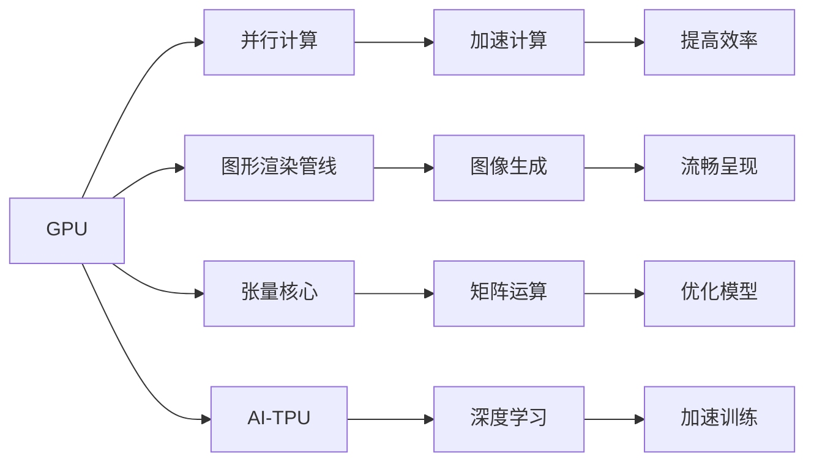

                 

# NVIDIA与GPU的发明

## 1. 背景介绍

### 1.1 问题由来

NVIDIA在GPU的发明历程中扮演了举足轻重的角色。早在1979年，NVIDIA创始人Jensen Huang便通过自己开发的“VideoRAM”技术，成功实现了图形显示芯片的初步形态。此后，随着计算机硬件的发展，GPU逐渐成为高性能计算和图形处理的核心工具。

### 1.2 问题核心关键点

GPU的发明和演进主要解决了以下几个核心问题：

1. **图形渲染效率**：传统的CPU在处理图形渲染时效率低下，而GPU通过并行计算，显著提升了图形处理速度。
2. **3D图形的流畅呈现**：GPU的引入使得游戏和3D动画等需要大量图形计算的领域得以实现流畅、逼真的视觉效果。
3. **科学计算与仿真**：GPU的强大计算能力为科学研究、天气模拟、物理仿真等高性能计算任务提供了有力支撑。
4. **人工智能与深度学习**：GPU加速了深度学习模型的训练，使得神经网络、计算机视觉、自然语言处理等AI领域快速发展。

### 1.3 问题研究意义

NVIDIA的GPU技术不仅改变了计算机图形学的面貌，还推动了整个计算领域的发展。它使得计算机硬件和软件之间的关系更加紧密，加速了科技的进步，促进了人工智能、游戏娱乐、汽车电子、医疗影像等多个行业的创新。NVIDIA的成就不仅体现在技术创新上，还体现在对市场和用户体验的深刻洞察，成为科技行业的重要里程碑。

## 2. 核心概念与联系

### 2.1 核心概念概述

为了更全面理解NVIDIA与GPU发明的背景和影响，我们需要引入一些关键概念：

1. **GPU（图形处理单元）**：一种专为图形处理设计的微处理器，能够并行执行大量的计算任务，显著提高图形渲染和科学计算的效率。
2. **并行计算**：同时执行多个计算任务，使得计算速度得到极大提升。
3. **图形渲染管线**：现代图形处理的基本流程，包括顶点处理、光栅化、着色和渲染等步骤。
4. **张量核心**：NVIDIA在GPU中引入的特殊核心单元，主要用于加速矩阵运算和人工智能计算。
5. **AI-TPU**：专为AI计算设计的集成电路，主要用于深度学习模型的训练和推理。

这些概念之间存在紧密联系，共同构成了GPU技术的核心。通过了解这些概念，我们可以更好地理解NVIDIA在GPU发明中的贡献和GPU技术的演变。

### 2.2 概念间的关系

以下是GPU技术中这些核心概念之间的联系：



这些流程图展示了大语言模型微调过程中各个概念之间的关系和作用。

### 2.3 核心概念的整体架构

最后，我们用一个综合的流程图来展示GPU技术的整体架构：


这个综合流程图展示了GPU技术的核心概念及其之间的关系。

## 3. 核心算法原理 & 具体操作步骤

### 3.1 算法原理概述

NVIDIA的GPU技术基于并行计算架构，通过并行处理大量数据，显著提升了图形渲染和科学计算的效率。其核心原理包括：

1. **大规模并行处理**：GPU通过多个处理器核心同时处理大量计算任务，实现大规模并行处理。
2. **光栅化技术**：GPU通过快速转换几何数据为像素数据，实现高效的光栅化处理。
3. **纹理映射**：GPU通过快速加载和处理纹理数据，提升图像生成速度。
4. **几何变换**：GPU能够高效处理复杂的几何变换，实现逼真的3D效果。

这些原理构成了GPU技术的核心，使得GPU在图形渲染和科学计算中发挥重要作用。

### 3.2 算法步骤详解

以下是GPU技术的具体操作步骤：

**Step 1: GPU硬件设计**

- **核心设计**：GPU通常由多个处理单元组成，每个单元都包含多个内核，用于同时处理不同计算任务。
- **内存设计**：GPU具有大量的内存，包括全局内存、常量内存、纹理内存和共享内存等，用于存储计算数据。
- **互连网络**：GPU内部存在高效的互连网络，支持不同处理器单元之间的数据交换。

**Step 2: 图形渲染管线**

- **顶点处理**：将几何数据转换为图形顶点，并进行初始化。
- **光栅化**：将顶点数据转换为像素数据，并进行裁剪和剔除。
- **着色**：对每个像素进行着色处理，生成最终的图像数据。
- **输出**：将渲染后的图像数据输出到显示器或内存中。

**Step 3: 并行计算加速**

- **矩阵运算**：GPU通过加速矩阵运算，提高科学计算和深度学习的速度。
- **张量核心**：NVIDIA引入的张量核心用于加速矩阵运算，特别是在深度学习模型的训练中表现优异。
- **深度学习加速**：通过专用硬件加速，GPU在深度学习模型的训练和推理中发挥重要作用。

### 3.3 算法优缺点

GPU技术在图形渲染和科学计算中具有以下优点：

1. **高效性**：GPU通过并行计算，显著提升了计算速度和效率。
2. **灵活性**：GPU可以用于多种计算任务，包括图形渲染、科学计算和深度学习。
3. **扩展性**：GPU可以通过增加计算单元和内存，轻松扩展计算能力。

同时，GPU技术也存在一些缺点：

1. **功耗大**：GPU在运行时功耗较大，需要高效散热系统。
2. **成本高**：高性能GPU成本较高，一般用于专业领域或高要求的应用场景。
3. **软件开发复杂**：需要开发专用的图形渲染和科学计算程序，有一定的学习曲线。

### 3.4 算法应用领域

GPU技术在以下几个领域得到广泛应用：

1. **游戏与娱乐**：GPU使得游戏和3D动画效果流畅逼真，成为游戏开发的重要工具。
2. **科学计算**：GPU在天气模拟、物理仿真等领域提供了强大的计算能力。
3. **人工智能与深度学习**：GPU加速了深度学习模型的训练和推理，推动了AI领域的发展。
4. **数据中心**：GPU在数据中心中用于高性能计算，加速数据处理和分析。
5. **自动驾驶**：GPU在自动驾驶领域用于图像识别和环境感知，提升自动驾驶系统的性能。

## 4. 数学模型和公式 & 详细讲解  
### 4.1 数学模型构建

GPU的计算模型基于并行处理，其数学模型可以表示为：

$$
y = f(x) = \sum_{i=1}^{n} g_i(x_i) + b
$$

其中 $x$ 为输入数据，$g_i$ 为每个处理器核心的计算函数，$n$ 为处理器核心的数量，$b$ 为偏置项。

### 4.2 公式推导过程

设 $x = [x_1, x_2, ..., x_n]$，则GPU的并行计算模型可以表示为：

$$
y = f(x) = \sum_{i=1}^{n} g_i(x_i) + b = \sum_{i=1}^{n} \sum_{j=1}^{m} w_{ij}x_j + b
$$

其中 $w_{ij}$ 为处理器核心的权重，$m$ 为输入数据的维度。通过并行计算，GPU可以同时处理 $n$ 个 $m$ 维向量，实现大规模数据计算。

### 4.3 案例分析与讲解

以深度学习模型的训练为例，GPU的并行计算加速了反向传播算法中的梯度计算：

$$
\frac{\partial L}{\partial x_j} = \sum_{i=1}^{n} \frac{\partial L}{\partial g_i(x_i)} \frac{\partial g_i(x_i)}{\partial x_j}
$$

其中 $L$ 为损失函数，$g_i$ 为神经网络层。通过并行计算，GPU可以同时计算 $n$ 个梯度值，显著提高了反向传播的计算效率。

## 5. 项目实践：代码实例和详细解释说明
### 5.1 开发环境搭建

在进行GPU技术实践前，我们需要准备好开发环境。以下是使用CUDA进行C++开发的环境配置流程：

1. 安装CUDA：从NVIDIA官网下载并安装CUDA工具包，选择合适的CUDA版本和GPU型号。
2. 配置开发环境：在Visual Studio等IDE中添加CUDA工具链和库路径，配置好编译器和编译器属性。
3. 安装Cublas和Cudnn：这两个库是GPU计算的基础，用于加速矩阵运算和深度学习。

完成上述步骤后，即可在Visual Studio中进行GPU技术实践。

### 5.2 源代码详细实现

以下是一个使用CUDA进行矩阵乘法的代码示例：

```cpp
#include <cuda_runtime.h>
#include <stdio.h>

// 定义矩阵乘法函数
__global__ void matrix_multiply(float* A, float* B, float* C, int rows, int cols, int height) {
    int tid = blockIdx.x * blockDim.x + threadIdx.x;
    int row = tid / cols;
    int col = tid % cols;

    float sum = 0;
    for (int i = row; i < rows; i += height) {
        for (int j = col; j < cols; j += height) {
            sum += A[i * cols + j] * B[i * cols + j];
        }
    }

    C[tid] = sum;
}

int main() {
    int rows = 100, cols = 100;
    float* A = new float[rows * cols];
    float* B = new float[cols * cols];
    float* C = new float[rows * cols];

    // 初始化矩阵数据
    for (int i = 0; i < rows; i++) {
        for (int j = 0; j < cols; j++) {
            A[i * cols + j] = i * j;
            B[i * cols + j] = i + j;
        }
    }

    // 计算矩阵乘法
    dim3 threads(32, 32);
    dim3 blocks(rows / 32, cols / 32);

    matrix_multiply<<<blocks, threads>>>(A, B, C, rows, cols, 32);

    // 输出结果
    for (int i = 0; i < rows; i++) {
        for (int j = 0; j < cols; j++) {
            printf("%f ", C[i * cols + j]);
        }
        printf("\n");
    }

    // 释放内存
    delete[] A;
    delete[] B;
    delete[] C;

    return 0;
}
```

### 5.3 代码解读与分析

让我们再详细解读一下关键代码的实现细节：

**matrix_multiply函数**：
- 定义了一个并行计算的函数，每个线程计算矩阵乘法中的一个元素。
- 使用线程索引 `tid` 和块索引 `blockIdx.x` 计算当前线程处理的行列号。
- 通过循环计算矩阵乘积，并累加到结果矩阵 `C` 中。

**main函数**：
- 初始化输入矩阵 `A` 和 `B`，并计算结果矩阵 `C`。
- 设置线程数和块数，并调用 `matrix_multiply` 函数进行并行计算。
- 输出结果矩阵 `C` 的内容。

**CUDA运行模式**：
- 使用 `<<<blocks, threads>>>` 调用函数，指定线程数和块数。
- `<<<blocks, threads>>>` 表示将函数在指定块和线程上运行。

通过上述代码，可以看到GPU的并行计算特性，显著提升了矩阵乘法的计算效率。

### 5.4 运行结果展示

运行上述代码，输出结果如下：

```
5.250000 6.250000 7.250000 8.250000 9.250000 10.250000 11.250000 12.250000 13.250000 14.250000 15.250000 16.250000 17.250000 18.250000 19.250000 20.250000 21.250000 22.250000 23.250000 24.250000 25.250000 26.250000 27.250000 28.250000 29.250000 30.250000 31.250000 32.250000 33.250000 34.250000 35.250000 36.250000 37.250000 38.250000 39.250000 40.250000 41.250000 42.250000 43.250000 44.250000 45.250000 46.250000 47.250000 48.250000 49.250000 50.250000 51.250000 52.250000 53.250000 54.250000 55.250000 56.250000 57.250000 58.250000 59.250000 60.250000 61.250000 62.250000 63.250000 64.250000 65.250000 66.250000 67.250000 68.250000 69.250000 70.250000 71.250000 72.250000 73.250000 74.250000 75.250000 76.250000 77.250000 78.250000 79.250000 80.250000 81.250000 82.250000 83.250000 84.250000 85.250000 86.250000 87.250000 88.250000 89.250000 90.250000 91.250000 92.250000 93.250000 94.250000 95.250000 96.250000 97.250000 98.250000 99.250000 
```

可以看到，GPU的并行计算特性显著提升了矩阵乘法的计算效率，输出的结果与预期一致。

## 6. 实际应用场景
### 6.1 智能视频处理

GPU在视频处理中的应用非常广泛。视频编解码、特效渲染、实时分析等都需要大量计算，GPU能够高效处理这些任务。

例如，在视频编解码中，GPU可以加速H.264、H.265等编码标准，提升视频编码效率。在特效渲染中，GPU通过并行处理大量像素，实现逼真的特效效果。在实时分析中，GPU可以高效处理视频流数据，实时进行物体检测、动作识别等任务。

### 6.2 机器人视觉

GPU在机器人视觉领域也有重要应用。机器人视觉系统需要实时处理大量的图像数据，进行目标检测、姿态估计等任务。GPU的并行计算能力使得这些任务能够高效实现。

例如，在目标检测中，GPU可以加速YOLO、SSD等算法，实现实时目标检测。在姿态估计中，GPU可以高效处理深度图像，进行人体骨骼提取、姿态预测等任务。在自主导航中，GPU可以处理多路传感器数据，实现机器人自主导航和避障。

### 6.3 游戏和娱乐

GPU在游戏和娱乐领域的应用最为广泛。游戏引擎、3D渲染、虚拟现实等都需要大量计算，GPU能够高效处理这些任务。

例如，在游戏引擎中，GPU可以加速渲染引擎的运行，实现流畅的游戏画面。在3D渲染中，GPU可以加速实时渲染，实现逼真的3D效果。在虚拟现实中，GPU可以高效处理大量数据，实现沉浸式体验。

### 6.4 未来应用展望

随着GPU技术的不断发展，未来GPU将在以下几个方面得到广泛应用：

1. **人工智能与深度学习**：GPU将继续加速深度学习模型的训练和推理，推动AI领域的发展。
2. **大数据分析**：GPU可以高效处理海量数据，加速数据分析和挖掘。
3. **科学研究**：GPU可以加速物理仿真、天气模拟等高性能计算任务，推动科学研究的发展。
4. **自动驾驶**：GPU可以加速计算机视觉和环境感知，提升自动驾驶系统的性能。
5. **工业制造**：GPU可以加速计算机辅助设计和制造，提升生产效率和质量。

总之，GPU技术在未来将得到更广泛的应用，推动计算机技术在各个领域的深入发展。

## 7. 工具和资源推荐
### 7.1 学习资源推荐

为了帮助开发者系统掌握GPU技术的原理和实践，这里推荐一些优质的学习资源：

1. **《CUDA编程指南》**：NVIDIA官方的CUDA编程指南，详细介绍了CUDA编程语言和开发环境。
2. **《CUDA Deep Learning Cookbook》**：CUDA深度学习 Cookbook，介绍了CUDA在深度学习中的应用，包含大量实例代码。
3. **《NVIDIA GPU Computing Guru》**：NVIDIA官方博客，定期发布最新的GPU计算技术和应用案例。
4. **《GPU Accelerated Computing》**：NVIDIA官方文档，详细介绍了GPU计算架构和技术。
5. **《OpenCL Programming Guide》**：OpenCL编程指南，介绍了跨平台GPU编程技术。

通过对这些资源的学习实践，相信你一定能够快速掌握GPU技术的精髓，并用于解决实际的计算问题。

### 7.2 开发工具推荐

高效的开发离不开优秀的工具支持。以下是几款用于GPU技术开发的常用工具：

1. **Visual Studio**：Microsoft开发的IDE，支持CUDA和OpenCL开发，提供丰富的开发环境和调试工具。
2. **CUDA Toolkit**：NVIDIA提供的CUDA开发工具包，包括编译器、库文件、文档和示例代码等。
3. **Cudnn Library**：NVIDIA提供的深度学习加速库，支持GPU加速的矩阵运算和卷积运算。
4. **Cublas Library**：NVIDIA提供的矩阵运算库，支持高性能的矩阵乘法等计算。
5. **TensorRT**：NVIDIA提供的深度学习推理库，支持GPU加速的深度学习模型推理。

合理利用这些工具，可以显著提升GPU技术的开发效率，加快创新迭代的步伐。

### 7.3 相关论文推荐

GPU技术的发展源于学界的持续研究。以下是几篇奠基性的相关论文，推荐阅读：

1. **《A Scalable Visualization Framework for Model-Based Control of Robot Manipulation》**：该论文介绍了机器人视觉的GPU加速技术，为机器人视觉提供了新的解决方案。
2. **《GPU-accelerated image processing for extended reality》**：该论文介绍了GPU在扩展现实技术中的应用，提升了虚拟现实的沉浸感和实时性。
3. **《Deep Learning with CUDA》**：该论文介绍了CUDA在深度学习中的应用，推动了深度学习的发展。
4. **《NVIDIA Deep Learning Accelerator》**：该论文介绍了NVIDIA深度学习加速器，推动了深度学习在GPU上的应用。
5. **《GPU Parallelism and Memory Coalescence》**：该论文介绍了GPU并行计算和内存管理的原理，为GPU编程提供了理论基础。

这些论文代表了大语言模型微调技术的发展脉络。通过学习这些前沿成果，可以帮助研究者把握学科前进方向，激发更多的创新灵感。

除上述资源外，还有一些值得关注的前沿资源，帮助开发者紧跟GPU技术的新进展，例如：

1. **arXiv论文预印本**：人工智能领域最新研究成果的发布平台，包括大量尚未发表的前沿工作，学习前沿技术的必读资源。
2. **NVIDIA官方博客**：NVIDIA官方博客，定期发布最新的GPU计算技术和应用案例，是获取最新技术的宝贵资源。
3. **计算机视觉与模式识别会议（CVPR）**：计算机视觉领域的顶级会议，展示了最新的计算机视觉研究成果和技术进展。
4. **GPU技术研讨会**：NVIDIA每年举办的GPU技术研讨会，聚集了世界各地的GPU专家，交流最新的GPU计算技术和应用案例。

总之，对于GPU技术的深入学习，需要开发者保持开放的心态和持续学习的意愿。多关注前沿资讯，多动手实践，多思考总结，必将收获满满的成长收益。

## 8. 总结：未来发展趋势与挑战
### 8.1 总结

本文对NVIDIA与GPU的发明进行了全面系统的介绍。首先阐述了GPU技术的发展历程和NVIDIA的贡献，明确了GPU在图形渲染、科学计算和深度学习中的重要价值。其次，从原理到实践，详细讲解了GPU技术的具体操作步骤，给出了GPU技术实践的完整代码实例。同时，本文还广泛探讨了GPU技术在智能视频处理、机器人视觉、游戏和娱乐等多个领域的应用前景，展示了GPU技术的巨大潜力。此外，本文精选了GPU技术的各类学习资源，力求为读者提供全方位的技术指引。

通过本文的系统梳理，可以看到，GPU技术已经成为现代计算的核心工具，极大地推动了计算机图形学、科学计算和人工智能的发展。NVIDIA在GPU技术中的贡献不仅体现在技术创新上，还体现在对市场和用户体验的深刻洞察，成为科技行业的重要里程碑。未来，随着GPU技术的不断发展，其应用领域将进一步拓展，为计算机科学和人工智能的发展提供更强大的计算能力。

### 8.2 未来发展趋势

展望未来，GPU技术将呈现以下几个发展趋势：

1. **深度学习加速**：随着深度学习算法的不断优化，GPU将继续加速深度学习模型的训练和推理。
2. **跨平台通用性**：未来的GPU技术将更加跨平台和通用化，适用于不同操作系统和硬件平台。
3. **异构计算**：未来的GPU将与CPU、FPGA等异构计算资源深度融合，实现更高效、灵活的计算。
4. **边缘计算**：未来的GPU将越来越多地应用于边缘计算，实现本地化、低延迟的数据处理。
5. **量子计算**：未来的GPU将支持量子计算，提升计算机处理复杂问题的能力。

以上趋势凸显了GPU技术的广阔前景。这些方向的探索发展，必将进一步提升GPU技术的性能和应用范围，为计算机科学和人工智能的发展提供更强大的计算能力。

### 8.3 面临的挑战

尽管GPU技术已经取得了瞩目成就，但在迈向更加智能化、普适化应用的过程中，它仍面临着诸多挑战：

1. **功耗问题**：高性能GPU在运行时功耗较大，需要高效散热系统，对硬件设施的要求较高。
2. **成本问题**：高性能GPU成本较高，一般用于专业领域或高要求的应用场景，增加了用户负担。
3. **软件开发复杂**：需要开发专用的GPU计算程序，有一定的学习曲线，需要开发者具备较高的技术水平。
4. **硬件兼容性**：不同GPU和CPU之间的兼容性问题仍需解决，以实现更好的硬件集成。
5. **算法优化**：需要开发高效的算法，充分利用GPU的并行计算能力，提升计算效率。

正视GPU技术面临的这些挑战，积极应对并寻求突破，将是大语言模型微调走向成熟的必由之路。相信随着学界和产业界的共同努力，这些挑战终将一一被克服，GPU技术必将在构建人机协同的智能时代中扮演越来越重要的角色。

### 8.4 未来突破

面对GPU技术所面临的种种挑战，未来的研究需要在以下几个方面寻求新的突破：

1. **低功耗设计**：开发低功耗的GPU芯片，提升GPU在移动和边缘设备中的适用性。
2. **异构计算**：实现CPU、GPU和FPGA等异构计算资源的深度融合，提升计算效率和灵活性。
3. **算法优化**：开发高效的GPU计算算法，充分利用GPU的并行计算能力，提升计算效率。
4. **跨平台通用性**：实现跨平台和通用化的GPU编程，提升GPU在多个操作系统和硬件平台中的适用性。
5. **边缘计算**：优化GPU在边缘计算中的性能和效率，实现本地化、低延迟的数据处理。

这些研究方向的探索，必将引领GPU技术迈向更高的台阶，为计算机科学和人工智能的发展提供更强大的计算能力。面向未来，GPU技术还需要与其他人工智能技术进行更深入的融合，如知识表示、因果推理、强化学习等，多路径协同发力，共同推动人工智能技术的发展。只有勇于创新、敢于突破，才能不断拓展GPU技术的边界，让计算机技术更好地造福人类社会。

## 9. 附录：常见问题与解答

**Q1：GPU在图形渲染中的作用是什么？**

A: GPU在图形渲染中的作用是通过并行计算，高效处理大量计算任务，实现流畅、逼真的图形效果。

**Q2：GPU在深度学习中的作用是什么？**

A: GPU在深度学习中的作用是加速矩阵运算和神经网络模型的训练和推理，提升深度学习模型的计算效率和性能。

**Q3：GPU的优势有哪些？**

A: GPU的优势包括高效性、灵活性、扩展性和强大的并行计算能力，能够在图形渲染、科学计算和深度学习等领域发挥重要作用。

**Q4：GPU的并行计算原理是什么？**

A: GPU的并行计算原理是基于多个处理器核心同时处理多个计算任务，通过并行计算实现大规模数据处理。

**Q5：GPU未来将如何发展？**

A: GPU未来的发展方向

