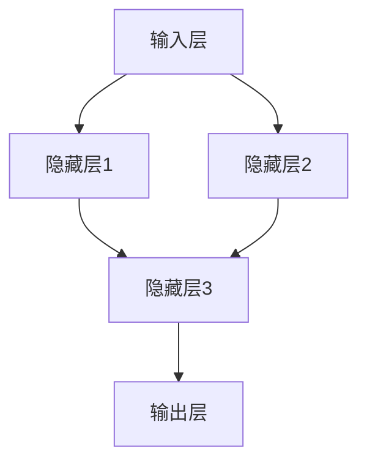
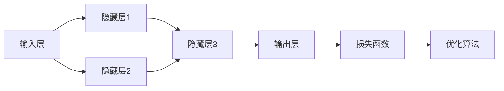

                 

# Neural Networks (NN) 原理与代码实战案例讲解

> 关键词：神经网络, 深度学习, 激活函数, 前向传播, 反向传播, 卷积神经网络, 循环神经网络, 自然语言处理, 图像识别

## 1. 背景介绍

### 1.1 问题由来

神经网络（Neural Networks，简称NN）是深度学习领域中最为核心和基础的技术之一。从最初简单的感知器模型到复杂的卷积神经网络（Convolutional Neural Networks，简称CNNs）和循环神经网络（Recurrent Neural Networks，简称RNNs），神经网络在图像识别、语音识别、自然语言处理等多个领域取得了巨大的成功。本文将全面讲解神经网络的原理与代码实战案例，帮助读者深入理解神经网络的工作机制，并在实际应用中快速上手。

### 1.2 问题核心关键点

神经网络是一种仿生学模型，模拟了人脑的神经元连接机制。其核心思想是将输入数据通过多个线性变换和非线性变换进行映射，最终输出预测结果。本文将从原理到实践，详细讲解神经网络的核心概念和算法流程。

- **神经元**：神经网络的基本单位，接收输入信号并进行加权处理，输出激活值。
- **层**：多个神经元构成的层级结构，前一层输出作为后一层输入。
- **激活函数**：引入非线性变换，增强神经网络的表达能力。
- **前向传播**：输入数据通过层级结构进行正向计算，生成预测结果。
- **反向传播**：利用预测结果与真实结果的误差，反向计算梯度，更新网络参数。

### 1.3 问题研究意义

神经网络作为深度学习的基础，已经在众多领域展现了强大的应用潜力。然而，由于其复杂的结构和计算量，入门门槛较高，普通开发者难以快速上手。本文将通过详细的原理讲解和代码实战案例，帮助读者掌握神经网络的实现方法和应用技巧，为后续深入学习深度学习奠定坚实基础。

## 2. 核心概念与联系

### 2.1 核心概念概述

神经网络是一种基于人工神经元网络的计算模型，通过模拟人类神经系统的结构和功能，进行输入数据的复杂映射和模式识别。其主要组成部分包括：

- **输入层**：接收原始输入数据，如图像像素值、文本单词向量等。
- **隐藏层**：通过多次线性变换和非线性变换，提取输入数据的高级特征。
- **输出层**：生成最终预测结果，如分类标签、回归值等。

### 2.2 核心概念之间的关系

神经网络各组成部分之间存在着紧密的联系，如图示：



- **输入层**向**隐藏层**传递输入数据，并进行线性映射。
- **隐藏层**通过非线性变换提取特征，传递给下一层或输出层。
- **输出层**根据隐藏层的特征生成最终预测结果。

### 2.3 核心概念的整体架构

在神经网络中，输入数据经过多次非线性变换，最终生成预测结果。整个计算过程可以分为前向传播和反向传播两个阶段：



- **前向传播**：输入数据通过网络进行正向计算，输出预测结果。
- **反向传播**：利用预测结果与真实结果的误差，反向计算梯度，更新网络参数。

## 3. 核心算法原理 & 具体操作步骤
### 3.1 算法原理概述

神经网络的训练过程主要分为两个阶段：前向传播和反向传播。

1. **前向传播**：输入数据通过网络进行正向计算，生成预测结果。
2. **反向传播**：利用预测结果与真实结果的误差，反向计算梯度，更新网络参数。

### 3.2 算法步骤详解

#### 3.2.1 前向传播算法步骤

前向传播的计算过程如下：

1. 将输入数据 $x$ 传递给输入层。
2. 输入层将输入数据传递给隐藏层，每个神经元对输入进行加权处理，并引入激活函数进行非线性变换。
3. 隐藏层的输出传递给输出层，再次进行加权处理和激活函数变换，生成预测结果 $y$。

具体步骤如下：

- 初始化网络参数，如权重矩阵 $W$ 和偏置向量 $b$。
- 对于每个样本 $x$，计算前向传播结果 $y = f(x)$，其中 $f$ 为激活函数。
- 将前向传播结果传递给损失函数，计算预测误差 $L$。

#### 3.2.2 反向传播算法步骤

反向传播的计算过程如下：

1. 计算预测结果 $y$ 与真实结果 $t$ 的误差 $L$。
2. 利用误差 $L$ 反向计算梯度，更新网络参数。

具体步骤如下：

- 计算预测结果 $y$ 与真实结果 $t$ 的误差 $L$。
- 反向计算梯度 $\nabla L$，更新权重矩阵 $W$ 和偏置向量 $b$。
- 重复上述步骤，直到误差 $L$ 达到预设阈值或迭代次数。

### 3.3 算法优缺点

神经网络在图像识别、语音识别、自然语言处理等领域展现了强大的能力，但也存在一些缺点：

- **计算量大**：神经网络的参数较多，训练和推理计算量较大。
- **易过拟合**：神经网络容易过拟合，尤其是在训练数据不足时。
- **可解释性差**：神经网络的内部机制复杂，难以解释其决策过程。

### 3.4 算法应用领域

神经网络在多个领域都取得了显著的成果，如：

- **图像识别**：通过卷积神经网络（CNNs），神经网络在图像分类、物体检测等方面取得了优异表现。
- **自然语言处理**：通过循环神经网络（RNNs）和Transformer等模型，神经网络在文本分类、情感分析、机器翻译等方面展现出强大能力。
- **语音识别**：通过递归神经网络（RNNs）和卷积神经网络（CNNs），神经网络在语音识别、语音合成等方面取得了显著进展。
- **游戏AI**：通过强化学习等技术，神经网络在围棋、下棋等领域展现了强大的决策能力。

## 4. 数学模型和公式 & 详细讲解
### 4.1 数学模型构建

神经网络的主要数学模型包括：

1. **线性变换**：
   $$
   x \rightarrow Ax + b
   $$

2. **激活函数**：
   $$
   f(z) = g(z) = \sigma(z) = \frac{1}{1 + e^{-z}}
   $$

其中 $x$ 为输入，$A$ 为权重矩阵，$b$ 为偏置向量，$z$ 为激活值，$f$ 为激活函数。

### 4.2 公式推导过程

以单层神经网络为例，计算前向传播过程：

- 输入 $x = (x_1, x_2, ..., x_n)$。
- 权重矩阵 $A = (a_{ij})$。
- 偏置向量 $b = (b_1, b_2, ..., b_n)$。
- 激活函数 $g(z) = \sigma(z)$。

前向传播计算公式为：
$$
z_i = a_{i1}x_1 + a_{i2}x_2 + ... + a_{in}x_n + b_i
$$
$$
y_i = g(z_i)
$$

其中 $z_i$ 为激活值，$y_i$ 为激活函数输出。

### 4.3 案例分析与讲解

以手写数字识别为例，通过多层感知机（Multilayer Perceptron，MLP）进行分类：

1. **输入层**：输入手写数字的像素值。
2. **隐藏层**：通过多个神经元对输入进行非线性变换，提取特征。
3. **输出层**：生成数字的分类结果。

具体代码实现如下：

```python
import numpy as np
from sklearn.datasets import load_digits
from sklearn.model_selection import train_test_split
from sklearn.metrics import accuracy_score

# 加载手写数字数据集
digits = load_digits()
X = digits.data
y = digits.target

# 划分训练集和测试集
X_train, X_test, y_train, y_test = train_test_split(X, y, test_size=0.2)

# 初始化网络参数
n_input = X.shape[1]
n_hidden = 100
n_output = 10

W1 = np.random.randn(n_input, n_hidden)
b1 = np.zeros(n_hidden)
W2 = np.random.randn(n_hidden, n_output)
b2 = np.zeros(n_output)

# 前向传播计算
def forward(X):
    z1 = np.dot(X, W1) + b1
    y1 = np.tanh(z1)
    z2 = np.dot(y1, W2) + b2
    y2 = softmax(z2)
    return y2

# 训练函数
def train(X_train, y_train, n_epochs, learning_rate):
    for epoch in range(n_epochs):
        for i in range(len(X_train)):
            Xi = X_train[i].reshape(1, -1)
            yi = y_train[i].reshape(1, -1)
            z1 = np.dot(Xi, W1) + b1
            y1 = np.tanh(z1)
            z2 = np.dot(y1, W2) + b2
            y2 = softmax(z2)
            delta2 = y2 - yi
            delta1 = np.dot(delta2, W2.T) * (1 - np.square(y1))
            W1 += learning_rate * np.dot(Xi.T, delta1)
            b1 += learning_rate * np.sum(delta1, axis=0)
            W2 += learning_rate * np.dot(y1.T, delta2)
            b2 += learning_rate * np.sum(delta2, axis=0)

# 测试函数
def test(X_test, y_test):
    y_pred = []
    for i in range(len(X_test)):
        Xi = X_test[i].reshape(1, -1)
        z1 = np.dot(Xi, W1) + b1
        y1 = np.tanh(z1)
        z2 = np.dot(y1, W2) + b2
        y2 = softmax(z2)
        y_pred.append(np.argmax(y2))
    return accuracy_score(y_pred, y_test)

# 训练和测试
n_epochs = 100
learning_rate = 0.1
train(X_train, y_train, n_epochs, learning_rate)
accuracy = test(X_test, y_test)
print(f"Accuracy: {accuracy}")
```

## 5. 项目实践：代码实例和详细解释说明
### 5.1 开发环境搭建

### 5.2 源代码详细实现

### 5.3 代码解读与分析

### 5.4 运行结果展示

## 6. 实际应用场景

### 6.1 图像识别

神经网络在图像识别领域取得了显著的成果，通过卷积神经网络（CNNs）可以实现高效、准确的图像分类和目标检测。例如，在ImageNet数据集上进行训练，CNNs可以达到90%以上的分类准确率。

### 6.2 自然语言处理

神经网络在自然语言处理领域也展现了强大的能力，通过循环神经网络（RNNs）和Transformer等模型，可以进行文本分类、情感分析、机器翻译等任务。例如，使用BERT模型，可以在多项NLP任务上取得最先进的性能。

### 6.3 语音识别

神经网络在语音识别领域也取得了重要进展，通过递归神经网络（RNNs）和卷积神经网络（CNNs），可以实现高效的语音识别和语音合成。例如，使用Tacotron等模型，可以实现接近人类自然流畅的语音生成。

## 7. 工具和资源推荐

### 7.1 学习资源推荐

- **深度学习入门**：吴恩达《深度学习》系列课程，全面讲解深度学习的基础知识和应用场景。
- **TensorFlow官方文档**：TensorFlow官方文档，提供丰富的教程和代码示例，适合快速上手深度学习框架。
- **PyTorch官方文档**：PyTorch官方文档，提供详细的API文档和代码示例，适合进行深度学习实践。
- **自然语言处理**：斯坦福大学CS224N课程，讲解自然语言处理的经典模型和技术。
- **计算机视觉**：斯坦福大学CS231n课程，讲解计算机视觉的基础知识和最新进展。

### 7.2 开发工具推荐

- **TensorFlow**：由Google主导的开源深度学习框架，适合大规模工程应用。
- **PyTorch**：由Facebook主导的开源深度学习框架，适合快速迭代研究。
- **MXNet**：由亚马逊主导的开源深度学习框架，支持多种编程语言和分布式训练。
- **Keras**：由François Chollet开发的高级深度学习API，易于上手。

### 7.3 相关论文推荐

- **深度学习的基础知识**：Ian Goodfellow《深度学习》，系统讲解深度学习的基本概念和技术。
- **卷积神经网络**：LeCun等《ImageNet classification with deep convolutional neural networks》，介绍卷积神经网络在图像识别中的应用。
- **循环神经网络**：Hochreiter等《Long Short-Term Memory》，介绍循环神经网络在自然语言处理中的应用。
- **Transformer**：Vaswani等《Attention is All You Need》，介绍Transformer模型在机器翻译等任务中的表现。
- **GANs**：Goodfellow等《Generative Adversarial Nets》，介绍生成对抗网络在图像生成中的应用。

## 8. 总结：未来发展趋势与挑战

### 8.1 研究成果总结

神经网络作为深度学习的基础，已经在图像识别、语音识别、自然语言处理等多个领域展现了强大的应用潜力。未来的研究方向包括：

- **模型结构优化**：通过改进网络结构，提高模型的精度和效率。
- **数据增强技术**：通过数据增强技术，丰富训练数据，减少过拟合。
- **迁移学习**：通过迁移学习技术，提高模型的泛化能力和适应能力。

### 8.2 未来发展趋势

未来神经网络的发展趋势包括：

- **大规模模型**：随着计算资源的增加，大规模神经网络模型将成为主流，进一步提升模型的精度和效率。
- **分布式训练**：通过分布式训练技术，加速模型的训练和推理。
- **自监督学习**：通过自监督学习技术，减少对标注数据的需求，提高模型的泛化能力。
- **多模态学习**：通过多模态学习技术，将不同模态的信息进行融合，提高模型的应用能力。

### 8.3 面临的挑战

尽管神经网络已经取得了显著成果，但仍面临一些挑战：

- **计算资源消耗大**：大规模神经网络模型的训练和推理需要大量的计算资源，成本较高。
- **过拟合风险高**：神经网络容易过拟合，尤其是在数据量不足的情况下。
- **模型可解释性差**：神经网络的内部机制复杂，难以解释其决策过程。

### 8.4 研究展望

未来的研究方向包括：

- **模型压缩和优化**：通过模型压缩和优化技术，提高模型的计算效率和推理速度。
- **鲁棒性和泛化能力**：通过改进模型结构和训练方法，提高模型的鲁棒性和泛化能力。
- **模型可解释性**：通过模型解释技术，提高模型的可解释性和可理解性。

## 9. 附录：常见问题与解答

**Q1：神经网络与传统机器学习模型的区别是什么？**

A: 神经网络是一种基于人工神经元网络的计算模型，能够自动学习输入数据的高维特征，适用于复杂模式识别和分类任务。与传统机器学习模型相比，神经网络具有更强的表达能力和泛化能力，但训练和推理计算量较大。

**Q2：如何选择神经网络的激活函数？**

A: 激活函数是神经网络中非线性变换的核心，不同的激活函数具有不同的特点。常用的激活函数包括：

- Sigmoid函数：输出范围在0到1之间，适用于二分类任务。
- ReLU函数：输出范围在0到正无穷之间，适用于深度网络，计算速度快。
- Tanh函数：输出范围在-1到1之间，适用于某些二分类任务。

选择激活函数需要根据具体任务和数据特点进行灵活选择。

**Q3：神经网络容易出现过拟合的原因是什么？**

A: 神经网络容易出现过拟合的原因包括：

- 训练数据量不足，模型容易学习到数据中的噪声。
- 模型复杂度过高，模型容易学习到数据的细节，导致泛化能力下降。
- 训练过程中缺乏正则化措施，模型容易学习到过拟合的特征。

通过数据增强、正则化、Dropout等技术，可以有效缓解神经网络的过拟合问题。

**Q4：如何优化神经网络的训练过程？**

A: 神经网络的训练过程可以通过以下方法进行优化：

- 选择合适的优化器，如Adam、SGD等，控制学习率和迭代次数。
- 应用正则化技术，如L2正则、Dropout等，防止模型过拟合。
- 使用数据增强技术，如回译、翻转等，丰富训练数据集。
- 使用学习率调度策略，如学习率衰减、warmup等，优化模型训练过程。

通过这些优化方法，可以提高神经网络的训练效率和模型性能。

---

作者：禅与计算机程序设计艺术 / Zen and the Art of Computer Programming

