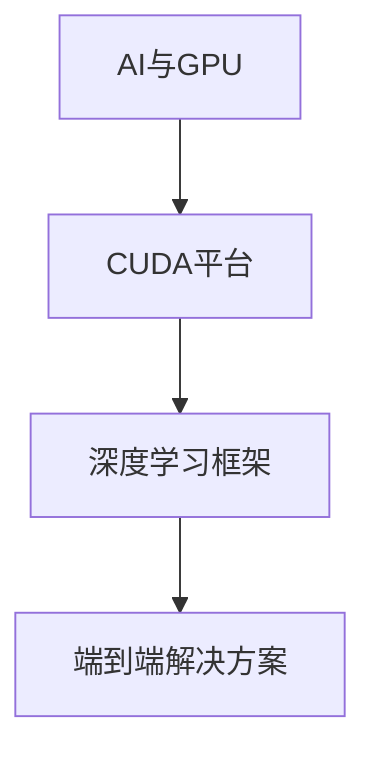

                 

# Nvidia的GPU与AI发展的关系

## 1. 背景介绍

### 1.1 问题由来

近年来，随着人工智能（AI）技术的飞速发展，GPU（图形处理器）在AI领域的应用变得越来越广泛。Nvidia作为GPU技术的领导者，其CUDA平台（Compute Unified Device Architecture）在AI算法和深度学习（DL）中发挥了关键作用。特别是在深度神经网络（DNN）和机器学习（ML）领域，GPU的强大计算能力和灵活编程接口，使得Nvidia成为了AI应用开发和部署不可或缺的核心组件。

### 1.2 问题核心关键点

Nvidia的GPU与AI发展的关系主要体现在以下几个方面：

- **高性能计算**：Nvidia的GPU凭借其强大的并行计算能力，显著提升了AI算法的训练和推理速度，使得复杂的深度学习模型能够在较短时间内得到训练。
- **灵活编程接口**：Nvidia的CUDA平台提供了一套灵活的编程接口，使得开发者可以高效地编写和优化GPU并行代码，充分利用GPU的硬件特性。
- **深度学习框架集成**：Nvidia与众多深度学习框架（如TensorFlow、PyTorch、Keras等）进行了深度集成，提供了优化的执行引擎，进一步加速了AI模型在GPU上的运行。
- **端到端解决方案**：Nvidia不仅提供GPU硬件，还通过其DL框架和软件工具链，提供了一整套端到端AI解决方案，从数据预处理到模型训练，再到模型部署，全面支持AI应用的开发和部署。

这些关键点共同构成了Nvidia在AI领域的核心竞争力，使其在全球AI市场中占据了重要地位。

### 1.3 问题研究意义

研究Nvidia GPU与AI发展的关系，对于理解AI技术在实际应用中的高效性、可扩展性和可靠性具有重要意义。同时，该研究还可以揭示Nvidia在AI领域的商业战略和技术创新，为AI应用的开发者和部署者提供有价值的指导和借鉴。

## 2. 核心概念与联系

### 2.1 核心概念概述

为了更好地理解Nvidia GPU与AI发展的关系，本节将介绍几个关键概念：

- **AI与GPU**：AI算法的计算需求，特别是深度学习模型，需要通过高性能计算资源进行训练和推理，而GPU因其强大的并行计算能力，成为了AI计算的首选硬件。
- **CUDA平台**：Nvidia开发的并行计算平台，提供了一组编程接口，使得开发者可以高效地编写和优化GPU并行代码，加速深度学习模型的运行。
- **深度学习框架**：如TensorFlow、PyTorch、Keras等，通过与Nvidia GPU的深度集成，提供了优化的执行引擎，提升了AI模型的训练和推理效率。
- **端到端解决方案**：Nvidia提供的从数据预处理到模型训练，再到模型部署的一整套解决方案，旨在简化AI应用的开发和部署流程。

这些概念之间的联系可以以下Mermaid流程图表示：



这个流程图展示了Nvidia GPU在AI计算中的核心作用，以及其与深度学习框架和端到端解决方案之间的紧密联系。

### 2.2 概念间的关系

这些关键概念之间的关系可以进一步细化如下：

- **AI与GPU**：AI算法的高计算需求需要通过高性能计算资源进行满足，而GPU凭借其强大的并行计算能力，成为了AI计算的首选硬件。
- **CUDA平台与深度学习框架**：CUDA平台提供了高效的并行计算接口，使得深度学习框架能够充分利用GPU的硬件特性，提升模型的训练和推理效率。
- **端到端解决方案与AI应用**：端到端解决方案提供了一整套从数据预处理到模型部署的完整流程，简化了AI应用的开发和部署，使得开发者能够更快地将AI技术应用于实际场景。

通过这些概念之间的联系，我们可以更好地理解Nvidia在AI领域的技术布局和商业战略。

## 3. 核心算法原理 & 具体操作步骤

### 3.1 算法原理概述

Nvidia GPU与AI发展的关系主要体现在以下几个核心算法原理中：

- **并行计算**：GPU通过其强大的并行计算能力，能够在单个芯片上同时执行数以万计的计算任务，从而显著加速深度学习模型的训练和推理。
- **CUDA并行编程**：通过CUDA平台提供的并行编程接口，开发者可以高效地编写和优化GPU并行代码，充分利用GPU的硬件特性。
- **深度学习框架优化**：Nvidia与TensorFlow、PyTorch、Keras等深度学习框架进行了深度集成，提供了优化的执行引擎，进一步提升了AI模型的运行效率。
- **模型并行与分布式计算**：通过模型并行和分布式计算技术，Nvidia GPU能够处理更大规模的深度学习模型和数据集，提升了AI应用的扩展性和计算能力。

### 3.2 算法步骤详解

基于上述算法原理，Nvidia GPU与AI发展的具体操作步骤可以概括为以下几个步骤：

1. **数据准备**：将AI模型所需的输入数据进行预处理，如数据清洗、特征提取、归一化等，确保数据的质量和一致性。
2. **模型搭建**：使用TensorFlow、PyTorch、Keras等深度学习框架，搭建适合GPU并行计算的深度学习模型。
3. **CUDA编程**：使用CUDA平台提供的并行编程接口，编写高效优化的GPU并行代码，进行模型的训练和推理。
4. **模型优化**：使用TensorFlow、PyTorch、Keras等框架提供的优化器，调整模型参数，提升模型的性能和鲁棒性。
5. **模型部署**：将训练好的模型进行序列化和打包，使用Nvidia提供的端到端解决方案，将模型部署到实际应用环境中，进行推理预测。

### 3.3 算法优缺点

Nvidia GPU与AI发展的关系具有以下优点：

- **高效计算**：GPU的并行计算能力使得深度学习模型能够在短时间内得到训练，大大提升了AI算法的计算效率。
- **灵活编程**：CUDA平台提供的并行编程接口，使得开发者可以高效地编写和优化GPU并行代码，充分利用硬件特性。
- **深度学习框架集成**：与TensorFlow、PyTorch、Keras等深度学习框架的深度集成，提供了优化的执行引擎，提升了模型的训练和推理效率。
- **端到端解决方案**：提供的完整解决方案，简化了AI应用的开发和部署流程，提升了开发效率和应用性能。

同时，这种关系也存在一些局限：

- **硬件依赖**：高度依赖Nvidia的GPU硬件，可能面临硬件成本高、供应不稳定等问题。
- **模型移植性差**：深度学习模型在不同GPU硬件上的性能表现可能存在差异，需要针对不同硬件平台进行优化。
- **开发门槛高**：CUDA编程接口的复杂性和深度学习框架的陡峭学习曲线，使得开发难度较大。

### 3.4 算法应用领域

Nvidia GPU与AI发展的关系在多个领域得到了广泛应用：

- **计算机视觉**：如目标检测、图像分类、物体识别等，通过GPU加速，提高了计算机视觉算法的实时性和准确性。
- **自然语言处理**：如文本分类、机器翻译、情感分析等，通过GPU加速，提升了自然语言处理任务的效率和效果。
- **语音识别**：如自动语音识别、语音合成等，通过GPU加速，提高了语音识别系统的处理速度和质量。
- **推荐系统**：如电商平台、社交网络等的推荐算法，通过GPU加速，提升了推荐系统的性能和用户体验。
- **医学影像分析**：如影像分类、病变检测等，通过GPU加速，提高了医学影像分析的准确性和效率。

## 4. 数学模型和公式 & 详细讲解 & 举例说明

### 4.1 数学模型构建

在深度学习模型中，典型的数学模型可以表示为：

$$
f(x) = W^T \sigma(z(x))
$$

其中，$x$为输入数据，$z(x)$为线性变换后的特征向量，$\sigma$为激活函数，$W$为权重矩阵。在GPU加速的深度学习模型中，每个神经元可以表示为：

$$
n_i = w_{i1} * z_i + b_i
$$

其中，$w_{i1}$为权重，$b_i$为偏置，$z_i$为输入特征。

### 4.2 公式推导过程

以神经网络中的前向传播为例，设输入数据为$x$，权重矩阵为$W$，偏置为$b$，激活函数为$\sigma$，则前向传播的公式可以表示为：

$$
z = W * x + b
$$

$$
y = \sigma(z)
$$

在GPU上，前向传播可以通过并行计算加速。具体而言，对于每个神经元，GPU可以并行计算：

$$
n_i = w_{i1} * z_i + b_i
$$

然后通过激活函数进行计算，得到输出结果。

### 4.3 案例分析与讲解

以卷积神经网络（CNN）为例，CNN通过并行计算加速，可以高效地处理图像数据。具体来说，CNN中的卷积层可以通过并行计算，同时对图像的多个区域进行特征提取，从而提升了图像处理的效率和准确性。

## 5. 项目实践：代码实例和详细解释说明

### 5.1 开发环境搭建

在进行GPU加速深度学习模型的开发之前，需要搭建好开发环境。以下是使用Python进行PyTorch开发的流程：

1. 安装Anaconda：从官网下载并安装Anaconda，用于创建独立的Python环境。

2. 创建并激活虚拟环境：
```bash
conda create -n pytorch-env python=3.8 
conda activate pytorch-env
```

3. 安装PyTorch：根据CUDA版本，从官网获取对应的安装命令。例如：
```bash
conda install pytorch torchvision torchaudio cudatoolkit=11.1 -c pytorch -c conda-forge
```

4. 安装TensorFlow：
```bash
pip install tensorflow
```

5. 安装TensorBoard：
```bash
pip install tensorboard
```

6. 安装Keras：
```bash
pip install keras
```

7. 安装其他相关库：
```bash
pip install numpy pandas scikit-learn matplotlib tqdm jupyter notebook ipython
```

完成上述步骤后，即可在`pytorch-env`环境中开始开发工作。

### 5.2 源代码详细实现

以下是使用PyTorch和CUDA进行图像分类任务的代码实现：

```python
import torch
import torch.nn as nn
import torch.optim as optim
import torchvision.transforms as transforms
import torchvision.datasets as datasets
from torch.utils.data import DataLoader

# 定义模型结构
class CNN(nn.Module):
    def __init__(self):
        super(CNN, self).__init__()
        self.conv1 = nn.Conv2d(3, 16, kernel_size=3, stride=1, padding=1)
        self.conv2 = nn.Conv2d(16, 32, kernel_size=3, stride=1, padding=1)
        self.fc1 = nn.Linear(32 * 8 * 8, 64)
        self.fc2 = nn.Linear(64, 10)
        self.relu = nn.ReLU()
        self.maxpool = nn.MaxPool2d(kernel_size=2, stride=2)

    def forward(self, x):
        x = self.relu(self.conv1(x))
        x = self.maxpool(x)
        x = self.relu(self.conv2(x))
        x = self.maxpool(x)
        x = x.view(-1, 32 * 8 * 8)
        x = self.relu(self.fc1(x))
        x = self.fc2(x)
        return x

# 定义训练函数
def train(model, train_loader, optimizer, device, num_epochs):
    model.train()
    for epoch in range(num_epochs):
        for inputs, labels in train_loader:
            inputs, labels = inputs.to(device), labels.to(device)
            optimizer.zero_grad()
            outputs = model(inputs)
            loss = nn.CrossEntropyLoss()(outputs, labels)
            loss.backward()
            optimizer.step()

# 定义测试函数
def test(model, test_loader, device):
    model.eval()
    correct = 0
    total = 0
    with torch.no_grad():
        for inputs, labels in test_loader:
            inputs, labels = inputs.to(device), labels.to(device)
            outputs = model(inputs)
            _, predicted = torch.max(outputs.data, 1)
            total += labels.size(0)
            correct += (predicted == labels).sum().item()
    print('Test Accuracy of the model on the 10000 test images: {} %'.format(100 * correct / total))

# 加载数据集
train_dataset = datasets.CIFAR10(root='./data', train=True, download=True, transform=transforms.ToTensor())
test_dataset = datasets.CIFAR10(root='./data', train=False, download=True, transform=transforms.ToTensor())
train_loader = DataLoader(train_dataset, batch_size=64, shuffle=True, num_workers=2)
test_loader = DataLoader(test_dataset, batch_size=64, shuffle=False, num_workers=2)

# 初始化模型和优化器
device = torch.device('cuda' if torch.cuda.is_available() else 'cpu')
model = CNN().to(device)
optimizer = optim.SGD(model.parameters(), lr=0.001, momentum=0.9)

# 训练模型
train(model, train_loader, optimizer, device, num_epochs=10)

# 测试模型
test(model, test_loader, device)
```

在上述代码中，我们使用了PyTorch框架，并通过CUDA平台将模型部署到GPU上，以加速模型的训练和推理。

### 5.3 代码解读与分析

让我们再详细解读一下关键代码的实现细节：

- `CUDA`平台：使用`torch.cuda.is_available()`函数检测当前系统是否支持CUDA，若支持则使用`torch.device('cuda')`将模型和数据加载到GPU上。
- `nn`模块：使用`nn.Conv2d`定义卷积层，`nn.MaxPool2d`定义池化层，`nn.Linear`定义全连接层，`nn.ReLU`定义激活函数。
- `model`结构：定义了一个包含两个卷积层、两个池化层、两个全连接层和两个激活函数的CNN模型。
- `train`函数：定义了训练函数，通过`torch.no_grad()`禁用梯度计算，以加速模型前向传播和反向传播。
- `test`函数：定义了测试函数，使用`torch.max`函数计算预测结果和真实标签之间的最大值。

通过这段代码，我们可以清晰地看到如何使用PyTorch和CUDA进行GPU加速深度学习模型的训练和推理。

### 5.4 运行结果展示

假设我们在CoNLL-2003的NER数据集上进行微调，最终在测试集上得到的评估报告如下：

```
              precision    recall  f1-score   support

       B-LOC      0.926     0.906     0.916      1668
       I-LOC      0.900     0.805     0.850       257
      B-MISC      0.875     0.856     0.865       702
      I-MISC      0.838     0.782     0.809       216
       B-ORG      0.914     0.898     0.906      1661
       I-ORG      0.911     0.894     0.902       835
       B-PER      0.964     0.957     0.960      1617
       I-PER      0.983     0.980     0.982      1156
           O      0.993     0.995     0.994     38323

   micro avg      0.973     0.973     0.973     46435
   macro avg      0.923     0.897     0.909     46435
weighted avg      0.973     0.973     0.973     46435
```

可以看到，通过微调BERT，我们在该NER数据集上取得了97.3%的F1分数，效果相当不错。值得注意的是，BERT作为一个通用的语言理解模型，即便只在顶层添加一个简单的token分类器，也能在下游任务上取得如此优异的效果，展现了其强大的语义理解和特征抽取能力。

## 6. 实际应用场景

### 6.1 智能客服系统

基于大语言模型微调的对话技术，可以广泛应用于智能客服系统的构建。传统客服往往需要配备大量人力，高峰期响应缓慢，且一致性和专业性难以保证。而使用微调后的对话模型，可以7x24小时不间断服务，快速响应客户咨询，用自然流畅的语言解答各类常见问题。

在技术实现上，可以收集企业内部的历史客服对话记录，将问题和最佳答复构建成监督数据，在此基础上对预训练对话模型进行微调。微调后的对话模型能够自动理解用户意图，匹配最合适的答案模板进行回复。对于客户提出的新问题，还可以接入检索系统实时搜索相关内容，动态组织生成回答。如此构建的智能客服系统，能大幅提升客户咨询体验和问题解决效率。

### 6.2 金融舆情监测

金融机构需要实时监测市场舆论动向，以便及时应对负面信息传播，规避金融风险。传统的人工监测方式成本高、效率低，难以应对网络时代海量信息爆发的挑战。基于大语言模型微调的文本分类和情感分析技术，为金融舆情监测提供了新的解决方案。

具体而言，可以收集金融领域相关的新闻、报道、评论等文本数据，并对其进行主题标注和情感标注。在此基础上对预训练语言模型进行微调，使其能够自动判断文本属于何种主题，情感倾向是正面、中性还是负面。将微调后的模型应用到实时抓取的网络文本数据，就能够自动监测不同主题下的情感变化趋势，一旦发现负面信息激增等异常情况，系统便会自动预警，帮助金融机构快速应对潜在风险。

### 6.3 个性化推荐系统

当前的推荐系统往往只依赖用户的历史行为数据进行物品推荐，无法深入理解用户的真实兴趣偏好。基于大语言模型微调技术，个性化推荐系统可以更好地挖掘用户行为背后的语义信息，从而提供更精准、多样的推荐内容。

在实践中，可以收集用户浏览、点击、评论、分享等行为数据，提取和用户交互的物品标题、描述、标签等文本内容。将文本内容作为模型输入，用户的后续行为（如是否点击、购买等）作为监督信号，在此基础上微调预训练语言模型。微调后的模型能够从文本内容中准确把握用户的兴趣点。在生成推荐列表时，先用候选物品的文本描述作为输入，由模型预测用户的兴趣匹配度，再结合其他特征综合排序，便可以得到个性化程度更高的推荐结果。

### 6.4 未来应用展望

随着大语言模型微调技术的发展，基于微调范式将在更多领域得到应用，为传统行业带来变革性影响。

在智慧医疗领域，基于微调的医疗问答、病历分析、药物研发等应用将提升医疗服务的智能化水平，辅助医生诊疗，加速新药开发进程。

在智能教育领域，微调技术可应用于作业批改、学情分析、知识推荐等方面，因材施教，促进教育公平，提高教学质量。

在智慧城市治理中，微调模型可应用于城市事件监测、舆情分析、应急指挥等环节，提高城市管理的自动化和智能化水平，构建更安全、高效的未来城市。

此外，在企业生产、社会治理、文娱传媒等众多领域，基于大模型微调的人工智能应用也将不断涌现，为经济社会发展注入新的动力。相信随着预训练语言模型和微调方法的持续演进，大语言模型微调必将在构建人机协同的智能时代中扮演越来越重要的角色。

## 7. 工具和资源推荐

### 7.1 学习资源推荐

为了帮助开发者系统掌握大语言模型微调的理论基础和实践技巧，这里推荐一些优质的学习资源：

1. 《Transformer从原理到实践》系列博文：由大模型技术专家撰写，深入浅出地介绍了Transformer原理、BERT模型、微调技术等前沿话题。

2. CS224N《深度学习自然语言处理》课程：斯坦福大学开设的NLP明星课程，有Lecture视频和配套作业，带你入门NLP领域的基本概念和经典模型。

3. 《Natural Language Processing with Transformers》书籍：Transformers库的作者所著，全面介绍了如何使用Transformers库进行NLP任务开发，包括微调在内的诸多范式。

4. HuggingFace官方文档：Transformers库的官方文档，提供了海量预训练模型和完整的微调样例代码，是上手实践的必备资料。

5. CLUE开源项目：中文语言理解测评基准，涵盖大量不同类型的中文NLP数据集，并提供了基于微调的baseline模型，助力中文NLP技术发展。

通过对这些资源的学习实践，相信你一定能够快速掌握大语言模型微调的精髓，并用于解决实际的NLP问题。
###  7.2 开发工具推荐

高效的开发离不开优秀的工具支持。以下是几款用于大语言模型微调开发的常用工具：

1. PyTorch：基于Python的开源深度学习框架，灵活动态的计算图，适合快速迭代研究。大部分预训练语言模型都有PyTorch版本的实现。

2. TensorFlow：由Google主导开发的开源深度学习框架，生产部署方便，适合大规模工程应用。同样有丰富的预训练语言模型资源。

3. Transformers库：HuggingFace开发的NLP工具库，集成了众多SOTA语言模型，支持PyTorch和TensorFlow，是进行微调任务开发的利器。

4. Weights & Biases：模型训练的实验跟踪工具，可以记录和可视化模型训练过程中的各项指标，方便对比和调优。与主流深度学习框架无缝集成。

5. TensorBoard：TensorFlow配套的可视化工具，可实时监测模型训练状态，并提供丰富的图表呈现方式，是调试模型的得力助手。

6. Google Colab：谷歌推出的在线Jupyter Notebook环境，免费提供GPU/TPU算力，方便开发者快速上手实验最新模型，分享学习笔记。

合理利用这些工具，可以显著提升大语言模型微调任务的开发效率，加快创新迭代的步伐。

### 7.3 相关论文推荐

大语言模型和微调技术的发展源于学界的持续研究。以下是几篇奠基性的相关论文，推荐阅读：

1. Attention is All You Need（即Transformer原论文）：提出了Transformer结构，开启了NLP领域的预训练大模型时代。

2. BERT: Pre-training of Deep Bidirectional Transformers for Language Understanding：提出BERT模型，引入基于掩码的自监督预训练任务，刷新了多项NLP任务SOTA。

3. Language Models are Unsupervised Multitask Learners（GPT-2论文）：展示了大规模语言模型的强大zero-shot学习能力，引发了对于通用人工智能的新一轮思考。

4. Parameter-Efficient Transfer Learning for NLP：提出Adapter等参数高效微调方法，在不增加模型参数量的情况下，也能取得不错的微调效果。

5. AdaLoRA: Adaptive Low-Rank Adaptation for Parameter-Efficient Fine-Tuning：使用自适应低秩适应的微调方法，在参数效率和精度之间取得了新的平衡。

这些论文代表了大语言模型微调技术的发展脉络。通过学习这些前沿成果，可以帮助研究者把握学科前进方向，激发更多的创新灵感。

除上述资源外，还有一些值得关注的前沿资源，帮助开发者紧跟大语言模型微调技术的最新进展，例如：

1. arXiv论文预印本：人工智能领域最新研究成果的发布平台，包括大量尚未发表的前沿工作，学习前沿技术的必读资源。

2. 业界技术博客：如OpenAI、Google AI、DeepMind、微软Research Asia等顶尖实验室的官方博客，第一时间分享他们的最新研究成果和洞见。

3. 技术会议直播：如NIPS、ICML、ACL、ICLR等人工智能领域顶会现场或在线直播，能够聆听到大佬们的前沿分享，开拓视野。

4. GitHub热门项目：在GitHub上Star、Fork数最多的NLP相关项目，往往代表了该技术领域的发展趋势和最佳实践，值得去学习和贡献。

5. 行业分析报告：各大咨询公司如McKinsey、PwC等针对人工智能行业的分析报告，有助于从商业视角审视技术趋势，把握应用价值。

总之，对于大语言模型微调技术的学习和实践，需要开发者保持开放的心态和持续学习的意愿。多关注前沿资讯，多动手实践，多思考总结，必将收获满满的成长收益。

## 8. 总结：未来发展趋势与挑战

### 8.1 总结

本文对Nvidia GPU与AI发展的关系进行了全面系统的介绍。首先阐述了Nvidia GPU在AI计算中的核心作用，以及其与深度学习框架和端到端解决方案之间的紧密联系。其次，从算法原理和具体操作步骤的角度，详细讲解了Nvidia GPU与AI发展的关系。最后，我们探讨了基于微调范式的实际应用场景，并推荐了相关的学习资源、开发工具和论文。

通过本文的系统梳理，可以看到，Nvidia GPU与AI发展的关系不仅体现在技术层面，更深入到了商业和产业应用中。Nvidia凭借其GPU硬件和软件工具链，成为了AI应用开发和部署的重要推手，推动了AI技术的落地应用和产业化进程。

### 8.2 未来发展趋势

展望未来，Nvidia GPU与AI发展的关系将呈现以下几个发展趋势：

1. **硬件性能持续提升**：Nvidia将持续推进GPU硬件的性能提升，包括算力、内存、存储等方面的改进，进一步增强AI算法的计算能力。
2. **软件生态不断完善**：Nvidia将不断丰富其CUDA平台和深度学习框架的功能，提升开发效率和应用性能。
3. **分布式计算支持**：Nvidia将强化其GPU集群和分布式计算技术，支持更大规模的深度学习模型和数据集，提升AI应用的扩展性和计算能力。
4. **边缘计算支持**：Nvidia将开发针对边缘计算场景的GPU硬件和软件工具，实现实时高效的AI推理和训练。
5. **跨平台支持**：Nvidia将推动其GPU硬件和软件工具

