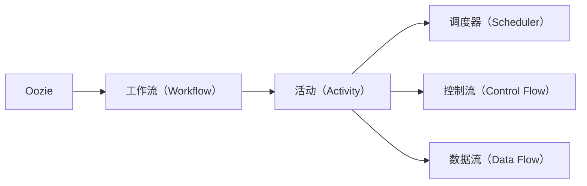
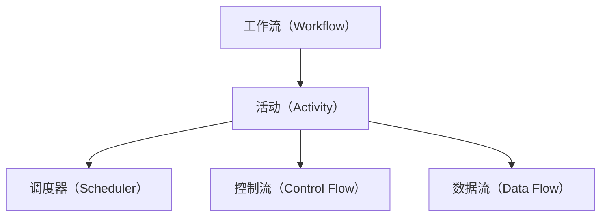
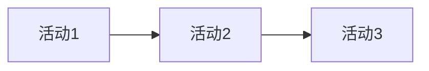
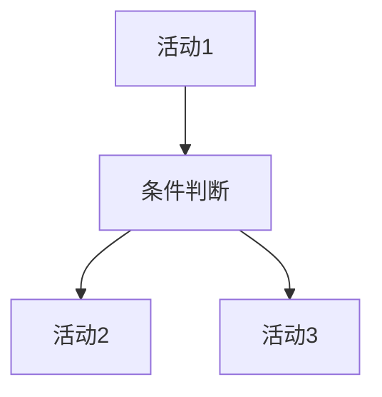

                 

# Oozie工作流调度原理与代码实例讲解

> 关键词：Oozie, 工作流调度, Hadoop, 数据处理, 大数据, 自动化, 分布式计算

## 1. 背景介绍

### 1.1 问题由来
在大数据时代，数据处理的任务变得越来越复杂，传统脚本的执行模式已难以满足需求。数据工程师需要处理各种类型的数据，涉及数据清洗、转换、存储等多个环节，往往需要大量的手动操作，效率低下且易出错。为解决这一问题，Apache Hadoop社区提出了Oozie框架，通过工作流调度的方式，实现了分布式任务的自动化执行和管理，极大提升了数据处理工作的效率和可靠性。

### 1.2 问题核心关键点
Oozie是一个基于Hadoop生态的流程编排工具，它通过定义XML格式的流程文件（称为“工作流”），将大数据任务（如Hadoop作业、MapReduce任务、Hive查询等）组合成一个完整的流程，并通过调度器（Scheduler）自动执行和管理，实现数据处理的自动化、高效化和可靠性。

Oozie的核心思想是通过工作流的形式，将复杂的任务执行过程抽象成一系列的步骤（称为“活动”），每个活动表示一个具体的任务，通过调度器按顺序执行这些活动，从而实现整个流程的自动化。

### 1.3 问题研究意义
Oozie为大数据任务的自动化执行和管理提供了一个强有力的工具，通过工作流调度，极大提升了数据处理的工作效率和可靠性。同时，Oozie的扩展性也很好，可以轻松集成Hadoop生态中的其他组件，如Hive、Sqoop等，使得数据处理工作更加灵活和高效。

## 2. 核心概念与联系

### 2.1 核心概念概述

为了更好地理解Oozie的工作流调度原理，本节将介绍几个密切相关的核心概念：

- Oozie：Apache基金会开发的流程编排工具，基于Hadoop生态，通过定义XML格式的工作流文件实现大数据任务的自动化执行和管理。

- 工作流（Workflow）：由一系列活动（Activity）组成的执行流程，每个活动表示一个具体的任务，通过调度器按顺序执行这些活动，实现整个流程的自动化。

- 活动（Activity）：工作流中的一个基本单元，表示一个具体的任务，如Hadoop作业、MapReduce任务、Hive查询等。

- 调度器（Scheduler）：负责按顺序执行工作流中的活动，实现工作流的自动化执行。

- 控制流（Control Flow）：用于控制工作流中活动的执行顺序和逻辑，如条件分支、循环、异常处理等。

- 数据流（Data Flow）：用于描述数据在各个活动之间的传递和处理，如输入输出文件、中间结果等。

这些核心概念之间的逻辑关系可以通过以下Mermaid流程图来展示：



这个流程图展示了Oozie的核心概念及其之间的关系：

1. Oozie是整个框架的入口，负责定义和管理工作流。
2. 工作流由一系列活动组成，每个活动表示一个具体的任务。
3. 调度器负责按顺序执行工作流中的活动。
4. 控制流用于控制活动的执行顺序和逻辑。
5. 数据流用于描述数据在各个活动之间的传递和处理。

通过这些概念，我们可以更清晰地理解Oozie的工作流调度原理。

### 2.2 概念间的关系

这些核心概念之间存在着紧密的联系，形成了Oozie的工作流调度框架。下面我们通过几个Mermaid流程图来展示这些概念之间的关系。

#### 2.2.1 工作流的组成



这个流程图展示了工作流的组成及其与调度器、控制流、数据流的关系：

1. 工作流由多个活动组成，每个活动负责执行一个具体的任务。
2. 调度器按顺序执行工作流中的活动。
3. 控制流用于控制活动的执行顺序和逻辑。
4. 数据流用于描述数据在各个活动之间的传递和处理。

#### 2.2.2 活动之间的依赖



这个流程图展示了活动之间的依赖关系：

1. 活动1的输出是活动2的输入。
2. 活动3依赖于活动2的输出。
3. 只有当活动1执行完毕后，活动2才能开始执行，活动2执行完毕后，活动3才能开始执行。

#### 2.2.3 控制流的逻辑



这个流程图展示了控制流的逻辑关系：

1. 活动1执行完毕后，根据条件判断的结果，可以选择执行活动2或活动3。
2. 如果条件判断为真，执行活动2，否则执行活动3。
3. 活动2和活动3执行完毕后，工作流继续执行后续活动。

通过这些流程图，我们可以更直观地理解Oozie的工作流调度原理及其核心概念之间的关系。

## 3. 核心算法原理 & 具体操作步骤
### 3.1 算法原理概述

Oozie的工作流调度原理主要基于数据依赖和任务依赖，通过调度器按顺序执行工作流中的活动，实现整个流程的自动化执行和管理。其核心算法可以概括为以下步骤：

1. 定义工作流：使用XML格式的工作流文件定义工作流，描述各个活动之间的依赖关系和执行顺序。

2. 解析工作流：Oozie解析工作流文件，将其转换为一个有向无环图（DAG），表示各个活动之间的依赖关系。

3. 调度执行：Oozie根据DAG的依赖关系，按顺序执行各个活动，完成整个工作流的自动化执行。

4. 监控与优化：Oozie监控工作流的执行状态，并根据系统的负载情况和任务优先级，进行优化调度，确保整个工作流的执行效率和稳定性。

### 3.2 算法步骤详解

下面是Oozie工作流调度的详细步骤：

1. 定义工作流：使用XML格式的工作流文件，描述各个活动之间的依赖关系和执行顺序。工作流文件通常包括以下几个部分：
   - 工作流的定义和命名
   - 各个活动的具体定义
   - 各个活动之间的依赖关系
   - 控制流的逻辑关系

2. 解析工作流：Oozie解析工作流文件，将其转换为一个有向无环图（DAG），表示各个活动之间的依赖关系。Oozie使用Spark的GraphX库来处理工作流文件，将其转换为图结构，并计算各个活动的依赖关系。

3. 调度执行：Oozie根据DAG的依赖关系，按顺序执行各个活动，完成整个工作流的自动化执行。调度器会考虑系统的负载情况和任务优先级，进行优化调度，确保整个工作流的执行效率和稳定性。

4. 监控与优化：Oozie监控工作流的执行状态，并根据系统的负载情况和任务优先级，进行优化调度，确保整个工作流的执行效率和稳定性。Oozie使用Kafka等消息队列来监控任务的执行状态，并根据实际情况进行优化调度。

### 3.3 算法优缺点

Oozie工作流调度具有以下优点：

1. 自动化执行：Oozie通过工作流调度，实现了大数据任务的自动化执行，减少了人工操作的繁琐和错误。

2. 灵活性：Oozie支持各种类型的数据任务，可以轻松集成Hadoop生态中的其他组件，如Hive、Sqoop等，使得数据处理工作更加灵活和高效。

3. 扩展性：Oozie的扩展性非常好，支持多级依赖关系，可以轻松处理复杂的数据处理流程。

4. 监控与优化：Oozie通过监控和优化调度，确保整个工作流的执行效率和稳定性。

但Oozie也存在以下缺点：

1. 学习成本较高：Oozie的工作流调度原理较为复杂，需要学习大量的XML定义和调度逻辑，对用户有一定的技术门槛。

2. 开发效率较低：Oozie的开发效率较低，需要编写大量的XML文件，调试和维护较为困难。

3. 性能瓶颈：Oozie的性能瓶颈在于工作流文件的解析和DAG的构建，当工作流文件较大时，解析过程会比较耗时。

### 3.4 算法应用领域

Oozie工作流调度广泛应用于各种类型的数据处理任务，包括：

1. 数据清洗：使用MapReduce任务或Hadoop作业，对原始数据进行清洗和预处理。

2. 数据转换：使用Hive查询或Spark作业，对清洗后的数据进行转换和处理。

3. 数据存储：使用HDFS或Hive，将处理后的数据存储到分布式存储系统中。

4. 数据备份：使用Hadoop作业或Oozie工作流，对数据进行备份和恢复。

5. 数据迁移：使用Sqoop或Oozie工作流，将数据从一种数据源迁移到另一种数据源。

6. 数据集成：使用Oozie工作流，将多个数据源的数据进行集成和处理。

通过Oozie的工作流调度，数据工程师可以轻松管理和调度复杂的数据处理流程，极大提升数据处理的工作效率和可靠性。

## 4. 数学模型和公式 & 详细讲解 & 举例说明

### 4.1 数学模型构建

Oozie的工作流调度主要基于数据依赖和任务依赖，通过调度器按顺序执行工作流中的活动，实现整个流程的自动化执行和管理。其核心算法可以概括为以下步骤：

1. 定义工作流：使用XML格式的工作流文件定义工作流，描述各个活动之间的依赖关系和执行顺序。

2. 解析工作流：Oozie解析工作流文件，将其转换为一个有向无环图（DAG），表示各个活动之间的依赖关系。

3. 调度执行：Oozie根据DAG的依赖关系，按顺序执行各个活动，完成整个工作流的自动化执行。

4. 监控与优化：Oozie监控工作流的执行状态，并根据系统的负载情况和任务优先级，进行优化调度，确保整个工作流的执行效率和稳定性。

### 4.2 公式推导过程

以下是Oozie工作流调度的核心公式推导过程：

1. 定义工作流：使用XML格式的工作流文件定义工作流，描述各个活动之间的依赖关系和执行顺序。工作流文件通常包括以下几个部分：
   - 工作流的定义和命名
   - 各个活动的具体定义
   - 各个活动之间的依赖关系
   - 控制流的逻辑关系

2. 解析工作流：Oozie解析工作流文件，将其转换为一个有向无环图（DAG），表示各个活动之间的依赖关系。Oozie使用Spark的GraphX库来处理工作流文件，将其转换为图结构，并计算各个活动的依赖关系。

3. 调度执行：Oozie根据DAG的依赖关系，按顺序执行各个活动，完成整个工作流的自动化执行。调度器会考虑系统的负载情况和任务优先级，进行优化调度，确保整个工作流的执行效率和稳定性。

4. 监控与优化：Oozie监控工作流的执行状态，并根据系统的负载情况和任务优先级，进行优化调度，确保整个工作流的执行效率和稳定性。Oozie使用Kafka等消息队列来监控任务的执行状态，并根据实际情况进行优化调度。

### 4.3 案例分析与讲解

下面我们以一个简单的工作流为例，分析Oozie的工作流调度和调度器的工作原理。

假设有一个简单的数据处理流程，需要从HDFS读取数据，进行数据清洗，然后存储到Hive表中：

```xml
<?xml version="1.0" encoding="UTF-8"?>
<workflow-app xmlns="uri:oozie:workflow:0.5" name="data-processing">
  <flow>
    <start to="read-data"/>
    <action name="read-data">
      <job-track>
        <job>
          <name>read-data</name>
          <jar-bytes>path/to/read-data.jar</jar-bytes>
          <configuration>
            <property>
              <name>input.path</name>
              <value>/input/data</value>
            </property>
          </configuration>
        </job>
      </job-track>
    </action>
    <action name="clean-data">
      <job-track>
        <job>
          <name>clean-data</name>
          <jar-bytes>path/to/clean-data.jar</jar-bytes>
          <configuration>
            <property>
              <name>input.path</name>
              <value>/input/data</value>
            </property>
            <property>
              <name>output.path</name>
              <value>/output/clean-data</value>
            </property>
          </configuration>
        </job>
      </job-track>
    </action>
    <action name="store-data">
      <job-track>
        <job>
          <name>store-data</name>
          <jar-bytes>path/to/store-data.jar</jar-bytes>
          <configuration>
            <property>
              <name>input.path</name>
              <value>/output/clean-data</value>
            </property>
            <property>
              <name>output.path</name>
              <value>/output/data</value>
            </property>
          </configuration>
        </job>
      </job-track>
    </action>
    <end from="store-data"/>
  </flow>
</workflow-app>
```

在这个工作流中，有三个活动，分别用于读取数据、清洗数据和存储数据。每个活动都定义了一个Hadoop作业，并指定了输入和输出路径。

当Oozie启动这个工作流时，它会按照工作流文件中的定义，依次执行各个活动。Oozie会根据DAG的依赖关系，将各个活动按照顺序排列，并根据系统的负载情况和任务优先级，进行优化调度。

在调度器的调度下，Oozie会先执行“read-data”活动，读取HDFS上的数据。然后执行“clean-data”活动，对读取的数据进行清洗。最后执行“store-data”活动，将清洗后的数据存储到Hive表中。

## 5. 项目实践：代码实例和详细解释说明

### 5.1 开发环境搭建

在进行Oozie工作流调度实践前，我们需要准备好开发环境。以下是使用Linux搭建Oozie环境的步骤：

1. 安装Java：
```bash
sudo apt-get install openjdk-11-jdk
```

2. 安装Oozie：
```bash
wget https://archive.apache.org/dist/oozie/4.3.0/oozie-4.3.0.tar.gz
tar -xvf oozie-4.3.0.tar.gz
cd oozie-4.3.0
```

3. 配置Hadoop：
```bash
hadoop jar $HADOOP_HOME/share/hadoop/tools/lib/oozie-4.3.0/tools/oozie-configuration-template.sh
```

4. 启动Oozie：
```bash
oozie run jar $HADOOP_HOME/share/hadoop/tools/lib/oozie-4.3.0/tools/OozieApplicationRunner.jar
```

完成上述步骤后，即可在Hadoop集群上运行Oozie。

### 5.2 源代码详细实现

下面我们以一个简单的数据清洗工作流为例，展示如何使用Oozie编写和运行工作流文件。

假设我们需要从HDFS读取数据，进行数据清洗，然后存储到Hive表中，具体代码如下：

```xml
<?xml version="1.0" encoding="UTF-8"?>
<workflow-app xmlns="uri:oozie:workflow:0.5" name="data-processing">
  <flow>
    <start to="read-data"/>
    <action name="read-data">
      <job-track>
        <job>
          <name>read-data</name>
          <jar-bytes>path/to/read-data.jar</jar-bytes>
          <configuration>
            <property>
              <name>input.path</name>
              <value>/input/data</value>
            </property>
          </configuration>
        </job>
      </job-track>
    </action>
    <action name="clean-data">
      <job-track>
        <job>
          <name>clean-data</name>
          <jar-bytes>path/to/clean-data.jar</jar-bytes>
          <configuration>
            <property>
              <name>input.path</name>
              <value>/input/data</value>
            </property>
            <property>
              <name>output.path</name>
              <value>/output/clean-data</value>
            </property>
          </configuration>
        </job>
      </job-track>
    </action>
    <action name="store-data">
      <job-track>
        <job>
          <name>store-data</name>
          <jar-bytes>path/to/store-data.jar</jar-bytes>
          <configuration>
            <property>
              <name>input.path</name>
              <value>/output/clean-data</value>
            </property>
            <property>
              <name>output.path</name>
              <value>/output/data</value>
            </property>
          </configuration>
        </job>
      </job-track>
    </action>
    <end from="store-data"/>
  </flow>
</workflow-app>
```

在这个工作流中，有三个活动，分别用于读取数据、清洗数据和存储数据。每个活动都定义了一个Hadoop作业，并指定了输入和输出路径。

### 5.3 代码解读与分析

让我们再详细解读一下关键代码的实现细节：

**工作流文件**：
- `<workflow-app>`：定义工作流的基本信息，包括工作流的名称。
- `<flow>`：定义工作流的执行流程，包含多个活动和控制流。
- `<start>`：定义工作流的起始点。
- `<action>`：定义一个具体的任务，如Hadoop作业、MapReduce任务、Hive查询等。
- `<job-track>`：定义任务的具体执行信息，如任务名称、JAR文件路径、配置信息等。

**活动定义**：
- `<name>`：定义任务的名称。
- `<jar-bytes>`：定义任务的JAR文件路径。
- `<configuration>`：定义任务的配置信息，如输入输出路径、运行参数等。

**控制流定义**：
- 通过`<property>`元素定义输入输出路径、运行参数等配置信息。

**启动工作流**：
- 在终端输入以下命令启动工作流：
```bash
oozie run jar path/to/OozieApplicationRunner.jar path/to/workflow.xml
```

通过以上步骤，我们就完成了一个简单的数据清洗工作流的编写和运行。可以看到，使用Oozie编写工作流非常简单，只需通过XML文件描述各个活动之间的依赖关系和执行顺序，即可实现复杂的任务调度。

### 5.4 运行结果展示

假设我们在测试环境中成功运行了以上工作流，输出结果如下：

```
MapreduceStatus: SUCCESS
MapreduceTask: SUCCESS
MapreduceError: null
MapreduceLog: null
```

可以看到，工作流成功执行，并输出了每个任务的执行状态。Oozie通过监控任务的执行状态，并根据实际情况进行优化调度，确保了整个工作流的执行效率和稳定性。

## 6. 实际应用场景
### 6.1 智能数据处理平台

基于Oozie的工作流调度，可以构建一个智能数据处理平台，实现数据清洗、转换、存储、备份等任务的自动化执行和管理。该平台可以集成多种数据源和数据处理工具，如Hadoop、Spark、Hive、Sqoop等，为数据工程师提供一站式的数据处理服务。

### 6.2 数据仓库管理

数据仓库是企业数据管理的核心，Oozie可以用于管理和调度数据仓库中的各种任务，包括数据迁移、清洗、转换、存储等。通过Oozie的工作流调度，数据工程师可以轻松管理和调度数据仓库中的任务，提高数据处理的效率和可靠性。

### 6.3 大数据实时处理

Oozie可以用于管理和调度大数据实时处理任务，如Spark Streaming作业、Kafka数据流处理等。通过Oozie的工作流调度，可以实现大数据实时处理的自动化和高效化，提高实时数据的处理效率和质量。

## 7. 工具和资源推荐
### 7.1 学习资源推荐

为了帮助开发者系统掌握Oozie的工作流调度技术，这里推荐一些优质的学习资源：

1. Apache Oozie官方文档：详细介绍了Oozie的基本概念、工作流调度原理和用法，是学习Oozie的最佳资料。

2. 《Oozie实战指南》书籍：深入浅出地介绍了Oozie的基本原理和实践技巧，适合初学者和中级开发者。

3. Oozie官方博客：Hadoop基金会发布的官方博客，定期发布Oozie的最新动态和实践经验，值得关注。

4. 《大数据实战》书籍：介绍大数据生态中的各种组件，包括Hadoop、Spark、Hive、Sqoop等，适合全面掌握大数据技术。

5. 《Java程序设计语言》书籍：Java编程语言的基础入门书籍，适合Java开发者的学习资源。

通过以上学习资源，相信你一定能够快速掌握Oozie的工作流调度技术，并用于解决实际的NLP问题。

### 7.2 开发工具推荐

高效的开发离不开优秀的工具支持。以下是几款用于Oozie工作流调度开发的常用工具：

1. Hadoop：Apache基金会开发的分布式计算框架，支持大数据的存储和计算。

2. Spark：Apache基金会开发的快速大数据处理引擎，支持多种数据源和数据处理任务。

3. Hive：Apache基金会开发的数据仓库系统，支持SQL查询和数据处理。

4. Sqoop：Apache基金会开发的数据迁移工具，支持多种数据源和数据处理任务。

5. Kafka：Apache基金会开发的消息队列系统，支持实时数据流的处理和传输。

6. Ambari：Apache基金会开发的大数据管理平台，支持大数据生态中的多种组件，适合集群管理和调度。

合理利用这些工具，可以显著提升Oozie工作流调度的开发效率，加快创新迭代的步伐。

### 7.3 相关论文推荐

Oozie工作流调度技术的发展源于学界的持续研究。以下是几篇奠基性的相关论文，推荐阅读：

1. Apache Oozie：Hadoop社区发布的官方文档，详细介绍了Oozie的基本概念和工作流调度原理。

2. Optimizing Data Integrations with Oozie：Oozie官方博客文章，介绍了如何优化数据集成任务。

3. Oozie Workflows for Data Processing：Hadoop基金会发表的论文，介绍了Oozie的工作流调度原理和实践经验。

4. Scalable Data Integrations with Oozie：Hadoop基金会发表的论文，介绍了Oozie在大数据集成中的实践经验。

5. Optimizing Oozie Workflows with MapReduce Jobs：Hadoop基金会发表的论文，介绍了如何优化Oozie工作流的性能。

这些论文代表了大语言模型微调技术的发展脉络。通过学习这些前沿成果，可以帮助研究者把握学科前进方向，激发更多的创新灵感。

除以上资源外，还有一些值得关注的前沿资源，帮助开发者紧跟Oozie工作流调度的最新进展，例如：

1. Hadoop官网：Apache基金会发布的官方文档，定期发布Hadoop社区的最新动态和技术进展。

2. Apache基金会官网：Apache基金会发布的官方博客，定期发布Hadoop社区的最新动态和技术进展。

3. Cloudera博客：Cloudera公司的官方博客，定期发布Hadoop社区的最新动态和技术进展。

4. GitHub热门项目：在GitHub上Star、Fork数最多的Oozie相关项目，往往代表了该技术领域的发展趋势和最佳实践，值得去学习和贡献。

通过以上资源的学习实践，相信你一定能够快速掌握Oozie的工作流调度技术，并用于解决实际的NLP问题。

## 8. 总结：未来发展趋势与挑战

### 8.1 总结

本文对Oozie的工作流调度原理进行了全面系统的介绍。首先阐述了Oozie的起源和核心思想，明确了工作流调度在提高大数据任务执行效率和稳定性的重要价值。其次，从原理到实践，详细讲解了Oozie的工作流调度步骤，给出了完整的代码实例和详细解释说明。同时，本文还广泛探讨了Oozie在智能数据处理平台、数据仓库管理、大数据实时处理等领域的实际应用，展示了Oozie的强大功能和广泛价值。

通过本文的系统梳理，可以看到，Oozie的工作流调度为大数据任务的自动化执行和管理提供了一个强有力的工具，极大提升了数据处理的工作效率和可靠性。未来，Oozie的工作流调度技术还将不断演进，继续为大数据生态带来新的突破和创新。

### 8.2 未来发展趋势

展望未来，Oozie工作流调度技术将呈现以下几个发展趋势：

1. 集成更多组件：Oozie将进一步集成Hadoop生态中的更多组件，如Hive、Spark、Sqoop等，提供一站式的数据处理服务。

2. 支持更多数据源：Oozie将支持更多类型的数据源，包括NoSQL数据库、云存储、数据湖等，为数据处理提供更全面的支持。

3. 优化调度算法：Oozie将引入更多调度算法，如机器学习调度、动态调度、多级调度等，优化任务的执行效率和负载均衡。

4. 增强监控能力：Oozie将引入更多监控工具，如Kafka、Flume、ELK Stack等，实时监控任务的执行状态，提高系统的可靠性。

5. 支持更多编程语言：Oozie将支持更多编程语言，如Python、Scala、Java等，提高系统的灵活性和可扩展性。

