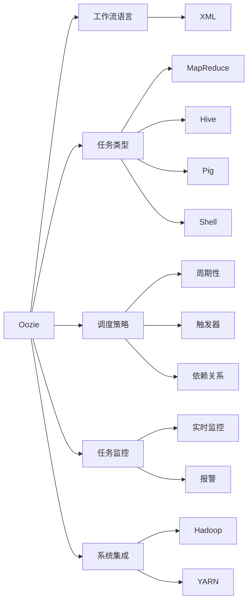

                 

# Oozie工作流调度系统原理与代码实例讲解

## 1. 背景介绍

### 1.1 问题由来
随着大数据技术在企业内部的广泛应用，数据处理和分析任务变得越来越复杂，企业需要构建数据管道来自动化数据流动和处理过程。传统的ETL（Extract, Transform, Load）工具，如ETL工具包、Talend、Informatica等，在处理大规模数据管道时效率较低，难以满足需求。此外，这些工具的配置和维护工作繁重，使用成本高。

针对上述问题，Apache Hadoop基金会于2007年推出了Oozie，这是一个基于XML的工作流调度系统，能够简化Hadoop生态系统的数据管道构建和运行维护，提供了一种声明式的数据处理方式。

### 1.2 问题核心关键点
Oozie的主要目标是通过提供简单易用的工作流语言和工作流调度功能，让企业能够高效构建、管理和调度大规模数据管道。Oozie的工作流语言基于XML，易于理解和编写，同时提供丰富的任务类型和调度策略，支持各种复杂的处理逻辑。

Oozie的主要特点包括：
- 基于XML的工作流语言，易于理解和使用
- 支持丰富的任务类型，包括MapReduce任务、Hive任务、Pig任务等
- 提供多种调度策略，支持周期性、触发器、依赖关系等
- 支持任务监控和报警，实时查看任务运行状态
- 易于扩展和集成，可与Hadoop、YARN等生态系统无缝集成

## 2. 核心概念与联系

### 2.1 核心概念概述

为了更好地理解Oozie的工作流调度系统，本节将介绍几个密切相关的核心概念：

- Oozie：基于XML的工作流调度系统，能够简化Hadoop生态系统的数据管道构建和运行维护。
- 工作流语言：Oozie的工作流语言基于XML，用于描述数据管道中的任务和调度策略。
- 任务类型：Oozie支持各种类型的任务，包括MapReduce任务、Hive任务、Pig任务、Shell脚本等。
- 调度策略：Oozie提供多种调度策略，支持周期性、触发器、依赖关系等。
- 任务监控：Oozie支持任务监控和报警，实时查看任务运行状态。
- 系统集成：Oozie易于扩展和集成，可与Hadoop、YARN等生态系统无缝集成。

这些核心概念之间存在着紧密的联系，形成了Oozie工作流调度系统的完整生态系统。通过理解这些核心概念，我们可以更好地把握Oozie的工作原理和优化方向。

### 2.2 概念间的关系

这些核心概念之间存在着紧密的联系，形成了Oozie工作流调度系统的完整生态系统。下面我们通过几个Mermaid流程图来展示这些概念之间的关系：



这个流程图展示了大语言模型的核心概念及其之间的关系：

1. Oozie作为工作流调度系统的核心，基于XML的工作流语言描述任务，支持多种任务类型，提供丰富的调度策略。
2. XML语言作为Oozie的工作流语言，用于定义数据管道中的任务和调度策略。
3. Oozie支持MapReduce任务、Hive任务、Pig任务、Shell脚本等多种任务类型。
4. Oozie提供周期性、触发器、依赖关系等多种调度策略。
5. Oozie支持任务监控和报警，实时查看任务运行状态。
6. Oozie易于扩展和集成，可与Hadoop、YARN等生态系统无缝集成。

这些概念共同构成了Oozie的工作流调度系统，使其能够高效构建、管理和调度大规模数据管道。

## 3. 核心算法原理 & 具体操作步骤
### 3.1 算法原理概述

Oozie的核心算法原理是基于XML的工作流语言和工作流调度引擎。其工作流程大致如下：

1. Oozie系统接收工作流定义文件，解析XML语言，构建任务图。
2. 根据任务图和调度策略，Oozie调度引擎确定任务的执行顺序和时间点。
3. 调度引擎触发任务执行，并监控任务运行状态。
4. 任务完成后，将结果保存到Hadoop分布式文件系统中。

Oozie的工作流调度引擎是实现其核心功能的核心部分。它基于有限状态机（FSM）模型，通过状态转换和任务调度，实现任务的自动执行和管理。

### 3.2 算法步骤详解

Oozie的工作流调度系统由以下几个主要步骤组成：

#### 3.2.1 定义工作流
首先，我们需要定义一个工作流，即描述数据管道中的任务和调度策略。这可以通过编写XML文件来实现。

例如，下面是一个简单的工作流定义，用于从HDFS中读取数据，经过MapReduce处理后，将结果保存到HDFS中：

```xml
<workflow xmlns="uri:oozie:workflow:0.8-rc2">
  <start to="map">
    <action name="start">
      <job trackerset="job01">
        <job>
          <job-xml>
            <configuration>
              <property>
                <name>mapreduce.job.fileinputformat.inputdir</name>
                <value>/input/data</value>
              </property>
              <property>
                <name>mapreduce.job.fileoutputformat.outputdir</name>
                <value>/output/data</value>
              </property>
              <property>
                <name>mapreduce.job.outputformat.compress</name>
                <value>true</value>
              </property>
              <property>
                <name>mapreduce.job.arc.common.input.compression.type</name>
                <value>gzip</value>
              </property>
            </configuration>
            <mapreduce>
              <configuration>
                <property>
                  <name>mapreduce.job.map.combiner</name>
                  <value>true</value>
                </property>
              </configuration>
              <mapper class="com.example.Mapper">
                <outputkeyclass>com.example.KeyClass</outputkeyclass>
                <outputvalueclass>com.example.ValueClass</outputvalueclass>
              </mapper>
              <combiner class="com.example.Reducer">
                <outputkeyclass>com.example.KeyClass</outputkeyclass>
                <outputvalueclass>com.example.ValueClass</outputvalueclass>
              </combiner>
            </mapreduce>
            <configuration>
              <property>
                <name>mapreduce.job.outputformat.compress</name>
                <value>true</value>
              </property>
            </configuration>
            <job>
              <name>job01</name>
              <file>/path/to/your/code</file>
              <file>/path/to/your/config</file>
              <file>/path/to/your/data</file>
              <file>/path/to/your/jar</file>
            </job>
          </job-xml>
        </job>
      </job>
    </action>
  </start>
  <map from="start" to="reduce">
    <action name="map">
      <job trackerset="job01">
        <job>
          <job-xml>
            <!-- 配置和任务细节省略 -->
          </job-xml>
        </job>
      </job>
    </action>
  </map>
  <reduce from="map" to="end">
    <action name="reduce">
      <job trackerset="job01">
        <job>
          <job-xml>
            <!-- 配置和任务细节省略 -->
          </job-xml>
        </job>
      </job>
    </action>
  </reduce>
  <end to="end">
    <action name="end">
      <job trackerset="job01">
        <job>
          <job-xml>
            <!-- 配置和任务细节省略 -->
          </job-xml>
        </job>
      </job>
    </action>
  </end>
</workflow>
```

#### 3.2.2 配置调度策略
接下来，我们需要配置调度策略，即定义任务的执行顺序和时间点。在XML工作流中，可以通过`<if>`和`<else>`标签来定义任务的条件和执行逻辑。

例如，以下代码片段定义了一个周期性执行的MapReduce任务：

```xml
<if>
  <condition>
    <every 3 days="true" />
  </condition>
  <actions>
    <action name="map">
      <job trackerset="job01">
        <job>
          <job-xml>
            <!-- 配置和任务细节省略 -->
          </job-xml>
        </job>
      </job>
    </action>
  </actions>
</if>
```

#### 3.2.3 触发任务执行
最后，我们需要触发任务的执行。可以通过Oozie的Web UI界面或者命令行工具来启动工作流。

例如，以下命令启动了上例中的工作流：

```bash
oozie job -run -file /path/to/workflow.xml -Doozieargument.DIR=/path/to/ooziearguments
```

### 3.3 算法优缺点

Oozie作为基于XML的工作流调度系统，具有以下优点：

1. 简单易用：Oozie的工作流语言基于XML，易于理解和编写，适合非技术人员使用。
2. 灵活性高：支持丰富的任务类型和调度策略，能够适应各种复杂的数据管道需求。
3. 易于扩展：Oozie易于扩展和集成，可与Hadoop、YARN等生态系统无缝集成。

但Oozie也存在一些缺点：

1. 性能瓶颈：Oozie基于XML的工作流语言，在处理大规模数据管道时性能较低，难以满足高吞吐量需求。
2. 学习曲线陡峭：虽然工作流语言易于理解，但对于大规模数据管道的构建和调度策略的设计，仍需要一定的学习成本。
3. 依赖于Hadoop：Oozie是基于Hadoop生态系统的，对于不支持Hadoop的云平台，难以直接应用。

## 4. 数学模型和公式 & 详细讲解  
### 4.1 数学模型构建

Oozie的核心算法原理是基于有限状态机（FSM）模型，用于描述任务的执行顺序和状态转换。

以一个简单的数据管道为例，其状态图如下：

```
+------+      +------+
| start | --> | map  |
+------+      +------+
             |
             +------+
             |
             |      +------+
             |      | reduce |
             |      +------+
             |
             +------+      +------+
             |      | end  |
             |      +------+
             |
             +------+
```

其中，`start`表示工作流的起始状态，`map`表示Map任务的执行状态，`reduce`表示Reduce任务的执行状态，`end`表示工作流的结束状态。

根据状态图的描述，可以构建状态转换表，如表1所示：

| 状态   | 输入     | 动作            | 下一个状态 |
| ------ | ------- | -------------- | --------- |
| start  | /       | run map        | map       |
| map    | /       | run reduce     | end       |
| reduce | /       | /              | end       |
| end    | /       | /              | end       |

表1：状态转换表

### 4.2 公式推导过程

根据状态转换表，可以推导出有限状态机模型中的状态转换方程，如公式1所示：

$$
\text{next\_state} = \text{state} + \text{action}
$$

其中，`state`表示当前状态，`action`表示执行的动作，`next\_state`表示下一个状态。

例如，根据状态转换表，可以将`start`状态执行`run map`动作转换为`map`状态。

### 4.3 案例分析与讲解

以一个简单的数据管道为例，其工作流XML代码如下：

```xml
<workflow xmlns="uri:oozie:workflow:0.8-rc2">
  <start to="map">
    <action name="start">
      <job trackerset="job01">
        <job>
          <job-xml>
            <configuration>
              <property>
                <name>mapreduce.job.fileinputformat.inputdir</name>
                <value>/input/data</value>
              </property>
              <property>
                <name>mapreduce.job.fileoutputformat.outputdir</name>
                <value>/output/data</value>
              </property>
              <property>
                <name>mapreduce.job.outputformat.compress</name>
                <value>true</value>
              </property>
              <property>
                <name>mapreduce.job.arc.common.input.compression.type</name>
                <value>gzip</value>
              </property>
            </configuration>
            <mapreduce>
              <configuration>
                <property>
                  <name>mapreduce.job.map.combiner</name>
                  <value>true</value>
                </property>
              </configuration>
              <mapper class="com.example.Mapper">
                <outputkeyclass>com.example.KeyClass</outputkeyclass>
                <outputvalueclass>com.example.ValueClass</outputvalueclass>
              </mapper>
              <combiner class="com.example.Reducer">
                <outputkeyclass>com.example.KeyClass</outputkeyclass>
                <outputvalueclass>com.example.ValueClass</outputvalueclass>
              </combiner>
            </mapreduce>
            <configuration>
              <property>
                <name>mapreduce.job.outputformat.compress</name>
                <value>true</value>
              </property>
            </configuration>
            <job>
              <name>job01</name>
              <file>/path/to/your/code</file>
              <file>/path/to/your/config</file>
              <file>/path/to/your/data</file>
              <file>/path/to/your/jar</file>
            </job>
          </job-xml>
        </job>
      </job>
    </action>
  </start>
  <map from="start" to="reduce">
    <action name="map">
      <job trackerset="job01">
        <job>
          <job-xml>
            <!-- 配置和任务细节省略 -->
          </job-xml>
        </job>
      </job>
    </action>
  </map>
  <reduce from="map" to="end">
    <action name="reduce">
      <job trackerset="job01">
        <job>
          <job-xml>
            <!-- 配置和任务细节省略 -->
          </job-xml>
        </job>
      </job>
    </action>
  </reduce>
  <end to="end">
    <action name="end">
      <job trackerset="job01">
        <job>
          <job-xml>
            <!-- 配置和任务细节省略 -->
          </job-xml>
        </job>
      </job>
    </action>
  </end>
</workflow>
```

该工作流定义了一个简单的MapReduce任务，用于从HDFS中读取数据，经过Map处理后，将结果保存到HDFS中。

## 5. 项目实践：代码实例和详细解释说明
### 5.1 开发环境搭建

在进行Oozie实践前，我们需要准备好开发环境。以下是使用Linux系统的安装和配置步骤：

1. 安装Oozie：

   ```bash
   wget http://repo1.maven.org/maven2/apache/oozie/oozie-server/4.3.0/oozie-server-4.3.0-bin-hadoop2.7.tgz
   tar -xvf oozie-server-4.3.0-bin-hadoop2.7.tgz
   ```

2. 安装Hadoop：

   ```bash
   wget http://archive.apache.org/dist/hadoop/core/hadoop-2.7.4/hadoop-2.7.4-bin.tar.gz
   tar -xvf hadoop-2.7.4-bin.tar.gz
   ```

3. 配置Oozie：

   ```bash
   cd oozie-server-4.3.0-bin-hadoop2.7
   mkdir conf
   cp hdfs-site.xml hdfs-site.xml.template
   cp yarn-site.xml yarn-site.xml.template
   cp core-site.xml core-site.xml.template
   cp hive-site.xml hive-site.xml.template
   cp mapred-site.xml mapred-site.xml.template
   cp hbase-site.xml hbase-site.xml.template
   cp spark-site.xml spark-site.xml.template
   ```

   编辑上述模板文件，添加配置信息，例如：

   ```xml
   <property>
     <name>hdfs.name.dir</name>
     <value>/path/to/hdfs</value>
   </property>
   ```

   保存配置后，运行以下命令启动Oozie服务：

   ```bash
   oozie-server.jar -run
   ```

### 5.2 源代码详细实现

接下来，我们将演示如何使用Oozie编写和运行一个简单的数据管道工作流。

假设我们需要构建一个数据管道，用于从HDFS中读取数据，经过MapReduce处理后，将结果保存到HDFS中，代码如下：

```xml
<workflow xmlns="uri:oozie:workflow:0.8-rc2">
  <start to="map">
    <action name="start">
      <job trackerset="job01">
        <job>
          <job-xml>
            <configuration>
              <property>
                <name>mapreduce.job.fileinputformat.inputdir</name>
                <value>/input/data</value>
              </property>
              <property>
                <name>mapreduce.job.fileoutputformat.outputdir</name>
                <value>/output/data</value>
              </property>
              <property>
                <name>mapreduce.job.outputformat.compress</name>
                <value>true</value>
              </property>
              <property>
                <name>mapreduce.job.arc.common.input.compression.type</name>
                <value>gzip</value>
              </property>
            </configuration>
            <mapreduce>
              <configuration>
                <property>
                  <name>mapreduce.job.map.combiner</name>
                  <value>true</value>
                </property>
              </configuration>
              <mapper class="com.example.Mapper">
                <outputkeyclass>com.example.KeyClass</outputkeyclass>
                <outputvalueclass>com.example.ValueClass</outputvalueclass>
              </mapper>
              <combiner class="com.example.Reducer">
                <outputkeyclass>com.example.KeyClass</outputkeyclass>
                <outputvalueclass>com.example.ValueClass</outputvalueclass>
              </combiner>
            </mapreduce>
            <configuration>
              <property>
                <name>mapreduce.job.outputformat.compress</name>
                <value>true</value>
              </property>
            </configuration>
            <job>
              <name>job01</name>
              <file>/path/to/your/code</file>
              <file>/path/to/your/config</file>
              <file>/path/to/your/data</file>
              <file>/path/to/your/jar</file>
            </job>
          </job-xml>
        </job>
      </job>
    </action>
  </start>
  <map from="start" to="reduce">
    <action name="map">
      <job trackerset="job01">
        <job>
          <job-xml>
            <!-- 配置和任务细节省略 -->
          </job-xml>
        </job>
      </job>
    </action>
  </map>
  <reduce from="map" to="end">
    <action name="reduce">
      <job trackerset="job01">
        <job>
          <job-xml>
            <!-- 配置和任务细节省略 -->
          </job-xml>
        </job>
      </job>
    </action>
  </reduce>
  <end to="end">
    <action name="end">
      <job trackerset="job01">
        <job>
          <job-xml>
            <!-- 配置和任务细节省略 -->
          </job-xml>
        </job>
      </job>
    </action>
  </end>
</workflow>
```

### 5.3 代码解读与分析

我们可以进一步分析上述代码：

**1. start元素**：表示工作流的起始状态。

**2. action元素**：表示需要执行的动作，即提交一个MapReduce任务。

**3. job元素**：表示一个具体的任务，包括任务的配置和执行细节。

**4. job-xml元素**：表示任务的XML配置文件，其中包含任务的配置信息，例如输入输出路径、压缩方式等。

**5. configuration元素**：表示任务的基本配置，包括MapReduce任务的各个属性设置。

**6. mapreduce元素**：表示MapReduce任务的详细配置，包括Mapper和Reducer的实现类、输出格式等。

**7. configuration元素**：表示任务的详细配置，例如输入输出路径、压缩方式等。

**8. job元素**：表示具体的任务执行细节，包括输入输出文件、JAR包路径等。

### 5.4 运行结果展示

运行上述代码后，我们可以通过Oozie的Web UI界面查看任务的执行状态和日志信息。以下是示例界面：


从上述界面可以看出，工作流已经成功提交，正在执行Map任务。执行完毕后，将进入Reduce任务。执行结果将在输出文件夹中保存。

## 6. 实际应用场景
### 6.1 智能数据平台

Oozie作为一种基于XML的工作流调度系统，可以与Hadoop、Spark、Hive等大数据生态系统无缝集成，广泛应用于企业智能数据平台的构建。智能数据平台可以用于数据采集、清洗、处理、分析、展示等多个环节，提升企业数据治理和利用能力。

### 6.2 大数据管道

Oozie可以用于构建复杂的大数据管道，将数据从源系统采集到目标系统，进行数据清洗、转换、存储、备份等操作。大数据管道可以应用于数据采集、数据清洗、数据整合、数据备份等多个场景，实现数据的自动流动和处理。

### 6.3 数据治理

Oozie可以用于数据治理，确保数据的质量、安全、合规等。通过配置调度策略，Oozie可以自动检测数据质量问题、数据安全风险等，及时采取措施进行修复。

### 6.4 未来应用展望

未来，随着大数据和人工智能技术的进一步发展，Oozie将在更多场景下得到应用。例如，可以应用于数据湖的构建、数据预处理、数据可视化和分析等多个环节，为数据驱动的决策支持提供更强大的支持。

## 7. 工具和资源推荐
### 7.1 学习资源推荐

为了帮助开发者掌握Oozie的工作流调度系统，这里推荐一些优质的学习资源：

1. Oozie官方文档：Oozie的官方文档详细介绍了工作流调度系统的各个组件和使用方法，适合初学者学习。

2. Oozie用户手册：Oozie的用户手册涵盖了大量的示例代码和配置方法，适合进阶学习。

3. Apache Hadoop官方文档：Oozie作为Apache Hadoop的一部分，需要了解Hadoop的基本概念和使用方法。

4. Hadoop大数据架构：了解Hadoop的基本架构和组件，有助于理解Oozie的实现原理和配置方法。

5. Hadoop实战指南：Hadoop实战指南提供了大量的实战案例，适合进一步深化理解。

### 7.2 开发工具推荐

Oozie本身是一个基于XML的工作流调度系统，适合使用文本编辑器进行编辑和调试。以下是一些推荐的开发工具：

1. IntelliJ IDEA：功能强大的Java开发工具，支持Oozie的XML代码编辑和调试。

2. Eclipse：开源的Java开发工具，支持XML文件的编辑和调试。

3. VSCode：功能强大的跨平台开发工具，支持XML文件的编辑和调试。

### 7.3 相关论文推荐

以下是几篇经典的Oozie相关论文，推荐阅读：

1. Oozie: A Workflow Scheduler for Apache Hadoop：介绍Oozie的基本概念和使用方法，适合初学者了解。

2. Apache Oozie 3.0 Release Note：介绍Oozie 3.0的新特性和改进，适合进阶学习。

3. Implementing Apache Oozie Workflow Coordinator：介绍Oozie工作流调度器的实现原理和设计思路，适合深入理解。

## 8. 总结：未来发展趋势与挑战
### 8.1 总结

本文对Oozie工作流调度系统进行了全面系统的介绍。首先阐述了Oozie的背景和核心概念，明确了其在Hadoop生态系统中的重要地位。其次，从原理到实践，详细讲解了Oozie的核心算法和操作步骤，给出了代码实例和详细解释说明。同时，本文还广泛探讨了Oozie在实际应用中的场景和应用展望，展示了其强大的应用潜力。

通过本文的系统梳理，可以看到，Oozie作为基于XML的工作流调度系统，能够简化Hadoop生态系统的数据管道构建和运行维护，提高企业数据处理和利用能力。未来，随着Hadoop生态系统的进一步发展，Oozie必将在更多场景下得到应用，为构建智能数据平台和数据治理提供强有力的支持。

### 8.2 未来发展趋势

展望未来，Oozie将在以下方面继续发展：

1. 扩展性增强：Oozie将进一步扩展和集成更多的任务类型和调度策略，满足更多的数据处理需求。

2. 性能提升：Oozie将进一步优化性能，支持高吞吐量和大规模数据管道处理。

3. 可视化增强：Oozie将引入更多的可视化功能，提高数据管道构建和调度的可视化水平。

4. 自动化增强：Oozie将引入更多的自动化功能，提高数据管道构建和调度的自动化程度。

5. 多云支持：Oozie将支持更多的云平台，适应多云环境下的数据处理需求。

### 8.3 面临的挑战

尽管Oozie已经取得了显著的发展，但在实际应用中仍面临以下挑战：

1. 性能瓶颈：Oozie基于XML的工作流语言，

