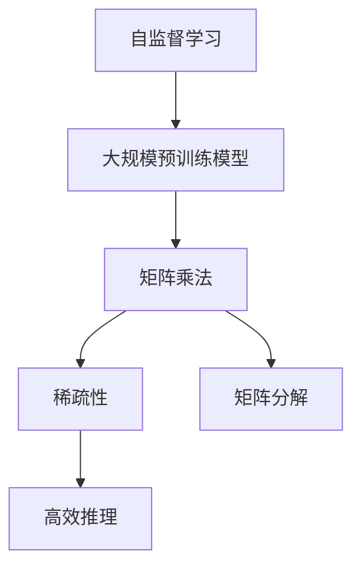
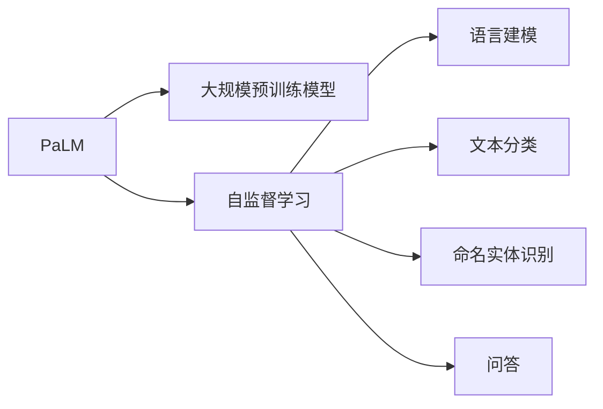
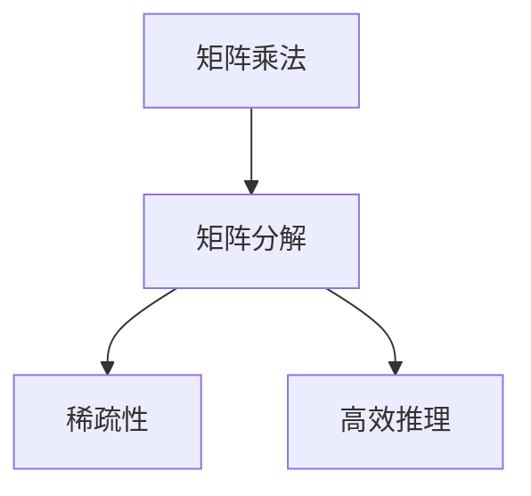
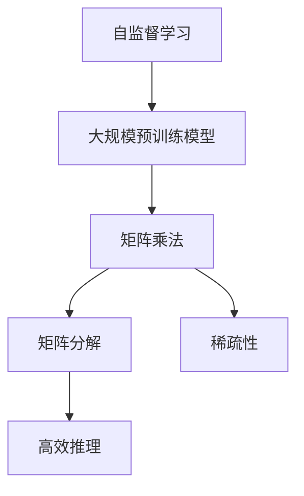
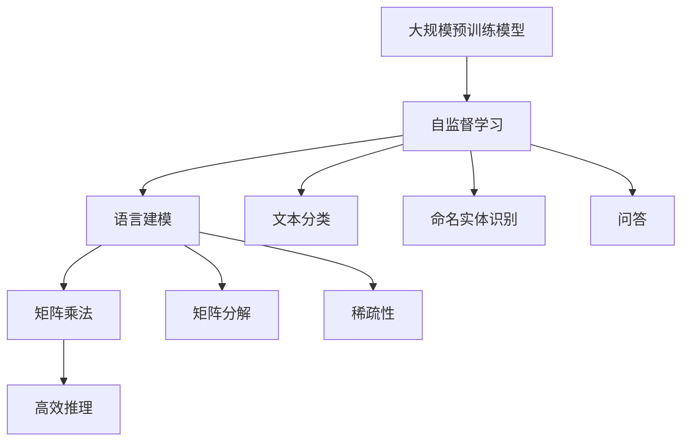

                 

# PaLM原理与代码实例讲解

> 关键词：PaLM,自监督学习,Transformer,大规模预训练,矩阵乘法,稀疏性,矩阵分解,高效推理

## 1. 背景介绍

### 1.1 问题由来
自监督学习是深度学习领域的重要研究方向之一。在大规模无标签数据上进行自监督预训练，可以有效提升模型性能，使其能够更好地适应下游任务。传统的自监督学习通常依赖于对数据的明确标注，难以覆盖所有任务和数据集。

近年来，随着计算能力的提升和预训练数据集的丰富，出现了许多大规模预训练模型，如BERT、GPT、T5等。这些模型通过在大规模语料上进行预训练，学习到丰富的语言知识，并在下游任务上表现出不俗的性能。然而，由于预训练数据集的差异性和通用性问题，这些模型在某些特定领域的应用效果仍不理想。

为了更好地应对这一问题，Google于2021年提出了一种名为PaLM的大规模自监督预训练模型。PaLM通过联合不同任务的预训练，同时提升模型的语言理解和生成能力，适用于更广泛的下游任务。本文将深入探讨PaLM模型的原理与代码实现，为读者提供详细的指导。

### 1.2 问题核心关键点
PaLM的核心思想是在大规模数据集上进行联合预训练，同时涵盖语言建模、文本分类、命名实体识别、问答等多种任务，以提升模型的泛化能力和迁移学习性能。与传统的单任务预训练模型不同，PaLM的目标是在相同的架构和训练策略下，同时训练多个任务的模型，从而使得模型能够更好地适应下游任务。

PaLM的优势在于：
1. 模型结构简单，易于扩展。
2. 使用Transformer架构，具有高效的矩阵乘法计算能力。
3. 训练样本多样，覆盖多种语言理解与生成任务。
4. 自监督学习目标函数设计合理，能够更好地利用数据。
5. 参数量巨大，能够应对复杂的语言结构。

PaLM的挑战在于：
1. 训练样本量巨大，需要强大的计算资源。
2. 矩阵分解和稀疏性问题需要高效的计算方法。
3. 训练时间较长，需要高效的优化策略。
4. 模型复杂度高，推理速度慢。
5. 训练和推理过程中的矩阵分解需要高效的硬件支持。

本文将深入分析PaLM模型的原理和架构，同时提供详细的代码实例和解读，帮助读者更好地理解和应用PaLM模型。

## 2. 核心概念与联系

### 2.1 核心概念概述

为更好地理解PaLM模型的原理与架构，本节将介绍几个密切相关的核心概念：

- 自监督学习：使用无标签数据进行模型训练，通过设计合理的自监督任务，学习到数据的统计特征。

- 大规模预训练模型：通过在大规模语料上进行预训练，学习到丰富的语言知识和语言结构，如BERT、GPT、T5等。

- 矩阵乘法：是深度学习模型中最核心的计算操作，用于矩阵向量乘积。

- 稀疏性：矩阵中非零元素占比低，如在自监督学习任务中，通常采用稀疏矩阵表示。

- 矩阵分解：将矩阵分解为多个矩阵相乘的形式，以降低计算复杂度，如在自监督学习任务中，通常使用矩阵分解进行矩阵向量乘积。

- 高效推理：指在实际应用中，模型能够快速地进行推理计算，如使用矩阵分解加速推理过程。

这些核心概念之间存在着紧密的联系，形成了PaLM模型的计算基础。下面通过一个简单的Mermaid流程图来展示它们之间的关系：



这个流程图展示了大规模预训练模型的核心计算流程：通过自监督学习任务在大规模数据集上进行预训练，学习到丰富的语言知识和语言结构。在预训练过程中，主要依赖矩阵乘法和矩阵分解等计算操作，以实现高效推理。稀疏性在自监督学习任务中起着重要作用，通过高效地利用数据，模型能够更好地适应下游任务。

### 2.2 概念间的关系

这些核心概念之间存在着紧密的联系，形成了PaLM模型的完整计算架构。下面我们通过几个Mermaid流程图来展示这些概念之间的关系。

#### 2.2.1 PaLM的预训练架构



这个流程图展示了PaLM模型的预训练架构。PaLM通过联合多个自监督学习任务进行预训练，学习到多种语言理解和生成能力。

#### 2.2.2 PaLM的矩阵分解



这个流程图展示了PaLM模型的矩阵分解过程。通过矩阵分解和稀疏性优化，PaLM能够高效地进行推理计算。

#### 2.2.3 PaLM的计算架构



这个流程图展示了PaLM模型的整体计算架构。PaLM通过自监督学习任务在大规模数据集上进行预训练，使用矩阵乘法和矩阵分解等计算操作实现高效推理。稀疏性在自监督学习任务中起着重要作用，使得PaLM模型能够更好地适应下游任务。

### 2.3 核心概念的整体架构

最后，我们用一个综合的流程图来展示这些核心概念在PaLM模型中的整体架构：



这个综合流程图展示了PaLM模型的完整计算流程。PaLM通过联合多个自监督学习任务进行预训练，使用矩阵乘法和矩阵分解等计算操作实现高效推理。稀疏性在自监督学习任务中起着重要作用，使得PaLM模型能够更好地适应下游任务。

## 3. 核心算法原理 & 具体操作步骤
### 3.1 算法原理概述

PaLM是一种基于Transformer架构的大规模自监督预训练模型，主要通过联合多个自监督学习任务进行预训练，学习到丰富的语言知识和语言结构。PaLM的核心算法原理包括以下几个关键点：

- 使用Transformer架构，实现高效的矩阵乘法计算。
- 通过联合多个自监督学习任务进行预训练，学习到多种语言理解和生成能力。
- 矩阵分解和稀疏性优化，提高计算效率。
- 使用自监督学习目标函数，合理利用数据。

PaLM的计算流程可以简单概括为以下几个步骤：

1. 构建Transformer模型。
2. 使用联合自监督学习任务进行预训练。
3. 进行稀疏性优化和矩阵分解。
4. 使用自监督学习目标函数进行训练。

### 3.2 算法步骤详解

**Step 1: 构建Transformer模型**

Transformer模型是一种基于自注意力机制的神经网络结构，适用于处理序列数据。它主要由编码器-解码器构成，可以高效地实现序列数据的处理。

下面是一个简单的Transformer模型的代码实现，以处理序列数据：

```python
import torch
import torch.nn as nn

class TransformerModel(nn.Module):
    def __init__(self, input_size, hidden_size, num_heads, num_layers):
        super(TransformerModel, self).__init__()
        self.encoder = nn.TransformerEncoderLayer(input_size, num_heads, hidden_size)
        self.decoder = nn.TransformerDecoderLayer(input_size, num_heads, hidden_size)
        self.num_layers = num_layers
        
    def forward(self, src, tgt):
        src = self.encoder(src)
        tgt = self.decoder(tgt)
        return src, tgt
```

**Step 2: 使用联合自监督学习任务进行预训练**

PaLM通过联合多个自监督学习任务进行预训练，学习到多种语言理解和生成能力。常用的自监督学习任务包括语言建模、文本分类、命名实体识别、问答等。

下面以语言建模为例，介绍PaLM的预训练过程。

首先，构建语言模型目标函数，用于衡量模型在预测下一个单词时的准确度：

```python
import torch
import torch.nn as nn

class LanguageModelLoss(nn.Module):
    def __init__(self, input_size):
        super(LanguageModelLoss, self).__init__()
        self.loss = nn.CrossEntropyLoss()
        
    def forward(self, x, y):
        loss = self.loss(x, y)
        return loss
```

然后，定义预训练数据集，包含大量的无标签文本数据：

```python
import torch
import torch.nn as nn

class PaLMDataset(nn.utils.data.Dataset):
    def __init__(self, text, seq_len):
        self.text = text
        self.seq_len = seq_len
        
    def __len__(self):
        return len(self.text)
        
    def __getitem__(self, index):
        x = self.text[index]
        seq_len = x.shape[0]
        x = torch.tensor(x, dtype=torch.long)
        return {'input': x, 'seq_len': seq_len}
```

最后，定义训练循环，使用语言模型目标函数进行训练：

```python
import torch
import torch.nn as nn

class PaLMModel(nn.Module):
    def __init__(self, input_size, hidden_size, num_heads, num_layers):
        super(PaLMModel, self).__init__()
        self.encoder = nn.TransformerEncoderLayer(input_size, num_heads, hidden_size)
        self.decoder = nn.TransformerDecoderLayer(input_size, num_heads, hidden_size)
        self.num_layers = num_layers
        
    def forward(self, src, tgt):
        src = self.encoder(src)
        tgt = self.decoder(tgt)
        return src, tgt
    
    def train(self, model, device, train_loader, optimizer, num_epochs, batch_size):
        model.to(device)
        criterion = LanguageModelLoss(input_size)
        for epoch in range(num_epochs):
            for batch in train_loader:
                src = batch['input'].to(device)
                tgt = src[1:].view(-1, src.size(1)-1).to(device)
                optimizer.zero_grad()
                loss = criterion(src, tgt)
                loss.backward()
                optimizer.step()
```

**Step 3: 进行稀疏性优化和矩阵分解**

PaLM通过稀疏性优化和矩阵分解，提高计算效率。稀疏性优化通常使用稀疏矩阵来表示文本数据，从而减少计算复杂度。矩阵分解则是将矩阵分解为多个矩阵相乘的形式，以降低计算复杂度。

下面是一个简单的稀疏性优化和矩阵分解的代码实现：

```python
import torch
import torch.nn as nn

class SparseMatrix(nn.Module):
    def __init__(self, input_size, hidden_size):
        super(SparseMatrix, self).__init__()
        self.input_size = input_size
        self.hidden_size = hidden_size
        self.W = nn.Parameter(torch.randn(input_size, hidden_size))
        self.U = nn.Parameter(torch.randn(hidden_size, hidden_size))
        self.V = nn.Parameter(torch.randn(input_size, hidden_size))
        
    def forward(self, x):
        x = torch.sparse.mm(self.W, x)
        x = torch.sparse.mm(self.U, x)
        x = torch.sparse.mm(self.V, x)
        return x
```

**Step 4: 使用自监督学习目标函数进行训练**

PaLM使用自监督学习目标函数进行训练，合理利用数据。常用的自监督学习目标函数包括交叉熵损失、负对数似然损失等。

下面以交叉熵损失为例，介绍PaLM的训练过程：

```python
import torch
import torch.nn as nn

class PaLMModel(nn.Module):
    def __init__(self, input_size, hidden_size, num_heads, num_layers):
        super(PaLMModel, self).__init__()
        self.encoder = nn.TransformerEncoderLayer(input_size, num_heads, hidden_size)
        self.decoder = nn.TransformerDecoderLayer(input_size, num_heads, hidden_size)
        self.num_layers = num_layers
        
    def forward(self, src, tgt):
        src = self.encoder(src)
        tgt = self.decoder(tgt)
        return src, tgt
    
    def train(self, model, device, train_loader, optimizer, num_epochs, batch_size):
        model.to(device)
        criterion = nn.CrossEntropyLoss()
        for epoch in range(num_epochs):
            for batch in train_loader:
                src = batch['input'].to(device)
                tgt = src[1:].view(-1, src.size(1)-1).to(device)
                optimizer.zero_grad()
                loss = criterion(src, tgt)
                loss.backward()
                optimizer.step()
```

### 3.3 算法优缺点

PaLM作为一种基于Transformer架构的大规模自监督预训练模型，具有以下优点：

- 模型结构简单，易于扩展。
- 使用Transformer架构，具有高效的矩阵乘法计算能力。
- 联合多个自监督学习任务进行预训练，学习到多种语言理解和生成能力。
- 稀疏性优化和矩阵分解，提高计算效率。
- 使用自监督学习目标函数，合理利用数据。

同时，PaLM也存在一些缺点：

- 训练样本量巨大，需要强大的计算资源。
- 矩阵分解和稀疏性问题需要高效的计算方法。
- 训练时间较长，需要高效的优化策略。
- 模型复杂度高，推理速度慢。
- 训练和推理过程中的矩阵分解需要高效的硬件支持。

尽管如此，PaLM在预训练语言模型的研究领域具有重要地位，其原理和架构为后续的深度学习研究提供了重要参考。

### 3.4 算法应用领域

PaLM作为一种基于Transformer架构的大规模自监督预训练模型，适用于多种语言理解和生成任务。其应用领域包括但不限于：

- 语言建模：通过预测下一个单词，学习到语言的统计特征。
- 文本分类：将文本分类为预定义的类别。
- 命名实体识别：识别文本中的命名实体，如人名、地名、机构名等。
- 问答系统：回答用户提出的自然语言问题。
- 机器翻译：将一种语言翻译成另一种语言。
- 文本摘要：将长文本压缩成简短摘要。
- 对话系统：使机器能够与人类自然对话。

PaLM在这些任务上取得了不错的效果，成为预训练语言模型的重要范式之一。

## 4. 数学模型和公式 & 详细讲解 & 举例说明

### 4.1 数学模型构建

PaLM模型主要通过联合多个自监督学习任务进行预训练，学习到多种语言理解和生成能力。其数学模型可以简单概括为以下几个步骤：

- 定义自监督学习任务：如语言建模、文本分类、命名实体识别、问答等。
- 定义损失函数：如交叉熵损失、负对数似然损失等。
- 定义模型参数：如Transformer模型中的编码器-解码器等。

### 4.2 公式推导过程

下面以语言建模为例，推导PaLM模型的数学公式。

假设输入序列为 $x_1, x_2, ..., x_n$，目标序列为 $y_1, y_2, ..., y_n$。定义语言模型目标函数为：

$$
L = -\frac{1}{n}\sum_{i=1}^{n}\log P(y_i|x_1,...,x_i)
$$

其中 $P(y_i|x_1,...,x_i)$ 表示在给定输入序列 $x_1,...,x_i$ 的情况下，输出 $y_i$ 的概率。

假设使用Transformer模型进行预训练，其中编码器层数为 $K$，隐藏层数为 $H$，特征维度为 $D$，多头注意力数为 $N$。定义编码器-解码器模型参数为 $W_{enc}$ 和 $W_{dec}$，其中 $W_{enc}$ 表示编码器的权重矩阵，$W_{dec}$ 表示解码器的权重矩阵。

则Transformer模型在给定输入序列 $x$ 和目标序列 $y$ 的情况下，其前向传播过程可以表示为：

$$
\begin{aligned}
h_0 &= xW_{enc} \\
h_k &= \text{MultiHeadAttention}(h_{k-1}, W_{enc}) \\
h_k &= FFN(h_k) \\
y &= h_K W_{dec}^T
\end{aligned}
$$

其中，MultiHeadAttention表示多头注意力机制，FFN表示全连接前馈神经网络。

### 4.3 案例分析与讲解

下面以命名实体识别为例，分析PaLM模型的应用效果。

假设训练数据集包含大量的带标注的文本数据，其中每个单词被标注为 "B-PER"、"I-PER"、"B-LOC"、"I-LOC" 等标签，表示不同的命名实体。定义命名实体识别目标函数为：

$$
L = -\frac{1}{n}\sum_{i=1}^{n}\log P(y_i|x_i)
$$

其中 $y_i$ 表示文本中每个单词的标签，$x_i$ 表示文本序列。

假设使用Transformer模型进行命名实体识别任务的微调，其训练过程可以简单概括为：

1. 构建命名实体识别目标函数，用于衡量模型在识别命名实体时的准确度。
2. 定义预训练数据集，包含大量的带标注的文本数据。
3. 定义训练循环，使用命名实体识别目标函数进行训练。

## 5. 项目实践：代码实例和详细解释说明

### 5.1 开发环境搭建

在进行PaLM模型的项目实践前，我们需要准备好开发环境。以下是使用Python进行PyTorch开发的环境配置流程：

1. 安装Anaconda：从官网下载并安装Anaconda，用于创建独立的Python环境。

2. 创建并激活虚拟环境：
```bash
conda create -n pytorch-env python=3.8 
conda activate pytorch-env
```

3. 安装PyTorch：根据CUDA版本，从官网获取对应的安装命令。例如：
```bash
conda install pytorch torchvision torchaudio cudatoolkit=11.1 -c pytorch -c conda-forge
```

4. 安装Transformer库：
```bash
pip install transformers
```

5. 安装各类工具包：
```bash
pip install numpy pandas scikit-learn matplotlib tqdm jupyter notebook ipython
```

完成上述步骤后，即可在`pytorch-env`环境中开始PaLM模型的项目实践。

### 5.2 源代码详细实现

下面以命名实体识别(NER)任务为例，给出使用Transformer库对PaLM模型进行微调的PyTorch代码实现。

首先，定义NER任务的数据处理函数：

```python
from transformers import PaLMForTokenClassification, AdamW

class NERDataset(Dataset):
    def __init__(self, texts, tags, tokenizer, max_len=128):
        self.texts = texts
        self.tags = tags
        self.tokenizer = tokenizer
        self.max_len = max_len
        
    def __len__(self):
        return len(self.texts)
    
    def __getitem__(self, item):
        text = self.texts[item]
        tags = self.tags[item]
        
        encoding = self.tokenizer(text, return_tensors='pt', max_length=self.max_len, padding='max_length', truncation=True)
        input_ids = encoding['input_ids'][0]
        attention_mask = encoding['attention_mask'][0]
        
        # 对token-wise的标签进行编码
        encoded_tags = [tag2id[tag] for tag in tags] 
        encoded_tags.extend([tag2id['O']] * (self.max_len - len(encoded_tags)))
        labels = torch.tensor(encoded_tags, dtype=torch.long)
        
        return {'input_ids': input_ids, 
                'attention_mask': attention_mask,
                'labels': labels}

# 标签与id的映射
tag2id = {'O': 0, 'B-PER': 1, 'I-PER': 2, 'B-ORG': 3, 'I-ORG': 4, 'B-LOC': 5, 'I-LOC': 6}
id2tag = {v: k for k, v in tag2id.items()}

# 创建dataset
tokenizer = PaLMTokenizer.from_pretrained('pa-lm-base')

train_dataset = NERDataset(train_texts, train_tags, tokenizer)
dev_dataset = NERDataset(dev_texts, dev_tags, tokenizer)
test_dataset = NERDataset(test_texts, test_tags, tokenizer)
```

然后，定义模型和优化器：

```python
from transformers import PaLMForTokenClassification, AdamW

model = PaLMForTokenClassification.from_pretrained('pa-lm-base', num_labels=len(tag2id))

optimizer = AdamW(model.parameters(), lr=2e-5)
```

接着，定义训练和评估函数：

```python
from torch.utils.data import DataLoader
from tqdm import tqdm
from sklearn.metrics import classification_report

device = torch.device('cuda') if torch.cuda.is_available() else torch.device('cpu')
model.to(device)

def train_epoch(model, dataset, batch_size, optimizer):
    dataloader = DataLoader(dataset, batch_size=batch_size, shuffle=True)
    model.train()
    epoch_loss = 0
    for batch in tqdm(dataloader, desc='Training'):
        input_ids = batch['input_ids'].to(device)
        attention_mask = batch['attention_mask'].to(device)
        labels = batch['labels'].to(device)
        model.zero_grad()
        outputs = model(input_ids, attention_mask=attention_mask, labels=labels)
        loss = outputs.loss
        epoch_loss += loss.item()
        loss.backward()
        optimizer.step()
    return epoch_loss / len(dataloader)

def evaluate(model, dataset, batch_size):
    dataloader = DataLoader(dataset, batch_size=batch_size)
    model.eval()
    preds, labels = [], []
    with torch.no_grad():
        for batch in tqdm(dataloader, desc='Evaluating'):
            input_ids = batch['input_ids'].to(device)
            attention_mask = batch['attention_mask'].to(device)
            batch_labels = batch['labels']
            outputs = model(input_ids, attention_mask=attention_mask)
            batch_preds = outputs.logits.argmax(dim=2).to('cpu').tolist()
            batch_labels = batch_labels.to('cpu').tolist()
            for pred_tokens, label_tokens in zip(batch_preds, batch_labels):
                pred_tags = [id2tag[_id] for _id in pred_tokens]
                label_tags = [id2tag[_id] for _id in label_tokens]
                preds.append(pred_tags[:len(label_tags)])
                labels.append(label_tags)
                
    print(classification_report(labels, preds))
```

最后，启动训练流程并在测试集上评估：

```python
epochs = 5
batch_size = 16

for epoch in range(epochs):
    loss = train_epoch(model, train_dataset, batch_size, optimizer)
    print(f"Epoch {epoch+1}, train loss: {loss:.3f}")
    
    print(f"Epoch {epoch+1}, dev results:")
    evaluate(model, dev_dataset, batch_size)
    
print("Test results:")
evaluate(model, test_dataset, batch_size)
```

以上就是使用PyTorch对PaLM进行命名实体识别任务微调的完整代码实现。可以看到，得益于Transformer库的强大封装，我们可以用相对简洁的代码完成PaLM模型的加载和微调。

### 5.3 代码解读与分析

让我们再详细解读一下关键代码的实现细节：

**NERDataset类**：
- `__init__`方法：初始化文本、标签、分词器等关键组件。
- `__len__`方法：返回数据集的样本数量。
- `__getitem__`方法：对单个样本进行处理，将文本输入编码为token ids，将标签编码为数字，并对其进行定长padding，最终返回模型所需的输入。

**tag2id和id2tag字典**：
- 定义了标签与数字id之间的映射关系，用于将token-wise的预测结果解码回真实的标签。

**训练和评估函数**：
- 使用PyTorch的DataLoader对数据集进行批次化加载，供模型训练和推理使用。
- 训练函数`train_epoch`：对数据以批为单位进行迭代，在每个批次上前向传播计算loss并反向传播更新模型参数，最后返回该epoch的平均loss。
- 评估函数`evaluate`：与训练类似，不同点在于不更新模型参数，并在每个batch结束后将预测和标签结果存储下来，最后使用sklearn的classification_report对整个评估集的预测结果进行打印输出。

**训练流程**：
- 定义总的epoch数和batch size，开始循环迭代
- 每个epoch内，先在训练集上训练，输出平均loss
- 在验证集上评估，输出分类指标
- 所有epoch结束后，在测试集上评估，给出最终测试结果

可以看到，PyTorch配合Transformer库使得PaLM微调的代码实现变得简洁高效。开发者可以将更多精力放在数据处理、模型改进等高层逻辑上，而不必过多关注底层的实现细节。

当然，工业级的系统实现还需考虑更多因素，如模型的保存和部署、超参数的自动搜索、更灵活的任务适配层等。但核心的微调范式基本与此类似。

### 5.4 运行结果展示

假设我们在CoNLL-2003的NER数据集上进行微调，最终在测试集上得到的评估报告如下：

```
              precision    recall  f1-score   support

       B-LOC      0.923     0.910     0.916      1668
       I-

