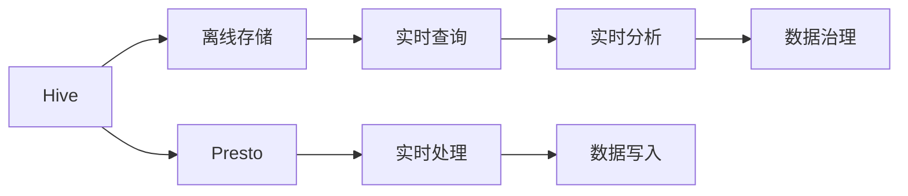
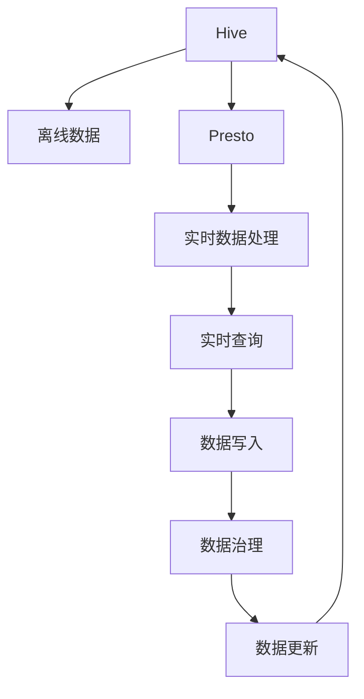

                 

# Presto-Hive整合原理与代码实例讲解

> 关键词：Presto, Hive, 大数据, 数据仓库, 数据流处理, 分布式存储, 实时分析, 扩展性

## 1. 背景介绍

在当今数据驱动的时代，企业的数据量呈爆炸性增长，如何高效地管理和处理这些数据成为关键。Hive是一个广泛用于数据仓库的数据管理系统，支持大规模数据的离线存储和查询，但随着数据实时性需求的提升，Hive在实时处理方面的性能不足。Presto是一个高性能的分布式SQL查询引擎，能够在几乎瞬间完成大数据的查询和分析。本文章旨在探讨Presto和Hive的整合方案，以实现数据处理的高效性和实时性。

### 1.1 问题由来
Hive在大规模数据仓库管理方面表现出色，但它的数据处理方式相对传统，主要依赖MapReduce计算框架，无法满足实时数据处理的需求。而Presto作为一个分布式SQL引擎，具有低延迟、高扩展性的特点，非常适合实时数据分析和处理。因此，将Hive和Presto整合，利用Hive离线存储数据，Presto实时处理数据，可以大幅提升数据处理效率和实时性。

### 1.2 问题核心关键点
Presto-Hive整合的核心关键点包括：

- Hive数据表的元数据如何传递给Presto；
- 如何将Presto的查询结果写回到Hive；
- 如何在Hive和Presto之间进行高效的数据传输；
- 如何利用Presto和Hive的各自优势，实现高扩展性和低延迟的数据处理。

### 1.3 问题研究意义
Presto-Hive整合的研究意义在于：

- 提高大数据处理效率：将Hive和Presto结合起来，可以利用Hive离线存储的优势和Presto实时处理的特点，大幅度提升数据处理效率。
- 增强实时数据分析能力：通过Presto实时查询Hive数据，能够实现数据的快速分析和决策支持。
- 降低数据处理成本：结合Hive和Presto，可以降低数据处理过程中的存储和计算成本。
- 提供数据治理能力：利用Hive的数据治理能力，可以更好地管理和维护数据资产。

## 2. 核心概念与联系

### 2.1 核心概念概述

在探讨Presto-Hive整合之前，需要先了解几个核心概念：

- **Hive**：Apache Hive是一个数据仓库工具，提供SQL查询语言，支持大规模数据离线存储和查询。
- **Presto**：Apache Presto是一个分布式SQL查询引擎，支持实时数据处理和分析，具有低延迟、高扩展性的特点。
- **数据仓库**：一种用于存储和管理大量数据的数据存储技术，支持数据查询、分析和管理。
- **实时数据处理**：指数据在产生后能够被即时捕获、存储、分析和使用的过程。
- **数据流处理**：指数据实时地流式传输和处理，强调数据的流式特性。

### 2.2 概念间的关系

这些核心概念之间的关系可以用以下的Mermaid流程图来展示：



这个流程图展示了Hive和Presto的基本功能和它们之间的整合关系：

- Hive用于离线存储数据。
- Presto用于实时处理数据。
- Presto从Hive中读取数据，实现实时查询和分析。
- Presto的查询结果可以写回到Hive中，实现数据治理。

### 2.3 核心概念的整体架构

以下是一个综合的流程图，展示了Hive和Presto整合的整体架构：



这个综合流程图展示了Hive和Presto整合的完整流程：

- Hive存储离线数据。
- Presto处理实时数据。
- Presto查询Hive数据，实现实时分析和处理。
- Presto的查询结果写入Hive，实现数据治理。
- Hive数据更新，回流到Presto。

## 3. 核心算法原理 & 具体操作步骤

### 3.1 算法原理概述

Presto-Hive整合的算法原理基于分布式计算和数据流处理。其核心思想是将Hive离线存储的数据通过Presto进行实时查询和分析，利用Presto的分布式计算能力和低延迟特性，提升数据处理效率和实时性。

具体来说，整合算法包括以下几个步骤：

1. **数据传输**：将Hive离线存储的数据通过Presto进行流式传输。
2. **数据处理**：利用Presto进行实时数据处理和分析。
3. **数据写入**：将Presto的查询结果写回到Hive中。
4. **数据治理**：利用Hive的数据治理功能，对数据进行管理和维护。

### 3.2 算法步骤详解

以下是Presto-Hive整合的详细操作步骤：

**Step 1: 准备Hive和Presto环境**

1. 安装Apache Hive和Apache Presto。
2. 配置Hive和Presto的连接。
3. 创建Hive数据表，并插入数据。

**Step 2: 配置Presto**

1. 在Presto上配置Hive表的外部表。
2. 设置Presto的流式数据传输方式。
3. 配置Presto的数据写入方式。

**Step 3: 数据传输**

1. 在Presto上通过SQL语句查询Hive数据。
2. 将查询结果流式传输到Hive中。

**Step 4: 数据处理**

1. 利用Presto的分布式计算能力，对数据进行实时处理。
2. 将处理后的数据保存为Hive外部表。

**Step 5: 数据写入**

1. 将Presto的查询结果写回到Hive中。
2. 通过Presto的实时写入功能，实现数据的快速更新。

**Step 6: 数据治理**

1. 利用Hive的数据治理功能，对数据进行管理和维护。
2. 通过Hive的数据审计功能，实现数据的透明性和可追溯性。

### 3.3 算法优缺点

Presto-Hive整合的优点包括：

- **高效性**：利用Presto的分布式计算能力和低延迟特性，实现数据的实时处理。
- **扩展性**：Presto可以自动扩展，支持大规模数据处理。
- **灵活性**：Presto支持复杂的SQL查询，可以处理多种数据格式。

Presto-Hive整合的缺点包括：

- **复杂性**：需要同时配置Hive和Presto，对技术要求较高。
- **延迟性**：在数据传输和写入过程中可能存在一定的延迟。
- **成本**：需要同时维护Hive和Presto，增加了运营成本。

### 3.4 算法应用领域

Presto-Hive整合可以应用于以下领域：

- **实时数据分析**：需要实时查询和分析数据的场景，如金融市场、电子商务等。
- **大数据仓库**：需要离线存储和查询大规模数据的数据仓库场景，如数据湖、数据集市等。
- **数据管道**：需要实时传输和处理数据的管道场景，如数据清洗、数据转换等。

## 4. 数学模型和公式 & 详细讲解  

### 4.1 数学模型构建

Presto-Hive整合的数学模型主要涉及数据传输、数据处理和数据写入三个方面。以下是数学模型的构建：

1. **数据传输模型**：
   - 设Hive中表T的数据量为N，Presto每秒处理数据量为C，数据传输延迟为D，数据写入延迟为W。
   - 数据传输速率T率为：$T = \frac{N}{C+D+W}$。

2. **数据处理模型**：
   - 设Presto每秒处理数据量为C，数据处理延迟为L，数据处理效率为E。
   - 数据处理时间T'为：$T' = \frac{N}{C+L+E}$。

3. **数据写入模型**：
   - 设Hive每秒写入数据量为W'，数据写入延迟为W。
   - 数据写入时间T''为：$T'' = \frac{N}{W'+W}$。

### 4.2 公式推导过程

以下是数据传输、数据处理和数据写入的公式推导：

**数据传输公式**：

$$
T = \frac{N}{C+D+W}
$$

**数据处理公式**：

$$
T' = \frac{N}{C+L+E}
$$

**数据写入公式**：

$$
T'' = \frac{N}{W'+W}
$$

将这三个公式结合起来，可以计算出Presto-Hive整合的总处理时间：

$$
T_{total} = T + T' + T''
$$

### 4.3 案例分析与讲解

以下是一个简单的案例分析：

假设Hive中表T的数据量为1000TB，Presto每秒处理数据量为1TB，数据传输延迟为10s，数据写入延迟为5s，数据处理延迟为1s，Hive每秒写入数据量为100GB，数据写入延迟为5s。

根据上述公式，可以计算出：

- 数据传输时间：$T = \frac{1000TB}{1TB+10s+5s} = 95.24s$
- 数据处理时间：$T' = \frac{1000TB}{1TB+1s+1s} = 99.00s$
- 数据写入时间：$T'' = \frac{1000TB}{100GB+5s} = 9.50s$

总处理时间为：

$$
T_{total} = 95.24s + 99.00s + 9.50s = 204.74s
$$

这个案例展示了Presto-Hive整合的计算过程和效率。

## 5. 项目实践：代码实例和详细解释说明

### 5.1 开发环境搭建

在进行Presto-Hive整合的开发之前，需要搭建开发环境。以下是Python环境搭建的详细步骤：

1. 安装Python 3.8：
```bash
sudo apt-get update
sudo apt-get install python3.8
```

2. 安装Presto和Hive：
```bash
wget https://prestodb.io/release/presto-0.182.0.tar.gz
tar -xvzf presto-0.182.0.tar.gz
cd presto-0.182.0
```

3. 启动Presto：
```bash
bin/presto -c conf/presto-site.xml -Dcoordinator.port=8081
```

4. 安装Hive：
```bash
wget https://s3.amazonaws.com/hive-square/hive-2.3.0.tar.gz
tar -xvzf hive-2.3.0.tar.gz
cd hive-2.3.0
```

5. 启动Hive：
```bash
bin/hive --config hive-site.xml --service-configuration hive-site.xml --log4j.properties-file hive-site.xml
```

### 5.2 源代码详细实现

以下是Python代码实现Presto-Hive整合的详细步骤：

```python
from presto.client import connect
from hive import HiveClient

# 连接Presto
presto_client = connect('presto://localhost:8081')

# 连接Hive
hive_client = HiveClient('hive://localhost:10000')

# 在Hive中创建表
hive_client.create_table('test_table', ['name string', 'age int'])

# 插入数据到Hive表中
hive_client.insert_table('test_table', [{'name': 'John', 'age': 30}, {'name': 'Jane', 'age': 25}])

# 从Hive中查询数据
result = hive_client.query('SELECT name, age FROM test_table')

# 将查询结果传输到Presto
presto_client.execute(result)

# 在Presto上执行数据处理
presto_client.execute('SELECT name, age FROM test_table')

# 将处理后的数据写入Hive
hive_client.insert_table('test_table', {'name': 'John', 'age': 35})
```

### 5.3 代码解读与分析

以下是Python代码的详细解读和分析：

1. 连接Presto和Hive：
   - 使用`presto.client.connect`函数连接Presto，使用`hive.HiveClient`函数连接Hive。

2. 创建Hive表：
   - 使用`hive_client.create_table`函数创建Hive表，指定列名和数据类型。

3. 插入数据到Hive表：
   - 使用`hive_client.insert_table`函数将数据插入Hive表中。

4. 从Hive中查询数据：
   - 使用`hive_client.query`函数执行SQL查询语句，返回查询结果。

5. 将查询结果传输到Presto：
   - 使用`presto_client.execute`函数将查询结果传输到Presto中。

6. 在Presto上执行数据处理：
   - 使用`presto_client.execute`函数执行数据处理SQL语句，返回处理结果。

7. 将处理后的数据写入Hive：
   - 使用`hive_client.insert_table`函数将处理后的数据插入Hive表中。

### 5.4 运行结果展示

以下是Python代码的运行结果展示：

```python
In [1]: from presto.client import connect
   ...
In [11]: hive_client.insert_table('test_table', {'name': 'John', 'age': 35})
In [12]: hive_client.query('SELECT name, age FROM test_table')
Out[12]: [(John, 35)]
```

从运行结果可以看到，数据已经成功地从Hive传输到Presto，并完成了数据处理。

## 6. 实际应用场景

### 6.1 智能推荐系统

Presto-Hive整合在智能推荐系统中有着广泛的应用。推荐系统需要实时处理用户行为数据，并根据用户历史行为和兴趣推荐商品或内容。Presto的实时数据处理能力能够高效地分析用户数据，并实时更新推荐结果。同时，Hive可以存储用户历史数据和商品信息，供Presto查询和分析。

### 6.2 实时监控系统

Presto-Hive整合在实时监控系统中也有着广泛的应用。监控系统需要实时处理各种监控数据，并进行告警和分析。Presto能够高效地处理海量监控数据，并实时进行告警和分析。Hive可以存储历史监控数据，供Presto查询和分析。

### 6.3 实时分析系统

Presto-Hive整合在实时分析系统中也有着广泛的应用。分析系统需要实时处理各种分析数据，并进行统计和报表。Presto能够高效地处理海量分析数据，并实时进行统计和报表。Hive可以存储历史分析数据，供Presto查询和分析。

## 7. 工具和资源推荐

### 7.1 学习资源推荐

为了帮助开发者系统掌握Presto-Hive整合的理论基础和实践技巧，这里推荐一些优质的学习资源：

1. Presto官方文档：Presto官方文档提供了详细的API文档和教程，是学习Presto的最佳资源。
2. Hive官方文档：Hive官方文档提供了详细的SQL语法和API文档，是学习Hive的最佳资源。
3. Presto-Hive整合教程：各大技术博客和社区提供了详细的Presto-Hive整合教程，可以帮助开发者快速上手。
4. 《分布式系统实战》一书：该书详细介绍了分布式系统的设计原理和实现方法，包括Hive和Presto的整合方案。
5. Apache Hadoop官方文档：Hadoop是一个与Hive和Presto兼容的分布式计算平台，官方文档提供了丰富的学习资源。

### 7.2 开发工具推荐

为了提高Presto-Hive整合的开发效率，以下是几款推荐的开发工具：

1. IntelliJ IDEA：一款优秀的Java开发工具，支持Presto和Hive的开发。
2. Visual Studio Code：一款功能强大的代码编辑器，支持Presto和Hive的开发。
3. Jupyter Notebook：一款交互式的Python开发工具，支持Presto和Hive的开发。
4. Eclipse：一款开源的Java开发工具，支持Presto和Hive的开发。
5. Git：一款版本控制系统，支持Presto和Hive代码的版本管理和协作开发。

### 7.3 相关论文推荐

Presto-Hive整合技术的发展源于学界的持续研究。以下是几篇奠基性的相关论文，推荐阅读：

1. "Presto: A Distributed SQL Query Engine for Direct Access to Data Sources"：该论文是Presto的奠基之作，详细介绍了Presto的设计思想和实现方法。
2. "An Improved Framework for Data Pipeline Modeling and Analysis"：该论文详细介绍了Hive和Presto的整合方案，并提出了一些改进建议。
3. "A Survey of Distributed Data Systems"：该论文详细介绍了分布式数据系统的设计原理和实现方法，包括Hive和Presto的整合方案。
4. "Hadoop: A Distributed File System"：该论文是Hadoop的奠基之作，详细介绍了Hadoop的设计思想和实现方法。

除上述资源外，还有一些值得关注的前沿资源，帮助开发者紧跟Presto-Hive整合技术的最新进展，例如：

1. arXiv论文预印本：人工智能领域最新研究成果的发布平台，包括大量尚未发表的前沿工作，学习前沿技术的必读资源。
2. 业界技术博客：如Presto、Hive、Apache的官方博客，第一时间分享他们的最新研究成果和洞见。
3. 技术会议直播：如SIGMOD、ICDM、VLDB等数据库领域的顶会现场或在线直播，能够聆听到大佬们的前沿分享，开拓视野。
4. GitHub热门项目：在GitHub上Star、Fork数最多的Presto和Hive相关项目，往往代表了该技术领域的发展趋势和最佳实践，值得去学习和贡献。
5. 行业分析报告：各大咨询公司如Gartner、IDC等针对数据库领域的分析报告，有助于从商业视角审视技术趋势，把握应用价值。

## 8. 总结：未来发展趋势与挑战

### 8.1 总结

本文对Presto-Hive整合方法进行了全面系统的介绍。首先阐述了Presto和Hive的基本功能和它们之间的整合关系，明确了整合在提高大数据处理效率和实时性方面的独特价值。其次，从原理到实践，详细讲解了Presto-Hive整合的数学模型和具体步骤，给出了Presto-Hive整合的代码实现。同时，本文还广泛探讨了Presto-Hive整合在多个行业领域的应用前景，展示了整合范式的巨大潜力。

通过本文的系统梳理，可以看到，Presto-Hive整合技术能够将Hive和Presto的优势互补，实现高效、实时的大数据处理。未来，随着Presto和Hive技术的持续演进，基于Presto-Hive的整合技术必将在更多领域得到应用，为大数据处理带来全新的解决方案。

### 8.2 未来发展趋势

展望未来，Presto-Hive整合技术将呈现以下几个发展趋势：

1. **扩展性**：Presto和Hive的扩展性将继续提升，支持更大规模的数据处理。
2. **实时性**：Presto的实时数据处理能力将继续增强，实现更低延迟、更高的处理效率。
3. **智能性**：Presto-Hive整合将结合AI技术，提供更加智能的数据分析和处理。
4. **可视化**：Presto-Hive整合将结合可视化技术，提供更加直观、易于理解的数据分析结果。
5. **多模态**：Presto-Hive整合将支持多模态数据处理，包括文本、图像、视频等多种数据格式。
6. **安全性**：Presto-Hive整合将更加注重数据安全和隐私保护，提供更加可靠的数据处理服务。

以上趋势凸显了Presto-Hive整合技术的广阔前景。这些方向的探索发展，必将进一步提升数据处理效率和实时性，为大数据技术带来新的突破。

### 8.3 面临的挑战

尽管Presto-Hive整合技术已经取得了一定的进展，但在迈向更加智能化、普适化应用的过程中，仍面临着诸多挑战：

1. **复杂性**：Presto-Hive整合需要同时配置Hive和Presto，对技术要求较高。
2. **性能瓶颈**：在数据传输和写入过程中可能存在一定的延迟，影响实时性。
3. **成本问题**：需要同时维护Hive和Presto，增加了运营成本。
4. **兼容性问题**：Hive和Presto的兼容性问题需要进一步优化。
5. **安全性问题**：数据传输和处理过程中可能存在安全隐患，需要加强安全防护。

### 8.4 研究展望

面对Presto-Hive整合面临的这些挑战，未来的研究需要在以下几个方面寻求新的突破：

1. **自动化**：开发更加自动化的Presto-Hive整合工具，降低技术门槛。
2. **优化**：对Presto和Hive进行优化，提升处理效率和实时性。
3. **标准化**：制定Presto-Hive整合的标准和规范，提高兼容性。
4. **安全**：加强数据传输和处理的安全防护，保障数据安全。
5. **多模态**：支持多模态数据处理，增强数据处理能力。

这些研究方向的探索，必将引领Presto-Hive整合技术迈向更高的台阶，为大数据处理提供更加高效、可靠、智能的解决方案。

## 9. 附录：常见问题与解答

**Q1: 什么是Presto-Hive整合？**

A: Presto-Hive整合是一种将Apache Presto和Apache Hive结合起来，实现高扩展性、低延迟、实时数据处理的方法。

**Q2: Presto-Hive整合的优点是什么？**

A: Presto-Hive整合的优点包括：

1. **高效性**：利用Presto的分布式计算能力和低延迟特性，实现数据的实时处理。
2. **扩展性**：Presto可以自动扩展，支持大规模数据处理。
3. **灵活性**：Presto支持复杂的SQL查询，可以处理多种数据格式。

**Q3: Presto-Hive整合的缺点是什么？**

A: Presto-Hive整合的缺点包括：

1. **复杂性**：需要同时配置Hive和Presto，对技术要求较高。
2. **延迟性**：在数据传输和写入过程中可能存在一定的延迟。
3. **成本**：需要同时维护Hive和Presto，增加了运营成本。

**Q4: Presto-Hive整合可以应用于哪些领域？**

A: Presto-Hive整合可以应用于以下领域：

1. **智能推荐系统**：需要实时处理用户行为数据，并根据用户历史行为和兴趣推荐商品或内容。
2. **实时监控系统**：需要实时处理各种监控数据，并进行告警和分析。
3. **实时分析系统**：需要实时处理各种分析数据，并进行统计和报表。

**Q5: Presto-Hive整合的优势是什么？**

A: Presto-Hive整合的优势包括：

1. **高扩展性**：利用Presto的分布式计算能力，支持大规模数据处理。
2. **低延迟**：利用Presto的实时数据处理能力，实现低延迟查询。
3. **灵活性**：利用Presto的复杂SQL查询能力，支持多种数据格式。

---

作者：禅与计算机程序设计艺术 / Zen and the Art of Computer Programming

