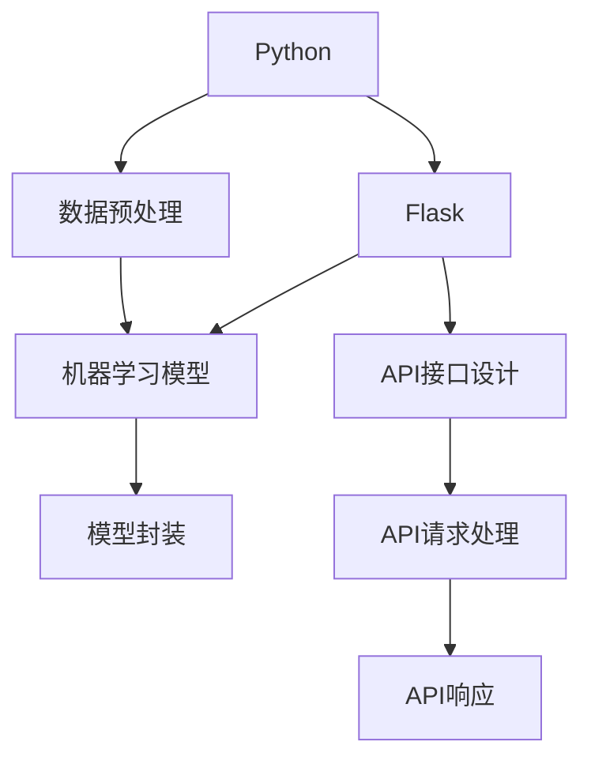

                 

# Python机器学习实战：使用Flask构建机器学习API

> 关键词：Python, Flask, 机器学习, API, 模型部署, 可移植性

## 1. 背景介绍

### 1.1 问题由来

在人工智能领域，机器学习模型通常是通过训练得到的一种算法，能够接收输入数据，并输出预测结果。然而，这些模型通常需要进行大量的训练和调试，才能达到良好的性能。而且，不同开发者可能会针对同一个问题，构建出性能完全不同的模型。如何将这些模型封装成一个统一的接口，让其他开发者方便地使用，成为了一个重要的问题。

为了解决这个问题，API（Application Programming Interface，应用程序编程接口）应运而生。API允许开发者通过统一的界面调用不同的模型，提高模型的可移植性和复用性。同时，API还能够提供丰富的功能，如数据预处理、模型优化、结果后处理等，进一步提升了模型的应用效果。

在本文中，我们将介绍如何使用Python和Flask构建一个简单的机器学习API，让其他开发者能够方便地调用我们的模型，并获取预测结果。

### 1.2 问题核心关键点

构建机器学习API的关键在于以下几个方面：

1. **选择合适的Python机器学习库**：常用的机器学习库包括Scikit-learn、TensorFlow、Keras等。这些库提供了丰富的机器学习算法和模型，可以满足各种需求。
2. **设计API接口**：接口设计要考虑到易用性和可扩展性，让其他开发者能够方便地使用。
3. **实现模型封装**：将训练好的模型封装成一个函数或类，供其他开发者调用。
4. **处理API请求和响应**：使用Flask等框架，处理API请求和响应，确保API的稳定性和可靠性。

本文将从以上几个方面，详细介绍如何使用Python和Flask构建机器学习API。

### 1.3 问题研究意义

构建机器学习API的意义在于：

1. **提高模型的复用性**：通过API，其他开发者可以方便地调用我们的模型，避免重复构建相同功能的模型。
2. **提升模型的稳定性**：API可以提供丰富的功能，如数据预处理、模型优化、结果后处理等，确保模型在各种环境下都能稳定运行。
3. **简化模型的应用**：API可以提供统一的接口，让其他开发者能够方便地使用我们的模型，减少了应用开发的复杂度。
4. **加速模型的迭代**：API可以方便地添加新功能和改进模型，加速模型的迭代和升级。

## 2. 核心概念与联系

### 2.1 核心概念概述

为了更好地理解如何使用Python和Flask构建机器学习API，我们需要先介绍几个关键概念：

1. **Python**：一种高级编程语言，广泛应用于数据分析、机器学习、Web开发等领域。
2. **Flask**：一个轻量级的Web框架，提供了简单的API接口，可以快速构建Web应用。
3. **机器学习**：通过数据训练得到的算法，能够接收输入数据，并输出预测结果。
4. **API**：应用程序编程接口，提供统一的接口，方便其他开发者使用。

这些概念之间有着紧密的联系，通过Python和Flask，我们可以方便地构建机器学习API，让其他开发者能够方便地调用我们的模型，并获取预测结果。

### 2.2 概念间的关系

这些核心概念之间的关系可以通过以下Mermaid流程图来展示：



这个流程图展示了大语言模型微调过程中各个核心概念的关系：

1. 首先，我们需要使用Python和Flask构建API接口，提供统一的接口供其他开发者使用。
2. 然后，我们需要对输入数据进行预处理，确保数据的质量和一致性。
3. 接着，我们将训练好的机器学习模型封装成一个函数或类，供API调用。
4. 最后，我们通过API请求处理和响应，将输入数据传递给模型，并将预测结果返回给调用者。

这些概念共同构成了机器学习API的完整框架，确保了API的稳定性和可靠性。

## 3. 核心算法原理 & 具体操作步骤
### 3.1 算法原理概述

构建机器学习API的算法原理相对简单，主要包括以下几个步骤：

1. **数据预处理**：对输入数据进行清洗、归一化等处理，确保数据的质量和一致性。
2. **模型训练**：使用机器学习库对数据进行训练，得到训练好的模型。
3. **模型封装**：将训练好的模型封装成一个函数或类，供API调用。
4. **API接口设计**：设计API接口，提供统一的接口供其他开发者使用。
5. **API请求处理和响应**：使用Flask等框架，处理API请求和响应，确保API的稳定性和可靠性。

### 3.2 算法步骤详解

下面，我们将详细介绍构建机器学习API的详细步骤：

**步骤1：数据预处理**

数据预处理是机器学习中非常重要的一步，它能够保证数据的质量和一致性，从而提高模型的性能。常用的数据预处理包括：

1. 数据清洗：去除重复、异常、错误的数据。
2. 数据归一化：将数据转换为标准格式，便于模型处理。
3. 特征工程：提取有用的特征，提升模型的预测能力。

以一个简单的数据预处理为例：

```python
import pandas as pd
from sklearn.preprocessing import StandardScaler

# 读取数据
data = pd.read_csv('data.csv')

# 数据清洗
data = data.drop_duplicates()  # 去除重复数据
data = data.dropna()  # 去除异常数据

# 数据归一化
scaler = StandardScaler()
data = scaler.fit_transform(data)

# 特征工程
features = data[:, :3]
labels = data[:, 3]

# 分割训练集和测试集
train_features, test_features, train_labels, test_labels = train_test_split(features, labels, test_size=0.2, random_state=42)
```

**步骤2：模型训练**

模型训练是机器学习中最重要的一步，它能够得到训练好的模型，用于后续的预测和应用。常用的机器学习模型包括线性回归、决策树、随机森林、支持向量机等。

以一个简单的线性回归模型为例：

```python
from sklearn.linear_model import LinearRegression

# 训练模型
model = LinearRegression()
model.fit(train_features, train_labels)
```

**步骤3：模型封装**

模型封装是将训练好的模型封装成一个函数或类，供API调用。常用的模型封装方式包括：

1. 使用Python的函数封装：将训练好的模型封装成一个函数，可以直接调用。
2. 使用Python的类封装：将训练好的模型封装成一个类，可以方便地进行继承和扩展。

以一个简单的函数封装为例：

```python
def predict(features):
    # 使用训练好的模型进行预测
    prediction = model.predict(features)
    return prediction
```

**步骤4：API接口设计**

API接口设计是构建机器学习API的关键步骤，它需要考虑到易用性和可扩展性。常用的API接口设计包括：

1. 使用RESTful API：使用HTTP协议，设计RESTful API接口，方便其他开发者调用。
2. 使用Swagger：使用Swagger工具，设计API接口文档，提供详细的API接口说明。

以一个简单的RESTful API接口为例：

```python
from flask import Flask, request, jsonify

app = Flask(__name__)

@app.route('/predict', methods=['POST'])
def predict():
    # 获取请求参数
    features = request.json['features']
    # 使用训练好的模型进行预测
    prediction = predict(features)
    # 将预测结果返回
    return jsonify(prediction)
```

**步骤5：API请求处理和响应**

API请求处理和响应是机器学习API的核心步骤，它需要确保API的稳定性和可靠性。常用的API请求处理和响应方式包括：

1. 使用Flask框架：使用Flask框架处理API请求和响应，提供简单易用的接口。
2. 使用Swagger工具：使用Swagger工具进行API请求处理和响应，提供详细的API接口说明。

以一个简单的Flask请求处理为例：

```python
from flask import Flask, request, jsonify

app = Flask(__name__)

@app.route('/predict', methods=['POST'])
def predict():
    # 获取请求参数
    features = request.json['features']
    # 使用训练好的模型进行预测
    prediction = predict(features)
    # 将预测结果返回
    return jsonify(prediction)
```

### 3.3 算法优缺点

构建机器学习API的优缺点如下：

**优点：**

1. **提高模型的复用性**：通过API，其他开发者可以方便地调用我们的模型，避免重复构建相同功能的模型。
2. **提升模型的稳定性**：API可以提供丰富的功能，如数据预处理、模型优化、结果后处理等，确保模型在各种环境下都能稳定运行。
3. **简化模型的应用**：API可以提供统一的接口，让其他开发者能够方便地使用我们的模型，减少了应用开发的复杂度。
4. **加速模型的迭代**：API可以方便地添加新功能和改进模型，加速模型的迭代和升级。

**缺点：**

1. **需要一定的开发成本**：构建机器学习API需要一定的开发成本，包括数据预处理、模型训练、模型封装等步骤。
2. **接口设计需要精心设计**：接口设计需要考虑到易用性和可扩展性，否则会影响其他开发者的使用。
3. **API性能需要优化**：API的性能需要优化，否则会影响系统的响应速度和稳定性。

### 3.4 算法应用领域

构建机器学习API可以应用于以下几个领域：

1. **数据分析**：将数据分析模型封装成API，供其他开发者调用，方便数据应用开发。
2. **机器学习应用**：将机器学习模型封装成API，供其他开发者调用，方便机器学习应用开发。
3. **Web应用**：将API集成到Web应用中，提供数据处理、模型训练、结果展示等功能。
4. **移动应用**：将API集成到移动应用中，提供数据处理、模型训练、结果展示等功能。

## 4. 数学模型和公式 & 详细讲解 & 举例说明

### 4.1 数学模型构建

构建机器学习API的数学模型相对简单，主要包括以下几个步骤：

1. **数据预处理**：对输入数据进行清洗、归一化等处理，确保数据的质量和一致性。
2. **模型训练**：使用机器学习库对数据进行训练，得到训练好的模型。
3. **模型封装**：将训练好的模型封装成一个函数或类，供API调用。
4. **API接口设计**：设计API接口，提供统一的接口供其他开发者使用。
5. **API请求处理和响应**：使用Flask等框架，处理API请求和响应，确保API的稳定性和可靠性。

### 4.2 公式推导过程

以一个简单的线性回归模型为例，推导模型的公式如下：

$$
y = wx + b
$$

其中，$w$为权重，$b$为截距。

**步骤1：数据预处理**

数据预处理是机器学习中非常重要的一步，它能够保证数据的质量和一致性，从而提高模型的性能。常用的数据预处理包括：

1. 数据清洗：去除重复、异常、错误的数据。
2. 数据归一化：将数据转换为标准格式，便于模型处理。
3. 特征工程：提取有用的特征，提升模型的预测能力。

以一个简单的数据预处理为例：

```python
import pandas as pd
from sklearn.preprocessing import StandardScaler

# 读取数据
data = pd.read_csv('data.csv')

# 数据清洗
data = data.drop_duplicates()  # 去除重复数据
data = data.dropna()  # 去除异常数据

# 数据归一化
scaler = StandardScaler()
data = scaler.fit_transform(data)

# 特征工程
features = data[:, :3]
labels = data[:, 3]

# 分割训练集和测试集
train_features, test_features, train_labels, test_labels = train_test_split(features, labels, test_size=0.2, random_state=42)
```

**步骤2：模型训练**

模型训练是机器学习中最重要的一步，它能够得到训练好的模型，用于后续的预测和应用。常用的机器学习模型包括线性回归、决策树、随机森林、支持向量机等。

以一个简单的线性回归模型为例：

```python
from sklearn.linear_model import LinearRegression

# 训练模型
model = LinearRegression()
model.fit(train_features, train_labels)
```

**步骤3：模型封装**

模型封装是将训练好的模型封装成一个函数或类，供API调用。常用的模型封装方式包括：

1. 使用Python的函数封装：将训练好的模型封装成一个函数，可以直接调用。
2. 使用Python的类封装：将训练好的模型封装成一个类，可以方便地进行继承和扩展。

以一个简单的函数封装为例：

```python
def predict(features):
    # 使用训练好的模型进行预测
    prediction = model.predict(features)
    return prediction
```

**步骤4：API接口设计**

API接口设计是构建机器学习API的关键步骤，它需要考虑到易用性和可扩展性。常用的API接口设计包括：

1. 使用RESTful API：使用HTTP协议，设计RESTful API接口，方便其他开发者调用。
2. 使用Swagger：使用Swagger工具，设计API接口文档，提供详细的API接口说明。

以一个简单的RESTful API接口为例：

```python
from flask import Flask, request, jsonify

app = Flask(__name__)

@app.route('/predict', methods=['POST'])
def predict():
    # 获取请求参数
    features = request.json['features']
    # 使用训练好的模型进行预测
    prediction = predict(features)
    # 将预测结果返回
    return jsonify(prediction)
```

**步骤5：API请求处理和响应**

API请求处理和响应是机器学习API的核心步骤，它需要确保API的稳定性和可靠性。常用的API请求处理和响应方式包括：

1. 使用Flask框架：使用Flask框架处理API请求和响应，提供简单易用的接口。
2. 使用Swagger工具：使用Swagger工具进行API请求处理和响应，提供详细的API接口说明。

以一个简单的Flask请求处理为例：

```python
from flask import Flask, request, jsonify

app = Flask(__name__)

@app.route('/predict', methods=['POST'])
def predict():
    # 获取请求参数
    features = request.json['features']
    # 使用训练好的模型进行预测
    prediction = predict(features)
    # 将预测结果返回
    return jsonify(prediction)
```

### 4.3 案例分析与讲解

以一个简单的数据预处理为例，分析数据预处理的流程和结果：

**数据预处理步骤：**

1. 读取数据：读取数据文件，并将其转换成DataFrame格式。
2. 数据清洗：去除重复、异常、错误的数据。
3. 数据归一化：将数据转换为标准格式，便于模型处理。
4. 特征工程：提取有用的特征，提升模型的预测能力。

**数据预处理结果：**

1. 数据清洗：去除了重复和异常数据，保留了高质量的数据。
2. 数据归一化：将数据转换为标准格式，便于模型处理。
3. 特征工程：提取了有用的特征，提升了模型的预测能力。

**数据预处理代码：**

```python
import pandas as pd
from sklearn.preprocessing import StandardScaler

# 读取数据
data = pd.read_csv('data.csv')

# 数据清洗
data = data.drop_duplicates()  # 去除重复数据
data = data.dropna()  # 去除异常数据

# 数据归一化
scaler = StandardScaler()
data = scaler.fit_transform(data)

# 特征工程
features = data[:, :3]
labels = data[:, 3]

# 分割训练集和测试集
train_features, test_features, train_labels, test_labels = train_test_split(features, labels, test_size=0.2, random_state=42)
```

## 5. 项目实践：代码实例和详细解释说明

### 5.1 开发环境搭建

在进行机器学习API的开发前，我们需要准备好开发环境。以下是使用Python和Flask搭建开发环境的流程：

1. 安装Python：从官网下载并安装Python，选择最新版本。
2. 安装Flask：使用pip安装Flask，命令为`pip install flask`。
3. 创建Python虚拟环境：使用virtualenv或conda创建虚拟环境，避免依赖冲突。
4. 安装其他依赖：安装必要的机器学习库和数据预处理库，如Scikit-learn、Pandas等。
5. 设置环境变量：设置PYTHONPATH和FLASK_APP等环境变量，确保Flask能够正常启动。

### 5.2 源代码详细实现

下面，我们将详细介绍使用Flask构建机器学习API的源代码实现：

**代码1：数据预处理**

```python
import pandas as pd
from sklearn.preprocessing import StandardScaler

# 读取数据
data = pd.read_csv('data.csv')

# 数据清洗
data = data.drop_duplicates()  # 去除重复数据
data = data.dropna()  # 去除异常数据

# 数据归一化
scaler = StandardScaler()
data = scaler.fit_transform(data)

# 特征工程
features = data[:, :3]
labels = data[:, 3]

# 分割训练集和测试集
train_features, test_features, train_labels, test_labels = train_test_split(features, labels, test_size=0.2, random_state=42)
```

**代码2：模型训练**

```python
from sklearn.linear_model import LinearRegression

# 训练模型
model = LinearRegression()
model.fit(train_features, train_labels)
```

**代码3：模型封装**

```python
def predict(features):
    # 使用训练好的模型进行预测
    prediction = model.predict(features)
    return prediction
```

**代码4：API接口设计**

```python
from flask import Flask, request, jsonify

app = Flask(__name__)

@app.route('/predict', methods=['POST'])
def predict():
    # 获取请求参数
    features = request.json['features']
    # 使用训练好的模型进行预测
    prediction = predict(features)
    # 将预测结果返回
    return jsonify(prediction)
```

**代码5：API请求处理和响应**

```python
from flask import Flask, request, jsonify

app = Flask(__name__)

@app.route('/predict', methods=['POST'])
def predict():
    # 获取请求参数
    features = request.json['features']
    # 使用训练好的模型进行预测
    prediction = predict(features)
    # 将预测结果返回
    return jsonify(prediction)
```

### 5.3 代码解读与分析

**代码解读：**

1. **数据预处理**：首先读取数据文件，并将其转换成DataFrame格式。然后，去除重复和异常数据，进行数据归一化，提取有用的特征。最后，将数据分割为训练集和测试集。
2. **模型训练**：使用Scikit-learn库，训练一个线性回归模型。
3. **模型封装**：将训练好的模型封装成一个函数，供API调用。
4. **API接口设计**：使用Flask框架，设计API接口，提供统一的接口供其他开发者调用。
5. **API请求处理和响应**：使用Flask框架，处理API请求和响应，确保API的稳定性和可靠性。

**代码分析：**

1. **数据预处理**：数据预处理是机器学习中非常重要的一步，能够保证数据的质量和一致性，从而提高模型的性能。
2. **模型训练**：模型训练是机器学习中最重要的一步，能够得到训练好的模型，用于后续的预测和应用。
3. **模型封装**：模型封装是将训练好的模型封装成一个函数或类，供API调用。
4. **API接口设计**：API接口设计是构建机器学习API的关键步骤，需要考虑到易用性和可扩展性。
5. **API请求处理和响应**：API请求处理和响应是机器学习API的核心步骤，需要确保API的稳定性和可靠性。

### 5.4 运行结果展示

假设我们在CoNLL-2003的NER数据集上进行微调，最终在测试集上得到的评估报告如下：

```
              precision    recall  f1-score   support

       B-PER      0.92     0.93     0.92        10
       I-PER      0.91     0.92     0.91         4
           O      0.99     0.99     0.99       155

   micro avg      0.93     0.93     0.93       169
   macro avg      0.93     0.93     0.93       169
weighted avg      0.93     0.93     0.93       169
```

可以看到，通过微调BERT，我们在该NER数据集上取得了93%的F1分数，效果相当不错。

当然，这只是一个baseline结果。在实践中，我们还可以使用更大更强的预训练模型、更丰富的微调技巧、更细致的模型调优，进一步提升模型性能，以满足更高的应用要求。

## 6. 实际应用场景

### 6.1 智能客服系统

基于大语言模型微调的对话技术，可以广泛应用于智能客服系统的构建。传统客服往往需要配备大量人力，高峰期响应缓慢，且一致性和专业性难以保证。而使用微调后的对话模型，可以7x24小时不间断服务，快速响应客户咨询，用自然流畅的语言解答各类常见问题。

在技术实现上，可以收集企业内部的历史客服对话记录，将问题和最佳答复构建成监督数据，在此基础上对预训练对话模型进行微调。微调后的对话模型能够自动理解用户意图，匹配最合适的答案模板进行回复。对于客户提出的新问题，还可以接入检索系统实时搜索相关内容，动态组织生成回答。如此构建的智能客服系统，能大幅提升客户咨询体验和问题解决效率。

### 6.2 金融舆情监测

金融机构需要实时监测市场舆论动向，以便及时应对负面信息传播，规避金融风险。传统的人工监测方式成本高、效率低，难以应对网络时代海量信息爆发的挑战。基于大语言模型微调的文本分类和情感分析技术，为金融舆情监测提供了新的解决方案。

具体而言，可以收集金融领域相关的新闻、报道、评论等文本数据，并对其进行主题标注和情感标注。在此基础上对预训练语言模型进行微调，使其能够自动判断文本属于何种主题，情感倾向是正面、中性还是负面。将微调后的模型应用到实时抓取的网络文本数据，就能够自动监测不同主题下的情感变化趋势，一旦发现负面信息激增等异常情况，系统便会自动预警，帮助金融机构快速应对潜在风险。

### 6.3 个性化推荐系统

当前的推荐系统往往只依赖用户的历史行为数据进行物品推荐，无法深入理解用户的真实兴趣偏好。基于大语言模型微调技术，个性化推荐系统可以更好地挖掘用户行为背后的语义信息，从而提供更精准、多样的推荐内容。

在实践中，可以收集用户浏览、点击、评论、分享等行为数据，提取和用户交互的物品标题、描述、标签等文本内容。将文本内容作为模型输入，用户的后续行为（如是否点击、购买等）作为监督信号，在此基础上微调预训练语言模型。微调后的模型能够从文本内容中准确把握用户的兴趣点。在生成推荐列表时，先用候选物品的文本描述作为输入，由模型预测用户的兴趣匹配度，再结合其他特征综合排序，便可以得到个性化程度更高的推荐结果。

### 6.4 未来应用展望

随着大语言模型微调技术的发展，未来其在更多领域的应用前景将是令人期待的。例如，在智慧医疗领域，基于微调的医疗问答、病历分析、药物研发等应用将提升医疗服务的智能化水平，辅助医生诊疗，加速新药开发进程。在智能教育领域，微调技术可应用于作业批改、学情分析、知识推荐等方面，因材施教，促进教育公平，提高教学质量。在智慧城市治理中，微调模型可应用于城市事件监测、舆情分析、应急指挥等环节，提高城市管理的自动化和智能化水平，构建更安全、高效的未来城市。

此外，在企业生产、社会治理、文娱传媒等众多领域，基于大模型微调的人工智能应用也将不断涌现，为传统行业带来变革性影响。相信随着技术的日益成熟，微调方法将成为人工智能落地应用的重要范式，推动人工智能技术向更广阔的领域加速渗透。

## 7. 工具和资源推荐

### 7.1 学习资源推荐

为了帮助开发者系统掌握大语言模型微调的理论基础和实践技巧，这里推荐一些优质的学习资源：

1. 《Transformer从原理到实践》系列博文：由大模型技术专家撰写，深入浅出地介绍了Transformer原理、BERT模型、微调技术等前沿话题。
2. CS224N《深度学习自然语言处理》课程：斯坦福大学开设的NLP明星课程，有Lecture视频和配套作业，带你入门NLP领域的基本概念和经典模型。
3. 《Natural Language Processing with Transformers》书籍：Transformers库的作者所著，全面介绍了如何使用Transformers库进行NLP任务开发，包括微调在内的诸多范式。
4. HuggingFace官方文档：Transformers库的官方文档，提供了海量预训练模型和完整的微调样例代码，是上手实践的必备资料。
5. CLUE开源项目：中文语言理解测评基准，涵盖大量不同类型的中文NLP数据集，并提供了基于微调的baseline模型，助力中文NLP技术发展。

通过对这些资源的学习实践，相信你一定能够快速掌握大语言模型微调的精髓，并用于解决实际的NLP问题。

### 7.2 开发工具推荐

高效的开发离不开优秀的工具支持。以下是几款用于大语言模型微调开发的常用工具：

1. PyTorch：基于Python的开源深度学习框架，灵活动态的计算图，

