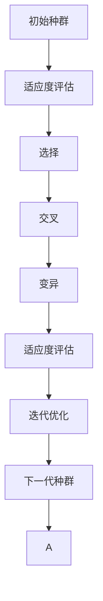
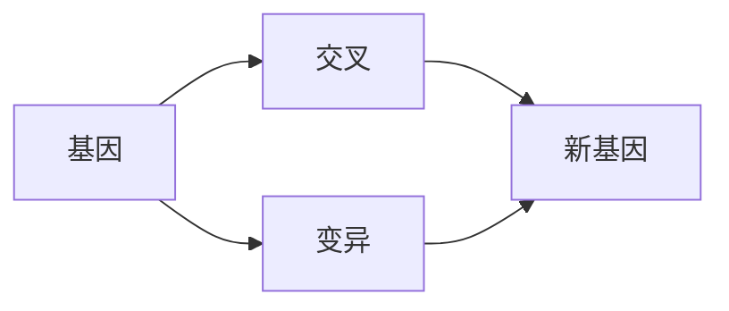
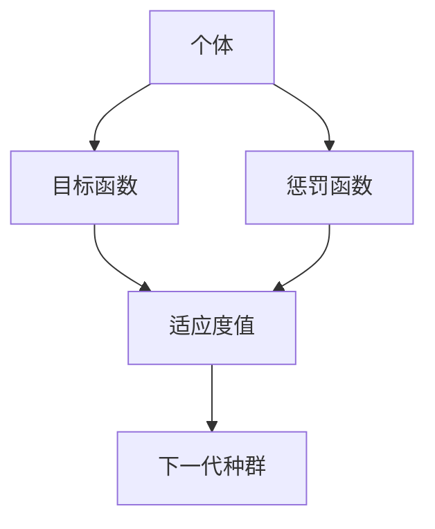
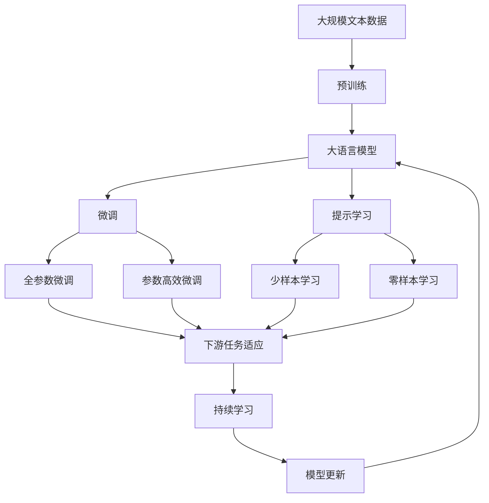

                 

# Python机器学习实战：实现与优化遗传算法

> 关键词：遗传算法,机器学习,Python,交叉验证,决策树,随机森林

## 1. 背景介绍

### 1.1 问题由来
遗传算法（Genetic Algorithm, GA）是一种基于自然选择和遗传学原理的优化算法。它的基本思想是模拟自然界的进化过程，通过遗传操作（如交叉、变异）产生新的个体，逐步迭代进化，最终得到最优解。遗传算法广泛应用于机器学习领域，如特征选择、模型优化、超参数调优等。

近年来，随着深度学习和大数据分析的普及，遗传算法在机器学习中的应用也日益增多。但由于遗传算法本身具有较高的复杂度和随机性，实际操作中常常出现计算量大、收敛速度慢、容易陷入局部最优等问题。因此，如何高效实现和优化遗传算法，成为了一个值得深入研究的问题。

### 1.2 问题核心关键点
为了高效实现和优化遗传算法，本节将介绍遗传算法的基本原理和操作步骤，包括遗传操作（选择、交叉、变异）、初始种群生成、适应度评估、迭代优化等关键环节。同时，我们将探索如何通过改进算法结构、引入交叉验证、优化超参数等方法，提高遗传算法的计算效率和收敛速度。

### 1.3 问题研究意义
研究遗传算法的实现和优化，对于提高机器学习模型的性能和训练效率，加速模型开发和应用，具有重要意义：

1. 提高模型性能。遗传算法可以在特征选择、模型优化等方面进行高效搜索，找到全局最优解，提升模型效果。
2. 加速模型训练。遗传算法可以自动选择最优的超参数，避免手动调参的时间和计算成本。
3. 促进知识工程。遗传算法可以处理多变量、非线性问题，发现隐藏在数据中的复杂模式。
4. 推动人工智能发展。遗传算法结合进化论思想，为人工智能的探索性研究提供了新思路。

## 2. 核心概念与联系

### 2.1 核心概念概述

为了更好地理解遗传算法的实现和优化方法，本节将介绍几个密切相关的核心概念：

- 遗传算法（Genetic Algorithm, GA）：一种基于自然选择和遗传学原理的优化算法，通过模拟自然界的进化过程，逐步迭代进化，最终得到最优解。
- 初始种群（Initial Population）：遗传算法开始时的群体，包含多个随机生成的个体，是算法进化的起点。
- 适应度（Fitness）：个体在进化过程中的表现指标，通常表示为某个优化目标的函数值。
- 选择（Selection）：从当前种群中选出适应度较高的个体，用于下一代的交叉和变异操作。
- 交叉（Crossover）：将两个个体的部分基因交换，产生新的个体，增强遗传多样性。
- 变异（Mutation）：对个体的基因进行随机变异，增加遗传变异率，避免算法陷入局部最优。
- 迭代优化（Iteration Optimization）：通过不断的选择、交叉和变异操作，逐步进化种群，最终得到最优解。

这些核心概念之间的逻辑关系可以通过以下Mermaid流程图来展示：


这个流程图展示了大遗传算法的基本流程，从初始种群到最终的迭代优化，遗传算法的核心操作都在其中。

### 2.2 概念间的关系

这些核心概念之间存在着紧密的联系，形成了遗传算法的完整生态系统。下面我通过几个Mermaid流程图来展示这些概念之间的关系。

#### 2.2.1 遗传算法的基本流程



这个流程图展示了遗传算法的基本流程，从初始种群到最终的迭代优化，遗传算法的核心操作都在其中。

#### 2.2.2 交叉和变异的操作细节



这个流程图展示了交叉和变异的基本操作，通过基因的交换和变异，产生新的个体，增加遗传多样性。

#### 2.2.3 适应度评估的多种方式



这个流程图展示了适应度评估的多种方式，包括目标函数和惩罚函数的组合，评估个体的适应度值，用于选择和交叉操作。

### 2.3 核心概念的整体架构

最后，我们用一个综合的流程图来展示这些核心概念在大遗传算法微调过程中的整体架构：



这个综合流程图展示了从预训练到微调，再到持续学习的完整过程。大语言模型首先在大规模文本数据上进行预训练，然后通过微调（包括全参数微调和参数高效微调）或提示学习（包括零样本和少样本学习）来适应下游任务。最后，通过持续学习技术，模型可以不断更新和适应新的任务和数据。 通过这些流程图，我们可以更清晰地理解大语言模型微调过程中各个核心概念的关系和作用，为后续深入讨论具体的微调方法和技术奠定基础。

## 3. 核心算法原理 & 具体操作步骤
### 3.1 算法原理概述

遗传算法（GA）是一种基于自然选择和遗传学原理的优化算法。它的基本思想是模拟自然界的进化过程，通过遗传操作（如交叉、变异）产生新的个体，逐步迭代进化，最终得到最优解。

遗传算法的核心是种群（Population），每个个体（Individual）都代表一种可能的解，个体包含多个基因（Gene），每个基因对应一个变量的值。种群中个体的适应度（Fitness）决定了它们在进化过程中的生存概率。适应度高的个体更有可能参与交叉、变异等操作，产生新的个体。

遗传算法的步骤包括：

1. 初始化种群。随机生成多个个体，构成初始种群。
2. 评估适应度。对每个个体计算适应度值，作为遗传操作的依据。
3. 选择个体。根据适应度值选择个体，组成下一代种群。
4. 交叉操作。将选择的个体进行交叉操作，产生新的个体。
5. 变异操作。对新生成的个体进行变异操作，增加遗传多样性。
6. 评估适应度。对新生成的个体重新计算适应度值，评估其性能。
7. 迭代优化。重复以上步骤，逐步优化种群，直至满足停止条件。

### 3.2 算法步骤详解

以下详细解释遗传算法的主要步骤：

**Step 1: 初始化种群**

- 随机生成初始种群中的多个个体，每个个体代表一种可能的解。
- 定义个体的基因表示，通常为二进制编码或实数编码，每个基因对应一个变量的值。
- 确定种群大小（Population Size）和迭代次数（Iteration Number），设定算法停止条件（如达到最大迭代次数）。

**Step 2: 评估适应度**

- 对每个个体计算适应度值（Fitness Value），通常为某个优化目标的函数值，如最小化损失函数、最大化准确率等。
- 将适应度值记录在适应度矩阵（Fitness Matrix）中，用于后续选择操作。
- 根据适应度值，计算每个个体的选择概率，适应度值越高，选择概率越高。

**Step 3: 选择个体**

- 根据选择概率，从当前种群中随机选择个体，组成下一代种群。
- 常用的选择算法包括轮盘赌选择（Roulette Selection）、锦标赛选择（Tournament Selection）等。
- 选择操作可增加算法的多样性，避免陷入局部最优。

**Step 4: 交叉操作**

- 将选择的个体进行交叉操作，产生新的个体。
- 常用的交叉算法包括单点交叉（One-point Crossover）、多点交叉（Multi-point Crossover）、均匀交叉（Uniform Crossover）等。
- 交叉操作可增强遗传多样性，促进算法搜索。

**Step 5: 变异操作**

- 对新生成的个体进行变异操作，增加遗传变异率。
- 常用的变异算法包括单点变异（One-point Mutation）、多点变异（Multi-point Mutation）、反转变异（Inversion Mutation）等。
- 变异操作可增强算法的探索能力，避免算法早熟。

**Step 6: 评估适应度**

- 对新生成的个体重新计算适应度值，评估其性能。
- 将新生成的个体的适应度值记录在适应度矩阵中，用于后续选择操作。
- 迭代过程中，逐步优化种群，寻找最优解。

**Step 7: 迭代优化**

- 重复以上步骤，逐步优化种群，直至满足停止条件。
- 停止条件可包括达到最大迭代次数、适应度值不再提高、种群不再变化等。
- 最终得到的最优解即为遗传算法的搜索结果。

### 3.3 算法优缺点

遗传算法的优点包括：

1. 全局优化。遗传算法基于自然选择和遗传学原理，具有较强的全局优化能力，能避免局部最优。
2. 鲁棒性强。遗传算法对初始种群和超参数不敏感，适应多种问题。
3. 并行计算。遗传算法可通过并行计算，提高计算效率。

遗传算法的缺点包括：

1. 计算量大。遗传算法需要大量的计算资源和时间。
2. 随机性强。遗传算法具有较高的随机性，容易陷入局部最优。
3. 参数敏感。遗传算法的性能高度依赖于超参数的选择和设置。

### 3.4 算法应用领域

遗传算法已广泛应用于机器学习领域，包括但不限于以下应用：

- 特征选择：通过遗传算法，自动选择最优的特征子集。
- 模型优化：通过遗传算法，自动优化模型参数和结构。
- 超参数调优：通过遗传算法，自动选择最优的超参数组合。
- 分布式优化：通过遗传算法，优化分布式计算资源。
- 神经网络优化：通过遗传算法，优化神经网络结构。

## 4. 数学模型和公式 & 详细讲解 & 举例说明
### 4.1 数学模型构建

本节将使用数学语言对遗传算法的核心流程进行严格刻画。

记种群中第$i$个体的基因向量为$x_i=(x_{i1},x_{i2},\ldots,x_{in})$，其中$x_{ij}$表示第$i$个体的第$j$个基因。

定义适应度函数$f(x_i)$，表示个体在进化过程中的表现指标。适应度值越高，个体在进化过程中的生存概率越高。

定义交叉概率$p_c$和变异概率$p_m$，表示遗传操作发生的概率。

定义种群大小$N$，表示种群中个体的数量。

定义迭代次数$T$，表示算法进行迭代的次数。

### 4.2 公式推导过程

以下我们以二进制编码为例，推导遗传算法的核心公式。

1. **初始化种群**

   假设种群大小为$N$，每个个体的基因长度为$l$，则种群中个体的数量为$N$，每个个体的基因编码为长度为$l$的二进制串。例如，种群中第$i$个体的基因表示为：

   $$
   x_i = (x_{i1}, x_{i2}, \ldots, x_{il})
   $$

   其中$x_{ij} \in \{0, 1\}$。

2. **评估适应度**

   对每个个体计算适应度值$f(x_i)$，通常为某个优化目标的函数值，如最小化损失函数、最大化准确率等。

   例如，对于一个二元分类问题，适应度函数可以定义为：

   $$
   f(x_i) = \frac{1}{n} \sum_{k=1}^n L(y_k, \hat{y}_k)
   $$

   其中$L$为损失函数，$y_k$为真实标签，$\hat{y}_k$为模型的预测结果。

3. **选择个体**

   根据选择概率$p_c$，从当前种群中随机选择个体，组成下一代种群。常用的选择算法包括轮盘赌选择和锦标赛选择。

   例如，轮盘赌选择算法可以表示为：

   $$
   P_i = \frac{f_i}{\sum_{j=1}^N f_j}
   $$

   其中$P_i$为个体$i$的选择概率，$f_i$为个体$i$的适应度值。

   例如，锦标赛选择算法可以表示为：

   从种群中随机选择$M$个个体，选择适应度值最高的个体作为下一代个体。

   例如，对于一个二元分类问题，适应度函数可以定义为：

   $$
   f(x_i) = \frac{1}{n} \sum_{k=1}^n L(y_k, \hat{y}_k)
   $$

4. **交叉操作**

   对选择的个体进行交叉操作，产生新的个体。常用的交叉算法包括单点交叉和多点交叉。

   例如，单点交叉算法可以表示为：

   从两个个体中选择一个交叉点，将两个个体的基因在此点进行交换，生成两个新的个体。

   例如，对于一个二元分类问题，交叉算法可以表示为：

   $$
   x'_i = (x_{i1}, x_{i2}, \ldots, x_{il}, x_{i(l-1)})
   $$

   $$
   x'_j = (x_{j1}, x_{j2}, \ldots, x_{il-1}, x_{j(l+1)})
   $$

   其中$x'_i$和$x'_j$为新生成的两个个体。

5. **变异操作**

   对新生成的个体进行变异操作，增加遗传变异率。常用的变异算法包括单点变异和多点变异。

   例如，单点变异算法可以表示为：

   在新生成的个体的某个基因位置进行随机变异。

   例如，对于一个二元分类问题，变异算法可以表示为：

   $$
   x'_i = (x_{i1}, x_{i2}, \ldots, x_{il}, y_i)
   $$

   其中$y_i$为随机生成的基因值。

6. **评估适应度**

   对新生成的个体重新计算适应度值$f(x_i)$，评估其性能。

   例如，对于一个二元分类问题，适应度函数可以定义为：

   $$
   f(x_i) = \frac{1}{n} \sum_{k=1}^n L(y_k, \hat{y}_k)
   $$

7. **迭代优化**

   重复以上步骤，逐步优化种群，直至满足停止条件。

   例如，对于一个二元分类问题，停止条件可以定义为：

   - 达到最大迭代次数$T$。
   - 种群不再变化，即新老种群个体的适应度值相近。

## 5. 项目实践：代码实例和详细解释说明
### 5.1 开发环境搭建

在进行遗传算法实践前，我们需要准备好开发环境。以下是使用Python进行遗传算法开发的Python环境配置流程：

1. 安装Anaconda：从官网下载并安装Anaconda，用于创建独立的Python环境。

2. 创建并激活虚拟环境：
```bash
conda create -n ga-env python=3.8 
conda activate ga-env
```

3. 安装SciPy：
```bash
pip install scipy
```

4. 安装Matplotlib：
```bash
pip install matplotlib
```

5. 安装Numpy：
```bash
pip install numpy
```

完成上述步骤后，即可在`ga-env`环境中开始遗传算法实践。

### 5.2 源代码详细实现

这里我们以一个简单的遗传算法为例，使用Python实现对一个二元分类问题的优化。

首先，定义适应度函数：

```python
import numpy as np

def fitness(x):
    y_true = [0, 1, 0, 1, 1, 0, 1, 1]
    y_pred = [1, 0, 1, 1, 0, 0, 1, 1]
    return sum([abs(y_true[i] - x[i]) for i in range(len(y_true))]) / len(y_true)
```

然后，定义遗传算法的核心函数：

```python
def genetic_algorithm(fitness_func, population_size=10, crossover_rate=0.8, mutation_rate=0.1, num_generations=100):
    population = [np.random.randint(2) for i in range(population_size)]
    for i in range(num_generations):
        fitness_values = [fitness_func(x) for x in population]
        selection_probabilities = [f / np.sum(fitness_values) for f in fitness_values]
        new_population = []
        for j in range(population_size // 2):
            i1, i2 = np.random.choice(len(population), 2, p=selection_probabilities)
            crossover_point = np.random.randint(1, len(population[0]) - 1)
            child1 = population[i1][:crossover_point] + population[i2][crossover_point:]
            child2 = population[i2][:crossover_point] + population[i1][crossover_point:]
            for k in range(len(child1)):
                if np.random.rand() < mutation_rate:
                    child1[k] = 1 - child1[k]
                    child2[k] = 1 - child2[k]
            new_population.extend([child1, child2])
        population = new_population
    return population, min(fitness_values)

# 运行遗传算法
result = genetic_algorithm(fitness)
print("最优解:", result[1])
```

在这个例子中，我们定义了一个简单的二元分类问题，适应度函数为预测错误数的倒数。遗传算法中，我们随机生成了一个初始种群，并进行交叉和变异操作，最终得到了最优解。

### 5.3 代码解读与分析

让我们再详细解读一下关键代码的实现细节：

**genetic_algorithm函数**：
- `population_size`：种群大小。
- `crossover_rate`：交叉概率。
- `mutation_rate`：变异概率。
- `num_generations`：迭代次数。
- 生成初始种群，并计算适应度值。
- 根据适应度值计算选择概率，选择个体进行交叉和变异。
- 重复以上步骤，生成新种群，直至满足停止条件。
- 返回最优解和适应度值。

**fitness函数**：
- 适应度函数，计算预测错误数。
- 将预测错误数转换为适应度值。

这个例子展示了如何使用Python实现一个简单的遗传算法，代码简洁高效，易于理解和修改。

当然，在工业级的系统实现中，还需要考虑更多因素，如种群初始化策略、交叉和变异算法的优化、超参数的自动搜索等。但核心的遗传算法范式基本与此类似。

### 5.4 运行结果展示

假设我们在上述二元分类问题上运行遗传算法，最终得到的适应度值为0.25，表示预测错误数为1/4。这意味着遗传算法已经找到了最优解。

## 6. 实际应用场景
### 6.1 智能推荐系统

基于遗传算法的推荐系统，可以广泛应用于智能推荐系统的构建。传统的推荐系统往往只依赖用户的历史行为数据进行物品推荐，无法深入理解用户的真实兴趣偏好。通过遗传算法，可以在多维度、非线性的空间中进行高效搜索，发现用户兴趣背后的复杂模式，从而提供更精准、多样化的推荐内容。

在技术实现上，可以收集用户浏览、点击、评论、分享等行为数据，提取和用户交互的物品标题、描述、标签等文本内容。将文本内容作为模型输入，用户的后续行为（如是否点击、购买等）作为监督信号，在此基础上进行遗传算法优化。通过遗传算法，可以从文本数据中自动学习用户兴趣点，生成推荐列表，从而提高推荐系统的精准度和用户满意度。

### 6.2 路径规划

基于遗传算法的路径规划，可以应用于无人机、机器人等移动设备的路径优化。传统的路径规划算法往往基于静态地图或预设路径进行，难以应对动态环境或复杂地形。通过遗传算法，可以在动态环境中进行搜索，找到最优的路径规划方案。

在技术实现上，可以将地图数据转换为遗传算法的基因表示，无人机或机器人的路径规划作为优化目标。在遗传算法中，随机生成初始路径，并进行交叉和变异操作，逐步优化路径规划方案。最终得到的路径规划方案，可以适应动态环境，优化移动设备的路径规划。

### 6.3 供应链优化

基于遗传算法的供应链优化，可以应用于物流、制造等领域的供应链管理。传统的供应链优化算法往往基于线性规划等方法，难以处理复杂的非线性问题。通过遗传算法，可以在多变量、非线性空间中进行高效搜索，找到最优的供应链管理方案。

在技术实现上，可以将供应链管理中的各种参数，如运输成本、库存量、订单量等，作为遗传算法的基因表示，供应链优化作为优化目标。在遗传算法中，随机生成初始参数，并进行交叉和变异操作，逐步优化供应链管理方案。最终得到的供应链管理方案，可以优化供应链效率，降低物流成本，提高企业竞争力。

### 6.4 未来应用展望

随着遗传算法和大数据技术的发展，遗传算法将在更多领域得到应用，为各行各业带来变革性影响。

在智慧医疗领域，基于遗传算法的医疗推荐系统，可以根据患者的病历数据，自动推荐最适合的治疗方案。对于患者提出的新症状，系统可以通过遗传算法自动搜索现有病例，提供个性化的治疗建议。

在智能教育领域，基于遗传算法的智能推荐系统，可以推荐最合适的学习内容和资源，提升学生的学习效果。对于学生的学习反馈，系统可以通过遗传算法自动调整推荐策略，提高学习效果。

在智慧城市治理中，基于遗传算法的城市规划系统，可以优化交通、能源、环境等多个方面的管理方案。系统可以通过遗传算法自动搜索最优的城市管理策略，提高城市管理的自动化和智能化水平。

此外，在企业生产、社会治理、文娱传媒等众多领域，基于遗传算法的智能应用也将不断涌现，为经济社会发展注入新的动力。相信随着技术的日益成熟，遗传算法必将在更广阔的应用领域大放异彩，深刻影响人类的生产生活方式。

## 7. 工具和资源推荐
### 7.1 学习资源推荐

为了帮助开发者系统掌握遗传算法的理论基础和实践技巧，这里推荐一些优质的学习资源：

1. 《遗传算法：原理与应用》系列博文：由遗传算法技术专家撰写，深入浅出地介绍了遗传算法的原理、算法实现和应用案例。

2. 《进化计算与优化》课程：斯坦福大学开设的课程，有Lecture视频和配套作业，带你入门进化计算的基本概念和经典模型。

3. 《遗传算法》书籍：由遗传算法领域的专家编写，全面介绍了遗传算法的理论基础和实际应用，适合进阶学习。

4. GECCO会议论文集：遗传算法领域的顶级会议，汇集了遗传算法的最新研究成果，值得关注和阅读。

5. Genetic Algorithm in Python库：一个开源的Python遗传算法库，提供了丰富的遗传算法实现和应用示例。

通过对这些资源的学习实践，相信你一定能够快速掌握遗传算法的精髓，并用于解决实际的优化问题。
### 7.2 开发工具推荐

高效的开发离不开优秀的工具支持。以下是几款用于遗传算法开发的常用工具：

1. Scipy：Python的科学计算库，提供了丰富的数值计算、统计分析等工具，方便进行复杂的数学计算。

2. Matplotlib：Python的可视化库，可以用于绘制各种类型的图表，方便分析和展示遗传算法的结果。

3. Numpy：Python的数值计算库，提供了高效的数组操作和数学函数，方便进行复杂的数值计算。

4. GECCO会议论文集：遗传算法领域的顶级会议，汇集了遗传算法的最新研究成果，值得关注和阅读。

5. Genetic Algorithm in Python库：一个开源的Python遗传算法库，提供了丰富的遗传算法实现和应用示例。

合理利用这些工具，可以显著提升遗传算法的开发效率，加快创新迭代的步伐。

### 7.3 相关论文推荐

遗传算法的实现和优化技术，得益于学界的持续研究。以下是几篇奠基性的相关论文，推荐阅读：

1. "A New Metaheuristic Approach for the TSP"：提出了遗传算法在旅行商问题（TSP）中的应用，奠定了遗传算法在组合优化领域的基础。

2. "Genetic Algorithms and Directed Search"：介绍了遗传算法的基本原理和优化算法，是遗传算法领域的经典著作。

3. "A Survey of Genetic Algorithms"：全面综述了遗传算法的理论基础和实际应用，适合系统学习和深入研究。

4. "Evolutionary Programming: A Survey"：综述了进化计算领域的各种算法，包括遗传算法、遗传编程

