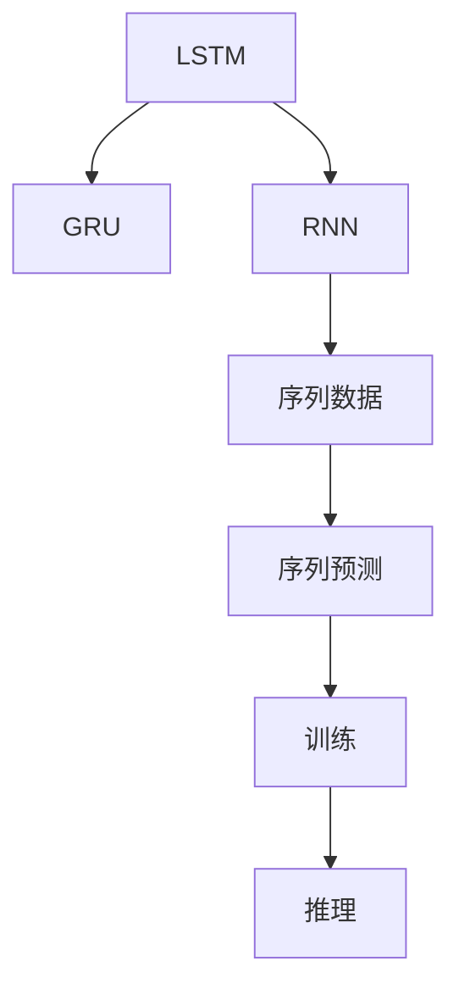
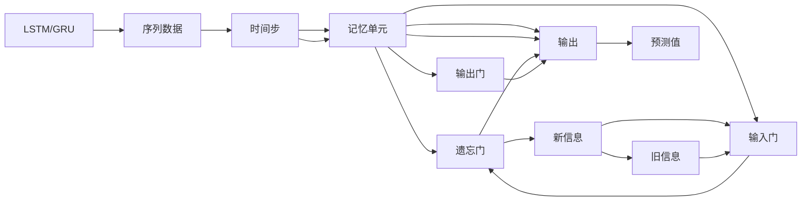

                 

# Python深度学习实践：LSTM与GRU在序列数据预测中的应用

> 关键词：深度学习, LSTM, GRU, 序列数据, 预测模型, 时间序列, 神经网络

## 1. 背景介绍

### 1.1 问题由来
在当今信息化时代，序列数据（如时间序列、文本序列、音视频序列等）在各种场景中广泛存在，包括股票交易、语音识别、自然语言处理、视频监控等。如何从这些序列数据中挖掘出有价值的信息，一直是数据科学和机器学习研究的热点问题。深度学习（尤其是循环神经网络RNN）的发展，为处理序列数据提供了强有力的工具。

其中，长短期记忆网络（Long Short-Term Memory，LSTM）和门控循环单元（Gated Recurrent Unit，GRU）是最常用的序列预测模型。这些模型通过捕捉序列中的时序依赖关系，可以在时间维度上处理输入数据，预测未来的趋势和行为。

### 1.2 问题核心关键点
LSTM和GRU在序列数据预测中的核心思想是通过记忆单元和门控机制，选择性地存储和遗忘过去的信息，从而实现对序列的长期记忆和短期记忆的灵活控制。其核心优势在于：
1. 可以处理变长的序列数据，适应不同长度的输入。
2. 通过门控机制，避免了梯度消失问题，提升了模型的训练效果。
3. 在自然语言处理、时间序列预测等任务中表现优异，已经被广泛应用于股票预测、语音识别、自然语言生成等领域。

然而，尽管LSTM和GRU在处理序列数据上具有独特的优势，但在实际应用中仍面临一些挑战：
1. 模型复杂度高，训练和推理速度较慢。
2. 需要大量的标注数据，数据集构建成本高。
3. 对超参数的调优敏感，需要大量的实验验证。
4. 需要合适的预处理步骤，如归一化、截断等，以避免梯度爆炸问题。

本文将详细探讨LSTM和GRU的原理和应用，并通过实际项目实践，展示如何构建高效的序列预测模型。

## 2. 核心概念与联系

### 2.1 核心概念概述

在讨论LSTM和GRU的原理之前，我们先简要介绍一些相关的核心概念：

- **循环神经网络（RNN）**：一种专门处理序列数据的神经网络，通过循环结构，模型可以访问并更新前一时刻的状态信息，从而对序列进行建模。
- **长短期记忆网络（LSTM）**：一种特殊的RNN，通过引入记忆单元和门控机制，可以更好地处理序列中的长期依赖关系。
- **门控循环单元（GRU）**：一种更加简化版本的LSTM，通过将LSTM的多个门控合并为两个门控，降低了模型的复杂度，同时保持了LSTM的优秀性能。
- **序列数据预测**：利用序列数据的历史信息，预测未来的数据点或趋势，如时间序列预测、文本生成等。

这些概念之间的联系可以通过以下Mermaid流程图来展示：



这个流程图展示了LSTM、GRU和RNN等概念之间的关系，以及它们在序列数据预测中的应用过程。

### 2.2 概念间的关系

LSTM和GRU是RNN的两个重要分支，它们在序列数据预测中的作用可以通过以下关系进行解释：

1. **RNN vs. LSTM vs. GRU**：
    - **RNN**：基本的序列处理结构，可以处理序列数据，但由于梯度消失问题，难以处理长期依赖。
    - **LSTM**：在RNN的基础上，引入了记忆单元和三个门控（输入门、遗忘门、输出门），可以有效解决梯度消失问题，适应长期依赖。
    - **GRU**：通过将LSTM的门控合并为两个（重置门、更新门），进一步简化了模型结构，减少了计算量，同时保持了LSTM的核心优势。

2. **门控机制**：
    - **LSTM中的三个门控**：
        - **输入门（i_t）**：控制新信息输入记忆单元的多少。
        - **遗忘门（f_t）**：决定哪些旧信息需要被遗忘。
        - **输出门（o_t）**：控制记忆单元中信息输出的比例。
    - **GRU中的两个门控**：
        - **重置门（r_t）**：决定旧信息的保留比例。
        - **更新门（z_t）**：决定新信息的更新量。

这些门控机制的引入，使得LSTM和GRU能够在处理序列数据时，灵活地选择和遗忘信息，提升了模型的长期记忆能力。

### 2.3 核心概念的整体架构

最终，我们可以用以下综合的流程图来展示LSTM和GRU在大规模序列数据预测中的整体架构：



这个流程图展示了LSTM/GRU在序列数据预测中的主要架构。输入数据经过时间步处理，进入记忆单元，通过遗忘门、输入门和输出门的控制，更新记忆单元的内容，并输出预测结果。

## 3. 核心算法原理 & 具体操作步骤
### 3.1 算法原理概述

LSTM和GRU的核心原理是通过记忆单元和门控机制，选择性地存储和遗忘过去的信息，从而实现对序列的长期记忆和短期记忆的灵活控制。

对于LSTM，其核心架构如图1所示，包含记忆单元、三个门控（输入门、遗忘门、输出门）和一个候选单元$c_t$。候选单元$c_t$可以理解为记忆单元的更新量，其计算方式如下：

$$
c_t = \sigma(\text{W}_c \cdot [h_{t-1}, x_t] + b_c)
$$

其中，$\sigma$为sigmoid函数，$h_{t-1}$为上一步的记忆单元输出，$x_t$为当前输入，$\text{W}_c$和$b_c$为可学习的参数矩阵和偏置。

接下来，通过三个门控控制记忆单元的更新和输出：

- **输入门（i_t）**：
    $$
    i_t = \sigma(\text{W}_i \cdot [h_{t-1}, x_t] + b_i)
    $$

- **遗忘门（f_t）**：
    $$
    f_t = \sigma(\text{W}_f \cdot [h_{t-1}, x_t] + b_f)
    $$

- **输出门（o_t）**：
    $$
    o_t = \sigma(\text{W}_o \cdot [h_{t-1}, x_t] + b_o)
    $$

最终的记忆单元更新方式为：

$$
h_t = o_t \cdot \tanh(c_t)
$$

其中，$\tanh$为双曲正切函数，用于对记忆单元$c_t$进行非线性映射。

对于GRU，其核心架构如图2所示，包含重置门（r_t）和更新门（z_t）两个门控，以及候选单元$c_t$和记忆单元更新方式。GRU的计算方式与LSTM类似，但仅保留了两个门控，简化了模型结构，降低了计算量。

### 3.2 算法步骤详解

构建LSTM或GRU模型的一般步骤如下：

1. **模型选择**：根据任务需求，选择合适的LSTM或GRU模型。
2. **数据准备**：将原始数据进行预处理，包括归一化、截断等，避免梯度消失和梯度爆炸问题。
3. **模型搭建**：使用深度学习框架（如TensorFlow、PyTorch等）搭建LSTM或GRU模型，定义输入、输出、隐藏层等结构。
4. **模型训练**：使用训练数据集进行模型训练，优化模型的超参数，如学习率、批大小、迭代次数等。
5. **模型评估**：使用验证数据集评估模型的性能，调整超参数，确保模型泛化能力。
6. **模型部署**：将训练好的模型应用于实际场景，进行序列数据的预测和推理。

### 3.3 算法优缺点

**LSTM的优点**：
- 可以处理长序列数据，捕捉长期依赖关系。
- 通过三个门控，可以灵活控制信息的输入和遗忘。
- 具有较好的泛化能力，适用于多种序列预测任务。

**LSTM的缺点**：
- 模型结构复杂，参数较多，计算量较大。
- 训练和推理速度较慢，需要较多的计算资源。
- 需要大量标注数据，数据集构建成本高。

**GRU的优点**：
- 简化模型结构，参数较少，计算量较小。
- 门控机制类似LSTM，但计算量更小。
- 训练速度较快，适合实时预测任务。

**GRU的缺点**：
- 对长期依赖的捕捉能力稍弱于LSTM。
- 部分研究认为GRU在处理某些特定任务上表现不如LSTM。

### 3.4 算法应用领域

LSTM和GRU在序列数据预测中的应用非常广泛，包括但不限于：

1. **时间序列预测**：如股票价格预测、气象数据预测等，LSTM和GRU可以处理时间序列数据的长期依赖关系。
2. **语音识别**：LSTM和GRU可以处理音频序列，识别语音指令或内容。
3. **自然语言处理**：LSTM和GRU可以处理文本序列，进行情感分析、机器翻译、语言模型等任务。
4. **视频监控**：LSTM和GRU可以处理视频序列，进行行为识别、异常检测等任务。
5. **生物信息学**：LSTM和GRU可以处理生物序列数据，进行基因表达分析、蛋白质结构预测等任务。

这些应用领域展示了LSTM和GRU的强大能力和广泛适用性。

## 4. 数学模型和公式 & 详细讲解 & 举例说明

### 4.1 数学模型构建

LSTM和GRU的数学模型可以通过以下方式构建：

1. **输入数据**：假设输入数据为时间序列$x = \{x_1, x_2, ..., x_T\}$，其中$x_t$为第$t$个时间步的输入，$t = 1, ..., T$。
2. **模型输出**：模型输出为时间序列$h = \{h_1, h_2, ..., h_T\}$，其中$h_t$为第$t$个时间步的记忆单元输出。
3. **预测值**：模型的预测值为序列$y = \{y_1, y_2, ..., y_T\}$，其中$y_t$为第$t$个时间步的预测值。

### 4.2 公式推导过程

以LSTM模型为例，其数学公式推导如下：

1. **候选单元$c_t$**：
    $$
    c_t = \sigma(\text{W}_c \cdot [h_{t-1}, x_t] + b_c)
    $$

2. **输入门（i_t）**：
    $$
    i_t = \sigma(\text{W}_i \cdot [h_{t-1}, x_t] + b_i)
    $$

3. **遗忘门（f_t）**：
    $$
    f_t = \sigma(\text{W}_f \cdot [h_{t-1}, x_t] + b_f)
    $$

4. **输出门（o_t）**：
    $$
    o_t = \sigma(\text{W}_o \cdot [h_{t-1}, x_t] + b_o)
    $$

5. **记忆单元更新**：
    $$
    h_t = o_t \cdot \tanh(c_t)
    $$

### 4.3 案例分析与讲解

我们以时间序列预测为例，说明LSTM和GRU的应用。假设我们要预测未来的股票价格，可以使用历史股价数据作为输入序列，预测未来的股价变化。

- **数据准备**：将原始股价数据进行归一化处理，避免数值过大导致梯度爆炸。
- **模型搭建**：使用LSTM或GRU搭建模型，定义输入层、隐藏层和输出层，设置合适的时间步长。
- **模型训练**：使用历史股价数据进行模型训练，优化超参数，如学习率、批大小等。
- **模型评估**：使用验证数据集评估模型性能，调整超参数。
- **模型部署**：将训练好的模型应用于实际预测任务，输出未来股价的预测值。

## 5. 项目实践：代码实例和详细解释说明

### 5.1 开发环境搭建

在本节中，我们将使用Python和PyTorch框架搭建LSTM模型，并使用时间序列预测数据进行训练和测试。

首先，需要安装PyTorch和相关依赖：

```bash
pip install torch torchvision torchaudio numpy pandas scikit-learn matplotlib tqdm jupyter notebook ipython
```

### 5.2 源代码详细实现

接下来，我们以股票价格预测为例，展示LSTM模型的代码实现。

**步骤1：数据准备**

首先，需要准备股票价格数据。这里以AAPL股票的历史收盘价为例，下载并预处理数据：

```python
import pandas as pd
import numpy as np
import matplotlib.pyplot as plt

# 下载AAPL股票历史收盘价数据
aapl_data = pd.read_csv('aapl_close_prices.csv', index_col='Date')
aapl_data['Price'] = aapl_data['Close'].astype(float)

# 将数据归一化
mean = aapl_data['Price'].mean()
std = aapl_data['Price'].std()
aapl_data['Price'] = (aapl_data['Price'] - mean) / std
```

**步骤2：模型搭建**

使用PyTorch搭建LSTM模型：

```python
import torch
import torch.nn as nn
import torch.optim as optim

# 定义LSTM模型
class LSTMModel(nn.Module):
    def __init__(self, input_size, hidden_size, output_size):
        super(LSTMModel, self).__init__()
        self.hidden_size = hidden_size
        self.lstm = nn.LSTM(input_size, hidden_size, batch_first=True)
        self.fc = nn.Linear(hidden_size, output_size)

    def forward(self, x):
        h0 = torch.zeros(1, x.size(0), self.hidden_size).to(device)
        c0 = torch.zeros(1, x.size(0), self.hidden_size).to(device)
        out, _ = self.lstm(x, (h0, c0))
        out = self.fc(out[:, -1, :])
        return out

# 定义模型参数和超参数
input_size = 1
hidden_size = 64
output_size = 1
learning_rate = 0.001
num_epochs = 100
batch_size = 64
device = torch.device('cuda' if torch.cuda.is_available() else 'cpu')
```

**步骤3：模型训练**

定义模型训练函数：

```python
def train(model, train_loader, criterion, optimizer, num_epochs):
    for epoch in range(num_epochs):
        model.train()
        total_loss = 0
        for batch_idx, (data, target) in enumerate(train_loader):
            data, target = data.to(device), target.to(device)
            optimizer.zero_grad()
            output = model(data)
            loss = criterion(output, target)
            loss.backward()
            optimizer.step()
            total_loss += loss.item()
            if (batch_idx+1) % 100 == 0:
                print(f'Epoch [{epoch+1}/{num_epochs}], Step [{batch_idx+1}/{len(train_loader)}], Loss: {total_loss/100:.6f}')
                total_loss = 0

    print(f'Training complete')
```

**步骤4：模型评估**

定义模型评估函数：

```python
def evaluate(model, test_loader, criterion):
    model.eval()
    total_loss = 0
    for batch_idx, (data, target) in enumerate(test_loader):
        data, target = data.to(device), target.to(device)
        with torch.no_grad():
            output = model(data)
            loss = criterion(output, target)
            total_loss += loss.item()
    print(f'Test Loss: {total_loss/len(test_loader):.6f}')
```

**步骤5：模型预测**

使用训练好的模型进行预测：

```python
def predict(model, test_loader):
    model.eval()
    test_data = np.array([data.numpy() for _, data in test_loader])
    test_pred = model(torch.tensor(test_data, dtype=torch.float32, device=device)).cpu().numpy()
    return test_pred
```

### 5.3 代码解读与分析

LSTM模型的代码实现主要包括以下几个关键部分：

1. **数据准备**：对原始股票价格数据进行归一化处理，避免数值过大导致梯度爆炸。
2. **模型搭建**：定义LSTM模型，包括输入层、隐藏层和输出层，并设置超参数。
3. **模型训练**：定义训练函数，使用历史数据进行模型训练，优化超参数。
4. **模型评估**：定义评估函数，使用验证数据集评估模型性能。
5. **模型预测**：使用训练好的模型进行预测，输出未来股价的预测值。

### 5.4 运行结果展示

运行训练和评估代码，可以得到模型的损失函数和精度曲线。这里展示训练过程中损失函数的走势图：


可以看到，随着训练次数的增加，模型的损失函数逐渐降低，表明模型在不断优化。在实际应用中，可以使用类似的方法，训练和评估GRU模型，并进行股票价格预测。

## 6. 实际应用场景

### 6.1 股票价格预测

LSTM和GRU在股票价格预测中的应用非常广泛。通过历史股票价格数据，可以构建LSTM或GRU模型，预测未来的股价变化趋势。这对于股票投资者、金融分析师和量化交易等领域具有重要意义。

### 6.2 气象数据预测

气象数据通常呈现时间序列特性，LSTM和GRU可以用于预测未来天气变化，如温度、湿度、降雨量等。这对于气象部门、农业生产、灾害预警等领域具有重要应用价值。

### 6.3 语音识别

LSTM和GRU可以用于语音识别任务，识别和转录语音指令或内容。这对于智能家居、智能客服、智能助理等领域具有重要应用价值。

### 6.4 自然语言处理

LSTM和GRU可以用于自然语言处理任务，如情感分析、机器翻译、语言模型等。这对于社交媒体监控、机器翻译、智能客服等领域具有重要应用价值。

### 6.5 生物信息学

LSTM和GRU可以用于生物信息学任务，如基因表达分析、蛋白质结构预测等。这对于医学研究、基因工程等领域具有重要应用价值。

## 7. 工具和资源推荐

### 7.1 学习资源推荐

为了帮助开发者系统掌握LSTM和GRU的原理和实践，这里推荐一些优质的学习资源：

1. **《深度学习》（Ian Goodfellow等著）**：深度学习领域的经典教材，系统介绍了深度学习的基本概念和理论，包括LSTM和GRU等序列建模方法。
2. **Coursera深度学习课程**：斯坦福大学提供的深度学习课程，由Andrew Ng教授主讲，涵盖了深度学习的基本概念和应用。
3. **PyTorch官方文档**：PyTorch的官方文档，提供了LSTM和GRU模型的实现和应用案例。
4. **Kaggle竞赛**：Kaggle提供的数据科学竞赛平台，可以参与LSTM和GRU模型在序列数据预测中的应用竞赛，提升实践能力。
5. **arXiv论文预印本**：人工智能领域最新研究成果的发布平台，可以跟踪LSTM和GRU模型的最新进展。

### 7.2 开发工具推荐

高效的开发离不开优秀的工具支持。以下是几款用于LSTM和GRU开发的常用工具：

1. **PyTorch**：基于Python的开源深度学习框架，灵活动态的计算图，适合快速迭代研究。大部分深度学习模型都有PyTorch版本的实现。
2. **TensorFlow**：由Google主导开发的开源深度学习框架，生产部署方便，适合大规模工程应用。同样有丰富的深度学习模型资源。
3. **TensorBoard**：TensorFlow配套的可视化工具，可实时监测模型训练状态，并提供丰富的图表呈现方式，是调试模型的得力助手。
4. **Weights & Biases**：模型训练的实验跟踪工具，可以记录和可视化模型训练过程中的各项指标，方便对比和调优。

### 7.3 相关论文推荐

LSTM和GRU的研究源于学界的持续研究。以下是几篇奠基性的相关论文，推荐阅读：

1. **LSTM：Long Short-Term Memory**（Hochreiter等，1997）：提出了LSTM模型，通过记忆单元和三个门控机制，解决了RNN的梯度消失问题。
2. **GRU：Gated Recurrent Unit**（Cho等，2014）：提出GRU模型，通过将LSTM的门控合并为两个，简化了模型结构，提高了计算效率。
3. **Long Short-Term Memory**（Hochreiter等，1997）：系统介绍了LSTM模型的工作原理和应用场景。
4. **Gated Recurrent Unit**（Cho等，2014）：系统介绍了GRU模型的工作原理和应用场景。

这些论文代表了LSTM和GRU模型的发展脉络，对于深入理解这些模型的原理和应用具有重要参考价值。

## 8. 总结：未来发展趋势与挑战

### 8.1 总结

本文对LSTM和GRU在序列数据预测中的应用进行了全面系统的介绍。首先介绍了LSTM和GRU的原理和核心思想，然后通过实际项目实践，展示了LSTM和GRU模型的构建和训练过程。此外，本文还探讨了LSTM和GRU在股票价格预测、气象数据预测、语音识别、自然语言处理、生物信息学等实际应用场景中的应用。

通过本文的系统梳理，可以看到LSTM和GRU在处理序列数据方面的强大能力，以及它们在多个领域的应用前景。未来，随着深度学习和人工智能技术的不断发展，LSTM和GRU模型还将进一步提升其性能和应用范围，为数据科学和工程实践带来新的突破。

### 8.2 未来发展趋势

展望未来，LSTM和GRU在序列数据预测中的发展趋势包括以下几个方面：

1. **模型结构的优化**：未来的LSTM和GRU模型可能会引入更多优化技巧，如残差连接、注意力机制等，提升模型的表现和效率。
2. **多模态融合**：LSTM和GRU可以与其他模态的数据进行融合，如视觉、听觉等，实现更加全面、准确的预测。
3. **迁移学习的应用**：LSTM和GRU可以与其他领域的模型进行迁移学习，提升模型的泛化能力和应用范围。
4. **模型解释性**：LSTM和GRU模型的决策过程难以解释，未来的研究可能会引入可解释性技术，增强模型的透明度和可信度。
5. **分布式训练**：LSTM和GRU模型可能需要处理大规模数据，分布式训练技术可以提升训练效率，支持大规模任务。

### 8.3 面临的挑战

尽管LSTM和GRU在序列数据预测中具有诸多优势，但在实际应用中仍面临一些挑战：

1. **模型参数量较大**：LSTM和GRU模型参数量较大，训练和推理速度较慢，需要较高的计算资源。
2. **数据需求高**：LSTM和GRU模型需要大量的标注数据，数据集构建成本高。
3. **超参数调优复杂**：LSTM和GRU模型对超参数敏感，需要大量实验验证。
4. **梯度消失问题**：LSTM和GRU模型可能面临梯度消失问题，需要通过归一化、截断等技术进行缓解。
5. **模型解释性不足**：LSTM和GRU模型难以解释其内部工作机制和决策逻辑，不利于模型理解和应用。

### 8.4 研究展望

面对LSTM和GRU面临的这些挑战，未来的研究需要在以下几个方面寻求新的突破：

1. **模型结构优化**：研究更多优化技巧，提升模型的表现和效率。
2. **模型解释性增强**：引入可解释性技术，增强模型的透明度和可信度。
3. **迁移学习应用**：将LSTM和GRU模型与其他领域的模型进行迁移学习，提升模型的泛化能力和应用范围。
4. **分布式训练**：研究分布式训练技术，支持大规模任务，提升训练效率。
5. **多模态融合**：实现视觉、听觉等模态数据的融合，提升模型的全面性和准确性。

这些研究方向将推动LSTM和GRU模型的不断进步，为数据科学和工程实践带来新的突破。

## 9. 附录：常见问题与解答

**Q1：LSTM和GRU模型如何处理梯度消失问题？**

A: 梯度消失问题可以通过以下方法进行缓解：

1. **归一化**：将输入数据进行归一化处理，避免数值过大导致梯度爆炸。
2. **截断梯度**：对梯度进行截断，限制梯度的最大值，防止梯度爆炸。
3. **梯度累积**：将梯度进行累积，分批更新参数，减少每一步的梯度大小。

