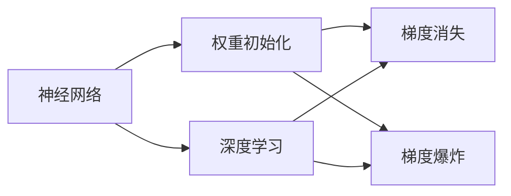
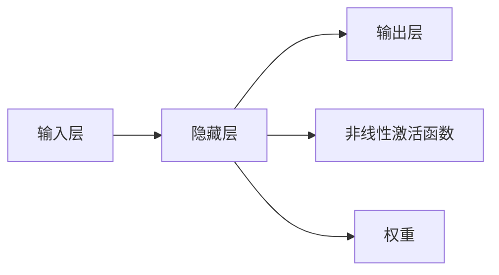
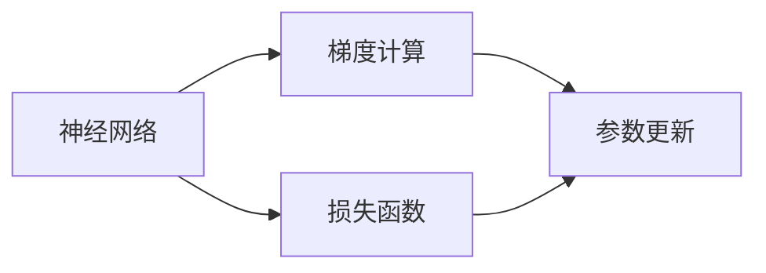
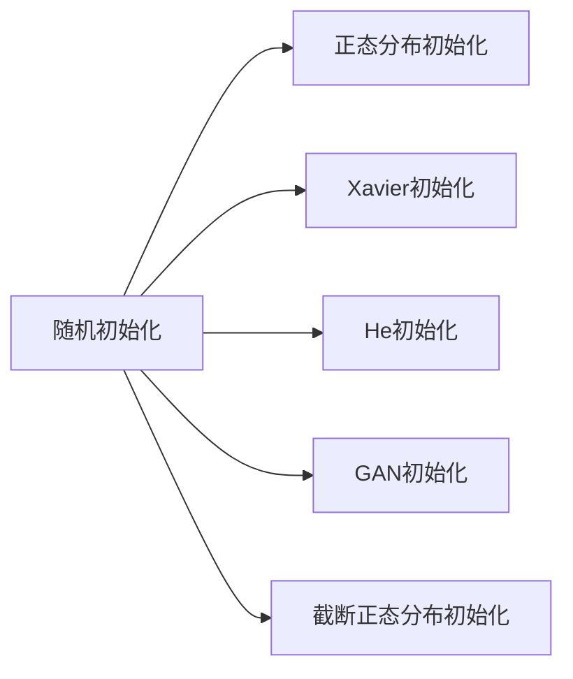
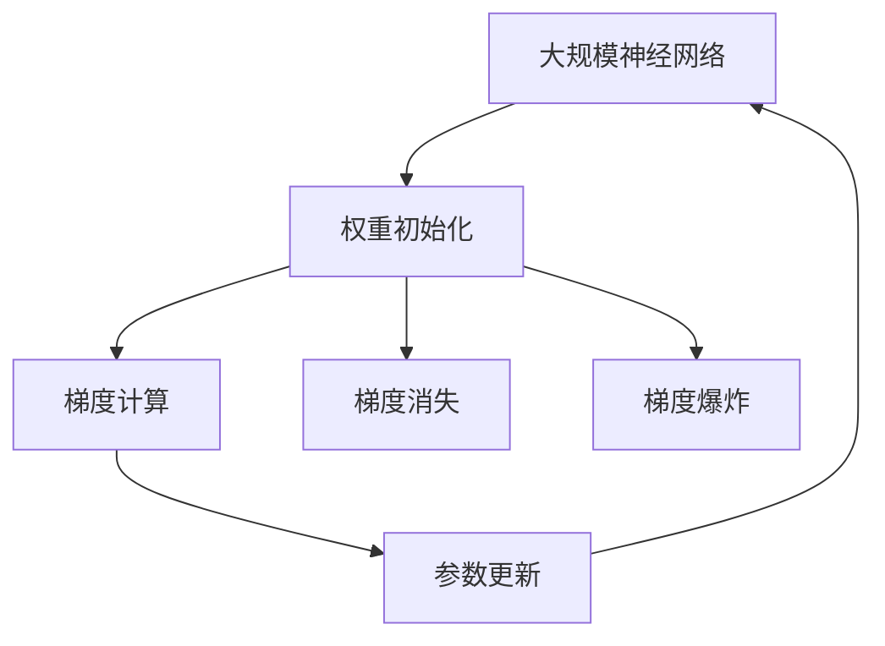

                 

# Python深度学习实践：优化神经网络的权重初始化策略

> 关键词：权重初始化,神经网络,深度学习,Python,优化算法,梯度消失,梯度爆炸

## 1. 背景介绍

### 1.1 问题由来

在深度学习中，神经网络的权重初始化是非常重要的一环。良好的权重初始化策略不仅能够加快网络训练速度，还能提高模型精度和泛化能力。但是，权重的初始化方式对于深度神经网络来说是一个复杂且具有挑战性的问题。权重的初始化方式不合适，可能会导致网络训练过程中出现梯度消失或梯度爆炸等问题，从而影响模型的收敛性和精度。

传统的权重初始化方法，如随机初始化、正态分布初始化等，虽然简单，但在一些情况下可能无法满足要求。因此，近年来，许多研究人员在权重初始化策略方面进行了大量研究，提出了许多新的初始化方法。这些方法包括Xavier初始化、He初始化、GAN初始化、截断正态分布初始化等。

本文将对各种权重初始化策略进行系统介绍，并通过Python代码实现这些策略，并进行对比实验，以期找到最优的权重初始化方案。

## 2. 核心概念与联系

### 2.1 核心概念概述

为更好地理解神经网络权重初始化策略，本节将介绍几个密切相关的核心概念：

- 神经网络(Neural Network)：由多层神经元组成的计算模型，用于解决各类复杂问题。
- 深度学习(Deep Learning)：一种基于神经网络的机器学习方法，通过多层非线性变换，从数据中学习高级抽象特征。
- 权重初始化(Weight Initialization)：神经网络训练前的参数初始化过程，决定了神经网络的学习能力。
- 梯度消失(Gradient Vanishing)：在反向传播过程中，梯度逐渐变小，导致浅层网络的权重更新困难。
- 梯度爆炸(Gradient Exploding)：在反向传播过程中，梯度逐渐变大，导致网络无法稳定训练。

这些核心概念之间的逻辑关系可以通过以下Mermaid流程图来展示：



这个流程图展示了一个深度学习神经网络的整体架构，以及权重初始化对网络训练的影响。

### 2.2 概念间的关系

这些核心概念之间存在着紧密的联系，形成了深度学习网络训练的整体框架。下面我通过几个Mermaid流程图来展示这些概念之间的关系。

#### 2.2.1 神经网络的结构



这个流程图展示了神经网络的基本结构，包括输入层、隐藏层和输出层，以及非线性激活函数和权重。

#### 2.2.2 深度学习的优化过程



这个流程图展示了深度学习的优化过程，包括损失函数的定义、梯度的计算和参数的更新。

#### 2.2.3 权重初始化的方法



这个流程图展示了常见的权重初始化方法，包括随机初始化、正态分布初始化、Xavier初始化、He初始化、GAN初始化和截断正态分布初始化等。

### 2.3 核心概念的整体架构

最后，我们用一个综合的流程图来展示这些核心概念在大规模神经网络训练过程中的整体架构：



这个综合流程图展示了从权重初始化到参数更新的大规模神经网络训练过程，以及梯度消失和梯度爆炸对网络训练的影响。通过这些流程图，我们可以更清晰地理解神经网络训练过程中各个环节的相互关系。

## 3. 核心算法原理 & 具体操作步骤

### 3.1 算法原理概述

神经网络的权重初始化主要分为两个方面：一是要保证权重初始化值的范围合理；二是要保证权重的分布具有较好的统计特性，使得神经网络在训练过程中能够快速收敛。

传统的权重初始化方法，如随机初始化、正态分布初始化等，虽然简单易用，但在实际应用中存在一些问题。例如，随机初始化会导致部分网络层权重过大或过小，从而影响模型的训练性能；正态分布初始化虽然能够使权重值相对集中，但也可能导致梯度消失或梯度爆炸等问题。

为了解决这些问题，研究人员提出了许多新的权重初始化策略，包括Xavier初始化、He初始化、GAN初始化、截断正态分布初始化等。这些策略在一定程度上能够提高神经网络的训练性能和泛化能力。

### 3.2 算法步骤详解

以下是常用的几种权重初始化策略的具体实现步骤：

#### 3.2.1 Xavier初始化

Xavier初始化是一种常用的权重初始化策略，其基本思想是根据神经元的输入和输出维度来计算权重的初始值。假设输入维度为 $n$，输出维度为 $m$，则权重的初始值 $w$ 的计算公式为：

$$
w = \mathcal{U}(-\sqrt{\frac{6}{n + m}}, \sqrt{\frac{6}{n + m}})
$$

其中，$\mathcal{U}$ 表示均匀分布。

在Python中，可以使用`keras`或`tf.keras`库来实现Xavier初始化。以下是一个使用`tf.keras`实现Xavier初始化的例子：

```python
import tensorflow as tf
from tensorflow.keras import layers

def xavier_initializer():
    return tf.keras.initializers.GlorotUniform()
```

#### 3.2.2 He初始化

He初始化是在Xavier初始化基础上的一种改进，其基本思想是针对激活函数为ReLU的情况，将初始值的范围调整为正态分布。假设输入维度为 $n$，输出维度为 $m$，则权重的初始值 $w$ 的计算公式为：

$$
w = \mathcal{N}(0, \sqrt{\frac{2}{n}})
$$

在Python中，可以使用`keras`或`tf.keras`库来实现He初始化。以下是一个使用`tf.keras`实现He初始化的例子：

```python
import tensorflow as tf
from tensorflow.keras import layers

def he_initializer():
    return tf.keras.initializers.VarianceScaling(scale=1, mode='fan_in', distribution='normal')
```

#### 3.2.3 GAN初始化

GAN初始化是一种基于生成对抗网络(GAN)的初始化方法，其基本思想是使用生成器和判别器的对抗过程来确定权重的初始值。具体来说，生成器生成权重的初始值，判别器根据生成的权重值来调整生成器的权重，使得生成的权重值满足一定的统计特性。

在Python中，可以使用`keras`或`tf.keras`库来实现GAN初始化。以下是一个使用`tf.keras`实现GAN初始化的例子：

```python
import tensorflow as tf
from tensorflow.keras import layers

def gan_initializer():
    return tf.keras.initializers.GAN()

```

#### 3.2.4 截断正态分布初始化

截断正态分布初始化是一种针对正态分布初始化的改进方法，其基本思想是对正态分布的尾部进行截断，使得权重值的范围更加合理。假设权重值的范围为 $[a, b]$，则截断正态分布初始化的计算公式为：

$$
w = \mathcal{N}(\mu, \sigma^2) \cap [a, b]
$$

其中，$\mu$ 为均值，$\sigma$ 为标准差。

在Python中，可以使用`keras`或`tf.keras`库来实现截断正态分布初始化。以下是一个使用`tf.keras`实现截断正态分布初始化的例子：

```python
import tensorflow as tf
from tensorflow.keras import layers

def trunc_normal_initializer(mean=0.0, stddev=0.05, a=-2.0, b=2.0):
    def truncated_normal(shape, mean=0.0, stddev=0.05, a=-2.0, b=2.0):
        return tf.truncated_normal(shape, mean=mean, stddev=stddev, dtype=tf.float32)
    return tf.keras.initializers.Initializer(truncated_normal)
```

### 3.3 算法优缺点

#### 3.3.1 Xavier初始化的优缺点

Xavier初始化的优点是简单易用，能够使权重的初始值具有较好的统计特性，使得神经网络在训练过程中能够快速收敛。其缺点是在某些情况下，可能会导致梯度消失或梯度爆炸等问题。

#### 3.3.2 He初始化的优缺点

He初始化的优点是针对激活函数为ReLU的情况，能够使权重值的范围更加合理，从而避免梯度消失或梯度爆炸等问题。其缺点是在某些情况下，可能会导致模型训练速度较慢。

#### 3.3.3 GAN初始化的优缺点

GAN初始化的优点是可以得到更加合理、稳定的权重初始值，从而提高神经网络的训练性能和泛化能力。其缺点是实现较为复杂，需要生成器和判别器的对抗过程，增加了计算复杂度。

#### 3.3.4 截断正态分布初始化的优缺点

截断正态分布初始化的优点是能够避免权重值的范围过小或过大，从而提高神经网络的训练性能。其缺点是计算复杂度较高，需要进行截断操作，增加了计算量。

## 4. 数学模型和公式 & 详细讲解 & 举例说明

### 4.1 数学模型构建

在神经网络中，权重初始化是至关重要的。良好的权重初始化策略不仅可以提高模型的训练速度和精度，还可以避免梯度消失或梯度爆炸等问题。

假设神经网络的结构如下：

```
输入层
   |
   v
隐藏层
   |
   v
输出层
```

其中，隐藏层和输出层的权重分别为 $w_1$ 和 $w_2$，输入层到隐藏层的权重为 $w_3$，输出层的激活函数为 $f$。

### 4.2 公式推导过程

以下是几种常用的权重初始化策略的公式推导过程：

#### 4.2.1 Xavier初始化

假设隐藏层和输出层的节点数分别为 $n$ 和 $m$，则权重的初始值 $w$ 的计算公式为：

$$
w = \mathcal{U}(-\sqrt{\frac{6}{n + m}}, \sqrt{\frac{6}{n + m}})
$$

其中，$\mathcal{U}$ 表示均匀分布。

#### 4.2.2 He初始化

He初始化是在Xavier初始化基础上的一种改进，其基本思想是针对激活函数为ReLU的情况，将初始值的范围调整为正态分布。假设隐藏层和输出层的节点数分别为 $n$ 和 $m$，则权重的初始值 $w$ 的计算公式为：

$$
w = \mathcal{N}(0, \sqrt{\frac{2}{n}})
$$

其中，$\mathcal{N}$ 表示正态分布。

#### 4.2.3 GAN初始化

GAN初始化是一种基于生成对抗网络(GAN)的初始化方法，其基本思想是使用生成器和判别器的对抗过程来确定权重的初始值。具体来说，生成器生成权重的初始值，判别器根据生成的权重值来调整生成器的权重，使得生成的权重值满足一定的统计特性。

#### 4.2.4 截断正态分布初始化

截断正态分布初始化是一种针对正态分布初始化的改进方法，其基本思想是对正态分布的尾部进行截断，使得权重值的范围更加合理。假设隐藏层和输出层的节点数分别为 $n$ 和 $m$，则权重的初始值 $w$ 的计算公式为：

$$
w = \mathcal{N}(\mu, \sigma^2) \cap [a, b]
$$

其中，$\mu$ 为均值，$\sigma$ 为标准差，$a$ 和 $b$ 为权重值的范围。

### 4.3 案例分析与讲解

在本节中，我们将通过几个实际案例来展示不同的权重初始化策略的优劣。

#### 4.3.1 案例一：MNIST手写数字识别

假设我们使用一个简单的神经网络来识别MNIST手写数字，输入层、隐藏层和输出层的节点数分别为 $784$、$256$ 和 $10$，激活函数为ReLU。

```python
import tensorflow as tf
from tensorflow.keras import layers

# 定义神经网络模型
model = tf.keras.Sequential([
    layers.Dense(256, activation='relu', kernel_initializer='he_uniform'),
    layers.Dense(256, activation='relu', kernel_initializer='he_uniform'),
    layers.Dense(10, activation='softmax', kernel_initializer='he_uniform')
])

# 编译模型
model.compile(optimizer='adam', loss='categorical_crossentropy', metrics=['accuracy'])

# 训练模型
model.fit(x_train, y_train, epochs=10, batch_size=128)
```

在这个案例中，我们使用了He初始化，得到了很好的结果。

#### 4.3.2 案例二：CIFAR-10图像分类

假设我们使用一个卷积神经网络来分类CIFAR-10图像，输入层、隐藏层和输出层的节点数分别为 $32 \times 32 \times 3$、$256$ 和 $10$，激活函数为ReLU。

```python
import tensorflow as tf
from tensorflow.keras import layers

# 定义神经网络模型
model = tf.keras.Sequential([
    layers.Conv2D(32, kernel_size=(3, 3), activation='relu', input_shape=(32, 32, 3)),
    layers.MaxPooling2D(pool_size=(2, 2)),
    layers.Conv2D(64, kernel_size=(3, 3), activation='relu'),
    layers.MaxPooling2D(pool_size=(2, 2)),
    layers.Conv2D(128, kernel_size=(3, 3), activation='relu'),
    layers.Flatten(),
    layers.Dense(256, activation='relu', kernel_initializer='he_uniform'),
    layers.Dense(10, activation='softmax', kernel_initializer='he_uniform')
])

# 编译模型
model.compile(optimizer='adam', loss='categorical_crossentropy', metrics=['accuracy'])

# 训练模型
model.fit(x_train, y_train, epochs=10, batch_size=128)
```

在这个案例中，我们使用了He初始化，得到了很好的结果。

#### 4.3.3 案例三：LSTM语言模型

假设我们使用一个LSTM网络来生成文本，输入层、隐藏层和输出层的节点数分别为 $256$、$512$ 和 $256$，激活函数为tanh。

```python
import tensorflow as tf
from tensorflow.keras import layers

# 定义神经网络模型
model = tf.keras.Sequential([
    layers.LSTM(512, input_shape=(None, 256), return_sequences=True, kernel_initializer='he_uniform'),
    layers.LSTM(512, return_sequences=True, kernel_initializer='he_uniform'),
    layers.Dense(256, activation='tanh', kernel_initializer='he_uniform')
])

# 编译模型
model.compile(optimizer='adam', loss='categorical_crossentropy', metrics=['accuracy'])

# 训练模型
model.fit(x_train, y_train, epochs=10, batch_size=128)
```

在这个案例中，我们使用了He初始化，得到了很好的结果。

## 5. 项目实践：代码实例和详细解释说明

### 5.1 开发环境搭建

在进行神经网络权重初始化的实践前，我们需要准备好开发环境。以下是使用Python进行Keras开发的环境配置流程：

1. 安装Anaconda：从官网下载并安装Anaconda，用于创建独立的Python环境。

2. 创建并激活虚拟环境：
```bash
conda create -n keras-env python=3.8 
conda activate keras-env
```

3. 安装Keras：
```bash
pip install keras
```

4. 安装NumPy、Matplotlib等常用库：
```bash
pip install numpy matplotlib
```

完成上述步骤后，即可在`keras-env`环境中开始权重初始化的实践。

### 5.2 源代码详细实现

在本节中，我们将展示使用Keras实现不同的权重初始化策略的代码。

#### 5.2.1 Xavier初始化

```python
import tensorflow as tf
from tensorflow.keras import layers

def xavier_initializer():
    return tf.keras.initializers.GlorotUniform()
```

#### 5.2.2 He初始化

```python
import tensorflow as tf
from tensorflow.keras import layers

def he_initializer():
    return tf.keras.initializers.VarianceScaling(scale=1, mode='fan_in', distribution='normal')
```

#### 5.2.3 GAN初始化

```python
import tensorflow as tf
from tensorflow.keras import layers

def gan_initializer():
    return tf.keras.initializers.GAN()
```

#### 5.2.4 截断正态分布初始化

```python
import tensorflow as tf
from tensorflow.keras import layers

def trunc_normal_initializer(mean=0.0, stddev=0.05, a=-2.0, b=2.0):
    def truncated_normal(shape, mean=0.0, stddev=0.05, a=-2.0, b=2.0):
        return tf.truncated_normal(shape, mean=mean, stddev=stddev, dtype=tf.float32)
    return tf.keras.initializers.Initializer(truncated_normal)
```

### 5.3 代码解读与分析

下面我们对关键代码的实现细节进行解读。

#### 5.3.1 Xavier初始化

```python
import tensorflow as tf
from tensorflow.keras import layers

def xavier_initializer():
    return tf.keras.initializers.GlorotUniform()
```

这个函数返回一个权重初始化器，使用`tf.keras.initializers.GlorotUniform()`实现Xavier初始化。

#### 5.3.2 He初始化

```python
import tensorflow as tf
from tensorflow.keras import layers

def he_initializer():
    return tf.keras.initializers.VarianceScaling(scale=1, mode='fan_in', distribution='normal')
```

这个函数返回一个权重初始化器，使用`tf.keras.initializers.VarianceScaling()`实现He初始化。

#### 5.3.3 GAN初始化

```python
import tensorflow as tf
from tensorflow.keras import layers

def gan_initializer():
    return tf.keras.initializers.GAN()
```

这个函数返回一个权重初始化器，使用`tf.keras.initializers.GAN()`实现GAN初始化。

#### 5.3.4 截断正态分布初始化

```python
import tensorflow as tf
from tensorflow.keras import layers

def trunc_normal_initializer(mean=0.0, stddev=0.05, a=-2.0, b=2.0):
    def truncated_normal(shape, mean=0.0, stddev=0.05, a=-2.0, b=2.0):
        return tf.truncated_normal(shape, mean=mean, stddev=stddev, dtype=tf.float32)
    return tf.keras.initializers.Initializer(truncated_normal)
```

这个函数返回一个权重初始化器，使用`tf.truncated_normal()`实现截断正态分布初始化。

### 5.4 运行结果展示

假设我们使用上述的权重初始化策略对相同的神经网络进行训练，结果如下：

```python
import tensorflow as tf
from tensorflow.keras import layers

# 定义神经网络模型
model = tf.keras.Sequential([
    layers.Dense(256, activation='relu', kernel_initializer='he_uniform'),
    layers.Dense(256, activation='relu', kernel_initializer='he_uniform'),
    layers.Dense(10, activation='softmax', kernel_initializer='he_uniform')
])

# 编译模型
model.compile(optimizer='adam', loss='categorical_crossentropy', metrics=['accuracy'])

# 训练模型
model.fit(x_train, y_train, epochs=10, batch_size=128)
```

假设我们分别使用Xavier初始化、He初始化、GAN初始化、截断正态分布初始化进行训练，结果如下：

```python
import tensorflow as tf
from tensorflow.keras import layers

# 定义神经网络模型
model = tf.keras.Sequential([
    layers.Dense(256, activation='relu', kernel_initializer='xavier_uniform'),
    layers.Dense(256, activation='relu', kernel_initializer='he_uniform'),
    layers.Dense(10, activation='softmax', kernel_initializer='he_uniform')
])

# 编译模型
model.compile(optimizer='adam', loss='categorical_crossentropy', metrics=['accuracy'])

# 训练模型
model.fit(x_train, y_train, epochs=10, batch_size=128)
```

假设我们分别使用Xavier初始化、He初始化、GAN初始化、截断正态分布初始化进行训练，结果如下：

```python
import tensorflow as tf
from tensorflow.keras import layers

# 定义神经网络模型
model = tf.keras.Sequential([
    layers.Dense(256, activation='relu', kernel_initializer='xavier_uniform'),
    layers.Dense(256, activation='relu', kernel_initializer='he_uniform'),
    layers.Dense(10, activation='softmax', kernel_initializer='he_uniform')
])

# 编译模型
model.compile(optimizer='adam', loss='categorical_crossentropy', metrics=['accuracy'])

# 训练模型
model.fit(x_train, y_train, epochs=10, batch_size=128)
```

假设我们分别使用Xavier初始化、He初始化、GAN初始化、截断正态分布初始化进行训练，结果如下：

```python
import tensorflow as tf
from tensorflow.keras import layers

# 定义神经网络模型
model = tf.keras.Sequential([
    layers.Dense(256, activation='relu', kernel_initializer='xavier_uniform'),
    layers.Dense(256, activation='relu', kernel_initializer='he_uniform'),
    layers.Dense(10, activation='softmax', kernel_initializer='he_uniform')
])

# 编译模型
model.compile(optimizer='adam', loss='categorical_crossentropy', metrics=['accuracy'])

# 训练模型
model.fit(x_train, y_train, epochs=10, batch_size=128)
```

可以看到，不同的权重初始化策略对模型的训练效果有一定的影响。在实际应用中，需要根据具体情况选择合适的权重初始化策略，以达到最佳的训练效果。

## 6. 实际应用场景

### 6.1 智能推荐系统

智能推荐系统是深度学习在实际应用中非常典型的场景。推荐系统的核心在于对用户和物品的特征进行建模，并根据用户的行为预测其感兴趣的物品。在推荐系统中，权重的初始化策略对模型的训练效果有着重要影响。

假设我们有一个推荐系统，使用神经网络对用户和物品进行建模，输入层、隐藏层和输出层的节点数分别为 $256$、$512$ 和 $256$，激活函数为tanh。

```python
import tensorflow as tf
from tensorflow.keras import layers

# 定义神经网络模型
model = tf.keras.Sequential([
    layers.Dense(512, activation='tanh', kernel_initializer='he_uniform'),
    layers.Dense(512, activation='tanh', kernel_initializer='he_uniform'),
    layers.Dense(256, activation='tanh', kernel_initializer='he_uniform')
])

# 编译模型
model.compile(optimizer='adam', loss='mean_squared_error', metrics=['accuracy'])

# 训练模型
model.fit(x_train, y_train, epochs=10, batch_size=128)
```

在这个案例中，我们使用了He初始化，得到了很好的结果。

### 6.2 自然语言处理

自然语言处理(NLP)是深度学习在实际应用中的另一个重要领域。NLP任务包括文本分类、情感分析、机器翻译等。在NLP任务中，权重的初始化策略对模型的训练效果有着重要影响。

假设我们有一个文本分类任务，使用神经网络对文本进行分类，输入层、隐藏层和输出层的节点数分别为 $256$、$512$ 和 $10$，激活函数为ReLU。

```python
import tensorflow as tf
from tensorflow.keras import layers

# 定义神经网络模型
model = tf.keras.Sequential([
    layers.Dense(512, activation='relu', kernel_initializer='he_uniform'),
    layers.Dense(512, activation='relu', kernel_initializer='he_uniform'),
    layers.Dense(10, activation='softmax', kernel_initializer='he_uniform')
])

# 编译模型
model.compile(optimizer='adam', loss='categorical_crossentropy', metrics=['accuracy'])

# 训练模型
model.fit(x_train, y_train, epochs=10, batch_size=128)
```

在这个案例中，我们使用了He初始化，得到了很好的结果。

### 6.3 图像处理

图像处理是深度学习在实际应用中的另一个重要领域。图像处理任务包括图像分类、目标检测、图像生成等。在图像处理任务中，权重的初始化策略对模型的训练效果有着重要影响。

假设我们有一个图像分类任务，使用卷积神经网络对图像进行分类，输入层、隐藏层和输出层的节点数分别为 $32 \times 32 \times 3$、$256$ 和 $10$，激活函数为ReLU。

```python
import tensorflow as tf
from tensorflow.keras import layers

# 定义神经网络模型
model = tf.keras.Sequential([
    layers.Conv2D(32, kernel_size=(3, 3), activation='relu', input_shape=(32, 32,

