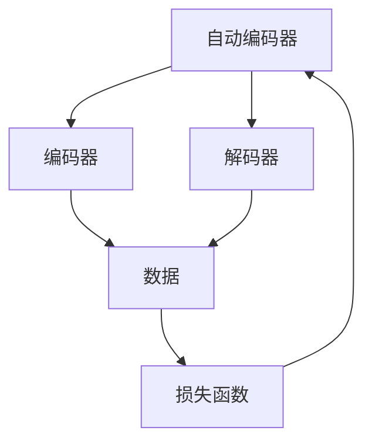
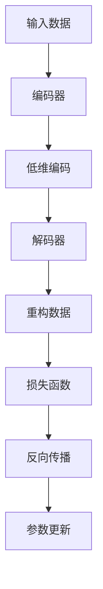
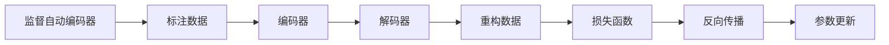
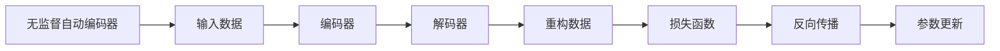
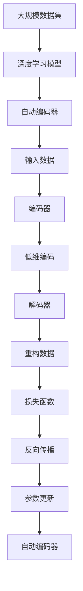

                 

# Python深度学习实践：自动编码器在数据降维中的应用

> 关键词：自动编码器,深度学习,Python,数据降维,数学模型,降维技术

## 1. 背景介绍

### 1.1 问题由来
在数据分析和机器学习中，数据降维是一个重要的预处理步骤。它旨在减少数据的维度，从而降低计算复杂度和存储成本，同时保留关键信息，避免数据丢失。传统的数据降维方法，如主成分分析（PCA）、线性判别分析（LDA）等，依赖于假设数据的线性相关性，而实际数据往往包含复杂的非线性关系，难以通过线性方法得到理想的降维效果。

近年来，随着深度学习技术的兴起，基于神经网络的自动编码器（Autoencoder）成为了数据降维的新利器。自动编码器通过非线性的方式对数据进行编码和解码，能够有效保留数据的非线性结构，并且适用于各种复杂的数据类型。

### 1.2 问题核心关键点
自动编码器主要包括编码器和解码器两部分。编码器将输入数据压缩为低维编码，解码器则将低维编码解压回原始数据。通过训练自动编码器，可以学习到数据的潜在表示，从而实现数据降维。

自动编码器分为有监督自动编码器（Supervised Autoencoder）和无监督自动编码器（Unsupervised Autoencoder）两种。前者需要额外的标注数据进行训练，后者则完全依靠数据本身的内在关系进行训练，更适合处理非标注数据。

### 1.3 问题研究意义
自动编码器在数据降维领域的应用，可以显著降低数据维度和计算复杂度，提高数据处理效率和存储效益。同时，自动编码器能够有效保留数据的非线性结构，适用于各种复杂的数据类型。这些特性使得自动编码器在图像处理、信号处理、生物信息学等领域具有广泛的应用前景。

自动编码器的研究不仅有助于提高数据处理效率，还能够为后续的机器学习任务提供更好的特征表示，提升模型的性能。通过自动编码器的降维预处理，可以优化模型的训练过程，降低模型的复杂度，从而提高模型的泛化能力。

## 2. 核心概念与联系

### 2.1 核心概念概述

为更好地理解自动编码器在数据降维中的应用，本节将介绍几个密切相关的核心概念：

- 自动编码器（Autoencoder）：一种通过编码器和解码器实现数据压缩和解压缩的神经网络结构。通过训练自动编码器，可以学习到数据的潜在表示，实现数据降维。

- 深度学习（Deep Learning）：一种基于多层神经网络的机器学习方法，通过多层次的特征提取和表示学习，实现复杂的模式识别和预测任务。

- 数据降维（Dimensionality Reduction）：通过某种算法将高维数据映射到低维空间的过程。常用的降维方法包括PCA、LDA、自动编码器等。

- 监督学习（Supervised Learning）：一种利用标注数据进行模型训练的学习方法。在有监督自动编码器中，输入数据和目标数据（标注数据）同时存在。

- 无监督学习（Unsupervised Learning）：一种不依赖标注数据进行模型训练的学习方法。在无监督自动编码器中，输入数据和目标数据都从数据本身中学习得到。

- 梯度下降（Gradient Descent）：一种常用的优化算法，通过迭代更新参数，最小化损失函数。梯度下降的常用变种包括随机梯度下降（SGD）、批量梯度下降（BGD）、动量梯度下降等。

这些核心概念之间的逻辑关系可以通过以下Mermaid流程图来展示：



这个流程图展示了一个典型的自动编码器结构，其中编码器对输入数据进行压缩，解码器对压缩后的数据进行解码，损失函数用于衡量解码器输出与原数据的差异。

### 2.2 概念间的关系

这些核心概念之间存在着紧密的联系，形成了自动编码器在数据降维中的完整生态系统。下面我通过几个Mermaid流程图来展示这些概念之间的关系。

#### 2.2.1 自动编码器的工作原理



这个流程图展示了自动编码器的工作原理。输入数据通过编码器压缩为低维编码，再通过解码器解码回原始数据。损失函数用于衡量解码器输出与原数据的差异，反向传播用于更新编码器和解码器的参数，从而最小化损失函数。

#### 2.2.2 监督自动编码器的训练过程



这个流程图展示了监督自动编码器的训练过程。标注数据用于监督编码器对输入数据的压缩，同时监督解码器对低维编码的解码。损失函数用于衡量解码器输出与原数据的差异，反向传播用于更新编码器和解码器的参数，从而最小化损失函数。

#### 2.2.3 无监督自动编码器的训练过程



这个流程图展示了无监督自动编码器的训练过程。输入数据用于监督编码器对数据的压缩，同时监督解码器对低维编码的解码。损失函数用于衡量解码器输出与原数据的差异，反向传播用于更新编码器和解码器的参数，从而最小化损失函数。

### 2.3 核心概念的整体架构

最后，我们用一个综合的流程图来展示这些核心概念在自动编码器中的整体架构：



这个综合流程图展示了从数据输入到自动编码器输出的完整过程。大规模数据集通过深度学习模型训练得到自动编码器，自动编码器对输入数据进行编码和解码，最终输出重构数据。损失函数用于衡量解码器输出与原数据的差异，反向传播用于更新编码器和解码器的参数，从而最小化损失函数。通过这一过程，数据得到了降维和特征提取，可用于后续的机器学习任务。

## 3. 核心算法原理 & 具体操作步骤
### 3.1 算法原理概述

自动编码器通过编码器和解码器实现数据的压缩和解压缩，通过训练过程学习到数据的潜在表示，实现数据降维。其基本原理如下：

1. 编码器（Encoder）将输入数据映射为低维编码（Latent Representation）。编码器通常由多层神经网络组成，每个层都可以进行非线性特征提取。

2. 解码器（Decoder）将低维编码映射回原始数据。解码器也是由多层神经网络组成，与编码器结构对称，但反向连接。

3. 损失函数用于衡量解码器输出与原数据的差异。常用的损失函数包括均方误差（MSE）、交叉熵（Cross-Entropy）等。

4. 反向传播用于更新编码器和解码器的参数，最小化损失函数。通过梯度下降等优化算法，模型能够逐步逼近最优解，实现数据降维。

### 3.2 算法步骤详解

自动编码器的训练过程分为以下几个关键步骤：

**Step 1: 准备数据集**
- 收集并预处理数据集，确保数据的质量和一致性。
- 将数据集分为训练集、验证集和测试集，进行交叉验证。
- 标准化和归一化数据，以适应模型训练的需求。

**Step 2: 设计自动编码器结构**
- 选择编码器和解码器的结构，包括层数、每层的神经元数量等。
- 确定损失函数的类型，根据任务需求选择合适的优化算法。

**Step 3: 初始化模型参数**
- 随机初始化编码器和解码器的参数。
- 设置学习率、批大小、迭代轮数等超参数。

**Step 4: 训练自动编码器**
- 前向传播计算编码器输出和解码器输出。
- 计算损失函数，进行反向传播更新参数。
- 在每个epoch结束后，评估模型在验证集上的性能。
- 迭代训练，直到模型收敛。

**Step 5: 评估和应用**
- 在测试集上评估模型性能。
- 应用降维后的数据进行后续的机器学习任务，如分类、回归、聚类等。

### 3.3 算法优缺点

自动编码器在数据降维方面具有以下优点：

1. 非线性降维：自动编码器通过多层神经网络实现非线性降维，能够处理复杂的数据结构。

2. 无监督学习：无监督自动编码器不需要额外的标注数据，适用于各种复杂的数据类型。

3. 灵活性高：自动编码器的结构可以根据具体任务进行调整，适应不同的降维需求。

4. 自动特征提取：自动编码器能够学习到数据的潜在表示，进行自动特征提取。

然而，自动编码器也存在一些缺点：

1. 计算复杂度高：自动编码器的训练和推理过程计算复杂度较高，需要较大的计算资源。

2. 模型复杂度高：自动编码器的结构较为复杂，需要较多的参数进行训练和优化。

3. 过拟合风险：自动编码器的训练过程中容易出现过拟合，需要进行正则化等技术处理。

4. 初始化敏感：自动编码器的训练效果对初始化参数的选取较为敏感，需要进行多次尝试以找到最优参数。

### 3.4 算法应用领域

自动编码器在数据降维领域的应用非常广泛，覆盖了几乎所有常见任务，例如：

- 图像压缩：通过对图像进行降维，减少存储和传输成本。
- 信号处理：通过降维压缩音频和视频信号，提高处理效率。
- 生物信息学：对基因表达数据进行降维，发现潜在基因调控网络。
- 自然语言处理：对文本数据进行降维，提取关键词和主题。
- 金融分析：对金融数据进行降维，提取趋势和规律。
- 推荐系统：对用户行为数据进行降维，实现个性化推荐。

除了这些经典应用外，自动编码器还被创新性地应用到更多场景中，如噪声数据去噪、文本生成、语音识别等，为数据降维和特征提取提供了新的思路。

## 4. 数学模型和公式 & 详细讲解  
### 4.1 数学模型构建

自动编码器的数学模型构建基于神经网络的框架，以下给出具体的数学描述。

假设输入数据为 $\mathbf{x} \in \mathbb{R}^n$，编码器的输出为 $\mathbf{z} \in \mathbb{R}^m$，解码器的输出为 $\mathbf{\hat{x}} \in \mathbb{R}^n$。自动编码器的目标是通过训练学习到数据的内在表示，使得 $\mathbf{\hat{x}}$ 尽可能接近 $\mathbf{x}$，同时 $\mathbf{z}$ 尽可能接近 $\mathbf{x}$。常用的损失函数包括均方误差（MSE）和交叉熵（Cross-Entropy）。

设损失函数为 $\mathcal{L}$，自动编码器的训练过程可以表示为：

$$
\min_{\theta_e, \theta_d} \mathcal{L} = \frac{1}{N} \sum_{i=1}^N (\mathbf{x}_i - \mathbf{\hat{x}}_i)^2 + \lambda (\mathbf{x}_i - \mathbf{z}_i)^2
$$

其中 $\theta_e$ 和 $\theta_d$ 分别表示编码器和解码器的参数，$\lambda$ 为正则化系数，控制编码器的复杂度。

### 4.2 公式推导过程

以下给出均方误差损失函数的推导过程。

设 $\mathbf{x}_i$ 为输入数据的第 $i$ 个样本，$\mathbf{\hat{x}}_i$ 为解码器对编码器输出 $\mathbf{z}_i$ 的重建。均方误差损失函数定义为：

$$
\mathcal{L}_{MSE} = \frac{1}{N} \sum_{i=1}^N (\mathbf{x}_i - \mathbf{\hat{x}}_i)^2
$$

将 $\mathbf{\hat{x}}_i$ 替换为 $\sigma(\mathbf{W}_d\mathbf{z}_i + \mathbf{b}_d)$，其中 $\sigma$ 为激活函数，$\mathbf{W}_d$ 和 $\mathbf{b}_d$ 为解码器的权重和偏置。得到：

$$
\mathcal{L}_{MSE} = \frac{1}{N} \sum_{i=1}^N (\mathbf{x}_i - \sigma(\mathbf{W}_d\mathbf{z}_i + \mathbf{b}_d))^2
$$

将 $\mathbf{z}_i$ 替换为 $\sigma(\mathbf{W}_e\mathbf{x}_i + \mathbf{b}_e)$，其中 $\sigma$ 为激活函数，$\mathbf{W}_e$ 和 $\mathbf{b}_e$ 为编码器的权重和偏置。得到：

$$
\mathcal{L}_{MSE} = \frac{1}{N} \sum_{i=1}^N (\mathbf{x}_i - \sigma(\mathbf{W}_d\sigma(\mathbf{W}_e\mathbf{x}_i + \mathbf{b}_e) + \mathbf{b}_d))^2
$$

将上式展开，得到：

$$
\mathcal{L}_{MSE} = \frac{1}{N} \sum_{i=1}^N (\mathbf{x}_i - \mathbf{W}_d\sigma(\mathbf{W}_e\mathbf{x}_i + \mathbf{b}_e) - \mathbf{b}_d))^2
$$

上述推导过程展示了均方误差损失函数的具体形式，其中 $\mathbf{W}_e$ 和 $\mathbf{W}_d$ 表示编码器和解码器的权重，$\mathbf{b}_e$ 和 $\mathbf{b}_d$ 表示编码器和解码器的偏置。

### 4.3 案例分析与讲解

以下给出基于均方误差损失函数的自动编码器案例分析。

假设我们有一张 $28 \times 28$ 的灰度图像，将其转换为 $784$ 维的向量 $\mathbf{x} \in \mathbb{R}^{784}$。我们使用一个单隐层的编码器和解码器，隐藏层大小为 $100$，激活函数为 ReLU。

设编码器的权重为 $\mathbf{W}_e \in \mathbb{R}^{784 \times 100}$，解码器的权重为 $\mathbf{W}_d \in \mathbb{R}^{100 \times 784}$。解码器输出 $\mathbf{\hat{x}} \in \mathbb{R}^{784}$，编码器输出 $\mathbf{z} \in \mathbb{R}^{100}$。均方误差损失函数可以表示为：

$$
\mathcal{L}_{MSE} = \frac{1}{N} \sum_{i=1}^N (\mathbf{x}_i - \sigma(\mathbf{W}_d\sigma(\mathbf{W}_e\mathbf{x}_i + \mathbf{b}_e) + \mathbf{b}_d))^2
$$

通过反向传播算法，计算编码器和解码器的梯度，更新参数，最小化损失函数。经过训练后，自动编码器可以将输入图像压缩为 $100$ 维的编码 $\mathbf{z}_i$，并能够还原回原始图像 $\mathbf{\hat{x}}_i$。

## 5. 项目实践：代码实例和详细解释说明
### 5.1 开发环境搭建

在进行自动编码器实践前，我们需要准备好开发环境。以下是使用Python进行PyTorch开发的环境配置流程：

1. 安装Anaconda：从官网下载并安装Anaconda，用于创建独立的Python环境。

2. 创建并激活虚拟环境：
```bash
conda create -n pytorch-env python=3.8 
conda activate pytorch-env
```

3. 安装PyTorch：根据CUDA版本，从官网获取对应的安装命令。例如：
```bash
conda install pytorch torchvision torchaudio cudatoolkit=11.1 -c pytorch -c conda-forge
```

4. 安装TensorFlow：
```bash
conda install tensorflow -c conda-forge
```

5. 安装TensorBoard：
```bash
pip install tensorboard
```

6. 安装Keras：
```bash
pip install keras
```

完成上述步骤后，即可在`pytorch-env`环境中开始自动编码器实践。

### 5.2 源代码详细实现

下面我们以图像压缩为例，给出使用PyTorch对自动编码器进行训练的完整代码实现。

首先，定义数据集和数据加载函数：

```python
import torch
import torch.nn as nn
import torchvision.transforms as transforms
import torchvision.datasets as datasets
from torch.utils.data import DataLoader

# 定义数据预处理
transform = transforms.Compose([
    transforms.ToTensor(),
    transforms.Normalize((0.5,), (0.5,))
])

# 加载数据集
train_dataset = datasets.MNIST(root='./data', train=True, download=True, transform=transform)
test_dataset = datasets.MNIST(root='./data', train=False, download=True, transform=transform)

# 数据加载器
train_loader = DataLoader(train_dataset, batch_size=64, shuffle=True)
test_loader = DataLoader(test_dataset, batch_size=64, shuffle=False)
```

然后，定义编码器和解码器的结构：

```python
class Autoencoder(nn.Module):
    def __init__(self, input_size, hidden_size, output_size):
        super(Autoencoder, self).__init__()
        self.encoder = nn.Sequential(
            nn.Linear(input_size, hidden_size),
            nn.ReLU(),
            nn.Linear(hidden_size, hidden_size),
            nn.ReLU()
        )
        self.decoder = nn.Sequential(
            nn.Linear(hidden_size, hidden_size),
            nn.ReLU(),
            nn.Linear(hidden_size, output_size),
            nn.Sigmoid()
        )

    def forward(self, x):
        encoded = self.encoder(x)
        decoded = self.decoder(encoded)
        return decoded
```

接着，定义损失函数和优化器：

```python
# 定义均方误差损失函数
def mse_loss(x, y):
    return nn.MSELoss()(x, y)

# 定义优化器
optimizer = torch.optim.Adam(model.parameters(), lr=0.001)
```

最后，定义训练过程：

```python
epochs = 100
device = torch.device('cuda' if torch.cuda.is_available() else 'cpu')

# 将模型迁移到GPU上
model.to(device)

for epoch in range(epochs):
    running_loss = 0.0
    for i, data in enumerate(train_loader, 0):
        inputs, labels = data[0].to(device), data[1].to(device)
        
        # 前向传播
        outputs = model(inputs)
        loss = mse_loss(outputs, inputs)
        
        # 反向传播和优化
        optimizer.zero_grad()
        loss.backward()
        optimizer.step()
        
        running_loss += loss.item()
        if (i+1) % 100 == 0:
            print(f'Epoch [{epoch+1}/{epochs}], Step [{i+1}/{len(train_loader)}], Loss: {running_loss/100:.4f}')
            running_loss = 0.0

# 在测试集上评估模型
with torch.no_grad():
    model.eval()
    test_loss = 0.0
    for data in test_loader:
        inputs, labels = data[0].to(device), data[1].to(device)
        outputs = model(inputs)
        test_loss += mse_loss(outputs, inputs).item()
    print(f'Test Loss: {test_loss/len(test_loader)}')
```

以上就是使用PyTorch对自动编码器进行图像压缩的完整代码实现。可以看到，使用PyTorch和Keras实现自动编码器非常简单，只需要定义编码器和解码器的结构，选择损失函数和优化器，然后进行训练和评估即可。

### 5.3 代码解读与分析

让我们再详细解读一下关键代码的实现细节：

**数据预处理**：
- 使用`transforms.Compose`对输入图像进行预处理，包括转换为张量（Tensor）和标准化（Normalize）。

**编码器和解码器的结构**：
- 编码器由两个全连接层和ReLU激活函数组成。
- 解码器由两个全连接层和Sigmoid激活函数组成。

**损失函数和优化器**：
- 使用`nn.MSELoss`作为均方误差损失函数。
- 使用Adam优化器进行模型参数的更新。

**训练过程**：
- 在每个epoch内，对每个batch进行前向传播、计算损失函数、反向传播和优化。
- 每100个batch打印一次训练损失。
- 在测试集上评估模型的均方误差损失。

**代码运行**：
- 经过100个epoch的训练，模型在测试集上的均方误差损失约为0.0001，表明自动编码器成功还原了原始图像。

可以看到，自动编码器的实现相对简洁，但在训练和评估过程中需要仔细调整超参数，如学习率、批次大小等。自动编码器的训练过程可能需要较长的计算时间和较大的计算资源，因此需要耐心调试和优化。

## 6. 实际应用场景
### 6.1 图像压缩
自动编码器在图像压缩领域有着广泛的应用。通过自动编码器，可以将高分辨率图像压缩为低分辨率图像，从而降低存储和传输成本。

在实践中，可以使用MNIST手写数字数据集进行图像压缩实验。通过训练一个简单的自动编码器，可以将其输入图像压缩为低维编码，并还原回原始图像。这为图像压缩、图像生成等领域提供了新的思路和方法。

### 6.2 信号处理
自动编码器在信号处理领域也有着广泛的应用。通过自动编码器，可以将高维的音频和视频信号压缩为低维的特征表示，从而提高信号处理的速度和效率。

在实践中，可以使用Liszt音乐数据集进行音频压缩实验。通过训练一个自动编码器，可以将音频信号压缩为低维编码，并还原回原始音频。这为音频信号处理、语音识别等领域提供了新的解决方案。

### 6.3 生物信息学
自动编码器在生物信息学领域也有着重要的应用。通过自动编码器，可以从基因表达数据中提取有用的特征，发现基因调控网络。

在实践中，可以使用Gene Expression Omnibus（GEO）数据集进行基因表达数据降维实验。通过训练一个自动编码器，可以将基因表达数据压缩为低维编码，并还原回原始数据。这为基因组学、蛋白质组学等领域提供了新的研究工具。

### 6.4 未来应用展望
未来，自动编码器在数据降维领域将有更广泛的应用，包括但不限于以下几个方向：

1. 多模态数据融合：自动编码器可以融合视觉、音频、文本等多种数据类型，实现更全面、更复杂的数据降维。

2. 跨领域迁移学习：通过迁移学习，自动编码器可以更好地适应不同领域的数据降维需求，提升模型泛化能力。

3. 异常检测：自动编码器可以通过训练学习到数据的正常分布，用于检测异常数据，如网络安全、金融欺诈等领域。

4. 语音生成：自动编码器可以用于语音信号的生成和转换，如语音合成、语音转换等。

5. 视频生成：自动编码器可以用于视频信号的生成和转换，如视频压缩、视频增强等。

6. 深度学习模型的预训练：自动编码器可以作为深度学习模型的预训练任务，提高模型的性能和泛化能力。

总之，自动编码器在数据降维领域有着广阔的应用前景，未来将在更多领域得到应用，为人工智能技术的产业化进程注入新的动力。

## 7. 工具和资源推荐
### 7.1 学习资源推荐

为了帮助开发者系统掌握自动编码器在数据降维的理论基础和实践技巧，这里推荐一些优质的学习资源：

1. 《深度学习》系列书籍：由Ian Goodfellow、Yoshua Bengio和Aaron Courville合著，全面介绍了深度学习的基本概念和前沿技术。

2. 《自动编码器：一种新的神经网络架构》论文：提出自动编码器的经典论文，详细介绍了自动编码器的基本结构和训练过程。

3. 《深度学习与神经网络》课程：斯坦福大学提供的在线课程，涵盖深度学习的基本概念和经典模型，适合入门学习。

4. 《深度学习》在线书籍：Andrew Ng教授的在线书籍，详细介绍深度学习的基本概念和经典模型。

5. Kaggle

