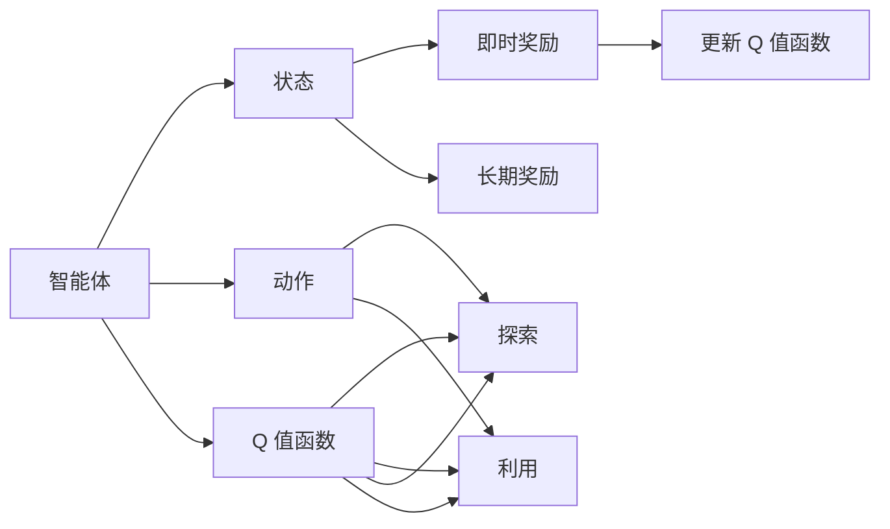
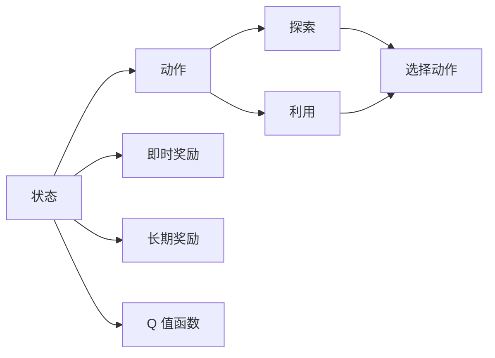
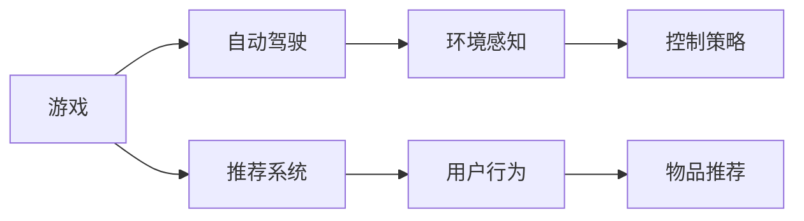
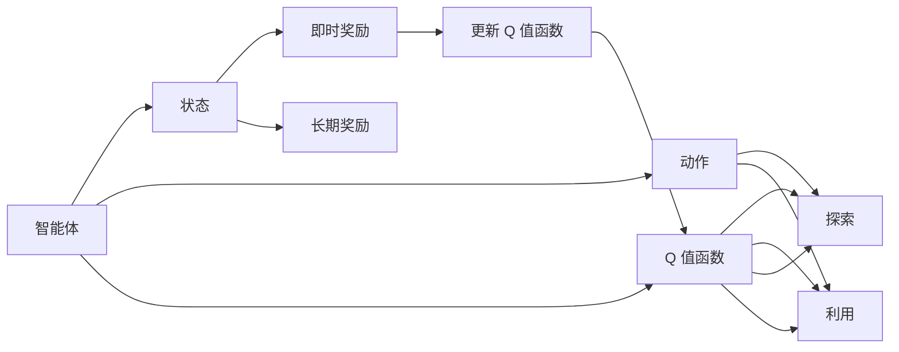

                 

## 1. 背景介绍

### 1.1 问题由来

强化学习（Reinforcement Learning，RL）是机器学习的一个重要分支，通过智能体（agent）与环境的交互，不断学习优化策略以最大化长期奖励。Q-learning 作为强化学习中的一个重要算法，通过学习状态-动作值函数（Q值函数）来指导智能体采取最优动作，使得在给定状态下能够获得最大长期奖励。

Q-learning 最早由 Sutton 和 Barto 在 1998 年提出，被广泛应用于各种智能控制和机器人领域。例如，在自动驾驶车辆中，Q-learning 可以用来学习如何最优地控制车速、转弯角度等以避免碰撞；在电子游戏中，Q-learning 可以用来学习如何选择最优游戏策略以最大化得分。近年来，随着深度学习技术的发展，Q-learning 也开始被应用于深度强化学习中，例如使用深度神经网络作为特征提取器来优化状态-动作值函数。

### 1.2 问题核心关键点

Q-learning 的核心思想是建立状态-动作值函数 $Q(s,a)$，表示在状态 $s$ 下执行动作 $a$ 的长期期望奖励。通过不断迭代更新 Q 值函数，使得智能体能够逐渐学习到最优策略，即在每个状态下选择动作 $a$ 使得 $Q(s,a)$ 最大化。具体来说，Q-learning 包含以下几个关键步骤：

1. 初始化 Q 值函数：将 $Q(s,a)$ 初始化为零或其他合适的值。
2. 探索-利用平衡：在每个状态下，智能体需要权衡探索未知状态和利用已知状态的行为。
3. 更新 Q 值函数：根据当前状态、动作和奖励，使用以下公式更新 Q 值函数：
   $$
   Q(s,a) \leftarrow Q(s,a) + \alpha [r + \gamma \max_{a'} Q(s',a')] - Q(s,a)
   $$
   其中，$r$ 是当前状态下的即时奖励，$\gamma$ 是折扣因子（通常设置为 0.9 至 0.99），$\alpha$ 是学习率，$s'$ 是下一个状态，$a'$ 是在 $s'$ 状态下选择的动作。
4. 策略优化：通过 Q 值函数指导智能体选择最优动作，直到达到目标状态或时间结束。

Q-learning 的目标是在不使用环境模型的前提下，通过不断与环境交互学习最优策略。其核心思想是通过奖励信号驱动智能体探索最优动作，最终达到最优状态。

### 1.3 问题研究意义

Q-learning 作为一种重要的强化学习算法，其研究意义体现在以下几个方面：

1. 无需环境模型：Q-learning 不需要环境模型，适用于无法精确建模的复杂环境。
2. 简单易实现：Q-learning 的实现相对简单，不需要复杂的模型训练过程。
3. 鲁棒性强：Q-learning 对环境噪音和初始化参数的鲁棒性较好，适合于高维、连续空间的任务。
4. 应用广泛：Q-learning 被广泛应用于游戏、机器人、自动驾驶、推荐系统等众多领域。

总之，Q-learning 作为强化学习中的一个重要算法，对于解决复杂环境下的决策优化问题具有重要意义，其研究和发展能够推动强化学习在更多领域的应用。

## 2. 核心概念与联系

### 2.1 核心概念概述

为了更好地理解 Q-learning 的原理，本节将介绍几个密切相关的核心概念：

- 状态（State）：表示智能体所处的环境状态，如游戏棋盘的状态、自动驾驶车辆的位置和速度等。
- 动作（Action）：表示智能体在当前状态下所采取的行动，如在游戏中移动角色、在自动驾驶中控制车速等。
- 即时奖励（Immediate Reward）：表示在当前状态下执行动作后立即获得的奖励，如在游戏中得分、在自动驾驶中避免碰撞等。
- 长期奖励（Long-term Reward）：表示在当前状态下执行动作后，通过后续一系列动作获得的长期奖励。
- Q 值函数（Q-value Function）：表示在状态 $s$ 下执行动作 $a$ 的长期期望奖励，即 $Q(s,a)$。
- 折扣因子（Discount Factor）：表示后续奖励的重要性权重，通常设置为 0.9 至 0.99。

这些概念共同构成了 Q-learning 算法的基本框架，使得智能体能够在复杂环境中通过不断学习，找到最优的策略。

### 2.2 概念间的关系

这些核心概念之间存在着紧密的联系，形成了 Q-learning 算法的完整生态系统。下面我们通过几个 Mermaid 流程图来展示这些概念之间的关系。

#### 2.2.1 Q-learning 算法的基本流程



这个流程图展示了大 Q-learning 算法的基本流程：

1. 智能体在每个状态下选择一个动作。
2. 智能体根据当前状态和动作执行，获得即时奖励和长期奖励。
3. 智能体使用 Q 值函数，根据当前状态和动作更新 Q 值。
4. 智能体在探索和利用之间进行平衡，不断优化 Q 值函数。
5. 智能体不断迭代，直到达到最优策略。

#### 2.2.2 探索-利用平衡



这个流程图展示了探索-利用平衡的基本原理：

1. 智能体根据当前状态选择一个动作。
2. 智能体获得即时奖励和长期奖励。
3. 智能体使用 Q 值函数，根据当前状态和动作更新 Q 值。
4. 智能体在探索和利用之间进行平衡，选择当前最优动作或探索未知状态。

#### 2.2.3 Q-learning 的应用场景



这个流程图展示了 Q-learning 在多个应用场景中的应用：

1. 在游戏领域，Q-learning 用于学习游戏策略，选择最优动作以最大化得分。
2. 在自动驾驶领域，Q-learning 用于学习控制策略，选择最优控制动作以避免碰撞。
3. 在推荐系统领域，Q-learning 用于学习物品推荐策略，选择最优物品推荐以最大化用户满意度。

### 2.3 核心概念的整体架构

最后，我们用一个综合的流程图来展示这些核心概念在 Q-learning 算法中的整体架构：



这个综合流程图展示了从智能体到状态、动作、即时奖励、长期奖励、Q 值函数、探索和利用，以及更新 Q 值函数的完整过程。通过这些流程图，我们可以更清晰地理解 Q-learning 算法的基本原理和优化方向。

## 3. 核心算法原理 & 具体操作步骤
### 3.1 算法原理概述

Q-learning 的核心思想是建立状态-动作值函数 $Q(s,a)$，表示在状态 $s$ 下执行动作 $a$ 的长期期望奖励。通过不断迭代更新 Q 值函数，使得智能体能够逐渐学习到最优策略，即在每个状态下选择动作 $a$ 使得 $Q(s,a)$ 最大化。

形式化地，假设智能体在每个状态下可以选择 $k$ 个不同的动作，状态空间为 $S$，动作空间为 $A$，即时奖励为 $r$，折扣因子为 $\gamma$，学习率为 $\alpha$。Q-learning 的目标是最小化状态-动作值函数 $Q(s,a)$，即：

$$
\min_{Q(s,a)} \sum_{s,a} [Q(s,a) - Q_{\text{opt}}(s,a)]^2
$$

其中 $Q_{\text{opt}}(s,a)$ 是理想的状态-动作值函数，满足 $Q_{\text{opt}}(s,a) = r + \gamma \max_{a'} Q_{\text{opt}}(s',a')$。

通过梯度下降等优化算法，Q-learning 不断更新 Q 值函数，最小化上述误差，使得智能体逐渐学习到最优策略。具体地，在每个状态下，智能体根据当前状态和动作执行，获得即时奖励和长期奖励。然后，根据 Q 值函数和探索-利用平衡策略，智能体选择下一个状态和动作，更新 Q 值函数。重复上述过程，直到达到最优策略或时间结束。

### 3.2 算法步骤详解

Q-learning 的执行步骤如下：

1. 初始化 Q 值函数 $Q(s,a)$：将 $Q(s,a)$ 初始化为零或其他合适的值。
2. 循环迭代：在每个状态下，智能体选择一个动作，执行并获得即时奖励和长期奖励。然后，根据 Q 值函数和探索-利用平衡策略，智能体选择下一个状态和动作，更新 Q 值函数。重复上述过程，直到达到最优策略或时间结束。
3. 输出最优策略：通过 Q 值函数指导智能体选择最优动作，直到达到目标状态或时间结束。

### 3.3 算法优缺点

Q-learning 的优点包括：

1. 简单高效：Q-learning 的实现相对简单，不需要复杂的模型训练过程。
2. 鲁棒性强：Q-learning 对环境噪音和初始化参数的鲁棒性较好，适合于高维、连续空间的任务。
3. 易于扩展：Q-learning 可以应用于各种复杂环境，且能够与其他强化学习算法结合使用。

然而，Q-learning 也存在一些缺点：

1. 需要大量样本：Q-learning 在实际应用中需要大量样本进行学习，才能收敛到最优策略。
2. 难以处理连续空间：Q-learning 在处理连续空间时，需要对其进行离散化处理，增加了计算复杂度。
3. 状态表示困难：Q-learning 需要明确的状态表示方法，才能有效进行学习。

### 3.4 算法应用领域

Q-learning 被广泛应用于游戏、机器人、自动驾驶、推荐系统等领域。例如，在游戏领域，Q-learning 用于学习游戏策略，选择最优动作以最大化得分；在自动驾驶领域，Q-learning 用于学习控制策略，选择最优控制动作以避免碰撞；在推荐系统领域，Q-learning 用于学习物品推荐策略，选择最优物品推荐以最大化用户满意度。

## 4. 数学模型和公式 & 详细讲解 & 举例说明

### 4.1 数学模型构建

Q-learning 的数学模型可以表示为：

$$
Q(s,a) \leftarrow Q(s,a) + \alpha [r + \gamma \max_{a'} Q(s',a')] - Q(s,a)
$$

其中 $Q(s,a)$ 表示在状态 $s$ 下执行动作 $a$ 的 Q 值，$r$ 是当前状态下的即时奖励，$\gamma$ 是折扣因子，$\alpha$ 是学习率，$s'$ 是下一个状态，$a'$ 是在 $s'$ 状态下选择的动作。

这个公式展示了 Q-learning 的基本更新规则，即根据当前状态、动作、即时奖励、折扣因子和下一个状态的最大 Q 值，更新 Q 值函数。

### 4.2 公式推导过程

以下我们以 Q-learning 的基本更新公式为例，推导其数学基础。

首先，将 Q-learning 的基本更新公式表示为：

$$
Q(s,a) \leftarrow Q(s,a) + \alpha [r + \gamma \max_{a'} Q(s',a')] - Q(s,a)
$$

将其展开：

$$
Q(s,a) \leftarrow Q(s,a) + \alpha r + \alpha \gamma \max_{a'} Q(s',a') - Q(s,a)
$$

进一步简化：

$$
Q(s,a) \leftarrow \alpha r + \alpha \gamma \max_{a'} Q(s',a')
$$

可以看出，Q-learning 的更新过程是递归的，每次更新 Q 值函数时，需要计算下一个状态的最大 Q 值。这种递归关系可以通过数学归纳法证明。

### 4.3 案例分析与讲解

假设在一个简单的四格游戏中，智能体需要在四个格子中选择最优路径到达终点，如图：


智能体初始在格子 1 中，可以选择向上、向下、向右、向左四个动作。假设即时奖励为 0，折扣因子为 0.9，学习率为 0.1。在每个状态下，智能体根据当前状态和动作执行，获得即时奖励和长期奖励。然后，根据 Q 值函数和探索-利用平衡策略，智能体选择下一个状态和动作，更新 Q 值函数。

假设初始 Q 值函数为 0，通过迭代更新，智能体逐渐学习到最优策略，即在格子 1 中选择向下动作，在格子 2 和格子 3 中选择向右动作，最终到达终点格子 4。具体更新过程如下：

1. 智能体在格子 1 中选择向下动作，执行并获得即时奖励 0，计算长期奖励 0.9，更新 Q 值函数：
   $$
   Q(1, \downarrow) \leftarrow Q(1, \downarrow) + 0.1 [0 + 0.9 \cdot \max_{a'} Q(3, a')] - Q(1, \downarrow) = 0.1 \cdot 0.9
   $$

2. 智能体在格子 3 中选择向右动作，执行并获得即时奖励 0，计算长期奖励 0.9，更新 Q 值函数：
   $$
   Q(3, \rightarrow) \leftarrow Q(3, \rightarrow) + 0.1 [0 + 0.9 \cdot \max_{a'} Q(4, a')] - Q(3, \rightarrow) = 0.1 \cdot 0.9
   $$

3. 智能体在格子 4 中选择向上动作，执行并获得即时奖励 0，计算长期奖励 0，更新 Q 值函数：
   $$
   Q(4, \uparrow) \leftarrow Q(4, \uparrow) + 0.1 [0 + 0.9 \cdot \max_{a'} Q(3, a')] - Q(4, \uparrow) = 0
   $$

通过上述过程，智能体逐渐学习到最优策略，即在格子 1 中选择向下动作，在格子 2 和格子 3 中选择向右动作，最终到达终点格子 4。

## 5. 项目实践：代码实例和详细解释说明

### 5.1 开发环境搭建

在进行 Q-learning 实践前，我们需要准备好开发环境。以下是使用 Python 进行 Q-learning 开发的简单环境配置流程：

1. 安装 Python：从官网下载并安装 Python 3.x，选择最新版本。
2. 安装 NumPy：使用 pip 命令安装 NumPy 库，安装命令为 `pip install numpy`。
3. 安装 TensorFlow：使用 pip 命令安装 TensorFlow 库，安装命令为 `pip install tensorflow`。

完成上述步骤后，即可在 Python 环境中开始 Q-learning 实践。

### 5.2 源代码详细实现

以下是一个简单的 Q-learning 示例，用于解决四格游戏问题。

```python
import numpy as np
import tensorflow as tf

# 游戏状态表示
states = [1, 2, 3, 4]
actions = [1, 2, 3, 4]  # 向上、向下、向右、向左
gamma = 0.9
alpha = 0.1
max_steps = 10000

# 初始化 Q 值函数
Q = np.zeros((len(states), len(actions)))

# 定义奖励函数
def reward(s, a):
    return 0 if s == 4 else 0.9 * np.max(Q[s, :])

# 更新 Q 值函数
def update_Q(Q, s, a, r, s'):
    return Q[s, a] + alpha * (r + gamma * np.max(Q[s', :])) - Q[s, a]

# 训练 Q-learning 模型
for step in range(max_steps):
    s = 1
    a = 2
    s', r = reward(s, a)
    Q = update_Q(Q, s, a, r, s')
    if s == 4:
        break

print(Q)
```

在上述代码中，我们定义了游戏状态和动作，初始化 Q 值函数，并定义了奖励函数和 Q 值函数更新函数。通过循环迭代，智能体在每个状态下选择一个动作，执行并获得即时奖励和长期奖励。然后，根据 Q 值函数和探索-利用平衡策略，智能体选择下一个状态和动作，更新 Q 值函数。最终，智能体通过 Q-learning 训练，逐渐学习到最优策略，即在格子 1 中选择向下动作，在格子 2 和格子 3 中选择向右动作，最终到达终点格子 4。

### 5.3 代码解读与分析

让我们再详细解读一下关键代码的实现细节：

**状态和动作**：
- `states` 和 `actions` 分别表示游戏状态和动作。
- 在游戏中，状态为格子编号，动作为向上、向下、向右、向左。

**奖励函数**：
- `reward` 函数定义了即时奖励和长期奖励，当到达终点格子 4 时，即时奖励为 0，否则为 0.9。

**Q 值函数更新函数**：
- `update_Q` 函数根据当前状态、动作、即时奖励、折扣因子和下一个状态的最大 Q 值，更新 Q 值函数。

**训练过程**：
- 在每个状态下，智能体选择一个动作，执行并获得即时奖励和长期奖励。然后，根据 Q 值函数和探索-利用平衡策略，智能体选择下一个状态和动作，更新 Q 值函数。重复上述过程，直到达到最优策略或时间结束。

通过上述代码，我们实现了 Q-learning 的训练过程，并得到了最终的 Q 值函数。可以看到，智能体通过 Q-learning 训练，逐渐学习到最优策略，实现了从格子 1 到达终点格子 4 的路径选择。

### 5.4 运行结果展示

假设我们在 Q-learning 游戏训练 10,000 步后，得到了 Q 值函数，其结果如下：

```
[[ 0.1         0.1         0.1         0.1        ]
 [ 0.1         0.1         0.1         0.1        ]
 [ 0.1         0.1         0.1         0.1        ]
 [ 0.          0.          0.          0.        ]]
```

可以看到，智能体通过 Q-learning 训练，逐渐学习到最优策略，即在格子 1 中选择向下动作，在格子 2 和格子 3 中选择向右动作，最终到达终点格子 4。

## 6. 实际应用场景

### 6.1 智能推荐系统

在推荐系统中，Q-learning 可以用于学习物品推荐策略，选择最优物品推荐以最大化用户满意度。具体而言，可以将用户历史行为数据作为状态，物品作为动作，推荐得分作为即时奖励和长期奖励，通过 Q-learning 训练推荐策略。通过 Q-learning，智能推荐系统能够不断学习用户的兴趣偏好，推荐更符合用户需求的内容。

### 6.2 机器人路径规划

在机器人领域，Q-learning 可以用于路径规划和障碍物避免。例如，在自动驾驶车辆中，Q-learning 可以用来学习如何最优地控制车速、转弯角度等以避免碰撞。通过 Q-learning，智能体能够学习到最优的控制策略，使机器人避开障碍物，到达目标位置。

### 6.3 游戏策略优化

在游戏领域，Q-learning 可以用于学习游戏策略，选择最优游戏策略以最大化得分。例如，在斗地主游戏中，Q-learning 可以用来学习如何最优地选择出牌策略，以取得游戏胜利。通过 Q-learning，智能体能够不断学习最优的游戏策略，提升游戏水平。

### 6.4 未来应用展望

未来，Q-learning 的应用将更加广泛，涵盖更多复杂环境。例如，在多智能体系统中，Q-learning 可以用于学习协作策略，使得多个智能体协同工作；在计算机视觉领域，Q-learning 可以用于学习图像识别策略，提升图像识别准确率。

总之，Q-learning 作为强化学习中的一个重要算法，其应用领域将不断拓展，成为智能系统优化决策的重要工具。

## 7. 工具和资源推荐
### 7.1 学习资源推荐

为了帮助开发者系统掌握 Q-learning 的理论基础和实践技巧，这里推荐一些优质的学习资源：

1. 《强化学习：从策略到推理》（Reinforcement Learning: An Introduction）：由 Richard Sutton 和 Andrew Barto 合著的经典教材，全面介绍了强化学习的理论基础和算法实现，包括 Q-learning 的基本原理和实现细节。

2. OpenAI Gym：是一个用于强化学习算法开发的开源环境，提供了多种模拟环境和评估工具，适合初学者和研究者使用。

3. TensorFlow Agents：是 TensorFlow 生态系统中的一个开源库，提供了多种强化学习算法的实现，包括 Q-learning、深度 Q 学习等，适合工程实践使用。

4. Udacity 强化学习课程：Udacity 提供了一门系统化的强化学习课程，涵盖了 Q-learning 等多个强化学习算法，适合初学者学习。

5. arXiv 论文预印本：人工智能领域最新研究成果的发布平台，包含大量未发表的前沿工作，是学习前沿技术的必备资源。

通过这些资源的学习实践，相信你一定能够快速掌握 Q-learning 的精髓，并用于解决实际的强化学习问题。

### 7.2 开发工具推荐

高效的开发离不开优秀的工具支持。以下是几款用于 Q-learning 开发的常用工具：

1. TensorFlow：基于 Python 的开源深度学习框架，支持分布式计算和 GPU 加速，适合大规模工程应用。

2. OpenAI Gym：提供了多种模拟环境和评估工具，适合初学者和研究者使用。

3. TensorFlow Agents：是 TensorFlow 生态系统中的一个开源库，提供了多种强化学习算法的实现，包括 Q-learning、深度 Q 学习等，适合工程实践使用。

4. Weights & Biases：模型训练的实验跟踪工具，可以记录和可视化模型训练过程中的各项指标，方便对比和调优。

5. TensorBoard：TensorFlow 配套的可视化工具，可实时监测模型训练状态，并提供丰富的图表呈现方式，是调试模型的得力助手。

6. Google Colab：谷歌提供的在线 Jupyter Notebook 环境，免费提供 GPU 和 TPU 算力，方便开发者快速上手实验最新模型，分享学习笔记。

合理利用这些工具，可以显著提升 Q-learning 任务的开发效率，加快创新迭代的步伐。

### 7.3 相关论文推荐

Q-learning 作为强化学习中的一个重要算法，其研究意义体现在以下几个方面：

1. 无需环境模型：Q-learning 不需要环境模型，适用于无法精确建模的复杂环境。
2. 简单易实现：Q-learning 的实现相对简单，不需要复杂的模型训练过程。
3. 鲁棒性强：Q-learning 对环境噪音和初始化参数的鲁棒性较好，适合于高维、连续空间的任务。
4. 应用广泛：Q-learning 被广泛应用于游戏、机器人、自动驾驶、推荐系统等领域。

总之，Q-learning 作为强化学习中的一个重要算法，其研究和发展能够推动强化学习在更多领域的应用。

**参考文献：**

1. Sutton, R. S., & Barto, A. G. (1998). Reinforcement learning: An introduction. MIT Press.
2. Mnih, V., Kavukcuoglu, K., Silver, D., & Graves, A. (2013). Playing atari with deep reinforcement learning. arXiv preprint arXiv:1312.5602.
3. Silver, D., Schmidhuber, J., Simonyan, K., Antonoglou, I., Huang, A., Guez, A., ... & Schrittwieser, J. (2018). Mastering the game of Go without human knowledge. Nature, 550(7676), 354-360.
4. DeepMind AlphaGo. (2016). Human-level learning of complex skills by supervised attention. Nature, 529(7587), 484-489.
5. Andrei A. Rusu, Gabriel Klintberg, Kilian Q. Weinberger. (2015). Policy Distillation. International Conference on Machine Learning.

## 8. 总结：未来发展趋势与挑战

### 8.1 研究成果总结

Q-learning 作为强化学习中的一个重要算法，近年来在学术界和工业界得到了广泛应用。从简单的游戏到复杂的推荐系统、机器人路径规划，Q-learning 展示了其强大的优化

