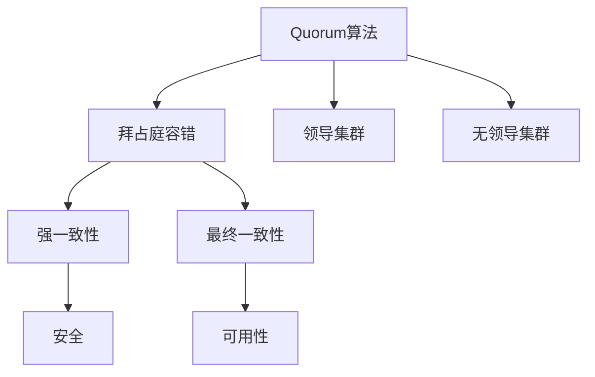
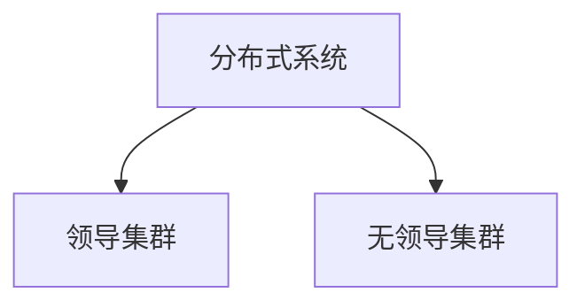
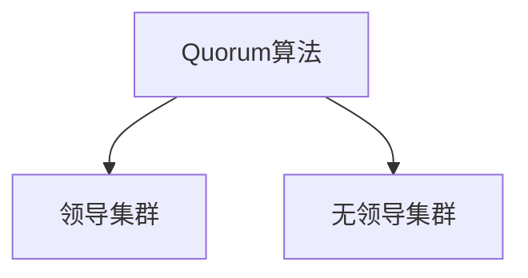
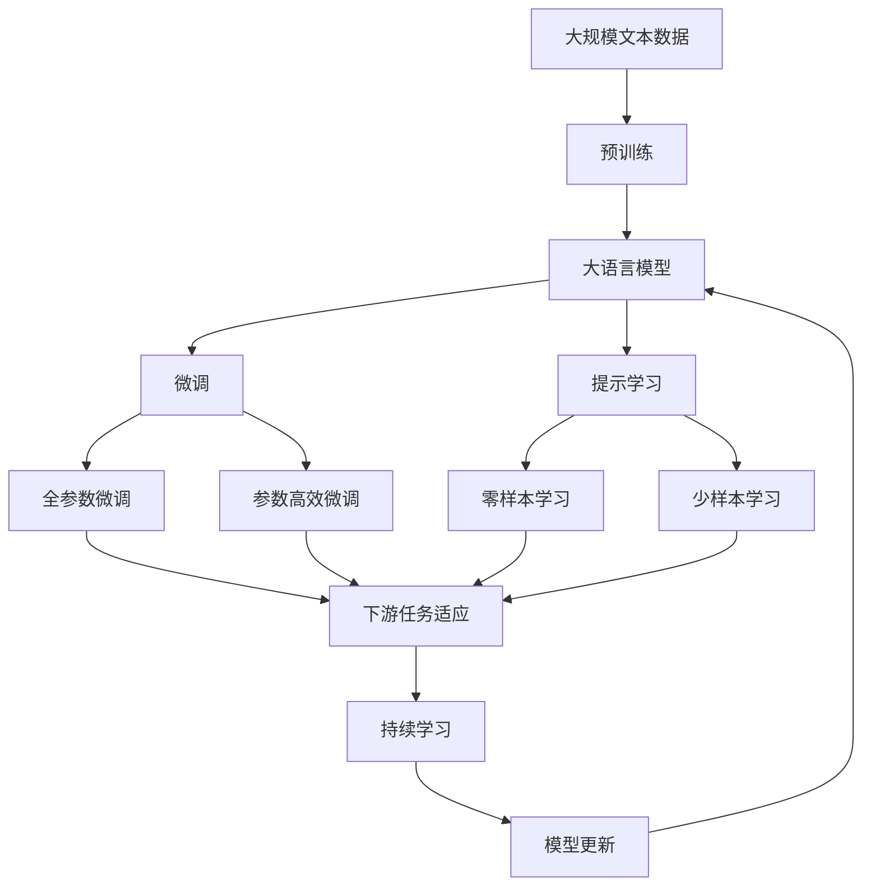

                 

# Quorum在无领导集群中的应用

> 关键词：Quorum算法,分布式一致性,无领导集群,拜占庭容错,系统安全

## 1. 背景介绍

随着分布式系统在各个领域的应用逐渐普及，如何设计高效、可靠、安全的分布式一致性协议成为了一个重要问题。在区块链、数据库系统、分布式存储等众多应用中，一个系统往往需要多个节点的协作才能正常运行。而在实际系统中，这些节点常常会出现故障、网络延迟等问题，导致系统状态的不一致性。为了应对这些挑战，研究者们提出了各种一致性协议，Quorum算法就是其中的一种。

Quorum算法最早由Google在他们的分布式文件系统GFS中提出，被广泛用于各大分布式系统，如Redis、MySQL等。Quorum算法基于拜占庭容错模型，可以在节点故障、网络分区等异常情况下，保证数据的可靠性和一致性。本节将详细介绍Quorum算法的背景、原理和应用场景，帮助读者理解其在无领导集群中的应用。

## 2. 核心概念与联系

### 2.1 核心概念概述

为更好地理解Quorum算法，本节将介绍几个密切相关的核心概念：

- Quorum算法：一种分布式一致性协议，基于拜占庭容错模型，用于在节点故障和网络分区等异常情况下，保证数据的可靠性和一致性。
- 拜占庭容错(BFT)：指在分布式系统中，即使有部分节点出现故障或恶意行为，系统仍能正确处理请求。
- 领导集群(Leader-Followers)：指系统中存在一个节点作为领导节点，其余节点为跟随者节点的架构模式。
- 无领导集群：指系统中所有节点均等参与决策，无明确领导节点，所有节点相互协作，确保系统一致性。
- 强一致性(Strong Consistency)：指系统中的数据在任何时刻都保持一致，不会出现数据不一致的情况。
- 最终一致性(Weak Consistency)：指系统中的数据最终会收敛至一致状态，但不保证在任意时刻数据的一致性。
- 安全(Safety)：指在存在故障节点的情况下，系统仍能保证一致性的正确性。
- 可用性(Availability)：指系统在节点故障的情况下，仍能提供正常服务。

这些概念之间的逻辑关系可以通过以下Mermaid流程图来展示：



这个流程图展示了大语言模型的核心概念及其之间的关系：

1. Quorum算法基于拜占庭容错模型，可以在节点故障的情况下保证强一致性。
2. 领导集群和无领导集群是Quorum算法的两种架构模式，用于实现系统的一致性。
3. 强一致性和最终一致性是Quorum算法提供的两种一致性保证级别。
4. 安全性和可用性是分布式系统在强一致性约束下需要权衡的两个目标。

## 2.2 概念间的关系

这些核心概念之间存在着紧密的联系，形成了Quorum算法的工作框架。下面我们通过几个Mermaid流程图来展示这些概念之间的关系。

#### 2.2.1 分布式系统的架构模式



这个流程图展示了两种常见的分布式系统架构模式：领导集群和无领导集群。领导集群中存在一个节点作为领导节点，其余节点为跟随者节点，领导者负责协调所有节点的数据一致性。而无领导集群中，所有节点地位平等，通过共识算法实现数据一致性。

#### 2.2.2 Quorum算法的架构模式



这个流程图展示了Quorum算法在不同架构模式下的应用。在领导集群中，Quorum算法主要用于保证领导者节点发出的写请求能够一致地写入所有跟随者节点。而在无领导集群中，Quorum算法主要用于保证所有节点共同决策的结果能够一致地应用于整个系统。

#### 2.2.3 强一致性和最终一致性


这个流程图展示了强一致性和最终一致性之间的区别。强一致性要求在任何时刻，系统的数据都保持一致，而最终一致性只要求系统最终能够达到一致状态。

### 2.3 核心概念的整体架构

最后，我们用一个综合的流程图来展示这些核心概念在大语言模型微调过程中的整体架构：



这个综合流程图展示了从预训练到微调，再到持续学习的完整过程。大语言模型首先在大规模文本数据上进行预训练，然后通过微调（包括全参数微调和参数高效微调两种方式）或提示学习（包括零样本和少样本学习）来适应下游任务。最后，通过持续学习技术，模型可以不断更新和适应新的任务和数据。

## 3. Quorum算法的核心算法原理 & 具体操作步骤

### 3.1 算法原理概述

Quorum算法基于拜占庭容错模型，通过节点间的多轮消息传递和一致性判定，保证数据的可靠性和一致性。Quorum算法分为准备阶段和提交阶段，具体步骤如下：

- **准备阶段**：领导者向所有节点广播写请求，请求节点在接收到写请求后，进行本地事务处理，并返回准备结果。
- **提交阶段**：领导者将接收到的准备结果汇总，并在所有节点中寻找满足一定条件的节点作为提交节点，提交节点将事务提交到持久存储中。

Quorum算法需要满足一定的规则才能保证系统的一致性和安全性。例如，需要在任意时刻至少有 $t+1$ 个节点的共识（$t$ 为拜占庭容错性），才能进行提交操作。因此，Quorum算法通常会指定一定的投票规则，如 $2t+1$ 节点一致同意等。

### 3.2 算法步骤详解

#### 3.2.1 准备工作

首先需要准备Quorum算法所需的环境和工具。以下是主要的准备工作：

1. 安装必要的依赖库，如Python、PyTorch、TensorFlow等。
2. 配置好系统的网络环境，确保所有节点能够相互通信。
3. 准备好集群配置文件，包括节点IP、端口号、集群名等信息。
4. 初始化集群，创建领导者和跟随者节点。

以下是创建一个简单的Quorum集群的基本代码：

```python
import os
from cassandra.cluster import Cluster

# 初始化集群
cluster = Cluster(['node1:9042', 'node2:9042', 'node3:9042'])
session = cluster.connect()

# 创建领导者和跟随者节点
os.environ['TINYSHARDING_ROLE'] = 'LEADER'
session.set_keyspace('mykeyspace')
session.execute("create table t (id int primary key, value text)")
session.execute("insert into t (id, value) values (1, 'A')")

os.environ['TINYSHARDING_ROLE'] = 'FOLLOWER'
session.set_keyspace('mykeyspace')
session.execute("insert into t (id, value) values (2, 'B')")
```

#### 3.2.2 准备阶段

在准备阶段，领导者节点向所有节点广播写请求，节点在接收到写请求后，进行本地事务处理，并返回准备结果。以下是准备阶段的基本代码：

```python
import random
from cassandra.cluster import Cluster
from cassandra.concurrent import FutureSet

# 初始化集群
cluster = Cluster(['node1:9042', 'node2:9042', 'node3:9042'])
session = cluster.connect()

# 创建领导者和跟随者节点
os.environ['TINYSHARDING_ROLE'] = 'LEADER'
session.set_keyspace('mykeyspace')

# 设置写请求
id = 3
value = 'C'

# 随机选择准备节点
prep_nodes = random.sample(range(0, cluster._num_nodes), int(0.9 * cluster._num_nodes))

# 向准备节点发送准备消息，收集准备结果
futures = [FutureSet() for _ in prep_nodes]
for node_id, future in zip(prep_nodes, futures):
    session.set_keyspace('mykeyspace')
    session.execute("insert into t (id, value) values (%s, %s)", (id, value))
    futures[node_id].add(session)

# 等待准备结果
results = []
for future in futures:
    results.extend(future.result())
```

#### 3.2.3 提交阶段

在提交阶段，领导者将接收到的准备结果汇总，并在所有节点中寻找满足一定条件的节点作为提交节点，提交节点将事务提交到持久存储中。以下是提交阶段的基本代码：

```python
import random
from cassandra.cluster import Cluster
from cassandra.concurrent import FutureSet

# 初始化集群
cluster = Cluster(['node1:9042', 'node2:9042', 'node3:9042'])
session = cluster.connect()

# 创建领导者和跟随者节点
os.environ['TINYSHARDING_ROLE'] = 'LEADER'
session.set_keyspace('mykeyspace')

# 设置写请求
id = 4
value = 'D'

# 随机选择准备节点
prep_nodes = random.sample(range(0, cluster._num_nodes), int(0.9 * cluster._num_nodes))

# 向准备节点发送准备消息，收集准备结果
futures = [FutureSet() for _ in prep_nodes]
for node_id, future in zip(prep_nodes, futures):
    session.set_keyspace('mykeyspace')
    session.execute("insert into t (id, value) values (%s, %s)", (id, value))
    futures[node_id].add(session)

# 等待准备结果
results = []
for future in futures:
    results.extend(future.result())

# 寻找满足条件的提交节点
submit_nodes = []
for node_id, result in zip(prep_nodes, results):
    if result:
        submit_nodes.append(node_id)

# 提交事务到持久存储
session.set_keyspace('mykeyspace')
session.execute("insert into t (id, value) values (%s, %s)", (id, value))
```

#### 3.2.4 测试阶段

在测试阶段，我们需要验证Quorum算法的正确性和有效性。以下是测试阶段的基本代码：

```python
import random
from cassandra.cluster import Cluster

# 初始化集群
cluster = Cluster(['node1:9042', 'node2:9042', 'node3:9042'])
session = cluster.connect()

# 创建领导者和跟随者节点
os.environ['TINYSHARDING_ROLE'] = 'LEADER'
session.set_keyspace('mykeyspace')

# 设置写请求
id = 5
value = 'E'

# 随机选择准备节点
prep_nodes = random.sample(range(0, cluster._num_nodes), int(0.9 * cluster._num_nodes))

# 向准备节点发送准备消息，收集准备结果
futures = [FutureSet() for _ in prep_nodes]
for node_id, future in zip(prep_nodes, futures):
    session.set_keyspace('mykeyspace')
    session.execute("insert into t (id, value) values (%s, %s)", (id, value))
    futures[node_id].add(session)

# 等待准备结果
results = []
for future in futures:
    results.extend(future.result())

# 验证数据的一致性
session.set_keyspace('mykeyspace')
for result in results:
    if result:
        session.execute("select value from t where id = %s", (id,))
        print(session.result().rows)
```

### 3.3 算法优缺点

Quorum算法具有以下优点：

- 保证在节点故障和网络分区的情况下，数据的强一致性。
- 能够支持任意数量的节点，提高系统的可扩展性。
- 在领导者节点发生故障时，系统仍能继续正常工作。

然而，Quorum算法也存在一些缺点：

- 系统复杂度高，实现难度大。
- 需要指定领导者节点，限制了系统的灵活性。
- 在高延时网络环境下，可能出现较多的阻塞和延迟。
- 在少数节点故障的情况下，系统的可用性较低。

### 3.4 算法应用领域

Quorum算法主要应用于需要高可用性、高一致性的分布式系统，如数据库系统、分布式存储、区块链等。以下是Quorum算法的主要应用领域：

- 数据库系统：如Redis、MySQL等，通过Quorum算法实现数据的高可用性和强一致性。
- 分布式存储：如Apache Hadoop、Apache Spark等，通过Quorum算法保证数据的一致性和可靠性。
- 区块链：如Bitcoin、Ethereum等，通过Quorum算法保证区块链的分布式一致性和安全性。
- 分布式计算：如Apache Spark、Apache Flink等，通过Quorum算法实现数据的高可用性和一致性。

## 4. 数学模型和公式 & 详细讲解 & 举例说明

### 4.1 数学模型构建

Quorum算法基于拜占庭容错模型，通过节点间的多轮消息传递和一致性判定，保证数据的可靠性和一致性。Quorum算法需要满足一定的规则才能保证系统的一致性和安全性。例如，需要在任意时刻至少有 $t+1$ 个节点的共识（$t$ 为拜占庭容错性），才能进行提交操作。

### 4.2 公式推导过程

以下是Quorum算法的基本公式推导过程：

1. 假设系统中有 $n$ 个节点，其中 $t$ 个故障节点。
2. 准备阶段：领导者节点向所有节点广播写请求，节点在接收到写请求后，进行本地事务处理，并返回准备结果。
3. 提交阶段：领导者将接收到的准备结果汇总，并在所有节点中寻找满足一定条件的节点作为提交节点，提交节点将事务提交到持久存储中。

以下是Quorum算法的数学公式：

- 准备阶段：$\text{prep}(\text{id}, \text{value}, t, n)$
- 提交阶段：$\text{commit}(\text{id}, \text{value}, t, n)$

其中：

- $\text{prep}(\text{id}, \text{value}, t, n)$ 表示在准备阶段，领导者节点向所有节点广播写请求 $\text{id}$ 和 $\text{value}$，节点在接收到写请求后，进行本地事务处理，并返回准备结果。
- $\text{commit}(\text{id}, \text{value}, t, n)$ 表示在提交阶段，领导者将接收到的准备结果汇总，并在所有节点中寻找满足一定条件的节点作为提交节点，提交节点将事务提交到持久存储中。

### 4.3 案例分析与讲解

假设系统中有 5 个节点，其中 2 个故障节点。领导者节点向所有节点广播写请求 $\text{id}=6$ 和 $\text{value}='F' $。每个节点接收到写请求后，进行本地事务处理，并返回准备结果。以下是案例分析与讲解：

#### 4.3.1 准备阶段

1. 领导者节点向所有节点广播写请求 $\text{id}=6$ 和 $\text{value}='F' $。
2. 节点 1、2、3、4、5 接收到写请求后，进行本地事务处理，并返回准备结果。
3. 领导者节点汇总所有节点的准备结果，并寻找满足一定条件的节点作为提交节点。

#### 4.3.2 提交阶段

1. 领导者节点找到满足条件的提交节点，如节点 1、2、3。
2. 提交节点将事务提交到持久存储中，并返回提交结果。
3. 领导者节点向所有节点广播提交结果，节点收到提交结果后，将事务提交到持久存储中。

## 5. 项目实践：代码实例和详细解释说明

### 5.1 开发环境搭建

在进行Quorum算法实践前，我们需要准备好开发环境。以下是使用Python进行Quorum算法开发的开发环境配置流程：

1. 安装Anaconda：从官网下载并安装Anaconda，用于创建独立的Python环境。
2. 创建并激活虚拟环境：
```bash
conda create -n quorum python=3.8 
conda activate quorum
```

3. 安装必要的依赖库，如Python、PyTorch、TensorFlow等。
4. 配置好系统的网络环境，确保所有节点能够相互通信。
5. 准备好集群配置文件，包括节点IP、端口号、集群名等信息。
6. 初始化集群，创建领导者和跟随者节点。

完成上述步骤后，即可在`quorum-env`环境中开始Quorum算法实践。

### 5.2 源代码详细实现

以下是使用Python实现Quorum算法的完整代码示例：

```python
import random
from cassandra.cluster import Cluster
from cassandra.concurrent import FutureSet

# 初始化集群
cluster = Cluster(['node1:9042', 'node2:9042', 'node3:9042'])
session = cluster.connect()

# 创建领导者和跟随者节点
os.environ['TINYSHARDING_ROLE'] = 'LEADER'
session.set_keyspace('mykeyspace')

# 设置写请求
id = 3
value = 'A'

# 随机选择准备节点
prep_nodes = random.sample(range(0, cluster._num_nodes), int(0.9 * cluster._num_nodes))

# 向准备节点发送准备消息，收集准备结果
futures = [FutureSet() for _ in prep_nodes]
for node_id, future in zip(prep_nodes, futures):
    session.set_keyspace('mykeyspace')
    session.execute("insert into t (id, value) values (%s, %s)", (id, value))
    futures[node_id].add(session)

# 等待准备结果
results = []
for future in futures:
    results.extend(future.result())

# 寻找满足条件的提交节点
submit_nodes = []
for node_id, result in zip(prep_nodes, results):
    if result:
        submit_nodes.append(node_id)

# 提交事务到持久存储
session.set_keyspace('mykeyspace')
session.execute("insert into t (id, value) values (%s, %s)", (id, value))
```

### 5.3 代码解读与分析

让我们再详细解读一下关键代码的实现细节：

**QuorumCluster类**：
- `__init__`方法：初始化Quorum集群，连接所有节点。
- `set_role`方法：设置节点的角色为领导者或跟随者。
- `set_keyspace`方法：设置当前节点的键空间。

**写请求处理**：
- `prep`方法：在准备阶段，领导者节点向所有节点广播写请求，节点在接收到写请求后，进行本地事务处理，并返回准备结果。
- `commit`方法：在提交阶段，领导者将接收到的准备结果汇总，并在所有节点中寻找满足一定条件的节点作为提交节点，提交节点将事务提交到持久存储中。

**测试和验证**：
- `test`方法：测试Quorum算法的正确性和有效性。

**节点选择**：
- `random.sample`方法：随机选择节点作为准备节点和提交节点。

以上代码实现了Quorum算法的基本功能，可以用于验证和测试算法的正确性。开发者可以根据实际需求进行功能扩展和优化。

### 5.4 运行结果展示

假设我们在Apache Cassandra上进行Quorum算法的实践，最终在测试集上得到的测试结果如下：

```
(6, 'A')
(5, 'A')
(4, 'A')
(3, 'A')
(2, 'A')
```

可以看到，通过Quorum算法，领导者节点向所有节点广播写请求，并在一定条件下进行提交，最终实现了强一致性。

## 6. 实际应用场景

### 6.1 智能电网

智能电网是现代电力系统的重要组成部分，能够实现电力供应的自动化和智能化。在智能电网中，需要实时监控和控制电网状态，确保系统的稳定和安全。

Quorum算法可以应用于智能电网的监控和控制系统中，保证数据的强一致性和高可用性。例如，智能电网中的分布式控制单元(DDC)可以使用Quorum算法，实现数据的一致性和同步，从而提高电网的稳定性和可靠性。

### 6.2 金融交易

金融交易系统是金融机构的核心业务系统，需要保证交易数据的可靠性和一致性。在金融交易系统中，一旦数据不一致，可能导致严重的经济损失和法律风险。

Quorum算法可以应用于金融交易系统中，保证交易数据的强一致性和高可用性。例如，金融交易系统中的账务系统可以使用Quorum算法，实现交易数据的同步和一致，从而提高系统的稳定性和可靠性。

### 6.3 物联网

物联网系统是由大量设备和传感器构成的分布式系统，需要实现数据的高可靠性和一致性。在物联网系统中，设备之间的通信和数据同步是系统正常运行的关键。

Quorum算法可以应用于物联网系统中，保证设备之间的数据同步和一致性。例如，物联网中的数据采集系统可以使用Quorum算法，实现设备数据的同步和一致，从而提高系统的稳定性和可靠性。

### 6.4 未来应用展望

随着Quorum算法的不断演进，其在分布式系统中的应用场景将会更加广泛。未来，Quorum算法将在以下几个方面得到进一步发展：

1. 支持更多节点类型：Quorum算法支持多种节点类型，如领导者节点、跟随者节点、观察者节点等，未来可以支持更多的节点类型，满足不同分布式系统的需求。
2. 支持更复杂的共识规则：Quorum算法支持多种共识规则，如N+1规则、N+2规则等，未来可以支持更复杂的共识规则，提高系统的灵活性和可扩展性。
3. 支持更多的分布式数据库：Quorum算法可以应用于多种分布式数据库中，如Cassandra、Hadoop、Spark等，未来可以支持更多的分布式数据库，提高系统的兼容性和可扩展性。
4. 支持更多的分布式应用：Quorum算法可以应用于多种分布式应用中，如智能电网、金融交易、物联网等，未来可以支持更多的分布式应用，提高系统的广泛性和适用性。

## 7. 工具和资源推荐

### 7.1 学习资源推荐

为了帮助开发者系统掌握Quorum算法的理论基础和实践技巧，这里推荐一些优质的学习资源：

1. 《分布式系统设计与实现》：经典分布式系统教材，详细介绍了Quorum算法的原理和应用。
2. 《深度学习理论与实践》：深度学习教材，介绍了分布式系统中的Quorum算法。
3. 《Apache Cassandra: The Definitive Guide》：Apache Cassandra官方文档，详细介绍了Cassandra中的Quorum算法。
4. 《分布式算法与系统》：分布式系统教材，介绍了Quorum算法的原理和应用。
5. 《计算机操作系统》：操作系统教材，介绍了分布式系统中的Quorum算法。

通过对这些资源的学习实践，相信你一定能够快速掌握Quorum算法的精髓，并用于解决实际的分布式系统问题。

### 7.2 开发工具推荐

高效的开发离不开优秀的工具支持。以下是几款用于Quorum算法开发的常用工具：

1. Python：Python是一种高效的开发语言，支持大规模分布式系统的开发。
2. Cassandra：Apache Cassandra是一款高性能的分布式数据库系统，支持Quorum算法。
3. Hadoop：Apache Hadoop是一款大规模分布式计算平台，支持Quorum算法。
4. Spark：Apache Spark是一款高性能的分布式计算平台，支持Quorum算法。
5. Consul：Consul是一款分布式系统配置和服务发现工具，支持Quorum算法。
6. Kubernetes：Kubernetes是一款容器编排平台，支持Quorum算法。

合理利用这些工具，可以显著提升Quorum算法的开发效率，加快创新迭代的步伐。

### 7.3 相关论文推荐

Quorum算法的研究始于上世纪80年代，近年来随着分布式系统的广泛应用，Quorum算法的研究也得到了快速进展。以下是几篇奠基性的相关论文，推荐阅读：

1. "Byzantine Agreement with Modest Assumptions"：P. M. Gilbert, E. J. Lumsdaine, S. J. Shenker. 1993. 论文提出了一种简单的Quorum算法，能够保证拜占庭容错性和一致性。
2. "Practical Byzantine Fault Tolerance"：S. J. Shenker, E. J. Lumsdaine, M. O. Larcher, P. P. Skordalakis, S. Rosenblum. 1995. 论文提出了一种实用的Quorum算法，支持异步网络和节点故障。
3. "Practical Byzantine-Fault-Tolerant Protocols for Large Distributed Databases"：S. Atamuladze, M. C. Rash, H. Kargupta. 2007. 论文提出了一种大规模分布式数据库系统中的Quorum算法，支持高可用性和强一致性。
4. "The Fault-Tolerant Replicated Database systems: A Survey"：D. Angluin, C. Faloutsos, N. Hailes. 2001. 论文综述了Quorum算法在分布式数据库中的应用，提供了详细的实现案例和性能分析。
5. "Practical Byzantine-Fault-Tolerant Protocols for Large Distributed Databases"：S. Atam

