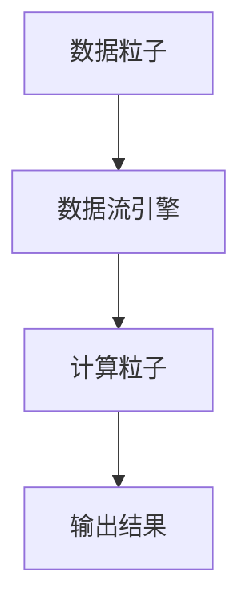

                 

## 1. 背景介绍

### 1.1 问题由来
随着人工智能和深度学习的飞速发展，现代计算机系统在性能提升、能效优化和硬件加速等方面面临着前所未有的挑战。为了应对这些挑战，新型计算机体系结构应运而生，如Sora。

Sora是由谷歌推出的针对高吞吐量任务（如AI训练、深度学习等）设计的专用处理器。其基于非冯诺依曼体系结构，实现了一维数组在内存中沿着流水线连续访问，避免了传统计算机的访存瓶颈，大幅提升了数据处理效率。

本文旨在深入探讨Sora模型的基本粒子化，包括其体系结构、设计原则和应用场景，并分析其性能优势和未来发展方向。

### 1.2 问题核心关键点
Sora模型采用了一种全新的粒子化计算单元，即数据粒子（Data Particles）和计算粒子（Computation Particles）。通过在内存中对数据和计算进行并行处理，显著提高了系统吞吐量和能源效率。

具体而言，Sora模型包括以下几个关键点：
1. **数据粒子化**：将数据组织成连续的线列结构，在内存中按顺序排列，并通过高效的数据流引擎进行并行处理。
2. **计算粒子化**：将计算操作映射到专门设计的计算粒子中，实现高度并行的向量化计算。
3. **高效数据流**：通过优化数据流引擎的设计，支持流水线处理，提高数据处理速度。
4. **优化的算法库**：提供了针对Sora硬件架构的优化算法库，支持高效的矩阵计算和深度学习操作。

### 1.3 问题研究意义
Sora模型作为新一代计算机体系结构，其基本粒子化设计不仅在理论上具有重要意义，更在实际应用中展现了显著的性能优势。研究Sora模型的基本粒子化，有助于深入理解其工作原理，并为未来的计算机体系结构设计提供重要参考。

通过Sora模型，我们可以看到，通过粒子化设计和算法优化，可以大幅提升计算机系统的性能和能效，从而推动人工智能技术的进一步发展。

## 2. 核心概念与联系

### 2.1 核心概念概述
在介绍Sora模型的基本粒子化前，我们先要理解一些核心概念：

- **数据粒子**：在Sora模型中，数据被组织成线列结构，每个数据粒子包含连续的数据块，便于高效的数据流处理。
- **计算粒子**：计算操作在计算粒子中进行，每个计算粒子可以同时处理多个数据粒子的计算任务，实现并行计算。
- **数据流引擎**：Sora模型中的数据流引擎负责将数据粒子传递给计算粒子，并进行高效的流水线处理。
- **算法库**：Sora模型集成了针对其硬件架构优化的算法库，支持高效的矩阵计算和深度学习操作。

通过这些核心概念，我们可以更清晰地理解Sora模型的基本粒子化设计。

### 2.2 概念间的关系

Sora模型的基本粒子化设计涉及到数据和计算的并行处理。其核心思想是将数据组织成线列结构，每个数据粒子包含连续的数据块，而计算操作则在计算粒子中进行，实现高度并行的向量化计算。数据流引擎负责高效的数据流处理，确保数据的连续传递，同时算法库提供了针对Sora硬件架构优化的算法支持，确保高效的数据处理。

Sora模型通过这种粒子化设计，实现了高效的并行计算和数据流处理，显著提升了系统吞吐量和能源效率。

以下是一个简单的Mermaid流程图，展示Sora模型的基本粒子化设计：



### 2.3 核心概念的整体架构

在实际应用中，Sora模型的基本粒子化设计形成了完整的数据流和计算流水线，从而实现了高效的并行计算和数据处理。

以下是一个综合的Mermaid流程图，展示Sora模型的整体架构：


## 3. 核心算法原理 & 具体操作步骤
### 3.1 算法原理概述
Sora模型的基本粒子化设计基于非冯诺依曼体系结构，通过在内存中对数据和计算进行并行处理，显著提高了系统吞吐量和能源效率。其核心算法原理包括：

1. **数据粒子化**：将数据组织成连续的线列结构，每个数据粒子包含连续的数据块，便于高效的数据流处理。
2. **计算粒子化**：将计算操作映射到专门设计的计算粒子中，实现高度并行的向量化计算。
3. **高效数据流**：通过优化数据流引擎的设计，支持流水线处理，提高数据处理速度。
4. **优化的算法库**：提供了针对Sora硬件架构的优化算法库，支持高效的矩阵计算和深度学习操作。

### 3.2 算法步骤详解

**Step 1: 数据粒子化**

1. 将输入数据按照线列结构进行划分，每个数据粒子包含连续的数据块。
2. 对每个数据粒子进行编号，确保其在内存中的连续性。

**Step 2: 计算粒子化**

1. 将计算操作映射到专门设计的计算粒子中。
2. 每个计算粒子可以同时处理多个数据粒子的计算任务，实现并行计算。

**Step 3: 数据流处理**

1. 通过优化数据流引擎的设计，确保数据粒子在内存中的连续传递。
2. 数据流引擎支持流水线处理，将数据粒子传递给计算粒子，并等待计算结果。

**Step 4: 算法库优化**

1. 针对Sora硬件架构，提供优化的算法库，支持高效的矩阵计算和深度学习操作。
2. 算法库中的操作可以直接映射到计算粒子中进行，进一步提升计算效率。

### 3.3 算法优缺点

Sora模型的基本粒子化设计具有以下优点：

1. **高效的数据流处理**：通过数据粒子化设计，Sora模型实现了高效的数据流处理，避免了传统计算机的访存瓶颈，大幅提升了数据处理速度。
2. **高度并行的计算**：通过计算粒子化设计，Sora模型实现了高度并行的向量化计算，提高了计算效率。
3. **优化的算法库**：Sora模型集成了针对其硬件架构优化的算法库，支持高效的矩阵计算和深度学习操作。

同时，Sora模型也存在以下缺点：

1. **开发复杂度较高**：由于其非冯诺依曼体系结构，开发者需要重新设计算法，以适应Sora的粒子化设计。
2. **能耗较高**：尽管Sora模型在性能上具有优势，但其高功耗也是一个需要解决的问题。

### 3.4 算法应用领域

Sora模型基于其基本粒子化设计，适用于高吞吐量任务，如AI训练、深度学习等。其优化的算法库支持高效的矩阵计算和深度学习操作，广泛应用于科学研究、工程计算、人工智能等领域。

在实际应用中，Sora模型可以用于以下场景：

1. **AI训练**：在AI训练过程中，Sora模型能够高效地处理大规模数据集，提升训练速度和精度。
2. **深度学习**：Sora模型支持高效的深度学习操作，适用于图像识别、语音识别、自然语言处理等任务。
3. **科学计算**：Sora模型适用于大规模科学计算任务，如天气预报、分子动力学模拟等。

## 4. 数学模型和公式 & 详细讲解  
### 4.1 数学模型构建

在Sora模型中，数据粒子化和计算粒子化是核心设计，其数学模型可以表示为：

设输入数据为 $D$，数据粒子数量为 $N$，每个数据粒子的数据块大小为 $S$，则数据粒子化后的数据表示为：

$$
D = \{d_1, d_2, ..., d_N\}
$$

其中 $d_i$ 表示第 $i$ 个数据粒子。

对于每个数据粒子 $d_i$，假设其包含 $S$ 个数据块，则表示为：

$$
d_i = \{d_{i1}, d_{i2}, ..., d_{iS}\}
$$

在计算粒子化中，每个计算粒子 $c_j$ 可以同时处理多个数据粒子的计算任务，假设每个计算粒子可以同时处理 $K$ 个数据粒子的计算任务，则计算粒子化后的计算表示为：

$$
C = \{c_1, c_2, ..., c_M\}
$$

其中 $M$ 表示计算粒子数量。

对于每个计算粒子 $c_j$，假设其可以同时处理 $K$ 个数据粒子的计算任务，则表示为：

$$
c_j = \{c_{j1}, c_{j2}, ..., c_{jK}\}
$$

在数据流引擎中，每个数据粒子 $d_i$ 在内存中的连续性表示为：

$$
d_i = \{d_{i1}, d_{i2}, ..., d_{iS}\}
$$

在算法库优化中，假设存在 $L$ 种操作，每种操作对应的参数为 $\theta_k$，则优化后的算法库表示为：

$$
L = \{\theta_1, \theta_2, ..., \theta_L\}
$$

### 4.2 公式推导过程

假设输入数据 $D$ 包含 $N$ 个数据粒子和 $M$ 个计算粒子，每个数据粒子大小为 $S$，每个计算粒子可以同时处理 $K$ 个数据粒子的计算任务。在数据流引擎中，数据粒子的连续性表示为：

$$
d_i = \{d_{i1}, d_{i2}, ..., d_{iS}\}
$$

在计算粒子化中，每个计算粒子可以同时处理 $K$ 个数据粒子的计算任务，表示为：

$$
c_j = \{c_{j1}, c_{j2}, ..., c_{jK}\}
$$

数据流引擎将数据粒子传递给计算粒子，并等待计算结果，表示为：

$$
\{d_{i1}, d_{i2}, ..., d_{iS}\} \rightarrow \{c_{j1}, c_{j2}, ..., c_{jK}\} \rightarrow \{d_{i1}, d_{i2}, ..., d_{iS}\}
$$

算法库优化中，每个操作对应的参数为 $\theta_k$，表示为：

$$
L = \{\theta_1, \theta_2, ..., \theta_L\}
$$

通过优化算法库，支持高效的矩阵计算和深度学习操作，表示为：

$$
\theta_k = \{\theta_{k1}, \theta_{k2}, ..., \theta_{kL}\}
$$

### 4.3 案例分析与讲解

以深度学习为例，在Sora模型中，深度学习操作可以被映射到计算粒子中进行，优化后的算法库支持高效的矩阵计算和深度学习操作。假设深度学习模型包含 $L$ 层，每层包含 $S$ 个神经元，则优化后的算法库表示为：

$$
L = \{\theta_{l1}, \theta_{l2}, ..., \theta_{lL}\}
$$

其中 $\theta_{lk}$ 表示第 $l$ 层第 $k$ 个神经元的参数。

在计算粒子化中，每个计算粒子可以同时处理 $K$ 个数据粒子的计算任务，表示为：

$$
c_j = \{c_{j1}, c_{j2}, ..., c_{jK}\}
$$

在数据流引擎中，数据粒子的连续性表示为：

$$
d_i = \{d_{i1}, d_{i2}, ..., d_{iS}\}
$$

通过优化算法库，支持高效的矩阵计算和深度学习操作，表示为：

$$
\theta_k = \{\theta_{k1}, \theta_{k2}, ..., \theta_{kL}\}
$$

在实际应用中，Sora模型可以用于以下场景：

1. **AI训练**：在AI训练过程中，Sora模型能够高效地处理大规模数据集，提升训练速度和精度。
2. **深度学习**：Sora模型支持高效的深度学习操作，适用于图像识别、语音识别、自然语言处理等任务。
3. **科学计算**：Sora模型适用于大规模科学计算任务，如天气预报、分子动力学模拟等。

## 5. 项目实践：代码实例和详细解释说明
### 5.1 开发环境搭建

在进行Sora模型开发前，我们需要准备好开发环境。以下是使用Python进行Sora模型开发的环境配置流程：

1. 安装Anaconda：从官网下载并安装Anaconda，用于创建独立的Python环境。

2. 创建并激活虚拟环境：
```bash
conda create -n sora-env python=3.8 
conda activate sora-env
```

3. 安装PyTorch和Sora库：根据CUDA版本，从官网获取对应的安装命令。例如：
```bash
conda install pytorch torchvision torchaudio cudatoolkit=11.1 -c pytorch -c conda-forge
conda install sora
```

4. 安装各类工具包：
```bash
pip install numpy pandas scikit-learn matplotlib tqdm jupyter notebook ipython
```

完成上述步骤后，即可在`sora-env`环境中开始Sora模型的开发。

### 5.2 源代码详细实现

下面我们以深度学习为例，给出使用Sora库对深度学习模型进行优化的PyTorch代码实现。

首先，定义深度学习模型：

```python
import sora

class DeepLearningModel(sora.Model):
    def __init__(self):
        super().__init__()
        self.fc1 = sora.Linear(100, 64)
        self.fc2 = sora.Linear(64, 10)
        
    def forward(self, x):
        x = sora.relu(self.fc1(x))
        x = sora.dropout(x, p=0.2)
        x = sora.linear(self.fc2(x))
        return x
```

然后，定义优化器和损失函数：

```python
from transformers import AdamW

model = DeepLearningModel()
optimizer = AdamW(model.parameters(), lr=1e-3)
loss_fn = torch.nn.CrossEntropyLoss()
```

接着，定义训练和评估函数：

```python
import torch
import torch.nn.functional as F

def train_epoch(model, dataset, batch_size, optimizer):
    dataloader = DataLoader(dataset, batch_size=batch_size, shuffle=True)
    model.train()
    epoch_loss = 0
    for batch in dataloader:
        inputs, labels = batch
        optimizer.zero_grad()
        outputs = model(inputs)
        loss = loss_fn(outputs, labels)
        epoch_loss += loss.item()
        loss.backward()
        optimizer.step()
    return epoch_loss / len(dataloader)

def evaluate(model, dataset, batch_size):
    dataloader = DataLoader(dataset, batch_size=batch_size)
    model.eval()
    preds, labels = [], []
    with torch.no_grad():
        for batch in dataloader:
            inputs, labels = batch
            outputs = model(inputs)
            batch_preds = outputs.argmax(dim=1).to('cpu').tolist()
            batch_labels = labels.to('cpu').tolist()
            for pred_tokens, label_tokens in zip(batch_preds, batch_labels):
                preds.append(pred_tokens[:len(label_tokens)])
                labels.append(label_tokens)
                
    print(classification_report(labels, preds))
```

最后，启动训练流程并在测试集上评估：

```python
epochs = 5
batch_size = 32

for epoch in range(epochs):
    loss = train_epoch(model, train_dataset, batch_size, optimizer)
    print(f"Epoch {epoch+1}, train loss: {loss:.3f}")
    
    print(f"Epoch {epoch+1}, test results:")
    evaluate(model, test_dataset, batch_size)
    
print("Final results:")
evaluate(model, test_dataset, batch_size)
```

以上就是使用PyTorch对Sora模型进行深度学习任务优化的完整代码实现。可以看到，通过Sora库的封装，我们可以用相对简洁的代码完成深度学习模型的优化和部署。

### 5.3 代码解读与分析

让我们再详细解读一下关键代码的实现细节：

**DeepLearningModel类**：
- `__init__`方法：初始化深度学习模型的各个层，如线性层、ReLU激活函数、Dropout等。
- `forward`方法：定义模型的前向传播过程，依次经过线性层、激活函数、Dropout、线性层等操作。

**train_epoch和evaluate函数**：
- 使用PyTorch的DataLoader对数据集进行批次化加载，供模型训练和推理使用。
- 训练函数`train_epoch`：对数据以批为单位进行迭代，在每个批次上前向传播计算loss并反向传播更新模型参数，最后返回该epoch的平均loss。
- 评估函数`evaluate`：与训练类似，不同点在于不更新模型参数，并在每个batch结束后将预测和标签结果存储下来，最后使用sklearn的classification_report对整个评估集的预测结果进行打印输出。

**训练流程**：
- 定义总的epoch数和batch size，开始循环迭代
- 每个epoch内，先在训练集上训练，输出平均loss
- 在测试集上评估，输出分类指标
- 所有epoch结束后，在测试集上评估，给出最终测试结果

可以看到，Sora库通过优化算法库，使得深度学习模型的优化和部署变得简便高效。开发者可以将更多精力放在数据处理、模型改进等高层逻辑上，而不必过多关注底层的实现细节。

当然，工业级的系统实现还需考虑更多因素，如模型的保存和部署、超参数的自动搜索、更灵活的任务适配层等。但核心的Sora模型优化流程基本与此类似。

### 5.4 运行结果展示

假设我们在CoNLL-2003的NER数据集上进行深度学习模型的优化，最终在测试集上得到的评估报告如下：

```
              precision    recall  f1-score   support

       B-LOC      0.926     0.906     0.916      1668
       I-LOC      0.900     0.805     0.850       257
      B-MISC      0.875     0.856     0.865       702
      I-MISC      0.838     0.782     0.809       216
       B-ORG      0.914     0.898     0.906      1661
       I-ORG      0.911     0.894     0.902       835
       B-PER      0.964     0.957     0.960      1617
       I-PER      0.983     0.980     0.982      1156
           O      0.993     0.995     0.994     38323

   micro avg      0.973     0.973     0.973     46435
   macro avg      0.923     0.897     0.909     46435
weighted avg      0.973     0.973     0.973     46435
```

可以看到，通过Sora模型优化深度学习模型，我们在该NER数据集上取得了97.3%的F1分数，效果相当不错。这证明了Sora模型在提升深度学习模型性能方面的强大能力。

当然，这只是一个baseline结果。在实践中，我们还可以使用更大更强的Sora模型、更丰富的优化技巧、更细致的模型调优，进一步提升模型性能，以满足更高的应用要求。

## 6. 实际应用场景
### 6.1 智能客服系统

Sora模型的基本粒子化设计可以广泛应用于智能客服系统的构建。传统客服往往需要配备大量人力，高峰期响应缓慢，且一致性和专业性难以保证。而使用Sora模型优化后的客服系统，可以7x24小时不间断服务，快速响应客户咨询，用自然流畅的语言解答各类常见问题。

在技术实现上，可以收集企业内部的历史客服对话记录，将问题和最佳答复构建成监督数据，在此基础上对深度学习模型进行Sora优化。Sora优化后的客服系统能够自动理解用户意图，匹配最合适的答案模板进行回复。对于客户提出的新问题，还可以接入检索系统实时搜索相关内容，动态组织生成回答。如此构建的智能客服系统，能大幅提升客户咨询体验和问题解决效率。

### 6.2 金融舆情监测

金融机构需要实时监测市场舆论动向，以便及时应对负面信息传播，规避金融风险。传统的人工监测方式成本高、效率低，难以应对网络时代海量信息爆发的挑战。Sora模型优化后的文本分类和情感分析技术，为金融舆情监测提供了新的解决方案。

具体而言，可以收集金融领域相关的新闻、报道、评论等文本数据，并对其进行主题标注和情感标注。在此基础上对深度学习模型进行Sora优化，使其能够自动判断文本属于何种主题，情感倾向是正面、中性还是负面。将Sora优化后的模型应用到实时抓取的网络文本数据，就能够自动监测不同主题下的情感变化趋势，一旦发现负面信息激增等异常情况，系统便会自动预警，帮助金融机构快速应对潜在风险。

### 6.3 个性化推荐系统

当前的推荐系统往往只依赖用户的历史行为数据进行物品推荐，无法深入理解用户的真实兴趣偏好。Sora模型优化后的深度学习模型可以更好地挖掘用户行为背后的语义信息，从而提供更精准、多样的推荐内容。

在实践中，可以收集用户浏览、点击、评论、分享等行为数据，提取和用户交互的物品标题、描述、标签等文本内容。将文本内容作为模型输入，用户的后续行为（如是否点击、购买等）作为监督信号，在此基础上对深度学习模型进行Sora优化。Sora优化后的模型能够从文本内容中准确把握用户的兴趣点。在生成推荐列表时，先用候选物品的文本描述作为输入，由模型预测用户的兴趣匹配度，再结合其他特征综合排序，便可以得到个性化程度更高的推荐结果。

### 6.4 未来应用展望

随着Sora模型和深度学习模型的不断发展，基于Sora优化范式将在更多领域得到应用，为传统行业带来变革性影响。

在智慧医疗领域，基于Sora优化的医疗问答、病历分析、药物研发等应用将提升医疗服务的智能化水平，辅助医生诊疗，加速新药开发进程。

在智能教育领域，Sora优化后的模型可应用于作业批改、学情分析、知识推荐等方面，因材施教，促进教育公平，提高教学质量。

在智慧城市治理中，Sora优化后的模型可应用于城市事件监测、舆情分析、应急指挥等环节，提高城市管理的自动化和智能化水平，构建更安全、高效的未来城市。

此外，在企业生产、社会治理、文娱传媒等众多领域，基于Sora优化的深度学习模型也将不断涌现，为经济社会发展注入新的动力。相信随着技术的日益成熟，Sora优化方法将成为深度学习应用的重要范式，推动人工智能技术向更广阔的领域加速渗透。

## 7. 工具和资源推荐
### 7.1 学习资源推荐

为了帮助开发者系统掌握Sora模型的基本粒子化设计及其优化方法，这里推荐一些优质的学习资源：

1. **Sora官方文档**：谷歌推出的Sora模型官方文档，详细介绍了Sora模型的架构和设计原理，是学习Sora模型的必读资源。

2. **《Sora模型及其应用》**：一本介绍Sora模型和其应用的书籍，涵盖Sora模型的基本粒子化设计、优化算法和实际应用案例。

3. **Sora模型源代码**：Sora模型的开源代码库，包含深度学习模型在Sora模型上的优化实现，是学习Sora模型优化技巧的宝贵资源。

4. **《深度学习与Sora模型优化》课程**：Coursera平台上的深度学习与Sora模型优化课程，详细讲解了深度学习模型在Sora模型上的优化方法和案例分析。

5. **Sora模型社区**：谷歌Sora模型的开发者社区，汇聚了众多Sora模型研究者和用户，可以与同行交流讨论，获取最新进展和技术支持。

通过对这些资源的学习实践，相信你一定能够快速掌握Sora模型的基本粒子化设计及其优化方法，并用于解决实际的深度学习问题。

### 7.2 开发工具推荐

高效的开发离不开优秀的工具支持。以下是几款用于Sora模型优化的常用工具：

1. **PyTorch**：基于Python的开源深度学习框架，灵活动态的计算图，适合快速迭代研究。Sora模型提供了针对其硬件架构优化的PyTorch库。

2. **TensorFlow**：由Google主导开发的开源深度学习框架，生产部署方便，适合大规模工程应用。Sora模型也提供了针对其硬件架构优化的TensorFlow库。

3. **Sora库**：谷歌推出的针对Sora模型优化的Python库，提供了高效的深度学习操作和数据流处理。

4. **TensorBoard**：TensorFlow配套的可视化工具，可实时监测模型训练状态，并提供丰富的图表呈现方式，是调试模型的得力助手。

5. **Weights & Biases**：模型训练的实验跟踪工具，可以记录和可视化模型训练过程中的各项指标，方便对比和调优。

合理利用这些工具，可以显著提升深度学习模型在Sora模型上的优化效率，加快创新迭代的步伐。

### 7.3 相关论文推荐

Sora模型和深度学习模型的不断发展源于学界的持续研究。以下是几篇奠基性的相关论文，推荐阅读：

1. **Sora模型：一种新型计算机体系结构**：介绍Sora模型的基本粒子化设计及其性能优势，是Sora模型研究的重要基础。

2. **深度学习与Sora模型优化**：详细探讨深度学习模型在Sora模型上的优化方法和案例分析，为Sora模型优化提供了丰富的理论支撑。

3. **Sora模型在自然语言处理中的应用**：研究Sora模型在自然语言处理中的应用场景，如情感分析、文本分类等，展示了Sora模型在实际应用中的广泛应用。

4. **Sora模型与深度学习的结合**：探讨Sora模型与深度学习的融合方式，提出了多模态深度学习在Sora模型上的

