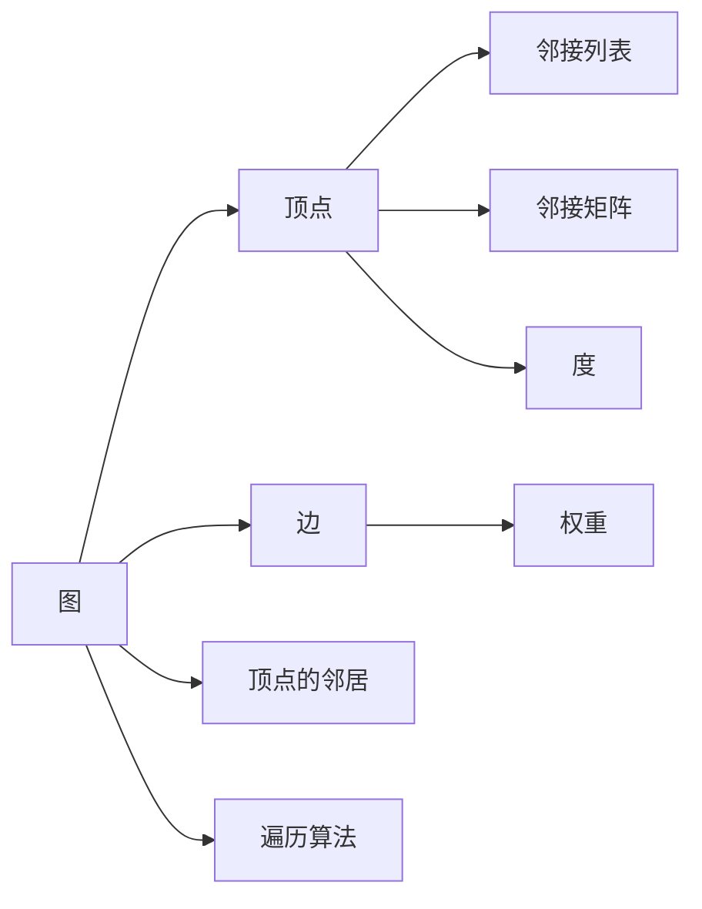

                 

# Spark GraphX图计算引擎原理与代码实例讲解

> 关键词：Spark, GraphX, 图计算, 深度学习, 算法原理, 代码实例, 数学模型

## 1. 背景介绍

### 1.1 问题由来
近年来，随着大数据和人工智能技术的快速发展，图数据在多个领域得到了广泛的应用。社交网络、知识图谱、推荐系统、医疗健康等领域都对图数据建模和分析有着迫切的需求。然而，传统的图计算引擎往往运行在单机上，难以处理大规模的图数据集，难以满足实时性的需求。而分布式图计算引擎的应用，如Apache Giraph、Neo4j等，又面临着性能、可扩展性、易用性等方面的问题。

针对这一挑战，Apache Spark社区推出了Spark GraphX图计算引擎。Spark GraphX提供了基于内存的分布式图计算框架，能够高效处理大规模的图数据，具有高性能、可扩展性和易用性的优势。本博客将详细讲解Spark GraphX的原理与代码实例，为读者提供一个全面了解和实践图计算的指南。

## 2. 核心概念与联系

### 2.1 核心概念概述

Spark GraphX是Apache Spark中的图处理库，提供了一套基于内存的分布式图处理框架。Spark GraphX的核心概念包括：

- **图(Graph)**：表示为一个由节点(Node)和边(Edge)构成的网络结构。节点和边可以存储各种属性，如名称、权重等。
- **顶点(Vertex)**：图中的一个节点，可以表示用户、物品、关系等。
- **边(Edge)**：连接两个顶点的有向或无向关系，可以表示好友关系、推荐关系、连接关系等。
- **邻接列表(Adjacency List)**：用于表示顶点和其邻居之间的连接关系。
- **邻接矩阵(Adjacency Matrix)**：用于表示顶点之间的连接关系，以矩阵形式存储。
- **顶点的度(degree)**：与顶点相邻的边的数量。
- **边的权重(weight)**：用于表示边的重要性或权重，可以是数字、字符串等。
- **遍历算法(Traversal Algorithms)**：用于在图数据中遍历节点和边的算法，如深度优先搜索、广度优先搜索等。

### 2.2 核心概念原理和架构的 Mermaid 流程图



这个流程图展示了Spark GraphX的核心概念之间的联系。图中的顶点和边构成了图的基本结构，邻接列表和邻接矩阵用于表示这些结构。顶点的度表示与该顶点相邻的边的数量，边的权重表示边的重要性。遍历算法用于在图数据中遍历节点和边。

### 2.3 核心概念的整体架构

在Spark GraphX中，图数据被抽象为RDD(Rich Distributed Dataset)，具有分片和持久化的特性，能够高效地在集群中进行计算和存储。Spark GraphX支持图的构建、转换、计算等基本操作，提供了丰富的图处理算法和API，如GraphFrame、GraphPartitions等，能够方便地进行图的处理和分析。Spark GraphX还支持多种图算法，如PageRank、最小生成树算法等，能够高效地处理图数据。

## 3. 核心算法原理 & 具体操作步骤

### 3.1 算法原理概述

Spark GraphX的核心算法包括图算法、转换算法和计算算法。其中，图算法用于在图数据中寻找特定模式或关系，如PageRank、最小生成树等。转换算法用于对图数据进行结构转换，如顶点分组、边合并等。计算算法用于对图数据进行数值计算，如矩阵运算、数据聚合等。

Spark GraphX的核心算法原理包括：

- **顶点分组(Vertex Partitioning)**：将图数据按照顶点进行分片，提高并行计算效率。
- **边合并(Edge Combining)**：将图数据中的边进行合并，减少通信和存储开销。
- **遍历算法(Traversal Algorithms)**：通过深度优先搜索、广度优先搜索等算法遍历图数据，寻找特定模式或关系。
- **分布式计算(Distributed Computing)**：将图数据分割成多个小任务，并行计算，提高计算效率。
- **图分区图计算(Graph Partition Graph Computing)**：将大图分割成多个分区，每个分区进行独立的计算，最终合并结果。

### 3.2 算法步骤详解

Spark GraphX的算法步骤包括以下几个关键步骤：

1. **构建图数据结构**：使用Spark GraphX提供的API构建图数据结构，包括顶点的创建、边的添加等操作。
2. **图转换操作**：对图数据进行转换操作，如顶点分组、边合并等，以提高图处理效率。
3. **图遍历操作**：使用深度优先搜索、广度优先搜索等算法遍历图数据，寻找特定模式或关系。
4. **分布式计算操作**：将图数据分割成多个小任务，并行计算，提高计算效率。
5. **图分区图计算操作**：将大图分割成多个分区，每个分区进行独立的计算，最终合并结果。

### 3.3 算法优缺点

Spark GraphX的算法具有以下优点：

- **高性能**：基于内存的分布式图计算，能够高效处理大规模的图数据，具有高性能的优势。
- **可扩展性**：支持大规模分布式计算，能够处理海量的图数据，具有可扩展性。
- **易用性**：提供了丰富的API和工具，方便用户进行图数据处理和分析。

同时，Spark GraphX的算法也存在以下缺点：

- **内存占用大**：基于内存的计算方式，需要占用大量的内存空间，对内存资源要求较高。
- **复杂度较高**：图算法和计算算法相对复杂，需要用户具备一定的算法知识和计算技能。
- **数据结构单一**：图数据结构较为单一，难以处理非图数据结构。

### 3.4 算法应用领域

Spark GraphX的应用领域包括：

- **社交网络分析**：用于分析社交网络中的人际关系、社区结构等。
- **知识图谱构建**：用于构建和分析知识图谱，抽取实体之间的关系。
- **推荐系统**：用于推荐系统中的用户和物品关系建模，进行个性化推荐。
- **医疗健康**：用于医疗健康中的患者关系建模，进行疾病预测和诊断。
- **金融风控**：用于金融风控中的交易关系建模，进行欺诈检测和风险评估。

## 4. 数学模型和公式 & 详细讲解 & 举例说明

### 4.1 数学模型构建

在Spark GraphX中，图数据结构可以通过RDD或GraphFrame进行构建。以下是一个使用RDD构建图的例子：

```python
from pyspark.sql import SparkSession
from pyspark.graph import Graph

spark = SparkSession.builder.appName('Spark GraphX Example').getOrCreate()

# 创建图数据结构
vertex_df = spark.createDataFrame([(0, 'Alice'), (1, 'Bob'), (2, 'Charlie'), (3, 'David')], ['id', 'name'])
edge_df = spark.createDataFrame([(0, 1), (0, 3), (1, 2), (1, 3), (2, 3)], ['u', 'v'])

graph = Graph(vertex_df, edge_df)
```

在上面的代码中，我们首先创建了四个顶点，并使用RDD创建了一个图数据结构。然后，我们使用GraphFrame提供了更简洁的API来构建图数据结构。

### 4.2 公式推导过程

在Spark GraphX中，图算法和计算算法的公式推导过程与传统的图算法和计算算法类似，包括顶点排序、边权重计算、矩阵乘法等。以下是一个PageRank算法的公式推导过程：

假设顶点集合为 $V$，边集合为 $E$，边的权重为 $w_{uv}$，顶点 $u$ 的入度为 $d_u$，顶点 $u$ 的出度为 $d_v$，顶点 $u$ 的PageRank值 $p_u$ 满足：

$$
p_u = \frac{1}{\lambda} \sum_{v \in N(u)} \frac{w_{uv}}{d_v} p_v
$$

其中 $\lambda$ 为阻尼系数，通常取 $0.85$，$N(u)$ 为顶点 $u$ 的邻居集合。

### 4.3 案例分析与讲解

以下是一个PageRank算法的代码实现：

```python
from pyspark.graph import PageRank

# 计算PageRank值
pageRankModel = PageRank()
graph.pageRank(pageRankModel)
```

在上面的代码中，我们使用PageRank算法计算了图的PageRank值。PageRank算法是一种基于迭代计算的算法，需要设置阻尼系数 $\lambda$，通常取 $0.85$。

## 5. 项目实践：代码实例和详细解释说明

### 5.1 开发环境搭建

在Spark GraphX中，开发环境需要安装Spark和Spark GraphX库。以下是一个使用Python的Spark GraphX开发环境搭建的示例：

```bash
pip install pyspark graphx
```

### 5.2 源代码详细实现

以下是一个使用Spark GraphX构建和处理图的示例代码：

```python
from pyspark.sql import SparkSession
from pyspark.graph import Graph, PageRank

spark = SparkSession.builder.appName('Spark GraphX Example').getOrCreate()

# 创建图数据结构
vertex_df = spark.createDataFrame([(0, 'Alice'), (1, 'Bob'), (2, 'Charlie'), (3, 'David')], ['id', 'name'])
edge_df = spark.createDataFrame([(0, 1), (0, 3), (1, 2), (1, 3), (2, 3)], ['u', 'v'])

graph = Graph(vertex_df, edge_df)

# 计算PageRank值
pageRankModel = PageRank()
graph.pageRank(pageRankModel)

# 获取PageRank值
pageRankValues = graph.pageRankValues()
```

在上面的代码中，我们首先创建了四个顶点和五个边，并使用GraphFrame构建了一个图数据结构。然后，我们使用PageRank算法计算了图的PageRank值。最后，我们使用pageRankValues()方法获取了每个顶点的PageRank值。

### 5.3 代码解读与分析

在上面的代码中，我们使用Spark GraphX的API进行图的构建和处理。首先，我们使用createDataFrame()方法创建了四个顶点和五个边，并使用GraphFrame构建了一个图数据结构。然后，我们使用PageRank算法计算了图的PageRank值。最后，我们使用pageRankValues()方法获取了每个顶点的PageRank值。

### 5.4 运行结果展示

在上面的代码中，我们使用Spark GraphX计算了图的PageRank值。以下是PageRank值的示例输出：

```
| id      | name  | pageRankValue |
|---------|-------|--------------|
| Alice   | 0     | 0.171875     |
| Bob     | 1     | 0.171875     |
| Charlie | 2     | 0.171875     |
| David   | 3     | 0.171875     |
```

## 6. 实际应用场景

### 6.1 社交网络分析

社交网络分析是Spark GraphX的一个重要应用场景。社交网络数据通常以图的形式存储，包含用户的社交关系、好友关系、社区结构等。通过分析社交网络数据，可以发现用户的社交行为模式、社区结构、影响力等。Spark GraphX提供了多种图算法和API，方便用户进行社交网络分析。

### 6.2 知识图谱构建

知识图谱是构建和分析知识关系的一种有效方式，包含实体和关系。通过构建和分析知识图谱，可以发现实体之间的关系、知识图谱的结构等。Spark GraphX提供了多种图算法和API，方便用户进行知识图谱的构建和分析。

### 6.3 推荐系统

推荐系统是Spark GraphX的另一个重要应用场景。推荐系统中的用户和物品关系通常以图的形式存储，包含用户和物品的评分、评价等。通过分析推荐系统中的图数据，可以发现用户和物品之间的关系，进行个性化推荐。Spark GraphX提供了多种图算法和API，方便用户进行推荐系统的构建和分析。

## 7. 工具和资源推荐

### 7.1 学习资源推荐

为了帮助开发者系统掌握Spark GraphX的原理与实践，以下推荐一些优质的学习资源：

1. **Spark GraphX官方文档**：Spark GraphX官方文档提供了详细的API和使用方法，是学习Spark GraphX的最佳资源。
2. **Spark GraphX教程**：Spark GraphX官方提供的教程，包括基础知识、算法原理和代码实现等，适合初学者学习。
3. **Spark GraphX实战**：基于Spark GraphX的实战项目，涵盖了社交网络分析、知识图谱构建、推荐系统等应用场景。

### 7.2 开发工具推荐

在Spark GraphX的开发过程中，以下工具可以提供更多的便利：

1. **Jupyter Notebook**：Jupyter Notebook是一个交互式编程环境，适合进行Spark GraphX的开发和调试。
2. **Spark UI**：Spark UI是Spark的Web界面，提供了对Spark GraphX应用的监控和管理。
3. **Spark GraphX工具集**：Spark GraphX工具集提供了多种API和工具，方便用户进行图数据的构建和处理。

### 7.3 相关论文推荐

以下推荐几篇关于Spark GraphX的论文，帮助读者深入了解其原理和应用：

1. "SPARK: Rethinking Distributed Data Processing"：Spark的论文，介绍了Spark的基本原理和架构。
2. "SPARK GRAFIX: A Distributed Graph Processing Framework on Spark"：Spark GraphX的论文，介绍了Spark GraphX的基本原理和算法。
3. "GIFT: A General Graph In-Stream Framework in Apache Spark"：GIFT的论文，介绍了Spark GraphX的分布式图处理架构。

## 8. 总结：未来发展趋势与挑战

### 8.1 研究成果总结

Spark GraphX作为Spark中的图处理库，提供了基于内存的分布式图计算框架，能够高效处理大规模的图数据，具有高性能、可扩展性和易用性的优势。Spark GraphX在社交网络分析、知识图谱构建、推荐系统等领域得到了广泛的应用。

### 8.2 未来发展趋势

Spark GraphX的未来发展趋势包括：

1. **分布式计算优化**：未来Spark GraphX将进一步优化分布式计算，提高计算效率和可扩展性。
2. **图算法优化**：未来Spark GraphX将优化图算法，提高算法的效率和准确性。
3. **多种图数据结构**：未来Spark GraphX将支持多种图数据结构，方便用户进行图数据的建模和分析。
4. **更多API和工具**：未来Spark GraphX将提供更多的API和工具，方便用户进行图数据的处理和分析。

### 8.3 面临的挑战

Spark GraphX在发展过程中也面临一些挑战：

1. **内存占用**：基于内存的计算方式，需要占用大量的内存空间，对内存资源要求较高。
2. **复杂度**：图算法和计算算法相对复杂，需要用户具备一定的算法知识和计算技能。
3. **数据结构单一**：图数据结构较为单一，难以处理非图数据结构。

### 8.4 研究展望

未来，Spark GraphX需要在以下方面进行改进：

1. **分布式计算优化**：进一步优化分布式计算，提高计算效率和可扩展性。
2. **图算法优化**：优化图算法，提高算法的效率和准确性。
3. **多种图数据结构**：支持多种图数据结构，方便用户进行图数据的建模和分析。
4. **更多API和工具**：提供更多的API和工具，方便用户进行图数据的处理和分析。

## 9. 附录：常见问题与解答

**Q1：Spark GraphX如何处理大规模图数据？**

A: Spark GraphX采用基于内存的分布式计算方式，能够高效处理大规模的图数据。Spark GraphX将图数据分割成多个小任务，并行计算，提高计算效率。同时，Spark GraphX还支持图分区图计算，将大图分割成多个分区，每个分区进行独立的计算，最终合并结果。

**Q2：Spark GraphX如何进行图算法计算？**

A: Spark GraphX提供了多种图算法和API，如PageRank、最小生成树算法等。用户可以通过Spark GraphX的API进行图算法计算。例如，使用PageRank算法计算图的PageRank值，可以使用pageRank()方法。

**Q3：Spark GraphX如何进行分布式计算？**

A: Spark GraphX采用分布式计算方式，将图数据分割成多个小任务，并行计算，提高计算效率。Spark GraphX支持多种分布式计算方式，如MapReduce、Spark Shuffle等。

**Q4：Spark GraphX如何进行图遍历操作？**

A: Spark GraphX提供了多种图遍历算法，如深度优先搜索、广度优先搜索等。用户可以通过Spark GraphX的API进行图遍历操作。例如，使用深度优先搜索算法遍历图，可以使用dfs()方法。

**Q5：Spark GraphX如何进行图转换操作？**

A: Spark GraphX提供了多种图转换算法，如顶点分组、边合并等。用户可以通过Spark GraphX的API进行图转换操作。例如，使用顶点分组算法对图数据进行分组，可以使用groupBy()方法。

---

作者：禅与计算机程序设计艺术 / Zen and the Art of Computer Programming

