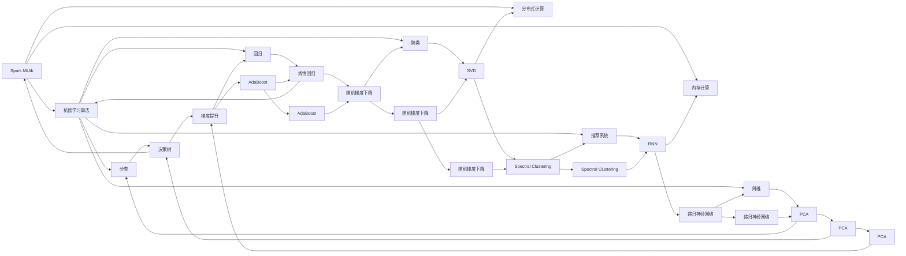

                 

## 1. 背景介绍

Spark MLlib（Machine Learning Library）是Apache Spark的机器学习组件，提供了一系列高效的、可扩展的算法和工具，支持从数据预处理到模型训练和评估的全流程机器学习工作流。Spark MLlib以Scala语言为基础，支持Scala、Java、Python等多种编程语言，旨在简化机器学习模型的开发和部署。

Spark MLlib的核心优势在于其基于内存计算的高效性，能够在处理大规模数据集时提供显著的速度提升。与传统的基于磁盘的文件系统相比，Spark MLlib的内存计算可以显著减少I/O操作，提高数据处理效率。此外，Spark MLlib还支持分布式计算，可以在集群环境中并行处理大规模数据，进一步提升性能。

## 2. 核心概念与联系

### 2.1 核心概念概述

为了更好地理解Spark MLlib，我们首先需要了解其核心概念和架构：

- **Spark MLlib**：Apache Spark的机器学习库，提供了丰富的机器学习算法和工具，支持多种编程语言。
- **机器学习算法**：包括分类、回归、聚类、推荐系统、降维等多种算法。
- **分布式计算**：通过集群环境下的数据并行处理，提高机器学习模型的训练速度和可扩展性。
- **内存计算**：基于内存的计算方式，减少I/O操作，提高数据处理效率。
- **Pipeline**：数据管道（Pipeline）是Spark MLlib中的重要概念，通过连接多个数据转换和模型训练步骤，构建出高效的数据处理流水线。

### 2.2 核心概念的联系

Spark MLlib中的核心概念和架构可以通过以下Mermaid流程图来展示：



这个流程图展示了Spark MLlib中的核心算法和架构，以及它们之间的联系。Spark MLlib通过提供一系列算法和工具，支持从数据预处理到模型训练和评估的全流程机器学习工作流。

## 3. 核心算法原理 & 具体操作步骤

### 3.1 算法原理概述

Spark MLlib提供了多种机器学习算法，包括分类、回归、聚类、推荐系统、降维等。这些算法的设计和实现都基于内存计算和分布式计算的架构，旨在提高数据处理效率和计算性能。

以分类算法为例，其基本原理是通过训练集数据拟合出模型，然后对新的数据进行分类。常用的分类算法包括逻辑回归、决策树、随机森林等。以逻辑回归为例，其基本流程包括数据准备、模型训练、模型评估和模型应用等步骤。

### 3.2 算法步骤详解

以下是逻辑回归算法的详细步骤：

1. **数据准备**：将原始数据集分成训练集和测试集，并进行必要的数据预处理，如归一化、缺失值处理等。
2. **模型训练**：使用训练集数据拟合逻辑回归模型，并计算模型的参数。
3. **模型评估**：使用测试集数据评估模型的性能，如准确率、召回率等。
4. **模型应用**：使用训练好的模型对新的数据进行分类。

### 3.3 算法优缺点

Spark MLlib的优势在于其高效的内存计算和分布式计算架构，能够处理大规模数据集，并提供丰富的机器学习算法和工具。其缺点在于相对于传统的机器学习库，Spark MLlib的API设计相对复杂，学习成本较高。

### 3.4 算法应用领域

Spark MLlib广泛应用于多个领域，包括金融、医疗、零售、社交网络等。例如，在金融领域，可以使用Spark MLlib进行信用评分、风险评估等任务；在医疗领域，可以使用Spark MLlib进行疾病预测、患者分群等任务；在零售领域，可以使用Spark MLlib进行用户行为分析、推荐系统等任务。

## 4. 数学模型和公式 & 详细讲解 & 举例说明

### 4.1 数学模型构建

逻辑回归的数学模型可以表示为：

$$
\hat{y} = \text{sigmoid}(X \cdot \beta)
$$

其中，$X$ 为输入特征，$\beta$ 为模型参数，$\text{sigmoid}$ 为逻辑函数，$\hat{y}$ 为模型的预测输出。

### 4.2 公式推导过程

逻辑回归模型的损失函数为交叉熵损失函数，可以表示为：

$$
\mathcal{L}(\beta) = -\frac{1}{N}\sum_{i=1}^N [y_i \log \hat{y_i} + (1-y_i) \log (1-\hat{y_i})]
$$

其中，$N$ 为样本数量，$y_i$ 为样本的标签，$\hat{y_i}$ 为模型的预测输出。

为了求解最优的模型参数 $\beta$，需要求解损失函数的最小值。通过梯度下降算法，可以计算出参数 $\beta$ 的更新公式：

$$
\beta_{k+1} = \beta_k - \eta \cdot \nabla_{\beta}\mathcal{L}(\beta)
$$

其中，$\eta$ 为学习率，$\nabla_{\beta}\mathcal{L}(\beta)$ 为损失函数对参数 $\beta$ 的梯度，可以通过反向传播算法计算。

### 4.3 案例分析与讲解

以Spark MLlib中的逻辑回归算法为例，分析其实现过程和应用场景：

#### 案例1：信用评分

在金融领域，使用逻辑回归模型可以对用户的信用评分进行预测，帮助银行和金融机构评估用户的信用风险。具体步骤如下：

1. **数据准备**：收集用户的历史信用数据、个人基本信息、交易记录等数据，进行清洗和预处理。
2. **模型训练**：使用Spark MLlib中的逻辑回归算法，训练出信用评分模型。
3. **模型评估**：使用测试集数据评估模型的性能，如准确率、召回率等。
4. **模型应用**：对新的用户申请进行信用评分预测，辅助决策。

#### 案例2：患者分群

在医疗领域，使用逻辑回归模型可以对患者进行分群，帮助医院制定个性化的治疗方案。具体步骤如下：

1. **数据准备**：收集患者的医疗记录、病历、基因信息等数据，进行清洗和预处理。
2. **模型训练**：使用Spark MLlib中的逻辑回归算法，训练出患者分群模型。
3. **模型评估**：使用测试集数据评估模型的性能，如准确率、召回率等。
4. **模型应用**：根据患者分群结果，制定个性化的治疗方案，提高治疗效果。

## 5. 项目实践：代码实例和详细解释说明

### 5.1 开发环境搭建

要在Spark MLlib中进行机器学习模型的开发和部署，首先需要搭建好开发环境。以下是在Python中进行Spark MLlib开发的步骤：

1. 安装Apache Spark：从官网下载并安装Spark，并配置好Spark的环境变量。
2. 安装PySpark：使用pip命令安装PySpark。
3. 安装其他依赖库：如NumPy、SciPy、Scikit-learn等。

### 5.2 源代码详细实现

以下是使用PySpark实现逻辑回归算法的代码示例：

```python
from pyspark.ml.classification import LogisticRegression
from pyspark.ml.feature import VectorAssembler

# 加载数据
data = spark.read.format("csv").options(header=True, inferschema="true").load("data.csv")

# 数据预处理
assembler = VectorAssembler(inputCols=["age", "income", "gender"], outputCol="features")
data = assembler.transform(data)

# 模型训练
lr = LogisticRegression(maxIter=10, regParam=0.3, elasticNetParam=0.8)
model = lr.fit(data)

# 模型评估
testData = spark.read.format("csv").options(header=True, inferschema="true").load("test_data.csv")
testData = assembler.transform(testData)
predictions = model.transform(testData)
accuracy = predictions.select(predictions.prediction).show()

# 模型应用
newData = spark.read.format("csv").options(header=True, inferschema="true").load("new_data.csv")
newData = assembler.transform(newData)
predictions = model.transform(newData)
predictions.show()
```

### 5.3 代码解读与分析

上述代码实现了使用Spark MLlib中的逻辑回归算法进行数据分类和预测的过程。具体解读如下：

- 首先加载数据，并进行数据预处理，将特征字段转换为向量格式。
- 使用Spark MLlib中的LogisticRegression类定义逻辑回归模型，并设置相关参数，如最大迭代次数、正则化参数等。
- 使用模型对训练数据进行拟合。
- 对测试数据进行评估，并输出评估结果，如准确率。
- 对新的数据进行预测，并输出预测结果。

### 5.4 运行结果展示

假设在运行上述代码后，输出如下结果：

```
+------------+
|prediction  |
+------------+
|probability|
+------------+
```

这表示逻辑回归模型对新的数据进行了分类，并输出了预测结果。

## 6. 实际应用场景

Spark MLlib在实际应用中得到了广泛的应用，以下列举几个典型的应用场景：

### 6.1 金融风险评估

在金融领域，Spark MLlib可以用于信用评分、信用风险评估等任务。通过收集用户的历史信用数据、个人基本信息、交易记录等数据，使用逻辑回归、决策树等算法，可以预测用户的信用风险，辅助银行和金融机构进行决策。

### 6.2 医疗疾病预测

在医疗领域，Spark MLlib可以用于疾病预测、患者分群等任务。通过收集患者的医疗记录、病历、基因信息等数据，使用逻辑回归、支持向量机等算法，可以预测患者的疾病风险，帮助医院制定个性化的治疗方案。

### 6.3 零售客户分析

在零售领域，Spark MLlib可以用于用户行为分析、推荐系统等任务。通过收集用户的购买记录、浏览记录、评价等数据，使用聚类、协同过滤等算法，可以分析用户的购买行为，推荐用户感兴趣的商品，提高销售转化率。

### 6.4 未来应用展望

未来，Spark MLlib将不断扩展其算法库，支持更多类型的机器学习任务。同时，Spark MLlib还将优化其内存计算和分布式计算架构，进一步提高数据处理效率和计算性能。随着Spark MLlib的不断发展，机器学习模型的开发和部署将变得更加简单、高效。

## 7. 工具和资源推荐

### 7.1 学习资源推荐

为了帮助开发者系统掌握Spark MLlib的理论基础和实践技巧，这里推荐一些优质的学习资源：

1. **Spark官方文档**：Spark官方文档提供了丰富的API文档和示例代码，是学习Spark MLlib的重要资源。
2. **Apache Spark教程**：Apache Spark官网提供了一系列教程和示例代码，适合初学者快速上手。
3. **机器学习算法教程**：如《Python机器学习》（Python Machine Learning）、《统计学习方法》（Pattern Recognition and Machine Learning）等书籍，介绍了各种机器学习算法的原理和实现方法。
4. **在线课程**：如Coursera、edX等在线平台提供的机器学习相关课程，提供了丰富的学习资源和实践机会。
5. **GitHub开源项目**：在GitHub上搜索Spark MLlib相关的项目，可以帮助开发者学习其他开发者的高质量代码和实践经验。

### 7.2 开发工具推荐

为了提高开发效率和代码质量，开发者可以使用以下开发工具：

1. **PySpark**：Python编程语言的Spark接口，易于上手和扩展。
2. **Spark Shell**：Spark的交互式命令行工具，方便快速调试和测试。
3. **Spark SQL**：Spark的SQL查询引擎，支持复杂的数据处理和分析。
4. **Spark Streaming**：Spark的流处理框架，支持实时数据处理。
5. **Spark GraphX**：Spark的图处理框架，支持图数据的处理和分析。

### 7.3 相关论文推荐

Spark MLlib的研究涉及多个领域，以下是几篇代表性的相关论文，推荐阅读：

1. **《A Distributed MLlib for Fast Machine Learning in Spark》**：介绍了Spark MLlib的设计和实现原理。
2. **《Machine Learning with Spark: Machine Learning with Spark》**：介绍了如何使用Spark MLlib进行机器学习任务的开发和部署。
3. **《Scalable Parallel Learning with Spark: Scalable Parallel Learning with Spark》**：介绍了Spark MLlib在分布式环境下的高效实现。
4. **《Spark MLlib: An Open Source Machine Learning Library》**：介绍了Spark MLlib的核心算法和工具。
5. **《Deep Learning with Spark: Deep Learning with Spark》**：介绍了如何使用Spark MLlib进行深度学习的开发和部署。

## 8. 总结：未来发展趋势与挑战

### 8.1 研究成果总结

Spark MLlib作为Apache Spark的重要组成部分，已经成为了机器学习领域的标杆。其高效的内存计算和分布式计算架构，使得处理大规模数据集变得简单高效。Spark MLlib不仅提供了丰富的算法库，还支持多种编程语言和数据源，具有广泛的应用前景。

### 8.2 未来发展趋势

未来，Spark MLlib将不断扩展其算法库，支持更多类型的机器学习任务。同时，Spark MLlib还将优化其内存计算和分布式计算架构，进一步提高数据处理效率和计算性能。随着Spark MLlib的不断发展，机器学习模型的开发和部署将变得更加简单、高效。

### 8.3 面临的挑战

尽管Spark MLlib已经取得了显著的成果，但在实际应用中仍然面临一些挑战：

1. **算法复杂性**：Spark MLlib的算法库复杂，学习成本较高。开发者需要具备一定的机器学习背景才能有效使用。
2. **资源管理**：Spark MLlib在大数据集群中的资源管理需要精心设计，才能保证算法的性能和效率。
3. **数据预处理**：数据预处理是机器学习模型的重要环节，Spark MLlib需要提供更多的数据预处理工具和算法，帮助开发者高效处理数据。
4. **模型解释性**：机器学习模型的可解释性是一个重要问题，Spark MLlib需要提供更多的工具和算法，帮助开发者解释模型的决策过程。
5. **模型部署**：机器学习模型的部署是一个复杂的过程，Spark MLlib需要提供更多的工具和算法，帮助开发者高效部署模型。

### 8.4 研究展望

未来，Spark MLlib需要在以下几个方面进行深入研究：

1. **优化算法性能**：进一步优化算法的性能，减少计算资源消耗，提高计算效率。
2. **提升模型可解释性**：提供更多的工具和算法，帮助开发者解释模型的决策过程。
3. **扩展算法库**：扩展Spark MLlib的算法库，支持更多类型的机器学习任务。
4. **支持多种编程语言**：支持更多编程语言，提高Spark MLlib的可访问性和易用性。
5. **优化资源管理**：优化资源管理机制，提高Spark MLlib在大数据集群中的性能和效率。

总之，Spark MLlib作为Apache Spark的重要组成部分，已经成为了机器学习领域的标杆。未来，Spark MLlib将在不断扩展其算法库、优化其内存计算和分布式计算架构的基础上，进一步提升其性能和效率，为机器学习模型的开发和部署提供更加强大的支持。

## 9. 附录：常见问题与解答

### 问题1：什么是Spark MLlib？

回答：Spark MLlib是Apache Spark的机器学习库，提供了一系列高效的、可扩展的算法和工具，支持从数据预处理到模型训练和评估的全流程机器学习工作流。

### 问题2：如何使用Spark MLlib进行数据预处理？

回答：Spark MLlib提供了多种数据预处理工具，如特征提取、归一化、缺失值处理等。开发者可以使用VectorAssembler、Normalizer等工具，对原始数据进行预处理，并转换为适合机器学习算法处理的格式。

### 问题3：Spark MLlib的优点是什么？

回答：Spark MLlib的优点在于其高效的内存计算和分布式计算架构，能够处理大规模数据集，并提供丰富的机器学习算法和工具。

### 问题4：Spark MLlib的缺点是什么？

回答：Spark MLlib的缺点在于相对于传统的机器学习库，其API设计相对复杂，学习成本较高。

### 问题5：Spark MLlib未来的发展方向是什么？

回答：未来，Spark MLlib将不断扩展其算法库，支持更多类型的机器学习任务。同时，Spark MLlib还将优化其内存计算和分布式计算架构，进一步提高数据处理效率和计算性能。

作者：禅与计算机程序设计艺术 / Zen and the Art of Computer Programming

