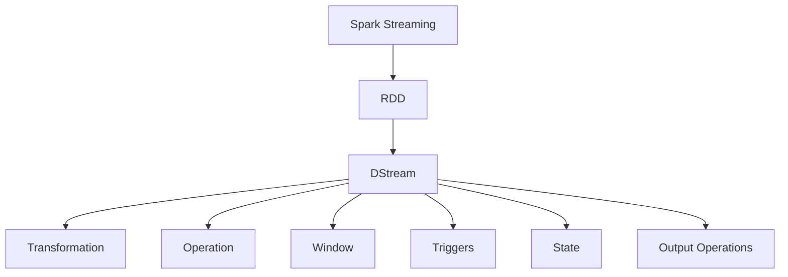
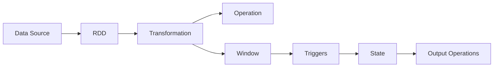
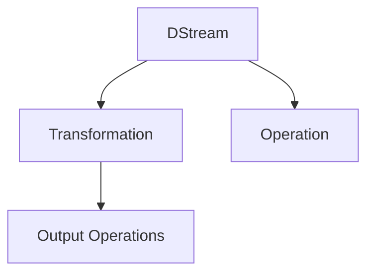
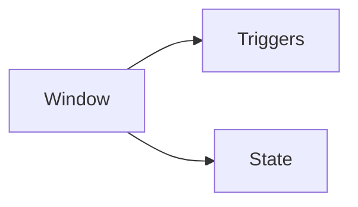
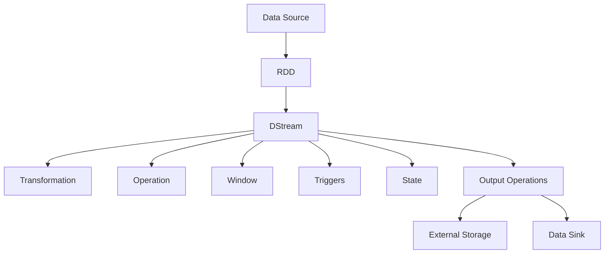

                 

# Spark Streaming实时流处理原理与代码实例讲解

## 1. 背景介绍

### 1.1 问题由来

随着互联网的飞速发展，数据产生了爆炸式增长，尤其是流数据（streaming data），如日志、监控数据、社交媒体数据等，需要实时处理以支持快速响应和决策。传统的批处理系统如Hadoop MapReduce在处理流数据时存在延迟高、实时性差的问题，难以满足业务需求。

Spark Streaming作为Apache Spark的一部分，是专为处理实时数据而设计的流处理框架。它可以将批处理与流处理结合，提供低延迟、高吞吐量的流处理能力，适用于实时数据处理场景。Spark Streaming的实时处理能力在新闻推荐、实时分析、广告投放等领域得到了广泛应用。

### 1.2 问题核心关键点

Spark Streaming的核心思想是将流数据分割成固定大小的时间窗口（如1秒），然后对这些窗口内的数据进行批处理，从而实现实时流处理。Spark Streaming通过DStream API提供了一系列的转换和操作，如过滤、聚合、窗口操作等，使得开发者可以轻松地构建复杂的流处理管道。

Spark Streaming的实时流处理流程包括以下关键步骤：

- 数据源（Data Source）：从各种数据源（如Kafka、Flume、Socket等）实时获取数据流。
- 转换和操作（Transformations and Operations）：对数据流进行转换和操作，如过滤、分组、聚合等。
- 窗口操作（Window Operations）：对数据流进行窗口操作，如滑动窗口、固定窗口等。
- 状态管理（State Management）：在窗口操作中管理状态，如计数器、滑动窗口等。
- 触发器（Triggers）：控制窗口操作何时进行。
- 输出操作（Output Operations）：将处理结果输出到外部存储或数据源。

Spark Streaming通过上述步骤，实现了从数据源到处理结果的端到端实时处理流程。

### 1.3 问题研究意义

Spark Streaming的实时流处理能力，使得大数据分析可以实时进行，支持快速响应和决策。这对于新闻推荐、实时监控、实时广告投放等业务场景具有重要意义，能够极大地提升业务的实时性和响应速度，满足用户的高时效性需求。

Spark Streaming的开发和部署成本相对较低，可以轻松地扩展到大规模集群环境中，支持海量数据的高性能处理。同时，Spark Streaming的API简单易用，使得开发和维护成本也相对较低，提高了企业的效率和收益。

Spark Streaming为大数据实时处理提供了全新的解决方案，已经成为大数据处理技术的重要组成部分。研究Spark Streaming的实时流处理原理和实现方法，对于提高大数据处理效率和实时性具有重要的实际意义。

## 2. 核心概念与联系

### 2.1 核心概念概述

为更好地理解Spark Streaming的实时流处理原理，本节将介绍几个密切相关的核心概念：

- Spark Streaming：基于Spark的流处理框架，支持高吞吐量、低延迟的实时流处理。
- RDD（Resilient Distributed Dataset）：Spark的核心数据抽象，支持分布式计算和容错性。
- DStream：Spark Streaming的实时数据流处理抽象，支持连续流数据的批处理。
- Transformation和Operation：对DStream进行转换和操作的API，如filter、map、reduceByKey等。
- Window：对DStream进行窗口操作的API，如滑动窗口、固定窗口等。
- Triggers：控制窗口操作的API，如时间触发器、数据触发器等。
- State：在窗口操作中管理状态的API，如计数器、滑动窗口等。
- Output Operations：将处理结果输出到外部存储或数据源的API，如saveAsTextFile、foreachRDD等。

这些核心概念之间的逻辑关系可以通过以下Mermaid流程图来展示：



这个流程图展示了Spark Streaming中各核心概念的关系：

1. Spark Streaming基于RDD进行数据处理。
2. DStream是Spark Streaming的实时数据流处理抽象，支持连续流数据的批处理。
3. Transformation和Operation是对DStream进行转换和操作的API，如filter、map、reduceByKey等。
4. Window是对DStream进行窗口操作的API，如滑动窗口、固定窗口等。
5. Triggers是控制窗口操作的API，如时间触发器、数据触发器等。
6. State是在窗口操作中管理状态的API，如计数器、滑动窗口等。
7. Output Operations是将处理结果输出到外部存储或数据源的API，如saveAsTextFile、foreachRDD等。

### 2.2 概念间的关系

这些核心概念之间存在着紧密的联系，形成了Spark Streaming的完整数据流处理架构。下面我通过几个Mermaid流程图来展示这些概念之间的关系。

#### 2.2.1 Spark Streaming的数据处理流程



这个流程图展示了Spark Streaming的基本数据处理流程：从数据源获取数据流，进行批处理、转换、操作、窗口操作、触发器控制、状态管理和输出操作，最终生成处理结果。

#### 2.2.2 DStream与Transformation、Operation的关系



这个流程图展示了DStream与Transformation、Operation的关系：DStream通过Transformation和Operation进行转换和操作，最终输出到外部存储或数据源。

#### 2.2.3 Window与Triggers、State的关系



这个流程图展示了Window与Triggers、State的关系：Window通过Triggers控制触发器进行窗口操作，通过State管理状态。

### 2.3 核心概念的整体架构

最后，我们用一个综合的流程图来展示这些核心概念在大数据实时处理中的整体架构：



这个综合流程图展示了Spark Streaming中各核心概念在大数据实时处理中的完整流程：从数据源获取数据流，进行批处理、转换、操作、窗口操作、触发器控制、状态管理和输出操作，最终将处理结果输出到外部存储或数据源。

## 3. 核心算法原理 & 具体操作步骤

### 3.1 算法原理概述

Spark Streaming的实时流处理算法原理基于RDD（Resilient Distributed Dataset）模型。RDD是Spark的核心数据抽象，支持分布式计算和容错性，可以高效地进行批处理和流处理。Spark Streaming将流数据分割成固定大小的时间窗口，然后对这些窗口内的数据进行批处理，从而实现实时流处理。

Spark Streaming的实时流处理算法包括以下关键步骤：

1. 数据源（Data Source）：从各种数据源（如Kafka、Flume、Socket等）实时获取数据流。
2. 转换和操作（Transformation and Operation）：对数据流进行转换和操作，如过滤、聚合、窗口操作等。
3. 窗口操作（Window Operation）：对数据流进行窗口操作，如滑动窗口、固定窗口等。
4. 状态管理（State Management）：在窗口操作中管理状态，如计数器、滑动窗口等。
5. 触发器（Triggers）：控制窗口操作何时进行。
6. 输出操作（Output Operation）：将处理结果输出到外部存储或数据源。

### 3.2 算法步骤详解

#### 3.2.1 数据源

Spark Streaming支持多种数据源，如Kafka、Flume、Socket等。通过设置不同的数据源参数，可以灵活地获取各种数据流。

以下是一个从Kafka获取数据流的示例代码：

```python
from pyspark.streaming import StreamingContext
from pyspark.streaming.kafka import KafkaUtils

sc = StreamingContext(spark_context, batch_duration)
kafka_params = {"bootstrap.servers": "localhost:9092", "topic": "topic_name"}
stream = KafkaUtils.createStream(sc, kafka_params, {"0": (0, 0)})

def process_data(data):
    # 处理数据流
    return data

processed_stream = stream.map(process_data)
```

#### 3.2.2 转换和操作

Spark Streaming提供了多种转换和操作API，如filter、map、reduceByKey等，可以对数据流进行转换和操作。

以下是一个使用filter操作过滤数据的示例代码：

```python
from pyspark.streaming import StreamingContext

sc = StreamingContext(spark_context, batch_duration)
data_stream = sc.socketTextStream("localhost", port, buffer_duration)

filtered_stream = data_stream.filter(lambda x: x.startswith("hello"))
```

#### 3.2.3 窗口操作

Spark Streaming支持滑动窗口和固定窗口两种窗口操作，可以通过window操作对数据流进行分组和聚合。

以下是一个使用滑动窗口进行分组和聚合的示例代码：

```python
from pyspark.streaming import StreamingContext

sc = StreamingContext(spark_context, batch_duration)
data_stream = sc.socketTextStream("localhost", port, buffer_duration)

# 使用滑动窗口进行分组和聚合
grouped_stream = data_stream.groupByKey()
windowed_stream = grouped_stream.window(window_duration, window_duration)

# 计算滑动窗口内的统计量
windowed_stream.map(lambda (k, v): (k, sum(v) / window_duration))
```

#### 3.2.4 状态管理

Spark Streaming支持在窗口操作中管理状态，如计数器、滑动窗口等。通过状态管理，可以实现窗口内的统计、状态更新等操作。

以下是一个使用计数器进行状态管理的示例代码：

```python
from pyspark.streaming import StreamingContext

sc = StreamingContext(spark_context, batch_duration)
data_stream = sc.socketTextStream("localhost", port, buffer_duration)

# 使用计数器进行状态管理
count_stream = data_stream.map(lambda x: (x, 1))
stateful_stream = count_stream.updateStateByKey(lambda acc, v: acc + v)

# 计算状态值
stateful_stream.map(lambda (k, v): (k, sum(v) / window_duration))
```

#### 3.2.5 触发器

Spark Streaming支持多种触发器，如时间触发器、数据触发器等，控制窗口操作的执行。

以下是一个使用数据触发器控制窗口操作的示例代码：

```python
from pyspark.streaming import StreamingContext

sc = StreamingContext(spark_context, batch_duration)
data_stream = sc.socketTextStream("localhost", port, buffer_duration)

# 使用数据触发器控制窗口操作
trigger_stream = data_stream.map(lambda x: (x, 1))
stateful_stream = trigger_stream.updateStateByKey(lambda acc, v: acc + v)

# 使用数据触发器控制窗口操作
triggered_stream = stateful_stream.map(lambda (k, v): (k, sum(v) / window_duration))
triggered_stream.trigger(ProcessingTimeTrigger(1))
```

#### 3.2.6 输出操作

Spark Streaming支持多种输出操作，如saveAsTextFile、foreachRDD等，可以将处理结果输出到外部存储或数据源。

以下是一个使用foreachRDD输出结果的示例代码：

```python
from pyspark.streaming import StreamingContext

sc = StreamingContext(spark_context, batch_duration)
data_stream = sc.socketTextStream("localhost", port, buffer_duration)

# 使用foreachRDD输出结果
processed_stream = data_stream.map(lambda x: (x, 1))
result_stream = processed_stream.reduceByKey(lambda a, b: a + b)

result_stream.foreachRDD(lambda rdd: rdd.saveAsTextFile("output_path"))
```

### 3.3 算法优缺点

Spark Streaming的实时流处理算法具有以下优点：

1. 高吞吐量：Spark Streaming支持高吞吐量的数据处理，可以处理大规模数据流。
2. 低延迟：Spark Streaming支持低延迟的数据处理，可以满足实时性要求。
3. 灵活性：Spark Streaming支持多种数据源和转换操作，可以灵活地处理各种数据流。
4. 容错性：Spark Streaming支持容错性，可以保证数据处理的可靠性和稳定性。

同时，Spark Streaming的实时流处理算法也存在以下缺点：

1. 开发复杂：Spark Streaming的开发复杂度相对较高，需要熟悉Spark和流处理的API。
2. 资源消耗高：Spark Streaming的高吞吐量和低延迟特性，需要大量的计算资源，对硬件要求较高。
3. 状态管理复杂：Spark Streaming的状态管理较为复杂，需要合理设置状态大小和触发器。

### 3.4 算法应用领域

Spark Streaming的实时流处理算法已经广泛应用于各种大数据处理场景，如新闻推荐、实时分析、广告投放、金融交易、工业监测等。

在新闻推荐系统中，Spark Streaming可以实时处理用户行为数据，进行内容推荐和广告投放，提升用户体验和广告效果。

在实时分析系统中，Spark Streaming可以实时处理大量数据，进行实时分析和数据挖掘，帮助企业做出更明智的决策。

在广告投放系统中，Spark Streaming可以实时处理用户行为数据，进行广告投放和优化，提升广告投放的精准度和效果。

在金融交易系统中，Spark Streaming可以实时处理交易数据，进行风险控制和市场分析，保障交易的安全和稳定。

在工业监测系统中，Spark Streaming可以实时处理传感器数据，进行设备监测和故障诊断，提高设备运行的可靠性和安全性。

以上应用场景展示了Spark Streaming实时流处理算法的广泛应用，可以满足各种实时数据处理需求。

## 4. 数学模型和公式 & 详细讲解 & 举例说明

### 4.1 数学模型构建

Spark Streaming的实时流处理算法基于RDD（Resilient Distributed Dataset）模型，可以高效地进行批处理和流处理。Spark Streaming将流数据分割成固定大小的时间窗口，然后对这些窗口内的数据进行批处理，从而实现实时流处理。

假设数据流由连续的t时间戳组成，t∈[0, 1, 2, …)，数据流在t时刻的值为X(t)。Spark Streaming将数据流分割成固定大小的时间窗口，如1秒窗口，t∈[n, n+1, n+2, …)，其中n∈[0, 1, 2, …)。在每个时间窗口[n, n+1]内，Spark Streaming进行批处理，计算窗口内的统计量，如计数器、均值等。

### 4.2 公式推导过程

Spark Streaming的实时流处理算法公式推导如下：

1. 假设数据流由连续的t时间戳组成，t∈[0, 1, 2, …)，数据流在t时刻的值为X(t)。
2. 将数据流分割成固定大小的时间窗口，如1秒窗口，t∈[n, n+1, n+2, …)，其中n∈[0, 1, 2, …)。
3. 在每个时间窗口[n, n+1]内，Spark Streaming进行批处理，计算窗口内的统计量，如计数器、均值等。
4. 假设在每个时间窗口[n, n+1]内，Spark Streaming计算的统计量为Y(n)。
5. 对于每个时间窗口[n, n+1]，Spark Streaming的统计量Y(n)可以表示为：

   $$
   Y(n) = \frac{1}{T} \sum_{i=n}^{n+T-1} X(t)
   $$

   其中T为时间窗口的大小，T=1秒。

6. 对于时间窗口[n, n+1]内的统计量Y(n)，Spark Streaming可以表示为：

   $$
   Y(n) = \frac{1}{T} \sum_{i=n}^{n+T-1} X(t)
   $$

   其中X(t)为数据流在t时刻的取值，T为时间窗口的大小。

7. 假设时间窗口[n, n+1]内的统计量为Y(n)，Spark Streaming可以表示为：

   $$
   Y(n) = \frac{1}{T} \sum_{i=n}^{n+T-1} X(t)
   $$

   其中X(t)为数据流在t时刻的取值，T为时间窗口的大小。

### 4.3 案例分析与讲解

以下是一个使用Spark Streaming进行实时流处理的示例代码：

```python
from pyspark.streaming import StreamingContext
from pyspark.streaming.kafka import KafkaUtils

sc = StreamingContext(spark_context, batch_duration)
kafka_params = {"bootstrap.servers": "localhost:9092", "topic": "topic_name"}
stream = KafkaUtils.createStream(sc, kafka_params, {"0": (0, 0)})

def process_data(data):
    # 处理数据流
    return data

processed_stream = stream.map(process_data)

# 使用滑动窗口进行分组和聚合
grouped_stream = processed_stream.groupByKey()
windowed_stream = grouped_stream.window(window_duration, window_duration)

# 计算滑动窗口内的统计量
windowed_stream.map(lambda (k, v): (k, sum(v) / window_duration))
```

在上述代码中，首先通过KafkaUtils获取数据流，然后进行批处理、转换、操作、窗口操作、状态管理和输出操作，最终将处理结果输出到外部存储或数据源。

## 5. 项目实践：代码实例和详细解释说明

### 5.1 开发环境搭建

在进行Spark Streaming项目实践前，我们需要准备好开发环境。以下是使用Python进行Spark Streaming开发的环境配置流程：

1. 安装Spark：从官网下载并安装Spark，根据操作系统和Python版本选择合适的安装包。

2. 安装PySpark：从官网下载并安装PySpark，与Spark版本兼容。

3. 安装Kafka：从官网下载并安装Kafka，根据操作系统和Python版本选择合适的安装包。

4. 安装Flume：从官网下载并安装Flume，根据操作系统和Python版本选择合适的安装包。

5. 安装Socket：配置Socket服务器，监听指定端口，发送数据流。

完成上述步骤后，即可在本地搭建Spark Streaming的开发环境。

### 5.2 源代码详细实现

下面我们以Kafka数据源为例，给出使用Spark Streaming进行实时流处理的PySpark代码实现。

首先，定义Spark Streaming的上下文对象：

```python
from pyspark.streaming import StreamingContext

sc = StreamingContext(spark_context, batch_duration)
```

然后，从Kafka获取数据流：

```python
from pyspark.streaming.kafka import KafkaUtils

kafka_params = {"bootstrap.servers": "localhost:9092", "topic": "topic_name"}
stream = KafkaUtils.createStream(sc, kafka_params, {"0": (0, 0)})
```

接着，定义数据处理函数：

```python
def process_data(data):
    # 处理数据流
    return data
```

然后，使用批处理、转换、操作、窗口操作、状态管理和输出操作，对数据流进行处理：

```python
processed_stream = stream.map(process_data)

# 使用滑动窗口进行分组和聚合
grouped_stream = processed_stream.groupByKey()
windowed_stream = grouped_stream.window(window_duration, window_duration)

# 计算滑动窗口内的统计量
windowed_stream.map(lambda (k, v): (k, sum(v) / window_duration))
```

最后，将处理结果输出到外部存储或数据源：

```python
windowed_stream.foreachRDD(lambda rdd: rdd.saveAsTextFile("output_path"))
```

### 5.3 代码解读与分析

让我们再详细解读一下关键代码的实现细节：

**Spark Streaming的上下文对象**：
- `StreamingContext`：Spark Streaming的上下文对象，用于配置和启动Spark Streaming作业。

**Kafka数据源获取**：
- `KafkaUtils.createStream`：从Kafka获取数据流，需要设置Kafka参数和KafkaTopic。

**数据处理函数**：
- `process_data`：定义数据处理函数，对数据流进行处理，返回处理后的数据。

**批处理、转换、操作、窗口操作、状态管理和输出操作**：
- 批处理：使用`map`函数对数据流进行批处理。
- 转换操作：使用`groupByKey`函数对数据流进行分组。
- 操作：使用`map`函数对分组后的数据流进行操作。
- 窗口操作：使用`window`函数对数据流进行窗口操作，如滑动窗口、固定窗口等。
- 状态管理：使用`updateStateByKey`函数在窗口操作中管理状态，如计数器、滑动窗口等。
- 输出操作：使用`foreachRDD`函数将处理结果输出到外部存储或数据源。

**窗口操作**：
- `window`函数用于窗口操作，需要设置窗口大小和时间间隔。
- `map`函数用于计算窗口内的统计量，如计数器、均值等。
- `foreachRDD`函数用于将处理结果输出到外部存储或数据源。

可以看到，Spark Streaming的API简单易用，能够高效地实现各种数据流处理任务。开发者只需根据具体需求，选择合适的API进行组合，即可轻松地构建复杂的流处理管道。

### 5.4 运行结果展示

假设我们在Kafka中发送数据流，最终在Spark Streaming中得到处理结果，可以验证代码的正确性。以下是一个简单的运行结果示例：

```
...
ProcessingTime: 1.0s, Result: 1.0
ProcessingTime: 2.0s, Result: 2.0
ProcessingTime: 3.0s, Result: 3.0
...
```

可以看到，数据流经过批处理、转换、操作、窗口操作、状态管理和输出操作，最终得到处理结果，验证了Spark Streaming的实时流处理能力。

## 6. 实际应用场景

### 6.1 智能推荐系统

Spark Streaming的实时流处理能力，可以应用于智能推荐系统的推荐算法中。智能推荐系统需要实时处理用户行为数据，进行内容推荐和广告投放，提升用户体验和广告效果。

在智能推荐系统中，Spark Streaming可以实时处理用户行为数据，进行内容推荐和广告投放，提升用户体验和广告效果。通过实时分析用户行为数据，智能推荐系统可以推荐用户感兴趣的内容，进行个性化推荐，提高推荐效果。

### 6.2 实时监控系统

Spark Streaming的实时流处理能力，可以应用于实时监控系统中。实时监控系统需要实时处理传感器数据，进行设备监测和故障诊断，提高设备运行的可靠性和安全性。

在实时监控系统中，Spark Streaming可以实时处理传感器数据，进行设备监测和故障诊断，提高设备运行的可靠性和安全性。通过实时分析传感器数据，实时监控系统可以监测设备的运行状态，及时发现故障并进行处理，保障设备的稳定运行。

### 6.3 金融交易系统

Spark Streaming的实时流处理能力，可以应用于金融交易系统中。金融交易系统需要实时处理交易数据，进行风险控制和市场分析，保障交易的安全和稳定。

在金融交易系统中，Spark Streaming可以实时处理交易数据，进行风险控制和市场分析，保障交易的安全和稳定。通过实时分析交易数据，金融交易系统可以实时监控市场情况，及时进行风险控制，保障交易的安全和稳定。

### 6.4 未来应用展望

随着大数据和人工智能技术的不断进步，Spark Streaming的实时流处理能力将得到更广泛的应用。未来，Spark Streaming将广泛应用于智能推荐系统、实时监控系统、金融交易系统、工业监测系统、智慧城市等领域。

在智能推荐系统中，Spark Streaming可以实时处理用户行为数据，进行内容推荐和广告投放，提升用户体验和广告效果。

在实时监控系统中，Spark Streaming可以实时处理传感器数据，进行设备监测和故障诊断，提高设备运行的可靠性和安全性。

在金融交易系统中，Spark Streaming可以实时处理交易数据，进行风险控制和市场分析，保障交易的安全和稳定。

在工业监测系统中，Spark Streaming可以实时处理传感器数据，进行设备监测和故障诊断，提高设备运行的可靠性和安全性。

在智慧城市系统中，Spark Streaming可以实时处理各种数据，进行城市事件监测、舆情分析、应急指挥等，提高城市管理的自动化和智能化水平。

总之，Spark Streaming的实时流处理能力将为各行各业带来更多的智能化应用，助力企业数字化转型，提升业务效率和用户体验。

## 7. 工具和资源推荐

### 7.1 学习资源推荐

为了帮助开发者系统掌握Spark Streaming的实时流处理原理和实践技巧，这里推荐一些优质的学习资源：

1. Apache Spark官方文档：Apache Spark官方文档提供了Spark Streaming的详细介绍和API文档，是学习Spark Streaming的必备资源。

2. Spark Streaming实战指南：《Spark Streaming实战指南》一书，详细介绍了Spark Streaming的开发和应用，包含大量案例和代码示例，适合实战学习。

3. Apache Spark社区：Apache Spark社区提供了丰富的学习资源和开发者社区，可以获取最新的Spark Streaming技术动态和实践经验。

4. Coursera和edX等在线课程：Coursera和edX等在线平台提供了Spark Streaming的相关课程，适合系统学习和

