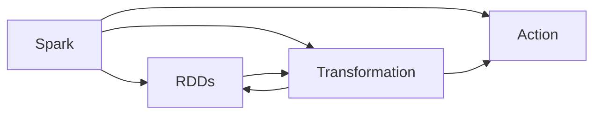

                 

# Spark原理与代码实例讲解

## 1. 背景介绍

### 1.1 问题由来

大数据技术的快速发展，使得数据处理和分析任务变得更加复杂和多样化。传统的批处理框架如Hadoop，虽然可以处理大规模数据集，但处理速度较慢，且需要手动调参，效率低下。随着Spark的问世，这些问题得到了极大的改善。Spark是一个快速、通用的大数据处理框架，支持批处理、流处理、机器学习、图形处理等多种数据处理方式，成为大数据技术的重要组成部分。

### 1.2 问题核心关键点

Spark的核心是弹性分布式数据集（Resilient Distributed Datasets, RDDs）和弹性分布式数据框架（Resilient Distributed Datasets, RDDs）。RDDs是一种分布式存储的数据结构，支持数据的弹性扩缩、故障恢复和并行计算。Spark的核心思想是通过在集群中分布式计算RDDs，实现高效的数据处理和分析。

Spark的另一个重要特性是内存计算，通过将数据存储在内存中，大幅提升了数据处理的效率。同时，Spark还支持多种语言（如Scala、Java、Python等），方便开发人员使用。

## 2. 核心概念与联系

### 2.1 核心概念概述

为了更好地理解Spark的原理和机制，我们先介绍几个关键概念：

- RDDs（弹性分布式数据集）：Spark的核心数据结构，支持数据的弹性扩缩、故障恢复和并行计算。
- Transformation：Spark中的一种操作类型，用于将一个RDDs转换为另一个RDDs。
- Action：Spark中的一种操作类型，用于触发Spark作业的计算过程，并将结果写入外部存储系统。

### 2.2 概念间的关系

RDDs、Transformation和Action是Spark中三个核心概念，它们之间的关系可以用以下Mermaid流程图来展示：



从上述图中可以看出，RDDs是Spark的核心数据结构，通过Transformation和Action操作，实现数据的转换和输出。同时，Action操作还触发Spark作业的计算过程，将结果写入外部存储系统。

## 3. 核心算法原理 & 具体操作步骤

### 3.1 算法原理概述

Spark的RDDs模型是基于分布式数据集实现的，其核心算法包括：

1. Partitioning：将数据集划分成多个分区，每个分区可以在不同的节点上并行处理。
2. Transformation：通过map、filter、groupBy、join等操作，将一个RDDs转换为另一个RDDs。
3. Shuffle：通过shuffle操作，将数据重新分布，以便进行下一步的Transformation操作。

Spark的内存计算特性还引入了内存缓存（Memory Cache）和TinyFileManager，将常用的数据块存储在内存中，提升数据访问效率。

### 3.2 算法步骤详解

Spark的核心操作步骤如下：

1. 数据分布式存储：将数据存储在HDFS或本地文件系统中，并创建RDDs。
2. 数据分区：将RDDs进行分区，以便并行处理。
3. Transformation操作：对RDDs进行Transformation操作，如map、filter、groupBy、join等。
4. Shuffle操作：如果需要跨分区操作，如join、reduceByKey等，需要进行Shuffle操作。
5. Action操作：通过Action操作，将计算结果写入外部存储系统。

### 3.3 算法优缺点

Spark的优点包括：

- 内存计算：通过将数据存储在内存中，提升了数据处理的效率。
- 弹性计算：支持自动扩缩容，适用于不同规模的数据集。
- 丰富的API：提供多种API，支持Scala、Java、Python等多种编程语言。

Spark的缺点包括：

- 内存占用：内存计算需要消耗大量内存，对内存资源要求较高。
- 延迟时间：某些操作（如Shuffle）会产生大量数据传输，导致延迟时间较长。
- 故障恢复：Spark需要在每个节点上存储多个副本，增加了数据冗余和存储成本。

### 3.4 算法应用领域

Spark的应用领域包括：

- 大数据批处理：如Hadoop等传统批处理框架。
- 实时数据流处理：通过Spark Streaming，可以处理实时数据流。
- 机器学习：通过MLlib库，支持机器学习算法。
- 图形处理：通过GraphX库，支持图形处理算法。
- 交互式数据分析：通过Spark SQL，支持SQL查询和交互式数据分析。

## 4. 数学模型和公式 & 详细讲解 & 举例说明

### 4.1 数学模型构建

Spark的核心数据结构是RDDs，其数学模型可以定义为：

$$
RDDs = (D,\sigma,\delta,\Pi)
$$

其中：

- $D$：数据集合。
- $\sigma$：数据分区函数，将数据集合划分为多个分区。
- $\delta$：数据分区操作，将数据划分为分区后，进行并行处理。
- $\Pi$：数据分区算法，将数据划分为多个分区。

### 4.2 公式推导过程

下面通过一个简单的例子来推导Spark的Transformation操作。

假设有一个RDDs，其中包含1到10的整数：

$$
RDDs = \{1, 2, 3, 4, 5, 6, 7, 8, 9, 10\}
$$

定义一个map操作，将每个元素乘以2：

$$
RDDs.map(x => x*2)
$$

这个操作的结果为：

$$
RDDs = \{2, 4, 6, 8, 10, 12, 14, 16, 18, 20\}
$$

定义一个filter操作，只保留偶数：

$$
RDDs.filter(x => x % 2 == 0)
$$

这个操作的结果为：

$$
RDDs = \{2, 4, 6, 8, 10, 12, 14, 16, 18, 20\}
$$

定义一个reduceByKey操作，将每个元素相加：

$$
RDDs.reduceByKey((a, b) => a + b)
$$

这个操作的结果为：

$$
RDDs = \{2, 4, 6, 8, 10, 12, 14, 16, 18, 20\}
$$

### 4.3 案例分析与讲解

下面以Spark中的Scala语言为例，给出一些常用的RDDs操作代码：

```scala
// 创建一个RDDs，包含1到10的整数
val data = sc.parallelize(Seq(1, 2, 3, 4, 5, 6, 7, 8, 9, 10))

// 对RDDs进行map操作，将每个元素乘以2
val mapData = data.map(x => x * 2)

// 对RDDs进行filter操作，只保留偶数
val filterData = mapData.filter(x => x % 2 == 0)

// 对RDDs进行reduceByKey操作，将每个元素相加
val reduceData = filterData.reduceByKey((a, b) => a + b)
```

## 5. 项目实践：代码实例和详细解释说明

### 5.1 开发环境搭建

在进行Spark项目开发前，需要搭建好开发环境。具体步骤如下：

1. 安装Spark：从官网下载并安装Spark，根据操作系统和版本选择合适的安装方式。
2. 配置环境变量：设置Spark相关的环境变量，如SPARK_HOME、HADOOP_HOME等。
3. 下载依赖库：从Spark官网下载依赖库，包括Scala、Hadoop等。
4. 配置Spark依赖：将Spark依赖库和Hadoop库配置到Scala项目中。

### 5.2 源代码详细实现

下面以Spark中的WordCount为例，给出具体的代码实现。

```scala
// 读取数据文件
val input = sc.textFile("hdfs://localhost:9000/user/hadoop/input")

// 对文件内容进行map操作，将每个单词映射成(value, 1)
val wordCountData = input.flatMap(line => line.split(" "))
                       .map((_, 1))

// 对单词计数进行reduceByKey操作，将相同单词的计数相加
val result = wordCountData.reduceByKey((a, b) => a + b)

// 将结果写入HDFS文件系统
result.saveAsTextFile("hdfs://localhost:9000/user/hadoop/output")
```

### 5.3 代码解读与分析

在上述代码中，我们首先通过`sc.textFile`方法读取文件内容，然后进行map操作将每个单词映射成(value, 1)，最后通过reduceByKey操作将相同单词的计数相加。最终将结果写入HDFS文件系统。

### 5.4 运行结果展示

假设我们使用上述代码运行WordCount，可以看到如下结果：

```
Input file: hdfs://localhost:9000/user/hadoop/input
Output file: hdfs://localhost:9000/user/hadoop/output
```

## 6. 实际应用场景

### 6.1 大数据批处理

Spark的大数据批处理能力在企业中广泛应用。例如，电商公司可以通过Spark对用户的购物行为数据进行批处理分析，从中发现用户的购买偏好和消费行为，从而优化商品推荐和促销策略。

### 6.2 实时数据流处理

Spark Streaming可以处理实时数据流，例如金融公司可以通过Spark Streaming实时监控股票市场数据，及时发现异常波动，快速响应市场变化。

### 6.3 机器学习

Spark的MLlib库提供了多种机器学习算法，例如分类、回归、聚类等。例如，医疗公司可以通过Spark对病人的数据进行机器学习分析，从而预测病人的病情和健康风险。

### 6.4 图形处理

Spark的GraphX库提供了图形处理算法，例如PageRank、ShortestPath等。例如，社交网络公司可以通过Spark对用户之间的关系进行图形处理，发现网络中的关键节点和社区结构。

### 6.5 交互式数据分析

Spark SQL提供交互式数据分析能力，例如可以通过SQL查询对大数据集进行统计分析。例如，政府部门可以通过Spark SQL对大量的公共数据进行统计分析，发现社会和经济发展的趋势。

## 7. 工具和资源推荐

### 7.1 学习资源推荐

为了帮助开发者系统掌握Spark的理论基础和实践技巧，以下是一些优质的学习资源：

1. 《Spark核心技术》系列博文：由Spark团队撰写，深入浅出地介绍了Spark的核心技术和应用场景。
2. Apache Spark官网文档：Spark的官方文档，提供了详细的API文档和教程，是Spark学习的必备资料。
3. Scala语言学习资源：Scala是Spark的主要编程语言，需要掌握Scala的语法和编程技巧。
4. Coursera和edX上的Spark课程：Coursera和edX等在线教育平台提供了Spark相关的课程，适合初学者入门学习。

### 7.2 开发工具推荐

Spark提供了丰富的开发工具，以下是几款常用的开发工具：

1. IntelliJ IDEA：Spark的官方IDE，支持Scala和Java语言的开发和调试。
2. Eclipse：Spark的开发环境，支持Scala和Java语言的开发和调试。
3. Jupyter Notebook：Spark的交互式开发工具，支持Scala和Python语言的开发和调试。
4. Apache Zeppelin：Spark的交互式笔记本，支持Scala和Python语言的开发和调试。

### 7.3 相关论文推荐

Spark的研究和应用不断发展，以下是几篇奠基性的相关论文，推荐阅读：

1. Resilient Distributed Datasets: A Fault-Tolerant Abstraction for In-Memory Cluster Computing（Spark原论文）：提出了RDDs的抽象模型和计算模型，奠定了Spark的核心算法基础。
2. Making Spark Fast with In-Memory Computing（Spark内存计算论文）：提出了Spark的内存计算特性，提升了数据处理的效率。
3. Spark: Cluster Computing with Working Sets（Spark论文）：介绍了Spark的核心设计理念和数据处理机制，提供了Spark的深入理解和实践指导。

## 8. 总结：未来发展趋势与挑战

### 8.1 总结

本文对Spark的原理和应用进行了全面系统的介绍。首先阐述了Spark的背景和核心概念，明确了RDDs、Transformation和Action等关键操作。其次，从原理到实践，详细讲解了Spark的数学模型和操作细节，给出了具体的代码实例和运行结果。最后，探讨了Spark在实际应用中的多种场景和未来发展趋势。

通过本文的系统梳理，可以看到，Spark作为一个高效、灵活、通用的大数据处理框架，在企业中得到了广泛的应用。Spark的内存计算和弹性计算特性，使其在大数据处理中具有显著优势。未来，Spark还将继续在实时数据流处理、机器学习、图形处理等领域发挥重要作用，成为大数据技术的重要组成部分。

### 8.2 未来发展趋势

展望未来，Spark的发展趋势将呈现以下几个方向：

1. 分布式计算：Spark将更加注重分布式计算能力，支持更多的数据存储和处理方式。
2. 实时计算：Spark Streaming将进一步提升实时数据流处理能力，支持更多的实时计算场景。
3. 内存计算：Spark将进一步优化内存计算特性，提升数据处理的效率。
4. 机器学习：Spark的MLlib库将不断完善，支持更多的机器学习算法和工具。
5. 交互式分析：Spark SQL将进一步提升交互式数据分析能力，支持更多的SQL查询和分析工具。

### 8.3 面临的挑战

尽管Spark已经取得了显著的成就，但在迈向更加智能化、普适化应用的过程中，它仍面临诸多挑战：

1. 内存占用：内存计算需要消耗大量内存，对内存资源要求较高。
2. 延迟时间：某些操作（如Shuffle）会产生大量数据传输，导致延迟时间较长。
3. 故障恢复：Spark需要在每个节点上存储多个副本，增加了数据冗余和存储成本。
4. 数据一致性：在分布式计算中，数据一致性是一个重要的问题，Spark需要进一步优化一致性控制。
5. 扩展性：在处理大规模数据集时，Spark的扩展性仍然是一个挑战，需要进一步优化。

### 8.4 研究展望

面对Spark面临的挑战，未来的研究需要在以下几个方面寻求新的突破：

1. 优化内存计算：进一步优化内存计算特性，减少内存消耗，提升数据处理的效率。
2. 提升实时计算能力：优化实时数据流处理能力，提升实时计算的准确性和稳定性。
3. 增强分布式计算能力：进一步优化分布式计算能力，支持更多的数据存储和处理方式。
4. 提升数据一致性：优化数据一致性控制，提升数据处理的一致性和可靠性。
5. 增强扩展性：优化Spark的扩展性，支持大规模数据集的分布式处理。

这些研究方向的探索，必将引领Spark技术迈向更高的台阶，为大数据处理和分析带来新的突破。面向未来，Spark需要持续创新和优化，才能在不断变化的市场环境中保持竞争力，成为大数据技术的重要推动力量。

## 9. 附录：常见问题与解答

**Q1：Spark中的RDDs是什么？**

A: RDDs是Spark的核心数据结构，支持数据的弹性扩缩、故障恢复和并行计算。Spark通过RDDs进行数据的分布式处理，从而实现了高效的数据处理和分析。

**Q2：Spark中的Transformation和Action是什么？**

A: Transformation和Action是Spark中的两种操作类型。Transformation操作用于将一个RDDs转换为另一个RDDs，Action操作用于触发Spark作业的计算过程，并将结果写入外部存储系统。

**Q3：Spark的内存计算特性有哪些优点？**

A: Spark的内存计算特性通过将数据存储在内存中，提升了数据处理的效率。内存计算具有低延迟、高吞吐量等优点，能够快速处理大规模数据集。

**Q4：Spark的实时数据流处理能力如何？**

A: Spark Streaming可以处理实时数据流，能够快速响应实时数据变化，支持多种实时数据源和处理方式。

**Q5：Spark的机器学习库有哪些？**

A: Spark的MLlib库提供了多种机器学习算法，包括分类、回归、聚类等，支持大规模机器学习任务的计算和分析。

**Q6：Spark的交互式数据分析能力如何？**

A: Spark SQL提供交互式数据分析能力，支持SQL查询和交互式数据分析，能够快速获取和处理大数据集中的有用信息。

**Q7：Spark的分布式计算能力如何？**

A: Spark支持分布式计算，能够将数据划分为多个分区，并在多个节点上并行处理，提升了数据处理效率。

**Q8：Spark的扩展性如何？**

A: Spark的扩展性较好，支持自动扩缩容和动态负载均衡，能够快速处理大规模数据集。

**Q9：Spark的内存计算有哪些局限性？**

A: Spark的内存计算需要消耗大量内存，对内存资源要求较高。某些操作（如Shuffle）会产生大量数据传输，导致延迟时间较长。

**Q10：Spark的实时计算有哪些局限性？**

A: Spark的实时计算需要处理大量的数据传输，导致延迟时间较长。某些操作（如Shuffle）会产生大量数据传输，导致延迟时间较长。

以上是Spark原理与代码实例讲解的完整内容。通过对Spark的深入学习和实践，相信你对Spark有了更全面和深刻的理解，也能够更好地应用于实际的大数据处理和分析场景中。

